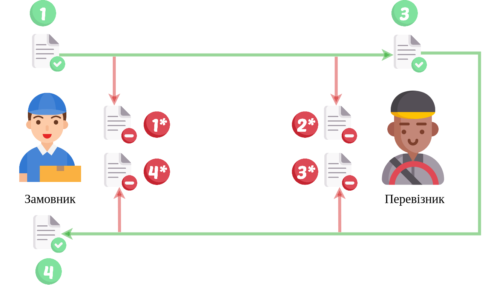

Алгоритм "Заявка на транспортування"->"Підтвердження транспортування"
#############################################################################################

.. role:: red

.. role:: underline

.. role:: green

.. role:: purple

----------------------------------------------------

----------------------------------------------------

1.1 `Авторизація Замовника <https://wiki.edin.ua/uk/latest/API_ETTN/Methods/Authorization.html>`__

1.2 `Створення/редагування чернетки «Заявка на транспортування» <https://wiki.edin.ua/uk/latest/API_ETTN/Methods/CreateBooking.html>`__

1.3 `Підписання «Заявки на транспортування» Замовником <https://wiki.edin.ua/uk/latest/API_ETTN/Methods/SaveEttnV2Sign.html>`__

1.4 `Відправка «Заявки на транспортування» Замовником <https://wiki.edin.ua/uk/latest/API_ETTN/Methods/DocSend.html>`__

1.5 `Відхилення «Заявки на транспортування» Замовником <https://wiki.edin.ua/uk/latest/API_ETTN/Methods/DocReject.html>`__

-----------------------------------------------

.. image:: pics/ETTN_API_work_12.png
   :height: 31px
   :width: 31px

2.1* `Авторизація Перевізника <https://wiki.edin.ua/uk/latest/API_ETTN/Methods/Authorization.html>`__

2.2* `Відхилення «Заявки на транспортування» Перевізником <https://wiki.edin.ua/uk/latest/API_ETTN/Methods/DocReject.html>`__

-----------------------------------------------

3.1 `Авторизація Перевізника <https://wiki.edin.ua/uk/latest/API_ETTN/Methods/Authorization.html>`__

3.2 `Створення/редагування чернетки «Підтвердження транспортування» <https://wiki.edin.ua/uk/latest/API_ETTN/Methods/CreateBookingConfirmation.html>`__

3.3 `Підписання «Підтвердження транспортування» Перевізником <https://wiki.edin.ua/uk/latest/API_ETTN/Methods/SaveEttnV2Sign.html>`__

3.4 `Відправка «Підтвердження транспортування» Перевізником <https://wiki.edin.ua/uk/latest/API_ETTN/Methods/DocSend.html>`__

.. image:: pics/ETTN_API_work_14.png
   :height: 31px
   :width: 31px

3.5 `Відхилення «Підтвердження транспортування» Перевізником <https://wiki.edin.ua/uk/latest/API_ETTN/Methods/DocReject.html>`__

-----------------------------------------------

4.1 `Авторизація Вантажоотримувача <https://wiki.edin.ua/uk/latest/API_ETTN/Methods/Authorization.html>`__

4.2 `Підписання «Підтвердження транспортування» Замовником <https://wiki.edin.ua/uk/latest/API_ETTN/Methods/SaveEttnV2Sign.html>`__

.. image:: pics/ETTN_API_work_18.png
   :height: 31px
   :width: 31px

4.2* `Відхилення «Підтвердження транспортування» Замовником <https://wiki.edin.ua/uk/latest/API_ETTN/Methods/DocReject.html>`__

-----------------------------------------------

**Додаткові методи API**
=============================

