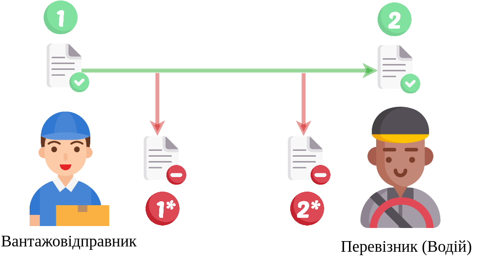

Алгоритм "Акта про відмову вантажити" (LoadRejectAct)
#####################################################################################################################

.. role:: red

.. role:: underline

.. role:: green

.. role:: purple

----------------------------------------------------

----------------------------------------------------

.. raw:: html

    <embed>
    <iframe src="https://docs.google.com/spreadsheets/d/e/2PACX-1vR4frexHTOelX507gkoPfGk_2ewyRR5FHCiEneMoo1khyjPVcV9631kkj-SbkVgtEJj5LZnhVP4B2qb/pubhtml?gid=1356351269&single=true&range=A2:E8" width="1100" height="300" frameborder="0" marginheight="0" marginwidth="0">Loading...</iframe>
    </embed>

.. important::
   Повний опис всіх додаткових транзакцій та змін, що вносяться в ТТН при формуванні Актів за `посиланням <https://wiki.edin.ua/uk/latest/API_ETTNv3_1/Additional_transactions.html>`__.

----------------------------------------------------

.. csv-table:: 
  :file: LoadRejectActv3_API_work.csv
  :widths:  40, 40
  :stub-columns: 0

-----------------------------------------------

.. toggle-header::
    :header: **Додаткові методи API**

    * `Отримання інформації про підписантів е-ТТН та Актів v3 (family=7) <https://wiki.edin.ua/uk/latest/API_ETTNv3_1/Methods/GetEttnSignInfo.html>`__
    * `Отримати значення з віртуального довідника <https://wiki.edin.ua/uk/latest/integration_2_0/APIv2/Methods/GetVirtualDictionary.html>`__
    * `Додати значення в довідник <https://wiki.edin.ua/uk/latest/integration_2_0/APIv2/Methods/PostVirtualDictionaryValues.html>`__
    * `Отримання інформації про організацію по Назві/ІПН/КПП/GLN <https://wiki.edin.ua/uk/latest/integration_2_0/APIv2/Methods/OasIdentifiers.html>`__
    * `Отримання мета-даних документа <https://wiki.edin.ua/uk/latest/integration_2_0/APIv2/Methods/GetDocument.html>`__
    * `Отримання списку подій з ЦБД <https://wiki.edin.ua/uk/latest/API_ETTNv3_1/Methods/MintransEvents.html>`__

