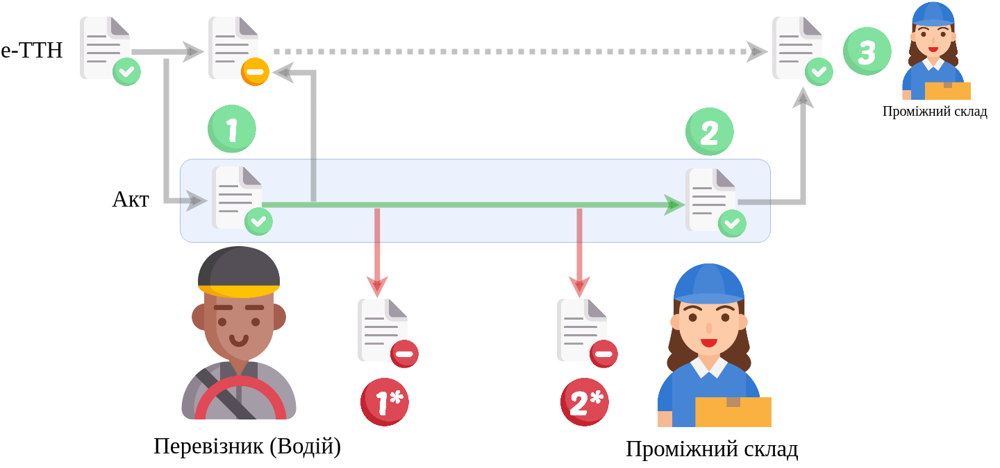

Алгоритм "Акт розвантаження на проміжному складі" (StorageDeliveryAct)
#####################################################################################################################

.. role:: red

.. role:: underline

.. role:: green

.. role:: purple

----------------------------------------------------

----------------------------------------------------

.. raw:: html

    <embed>
    <iframe src="https://docs.google.com/spreadsheets/d/e/2PACX-1vR4frexHTOelX507gkoPfGk_2ewyRR5FHCiEneMoo1khyjPVcV9631kkj-SbkVgtEJj5LZnhVP4B2qb/pubhtml?gid=1455117501&single=true&range=A2:E8" width="1100" height="350" frameborder="0" marginheight="0" marginwidth="0">Loading...</iframe>
    </embed>

.. important::
   Повний опис всіх додаткових транзакцій та змін, що вносяться в ТТН при формуванні Актів за `посиланням <https://wiki.edin.ua/uk/latest/API_ETTNv3_1/Additional_transactions.html>`__.

----------------------------------------------------

.. csv-table:: 
  :file: StorageDeliveryActv3_API_work.csv
  :widths:  40, 40
  :stub-columns: 0

.. третій блок був
   :green:`3.1` `Авторизація Проміжного складу <https://wiki.edin.ua/uk/latest/integration_2_0/APIv2/Methods/Authorization.html>`__

   :green:`3.2` `Отримання контенту (json) «Акта розвантаження на проміжному складі» <https://wiki.edin.ua/uk/latest/API_ETTNv3_1/Methods/GetEcmrDocumentBody.html>`__

   :green:`3.3` `Отримання тіла документа (рекомендовано в json) «е-ТТН» для подальшого доповнення <https://wiki.edin.ua/uk/latest/API_ETTNv3_1/Methods/GetEcmrDocumentBody.html>`__

   :green:`3.4` `Доповнення тіла та створення/редагування нової транзакції (чернетки) до е-ТТН документа Проміжним складом <https://wiki.edin.ua/uk/latest/API_ETTNv3_1/Methods/PostEcmrTransaction.html>`__

   :green:`3.5` `Отримання тіла документа (рекомендовано в ecmr) «е-ТТН» для подальшого підписання Проміжним складом <https://wiki.edin.ua/uk/latest/API_ETTNv3_1/Methods/GetEcmrDocumentBody.html>`__

   :green:`3.6` `Підписання змін до «е-ТТН» Проміжним складом <https://wiki.edin.ua/uk/latest/API_ETTNv3_1/Methods/SaveEcmrSign.html>`__

   :green:`3.7` `Відправка нової транзакції до е-ТТН документа Проміжним складом <https://wiki.edin.ua/uk/latest/API_ETTNv3_1/Methods/PutEcmrTransaction.html>`__

-----------------------------------------------

.. toggle-header::
    :header: **Додаткові методи API**

    * `Отримання інформації про підписантів е-ТТН та Актів v3 (family=7) <https://wiki.edin.ua/uk/latest/API_ETTNv3_1/Methods/GetEttnSignInfo.html>`__
    * `Отримати значення з віртуального довідника <https://wiki.edin.ua/uk/latest/integration_2_0/APIv2/Methods/GetVirtualDictionary.html>`__
    * `Додати значення в довідник <https://wiki.edin.ua/uk/latest/integration_2_0/APIv2/Methods/PostVirtualDictionaryValues.html>`__
    * `Отримання інформації про організацію по Назві/ІПН/КПП/GLN <https://wiki.edin.ua/uk/latest/integration_2_0/APIv2/Methods/OasIdentifiers.html>`__
    * `Отримання мета-даних документа <https://wiki.edin.ua/uk/latest/integration_2_0/APIv2/Methods/GetDocument.html>`__
    * `Отримання списку подій з ЦБД <https://wiki.edin.ua/uk/latest/API_ETTNv3_1/Methods/MintransEvents.html>`__

