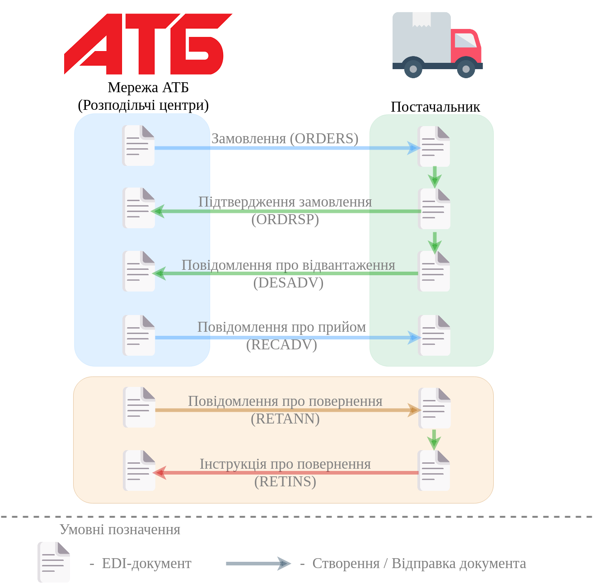
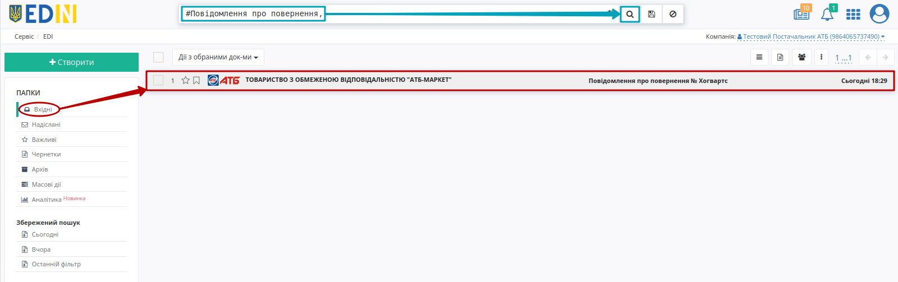
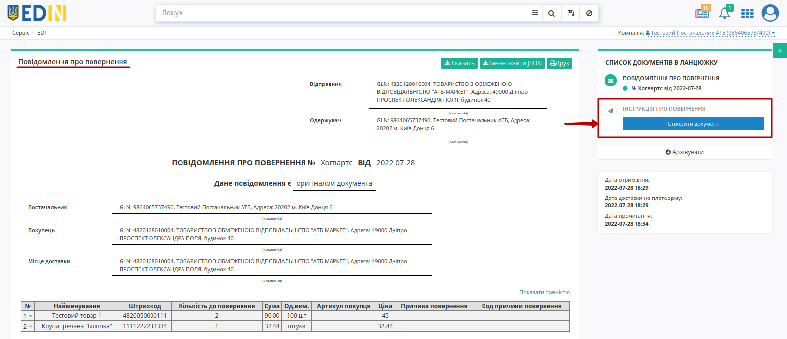
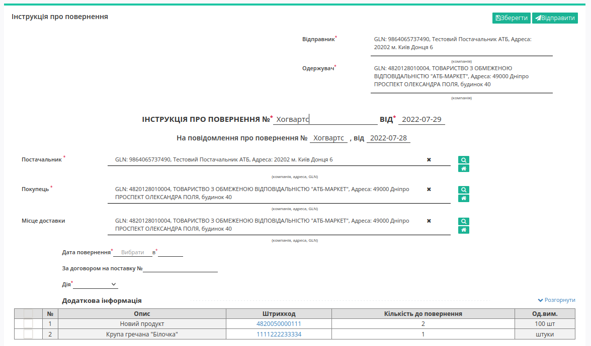
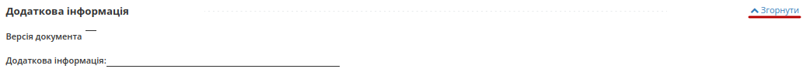
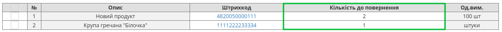
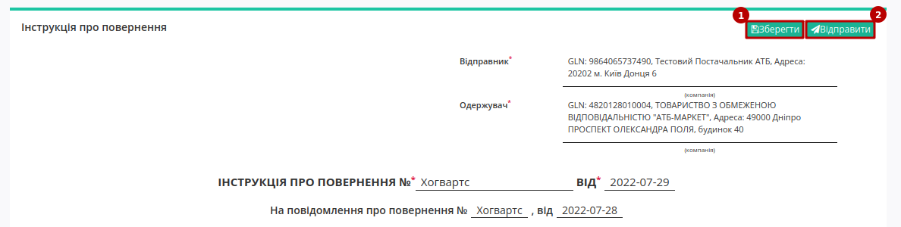

########################################################################################################################
Документообіг з мережею "АТБ" на платформі EDI Network 2.0: "Розподільчі центри". Інструкція для Постачальника
########################################################################################################################

.. сюда закину немного картинок для текста

.. |лупа| image:: pics_ATB_distribution_centers/ATB_distribution_centers_003.png

.. |будинок| image:: pics_ATB_distribution_centers/ATB_distribution_centers_004.png

.. role:: red

.. contents:: Зміст:
   :depth: 2

---------

Вступ
====================================

Дана інструкція описує порядок документообігу з мережею "АТБ" на платформі EDI Network 2.0 за схемою передбаченою для розподільчих центрів. В документообігу приймають участь наступні документи:

- `Замовлення <https://wiki.edin.ua/uk/latest/ClientProcesses/ATB/ATB_XML-structure.html#order>`__
- `Підтвердження замовлення <https://wiki.edin.ua/uk/latest/ClientProcesses/ATB/ATB_XML-structure.html#ordrsp>`__
- `Повідомлення про відвантаження <https://wiki.edin.ua/uk/latest/ClientProcesses/ATB/ATB_XML-structure.html#desadv>`__
- `Повідомлення про прийом <https://wiki.edin.ua/uk/latest/EDIN_Specs/XML/RECADV_x.html>`__
- `Повідомлення про повернення <https://wiki.edin.ua/uk/latest/EDIN_Specs/XML/RETANN_x.html>`__
- `Інструкція про повернення <https://wiki.edin.ua/uk/latest/EDIN_Specs/XML/RETINS_x.html>`__

**Загальна схема документообігу:**

1 Вхід на платформу
====================================

.. include:: /general_2_0/rabota_s_platformoj_EDIN_2.0.rst
   :start-after: .. початок блоку для Enter
   :end-before: .. кінець блоку для Enter

Після успішної авторизації відкриється основне меню, де у вкладці **"Продукти та рішення"** EDIN потрібно обрати сервіс **"EDI Network"**:

.. image:: /_constant/pics_landing/landing_edi.png
   :align: center

2 Формування "Підтвердження замовлення" (ORDRSP) у відповідь на вхідне "Замовлення" (ORDER). Сторона Постачальника
=========================================================================================================================

Для формування "Підтвердження замовлення" (ORDRSP) потрібно у папці **"Вхідні"** обрати "Замовлення" (ORDER), за яким потрібно зробити підтвердження. Документ відображається у **"Вхідних"** (для зручності можливо скористатись `пошуком <https://wiki.edin.ua/uk/latest/general_2_0/rabota_s_platformoj_EDIN_2.0.html#doc-search>`__):

.. image:: /ClientProcesses/ATB/ATB_Instructions/pics_ATB_International_deliveries_instruction/ATB_International_deliveries_instruction_041.png
   :align: center

Потрібно відкрити вхідне "Замовлення" (ORDER) лівою кнопкою миші та створити "Підтвердження замовлення" (ORDRSP) в блоці `ланцюжка документів <https://wiki.edin.ua/uk/latest/_constant/chain/chain.html>`__ для мережі "АТБ" за допомогою кнопки **"Створити документ"** (документ створиться автоматично):

.. image:: /ClientProcesses/ATB/ATB_Instructions/pics_ATB_International_deliveries_instruction/ATB_International_deliveries_instruction_042.png
   :align: center

У відкритій формі "Підтвердження замовлення" (ORDRSP) деякі поля заповнюються автоматично з пов'язаного "Замовлення" (обов'язкові до заповнення поля позначені червоною зірочкою :red:`*`):

.. image:: /ClientProcesses/ATB/ATB_Instructions/pics_ATB_International_deliveries_instruction/ATB_International_deliveries_instruction_049.png
   :align: center

#. **Одержувач** - дані одержувача (мережі), не підлягають редагуванню
#. **Підтвердження замовлення** - поле для вибору типу: *Підтвердження замовлення*, *Заміна підтвердження замовлення*, *Видалення підтвердження замовлення*;
#. **№** - номер підтвердження замовлення;
#. **від** - дата підтвердження замовлення, за замовчуванням вказана поточна дата;
#. **Покупець** - заповнюється автоматично або за допомогою кнопки "Пошук контрагента" (|лупа|), або за допомогою кнопки "Вказати себе" (|будинок|);
#. **Постачальник** - заповнюється автоматично або за допомогою кнопки "Пошук контрагента" (|лупа|), або за допомогою кнопки "Вказати себе" (|будинок|);
#. **Місце доставки** - заповнюється автоматично або за допомогою кнопки "Пошук контрагента" (|лупа|), або за допомогою кнопки "Вказати себе" (|будинок|).

.. hint::
   За допомогою кнопки **"Пошук контрагента"** (|лупа|) або ж за допомогою кнопки **"Вказати себе"** (|будинок|) можливо вказати чи змінити дані Покупця або Постачальника. Для пошуку введіть назву компанії, GLN або ІПН:

   .. image:: /ClientProcesses/ATB/ATB_Instructions/pics_ATB_International_deliveries_instruction/ATB_International_deliveries_instruction_005.png
      :align: center

.. вирішили прибрати, але для інших інструкцій ок - Блоки **Додаткова інформація** та **Рампи** необов'язкові для заповнення і "згорнуті" за замовчуванням. Блок **Разом** розраховується автоматично після заповнення позицій.

   .. image:: pics_ATB_International_deliveries_instruction/ATB_International_deliveries_instruction_018.png
      :align: center

В табличній частині відображається основна інформація по замовлених **товарних позиціях**. **Товарні позиції** переносяться з Замовлення: їх можна додати, змінити, підтвердити/відхилити чи видалити.

:red:`Всі зміни за позиціями тільки після узгодження з мережею!`

Після того, як товарні позиції будуть обрані (відмічені чекером) над ними доступні наступні **"Дії над вибраними"** : **Буде доставлено** або **Відмовлено**. У колонці **Дії** - відображається статус дії в обраній позиції. В залежності від обраної дії за позицією закріпляється відповідний статус (статус **Зміни кількості** проставляється автоматично, якщо "Підтверджена кількість" відрізняється від "Замовленої кількості").

.. image:: /ClientProcesses/ATB/ATB_Instructions/pics_ATB_International_deliveries_instruction/ATB_International_deliveries_instruction_050.png
   :align: center
  
Постачальник може редагувати позиції прямо в таблиці чи в розширеній формі "Дані товару" після натискання на штрихкод позиції:

.. image:: /ClientProcesses/ATB/ATB_Instructions/pics_ATB_International_deliveries_instruction/ATB_International_deliveries_instruction_051.png
   :align: center

Також можливо **"Клонувати"** позиції в таблицю в яких можливо буде вказати різні (старі/нові) значення "Максимальної роздрібної ціни" (МРЦ):

.. image:: /ClientProcesses/ATB/ATB_Instructions/pics_ATB_International_deliveries_instruction/ATB_International_deliveries_instruction_052.png
   :align: center

.. note::
   При клонуванні табличної позиції дані "Максимальної роздрібної ціни" та "Підтвердженої кількості" не клонуються. Якщо по якійсь з позицій не буде поставки її необхідно відзначити галочкою і **"Видалити"**.

.. вирішили прибрати, але для інших інструкцій ок - Можливо також додати іншу позицію з Товарного довідника, заповнивши форму **Додати позицію** через кнопку **"+Додати"** (обов'язкові до заповнення поля позначені червоною зірочкою :red:`*`).

   .. image:: pics_ATB_International_deliveries_instruction/ATB_International_deliveries_instruction_020.png
      :align: center

.. attention::
   Підтверджена кількість товарних позицій не може перевищувати зазначену в "Замовленні"!

Після внесення всіх даних в документ, натисніть кнопку **"Зберегти"** (1), потім **"Відправити"** (2).

.. image:: /ClientProcesses/ATB/ATB_Instructions/pics_ATB_International_deliveries_instruction/ATB_International_deliveries_instruction_021.png
   :align: center

Відправлений документ автоматично потрапляє в папку **"Надіслані"** і буде знаходиться в ланцюжку документів разом із "Замовленням".

.. image:: /ClientProcesses/ATB/ATB_Instructions/pics_ATB_International_deliveries_instruction/ATB_International_deliveries_instruction_022.png
   :align: center

3 Формування "Повідомлення про відвантаження" (DESADV). Сторона Постачальника
=========================================================================================================================

Для формування "Повідомлення про відвантаження" (DESADV) потрібно у папці **"Надіслані"** обрати "Підтвердження замовлення" (ORDRSP), за яким потрібно зробити відвантаження (для зручності можливо скористатись `пошуком <https://wiki.edin.ua/uk/latest/general_2_0/rabota_s_platformoj_EDIN_2.0.html#doc-search>`__):

.. image:: /ClientProcesses/ATB/ATB_Instructions/pics_ATB_International_deliveries_instruction/ATB_International_deliveries_instruction_045.png
   :align: center

Потрібно відкрити надіслане "Підтвердження замовлення" (ORDRSP) лівою кнопкою миші та створити "Повідомлення про відвантаження" (DESADV) в блоці `ланцюжка документів <https://wiki.edin.ua/uk/latest/_constant/chain/chain.html>`__ для мережі "АТБ" за допомогою кнопки **"Створити документ"** (документ створиться автоматично):

.. image:: /ClientProcesses/ATB/ATB_Instructions/pics_ATB_International_deliveries_instruction/ATB_International_deliveries_instruction_046.png
   :align: center

У відкритій формі "Повідомлення про відвантаження" (DESADV) деякі поля заповнюються автоматично з пов'язаного документа-підстави (обов'язкові до заповнення поля позначені червоною зірочкою :red:`*`):

.. note::
   Документ "Повідомлення про відвантаження" (DESADV) підтримує версійність (на рівні одного `ланцюжка документів <https://wiki.edin.ua/uk/latest/_constant/chain/chain.html>`__). Якщо мережа відхиляє сформовану ТТН, необхідно переробити весь ланцюжок документів, починаючи з "Повідомлення про відвантаження" (DESADV). При заміні документа (номер документа зберігається) потрібно збільшувати значення **"Версії"** документа на одиницю (n+1).

.. image:: /ClientProcesses/ATB/ATB_Instructions/pics_ATB_International_deliveries_instruction/ATB_International_deliveries_instruction_027.png
   :align: center

#. **Одержувач** - дані одержувача (мережі), компанія;
#. **Повідомлення про відвантаження №** - номер "Повідомлення про відвантаження";
#. **від** - дата "Повідомлення про відвантаження", за замовчуванням вказана поточна дата;
#. **Доставка буде проведена** - дата і час доставки;
#. **Версія** - версія документа. Числове значення вказується автоматично і не може бути меншим за версію попередніх "Повідомлень про відвантаження" (DESADV) в ланцюжку документів;
#. **Постачальник** - заповнюється автоматично або за допомогою кнопки "Пошук контрагента" (|лупа|), або за допомогою кнопки "Вказати себе" (|будинок|);
#. **Покупець** - заповнюється автоматично або за допомогою кнопки "Пошук контрагента" (|лупа|), або за допомогою кнопки "Вказати себе" (|будинок|);
#. **Місце доставки** - заповнюється автоматично або за допомогою кнопки "Пошук контрагента" (|лупа|), або за допомогою кнопки "Вказати себе" (|будинок|);
#. **Повідомлення на замовлення №** / **від** - номер/дата "Замовлення" в ланцюжку документів;
#. **За накладною №** / **від** - номер/дата накладної. :red:`Номер "первинного" документа на паперовому носії повинен співпадати з номером накладної!`

.. hint::
   За допомогою кнопки **"Пошук контрагента"** (|лупа|) або ж за допомогою кнопки **"Вказати себе"** (|будинок|) можливо вказати чи змінити дані Покупця або Постачальника. Для пошуку введіть назву компанії, GLN або ІПН:

   .. image:: /ClientProcesses/ATB/ATB_Instructions/pics_ATB_International_deliveries_instruction/ATB_International_deliveries_instruction_005.png
      :align: center

.. вирішили прибрати, але для інших інструкцій ок - Блоки **Додаткова інформація** та **Транспортування** необов'язкові для заповнення і "згорнуті" за замовчуванням. Блок **Разом** розраховується автоматично після заповнення позицій.

   .. image:: pics_ATB_International_deliveries_instruction/ATB_International_deliveries_instruction_026.png
      :align: center

.. important::
   **Увага!** Номер вказаної накладної повинен повністю збігатися з номером оригіналу паперової накладної.

Також повинні збігатись перелік товарних позицій (які були замовлені), їх кількість, що постачається. Система автоматично заповнює значення за позиціями з раніше відправленого документа "Підтвердження замовлення", на основі якого був створений документ "Повідомлення про відвантаження" (DESADV). Можливо вносити зміни в кількість і ціну позицій.

:red:`Всі зміни за позиціями тільки після узгодження з мережею!`

.. image:: /ClientProcesses/ATB/ATB_Instructions/pics_ATB_International_deliveries_instruction/ATB_International_deliveries_instruction_028.png
   :align: center

.. important::
   **Увага!** У разі створення **кількох** видаткових накладних на замовлення, необхідно на кожну накладну формувати **Повідомлення про відвантаження**. При цьому, поле **"За накладною №"** в документах повинно відрізнятися.

.. attention::
   Кількість товарних позицій, що постачається не може перевищувати кількість зазначену в "Замовленні"!

Якщо по якійсь з позицій не буде поставки її необхідно відзначити галочкою і **"Видалити"**.

.. вирішили прибрати, але для інших інструкцій ок - Можливо також додати іншу позицію з Товарного довідника, заповнивши форму **Додати позицію** через кнопку **"+Додати"** (обов'язкові до заповнення поля позначені червоною зірочкою :red:`*`).

Після внесення всіх даних в документ, натисніть кнопку **"Зберегти"** (1), потім **"Відправити"** (2).

.. image:: /ClientProcesses/ATB/ATB_Instructions/pics_ATB_International_deliveries_instruction/ATB_International_deliveries_instruction_029.png
   :align: center
   
Відправлений документ автоматично потрапляє в папку **"Надіслані"** і буде знаходитись в ланцюжку документів разом із "Замовленням" і "Підтвердженням замовлення".

.. image:: /ClientProcesses/ATB/ATB_Instructions/pics_ATB_International_deliveries_instruction/ATB_International_deliveries_instruction_030.png
   :align: center

--------------------------------------

.. include:: /retail_2.0/formirovanie_otpravka_dokumenta_Uvedomlenie_ob_otgruzke_DESADV_na_EDI_Network_2.0.rst
   :start-after: .. початок блоку для DESADV_TTN
   :end-before: .. кінець блоку для DESADV_TTN

--------------------------------------

У відповідь на відправлене "Повідомлення про відвантаження" (DESADV) мережа "АТБ" може відправити "Повідомлення про прийом" (RECADV), після чого документообіг вважається завершеним.

.. attention::
   Однак в разі виникнення невідповідностей (товари, які не були прийняті і з якої причини) мережа "АТБ" відправляє "Повідомлення про повернення" (RETANN). Такий документообіг передбачає відправку "Інструкції про повернення" (RETINS) зі сторони Постачальника.

.. _condra-form:

4 Формування "Інструкції про повернення" (RETINS). Сторона Постачальника
=========================================================================================================================

Для формування "Інструкції про повернення" (RETINS) потрібно у папці **"Вхідні"** обрати "Повідомлення про повернення" (RETANN) (для зручності можливо скористатись `пошуком <https://wiki.edin.ua/uk/latest/general_2_0/rabota_s_platformoj_EDIN_2.0.html#doc-search>`__):

Потрібно відкрити вхідне "Повідомлення про повернення" (RETANN) лівою кнопкою миші та створити "Інструкцію про повернення" (RETINS) в блоці `ланцюжка документів <https://wiki.edin.ua/uk/latest/_constant/chain/chain.html>`__ для мережі "АТБ" за допомогою кнопки **"Створити документ"** (документ створиться автоматично):

.. old У документі, що відкрився, виберіть **Інструкція про повернення** на формі-підказці, новий документ створиться автоматично.

У відкритій формі "Інструкції про повернення" (RETINS) деякі поля заповнюються автоматично з пов'язаного документа-підстави (обов'язкові до заповнення поля позначені червоною зірочкою :red:`*`):

#. **№** - номер документа;
#. **Постачальник** - заповнюється за допомогою кнопки "Пошук контрагента" (|лупа|), або за допомогою кнопки "Вказати себе" (|будинок|);
#. **Покупець** - заповнюється за допомогою кнопки "Пошук контрагента" (|лупа|), або за допомогою кнопки "Вказати себе" (|будинок|);
#. **Місце доставки** - заповнюється за допомогою кнопки "Пошук контрагента" (|лупа|), або за допомогою кнопки "Вказати себе" (|будинок|);
#. **Дата повернення** - дата та час повернення товарів, переноситься із Повідомлення про повернення;
#. **Дія** - поле для вибору типу дії, може бути *Змінено*, *Прийнято*, *Відмовлено*.

Якщо ви хочете змінити дату та/або час поверення товарів, вкажіть потрібні значення у полі **Дата повернення** та змініть **Дію** на "*Змінено*".

Нище блок, де вказана додаткова інформація: версія документа, інформація за позиціями. Щоб переглянути додаткову інформацію, натисніть на **"Розгорнути"** та **"Згорнути"** для того аби приховати блок:

У табличній частині вказано порядковий № позиції, її Найменування, Штрихкод, Кількість до повернення (доступне до редагування) та Одиниці виміру:

В "Інструкції про повернення" (RETINS) можливо змінити тільки кількість товару, що повертаться та переглянути дані позиції, натиснувши на її штрихкод.

Після внесення всіх даних в документ, натисніть кнопку **"Зберегти"**, а потім **"Відправити"**.

Відправлений документ автоматично потрапляє в папку **"Надіслані"** і буде знаходитись в ланцюжку документів разом із пов'язаними документами.

-------------------------------------

.. include:: /_constant/kontakti.rst
