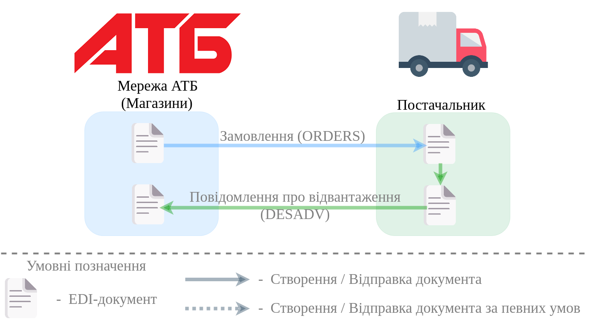

########################################################################################################################
Документообіг з мережею "АТБ" на платформі EDI Network 2.0: "Магазини"
########################################################################################################################

.. сюда закину немного картинок для текста

.. |лупа| image:: pics_ATB_storehouse/ATB_storehouse_003.png

.. |будинок| image:: pics_ATB_storehouse/ATB_storehouse_004.png

.. role:: red

.. contents:: Зміст:
   :depth: 2

---------

Вступ
====================================

Дана інструкція описує порядок документообігу з мережею "АТБ" на платформі EDI Network 2.0 за схемою передбаченою для магазинів. В документообігу приймають участь наступні документи:

- `Замовлення <https://wiki.edin.ua/uk/latest/ClientProcesses/ATB/ATB_XML-structure.html#order>`__
- `Повідомлення про відвантаження <https://wiki.edin.ua/uk/latest/ClientProcesses/ATB/ATB_XML-structure.html#desadv>`__

**Загальна схема документообігу:**

1 Вхід на платформу
====================================

.. include:: /general_2_0/rabota_s_platformoj_EDIN_2.0.rst
   :start-after: .. початок блоку для Enter
   :end-before: .. кінець блоку для Enter

Після успішної авторизації відкриється основне меню, де у вкладці **"Продукти та рішення"** EDIN потрібно обрати сервіс **"EDI Network"**:

.. image:: /_constant/pics_landing/landing_edi.png
   :align: center

2 Формування "Повідомлення про відвантаження" у відповідь на вхідне "Замовлення" (ORDER). Сторона Постачальника
=========================================================================================================================

.. include:: /ClientProcesses/ATB/ATB_Instructions/ATB_external_EDI_instruction_post.rst
   :start-after: .. початок блоку для ATB_storehouse_DESADV
   :end-before: .. кінець блоку для ATB_storehouse_DESADV

.. old   Мережа "АТБ" формує і відправляє "Замовлення" (ORDER). Для формування "Повідомлення про відвантаження" (DESADV) потрібно у папці **"Вхідні"** обрати "Замовлення" (ORDER), за яким потрібно зробити відвантаження (для зручності можливо скористатись `пошуком <https://wiki.edin.ua/uk/latest/general_2_0/rabota_s_platformoj_EDIN_2.0.html#doc-search>`__):

   .. image:: pics_ATB_storehouse/ATB_storehouse_008.png
      :align: center

   .. image:: pics_ATB_storehouse/ATB_storehouse_009.png
      :align: center

   Для формування "Повідомлення про відвантаження" (DESADV) виберіть відповідний документ на формі-підказці - документ створиться автоматично.

   .. image:: pics_ATB_storehouse/ATB_storehouse_001.png
      :align: center

   У відкритій формі "Повідомлення про відвантаження" (DESADV) деякі поля заповнюються автоматично з пов'язаного "Замовлення" (обов'язкові до заповнення поля позначені червоною зірочкою :red:`*`):

   .. image:: pics_ATB_storehouse/ATB_storehouse_019.png
      :align: center

   #. **Одержувач** - дані одержувача (мережі), компанія;
   #. **Повідомлення про відвантаження №** - номер "Повідомлення про відвантаження";
   #. **від** - дата "Повідомлення про відвантаження", за замовчуванням вказана поточна дата;
   #. **Доставка буде проведена** - дата і час доставки;
   #. **Версія** - версія документа. Числове значення вказується автоматично і не може бути меншим за версію попередніх "Повідомлень про відвантаження" (DESADV) в ланцюжку документів;
   #. **Постачальник** - заповнюється автоматично або за допомогою кнопки "Пошук контрагента" (|лупа|), або за допомогою кнопки "Вказати себе" (|будинок|);
   #. **Покупець** - заповнюється автоматично або за допомогою кнопки "Пошук контрагента" (|лупа|), або за допомогою кнопки "Вказати себе" (|будинок|);
   #. **Місце доставки** - заповнюється автоматично або за допомогою кнопки "Пошук контрагента" (|лупа|), або за допомогою кнопки "Вказати себе" (|будинок|);
   #. **Повідомлення на замовлення №** - номер "Замовлення" в ланцюжку документів (поле не доступне до редагування);
   #. **За накладною №** / **від** - номер та дата накладної. :red:`Номер "первинного" документа на паперовому носії повинен співпадати з номером накладної!`

   .. hint::
      За допомогою кнопки **"Пошук контрагента"** (|лупа|) або ж за допомогою кнопки **"Вказати себе"** (|будинок|) можливо вказати чи змінити дані Покупця або Постачальника. Для пошуку введіть назву компанії, GLN або ІПН:

      .. image:: pics_ATB_storehouse/ATB_storehouse_024.png
         :align: center

   .. important::
      **Увага!** Номер вказаної накладної повинен повністю збігатися з номером оригіналу паперової накладної.

   Блок **Разом** розраховується автоматично за табличними даними.

   .. вирішили прибрати, але для інших інструкцій ок - Блоки **Додаткова інформація** та **Транспортування** необов'язкові для заповнення і "згорнуті" за замовчуванням. Блок **Разом** розраховується автоматично після заповнення позицій.

      .. image:: pics_ATB_storehouse/ATB_storehouse_026.png
         :align: center

   Перелік товарних позицій (які були замовлені), їх кількість, що постачається повинні збігатись. Система автоматично заповнює значення за позиціями з раніше відправленого документа "Підтвердження замовлення" (ORDRSP), на основі якого був створений документ "Повідомлення про відвантаження" (DESADV). Можливо вносити зміни в кількість і ціну позицій.

   :red:`Всі зміни за позиціями варто виконувати тільки після узгодження з мережею!`

   Зміни за позиціями можливо виконувати в табличній частині в колонках "Кількість, що постачається", "Ціна без ПДВ", "Ціна з ПДВ", "Ставка ПДВ" або за конкретною позицією, натиснувши на штрихкод позиції:

   .. image:: pics_ATB_storehouse/ATB_storehouse_021.png
      :align: center

   Якщо по якійсь з позицій не буде поставки її необхідно відзначити галочкою і **"Видалити"**.

   .. image:: pics_ATB_storehouse/ATB_storehouse_020.png
      :align: center

   .. important::
      **Увага!** У разі створення **кількох** видаткових накладних на замовлення, необхідно на кожну накладну формувати **Повідомлення про відвантаження**. При цьому, поле **"За накладною №"** в документах повинно відрізнятися.

   .. attention::
      Кількість товарних позицій, що постачається не може перевищувати кількість зазначену в "Замовленні"!

   .. вирішили прибрати, але для інших інструкцій ок - Можливо також додати іншу позицію з Товарного довідника, заповнивши форму **Додати позицію** через кнопку **"+Додати"** (обов'язкові до заповнення поля позначені червоною зірочкою :red:`*`).

   Після внесення всіх даних в документ, натисніть кнопку **"Зберегти"** (1), потім **"Відправити"** (2).

   .. image:: pics_ATB_storehouse/ATB_storehouse_022.png
      :align: center
      
   Відправлений документ автоматично потрапляє в папку **"Надіслані"** і буде знаходитись в ланцюжку документів разом із "Замовленням" і "Підтвердженням замовлення".

   .. image:: pics_ATB_storehouse/ATB_storehouse_023.png
      :align: center

--------------------------------------

.. include:: /retail_2.0/formirovanie_otpravka_dokumenta_Uvedomlenie_ob_otgruzke_DESADV_na_EDI_Network_2.0.rst
   :start-after: .. початок блоку для DESADV_TTN
   :end-before: .. кінець блоку для DESADV_TTN

-------------------------------------

.. include:: /_constant/kontakti.rst
