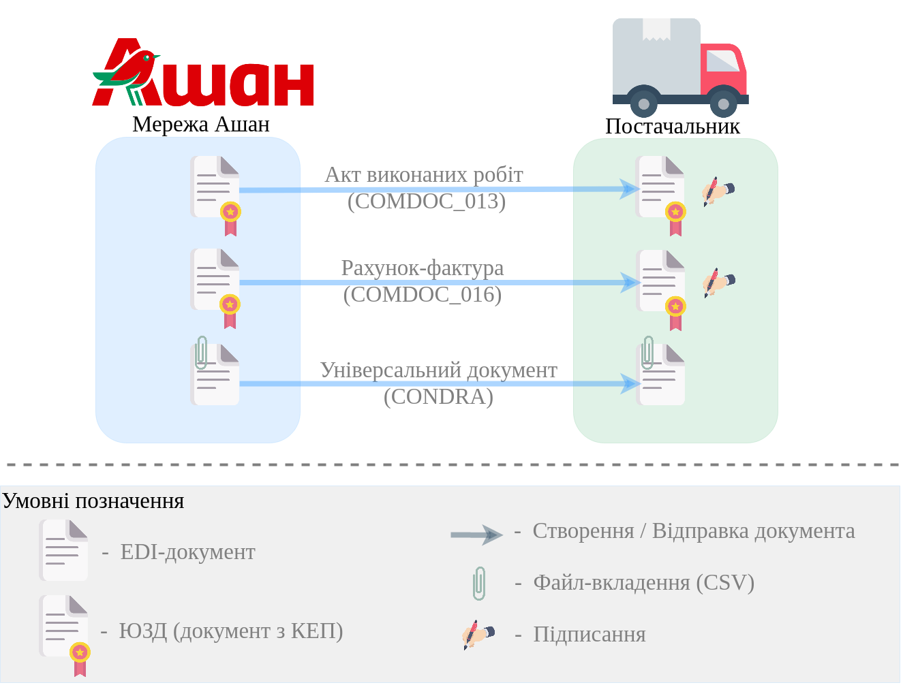
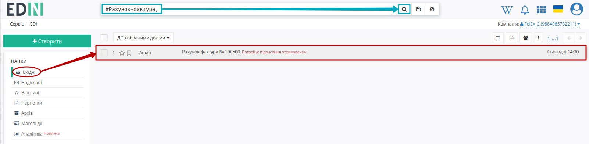
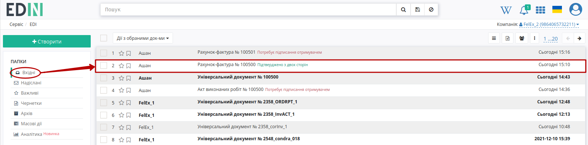
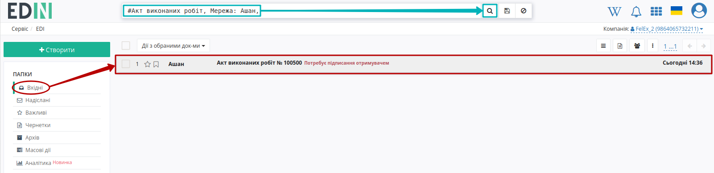
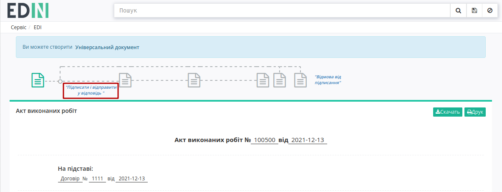
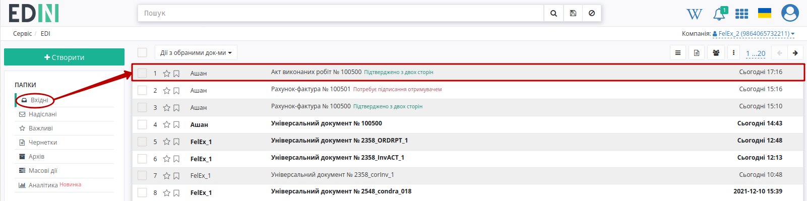
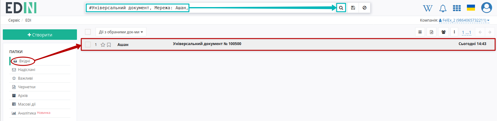
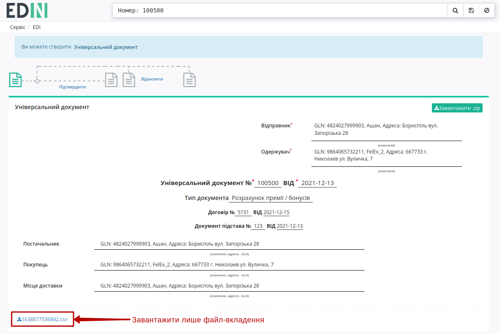

Інструкція по роботі з мережею "Ашан" на web-платформі EDI Network 2.0 за схемою "Ашан маркетинг"
##########################################################################################################################################

.. role:: red

.. role:: large

.. contents:: Зміст:
   :depth: 6

---------

Вступ
====================================

Дана інструкція описує порядок документообігу з мережею "Ашан" на платформі EDI Network 2.0 за схемою "Ашан маркетинг" наступними документами:

* `"Акт виконаних робіт" (COMDOC_013) <https://wiki.edin.ua/uk/latest/EDIN_Specs/XML/COMDOC_013_x.html>`__
* `"Рахунок-фактура" (COMDOC_016) <https://wiki.edin.ua/uk/latest/EDIN_Specs/XML/COMDOC_016_x.html>`__
* `"Універсальний/неструктурований документ" (CONDRA) <https://wiki.edin.ua/uk/latest/EDIN_Specs/XML/CONDRA_x.html>`__

Загальна схема документообігу:



.. important::
   Мережа "Ашан" є ініціатором документообігу: надсилає ці 3 пов'язаних між собою документа, два з яких (COMDOC) потребують підписання, а "Універсальний документ" (CONDRA) слугує розшифровкою до рахунку.

.. початок блоку для Repeat

.. hint::
   В ланцюжку документів знаходяться лише COMDOC-документи ("Акт виконаних робіт" (COMDOC_013) та "Рахунок-фактура" (COMDOC_016)):

   .. image:: /ClientProcesses/Auchan/Auchan_Instructions/pics_Auchan_comdoc_013_016_condra/Auchan_comdoc_013_016_condra_010.png
      :align: center

   .. raw:: html

      <p><strong><span style="color: #ff9900;  font-size: 28px;">Мережа відправляє всі три документа з одним номером, тому для спрощення роботи з конкретною групою документів рекомендовано фільтрувати документи за номером та мережею за потреби:</span></strong></p>

   .. image:: /ClientProcesses/Auchan/Auchan_Instructions/pics_Auchan_comdoc_013_016_condra/Auchan_comdoc_013_016_condra_002.png
      :align: center

   ⠀⠀⠀⠀⠀⠀⠀⠀⠀

   .. image:: /ClientProcesses/Auchan/Auchan_Instructions/pics_Auchan_comdoc_013_016_condra/Auchan_comdoc_013_016_condra_012.gif
      :align: center

.. кінець блоку для Repeat

1 Вхід на платформу
====================================

.. include:: /general_2_0/rabota_s_platformoj_EDIN_2.0.rst
   :start-after: .. початок блоку для Enter
   :end-before: .. кінець блоку для Enter

Після успішної авторизації відкриється основне меню, де у вкладці **"Продукти та рішення"** EDIN потрібно обрати сервіс **"EDI Network"**:

.. image:: /_constant/pics_landing/landing_edi.png
   :align: center

2 Отримання "Рахунку-фактури" (COMDOC_016)
==============================================================================================================

Мережа "Ашан" є ініціатором документообігу: надсилає вже підписаний зі своєї сторони "Рахунок-фактуру" (COMDOC_016). Документ відображається у "Вхідних" (для зручності можливо скористатись `пошуком <https://wiki.edin.ua/uk/latest/general_2_0/rabota_s_platformoj_EDIN_2.0.html#doc-search>`__):



Цей документ **Потребує підписання отримувачем**. Ви можете ознайомитись з відкритим документом та якщо згодні з його змістом натиснути кнопку **"Підписати і відправити у відповідь"**:

.. image:: pics_Auchan_comdoc_013_016_condra/Auchan_comdoc_013_016_condra_005.png
   :align: center

.. _sign:

2.1 Підписання та відправка документа
---------------------------------------------------------------------------

.. загальне підписання на платформі

.. tabs::

   .. tab:: Файловий ключ

      .. include:: /_constant/signing/signing.rst
         :start-after: .. початок блоку для Signing
         :end-before: .. кінець блоку для Signing

   .. tab:: Token

      .. include:: /_constant/token_signing/token_signing.rst
         :start-after: .. початок блоку для TokenSign
         :end-before: .. кінець блоку для TokenSign

   .. tab:: Гряда

      .. include:: /_constant/gryada_signing/gryada_signing.rst
         :start-after: .. початок блоку для GryadaSign
         :end-before: .. кінець блоку для GryadaSign

   .. tab:: Cloud

      .. include:: /_constant/cloud_signing/cloud_signing.rst
         :start-after: .. початок блоку для CloudSign
         :end-before: .. кінець блоку для CloudSign

Після підписання документ автоматично відправляється контрагенту і відображається в журналі вхідних документів (папка "Вхідні") в статусі **Підтверджено з двох сторін**:



.. note::
   Відмова від підписання документа відбувається аналогічно до відмови будь-якого іншого COMDOC-документа на платформі та вже описана в розділі `"Відмова від підписання документа <https://wiki.edin.ua/uk/latest/ClientProcesses/Auchan/Auchan_Instructions/Auchan_comdoc_013_016_condra.html#reject>`__.

.. hint::
   Анулювання підписаного документа відбувається аналогічно до анулювання будь-якого іншого COMDOC-документа на платформі та вже описане в розділі `"Анулювання підписаного документа <https://wiki.edin.ua/uk/latest/ClientProcesses/Auchan/Auchan_Instructions/Auchan_comdoc_013_016_condra.html#repeal>`__.

3 Отримання "Акта виконаних робіт" (COMDOC_013)
==============================================================================================================

Мережа "Ашан" надсилає вже підписаний зі своєї сторони "Акт виконаних робіт" (COMDOC_013). Документ відображається у "Вхідних" (для зручності можливо скористатись `пошуком <https://wiki.edin.ua/uk/latest/general_2_0/rabota_s_platformoj_EDIN_2.0.html#doc-search>`__):



Цей документ **Потребує підписання отримувачем**. Ви можете ознайомитись з відкритим документом та якщо згодні з його змістом натиснути кнопку **"Підписати і відправити у відповідь"**:



Підписання відбувається аналогічно до підписання будь-якого іншого документа на платформі та вже описане в розділі `"Підписання та відправка документа <https://wiki.edin.ua/uk/latest/ClientProcesses/Auchan/Auchan_Instructions/Auchan_comdoc_013_016_condra.html#sign>`__.

.. note::
   Відмова від підписання документа відбувається аналогічно до відмови будь-якого іншого COMDOC-документа на платформі та вже описана в розділі `"Відмова від підписання документа <https://wiki.edin.ua/uk/latest/ClientProcesses/Auchan/Auchan_Instructions/Auchan_comdoc_013_016_condra.html#reject>`__.

.. hint::
   Анулювання підписаного документа відбувається аналогічно до анулювання будь-якого іншого COMDOC-документа на платформі та вже описане в розділі `"Анулювання підписаного документа <https://wiki.edin.ua/uk/latest/ClientProcesses/Auchan/Auchan_Instructions/Auchan_comdoc_013_016_condra.html#repeal>`__.

Після підписання документ автоматично відправляється контрагенту і відображається в журналі вхідних документів (папка "Вхідні") в статусі **Підтверджено з двох сторін**:



4 Отримання "Універсального/неструктурованого документа" (CONDRA)
==============================================================================================================

Мережа "Ашан" надсилає зі своєї сторони "Універсальний документ" (CONDRA). Документ відображається у "Вхідних" (для зручності можливо скористатись `пошуком <https://wiki.edin.ua/uk/latest/general_2_0/rabota_s_platformoj_EDIN_2.0.html#doc-search>`__):



.. include:: /ClientProcesses/Auchan/Auchan_Instructions/Auchan_comdoc_013_016_condra.rst
   :start-after: .. початок блоку для Repeat
   :end-before: .. кінець блоку для Repeat

Цей документ не потребує підписання і слугує розшифровкою до рахунку. Для ознайомлення з розшифровкою потібно перейти в документ та завантажити файл-вкладення до документа (завантажити весь документ у вигляді zip-архіву також можливо за допомогою відповідної кнопки):



Додаткові можливості
=====================================================================================================================

.. _repeal:

Анулювання підписаного документа
---------------------------------------------------------------------------

.. include:: /_constant/comdoc_repeal/comdoc_repeal.rst
   :start-after: .. початок блоку для Comdoc_Repeal
   :end-before: .. кінець блоку для Comdoc_Repeal

.. _repeal-accept:

Підтвердження запиту на анулювання комерційного документа (COMDOC)
``````````````````````````````````````````````````````````````````````````````
.. include:: /_constant/comdoc_repeal_accept/comdoc_repeal_accept.rst
   :start-after: .. початок блоку для Comdoc_RepealAccept
   :end-before: .. кінець блоку для Comdoc_RepealAccept

.. _repeal-reject:

Відмова від анулювання комерційних документів (COMDOC)
``````````````````````````````````````````````````````````````````````````````

.. include:: /_constant/comdoc_repeal_reject/comdoc_repeal_reject.rst
   :start-after: .. початок блоку для Comdoc_RepealReject
   :end-before: .. кінець блоку для Comdoc_RepealReject

------------------------------------------------------

.. _reject:

Відмова від підписання документа
-------------------------------------------------------------------------------

.. include:: /_constant/comdoc_reject/comdoc_reject.rst
   :start-after: .. початок блоку для Comdoc_Reject
   :end-before: .. кінець блоку для Comdoc_Reject

----------------------------
   
.. include:: /_constant/kontakti.rst
