########################################################################################################################
Документообіг з мережею "BOX Market" на платформі EDI Network 2.0. Інструкція Постачальника
########################################################################################################################

.. дууууже схожа інструкція в Укрнафти

.. сюда закину немного картинок для текста

.. |лупа| image:: pics_BOX_Market_Standard/BOX_Market_Standard_003.png

.. |будинок| image:: pics_BOX_Market_Standard/BOX_Market_Standard_004.png

.. role:: red

.. contents:: Зміст:
   :depth: 2

---------

Вступ
====================================

Дана інструкція описує порядок документообігу з мережею "BOX Market" на платформі EDI Network 2.0. В документообігу приймають участь наступні документи:

- `Замовлення (ORDER) <https://wiki.edin.ua/uk/latest/EDIN_Specs/XML/ORDER_x.html>`__
- `Підтвердження замовлення (ORDRSP) <https://wiki.edin.ua/uk/latest/EDIN_Specs/XML/ORDRSP_x.html>`__
- `Повідомлення про відвантаження (DESADV) <https://wiki.edin.ua/uk/latest/EDIN_Specs/XML/DESADV_x.html>`__
- `Повідомлення про прийом (RECADV) <https://wiki.edin.ua/uk/latest/EDIN_Specs/XML/RECADV_x.html>`__
- `Прибуткова накладна (COMDOC_007) <https://wiki.edin.ua/uk/latest/EDIN_Specs/XML/COMDOC_007_x.html>`__

**Загальна схема документообігу:**

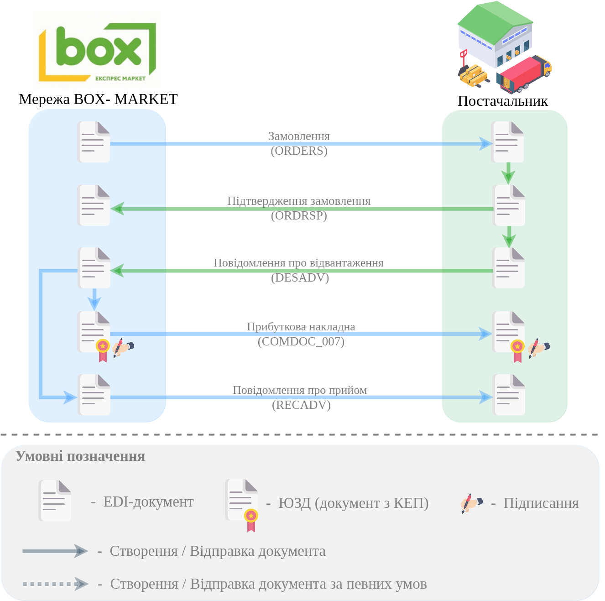

1 Формування "Підтвердження замовлення" (ORDRSP) у відповідь на вхідне "Замовлення" (ORDER)
=========================================================================================================================

Мережа "BOX Market" формує і відправляє "Замовлення" (ORDER). Для формування "Підтвердження замовлення" (ORDRSP) потрібно у папці **"Вхідні"** обрати "Замовлення" (ORDER), за яким потрібно зробити підтвердження (для зручності можливо скористатись `пошуком <https://wiki.edin.ua/uk/latest/general_2_0/rabota_s_platformoj_EDIN_2.0.html#doc-search>`__):

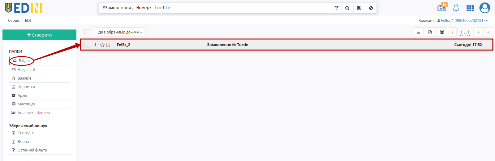

Для формування "Підтвердження замовлення" (ORDRSP) натисніть **"Створити документ"** в блоці `ланцюжка документів <https://wiki.edin.ua/uk/latest/_constant/chain/chain.html>`__ для мережі "BOX Market" - документ створиться автоматично.

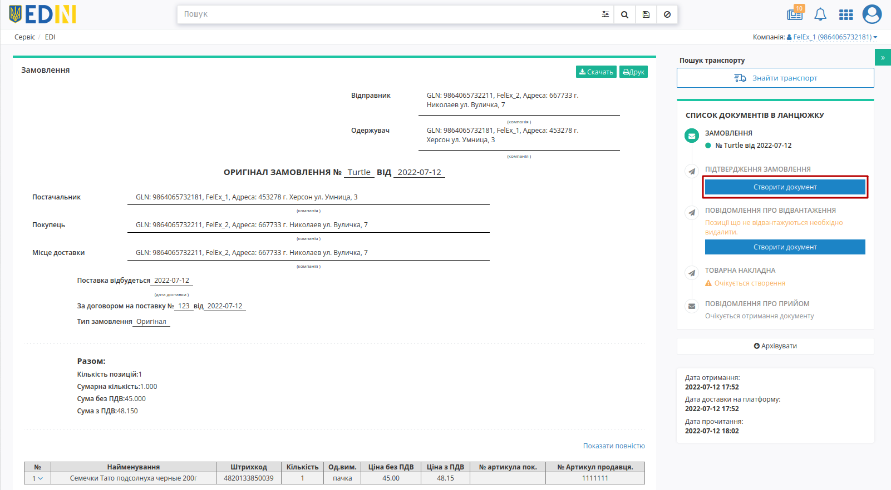

У відкритій формі "Підтвердження замовлення" (ORDRSP) всі обов'язкові до заповнення поля (позначені червоною зірочкою :red:`*`) заповнюються автоматично з пов'язаного "Замовлення":

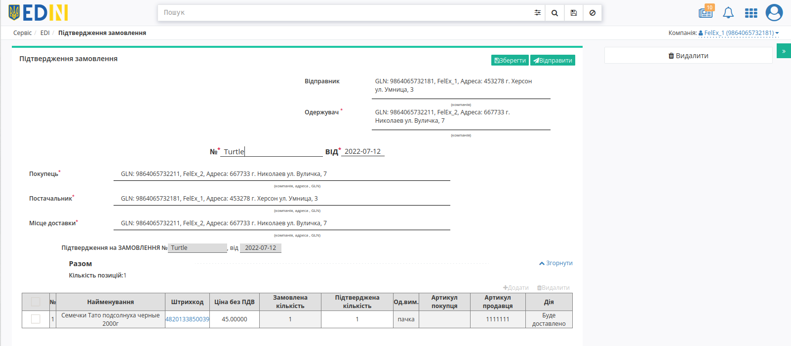

#. **Одержувач** - дані одержувача (мережі), не підлягають редагуванню
#. **№** - номер підтвердження замовлення;
#. **від** - дата підтвердження замовлення, за замовчуванням вказана поточна дата;
#. **Покупець** - заповнюється автоматично, не підлягає редагуванню;
#. **Постачальник** - заповнюється автоматично, не підлягає редагуванню;
#. **Місце доставки** - заповнюється автоматично, не підлягає редагуванню.

В блоці **Разом** вказується загальна кількість табличних позицій.

В табличній частині відображається основна інформація по замовлених **товарних позиціях**. **Товарні позиції** переносяться з "Замовлення" (ORDER): їх можна **"+Додати"**, змінити, підтвердити/відхилити чи **"Видалити"**.

:red:`Всі зміни за позиціями варто виконувати тільки після узгодження з мережею!`

Зміни за позиціями можливо виконувати в табличній частині в колонках "Ціна без ПДВ", "Підтверджена кількість" або за конкретною позицією, натиснувши на штрихкод позиції:

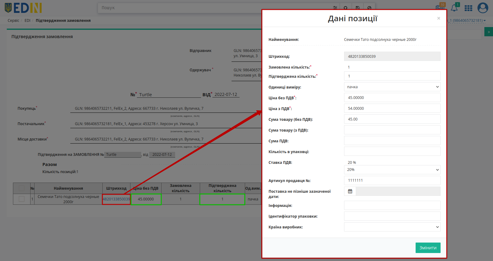

Якщо по якійсь з позицій не буде поставки її необхідно відзначити галочкою і **"Видалити"**.

.. attention::
   Підтверджена кількість товарних позицій не може перевищувати зазначену в "Замовленні" (ORDER)!

Після внесення всіх даних в документ, натисніть кнопку **"Зберегти"** (1), потім **"Відправити"** (2).

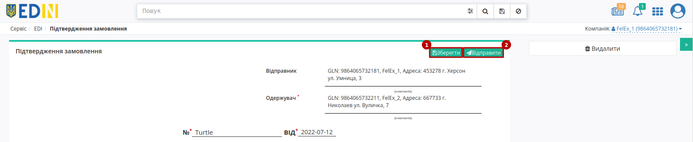

Відправлений документ автоматично потрапляє в папку **"Надіслані"** і буде знаходиться в `ланцюжку документів <https://wiki.edin.ua/uk/latest/_constant/chain/chain.html>`__ разом із "Замовленням" (ORDER).

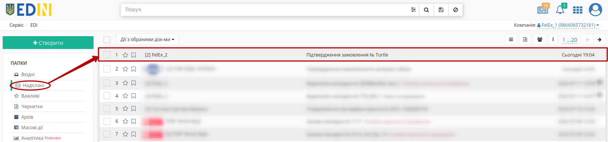

2 Формування "Повідомлення про відвантаження" (DESADV)
=========================================================================================================================

Створити "Повідомлення про відвантаження" (DESADV) можливо одразу на підставі вхідного "Замовлення" (ORDER) або відправленого "Підтвердження замовлення" (ORDRSP). Для створення відвантаження за вже підтвердженими позиціями потрібно у папці **"Надіслані"** обрати "Підтвердження замовлення" (ORDRSP), за яким потрібно зробити відвантаження (для зручності можливо скористатись `пошуком <https://wiki.edin.ua/uk/latest/general_2_0/rabota_s_platformoj_EDIN_2.0.html#doc-search>`__):

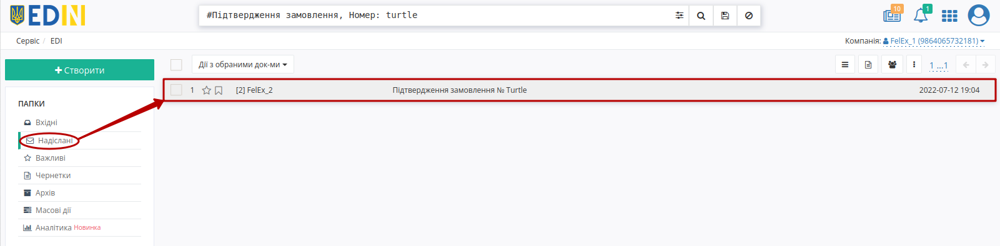

Для формування "Повідомлення про відвантаження" (DESADV) натисніть **"Створити документ"** в блоці `ланцюжка документів <https://wiki.edin.ua/uk/latest/_constant/chain/chain.html>`__ для мережі "BOX Market" - документ створиться автоматично.

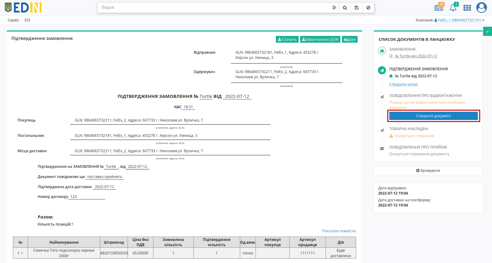

У відкритій формі "Повідомлення про відвантаження" (DESADV) деякі поля заповнюються автоматично з пов'язаного документа-підстави (обов'язкові до заповнення поля позначені червоною зірочкою :red:`*`):

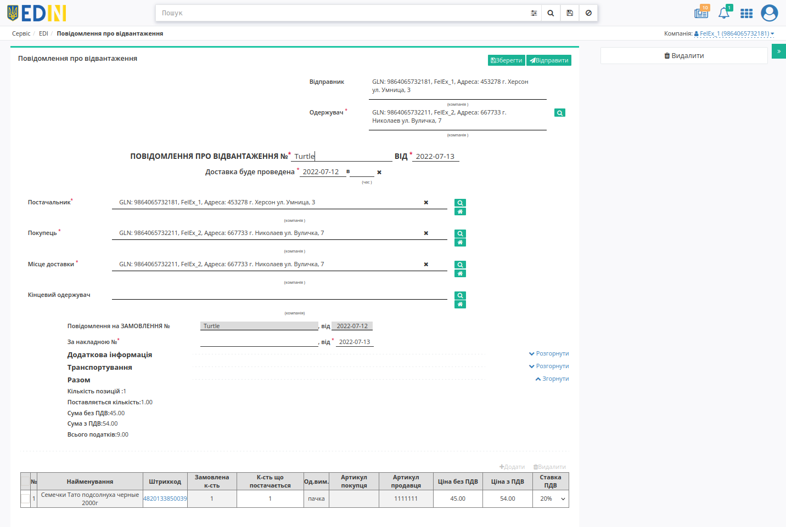

#. **Одержувач** - дані одержувача (мережі); заповнюється автоматично, можливо змінити за допомогою кнопки "Пошук контрагента" (|лупа|);
#. **Повідомлення про відвантаження №** - номер "Повідомлення про відвантаження";
#. **від** - дата "Повідомлення про відвантаження", за замовчуванням вказана поточна дата;
#. **Доставка буде проведена** - дата і час доставки;
#. **Постачальник** - заповнюється автоматично або за допомогою кнопки "Пошук контрагента" (|лупа|), або за допомогою кнопки "Вказати себе" (|будинок|);
#. **Покупець** - заповнюється автоматично або за допомогою кнопки "Пошук контрагента" (|лупа|), або за допомогою кнопки "Вказати себе" (|будинок|);
#. **Місце доставки** - заповнюється автоматично або за допомогою кнопки "Пошук контрагента" (|лупа|), або за допомогою кнопки "Вказати себе" (|будинок|);
#. **Повідомлення на замовлення №** - номер "Замовлення" в ланцюжку документів (поле не доступне до редагування);
#. **За накладною №** / **від** - номер та дата накладної. :red:`Номер "первинного" документа на паперовому носії повинен співпадати з номером накладної!`

.. important::
   **Увага!** Номер вказаної накладної повинен повністю збігатися з номером оригіналу паперової накладної.

.. hint::
   За допомогою кнопки **"Пошук контрагента"** (|лупа|) або ж за допомогою кнопки **"Вказати себе"** (|будинок|) можливо вказати чи змінити дані Покупця або Постачальника. Для пошуку введіть назву компанії, GLN або ІПН:

   .. image:: pics_BOX_Market_Standard/BOX_Market_Standard_002.png
      :align: center

Блоки **Додаткова інформація** та **Транспортування** необов'язкові для заповнення і "згорнуті" за замовчуванням. Блок **Разом** розраховується автоматично після заповнення позицій.

   .. image:: pics_BOX_Market_Standard/BOX_Market_Standard_014.png
      :align: center

Перелік товарних позицій (які були замовлені), їх кількість, що постачається повинні збігатись. Система автоматично заповнює значення за позиціями з раніше відправленого документа "Підтвердження замовлення" (ORDRSP), на основі якого був створений документ "Повідомлення про відвантаження" (DESADV). Можливо вносити зміни в кількість і ціну позицій.

:red:`Всі зміни за позиціями варто виконувати тільки після узгодження з мережею!`

Зміни за позиціями можливо виконувати в табличній частині в колонках "Кількість, що постачається", "Ціна без ПДВ", "Ціна з ПДВ", "Ставка ПДВ" або за конкретною позицією, натиснувши на штрихкод позиції:

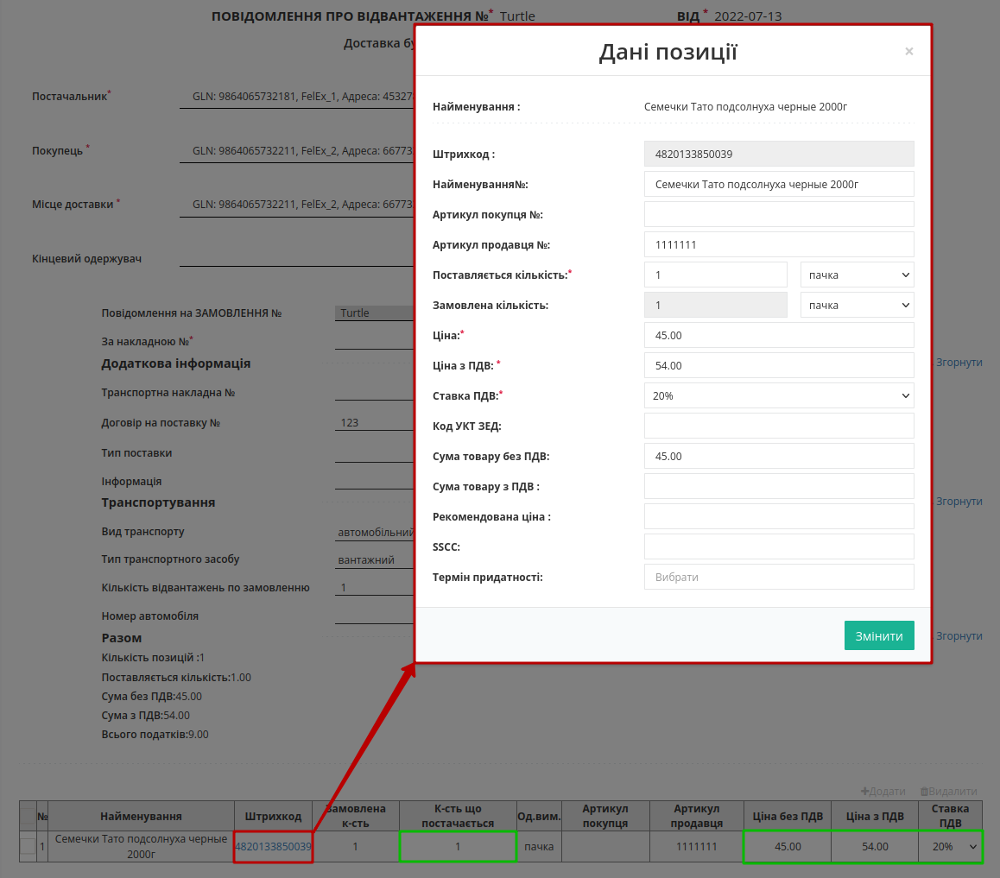

Якщо по якійсь з позицій не буде поставки її необхідно відзначити галочкою і **"Видалити"**.

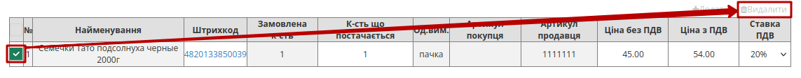

.. important::
   **Увага!** У разі створення **кількох** видаткових накладних на замовлення, необхідно на кожну накладну формувати **Повідомлення про відвантаження**. При цьому, поле **"За накладною №"** в документах повинно відрізнятися.

.. attention::
   Кількість товарних позицій, що постачається не може перевищувати кількість зазначену в "Замовленні"!

Після внесення всіх даних в документ, натисніть кнопку **"Зберегти"** (1), потім **"Відправити"** (2).

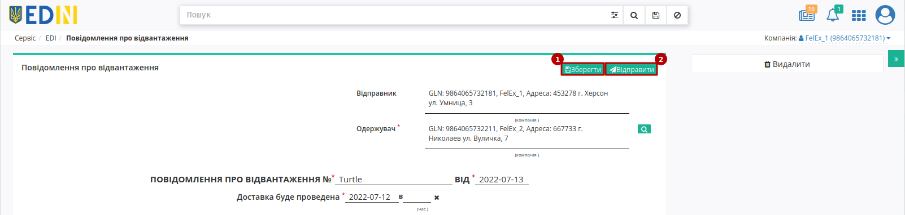
   
Відправлений документ автоматично потрапляє в папку **"Надіслані"** і буде знаходитись в `ланцюжку документів <https://wiki.edin.ua/uk/latest/_constant/chain/chain.html>`__ разом із "Замовленням" і "Підтвердженням замовлення".

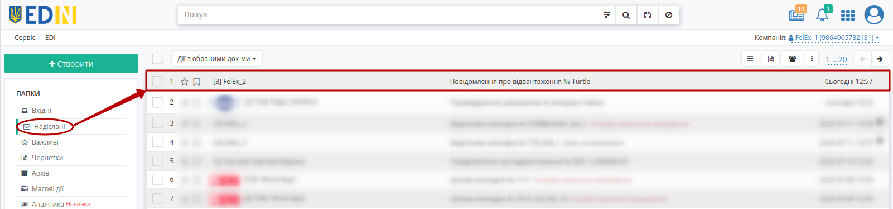

--------------------------------------------------------------------------------------------------

.. note::
   У відповідь на "Повідомлення про відвантаження" (DESADV) Мережа може створити та відправити "Повідомлення про прийом" (RECADV) для додаткового оповіщення про прийом товарів чи задля зазначеня розбіжностей між вказаним та фактично отриманим товаром.

.. _comdoc-007-processing:

3 Обробка вхідного документа "Прибуткова накладна" (COMDOC_007)
===============================================================================================================

Для обробки "Прибуткової накладної" (COMDOC_007) в сервісі "EDI Network" потрібно перейти у **"Вхідні"** та вибрати **"Прибуткова накладна"** в статусі :orange:`"Очікує на підписання отримувачем"` (для зручності можливо скористатись рядком `пошуку <https://wiki.edin.ua/uk/latest/general_2_0/rabota_s_platformoj_EDIN_2.0.html#doc-search>`__):

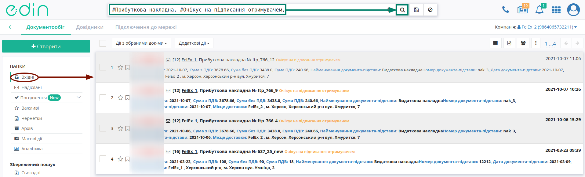

Відкриється форма документа, де Ви зможете ознайомитись з документом. Якщо Ви згодні з документом, його потрібно **"Підписати"**:

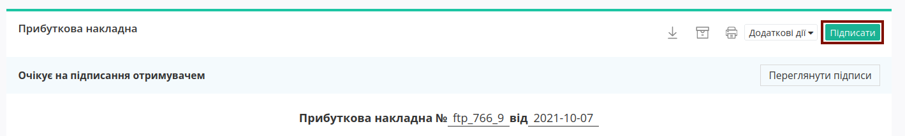

.. hint::
   Процес підписання є типовим на платформі EDI Network та описаний в `розділі нижче <https://wiki.edin.ua/uk/latest/ClientProcesses/BOX_Market/BOX_Market_Instructions/BOX_Market_Standard.html#sign>`__.

Після підписання документ змінює свій статус на :green:`"Підписано двома сторонами"`.

.. note::
   Для того, щоб **Відхилити** "Прибуткову накладну" (COMDOC_007) можливо оформити типову для комерціних документів **"Відмову від підписання"** (`детальніше <https://wiki.edin.ua/uk/latest/_constant/comdoc_reject/comdoc_reject.html>`__):

   .. image:: pics_BOX_Market_Standard/BOX_Market_Standard_038.png
      :align: center

.. hint::
   Також після підписання документа (документ підписаний з обох сторін в статусі :green:`"Підписано двома сторонами"`) за згодою сторін можливо відправити **"Запит на анулювання"** документа (`детальніше <https://wiki.edin.ua/uk/latest/_constant/comdoc_repeal/comdoc_repeal.html>`__):

   .. image:: pics_BOX_Market_Standard/BOX_Market_Standard_039.png
      :align: center

   Ініціатором анулювання може виступати, як Мережа так і Постачальник.

------------------------------------------------------

.. _sign:

Підписання на платформі EDIN 2.0
=========================================================================================================================

.. tabs::

   .. tab:: Файловий ключ

      .. include:: /_constant/signing/signing.rst
         :start-after: .. початок блоку для Signing
         :end-before: .. кінець блоку для Signing

   .. tab:: Token

      .. include:: /_constant/token_signing/token_signing.rst
         :start-after: .. початок блоку для TokenSign
         :end-before: .. кінець блоку для TokenSign

   .. tab:: Гряда

      .. include:: /_constant/gryada_signing/gryada_signing.rst
         :start-after: .. початок блоку для GryadaSign
         :end-before: .. кінець блоку для GryadaSign

   .. tab:: Cloud

      .. include:: /_constant/cloud_signing/cloud_signing.rst
         :start-after: .. початок блоку для CloudSign
         :end-before: .. кінець блоку для CloudSign

------------------------------------------------

.. include:: /_constant/kontakti.rst
