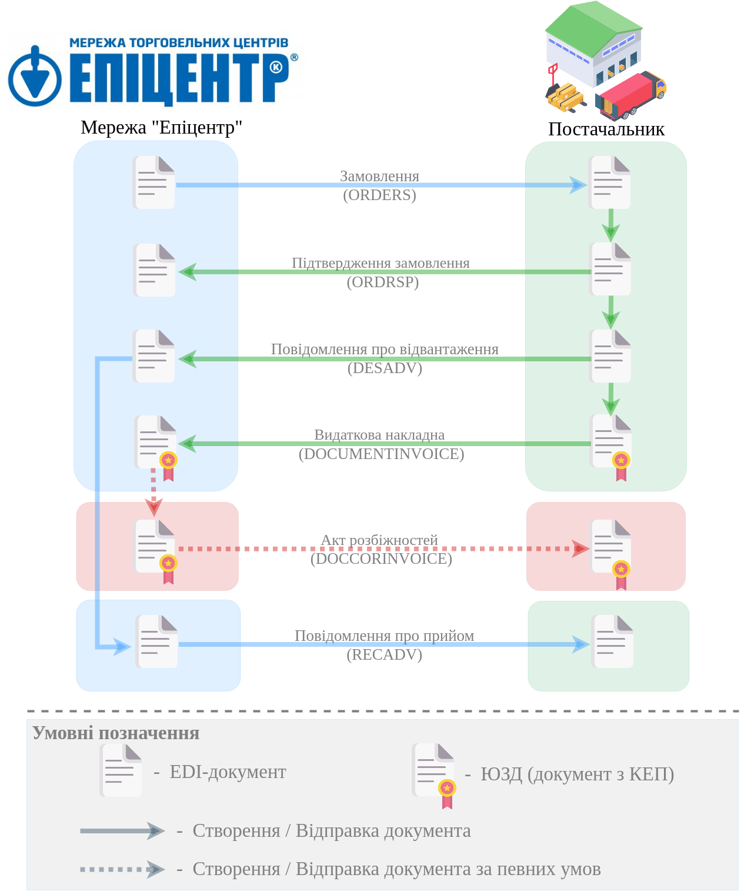
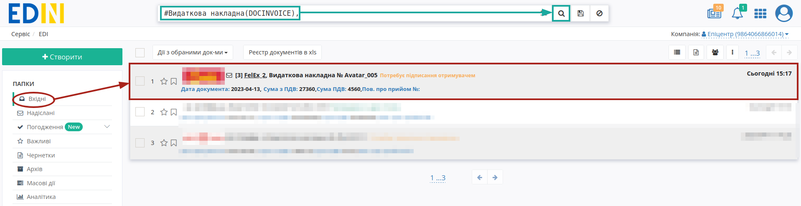
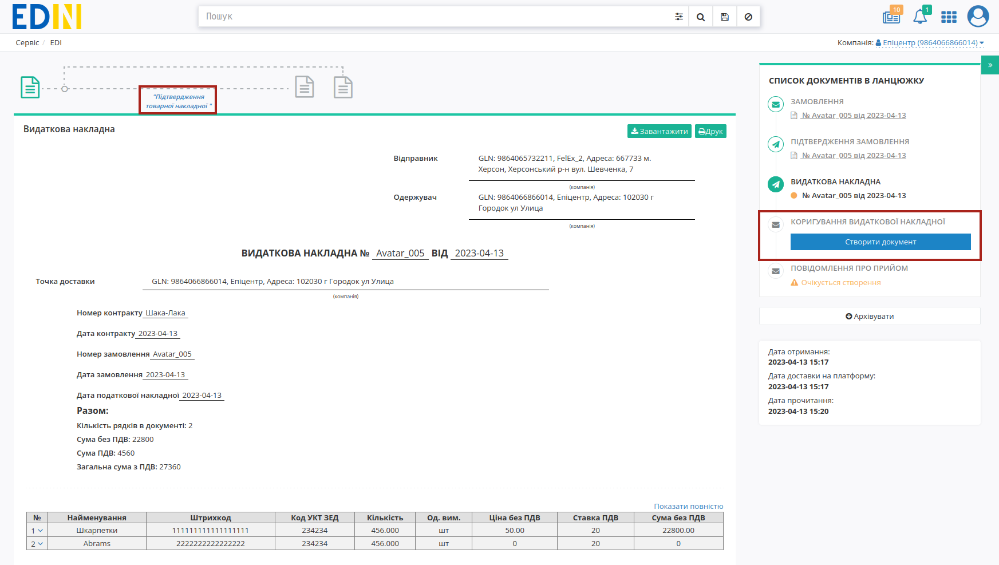
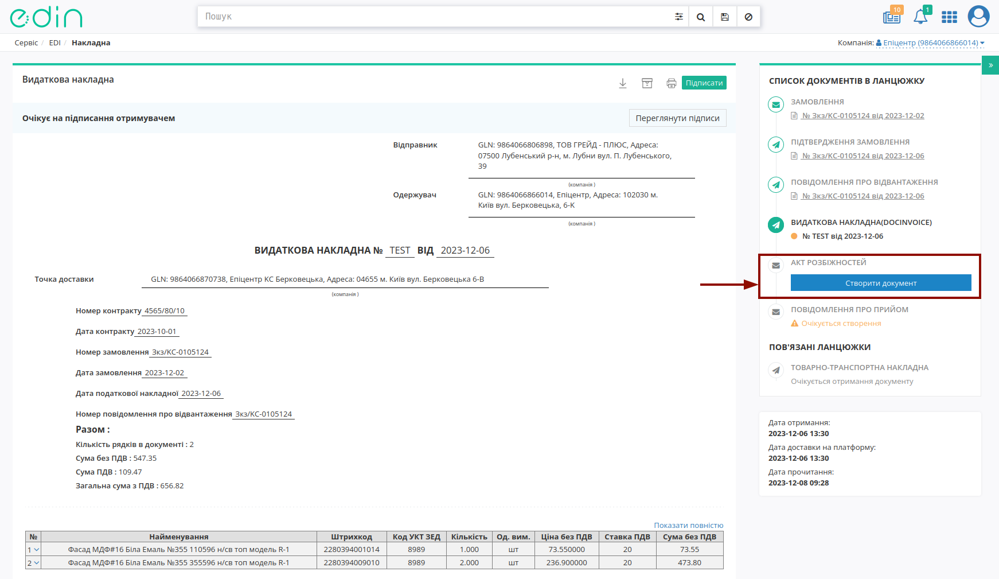
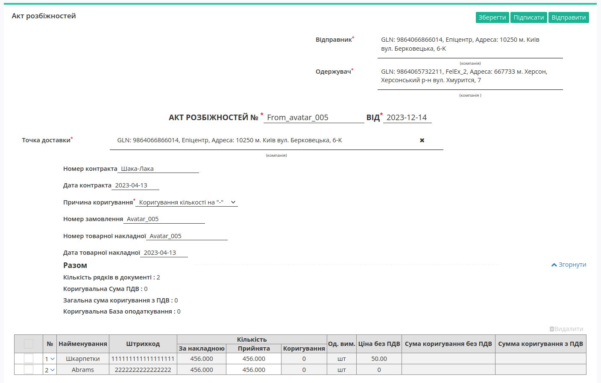
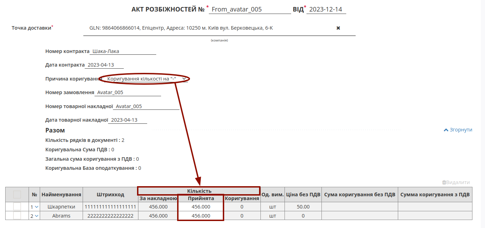
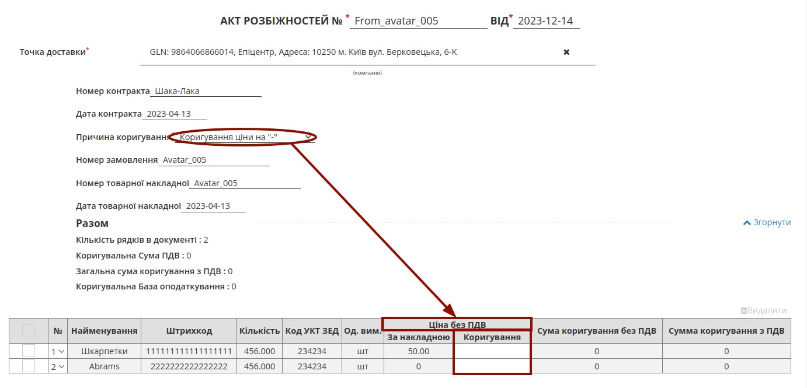
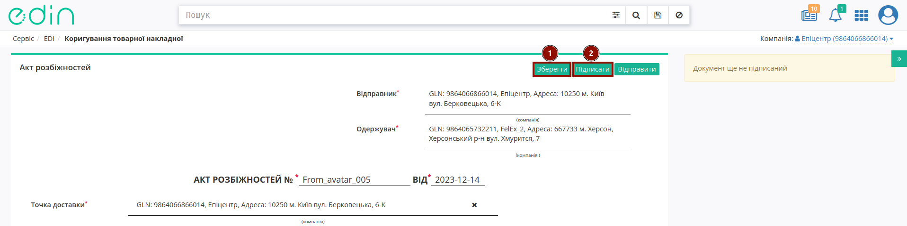
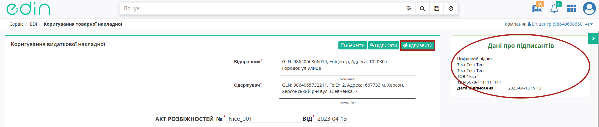
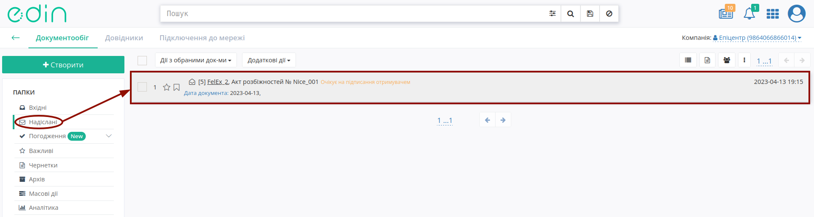

########################################################################################################################
Документообіг з мережею "Епіцентр" на платформі EDI Network 2.0. Інстукція Мережі
########################################################################################################################

.. сюда закину немного картинок для текста

.. |лупа| image:: /_constant/icons/magnifying_glass.png

.. |будинок| image:: /_constant/icons/house.png

.. role:: red

.. contents:: Зміст:
   :depth: 2

---------

Вступ
====================================

Дана інструкція описує порядок документообігу з мережею "Епіцентр" на платформі EDI Network 2.0. В документообігу приймають участь наступні документи:

- `Замовлення <https://wiki.edin.ua/uk/latest/EDIN_Specs/XML/ORDER_x.html>`__
- `Підтвердження замовлення <https://wiki.edin.ua/uk/latest/EDIN_Specs/XML/ORDRSP_x.html>`__
- `Повідомлення про відвантаження <https://wiki.edin.ua/uk/latest/EDIN_Specs/XML/DESADV_x.html>`__
- `Видаткова накладна <https://wiki.edin.ua/uk/latest/ClientProcesses/Epicentr/Epicentr_XML-structure.html#documentinvoice>`__
- `Акт розбіжностей <https://wiki.edin.ua/uk/latest/ClientProcesses/Epicentr/Epicentr_XML-structure.html#doccorinvoice>`__
- `Повідомлення про прийом <https://wiki.edin.ua/uk/latest/EDIN_Specs/XML/RECADV_x.html>`__

**Загальна схема документообігу:**

1 Вхід на платформу
====================================

.. include:: /general_2_0/rabota_s_platformoj_EDIN_2.0.rst
   :start-after: .. початок блоку для Enter
   :end-before: .. кінець блоку для Enter

Після успішної авторизації відкриється основне меню, де у вкладці **"Продукти та рішення"** EDIN потрібно обрати сервіс **"EDI Network"**:

.. image:: /_constant/pics_landing/landing_edi.png
   :align: center

.. _order-create:

2 Формування "Замовлення" (ORDER)
==============================================================================================================

.. include:: /retail_2.0/formirovanie_otpravka_ORDER_na_EDI_Network_2.0.rst
   :start-after: .. початок блоку для Order_from_zero
   :end-before: .. кінець блоку для Order_from_zero

.. _documentinvoice-get:

3 Обробка вхідної "Видаткової накладної" (DOCUMENTINVOICE)
=========================================================================================================================

Після того, як Постачальник відправить "Видаткову накладну" (DOCUMENTINVOICE) у папці **"Вхідні"** (для зручності можливо скористатись `пошуком <https://wiki.edin.ua/uk/latest/general_2_0/rabota_s_platformoj_EDIN_2.0.html#doc-search>`__):

.. important::
   На стороні мережі "Епіцентр" документ переглядається і:

   1. якщо всі дані в документі коректні, то `підписується <https://wiki.edin.ua/uk/latest/ClientProcesses/Epicentr/Epicentr_Instructions/Epicentr_EDI_instruction_retailer.html#sign>`__ за допомогою кнопки **"Підтвердження товарної накладної"**;
   2. якщо кількісно-цінові значення в позиціях в документі розходяться з фактичними, то формує у відповідь, то формується "Акт розбіжностей" (DOCCORINVOICE).

.. _doccorinvoice-create:

3.1 Формування "Акта розбіжностей" (DOCCORINVOICE)
--------------------------------------------------------------------------------------------------

Для формування "Акта розбіжностей" (DOCCORINVOICE) в блоці `ланцюжка документів <https://wiki.edin.ua/uk/latest/_constant/chain/chain.html>`__ потрібно натиснути **"Створити документ"**:

У відкритій формі "Акта розбіжностей" (DOCCORINVOICE) більшість полів заповнюються автоматично з пов'язаного документа (обов'язкові до заповнення поля позначені червоною зірочкою :red:`*`):

Дані **Відправника** / **Одержувача** заповнюються автоматично з документа-підстави та обраної компанії і не підлягають редагуванню. Необхідно заповнити **Номер** / **Дату** документа! Дані **Точка доставки**, **Номер контракта**, **Дата контракта** також заповнюються автоматично.

В залежності від обраного значення поля **Причина коригування** (CorrectionReason) змінюється й таблична частина:

* **Коригування кількості на «-»** / **Коригування кількості на «+»** :

* **Коригування ціни на «+»** / **Коригування ціни на «+»** :

.. attention::
   При заповненні "Коригування" вказується фактична Кількість/Ціна без ПДВ (тобто **без знаку мінус**)!

Після внесення всіх необхідних змін в документ потрібно натиснути кнопку **"Зберегти"** (1), після чого можливо **"Підписати"** (2):

.. hint::
   Процес підписання "Акта розбіжностей" є типовим на платформі EDI Network та описаний в `розділі нижче <https://wiki.edin.ua/uk/latest/ClientProcesses/Epicentr/Epicentr_Instructions/Epicentr_EDI_instruction_retailer.html#sign>`__.

Після підписання "Акта розбіжностей" (DOCCORINVOICE) документ потрібно **"Відправити"**:

Відправлений документ автоматично потрапляє в папку **"Надіслані"** і буде знаходитись в `ланцюжку документів <https://wiki.edin.ua/uk/latest/_constant/chain/chain.html>`__ разом із пов'язаними документами.

.. _recadv-create:

4 Формування "Повідомлення про прийом" (RECADV)
=========================================================================================================================

.. include:: /retail_2.0/formirovanie_RECADV_na_EDI_Network_2.0.rst
   :start-after: .. початок блоку для Recadv_from_desadv
   :end-before: .. кінець блоку для Recadv_from_desadv

------------------------------------------------

.. _sign:

Підписання на платформі EDIN 2.0
=========================================================================================================================

.. include:: /_constant/atb_check/atb_check.rst
   :start-after: .. початок блоку для ATB_check
   :end-before: .. кінець блоку для ATB_check

.. tabs::

   .. tab:: Файловий ключ

      .. include:: /_constant/signing/signing.rst
         :start-after: .. початок блоку для Signing
         :end-before: .. кінець блоку для Signing

   .. tab:: Token

      .. include:: /_constant/token_signing/token_signing.rst
         :start-after: .. початок блоку для TokenSign
         :end-before: .. кінець блоку для TokenSign

   .. tab:: Гряда

      .. include:: /_constant/gryada_signing/gryada_signing.rst
         :start-after: .. початок блоку для GryadaSign
         :end-before: .. кінець блоку для GryadaSign

   .. tab:: Cloud

      .. include:: /_constant/cloud_signing/cloud_signing.rst
         :start-after: .. початок блоку для CloudSign
         :end-before: .. кінець блоку для CloudSign

------------------------------------------------

.. include:: /_constant/kontakti.rst
