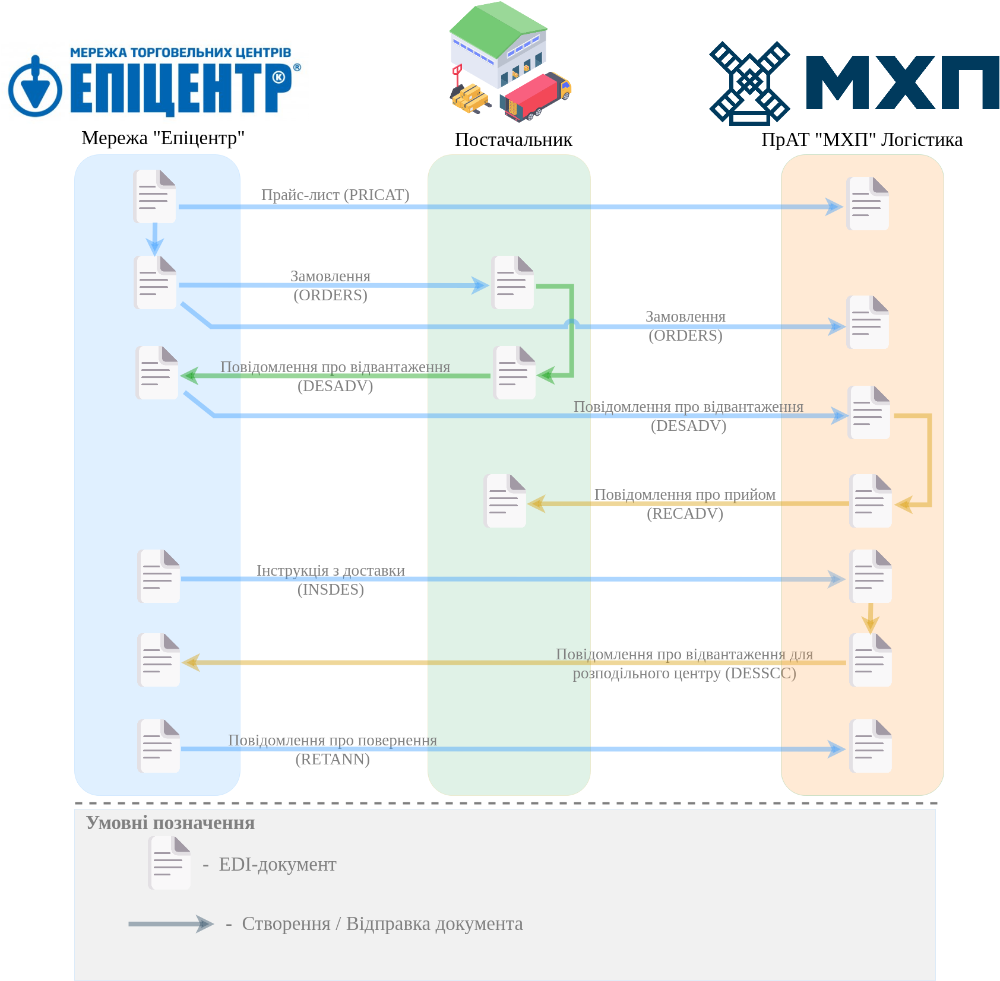

########################################################################################################################
Схема документообігу "Епіцентр" - "Постачальник" - "МХП" (3PL-оператор) на платформі EDI Network 2.0
########################################################################################################################

.. картинки в текст

.. |лупа| image:: /_constant/icons/magnifying_glass.png

.. |будинок| image:: /_constant/icons/house.png

.. role:: red

.. contents:: Зміст:
   :depth: 2

---------

Вступ
====================================

Дана інструкція описує порядок документообігу Постачальника з мережею "Епіцентр" через ПрАТ "МХП" Логістика, як 3PL-оператора на платформі EDI Network 2.0. В документообігу приймають участь наступні документи:

- `Прайс-лист (PRICAT) <https://wiki.edin.ua/uk/latest/EDIN_Specs/XML/PRICAT_x.html>`__
- `Замовлення (ORDER) <https://wiki.edin.ua/uk/latest/EDIN_Specs/XML/ORDER_x.html>`__
- `Повідомлення про відвантаження (DESADV) <https://wiki.edin.ua/uk/latest/EDIN_Specs/XML/DESADV_x.html>`__
- `Повідомлення про прийом (RECADV) <https://wiki.edin.ua/uk/latest/EDIN_Specs/XML/RECADV_x.html>`__
- `Інструкція з доставки (INSDES) <https://wiki.edin.ua/uk/latest/EDIN_Specs/XML/INSDES_x.html>`__
- `Повідомлення про відвантаження для розподільного центру (DESSCC) <https://wiki.edin.ua/uk/latest/EDIN_Specs/XML/DESSCC_x.html>`__
- `Повідомлення про повернення (RETANN) <https://wiki.edin.ua/uk/latest/EDIN_Specs/XML/RETANN_x.html>`__

**Загальна схема документообігу:**

1 Вхід на платформу
====================================

.. include:: /general_2_0/rabota_s_platformoj_EDIN_2.0.rst
   :start-after: .. початок блоку для Enter
   :end-before: .. кінець блоку для Enter

Після успішної авторизації відкриється основне меню, де у вкладці **"Продукти та рішення"** EDIN потрібно обрати сервіс **"EDI Network"**:

.. image:: /_constant/pics_landing/landing_edi.png
   :align: center

.. deprecated

   .. _pricat-create:

   2 Створення та відправка "Прайс-листа" (PRICAT). Сторона Постачальника
   ==============================================================================================================

   Постачальник є ініціатором документообігу і надсилає "Прайс-лист" (PRICAT) в Мережу ("Епіцентр"). "Прайс-лист" (PRICAT) служить для опису товарів і послуг. В документі вказується штрих-код продукту, його опис, ціна, ставка ПДВ.

   .. include:: /retail_2.0/PRICAT_na_EDI_Network.rst
      :start-after: .. початок блоку для Pricat_from_zero
      :end-before: .. кінець блоку для Pricat_from_zero

.. _docs-send:

2 Створення та відправка "Прайс-листа" (PRICAT) від мережі "Епіцентр"
==============================================================================================================

Мережа "Епіцентр" є ініціатором документообігу і для того, щоб здійснити обмін мета-даними за товаром мережа "Епіцентр" створює "Прайс-лист" (PRICAT) з вказанням інформації про кількість, умови зберігання, габарити та характеристики товару, що буде постачатись на склад 3pl-оператора (ПрАТ "МХП" Логістика) для того, щоб останній мав уявлення про кількість місця та умови, які необхідно підготувати для зберігання товару.

Після обміну мета-даними мережа "Епіцентр" формує "Замовлення" (ORDER) Постачальнику та дублює цей документ без цін з вказанням точки доставки (GLN) відповідного складу ПрАТ "МХП" Логістика, як отримувача.

.. _desadv-create:

3 Створення та відправка "Повідомлення про відвантаження" (DESADV). Сторона Постачальника
==============================================================================================================

.. include:: /retail_2.0/formirovanie_otpravka_dokumenta_Uvedomlenie_ob_otgruzke_DESADV_na_EDI_Network_2.0.rst
   :start-after: .. початок блоку для Desadv_from_Order
   :end-before: .. кінець блоку для Desadv_from_Order

.. _desadv-resend:

4 Відправка "Повідомлення про відвантаження" (DESADV) від мережі "Епіцентр"
==============================================================================================================

Мережа "Епіцентр" дублює "Повідомлення про відвантаження" (DESADV) без цін та відправляє в ПрАТ "МХП" Логістика.

.. _recadv-create:

5 Створення та відправка "Повідомлення про прийом" (RECADV). Сторона ПрАТ "МХП" Логістика
==============================================================================================================

ПрАТ "МХП" Логістика створює "Повідомлення про прийом" (RECADV), чим підтверджує фактичний прийом товарних позиції до кінцевої точки доставки у зазначеній кількості, згідно замовлення.

.. include:: /retail_2.0/formirovanie_RECADV_na_EDI_Network_2.0.rst
   :start-after: .. початок блоку для Recadv_from_desadv
   :end-before: .. кінець блоку для Recadv_from_desadv

.. _insdes-create:

6 Створення та відправка "Інструкції з доставки" (INSDES). Сторона мережі "Епіцентр"
==============================================================================================================

За потреби отримки товарів зі складів 3pl-оператора (ПрАТ "МХП" Логістика), мережа "Епіцентр" формує "Інструкцію з доставки" (INSDES) з вказанням потрібних товарних позиції та кінцевою точкою доставки для конкретної позиції.

.. include:: /retail_2.0/INSDES_na_EDI_Network.rst
   :start-after: .. початок блоку для Insdes_from_zero
   :end-before: .. кінець блоку для Insdes_from_zero

.. _desscc-create:

7 Створення та відправка "Повідомлення про відвантаження для розподільного центру" (DESSCC). Сторона ПрАТ "МХП" Логістика
=============================================================================================================================

На підставі отриманої "Інструкції з доставки" (INSDES) 3pl-оператор (ПрАТ "МХП" Логістика) створює "Повідомлення про відвантаження для розподільного центру" (DESSCC), де вказує позиції, що будуть поставлені, їх кількість. У цьому документі є можливість внести інформацію по кожній палеті, тому цей документ дуже детально описує кожну поставку.

.. include:: /retail_2.0/DESSCC_na_EDI_Network.rst
   :start-after: .. початок блоку для Desscc_from_Insdes
   :end-before: .. кінець блоку для Desscc_from_Insdes

.. _retann-send:

8 Відправка "Повідомлення про повернення" (RETANN) від мережі "Епіцентр"
==============================================================================================================

Для повернення тари та неприйнятих товарів мережа "Епіцентр" формує "Повідомлення про повернення" (RETANN) та відправляє 3pl-оператору (ПрАТ "МХП" Логістика).

-------------------------------------

.. include:: /_constant/kontakti.rst
