########################################################################################################################
Робота зі «Зведеною ТТН» на веб-платформі EDIN 
########################################################################################################################

.. this instruction not announced

.. role:: green

.. role:: blue

.. role:: navy

.. role:: red

.. role:: orange

.. contents:: Зміст:
   :depth: 2

---------

Вступ
====================================

**Загальна схема документообігу:**

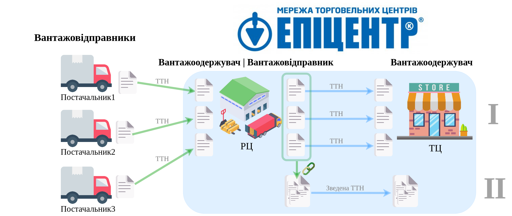

**Постачальники** (Вантажовідправники) відправляють свої ТТН (`за стандартним процесом <https://wiki.edin.ua/uk/latest/API_ETTNv3_1/Work_with_API/ETTNv3_API_work.html>`__) в РЦ мережі "Епіцентр", що виступає Вантажоодержувачем в даних документах. Далі РЦ мережі "Епіцентр" інтегровано:

* формує нові ТТН
* формує «Зведену ТТН»
* додає зв'зки між створеними «Зведеною ТТН» та звичаними ТТН, що відносяться до одного ТЦ

Після чого відповідальний працівник РЦ мережі "Епіцентр" може авторизуватись на веб-платформі EDIN.

1 Вхід на платформу
====================================

.. include:: /general_2_0/rabota_s_platformoj_EDIN_2.0.rst
   :start-after: .. початок блоку для Enter
   :end-before: .. кінець блоку для Enter

Після успішної авторизації відкриється основне меню, де у вкладці **"Продукти та рішення"** EDIN потрібно обрати сервіс **"EDI Network"**:

.. image:: /_constant/pics_landing/landing_edi.png
   :align: center

.. _consolidated-TTN-send:

2 Відправка «Зведеної ТТН» РЦ (Вантажовідправник)
==============================================================================================================

Для ознайомлення з інтегровано створеними документами потрібно перейти в "Чернетки" та обрати "Зведену товарно-танспортну накладну", яку потрібно відправити контрагенту (для зручності можливо скористатись `пошуком <https://wiki.edin.ua/uk/latest/general_2_0/rabota_s_platformoj_EDIN_2.0.html#doc-search>`__):

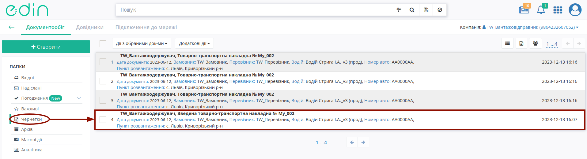

«Зведена ТТН» доступна лише до перегляду (жодні дані цього документа не доступні до редагування), а в блоці **Пов'язані документи** відображаються зв'язки зі звичайними ТТН:

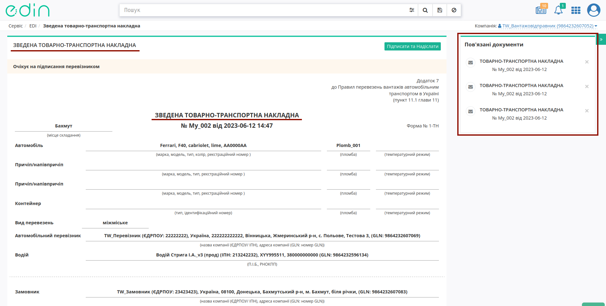

.. hint::
   При переході до пов'язаної ТТН відображається відповідний зв'язок:

   .. image:: pics_Epicentr_consolidated_TTN_instruction/Epicentr_consolidated_TTN_instruction_004.png
      :align: center

За потреби можливо видалити зв'язок з ТТН «Зведеною ТТН» за допомогою кнопки:

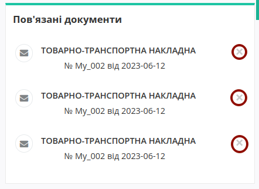

Після перевірки вмісту «Зведеної ТТН» можливо **"Підписати та Надіслати"** документи:

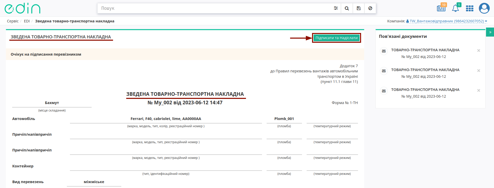

.. hint::
   Процес підписання є типовим на платформі EDI Network та описаний в `розділі нижче <https://wiki.edin.ua/uk/latest/ClientProcesses/Epicentr/Epicentr_Instructions/Epicentr_consolidated_TTN_instruction_web.html#sign>`__.

Після чого виконується масове підписання всі пов'язаних ТТН та відправка Вашим контагентам разом зі «Зведеною ТТН». При запуску масових операцій в правому нижньому куті екрану запускається віджет, що відображає :navy:`процес` та :green:`успішний` / :red:`з помилками` результат виконання поставлених задач для кожного документа/дії окремо:

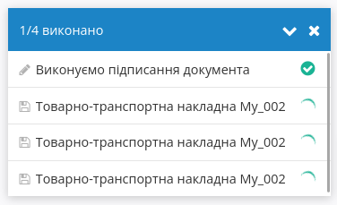

.. image:: pics_Epicentr_consolidated_TTN_instruction/Epicentr_consolidated_TTN_instruction_008.png

.. image:: pics_Epicentr_consolidated_TTN_instruction/Epicentr_consolidated_TTN_instruction_009.png

Відправлені документи потрапляють і відображаються у "Надіслані" зі статусом :orange:`Очікує на підписання перевізником`:

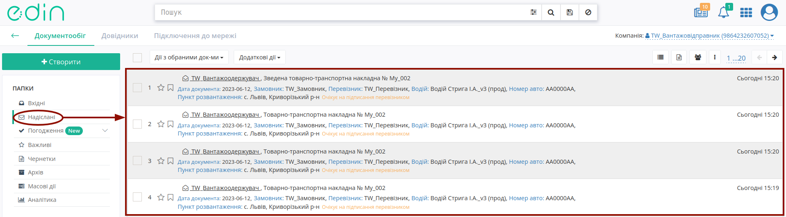

.. _from-consignor-to-carrier:

3 Обробка вхідної «Зведеної ТТН» на стороні Перевізника
==============================================================================================================

Для обробки "Зведеної ТТН" **Перевізником** в сервісі "EDI Network" потрібно перейти у **"Вхідні"** та вибрати **"Зведену ТТН"** в статусі :orange:`"Очікує на підписання перевізником"` (для зручності можливо скористатись рядком `пошуку <https://wiki.edin.ua/uk/latest/general_2_0/rabota_s_platformoj_EDIN_2.0.html#doc-search>`__):

.. image:: pics_Epicentr_consolidated_TTN_instruction/Epicentr_consolidated_TTN_instruction_011.png
   :align: center

У відкритому документі «Зведена ТТН» відображаються дані цього документа, а в блоці **Пов'язані документи** відображаються зв'язки зі звичайними ТТН (звичайні ТТН можуть прийти раніше):

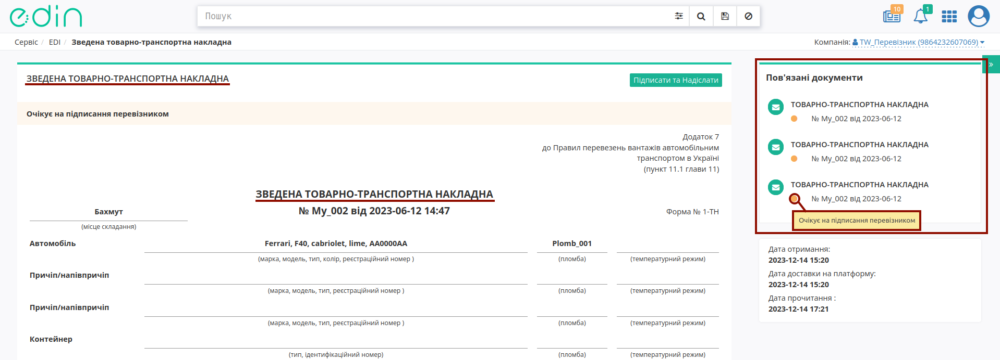

.. hint::
   При переході до пов'язаної ТТН відображається відповідний зв'язок:

   .. image:: pics_Epicentr_consolidated_TTN_instruction/Epicentr_consolidated_TTN_instruction_013.png
      :align: center

Після перевірки вмісту «Зведеної ТТН» можливо **"Підписати та Надіслати"** документи:

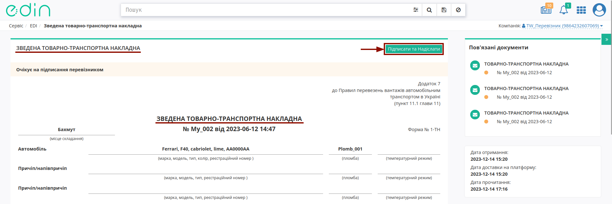

Перед підписанням потрібно обрати та **"Додати відповідальну особу"**:

.. image:: pics_Epicentr_consolidated_TTN_instruction/Epicentr_consolidated_TTN_instruction_023.png
   :align: center

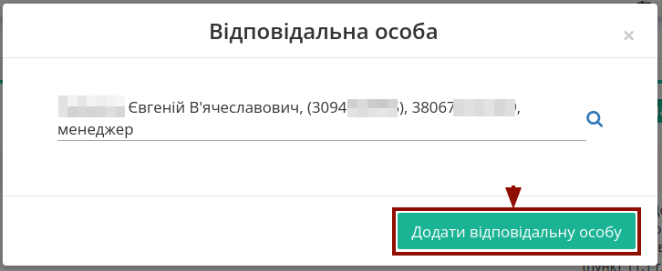

.. hint::
   Процес підписання є типовим на платформі EDI Network та описаний в `розділі нижче <https://wiki.edin.ua/uk/latest/ClientProcesses/Epicentr/Epicentr_Instructions/Epicentr_consolidated_TTN_instruction_web.html#sign>`__.

Після чого виконується масове підписання всі пов'язаних ТТН та відправка разом зі «Зведеною ТТН». При запуску масових операцій в правому нижньому куті екрану запускається віджет, що відображає :navy:`процес` та :green:`успішний` / :red:`з помилками` результат виконання поставлених задач для кожного документа/дії окремо:

.. image:: pics_Epicentr_consolidated_TTN_instruction/Epicentr_consolidated_TTN_instruction_008.png

.. image:: pics_Epicentr_consolidated_TTN_instruction/Epicentr_consolidated_TTN_instruction_009.png

Після відправки документів **Перевізником** їм присвоюється статус :orange:`Очікує на підписання вантажоодержувачем`:

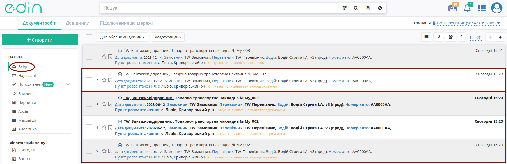

.. _from-carrier-to-consignee:

4 Обробка вхідної «Зведеної ТТН» на стороні Вантажоодержувача
==============================================================================================================

Для обробки "Зведеної ТТН" **Вантажоодержувачем** в сервісі "EDI Network" потрібно перейти у **"Вхідні"** та вибрати **"Зведену ТТН"** в статусі :orange:`"Очікує на підписання вантажоодержувачем"` (для зручності можливо скористатись рядком `пошуку <https://wiki.edin.ua/uk/latest/general_2_0/rabota_s_platformoj_EDIN_2.0.html#doc-search>`__):

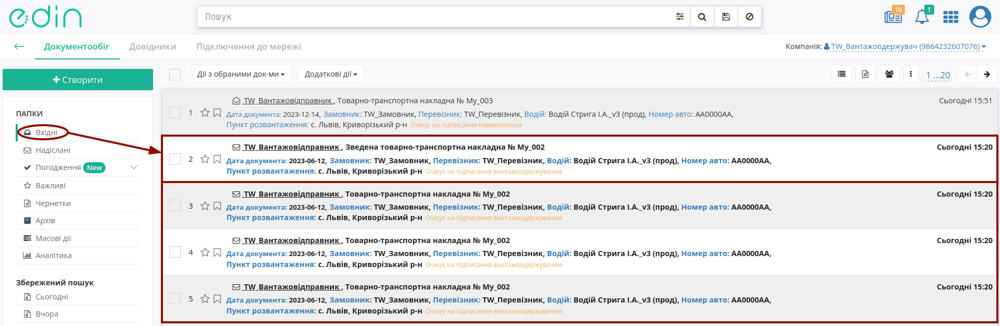

У відкритому документі «Зведена ТТН» відображаються дані цього документа, а в блоці **Пов'язані документи** відображаються зв'язки зі звичайними ТТН (звичайні ТТН можуть прийти раніше):

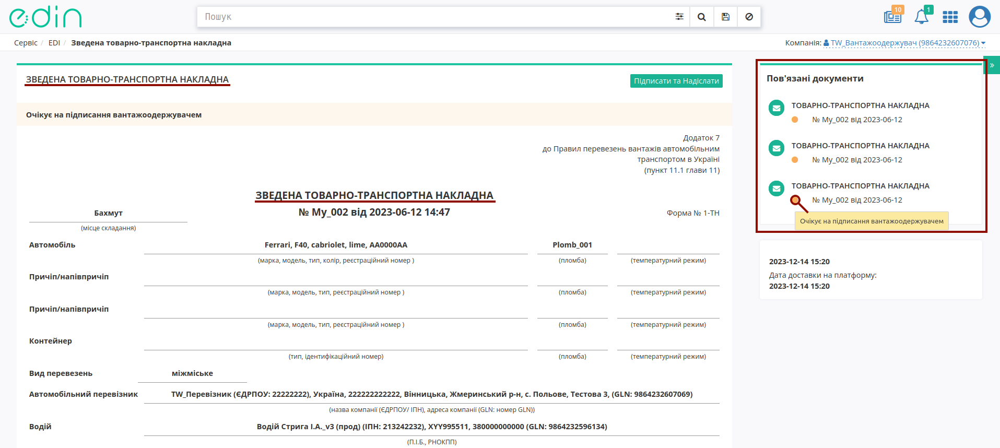

.. hint::
   При переході до пов'язаної ТТН відображається відповідний зв'язок:

   .. image:: pics_Epicentr_consolidated_TTN_instruction/Epicentr_consolidated_TTN_instruction_020.png
      :align: center

Після перевірки вмісту «Зведеної ТТН» можливо **"Підписати та Надіслати"** документи:

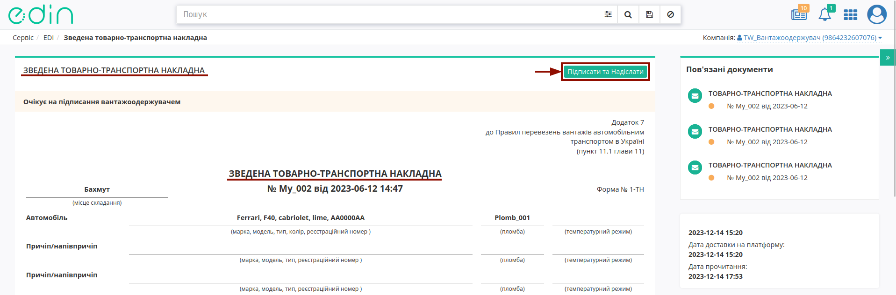

Перед підписанням потрібно обрати та **"Додати відповідальну особу"**:

.. image:: pics_Epicentr_consolidated_TTN_instruction/Epicentr_consolidated_TTN_instruction_023.png
   :align: center

.. hint::
   Процес підписання є типовим на платформі EDI Network та описаний в `розділі нижче <https://wiki.edin.ua/uk/latest/ClientProcesses/Epicentr/Epicentr_Instructions/Epicentr_consolidated_TTN_instruction_web.html#sign>`__.

Після чого виконується масове підписання всі пов'язаних ТТН та відправка разом зі «Зведеною ТТН». При запуску масових операцій в правому нижньому куті екрану запускається віджет, що відображає :navy:`процес` та :green:`успішний` / :red:`з помилками` результат виконання поставлених задач для кожного документа/дії окремо:

.. image:: pics_Epicentr_consolidated_TTN_instruction/Epicentr_consolidated_TTN_instruction_008.png

.. image:: pics_Epicentr_consolidated_TTN_instruction/Epicentr_consolidated_TTN_instruction_009.png

Після відправки документів **Вантажоодержувачем** їм присвоюється статус :green:`Підписано вантажоодержувачем`:

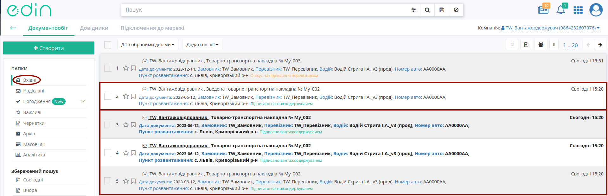

Документообіг завершено.

.. _sign:

Підписання на платформі EDIN 2.0
=========================================================================================================================

.. include:: /_constant/atb_check/atb_check.rst
   :start-after: .. початок блоку для ATB_check
   :end-before: .. кінець блоку для ATB_check

.. tabs::

   .. tab:: Файловий ключ

      .. include:: /_constant/signing/signing.rst
         :start-after: .. початок блоку для Signing
         :end-before: .. кінець блоку для Signing

   .. tab:: Token

      .. include:: /_constant/token_signing/token_signing.rst
         :start-after: .. початок блоку для TokenSign
         :end-before: .. кінець блоку для TokenSign

   .. tab:: Гряда

      .. include:: /_constant/gryada_signing/gryada_signing.rst
         :start-after: .. початок блоку для GryadaSign
         :end-before: .. кінець блоку для GryadaSign

   .. tab:: Cloud

      .. include:: /_constant/cloud_signing/cloud_signing.rst
         :start-after: .. початок блоку для CloudSign
         :end-before: .. кінець блоку для CloudSign

------------------------------------------------

.. include:: /_constant/kontakti.rst