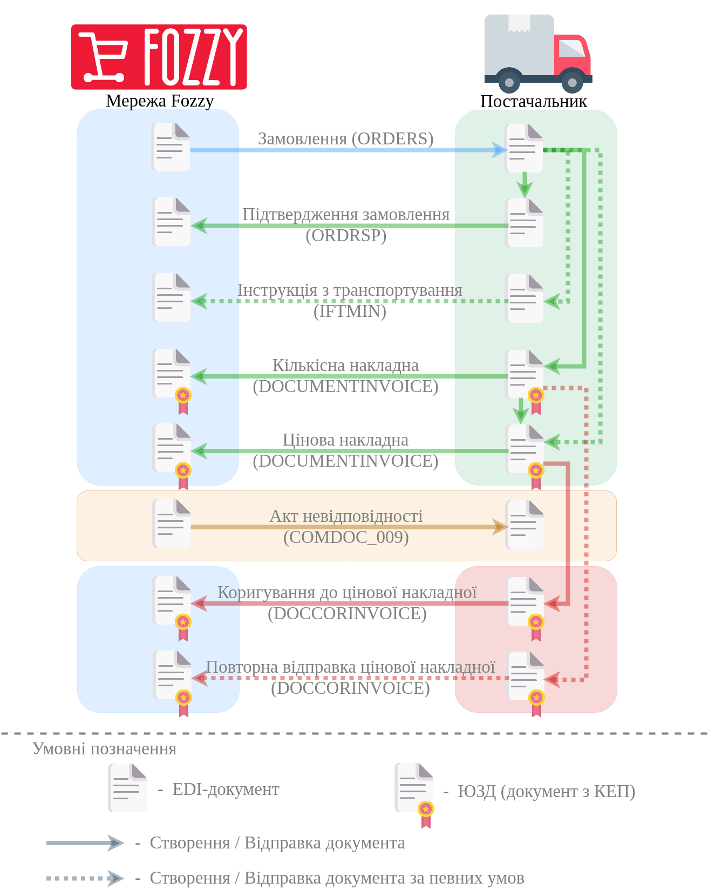

##################################################################################################################################################################################
Формування та відправка "Цінової накладної" / "Коригування до цінової накладної" мережі Фоззі за схемою "Match Invoice". Інструкція для Постачальника.
##################################################################################################################################################################################

.. сюда закину немного картинок для текста

.. role:: red

.. contents:: Зміст:
   :depth: 2

---------

"Цінова накладна" (DOCUMENTINVOICE.DocumentFunctionCode = PRN) є юридично значущим документом (ЮЗД) і може використовуватись при роботі з мережею Фоззі в схемі документообігу "Match Invoice".

Загальна схема документообігу:

"Цінова накладна" може бути створена Постачальником:

* на підставі вхідного "Замовлення" (ORDER);

.. image:: /ClientProcesses/Fozzy/Fozzy_Instructions/pics_Fozzy_DOCUMENTINVOICE_PRN_instruction/Fozzy_DOCUMENTINVOICE_PRN_instruction_002.png
   :align: center

* на підставі відправленої "Накладно ї за кількістю" (DOCUMENTINVOICE.DocumentFunctionCode = TN).

.. image:: /ClientProcesses/Fozzy/Fozzy_Instructions/pics_Fozzy_DOCUMENTINVOICE_PRN_instruction/Fozzy_DOCUMENTINVOICE_PRN_instruction_010.png
   :align: center

При цьому: якщо в ланцюжку документів вже відправлена "Накладна за кількістю", то "Цінову накладну" можливо створити лише на підставі "Накладної за кількістю".

`XML Специфікації для роботи з Фоззі (за схемою «Match Invoice») <https://wiki.edin.ua/uk/latest/ClientProcesses/Fozzy/Fozzy_XML-structure.html>`__

.. note::
   Формування "Цінової накладної" на підставі вхідного "Замовлення" (ORDER) чи відправленої "Накладної за кількістю" не має жодних відмінностей, якщо не враховувати вибір документа-підстави.

1 Формування "Цінової накладної" на підставі вхідного "Замовлення" (ORDER)
============================================================================================================================

.. початок блоку для documentinvoice_prn_from_order_Silpo

Для формування "Цінової накладної" (DOCUMENTINVOICE.DocumentFunctionCode = PRN) на підставі "Замовлення" (ORDER) потрібно перейти в розділ "Вхідні" та обрати потрібний документ. Для зручності можливо скористатись пошуком (за типом документа (приклад в зображенні), номером документа чи GLN):

.. image:: /ClientProcesses/Fozzy/Fozzy_Instructions/pics_Fozzy_DOCUMENTINVOICE_PRN_instruction/Fozzy_DOCUMENTINVOICE_PRN_instruction_001.png
   :align: center

У відкритому документі на формі-підказці виберіть зі списку **"Цінова накладна"**:

.. image:: /ClientProcesses/Fozzy/Fozzy_Instructions/pics_Fozzy_DOCUMENTINVOICE_PRN_instruction/Fozzy_DOCUMENTINVOICE_PRN_instruction_002.png
   :align: center

Після чого на підставі "Замовлення" (ORDER) автоматично створюється "Цінова накладна" (DOCUMENTINVOICE.DocumentFunctionCode = PRN). На формі створюваного документа значення більшості полів заповняться (пененесутся) з документа-підстави. Всі поля, позначені червоною зірочкою :red:`*` - **обов'язкові до заповнення**:

.. image:: /ClientProcesses/Fozzy/Fozzy_Instructions/pics_Fozzy_DOCUMENTINVOICE_PRN_instruction/Fozzy_DOCUMENTINVOICE_PRN_instruction_003.png
   :align: center

.. include:: /ClientProcesses/BOX_Market/BOX_Market_Instructions/BOX_Market_Standard.rst
   :start-after: .. початок блоку для ForAllDOCUMENTINVOICE
   :end-before: .. кінець блоку для ForAllDOCUMENTINVOICE

.. attention::
   Якщо при автоматичному заповненні чи подальшому редагуванні в товарних позиціях виникнуть логічні помилки, то Ви про це будете проінформовані, а позиції в таблиці, що їх налічують будуть виділені жовтим кольором:

   .. image:: /ClientProcesses/Fozzy/Fozzy_Instructions/pics_Fozzy_DOCUMENTINVOICE_PRN_instruction/Fozzy_DOCUMENTINVOICE_PRN_instruction_019.png
      :align: center

.. important::
   Дата "Цінової накладної" повинна співпадати з датою "Накладної за кількістю" (як в випадку передачі "Накладної за кількістю" через платфому EDIN, так і в паперовому вигляді)!

В табличній частині створеного документа знаходяться всі товарні позиції (перенесені з документа-підстави "Замовлення" (ORDER)). Детальну інформацію по позиції можливо переглянути натиснувши на кнопку біля номера позиції:

.. image:: /ClientProcesses/Fozzy/Fozzy_Instructions/pics_Fozzy_DOCUMENTINVOICE_PRN_instruction/Fozzy_DOCUMENTINVOICE_PRN_instruction_005.png
   :align: center

"Ставку ПДВ" можливо замінити при перегляді таблиці, а інші дані позицій можливо відредагувати та **"Змінити"** через pop-up вікно, що відкривається по кліку на штрихкод товару:

.. image:: /ClientProcesses/Fozzy/Fozzy_Instructions/pics_Fozzy_DOCUMENTINVOICE_PRN_instruction/Fozzy_DOCUMENTINVOICE_PRN_instruction_004.png
   :align: center

Також можливо **"Видалити"** товарні позиції з табличної частини документа:

.. image:: /ClientProcesses/Fozzy/Fozzy_Instructions/pics_Fozzy_DOCUMENTINVOICE_PRN_instruction/Fozzy_DOCUMENTINVOICE_PRN_instruction_006.png
   :align: center

До табличної частини "Цінової накладної" (DOCUMENTINVOICE.DocumentFunctionCode = PRN) можливо додавати лише ті позиції, що були вказані в "Замовленні" (вибрати зі списку). Якщо всі позиції співпадають з позиціями в "Замовленні" (ORDER), то в табличній частині кнопка **"+Додати"** не відображається:

.. image:: /ClientProcesses/Fozzy/Fozzy_Instructions/pics_Fozzy_DOCUMENTINVOICE_PRN_instruction/Fozzy_DOCUMENTINVOICE_PRN_instruction_007.png
   :align: center

Після внесення всіх необхідних змін в документ потрібно натиснути кнопку **"Зберегти"** (1), після чого можливо **"Підписати"** (2):

.. image:: /ClientProcesses/Fozzy/Fozzy_Instructions/pics_Fozzy_DOCUMENTINVOICE_PRN_instruction/Fozzy_DOCUMENTINVOICE_PRN_instruction_008.png
   :align: center

.. _sign:

1.1 Підписання та відправка "Цінової накладної"
--------------------------------------------------------------------------------------------------

.. tabs::

   .. tab:: Файловий ключ

      .. include:: /_constant/signing/signing.rst
         :start-after: .. початок блоку для Signing
         :end-before: .. кінець блоку для Signing

   .. tab:: Token

      .. include:: /_constant/token_signing/token_signing.rst
         :start-after: .. початок блоку для TokenSign
         :end-before: .. кінець блоку для TokenSign

   .. tab:: Гряда

      .. include:: /_constant/gryada_signing/gryada_signing.rst
         :start-after: .. початок блоку для GryadaSign
         :end-before: .. кінець блоку для GryadaSign

   .. tab:: Cloud

      .. include:: /_constant/cloud_signing/cloud_signing.rst
         :start-after: .. початок блоку для CloudSign
         :end-before: .. кінець блоку для CloudSign

Після підписання "Цінової накладної" (DOCUMENTINVOICE.DocumentFunctionCode = PRN) документ потрібно **"Відправити"**:

.. image:: /ClientProcesses/Fozzy/Fozzy_Instructions/pics_Fozzy_DOCUMENTINVOICE_PRN_instruction/Fozzy_DOCUMENTINVOICE_PRN_instruction_009.png
   :align: center

Відправлений документ автоматично потрапляє в папку **"Надіслані"** і буде знаходитись в ланцюжку документів разом із пов'язаними документами. Мережа зі своєї сторони переглядає та підписує документ.

.. attention::
   При виявленні помилок у відправленому документі його можливо перестворити (замінити новим), підписати та відправити **повторно**. "Номер" **повторно** відправленої "Цінової накладної" обов'язково повинен співпадати з "Номером" **попередньої** "Цінової накладної"! **Повторно** відправити "Цінову накладну" можливо лише за умови, що Мережа ще НЕ підписала **попередню** "Цінову накладну".

Обробка вхідного документа "Акт невідповідності" (COMDOC_009)
============================================================================================================================

У випадку розходження між відправленною і фактично прийнятою кількістю товару чи виникненням цінової розбіжності – мережа надсилає Вам "Акт невідповідності" (COMDOC_009):

.. image:: /ClientProcesses/Fozzy/Fozzy_Instructions/pictures/pics_robota_s_Fozzy_13_pred_net.png
   :align: center

У вхідному документі будуть зазначені кількісні чи цінові розбіжності по кожному товару та причина невідповідності.

.. image:: /ClientProcesses/Fozzy/Fozzy_Instructions/pictures/pics_robota_s_Fozzy_14.png
   :align: center

Після ознайомлення з документом необхідно відправити "Коригування до товарної накладної" (DOCCORINVOICE) з правками кількості/ціни згідно розбіжностей вказаних в "Акті невідповідності" (COMDOC_009) Мережі.

Формування та відправка "Коригування до цінової накладної" (DOCCORINVOICE)
============================================================================================================================

.. attention::
   Формування "Коригування до цінової накладної" (DOCCORINVOICE) можливе лише після того, як Мережа відправить "Акт невідповідності" (COMDOC_009)!

Для формування "Коригування до цінової накладної" (DOCCORINVOICE) на підставі "Цінової накладної" (DOCUMENTINVOICE.DocumentFunctionCode = PRN) потрібно перейти в розділ "Надіслані" та обрати потрібний документ:

.. image:: /ClientProcesses/Fozzy/Fozzy_Instructions/pics_Fozzy_DOCUMENTINVOICE_PRN_instruction/Fozzy_DOCUMENTINVOICE_PRN_instruction_012.png
   :align: center

У відкритому документі на формі-підказці виберіть зі списку **"Коригування до товарної накладної"**:

.. image:: /ClientProcesses/Fozzy/Fozzy_Instructions/pics_Fozzy_DOCUMENTINVOICE_PRN_instruction/Fozzy_DOCUMENTINVOICE_PRN_instruction_011.png
   :align: center

Після чого автоматично створюється "Коригування до товарної накладної" (DOCCORINVOICE). На формі створюваного документа значення більшості полів заповняться (пененесутся) з документа-підстави. Всі поля, позначені червоною зірочкою :red:`*` - **обов'язкові до заповнення**:

.. image:: /ClientProcesses/Fozzy/Fozzy_Instructions/pics_Fozzy_DOCUMENTINVOICE_PRN_instruction/Fozzy_DOCUMENTINVOICE_PRN_instruction_013.png
   :align: center

В залежності від обраного значення поля "Причина коригування" (CorrectionReason) в табличній частині стає доступним "Коригування":

.. attention::
   При заповненні "Коригування" вказується фактична Кількість/Ціна без ПДВ (тобто **без знаку мінус**)!

* в блоці "Ціна без ПДВ" при "Причина коригування" = "Коригування повернення" (CorrectionReason=NRC/PRC):

.. image:: /ClientProcesses/Fozzy/Fozzy_Instructions/pics_Fozzy_DOCUMENTINVOICE_PRN_instruction/Fozzy_DOCUMENTINVOICE_PRN_instruction_015.png
   :align: center

* в блоці "Кількість" при "Причина коригування" = "Коригування прийомки" (CorrectionReason=NAC/PAC):

.. image:: /ClientProcesses/Fozzy/Fozzy_Instructions/pics_Fozzy_DOCUMENTINVOICE_PRN_instruction/Fozzy_DOCUMENTINVOICE_PRN_instruction_014.png
   :align: center

Після внесення всіх необхідних змін в документ потрібно натиснути кнопку **"Зберегти"** (1), після чого можливо **"Підписати"** (2):

.. image:: /ClientProcesses/Fozzy/Fozzy_Instructions/pics_Fozzy_DOCUMENTINVOICE_PRN_instruction/Fozzy_DOCUMENTINVOICE_PRN_instruction_016.png
   :align: center

.. hint::
   Процес підписання "Коригування до товарної накладної" не відрізняється від підписання "Цінової накладної" та описаний в розділі вище.

Після підписання "Коригування до товарної накладної" (DOCCORINVOICE) документ потрібно **"Відправити"**:

.. image:: /ClientProcesses/Fozzy/Fozzy_Instructions/pics_Fozzy_DOCUMENTINVOICE_PRN_instruction/Fozzy_DOCUMENTINVOICE_PRN_instruction_017.png
   :align: center

Відправлений документ автоматично потрапляє в папку **"Надіслані"** і буде знаходитись в ланцюжку документів разом із пов'язаними документами:

.. image:: /ClientProcesses/Fozzy/Fozzy_Instructions/pics_Fozzy_DOCUMENTINVOICE_PRN_instruction/Fozzy_DOCUMENTINVOICE_PRN_instruction_018.png
   :align: center

Мережа зі своєї сторони переглядає та підписує документ.

.. кінець блоку для documentinvoice_prn_from_order_Silpo

------------------------------------------------

.. include:: /_constant/kontakti.rst
