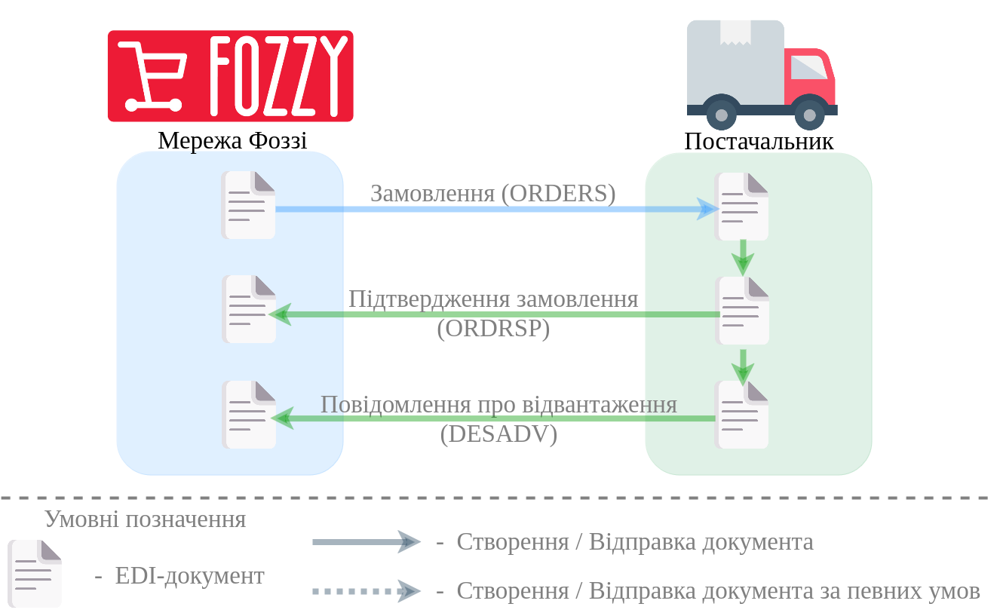

########################################################################################################################
Документообіг з мережею "Фоззі" на платформі EDI Network 2.0
########################################################################################################################

.. картинки в текст

.. |лупа| image:: /_constant/icons/magnifying_glass.png

.. |будинок| image:: /_constant/icons/house.png

.. |pencil_stencil| image:: /_constant/icons/pencil_stencil.png

.. |лупа2| image:: /_constant/icons/magnifying_glass2.png

.. |drag_dots| image:: /_constant/icons/drag_dots.png

.. |trash| image:: /_constant/icons/trash.png

.. |download| image:: /_constant/icons/download.png

.. role:: red

.. role:: orange

.. role:: underline

.. contents:: Зміст:
   :depth: 5

---------

Вступ
====================================

Дана інструкція описує порядок документообігу на платформі EDI Network 2.0 з мережею "Фоззі". В документообігу за типовою схемою приймають участь наступні документи:

- `Замовлення (ORDER) <https://wiki.edin.ua/uk/latest/ClientProcesses/Fozzy/Fozzy_XML-structure.html#order>`__
- `Підтвердження замовлення (ORDRSP) <https://wiki.edin.ua/uk/latest/ClientProcesses/Fozzy/Fozzy_XML-structure.html#ordrsp>`__
- `Повідомлення про відвантаження (DESADV) <https://wiki.edin.ua/uk/latest/EDIN_Specs/XML/DESADV_x.html>`__

Документообіг здійснюється між двома Учасниками, де ініціатором виступає мережа "Фоззі".

**Загальна схема документообігу:**

1 Вхід на платформу
====================================

.. include:: /general_2_0/rabota_s_platformoj_EDIN_2.0.rst
   :start-after: .. початок блоку для Enter
   :end-before: .. кінець блоку для Enter

Після успішної авторизації відкриється основне меню, де у вкладці **"Продукти та рішення"** EDIN потрібно обрати сервіс **"EDI Network"**:

.. image:: /_constant/pics_landing/landing_edi.png
   :align: center

.. _order-create:

2 Створення та відправка "Замовлення" (ORDER) на стороні мережі "Фоззі"
==============================================================================================================

.. include:: /retail_2.0/formirovanie_otpravka_ORDER_na_EDI_Network_2.0.rst
   :start-after: .. початок блоку для Order_from_zero
   :end-before: .. кінець блоку для Order_from_zero

.. _ordrsp_from_order:

3 Створення "Підтвердження замовлення" (ORDRSP) на підставі вхідного "Замовлення" (ORDER)
==========================================================================================================================

.. include:: /retail_2.0/ORDRSP_na_EDI_Network.rst
   :start-after: .. початок блоку для Ordrsp_from_docs
   :end-before: .. кінець блоку для Ordrsp_from_docs

.. _desadv_from_ordrsp:

4 Створення "Повідомлення про відвантаження" (DESADV) на підставі надісланого "Підтвердження замовлення" (ORDRSP)
==========================================================================================================================

.. include:: /retail_2.0/formirovanie_otpravka_dokumenta_Uvedomlenie_ob_otgruzke_DESADV_na_EDI_Network_2.0.rst
   :start-after: .. початок блоку для Desadv_from_Ordrsp
   :end-before: .. кінець блоку для Desadv_from_Ordrsp
   
------------------------------------------------

.. include:: /_constant/kontakti.rst
