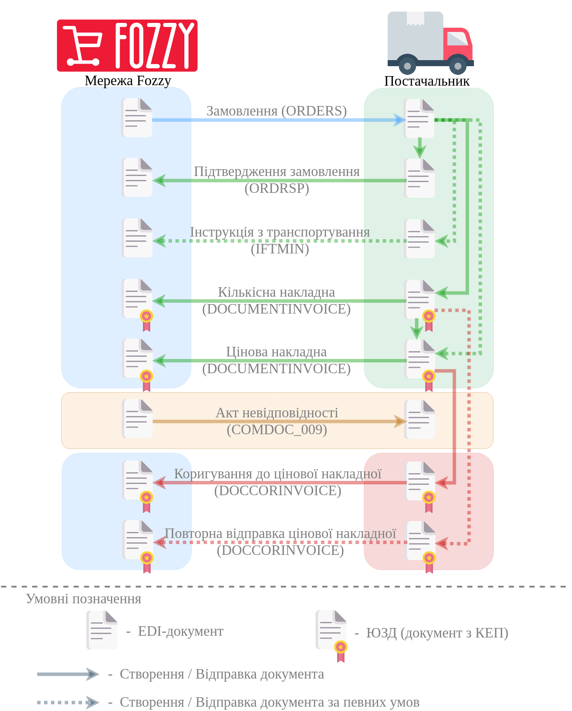

##################################################################################################################################################################################
Формування та відправка "Інструкція з транспортування" (IFTMIN) мережі Фоззі за схемою "Match Invoice". Інструкція для Постачальника.
##################################################################################################################################################################################

.. сюда закину немного картинок для текста

.. role:: red

.. contents:: Зміст:
   :depth: 2

---------

В схемі документообігу "Match Invoice" з мережею Фоззі "Інструкція з транспортування" (IFTMIN) створюється Постачальником на підставі вхідного "Замовлення" (ORDER).

Загальна схема документообігу:

`XML Специфікації для роботи з Фоззі (за схемою «Match Invoice») <https://wiki.edin.ua/uk/latest/ClientProcesses/Fozzy/Fozzy_XML-structure.html>`__

1 Формування "Інструкція з транспортування" (IFTMIN) на підставі вхідного "Замовлення" (ORDER)
==========================================================================================================================

.. початок блоку для iftmin_from_order_Silpo

Для формування "Інструкція з транспортування" (IFTMIN) на підставі "Замовлення" (ORDER) потрібно перейти в розділ "Вхідні" та обрати потрібний документ. Для зручності можливо скористатись пошуком (за типом документа (приклад в зображенні), номером документа чи GLN):

.. image:: /ClientProcesses/Fozzy/Fozzy_Instructions/pics_Fozzy_IFTMIN_instruction/Fozzy_IFTMIN_instruction_001.png
   :align: center

У відкритому документі на формі-підказці виберіть зі списку **"Інструкція з транспортування"**:

.. image:: /ClientProcesses/Fozzy/Fozzy_Instructions/pics_Fozzy_IFTMIN_instruction/Fozzy_IFTMIN_instruction_002.png
   :align: center

.. important::
   #. **Номер** документа повинен бути наступного формату **X_Y**, де:

   - **Х - це порядковий номер машини, на поставку** (порядковий № Повідомлення про відвантаження)
   - **Y - це загальна кількість машин, на поставку** (загальна кількість Повідомлень про відвантаження)

   Важливо, для кожної машини на поставку в один день повинен бути індивідуальний номер машини. Дві машини з однаковим номером машини будуть групуватися в одну.

   Мінімальна к-ть 1, Максимальна - 99.
   Х повинен бути менше або рівним Y. *Наприклад: 2_5*

.. attention::
   Особливість при заповненні Номера Кількісної накладної. Якщо в документі IFTMIN вказано кілька Замовлень і хоча б до одного прив’язана Кількісна накладна, то до інших замовлень теж повинні бути вказані накладні:

   .. image:: /ClientProcesses/Fozzy/Fozzy_Instructions/pics_Fozzy_IFTMIN_instruction/Fozzy_IFTMIN_instruction_003.gif
      :align: center

2. **Дата** - фактична дата відправки поставки
#. **Номер замовлення** - підтягується автоматично із замовлення
#. **Місце доставки** - підтягується автоматично із замовлення
#. **Вантажовідправник** - підтягується автоматично із замовлення
#. **Тип пакування** - вибрати з випадаючого списку
#. **Фактична кількість палет** - кількість палет, що відвантажується в вантажний транспорт
#. **Максимальна кількість палет** - максимальна місткість палет (вантажний транспорт)
#. **Вантажопідйомність** - маса вантажу, на перевезення якого розрахований транспортний засіб

Для відправлення документа натискаємо на кнопку **Зберегти** (1), після чого всі внесені зміни вступають в силу, а потім - **Відправити** (2):

.. image:: /ClientProcesses/Fozzy/Fozzy_Instructions/pics_Fozzy_IFTMIN_instruction/Fozzy_IFTMIN_instruction_004.png
   :align: center

.. кінець блоку для iftmin_from_order_Silpo

------------------------------------------------

.. include:: /_constant/kontakti.rst

