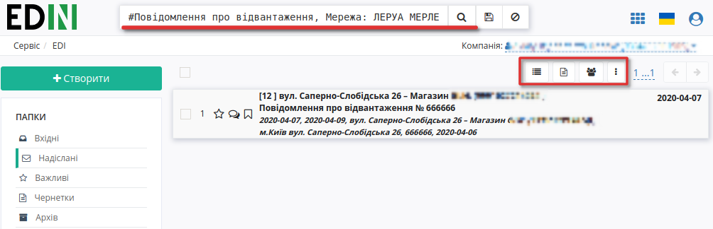
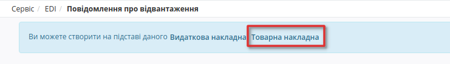
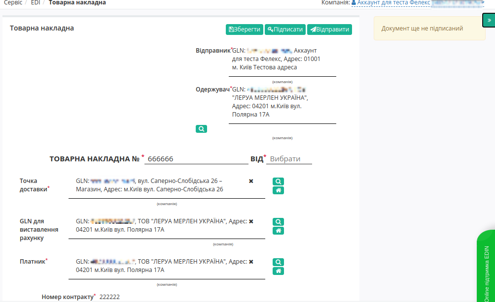
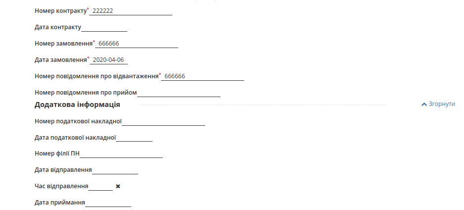
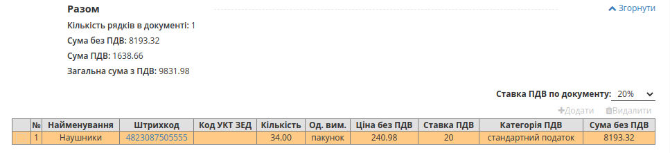
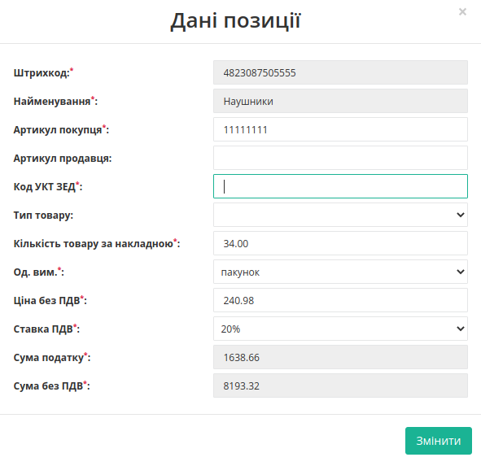
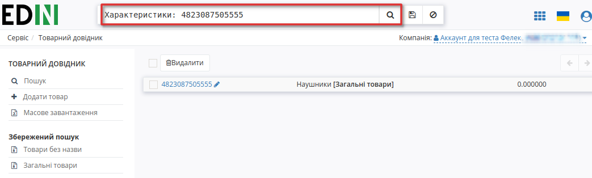
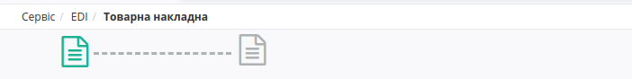
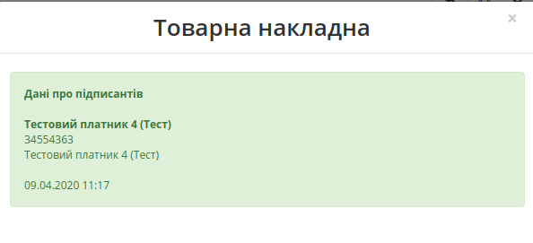

Формування Товарної накладної для Леруа Мерлен
###############################################################################

.. сюда закину немного картинок для текста

.. role:: red

.. contents:: Зміст:
   :depth: 2

---------

Вступ
====================================

Дана інструкція описує порядок формування Товарної накладної для мережі Leroy Merlin на web-платформі EDIN 2.0.

.. important::
    **Увага!**  Для коректного формування документу **ТН** необхідно заповнити Товарний довідник. Ви можете подивитися `Інструкцію щодо заповнення довідника <https://wiki.edin.ua/uk/latest/general_2_0/Directories.html>`_.

Перед початком роботи з Товарною накладною необхідно заповнити всі реквізити компанії.

Методи створення Товарної накладної
----------------------------------------------------

Створити Товарну накладну можливо двома способами:

1. Через меню «Створити» вибрати Товарну накладну
2. На підставі Повідомлення про відвантаження (DESADV)

Документ **Товарна накладна** для мережі Леруа Мерлен рекомендується формувати на підставі **Повідомлення про відвантаження** (DESADV); нижче наведено приклад формування **Товарної накладної** саме таким способом. 

   Повідомлення про відвантаження (DESADV) відправляє постачальник у відповідь на Замовлення (ORDER). При цьому постачальник може змінити кількість замовлених товарних позицій, що поставляються, дату і час поставки, додаткові відомості.

Для формування документа **Товарна накладна** необхідно перейти в каталог “**Надіслані**”.

Для зручності, відфільтруйте документи, виберіть потрібну мережу - «**Леруа Мерлен**» і вкажіть тип документа «**Повідомлення про відвантаження**».

У відкритому документі, на формі-підказці, котра дозволяє створити документ на основі Повідомлення про відвантаження, виберіть зі списку «**Товарна накладна**».

Заповнення документа Товарна накладна
----------------------------------------------------

Документ Товарна накладна створиться автоматично. Дані деяких полів пененесутся з документа основи. Необхідно заповнити обов'язкові дані, позначені червоною зірочкою :red:`*`, в кожному з блоків.

Перевірте правильність даних -  № та дату Товарної накладної, GLN контрагентів, номер замовлення та номер повідомлення про відвантаження на основі яких створено документ, чи додайте необов'язкову, додаткову інформацію:

Нижче на сторінці створеного документа знаходиться блок з інформацією по позиціях.  

Система автоматично заповнює значення за позиціями з раніше відправленого документа «Повідомлення про відвантаження», на основі якого був створений документ.
Вкажіть правильну **Ставку ПДВ по документу** для правильного розрахунку у блоці **Разом**.

При перевірці внесених даних за товарними позиціями необхідно впевнитись, що обов'язково заповнене поле **код УКТ ЗЕД**. 
У разі, якщо поле не заповнено або заповнено некоректно, при збереженні документа буде виведено повідомлення:

 Будь ласка, заповнiть повнiстю обов'язкову iнформацiю по всiм позицiям!

Код УКТ ЗЕД не може бути менше 4 символів.

Щоб додати код **УКТ ЗЕД** натисніть на штрихкод товару. Відкриється вікно з даними позиції:

Для того, щоб поле з кодом **УКТ ЗЕД** за товарними позиціями при формуванні документа Товарна Накладна заповнювалось автоматично, необхідно перевірити коректність заповнення даних в Товарному довіднику. Для цього перейдіть у сервіс **Товари** та знайдіть позицію за штрихкодом.

   
Після заповнення усіх обовязкових полів, будь ласка, збережіть документ!

.. _sign:

Підписання документа Товарна Накладна
----------------------------------------------------

Після збереження документа, його необхідно підписати Електронно-Цифровим підписом (ЕЦП) - кнопка **"Підписати"**.

.. загальне підписання на платформі

.. tabs::

   .. tab:: Файловий ключ

      .. include:: /_constant/signing/signing.rst
         :start-after: .. початок блоку для Signing
         :end-before: .. кінець блоку для Signing

   .. tab:: Token

      .. include:: /_constant/token_signing/token_signing.rst
         :start-after: .. початок блоку для TokenSign
         :end-before: .. кінець блоку для TokenSign

   .. tab:: Гряда

      .. include:: /_constant/gryada_signing/gryada_signing.rst
         :start-after: .. початок блоку для GryadaSign
         :end-before: .. кінець блоку для GryadaSign

   .. tab:: Cloud

      .. include:: /_constant/cloud_signing/cloud_signing.rst
         :start-after: .. початок блоку для CloudSign
         :end-before: .. кінець блоку для CloudSign

Після успішного підписання, натисніть кнопку **Відправити**. Відправлений документ додається в папку «Надіслані».
Після відправки у документі з'явиться візуалізація підпису "Товарна накладна" зеленим кольором, натиснувши на яку можна переглянути Дані про підписантів.

Сірим кольором відображається очікувана візуалізація підпису "Підтвердження товарної накладної", натиснувши на яку побачимо що документ ще не підписаний. 
Після підписання документа мережею, друга візуалізація підпису "Підтвердження товарної накладної" також стане зеленою, і в ній відобразяться Дані про підписантів.

Відправлену Товарну накладну можливо скачати у таких форматах: .pdf .xls .xml .zip .p7s

----------------------------
   
.. include:: /_constant/kontakti.rst
