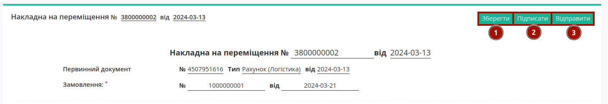
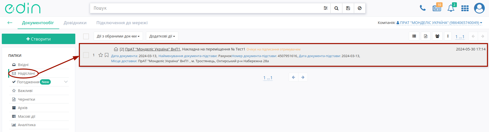
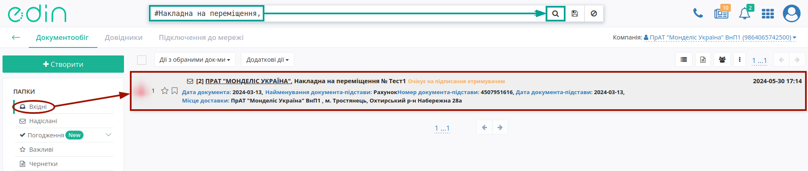
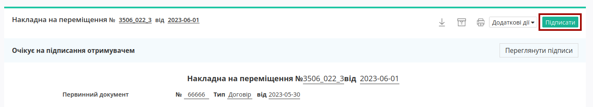

########################################################################################################################
Документообіг на платформі EDI Network 2.0 при внутрішніх перевезеннях ПрАТ "Монделіс Україна"
########################################################################################################################

.. картинки в текст

.. |лупа| image:: /_constant/icons/magnifying_glass.png

.. |будинок| image:: /_constant/icons/house.png

.. |pencil_stencil| image:: /_constant/icons/pencil_stencil.png

.. |лупа2| image:: /_constant/icons/magnifying_glass2.png

.. |drag_dots| image:: /_constant/icons/drag_dots.png

.. |trash| image:: /_constant/icons/trash.png

.. |download| image:: /_constant/icons/download.png

.. role:: red

.. role:: orange

.. role:: underline

.. contents:: Зміст:
   :depth: 5

---------

Вступ
====================================

Дана інструкція описує порядок документообігу на платформі EDI Network 2.0 при внутрішніх перевезеннях ПрАТ "Монделіс Україна". В типовому документообігу з ПрАТ "Монделіс Україна" приймають участь наступні документи:

- `Замовлення (ORDER) <https://wiki.edin.ua/uk/latest/EDIN_Specs/XML/ORDER_x.html>`__
- `Заявка на транспортування (TRANSPORTATIONORDER з SUBDOCTYPE=1) <https://wiki.edin.ua/uk/latest/Docs_ETTNv3/TRANSPORTATIONORDER/TRANSPORTATIONORDERpage_v3.html>`__
- `Підтвердження заявки на транспортування (TRANSPORTATIONORDER з SUBDOCTYPE=2) <https://wiki.edin.ua/uk/latest/Docs_ETTNv3/TRANSPORTATIONORDER/TRANSPORTATIONORDERpage_v3.html>`__
- `Накладна на переміщення (COMDOC_022) <https://wiki.edin.ua/uk/latest/EDIN_Specs/XML/COMDOC_022_x.html>`__
- `Електронна товарно-транспортна накладна (е-ТТН) <https://wiki.edin.ua/uk/latest/Docs_ETTNv3/ETTN/ETTNpage_v3.html>`__
- `Рахунок (Логістика) (COMDOC_040) <https://wiki.edin.ua/uk/latest/EDIN_Specs/XML/COMDOC_040_x.html>`__
- `Акт наданих послуг (Логістика) (COMDOC_037) <https://wiki.edin.ua/uk/latest/EDIN_Specs/XML/COMDOC_037_x.html>`__

Документообіг здійснюється між трьома Учасниками, де ініціатором виступає Вантажоодержувач на стороні ПрАТ "Монделіс Україна".

**Загальна схема документообігу:**

.. image:: pics_Mondelez_internal_transportation/Mondelez_internal_transportation_008.png
   :height: 700px
   :align: center

.. important:: 
   При внутрішніх перевезеннях на стороні ініціатора документообігу в якості **відправника** документа (ПрАТ "Монделіс Україна") зазначається основний **GLN=4829900033484** компанії, а **отримувачем** документа зазначається GLN складу, на який буде відправлений товар!

1 Вхід на платформу
====================================

.. include:: /general_2_0/rabota_s_platformoj_EDIN_2.0.rst
   :start-after: .. початок блоку для Enter
   :end-before: .. кінець блоку для Enter

Після успішної авторизації відкриється основне меню, де у вкладці **"Продукти та рішення"** EDIN потрібно обрати сервіс **"EDI Network"**:

.. image:: /_constant/pics_landing/landing_edi.png
   :align: center

.. _order-create:

2 Створення та відправка "Замовлення" (ORDER) Вантажоодержувачем (склад/відділеня ПрАТ "Монделіс Україна")
==============================================================================================================

.. include:: /retail_2.0/formirovanie_otpravka_ORDER_na_EDI_Network_2.0.rst
   :start-after: .. початок блоку для Order_from_zero
   :end-before: .. кінець блоку для Order_from_zero

.. _proposal-create:

3 Створення та відправка "Заявки на транспортування" (TRANSPORTATIONORDER з SUBDOCTYPE = 1) ПрАТ "Монделіс Україна"
==========================================================================================================================

.. include:: /ETTN_3_0/Create_Proposal_from.rst
   :start-after: .. початок блоку для Proposal_from_Order
   :end-before: .. кінець блоку для Proposal_from_Order

.. _proposal-confirmation-create:

4 Створення та відправка "Підтвердження заявки на транспортування" (TRANSPORTATIONORDER з SUBDOCTYPE = 2) Перевізником
==========================================================================================================================

.. include:: /ETTN_3_0/Create_Proposal_Confirmation_from.rst
   :start-after: .. початок блоку для Proposal_Confirmation_from_Proposal
   :end-before: .. кінець блоку для Proposal_Confirmation_from_Proposal

.. hint::
   Процес підписання документа не відрізняється від підписання описаного в `розділі вище <https://wiki.edin.ua/uk/latest/ClientProcesses/Mondelez/Mondelez_Instructions/Mondelez_internal_transportation.html#sign>`__.

.. include:: /ETTN_3_0/Create_Proposal_Confirmation_from.rst
   :start-after: .. початок блоку для Proposal_Confirmation_from_Proposal2
   :end-before: .. кінець блоку для Proposal_Confirmation_from_Proposal2

.. _comdoc-022-create:

5 Підписання "Накладної на переміщення" (COMDOC_022) між складами ПрАТ "Монделіс Україна"
==========================================================================================================================

5.1 Відправка "Накладної на переміщення" (COMDOC_022)
----------------------------------------------------------------------------------------------------------------------------

Документ "Накладна на переміщення" (COMDOC_022) підвантажується через облікову систему ПрАТ "Монделіс Україна" на платфому EDI Network 2.0 та доступний до перевірки та редагування відповідальним працівником:

.. image:: pics_Mondelez_internal_transportation/Mondelez_internal_transportation_009.png
   :align: center

Після редагування документ потрібно **"Зберегти"** (1), **"Підписати"** (2) та **"Відправити"** (3):

.. hint::
   Процес підписання документа не відрізняється від підписання описаного в `розділі вище <https://wiki.edin.ua/uk/latest/ClientProcesses/Mondelez/Mondelez_Instructions/Mondelez_internal_transportation.html#sign>`__.

Після відправки документа контрагенту він відображається в журналі вихідних документів в статусі :orange:`"Очікує на підписання отримувачем"`:

5.2 Обробка вхідної "Накладної на переміщення" (COMDOC_022)
----------------------------------------------------------------------------------------------------------------------------

Документ "Накладна на переміщення" (COMDOC_022) знаходиться у папці **"Вхідні"** (для зручності можливо скористатись `пошуком <https://wiki.edin.ua/uk/latest/general_2_0/rabota_s_platformoj_EDIN_2.0.html#doc-search>`__):

Для продовження документообігу потрібно **"Підписати"** вхідний документ:

.. hint::
   Процес підписання документа не відрізняється від підписання описаного в `розділі вище <https://wiki.edin.ua/uk/latest/ClientProcesses/Mondelez/Mondelez_Instructions/Mondelez_internal_transportation.html#sign>`__.

Після підписання документ змінює свій статус на :green:`"Підписано двома сторонами"`.

.. note::
   У випадку невідповідностей чи змінах в перевезеннях можливо оформити типову для комерціних документів **"Відмову від підписання"** (`детальніше <https://wiki.edin.ua/uk/latest/_constant/comdoc_reject/comdoc_reject.html>`__):

   .. image:: pics_Mondelez_internal_transportation/Mondelez_internal_transportation_014.png
      :align: center

.. _ettn-create:

6 Створення та відправка "е-ТТН" Вантажовідправником (склад ПрАТ "Монделіс Україна)"
==========================================================================================================================

.. include:: /ETTN_3_0/Create_ETTN_from.rst
   :start-after: .. початок блоку для ETTN_from_Proposal_Confirmation
   :end-before: .. кінець блоку для ETTN_from_Proposal_Confirmation

.. _ettn-to-processing:

7 Обробка вхідного "е-ТТН" документа на стороні Перевізника (Водія)
==========================================================================================================================

.. include:: /ETTN_3_0/Processing_ETTN.rst
   :start-after: .. початок блоку для from_Consignor_to_Carrier
   :end-before: .. кінець блоку для from_Consignor_to_Carrier

.. hint::
   Процес підписання документа не відрізняється від підписання описаного в `розділі вище <https://wiki.edin.ua/uk/latest/ClientProcesses/Mondelez/Mondelez_Instructions/Mondelez_internal_transportation.html#sign>`__.

.. include:: /ETTN_3_0/Processing_ETTN.rst
   :start-after: .. початок блоку для from_Consignor_to_Carrier2
   :end-before: .. кінець блоку для from_Consignor_to_Carrier2

.. _ettn-to-processing2:

8 Обробка вхідного "е-ТТН" документа на стороні Вантажоодержувача (склад ПрАТ "Монделіс Україна)
==========================================================================================================================

.. include:: /ETTN_3_0/Processing_ETTN.rst
   :start-after: .. початок блоку для from_Carrier_to_Consignee
   :end-before: .. кінець блоку для from_Carrier_to_Consignee

.. hint::
   Процес підписання документа не відрізняється від підписання описаного в `розділі вище <https://wiki.edin.ua/uk/latest/ClientProcesses/Mondelez/Mondelez_Instructions/Mondelez_internal_transportation.html#sign>`__.

.. include:: /ETTN_3_0/Processing_ETTN.rst
   :start-after: .. початок блоку для from_Carrier_to_Consignee2
   :end-before: .. кінець блоку для from_Carrier_to_Consignee2

.. _comdoc040-create:

10 Створення та відправка "Рахунок (Логістика)" (COMDOC_040) Перевізником
==========================================================================================================================

За документообігу транспортними документами без коригуючих актів "Рахунок (Логістика)" (COMDOC_040) створюється на підставі відправленого "Підтвердження заявки на транспортування" (TRANSPORTATIONORDER з SUBDOCTYPE = 2). Однак, якщо в процесі обробки "е-ТТН" створювалися і затверджувалися "Акт перевантаження" (ReloadAct) чи "Акт про заміну пункту призначення вантажу" (ConsigneeChangeAct), то для внесення змін до кінцевого "Рахунку (Логістика)" (COMDOC_040) ПрАТ "Монделіс Україна" створює новий документ "Заявка на транспортування" (TRANSPORTATIONORDER з SUBDOCTYPE=1), на підставі якого і створюється "Рахунок (Логістика)" (COMDOC_040).

**Перевізнику** для створення в сервісі "EDI Network" **"Рахунку (Логістика)" (COMDOC_040)** :

* :underline:`на підставі "Заявки на транспортування"` потрібно перейти у **"Вхідні"** та вибрати "Заявку на транспортування" в статусі :green:`"Підписано перевізником"` (для зручності можливо скористатись рядком `пошуку <https://wiki.edin.ua/uk/latest/general_2_0/rabota_s_platformoj_EDIN_2.0.html#doc-search>`__);
* :underline:`на підставі "Підтвердження заявки на транспортування"` потрібно перейти у **"Надіслані"** та вибрати "Підтвердження заявки на транспортування" в статусі :green:`"Підписано замовником"` (для зручності можливо скористатись рядком `пошуку <https://wiki.edin.ua/uk/latest/general_2_0/rabota_s_platformoj_EDIN_2.0.html#doc-search>`__):

.. image:: /ETTN_3_0/pics_Create_COMDOC_040_from/Create_COMDOC_040_from_001.png
   :align: center

.. hint::
   Також на підставі :underline:`підписаних з обох сторін` "Заявок на транспортування", "Підтверджень заявок на транспортування" та  :underline:`підписаних контрагентами (з трьох сторін)` "е-ТТН" доступне `масове створення чернеток "Рахунків (Логістика)" <https://wiki.edin.ua/uk/latest/general_2_0/massovi_operacii_EDIN_2.0.html#create-comdoc-037>`__.

.. warning::
   При повторному створенні даного документа (на рівні одного `ланцюжка документів <https://wiki.edin.ua/uk/latest/_constant/chain/chain.html>`__) успішно **"Відправити"** даний документ можливо лише за умови, що попередній/-ні "Рахунки (Логістика)" (COMDOC_040) були `відхилені <https://wiki.edin.ua/uk/latest/_constant/comdoc_revoke/comdoc_revoke.html>`__ чи `анульовані <https://wiki.edin.ua/uk/latest/_constant/comdoc_repeal/comdoc_repeal.html>`__.

У відкритому документі натисніть **"Створити документ"** "Рахунок (Логістика)" в блоці `ланцюжка документів <https://wiki.edin.ua/uk/latest/_constant/chain/chain.html>`__, наприклад:

.. image:: /ETTN_3_0/pics_Create_COMDOC_040_from/Create_COMDOC_040_from_002.png
   :align: center

.. image:: /ETTN_3_0/pics_Create_COMDOC_040_from/Create_COMDOC_040_from_011.png
   :align: center

.. include:: /ETTN_3_0/Create_COMDOC_040_from.rst
   :start-after: .. початок блоку для COMDOC_040_from_transport_001
   :end-before: .. кінець блоку для COMDOC_040_from_transport_001

.. hint::
   Процес підписання документа не відрізняється від підписання описаного в `розділі вище <https://wiki.edin.ua/uk/latest/ClientProcesses/Mondelez/Mondelez_Instructions/Mondelez_EDI_ETTN.html#sign>`__.

.. include:: /ETTN_3_0/Create_COMDOC_040_from.rst
   :start-after: .. початок блоку для COMDOC_040_from_transport_003
   :end-before: .. кінець блоку для COMDOC_040_from_transport_002

.. _comdoc037-create:

11 Створення та відправка "Акта наданих послуг (Логістика)" (COMDOC_037) Перевізником
==========================================================================================================================

"Акт наданих послуг (Логістика)" (COMDOC_037) може створюватись на підставі різних документів, але в даній схемі від ПрАТ "Монделіс Україна" логічно формується за відправленим "Рахунком (Логістика)" (COMDOC_040).

**Перевізнику** для створення в сервісі "EDI Network" **"Акта наданих послуг (Логістика)"** :underline:`на підставі "Рахунку (Логістика)"` потрібно перейти у **"Надіслані"** та вибрати відправлений "Рахунок (Логістика)" (COMDOC_040) (для зручності можливо скористатись рядком `пошуку <https://wiki.edin.ua/uk/latest/general_2_0/rabota_s_platformoj_EDIN_2.0.html#doc-search>`__):

.. image:: /ClientProcesses/Mondelez/Mondelez_Instructions/pics_Mondelez_EDI_ETTN/Mondelez_EDI_ETTN_005.png
   :align: center

.. hint::
   Також на підставі :underline:`підписаних з обох сторін` "Заявок на транспортування", "Підтверджень заявок на транспортування" та :underline:`підписаних контрагентами (з трьох сторін)` "е-ТТН" доступне `масове створення чернеток "Актів наданих послуг (Логістика)" <https://wiki.edin.ua/uk/latest/general_2_0/massovi_operacii_EDIN_2.0.html#create-comdoc-037>`__. 

.. warning::
   При повторному створенні даного документа (на рівні одного `ланцюжка документів <https://wiki.edin.ua/uk/latest/_constant/chain/chain.html>`__) успішно **"Відправити"** даний документ можливо лише за умови, що попередній/-ні "Акти наданих послуг (Логістика)" (COMDOC_037) були `відхилені <https://wiki.edin.ua/uk/latest/_constant/comdoc_revoke/comdoc_revoke.html>`__ чи `анульовані <https://wiki.edin.ua/uk/latest/_constant/comdoc_repeal/comdoc_repeal.html>`__.

У відкритому документі натисніть **"Створити документ"** "Акт наданих послуг (Логістика)" в блоці `ланцюжка документів <https://wiki.edin.ua/uk/latest/_constant/chain/chain.html>`__, наприклад:

.. image:: /ClientProcesses/Mondelez/Mondelez_Instructions/pics_Mondelez_EDI_ETTN/Mondelez_EDI_ETTN_007.png
   :align: center

.. include:: /ETTN_3_0/Create_COMDOC_037_from.rst
   :start-after: .. початок блоку для COMDOC_037_from_transport_001
   :end-before: .. кінець блоку для COMDOC_037_from_transport_001

.. hint::
   Процес підписання документа не відрізняється від підписання описаного в `розділі вище <https://wiki.edin.ua/uk/latest/ClientProcesses/Mondelez/Mondelez_Instructions/Mondelez_internal_transportation.html#sign>`__.

.. include:: /ETTN_3_0/Create_COMDOC_037_from.rst
   :start-after: .. початок блоку для COMDOC_037_from_transport_003
   :end-before: .. кінець блоку для COMDOC_037_from_transport_002

.. include:: /ClientProcesses/Mondelez/Mondelez_Instructions/Mondelez_EDI_ETTN.rst
   :start-after: .. початок блоку для debit_credit_Mondelez
   :end-before: .. кінець блоку для debit_credit_Mondelez
   
------------------------------------------------

.. _revoke:

Відкликання підпису комерційних документів (COMDOC)
=========================================================================================================================

.. include:: /_constant/comdoc_revoke/comdoc_revoke.rst
   :start-after: .. початок блоку для Comdoc_Revoke
   :end-before: .. кінець блоку для Comdoc_Revoke

------------------------------------------------

.. _repeal:

Анулювання підписаних комерційних документів (COMDOC)
=========================================================================================================================

.. include:: /_constant/comdoc_repeal/comdoc_repeal.rst
   :start-after: .. початок блоку для Comdoc_Repeal
   :end-before: .. кінець блоку для Comdoc_Repeal

.. _repeal-accept:

Підтвердження запиту на анулювання комерційного документа (COMDOC)
------------------------------------------------------------------------------------------------------------
.. include:: /_constant/comdoc_repeal_accept/comdoc_repeal_accept.rst
   :start-after: .. початок блоку для Comdoc_RepealAccept
   :end-before: .. кінець блоку для Comdoc_RepealAccept

------------------------------------------------

.. _reject:

Відмова від підписання комерційних документів (COMDOC)
=========================================================================================================================

.. include:: /_constant/comdoc_reject/comdoc_reject.rst
   :start-after: .. початок блоку для Comdoc_Reject
   :end-before: .. кінець блоку для Comdoc_Reject

------------------------------------------------

.. include:: /_constant/kontakti.rst
