Інструкція по роботі з документом "Прайс-лист" для PAMPIK (Лелека Трейд) на web-платформі 
####################################################################################################################

.. інструкція стара і там є кастомна поведінка веба, тож типова інструкція сюди не підходить. Колись тре оновить

.. role:: red

.. contents:: Зміст:
   :depth: 3

---------

**1 Формуваня документа "Прайс-лист"**
==============================================

Для входу на web платформу EDIN необхідно перейти за посиланням: https://edo-v2.edin.ua/.

Для формування документу на платформі необхідно натиснути на кнопку «Створити»:

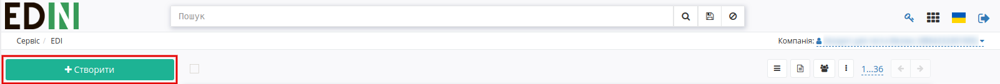

Після цього вибрати тип документа «Прайс-лист»:

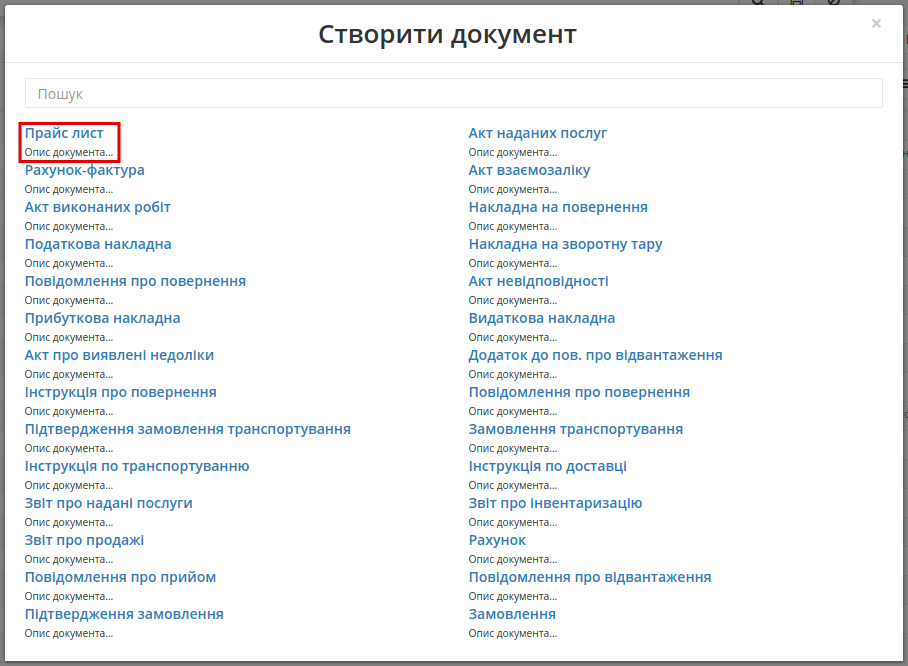

Відкриється форма документа:

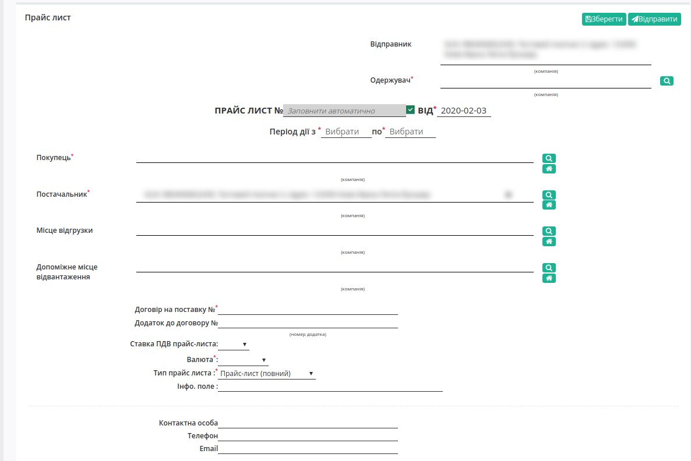

Після цього обрати одержувача документа — PAMPIK (Лелека Трейд).
В полі «Одержувач» необхідно натиснути на кнопку «Пошук», після цього в модальном окні вказати GLN компанії 9864066874774 та натиснути на кнопку «Вибрати».

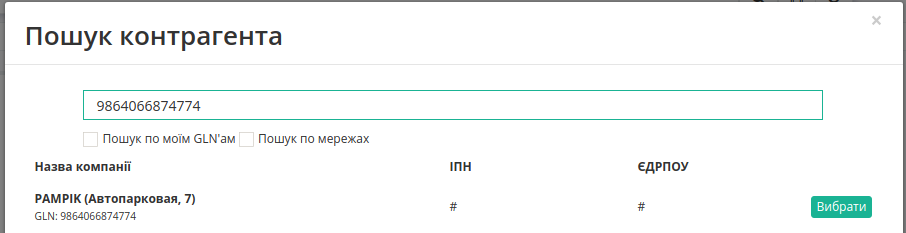

Відкриється модальне вікно з інформаційним повідомленням для підтвердження обраного одержувача, необхідно натиснути «Так» (після підтвердження всі заповнені раніше поля будуть очищені). Після підтвердження поле «Одержувач» недоступне для редагування.

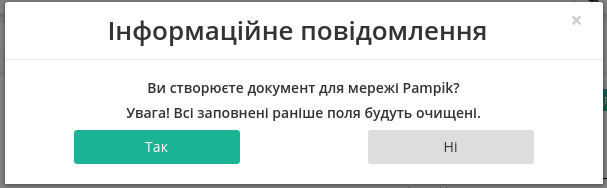

Відкриється форма документа для мережі PAMPIK (Лелека Трейд):

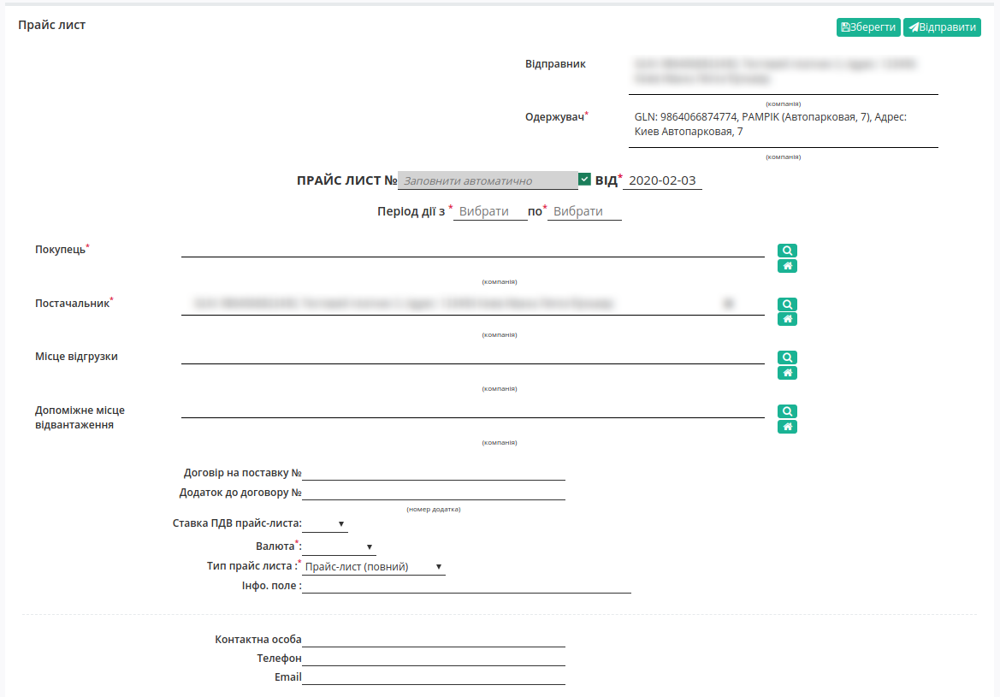

Обов’язкові поля для заповнення:

* Прайс-лист № — можна внести власний номер (при встановленій позначці номер присвоюється автоматично)
* Від (дата прайс-листа) — поточна дата
* Період дії з — дата початку дії цін
* Період дії по — дата закінчення дії цін
* Покупець  — необхідно натиснути на кнопку «Пошук», після цього в модальном окні вибрати PAMPIK (Лелека Трейд)
* Постачальник — автоматично вказується відправник документу
* Валюта — необхідно обрати «Гривня»
* Тип прайс-листа — Прайс-лист (повний), Доповнення прайс-листа

Всі інші поля не є обов’язковими для заповнення.

Після внесення всіх даних необхідно натиснути на кнопку «Зберегти». В правому верхньому куті буде відображено повідомлення:

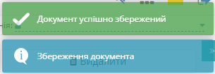

За необхідністю збережений документ можно видалити. Для цього необхідно натиснути на кнопку «Видалити» та в модальном окні підтвердити дію, натиснувши на кнопку «Так».

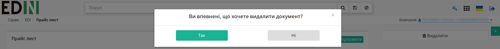

**2 Додавання товарних позицій**
==================================

2.1 Додавання товарних позицій за допомогою Шаблону
--------------------------------------------------------------------

Для додавання товарних позицій є можливість скористатись шаблоном. Для цього в нижній частині сторінки необхідно натиснути «Зберегти шаблон Excel»:

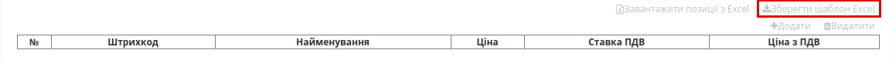

На Ваш комп’ютер буде завантажено файл з назвою **pricat_products_sample.xls**. Відкривши його, необхідно внести інформацію по товару.

Обов’язкові для заповнення поля (поля відмічені зеленим кольором):

* Штрихкод
* Найменування
* Ціна
* Ставка ПДВ
* Ціна з ПДВ

.. important:: Ні в якому разі не змінювати формат шаблону, не видаляти або додавати нові стовпці. Також не допускається зміна формату комірок.

.. hint:: В полі «Ставка ПДВ» необхідно вказати значення «0» або «7», або «20».

Після збереження заповненої інформації завантажуємо файл на веб-портал, скориставшись кнопкою «Завантажити позиції з Excel»:

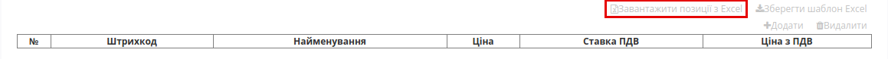

2.2 Додавання позицій з товарного довідника
--------------------------------------------------------------------

Також у користувачів є можливість додавати позиції до документу з заповненого раніше товарного довідника. Для цього необхідно натиснути на кнопку «Додати»:

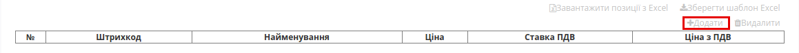

Відкриється вікно заповнення інформації, в якому необхідно внести найменування продукції. У випадку наявності даної продукції в товарному довіднику інформація буде заповнена автоматично. Для додавання товарної позиції до прайс-листу необхідно заповнити обов’язкові поля, що позначені червоною зірочкою :red:`*`. Після цього необхідно натиснути на кнопку «Додати».  

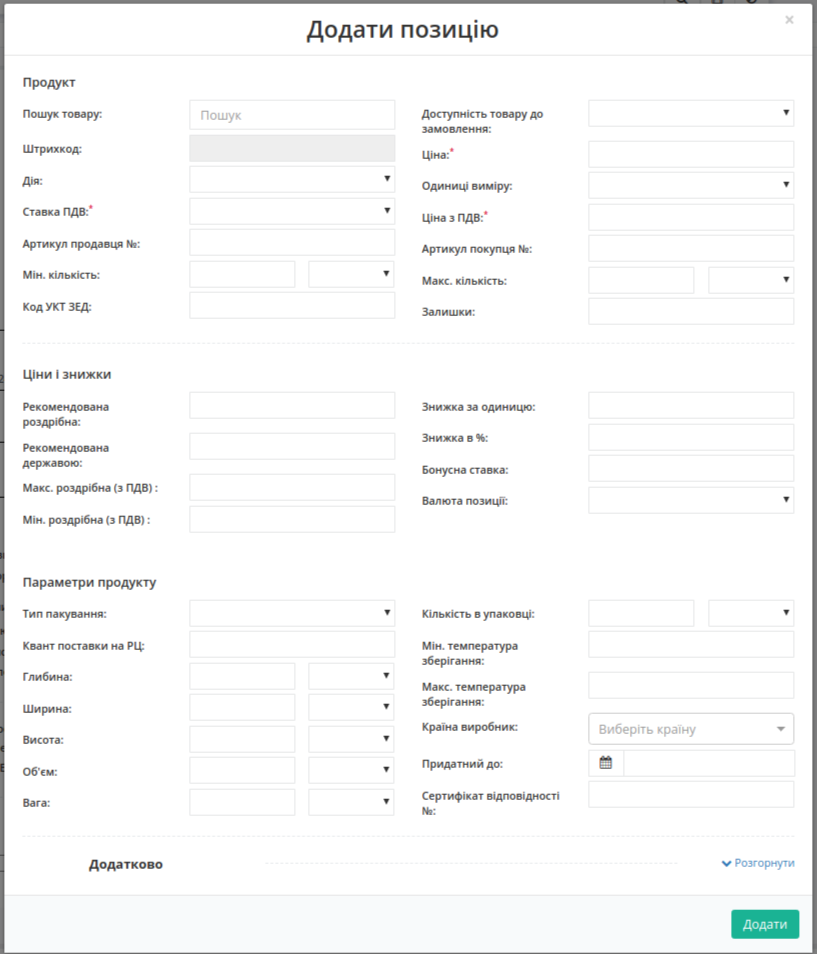

Якщо в товарному довіднику продукція відсутня, користувачу необхідно її додати. Для цього необхідно в правому верхньому куті обрати сервіс «Товари» та додати продукцію до товарного довідника.

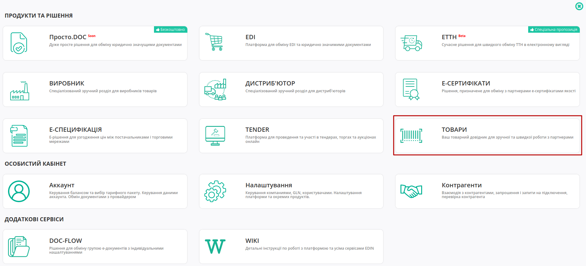

Інструкція щодо додавання продукції до `Товарного довідника <https://wiki.edin.ua/uk/latest/general_2_0/Directories.html#goods-directory>`__.

**3 Збереження та відправка документу**
================================================

При вдалому завантаженні товарні позиції будуть відображені в прайс-листі. Після чого необхідно натиснути «Зберегти» та «Відправити».
Після відправки документ буде відображений в папці «Вихідні» на веб-порталі.

---------------------------------

.. include:: /_constant/kontakti.rst