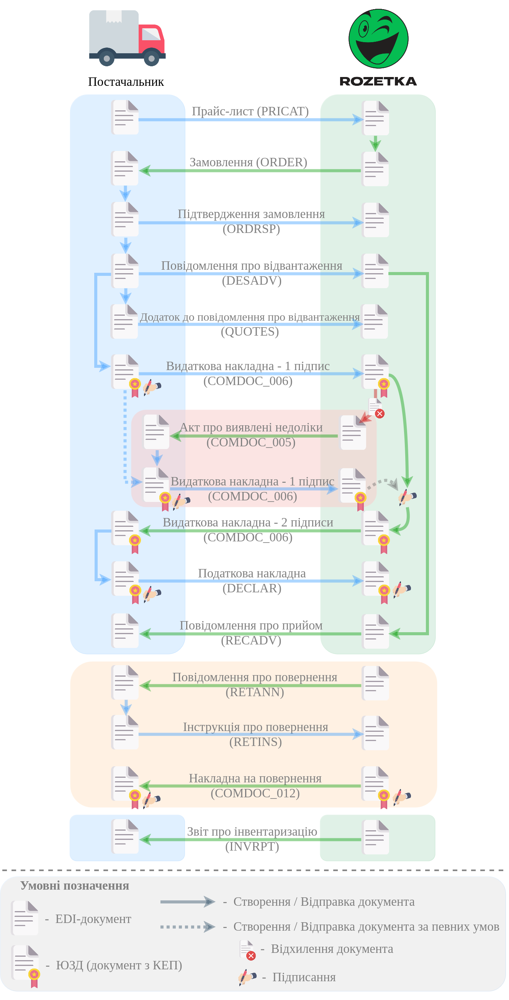
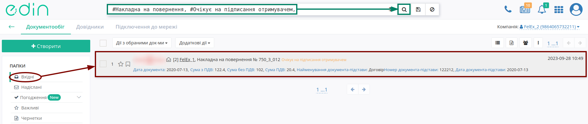
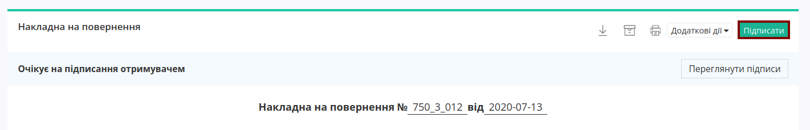

#############################################################################################################################
Документообіг з мережею "Розетка" на платформі EDI Network 2.0. Інструкція для Постачальника
#############################################################################################################################

.. сюда закину немного картинок для текста

.. |bad_doc| image:: /general_2_0/pics_rabota_s_platformoj_EDIN_2.0/rabota_s_platformoj_066.png

.. |лупа| image:: /_constant/icons/magnifying_glass.png

.. |будинок| image:: /_constant/icons/house.png

.. role:: red

.. role:: green

.. role:: orange

.. role:: underline

.. contents:: Зміст:
   :depth: 5

---------

Вступ
====================================

Дана інструкція описує порядок документообігу з мережею "Розетка" на платформі EDI Network 2.0. В документообігу приймають участь наступні документи:

- `Прайс-лист (PRICAT) <https://wiki.edin.ua/uk/latest/ClientProcesses/Rozetka/Rozetka_XML/PRICAT_x.html>`__
- `Замовлення (ORDER) <https://wiki.edin.ua/uk/latest/EDIN_Specs/XML/ORDER_x.html>`__
- `Підтвердження замовлення (ORDRSP) <https://wiki.edin.ua/uk/latest/EDIN_Specs/XML/ORDRSP_x.html>`__
- `Повідомлення про відвантаження (DESADV) <https://wiki.edin.ua/uk/latest/ClientProcesses/Rozetka/Rozetka_XML/DESADV_x.html>`__
- `Додаток до повідомлення про відвантаження (QUOTES) <https://wiki.edin.ua/uk/latest/EDIN_Specs/XML/QUOTES_x.html>`__
- `Видаткова накладна (COMDOC_006) <https://wiki.edin.ua/uk/latest/EDIN_Specs/XML/COMDOC_006_x.html>`__
- `Акт про виявлені недоліки (COMDOC_005) <https://wiki.edin.ua/uk/latest/EDIN_Specs/XML/COMDOC_005_x.html>`__
- `Податкова накладна (DECLAR) <https://wiki.edin.ua/uk/latest/EDIN_Specs/XML/DECLAR_x.html>`__
- `Повідомлення про прийом (RECADV) <https://wiki.edin.ua/uk/latest/EDIN_Specs/XML/RECADV_x.html>`__
- `Повідомлення про повернення (RETANN) <https://wiki.edin.ua/uk/latest/EDIN_Specs/XML/RETANN_x.html>`__
- `Інструкція про повернення (RETINS) <https://wiki.edin.ua/uk/latest/EDIN_Specs/XML/RETINS_x.html>`__
- `Накладна на повернення (COMDOC_012) <https://wiki.edin.ua/uk/latest/EDIN_Specs/XML/COMDOC_012_x.html>`__
- `Звіт про інвентаризацію (INVRPT) <https://wiki.edin.ua/uk/latest/EDIN_Specs/XML/INVRPT_x.html>`__

**Загальна схема документообігу:**

1 Вхід на платформу
====================================

.. include:: /general_2_0/rabota_s_platformoj_EDIN_2.0.rst
   :start-after: .. початок блоку для Enter
   :end-before: .. кінець блоку для Enter

Після успішної авторизації відкриється основне меню, де у вкладці **"Продукти та рішення"** EDIN потрібно обрати сервіс **"EDI Network"**:

.. image:: /_constant/pics_landing/landing_edi.png
   :align: center

.. _pricat-create:

2 Створення та відправка "Прайс-листа" (PRICAT)
==============================================================================================================

Постачальник є ініціатором документообігу і надсилає "Прайс-лист" (PRICAT) в Мережу ("Епіцентр"). "Прайс-лист" (PRICAT) служить для опису товарів і послуг. В документі вказується штрих-код продукту, його опис, ціна, ставка ПДВ.

.. include:: /retail_2.0/PRICAT_na_EDI_Network.rst
   :start-after: .. початок блоку для Pricat_from_zero
   :end-before: .. кінець блоку для Pricat_from_zero

.. _ordrsp-create:

3 Створення та відправка «Підтвердження замовлення» (ORDRSP) на підставі вхідного «Замовлення» (ORDERS)
==============================================================================================================

.. include:: /retail_2.0/ORDRSP_na_EDI_Network.rst
   :start-after: .. початок блоку для Ordrsp_from_docs
   :end-before: .. кінець блоку для Ordrsp_from_docs

.. _desadv-create:

4 Створення та відправка "Повідомлення про відвантаження" (DESADV) на підставі надісланого «Підтвердження замовлення» (ORDRSP)
==================================================================================================================================

.. include:: /retail_2.0/formirovanie_otpravka_dokumenta_Uvedomlenie_ob_otgruzke_DESADV_na_EDI_Network_2.0.rst
   :start-after: .. початок блоку для Desadv_from_Ordrsp
   :end-before: .. кінець блоку для Desadv_from_Ordrsp

.. _quotes-create:

5 Створення та відправка "Додатка до повідомлення про відвантаження" (QUOTES) на підставі надісланого "Повідомлення про відвантаження" (DESADV)
==================================================================================================================================

.. hint::
   Документ формується у випадку необхідності передачі серійних номерів товарів!

.. include:: /retail_2.0/Create_QUOTES_from.rst
   :start-after: .. початок блоку для Quotes_from_Desadv
   :end-before: .. кінець блоку для Quotes_from_Desadv

.. _comdoc_006-create:

6 Створення та відправка "Видаткової накладної" (COMDOC_006) на підставі надісланого "Повідомлення про відвантаження" (DESADV)
==================================================================================================================================

.. include:: /retail_2.0/formirovanie_otpravka_dokumenta_Vydatkova_Nakladna_na_EDI_Network_2.0.rst
   :start-after: .. початок блоку для Comdoc_006_from_Desadv
   :end-before: .. кінець блоку для Comdoc_006_from_Desadv

.. hint::
   Процес підписання є типовим на платформі EDI Network 2.0 та описаний в окремому розділі за `посиланням <https://wiki.edin.ua/uk/latest/ClientProcesses/Rozetka/Rozetka_Instructions/Rozetka_EDI.html#sign>`__.

.. include:: /retail_2.0/formirovanie_otpravka_dokumenta_Vydatkova_Nakladna_na_EDI_Network_2.0.rst
   :start-after: .. початок блоку для Comdoc_006_from_Desadv2
   :end-before: .. кінець блоку для Comdoc_006_from_Desadv2

.. _declar-create:

6 Створення та відправка "Податкової накладної" (DECLAR) на підставі надісланої "Видаткової накладної" (COMDOC_006)
==================================================================================================================================

.. include:: /retail_2.0/Create_DECLAR_from.rst
   :start-after: .. початок блоку для DECLAR_from_COMDOC_006_001
   :end-before: .. кінець блоку для DECLAR_from_COMDOC_006_001

.. hint::
   Процес підписання є типовим на платформі EDI Network 2.0 та описаний в окремому розділі за `посиланням <https://wiki.edin.ua/uk/latest/ClientProcesses/Rozetka/Rozetka_Instructions/Rozetka_EDI.html#sign>`__.

.. include:: /retail_2.0/Create_DOCUMENTINVOICE_TN_from.rst
   :start-after: .. початок блоку для DECLAR_from_COMDOC_006_003
   :end-before: .. кінець блоку для DECLAR_from_COMDOC_006_002

.. _retins-create:

7 Створення та відправка "Інструкції про повернення" (RETINS) на підставі вхідного "Повідомлення про повернення" (RETANN)
==================================================================================================================================

.. include:: /retail_2.0/Create_RETINS_from.rst
   :start-after: .. початок блоку для Retins_from_Retann
   :end-before: .. кінець блоку для Retins_from_Retann

.. _comdoc-012-processing:

8 Обробка вхідної "Накладної на повернення" (COMDOC_012)
==================================================================================================================================

Для обробки "Накладної на повернення" (COMDOC_012) в сервісі "EDI Network" потрібно перейти у **"Вхідні"** та вибрати **"Накладна на повернення"** в статусі :orange:`"Очікує на підписання отримувачем"` (для зручності можливо скористатись рядком `пошуку <https://wiki.edin.ua/uk/latest/general_2_0/rabota_s_platformoj_EDIN_2.0.html#doc-search>`__):

Відкриється форма документа, де Ви зможете ознайомитись з документом. Якщо Ви згодні з документом, його потрібно **"Підписати"**:

.. hint::
   Процес підписання є типовим на платформі EDI Network та описаний в `розділі нижче <https://wiki.edin.ua/uk/latest/ClientProcesses/Rozetka/Rozetka_Instructions/Rozetka_EDI.html#sign>`__.

Після підписання документ змінює свій статус на :green:`"Підписано двома сторонами"`.

.. note::
   Для того, щоб **Відхилити** "Накладну на повернення" (COMDOC_012) можливо оформити типову для комерціних документів **"Відмову від підписання"** (`детальніше <https://wiki.edin.ua/uk/latest/_constant/comdoc_reject/comdoc_reject.html>`__):

   .. image:: pics_Rozetka_EDI/Rozetka_EDI_004.png
      :align: center

.. hint::
   Також після підписання документа (документ підписаний з обох сторін в статусі :green:`"Підписано двома сторонами"`) за згодою сторін можливо відправити **"Запит на анулювання"** документа (`детальніше <https://wiki.edin.ua/uk/latest/_constant/comdoc_repeal/comdoc_repeal.html>`__):

   .. image:: pics_Rozetka_EDI/Rozetka_EDI_005.png
      :align: center

   Ініціатором анулювання може виступати, як Мережа так і Постачальник.

Завершує документообіг "Звіт про інвентаризацію" (INVRPT), що відправляє Мережа, вказуючи кількість товару в конкретному магазині.

------------------------------------------------------

.. _sign:

Підписання на платформі EDIN 2.0
=========================================================================================================================

.. include:: /_constant/atb_check/atb_check.rst
   :start-after: .. початок блоку для ATB_check
   :end-before: .. кінець блоку для ATB_check

.. tabs::

   .. tab:: Файловий ключ

      .. include:: /_constant/signing/signing.rst
         :start-after: .. початок блоку для Signing
         :end-before: .. кінець блоку для Signing

   .. tab:: Token

      .. include:: /_constant/token_signing/token_signing.rst
         :start-after: .. початок блоку для TokenSign
         :end-before: .. кінець блоку для TokenSign

   .. tab:: Гряда

      .. include:: /_constant/gryada_signing/gryada_signing.rst
         :start-after: .. початок блоку для GryadaSign
         :end-before: .. кінець блоку для GryadaSign

   .. tab:: Cloud

      .. include:: /_constant/cloud_signing/cloud_signing.rst
         :start-after: .. початок блоку для CloudSign
         :end-before: .. кінець блоку для CloudSign

-------------------------------------

.. include:: /_constant/kontakti.rst
