Інструкція по роботі з мережею Сільпо на платформі EDI Network
########################################################################################################

.. role:: red

.. contents:: Зміст:
   :depth: 3

---------

**Вступ**
==============================

Дана інструкція описує порядок формування документів для документотобігу із мережею Сільпо.

Інструкція описує порядок формування документів від постачальника «Підтвердження замовлення» (ORDRSP) і «Повідомлення про відвантаження» (DESADV) у відповідь на **Замовлення** по мережі Сільпо. 

Загальна схема документообігу:

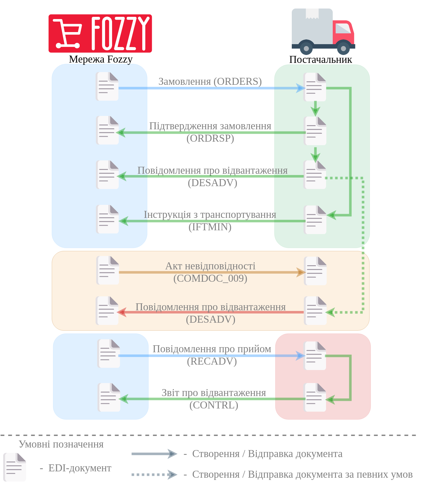

.. old schema
   .. uml::
      :scale: 100 %
      :align: center

      @startuml

      Сільпо -> Постачальник: Замовлення (ORDER) без цін
      Сільпо <- Постачальник: Підтвердження замовлення (ORDRSP)
      Сільпо <- Постачальник: Повідомлення про відвантаження (DESADV)
      Сільпо <- Постачальник: Інструкція з транспортування (IFTMIN)
      Сільпо <- Постачальник: Накладна за кількістю (DOCUMENTINVOICE)

      == Початок блоку незгоди Сільпо з IFTMIN ==

      Сільпо -> Постачальник: Акт невідповідності (COMDOC_009)
      Сільпо <- Постачальник: Повідомлення про відвантаження (DESADV)

      == Завершення блоку незгоди Сільпо з IFTMIN ==

      Сільпо -> Постачальник: Повідомлення про прийом (RECADV)
      Сільпо <- Постачальник: Звіт про відвантаження (CONTRL)

      @enduml

`XML Специфікації для роботи з Сільпо (за схемою «Match Invoice») <https://wiki.edin.ua/uk/latest/ClientProcesses/Silpo/Silpo_XML-structure.html>`__

1. Формування вихідного документа **«Підтвердження замовлення»(ORDRSP)** у відповідь на Замовлення (ORDER)
========================================================================================================================

.. admonition:: Важливо!

   Даний документ формується відразу після отримання замовлення від мережі.

Для того, що б знайти ваші **Замовлення**, натисніть на папку **Вхідні** й виберіть замовлення, за яким потрібно зробити підтвердження.

Для зручності пошуку скористайтесь фільтрами - наведіть курсор на поле пошуку й виберіть фільтри - наприклад **Мережа**-**Сільпо**, тип документа **Замовлення**.

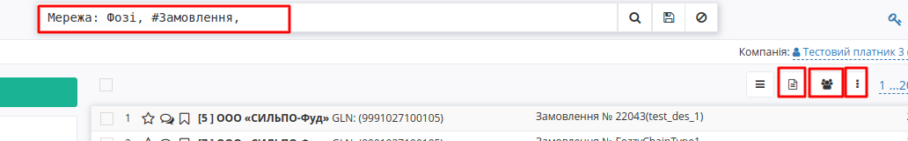

Для відкриття вхідного документа натисніть на нього.

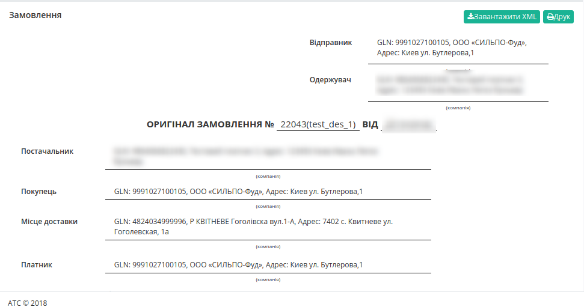

У відкритому документі на формі-підказці натисніть → **Підтвердження замовлення**. Новий документ створиться автоматично.

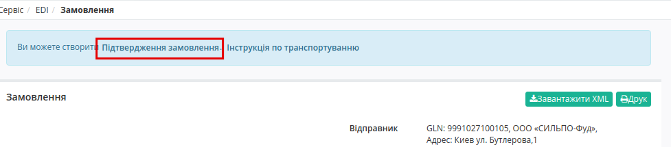

У відкритому вікні з'явиться **форма** для заповнення необхідних реквізитів документа. Всі поля, позначені червоною зірочкою ***обов'язкові для заповнення**. Інформація про Покупця, Постачальника та Місце доставки автоматично заповниться із Замовлення. 

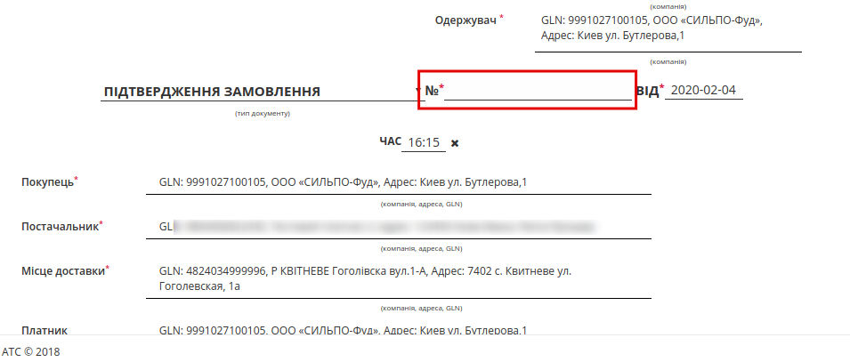

1. **Номер** - може збігатися з номером замовлення.
2. **Дата** - дата підтвердження, автоматично вказується поточна дата.
3. **Одержувач** автоматично переноситься з замовлення.
4. **Місце доставки** - місце фактичного постачання товару по даному замовленню, переноситься автоматично з замовлення (в разі, якщо з мережею узгодженне інше місце, його потрібно змінити).

Нижче на сторінці створеного документу знаходиться перелік товарних позицій, які були замовлені, і їх кількість. Зверніть увагу, що у табличній частині з позиціями немає цін:

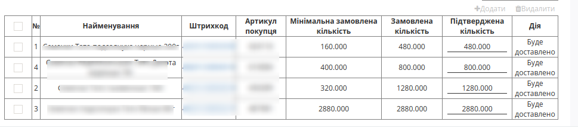

Інформація по позиціям, автоматично переноситься із Замовлення:

#. **Номер** - номер позиції
#. **Найменування** - назва позиції іх товарного довідника
#. **Штрихкод** - штрихкод товарної позиції, полегшує пошук, переноситься автоматично з замовлення
#. **Артикул покупця**- дані заповнюються автоматично з документа підстави
#. **Замовлена кількість**- кількість автоматично переноситься з замовлення
#. **Мінімальна кількість замовлення** автоматично переноситься з замовлення
#. **Підтверджена кількість** - фактична підтверджена кількість, що буде доставлена
#. **Дії** - вибираються зі списку в залежності від ситуації: **Буде доставлено**, або **Відмовлено**, а при зміні Підтвердженої кількості автоматично зміниться на **Зміна кількості** 

Для відправки документа завовнвть усі обов’язкові поля та натисніть на кнопку **Зберегти**, щоб внесені зміни вступили в силу, а потім - **Відправити**.

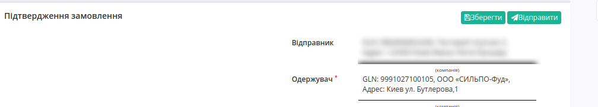

2. Формування вихідного документа **«Повідомлення про відвантаження»(DESADV)**
==========================================================================================

Розглянемо формування «Повідомлення про відвантаження» на підставі вихідного документа «Підтвердження замовлення».

Перейдіть в розділ **Вихідні**, у виберіть другому фільтрі - **Сільпо**, в третьому - тип документа **Підтвердження замовлення**.

У відкритому документі натисніть на формі-підказці → **Повідомлення про відвантаження**.  Новий документ створиться автоматично.

У вікні з'явиться **форма** для заповнення необхідних даних документа, деякі поля заповняться із Замовлення. Всі поля, позначені червоною зірочкою *** обов’язкові до заповнення**.

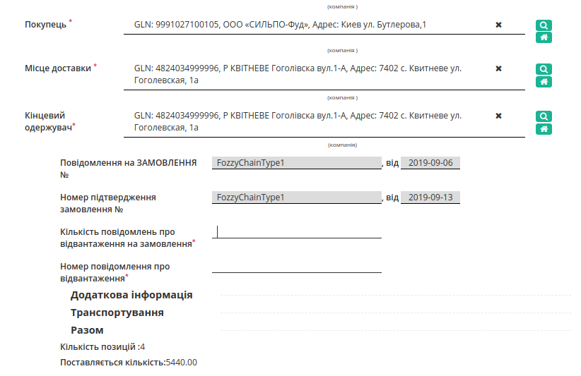

#. **Покупець**
#. **Місце доставки**
#. **Кінцевий одержувач**
#. **Повідомлення на Замовлення №** - автоматично переноситься з замовлення
#. **Номер підтвердження Замовлення №** - автоматично переноситься з замовлення
#. **Номер Повідомлення про відвантаження** - на кожну одиницю транспорту потрібно своє повідомлення з порядковиим номером (якщо № авто=1, то повідомлення=1)
#. **Занальна кількість Повідомлення про відвантаження** - на кожну одиницю транспорту потрібно своє повідомлення, у цьому полі необхідно вказати їх загальку кількість(кількість авто = кількості повідомлень)

.. admonition:: Важливо!

   У разі створення декількох автомобілів з вантажем на одне замовлення, необхідно на **кожну** машину сформувати своє **повідомлення про відвантаження**.

Нижче на сторінці сформованого документа знаходиться перелік товарних позицій, які були замовлені, їх кількість а також ціна, ставка ПДВ та інша інформація що заповниться із Товарного довідника.

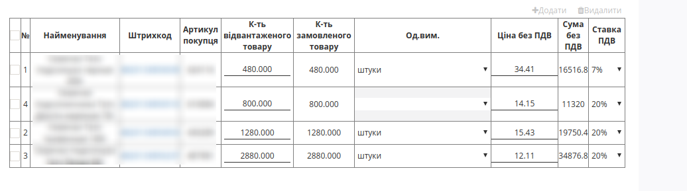

**Кількість відвантаженого товару** -  кількість що поставляється в одиниці транспорту (в авто), значення повинно дорівнювати замовленому. В даному розділі необхідно вказати **кількість тов.позицій**, яка поставляється, що відповідає тій кількості, **що у вас відправленно у одному авто**.

#. **К-ть відвантаженого товару** - кількість що поставляється в одиниці транспорту
#. **К-ть замовленного товару** - поле заповнюється з документу-основи
#. **Одиниці виміру** - одиниці вимірювання кількості
#. **Ціна без ПДВ** - ціна за позицію 
#. **Сума без ПДВ** - сумма по позиціям
#. **Ставка ПДВ** - виберіть % ставки із списку

Для відправлення документа натискаємо на кнопку **Зберегти**, після чого всі внесені зміни вступають в силу, а потім - **Відправити**.

.. admonition:: Важливо!

   Різниця між вказаною кількістю товару в повідомленні про відвантаження та фактично прийнятою кількістю, зазначається в Акті невідповідності від мережі.

У на підставі свого **«Повідомлення про відвантаження»(DESADV)** Постачальник може сформувати **«Накладну за кількістю»(DOCUMENTINVOICE)**.

3. Формування документа **«Інструкція з транспортування» (IFTMIN)**
==========================================================================================

.. admonition:: Важливо!

   У разі створення декількох **"Повідомленнь про відвантаження"(DESADV)**, необхідно на кожне сформувати свою **Інструкцію з транспортування» (IFTMIN)**.
   
Створення документа відбувається на підставі «**Замовлення**».

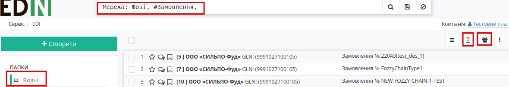

Перейдіть в розділ «**Вхідні**», для зручності пошуку виберіть в фільтрі необхідну мережу і тип документа «**Замовлення**».

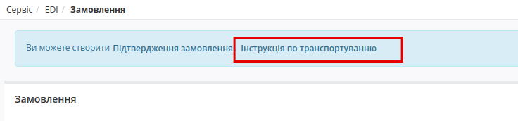

У відкритому документі, натисніть на формі-підказці на «**Інструкція по транспортуванню**». У вікні з'явиться **Форма** для заповнення необхідних реквізитів документа. Всі поля, позначені червоною зірочкою :red:`*` **обов'язкові до заповнення**.

.. important::
   #. **Номер** документа повинен бути наступного формату **X_Y**, де:

   - **Х - це порядковий номер машини, на поставку** (порядковий № Повідомлення про відвантаження)
   - **Y - це загальна кількість машин, на поставку** (загальна кількість Повідомлень про відвантаження)

   Важливо, для кожної машини на поставку в один день повинен бути індивідуальний номер машини. Дві машини з однаковим номером машини будуть групуватися в одну.

   Мінімальна к-ть 1, Максимальна - 99.
   Х повинен бути менше або рівним Y. *Наприклад: 2_5*

.. _hint-for-D-I:

.. attention::
   Особливість при заповненні Номера Кількісної накладної. Якщо в документі IFTMIN вказано кілька Замовлень і хоча б до одного прив’язана Кількісна накладна, то до інших замовлень теж повинні бути вказані накладні:

   .. image:: pics_robota_s_Fozzy_EDI-N_2.0/pics_robota_s_Fozzy_15.gif
      :align: center

2. **Дата** - фактична дата відправки поставки
#. **Номер замовлення** - підтягується автоматично із замовлення
#. **Місце доставки** - підтягується автоматично із замовлення
#. **Вантажовідправник** - підтягується автоматично із замовлення
#. **Тип пакування** - вибрати з випадаючого списку
#. **Фактична кількість палет** - кількість палет, що відвантажується в вантажний транспорт
#. **Максимальна кількість палет** - максимальна місткість палет (вантажний транспорт)
#. **Вантажопідйомність** - маса вантажу, на перевезення якого розрахований транспортний засіб

Для відправлення документа натискаємо на кнопку **Зберегти** (1), після чого всі внесені зміни вступають в силу, а потім - **Відправити** (2):

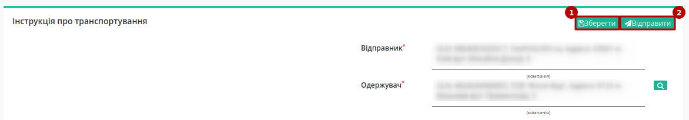

Відправлений документ автоматично потрапляє в папку «**Відправлені**» і буде знаходиться в ланцюжку документів разом із **Замовленням** і **Підтвердженням замовлення** і **Повідомленням про відвантаження**.

4 Обробка відповіді від мережі Сільпо
==========================================================================================

Мережа у відповідь на **"Повідомлення про відвантаження"(DESADV)** може відправити **«Повідомлення про прийом» (RECADV)** в якості остаточного підтвердження поставки або **"Акт невідповідності" (COMDOC 009)** в разі виникнення кількісних чи цінових товарних розбіжностей.

4.1 Обробка вхідного документа **«Повідомлення про прийом» (RECADV)**
------------------------------------------------------------------------

Даний документ інформує про кількість отриманих товарних позицій і містить **фактичну** кількість прийнятого товару.

:red:`Перед закриттям поставки потрібно звірити вірність вказаних позицій: кількість та номенклатуру прийнятих позицій, ціну з ПДВ та без ПДВ, одиниці виміру;`

У журналі документів, а також в самому документі, червоним буде виділено попередження **Поставка потребує закриття**

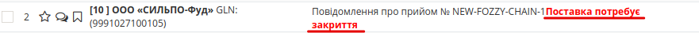

Для завершення документообігу по данній поставці, необхідно натиснути кнопку **«Завершити документообіг»**.

4.2 Обробка вхідного документа **"Акт невідповідності" (COMDOC 009)**
------------------------------------------------------------------------

У випадку розходження між відправленною і фактично прийнятою кількістю товару чи виникненням цінової розбіжності – мережа надсилає Вам **"Акт невідповідності" (COMDOC 009)**

.. image:: pics_robota_s_Fozzy_EDI-N_2.0/pics_robota_s_Fozzy_13_pred_net.png
   :align: center

У вхідному документі будуть зазначені кількісні чи цінові розбіжності по кожному товару та причина невідповідності.

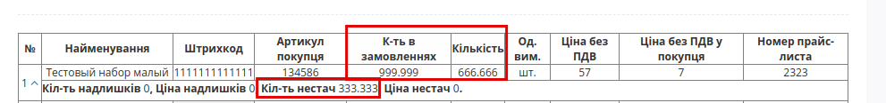

Після ознайомлення з документом необхідно повторно відправити **"Повідомлення про відвантаження"(DESADV)** з правками кількості/ціни згідно розбіжностей вказаних в **"Акті невідповідності" (COMDOC 009)** мережі Сільпо.

.. attention::

   В **"Повідомлення про відвантаження"(DESADV)** потрібно вносити правки лише згідно вказаних розбіжностей в **"Акті невідповідності" (COMDOC 009)**. В іншому документ **DESADV** повинен бути ідентичним до попередньо відправленого (детально в розділі 2).

У відповідь на відправлений відредагований документ **"Повідомлення про відвантаження"(DESADV)** повинен надійти документ **«Повідомлення про прийом» (RECADV)**, котрий необхідно буде "закрити" (детально в розділі 4.1).

----------------------------
   
.. include:: /_constant/kontakti.rst

