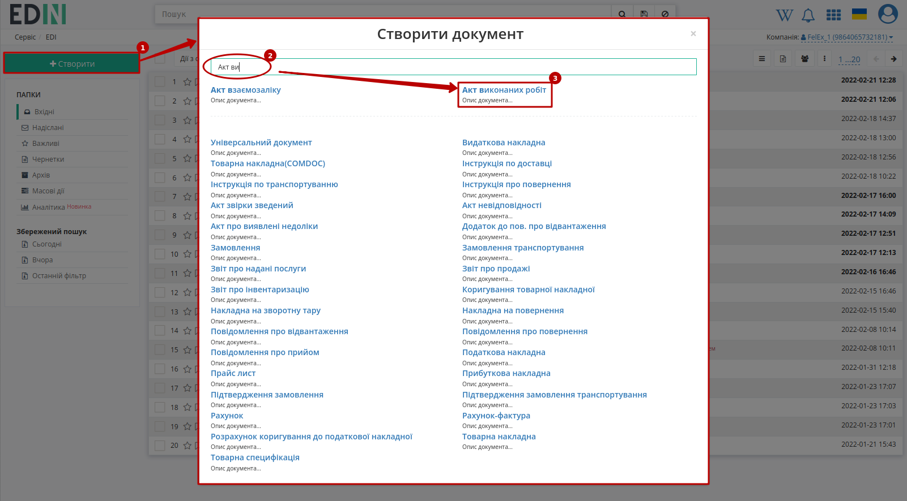
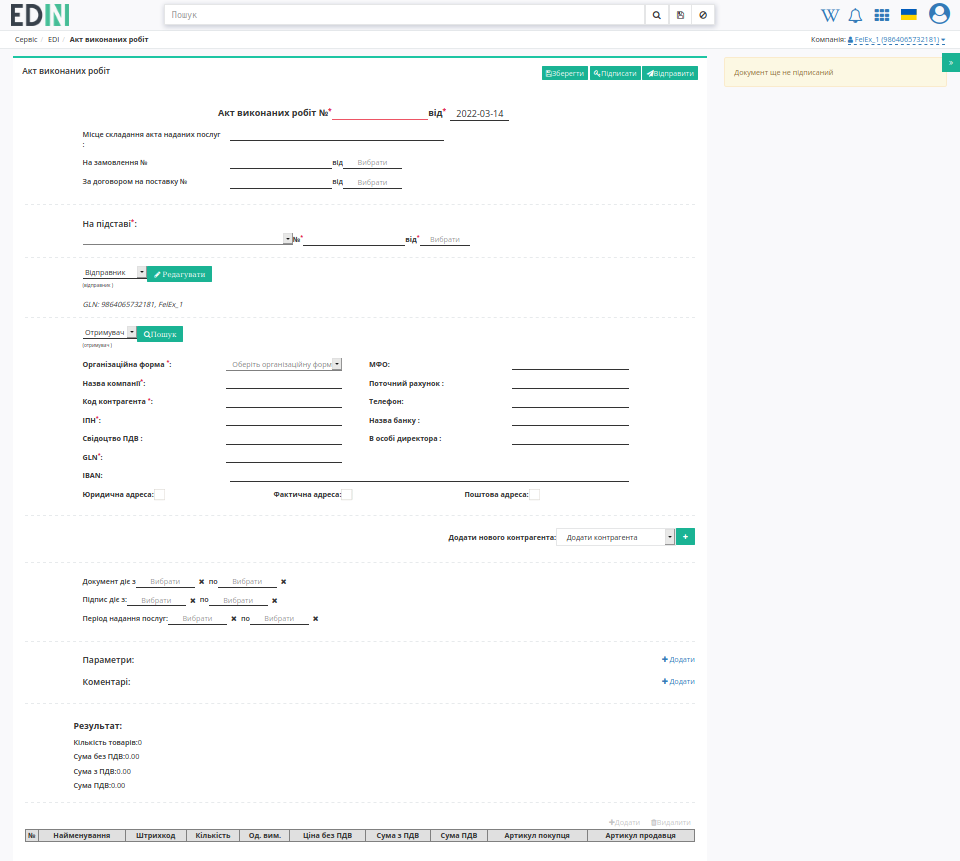
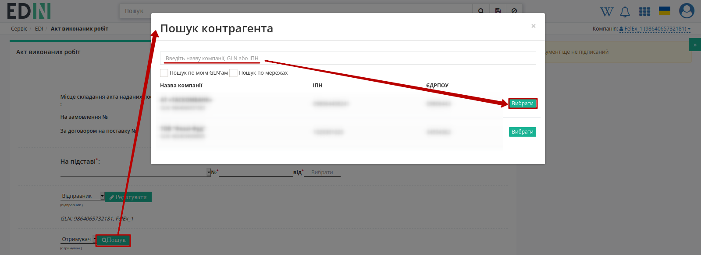
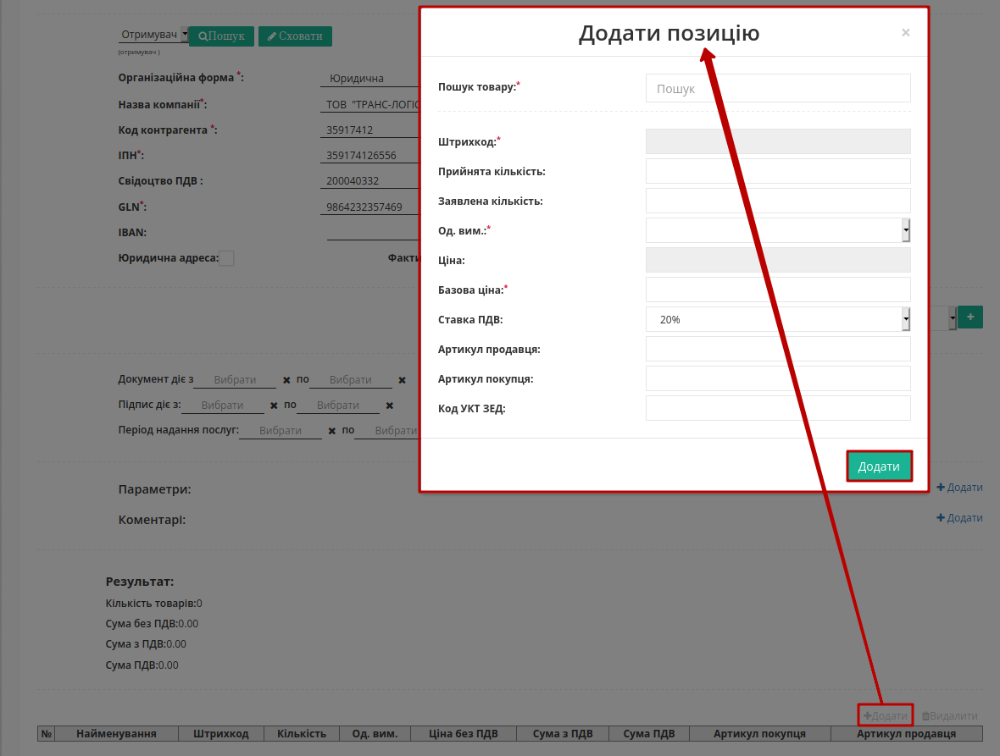
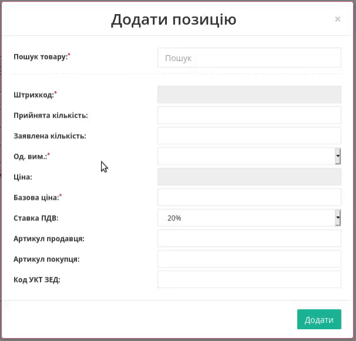
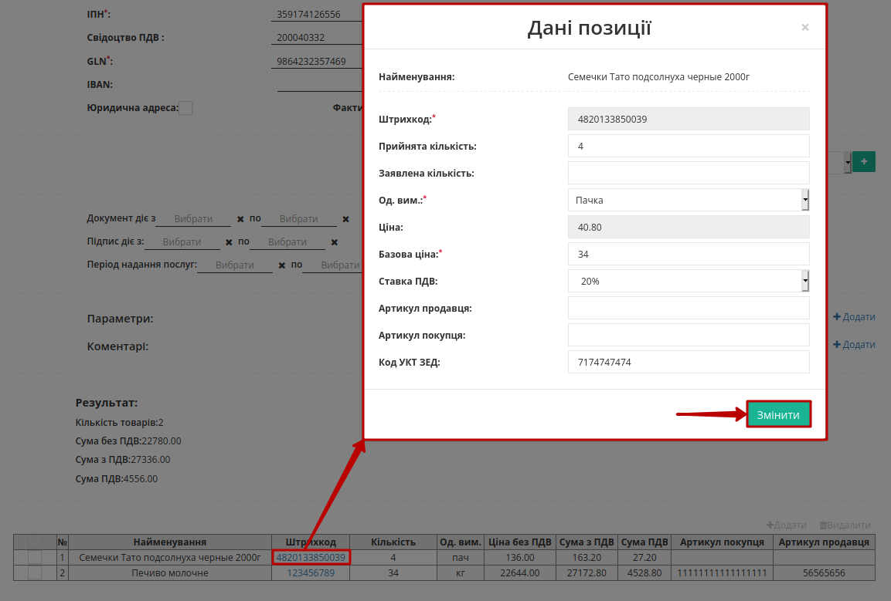
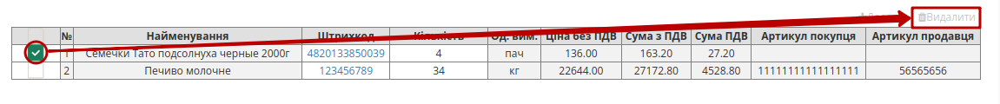
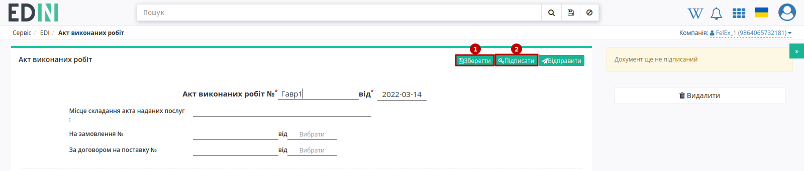
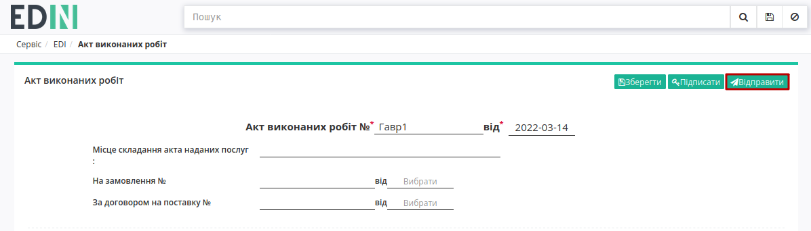

Робота з "Актом виконаних робіт" (COMDOC_013) для контрагентів "Транс Логістик"
#####################################################################################################################

.. role:: red

.. contents:: Зміст:
   :depth: 6

---------

Вступ
====================================

Дана інструкція описує порядок обміну "Актом виконаних робіт" (COMDOC_013) з компанією "Транс Логістик" на платформі EDI Network 2.0.

Специфікація "Акта виконаних робіт" (COMDOC_013) при роботі з компанією "Транс Логістик" дещо відрізняється, опис документа доступний за посиланням: `XML Специфікації для роботи з "Транс Логістик" <https://wiki.edin.ua/uk/latest/ClientProcesses/Trans_Logistic/Trans_Logistic_XML-structure.html>`__

1 Вхід на платформу
====================================

.. include:: /general_2_0/rabota_s_platformoj_EDIN_2.0.rst
   :start-after: .. початок блоку для Enter
   :end-before: .. кінець блоку для Enter

Після успішної авторизації відкриється основне меню, де у вкладці **"Продукти та рішення"** EDIN потрібно обрати сервіс **"EDI Network"**:

.. image:: /_constant/pics_landing/landing_edi.png
   :align: center

2 Формування "Акта виконаних робіт" (COMDOC_013) Постачальником
==============================================================================================================

Постачальник є ініціатором документообігу - формує і надсилає "Акт виконаних робіт" (COMDOC_013) "з нуля". Створити документ "Акт виконаних робіт" (COMDOC_013) можливо в головному вікні, з будь-якого розділу перегляду документів. Для цього натисніть зелену кнопку **"Створити"** і у вікні **Створити документ** виберіть тип документа "Акт виконаних робіт" (для зручності можливо скористатись пошуком): 

Відкривається форма документа, де обов'язкові до заповнення поля відмічені червоною зірочкою :red:`*`:

Можливо скористатись пошуком та вибрати свого контрагента (при цьому дані зареєстрованого на платформі контрагента заповняться автоматично):

Для заповнення табличної частини потрібно натиснути **"+Додати"** товарні позиції з `"Товарного довідника" <https://wiki.edin.ua/uk/latest/general_2_0/Directories.html>`__ (обов'язкові до заповнення поля позначені червоною зірочкою :red:`*`):

"Кількість" можливо замінити при перегляді таблиці, а інші дані позицій можливо відредагувати та **"Змінити"** через pop-up вікно, що відкривається по кліку на "Штрихкод" позиції:

.. hint::
   Деякі поля документа розраховуються автоматично за формулами:

   * **ВсьогоПоРядку**:
    * **СумаБезПДВ** = <ЗаявленаКількість> * <ПрийнятаКількість> * <Ціна> з заокругленням до 2х знаків після коми;
    * **СумаПДВ** = <ЗаявленаКількість> * <ПрийнятаКількість> * <Ціна> * (100 / Ставка НДС) з заокругленням до 2х знаків після коми;
    * **ПроцентЗнижки** = 100 * (1- <Ціна> / <БазоваЦіна>) з заокругленням до 2х знаків після коми;
   * **ВсьогоПоДокументу**:
    * **СумаБезПДВ** = сума значень з таблиці <ВсьогоПоРядку>-<СумаБезПДВ>;
    * **ПДВ** = сума значень <ВсьогоПоРядку>-<СумаПДВ>;
    * **Сума** = <ВсьогоПоРядку>-<СумаПДВ> + <ВсьогоПоРядку>-<СумаБезПДВ>.

Також можливо **"Видалити"** товарні позиції з табличної частини документа:

Після внесення всіх необхідних змін в документ потрібно натиснути кнопку **"Зберегти"** (1), після чого можливо **"Підписати"** (2):

.. _sign:

2.1 Підписання та відправка "Акта виконаних робіт" (COMDOC_013) Постачальником
--------------------------------------------------------------------------------------------------

.. tabs::

   .. tab:: Файловий ключ

      .. include:: /_constant/signing/signing.rst
         :start-after: .. початок блоку для Signing
         :end-before: .. кінець блоку для Signing

   .. tab:: Token

      .. include:: /_constant/token_signing/token_signing.rst
         :start-after: .. початок блоку для TokenSign
         :end-before: .. кінець блоку для TokenSign

   .. tab:: Гряда

      .. include:: /_constant/gryada_signing/gryada_signing.rst
         :start-after: .. початок блоку для GryadaSign
         :end-before: .. кінець блоку для GryadaSign

   .. tab:: Cloud

      .. include:: /_constant/cloud_signing/cloud_signing.rst
         :start-after: .. початок блоку для CloudSign
         :end-before: .. кінець блоку для CloudSign

Після підписання "Акта виконаних робіт" (COMDOC_013) Постачальником документ потрібно **"Відправити"**:

Відправлений документ автоматично потрапляє в папку **"Надіслані"**. Компанія "Транс Логістик" зі своєї сторони переглядає та підписує/відхиляє документ.

.. _revoke:

3 Відкликання підпису комерційних документів (COMDOC)
=========================================================================================================================

.. include:: /_constant/comdoc_revoke/comdoc_revoke.rst
   :start-after: .. початок блоку для Comdoc_Revoke
   :end-before: .. кінець блоку для Comdoc_Revoke

----------------------------
   
.. include:: /_constant/kontakti.rst
