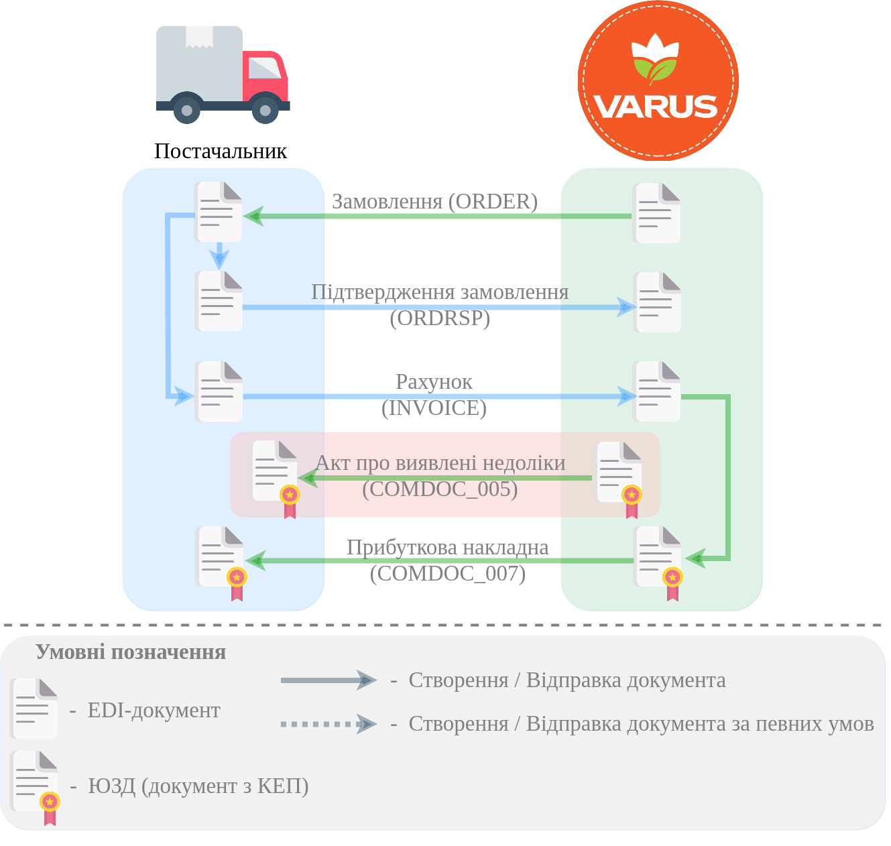

#############################################################################################################################
Документообіг з мережею "Варус" на платформі EDI Network 2.0. Інструкція для Постачальника
#############################################################################################################################

.. сюда закину немного картинок для текста

.. |bad_doc| image:: /general_2_0/pics_rabota_s_platformoj_EDIN_2.0/rabota_s_platformoj_066.png

.. |лупа| image:: /_constant/icons/magnifying_glass.png

.. |будинок| image:: /_constant/icons/house.png

.. role:: red

.. role:: green

.. role:: orange

.. role:: underline

.. contents:: Зміст:
   :depth: 5

---------

Вступ
====================================

Дана інструкція описує порядок документообігу з мережею "Варус" на платформі EDI Network 2.0. В документообігу приймають участь наступні документи:

- `Замовлення (ORDER) <https://wiki.edin.ua/uk/latest/EDIN_Specs/XML/ORDER_x.html>`__
- `Підтвердження замовлення (ORDRSP) <https://wiki.edin.ua/uk/latest/EDIN_Specs/XML/ORDRSP_x.html>`__
- `Рахунок (INVOICE) <https://wiki.edin.ua/uk/latest/EDIN_Specs/XML/INVOICE_x.html>`__
- `Акт про виявлені недоліки (COMDOC_005) <https://wiki.edin.ua/uk/latest/EDIN_Specs/XML/COMDOC_005_x.html>`__
- `Прибуткова накладна (COMDOC_007) <https://wiki.edin.ua/uk/latest/EDIN_Specs/XML/COMDOC_007_x.html>`__

**Загальна схема документообігу:**

1 Вхід на платформу
====================================

.. include:: /general_2_0/rabota_s_platformoj_EDIN_2.0.rst
   :start-after: .. початок блоку для Enter
   :end-before: .. кінець блоку для Enter

Після успішної авторизації відкриється основне меню, де у вкладці **"Продукти та рішення"** EDIN потрібно обрати сервіс **"EDI Network"**:

.. image:: /_constant/pics_landing/landing_edi.png
   :align: center

.. _ordrsp-create:

2 Створення та відправка «Підтвердження замовлення» (ORDRSP) на підставі вхідного «Замовлення» (ORDERS)
==============================================================================================================

.. include:: /retail_2.0/ORDRSP_na_EDI_Network.rst
   :start-after: .. початок блоку для Ordrsp_from_docs
   :end-before: .. кінець блоку для Ordrsp_from_docs

.. _invoice-create:

3 Створення та відправка "Рахунку" (INVOICE) на підставі вхідного «Замовлення» (ORDERS)
==================================================================================================================================

.. include:: /retail_2.0/formirovanie_otpravka_dokumenta_Schetfaktura_INVOICE_na_EDI_Network_2.0.rst
   :start-after: .. початок блоку для Invoice_from_Order
   :end-before: .. кінець блоку для Invoice_from_Order

.. _comdoc-005-processing:

4 Обробка вхідного "Акта про виявлені недоліки" (COMDOC_005)
==================================================================================================================================

.. note::
   "Акт про виявлені недоліки" (COMDOC_005) може відправлятися зі сторони мережі за потреби зазначення причини повернення товарів, що були доставлені в рамках ланцюжка поставки та коригування документів поставки.

Для обробки "Акта про виявлені недоліки" (COMDOC_005) в сервісі "EDI Network" потрібно перейти у **"Вхідні"** та вибрати **"Акт про виявлені недоліки"** в статусі :orange:`"Очікує на підписання отримувачем"` (для зручності можливо скористатись рядком `пошуку <https://wiki.edin.ua/uk/latest/general_2_0/rabota_s_platformoj_EDIN_2.0.html#doc-search>`__):

.. image:: /ClientProcesses/Varus/Varus_Instructions/pics_Varus_EDI/Varus_EDI_002.png
   :align: center

Відкриється форма документа, де Ви зможете ознайомитись з документом. Якщо Ви згодні продовжити документообіг, потрібно **"Підписати"** вхідний документ:

.. image:: /ClientProcesses/Varus/Varus_Instructions/pics_Varus_EDI/Varus_EDI_003.png
   :align: center

.. hint::
   Процес підписання є типовим на платформі EDI Network та описаний в `розділі нижче <https://wiki.edin.ua/uk/latest/ClientProcesses/Varus/Varus_Instructions/Varus_EDI.html#sign>`__.

Після підписання документ змінює свій статус на :green:`"Підписано двома сторонами"`.

.. note::
   Для того, щоб **Відхилити** "Акт про виявлені недоліки" (COMDOC_005) можливо оформити типову для комерціних документів **"Відмову від підписання"** (`детальніше <https://wiki.edin.ua/uk/latest/_constant/comdoc_reject/comdoc_reject.html>`__):

   .. image:: /ClientProcesses/Varus/Varus_Instructions/pics_Varus_EDI/Varus_EDI_004.png
      :align: center

.. _comdoc-007-processing:

5 Обробка вхідної "Прибуткової накладної" (COMDOC_007)
==================================================================================================================================

Для обробки "Прибуткової накладної" (COMDOC_007) в сервісі "EDI Network" потрібно перейти у **"Вхідні"** та вибрати **"Прибуткова накладна"** в статусі :orange:`"Очікує на підписання отримувачем"` (для зручності можливо скористатись рядком `пошуку <https://wiki.edin.ua/uk/latest/general_2_0/rabota_s_platformoj_EDIN_2.0.html#doc-search>`__):

.. image:: /ClientProcesses/Varus/Varus_Instructions/pics_Varus_EDI/Varus_EDI_005.png
   :align: center

Відкриється форма документа, де Ви зможете ознайомитись з документом. Якщо Ви згодні з документом, його потрібно **"Підписати"**:

.. image:: /ClientProcesses/Varus/Varus_Instructions/pics_Varus_EDI/Varus_EDI_006.png
   :align: center

.. hint::
   Процес підписання є типовим на платформі EDI Network та описаний в `розділі нижче <https://wiki.edin.ua/uk/latest/ClientProcesses/Varus/Varus_Instructions/Varus_EDI.html#sign>`__.

Після підписання документ змінює свій статус на :green:`"Підписано двома сторонами"`.

.. note::
   Для того, щоб **Відхилити** "Прибуткову накладну" (COMDOC_007) можливо оформити типову для комерціних документів **"Відмову від підписання"** (`детальніше <https://wiki.edin.ua/uk/latest/_constant/comdoc_reject/comdoc_reject.html>`__):

   .. image:: /ClientProcesses/Varus/Varus_Instructions/pics_Varus_EDI/Varus_EDI_007.png
      :align: center

.. hint::
   Також після підписання документа (документ підписаний з обох сторін в статусі :green:`"Підписано двома сторонами"`) за згодою сторін можливо відправити **"Запит на анулювання"** документа (`детальніше <https://wiki.edin.ua/uk/latest/_constant/comdoc_repeal/comdoc_repeal.html>`__):

   .. image:: /ClientProcesses/Varus/Varus_Instructions/pics_Varus_EDI/Varus_EDI_008.png
      :align: center

   Ініціатором анулювання може виступати, як Мережа так і Постачальник.

------------------------------------------------------

.. _sign:

Підписання на платформі EDIN 2.0
=========================================================================================================================

.. include:: /_constant/atb_check/atb_check.rst
   :start-after: .. початок блоку для ATB_check
   :end-before: .. кінець блоку для ATB_check

.. tabs::

   .. tab:: Файловий ключ

      .. include:: /_constant/signing/signing.rst
         :start-after: .. початок блоку для Signing
         :end-before: .. кінець блоку для Signing

   .. tab:: Token

      .. include:: /_constant/token_signing/token_signing.rst
         :start-after: .. початок блоку для TokenSign
         :end-before: .. кінець блоку для TokenSign

   .. tab:: Гряда

      .. include:: /_constant/gryada_signing/gryada_signing.rst
         :start-after: .. початок блоку для GryadaSign
         :end-before: .. кінець блоку для GryadaSign

   .. tab:: Cloud

      .. include:: /_constant/cloud_signing/cloud_signing.rst
         :start-after: .. початок блоку для CloudSign
         :end-before: .. кінець блоку для CloudSign

-------------------------------------

.. include:: /_constant/kontakti.rst
