Комерційна пропозиція для Роздрібної Мережі
###############################################################################

.. раніше КП були частиною Е-спек

.. сюда закину немного картинок для текста

.. |non| image:: pics_Commercial_offers/Commercial_offers_005.png

.. role:: red

.. role:: green

.. role:: blue

.. role:: orange

.. role:: underline

---------

.. contents:: Зміст:
   :depth: 3

---------

**Вступ**
===================================

Сервіс **"Комерційна пропозиція"** доступний на стороні **Покупця** (**Мережі**) та **Постачальника**. Для початку роботи серед доступних сервісів потрібно вибрати **"Комерційна пропозиція"**:

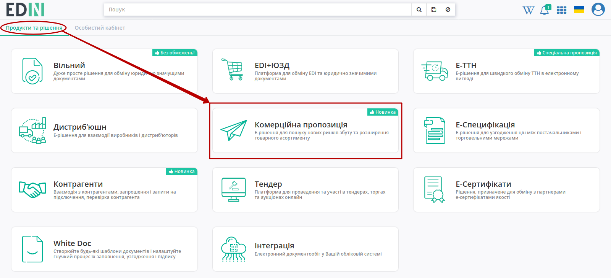

Бокове меню сервісу **"Комерційна пропозиція"** дозволяє переглядати **Всі** / **Важливі** / **Оброблені** "Комерційні пропозиції":

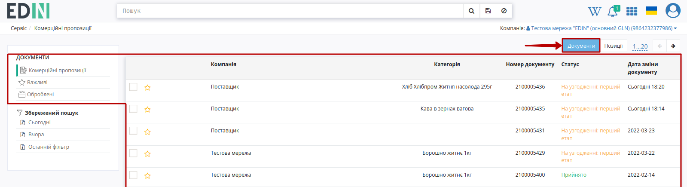

**"Важливими"** є всі комерційні пропозиції, що були відмічені заповненою зірочкою (|star|):

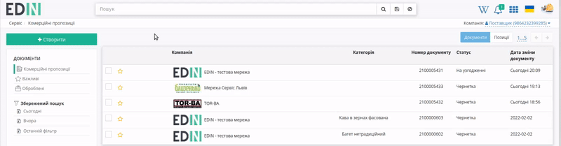

.. поки не реалізовано **Оброблені** - комерційні пропозиції, що були перенесені користувачем; в "Оброблені" можуть бути перенесені комерційні пропозиції лише в кінцевому статусі ("Прийнято" / "Відхилено").

Для того аби переглянути всі надіслані Ваш товарні позиції потрібно переключити відображення - кнопка **"Позиції"**:

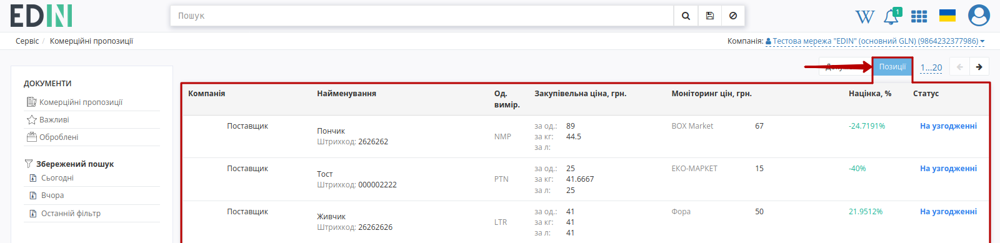

.. note::
   В цій вкладці при переході до деталей товарної позиції відкривається комерційна пропозиція, що містить обрану товарну позицію.

**Робота з комерційними пропозиціями**
=====================================================

При переході в сервіс **"Комерційна пропозиція"** за замовчуванням відкривається журнал з надісланими від контрагентів (**Постачальників**) комерційними пропозиціями. **Постачальники** відправляють документи на узгодження, а представник **Мережі** проводить їх узгодження.

.. hint::
   Процес узгодження може бути багатоетапним, де кількість цих етапів узгодження визначає **Мережа** (налаштовується співробітником "EDIN"). Переходи на наступний етап узгодження під час прийняття Комерційної пропозиції є послідовними та розділені між визначеними співробітниками **Мережі**. Так процес узгодження може виглядати наступним чином:

   +-----+--------------------------------------------------------------------------------------+---------------------------------------------------------------+---------------------------------------------------+
   |     |                                       **Дія**                                        |          **Статус документа** (Постачальник/Мережа)           | **Статус товарної позиції** (Постачальник/Мережа) |
   +=====+======================================================================================+===============================================================+===================================================+
   | 1   | Постачальник створив комерційну пропозицію (не відправив)                            | Чернетка (id=1) / статус на стороні Мережі відсутній          | Чернетка (id=0)                                   |
   +-----+--------------------------------------------------------------------------------------+---------------------------------------------------------------+---------------------------------------------------+
   | 2   | Постачальник відправив комерційну пропозицію / Мережа отримала комерційну пропозицію | На узгодженні (id=3) / На узгодженні перший етап (id=21)      | На узгодженні (id=3) / На узгодженні (id=3)       |
   +-----+--------------------------------------------------------------------------------------+---------------------------------------------------------------+---------------------------------------------------+
   | 3   | Мережа узгоджує документ на другому етапі                                            | На узгодженні (id=3) / На узгодженні другий етап (id=22)      | На узгодженні (id=3) / На узгодженні (id=3)       |
   +-----+--------------------------------------------------------------------------------------+---------------------------------------------------------------+---------------------------------------------------+
   | 4   | Мережа узгоджує документ на третьому етапі                                           | На узгодженні (id=3) / На узгодженні третій етап (id=23)      | На узгодженні (id=3) / На узгодженні (id=3)       |
   +-----+--------------------------------------------------------------------------------------+---------------------------------------------------------------+---------------------------------------------------+
   | 5   | Мережа узгоджує документ на четвертому етапі                                         | На узгодженні (id=3) / На узгодженні четвертий етап (id=24)   | На узгодженні (id=3) / На узгодженні (id=3)       |
   +-----+--------------------------------------------------------------------------------------+---------------------------------------------------------------+---------------------------------------------------+
   | 6   | Мережа узгоджує документ на п'ятому етапі                                            | На узгодженні (id=3) / На узгодженні п'ятий етап етап (id=25) | На узгодженні (id=3) / На узгодженні (id=3)       |
   +-----+--------------------------------------------------------------------------------------+---------------------------------------------------------------+---------------------------------------------------+
   | 7   | Мережа узгоджує документ на фінальному етапі                                         | На узгодженні (id=3) / На узгодженні фінальний етап (id=26)   | На узгодженні (id=3) / На узгодженні (id=3)       |
   +-----+--------------------------------------------------------------------------------------+---------------------------------------------------------------+---------------------------------------------------+
   | 8.1 | Мережа приймає документ                                                              | Прийнято (id=8)                                               | Прийнято (id=1)                                   |
   +-----+--------------------------------------------------------------------------------------+---------------------------------------------------------------+---------------------------------------------------+
   | 8.2 | Мережа відхиляє документ                                                             | Відхилено (id=4)                                              | Відхилено (id=2)                                  |
   +-----+--------------------------------------------------------------------------------------+---------------------------------------------------------------+---------------------------------------------------+

Для проведення узгодження потрібно обрати із загального списку комерційну пропозицію в статусі :orange:`"На узгодженні+"`:

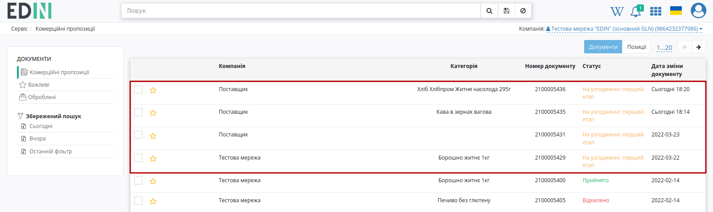

При перегляді комерційної пропозиції її завжди за потреби можливо **"Завантажити в XLS"**:

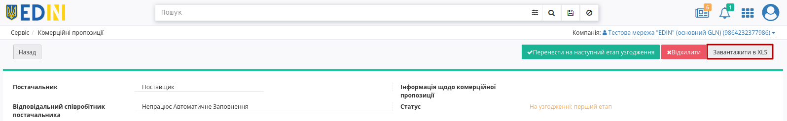

Ознайомившись зі змістом Комерційної пропозиції та її товарними позиціями можливо:

* **"Прийняти"** / **"Відхилити"** товарні позиції (всі одразу чи вибірково |accept| / |decline|);
* **"Перенести на наступний етап узгодження"** / **"Відхилити"** Комерційну пропозицію, якщо документ на проміжному етапі узгодження:

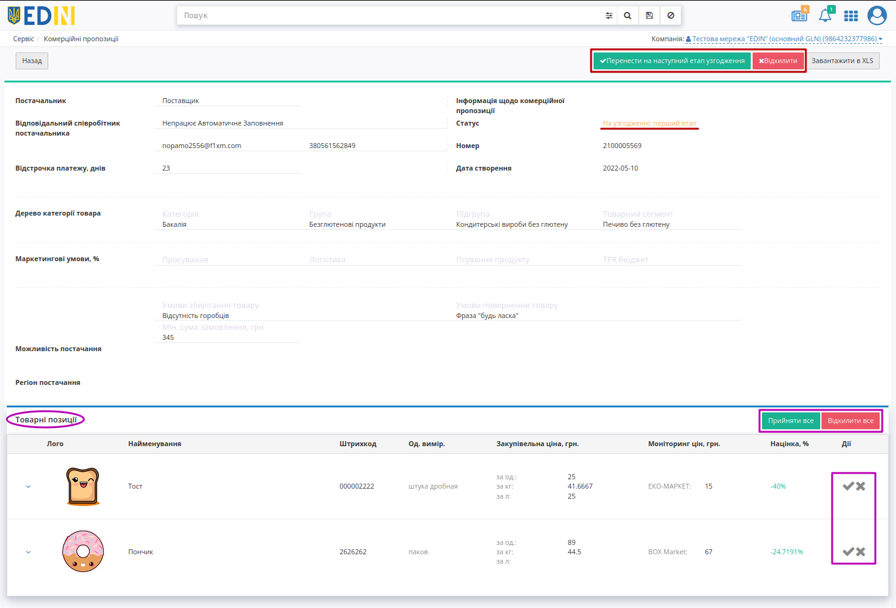

* **"Прийняти"** / **"Відхилити"** Комерційну пропозицію, якщо документ на фінальному етапі узгодження:

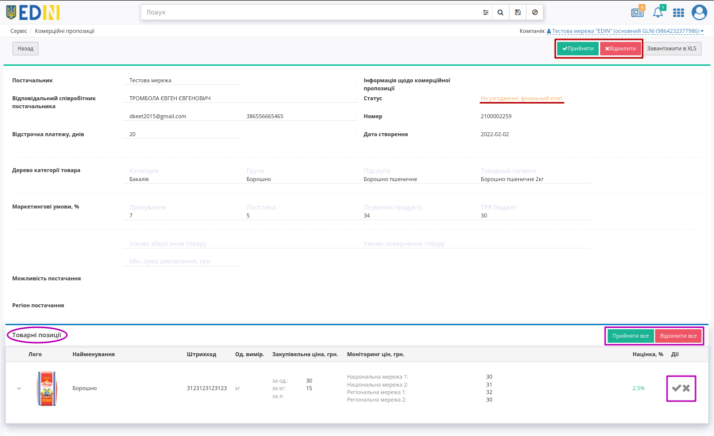

.. hint::
   Додаткову інформацію за товарними позиціями можливо переглянути/приховати за допомогою |show| / |hide| кнопок відповідно.

.. attention::
   Якщо на фінальному етапі комерційна пропозиція приймається, а її позиції не були відхилені, то вони автоматично вважаються прийнятими. **"Прийняти"** можливо лише таку Комерційну пропозицію, яка має хоча б одну не відхилену позицію.  

---------------------------------------------------------

.. admonition:: Прийняття Комерційної пропозиції:

   після натискання кнопки **"Прийняти"** в модальному вікні можливо додати коментар (необов'язково) і підтвердити рішення:

   .. image:: pics_Commercial_offers/Commercial_offers_052.png
      :align: center

   Після прийняття рішення статус позиції автоматично оновлюється з :orange:`"На узгодженні"` -> на :green:`"Прийнято"` + може відображатись опціональний коментар для **Постачальника**:

   .. image:: pics_Commercial_offers/Commercial_offers_054.png
      :align: center

---------------------------------------------------------

.. admonition:: Відхилення Комерційної пропозиції:

   після натискання кнопки **"Відхилити"** в модальному вікні потрібно необов'язково вказати причину і підтвердити рішення:

   .. image:: pics_Commercial_offers/Commercial_offers_053.png
      :align: center

   Після прийняття рішення статус позиції автоматично оновлюється з :orange:`"На узгодженні"` -> на :red:`"Відхилено"`, відображається коментар (причина відхилення) для **Постачальника**. Всі позиції відхилені:

   .. image:: pics_Commercial_offers/Commercial_offers_055.png
      :align: center

.. колись був такий функціонал  В журналі комерційних пропозицій при наявному коментарі від мережі відображається зафарбована іконка - |comment1| (при відсутності коментарів - |comment0|):

   .. image:: pics_Commercial_offers/Commercial_offers_003.png
      :align: center

   .. hint::
      Користувачі можуть отримувати повідомлення на ел. пошту про зміну статуса відправленої новинки. Для налаштувань такої опції потрібно звертутись до співробітників компанії-провайдера.

   Якщо у **Покупця** (мережі) налаштовані повідомлення на ел. пошту, то він буде проінформований про новинки, навіть не заходячи до сервісу.

   Повідомлення про отримання однієї комерційної пропозиції:

   .. image:: pics_Commercial_offers/Commercial_offers_018.png
      :align: center

   Повідомлення про отримання кількох комерційних пропозицій (масова відправка на стороні Постачальника):

   .. image:: pics_Commercial_offers/Commercial_offers_019.png
      :align: center

**Додатковий функціонал**
=====================================================

**Пошук**
------------------------------

Пошук документів/позицій в сервісі **Комерційна пропозиція** виконується через рядок **"Пошуку"**:

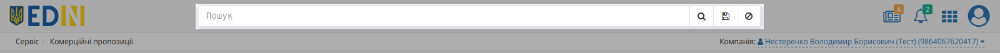

----------------------------------------------------------------------------------------------------

1) Рядок пошуку можливо заповнити, обираючи **"Доступні для пошуку ключі"**:

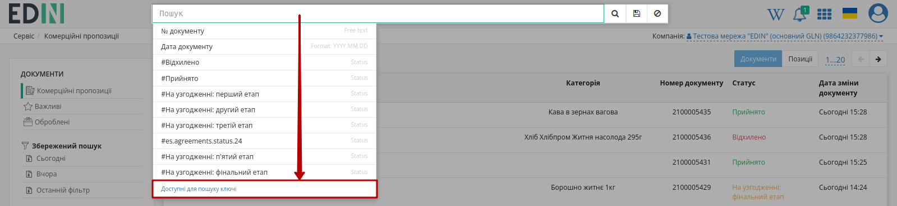

.. note::
   В залежності від того, який журнал відкрито (**Документи** чи **Позиції**) ключі пошуку будуть відрізнятись:

   .. image:: pics_Commercial_offers/Commercial_offers_057.png
      :width: 500

   .. image:: pics_Commercial_offers/Commercial_offers_058.png
      :width: 500

Можливо обрати параметр зі списку/підказки чи почати вводити пошукове значення (система автоматично вкаже на можливі параметри): 

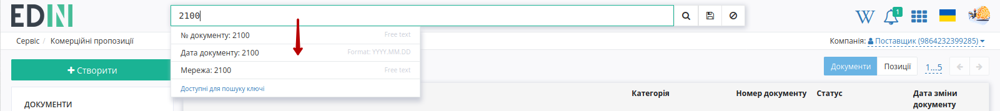

Після введення значення потрібно натиснути кнопку |лупа| для пошуку. Очищення рядка **"Пошуку"** відбувається за допомогою кнопки **"Скинути фільтри"** |non|.

При складному пошуку усі параметри повині бути розділені комами, наприклад, ``#Прийнято, Дата документу: 2022-03-24,``:

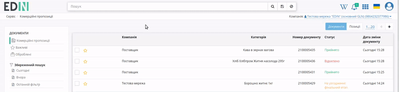

2) Також заповнити рядок пошуку можливо за допомогою набору фільтрів **"Розширеного пошуку"** (|advserch|):

.. note::
   В залежності від того, який журнал відкрито (**Документи** чи **Позиції**) меню пошуку буде відрізнятись:

   .. image:: pics_Commercial_offers/Commercial_offers_061.png
      :align: center

   ⠀⠀⠀⠀⠀⠀⠀⠀⠀

   .. image:: pics_Commercial_offers/Commercial_offers_062.png
      :align: center

Деякі поля містять підказки, що показуються при наведенні курсора на назву параметра:

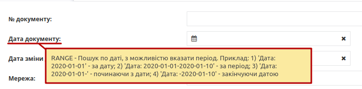

:underline:`Після того, як була обрана мережа` можливо відфільтрувати журнал за ``Категорією`` -> ``Групою`` -> ``Підгрупою`` -> ``Товарним сегментом`` (задаючи параметри лише в такій послідовності) товарних позицій:

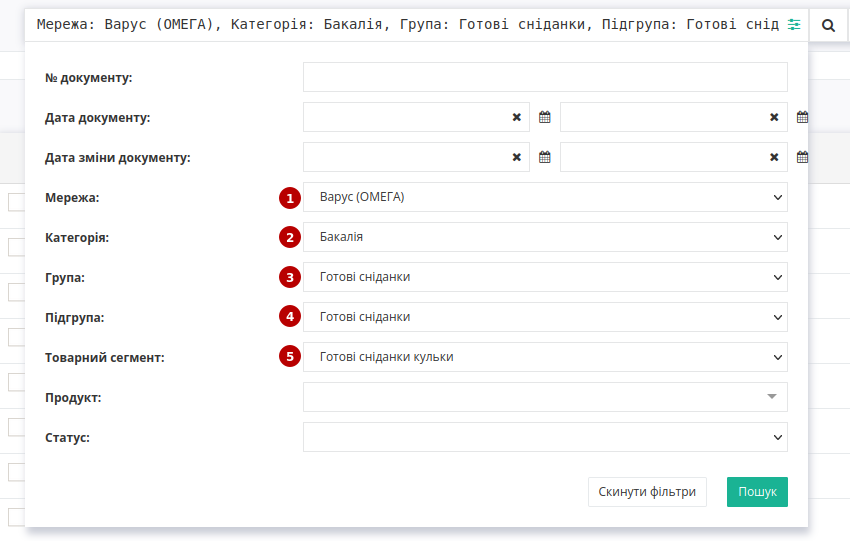

Пошук працює тільки за повним збігом.

----------------------------------------------------------------------------------------------------

Окремо винесені фільтри документів по даті (**"Сьогодні"**, **"Вчора"**), а останній введений пошук зберігається платформою автоматично і при натисканні кнопки **"Останній фільтр"** він виконується повторно:

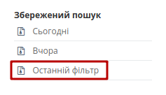

Також можливо перманентно **Зберегти** данні власного рядку пошуку, натиснувши на іконку дискети. Переглянути збережений пошук можливо в блоці **Збережений пошук**. Вилучити збережений пошук можна за допомогою хрестика.

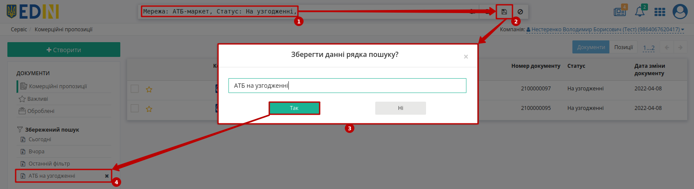

----------------------------------

.. include:: /_constant/kontakti.rst

