Комерційна пропозиція для Постачальника
###############################################################################

.. раніше КП були частиною Е-спек

.. сюда закину немного картинок для текста

.. |non| image:: pics_Commercial_offers/Commercial_offers_005.png

.. |лупа| image:: pics_Commercial_offers/Commercial_offers_004.png

.. |comment0| image:: pics_Commercial_offers/Commercial_offers_001.png

.. |comment1| image:: pics_Commercial_offers/Commercial_offers_002.png

.. |show| image:: pics_Commercial_offers/Commercial_offers_031.png

.. role:: red

.. role:: green

.. role:: blue

.. role:: orange

.. role:: underline

---------

.. contents:: Зміст:
   :depth: 3

---------

**Вступ**
===================================

Сервіс **"Комерційна пропозиція"** доступний на стороні **Покупця** (**Мережі**) та **Постачальника**.

Для початку роботи серед доступних сервісів потрібно вибрати **"Комерційна пропозиція"**:

.. image:: pics_Commercial_offers/Commercial_offers_020.png
   :align: center

Бокове меню сервісу **"Комерційна пропозиція"** дозволяє переглядати **Всі** / **Важливі** / **Оброблені** "Комерційні пропозиції":

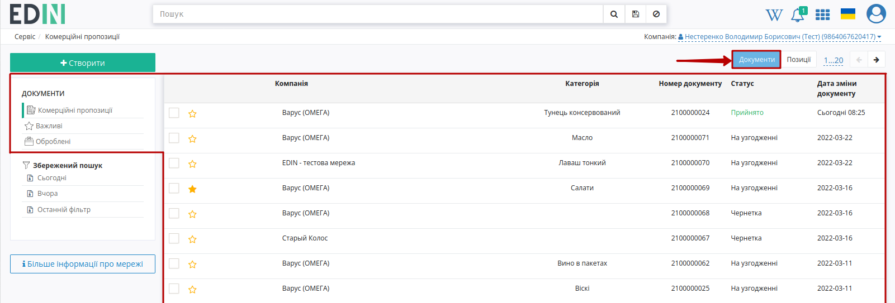

**"Важливими"** є всі комерційні пропозиції, що були відмічені заповненою зірочкою (|star|):

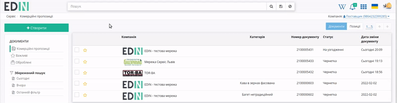

.. поки не реалізовано **Оброблені** - комерційні пропозиції, що були перенесені користувачем; в "Оброблені" можуть бути перенесені комерційні пропозиції лише в кінцевому статусі ("Прийнято" / "Відхилено").

Для того аби переглянути всі Ваші товарні позиції потрібно переключити відображення - кнопка **"Позиції"**:

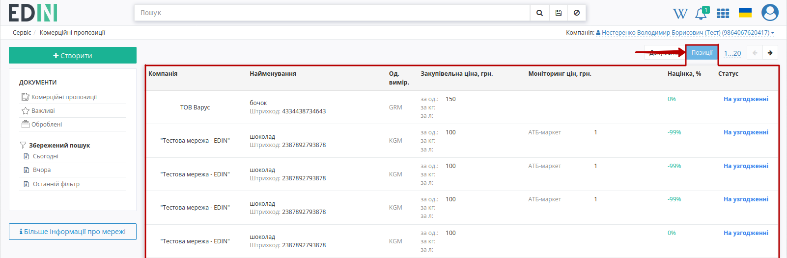

.. note::
   В цій вкладці при переході до деталей товарної позиції відкривається комерційна пропозиція, що містить обрану товарну позицію.

**Постачальнику** для того, щоб почати роботу з мережами потрібно подати заявку. Список мереж, доступний до підключення доступний при переході за допомогою кнопки **"Більше інформації про мережі"**:

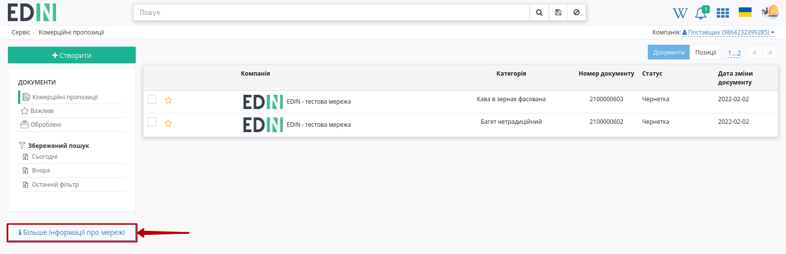

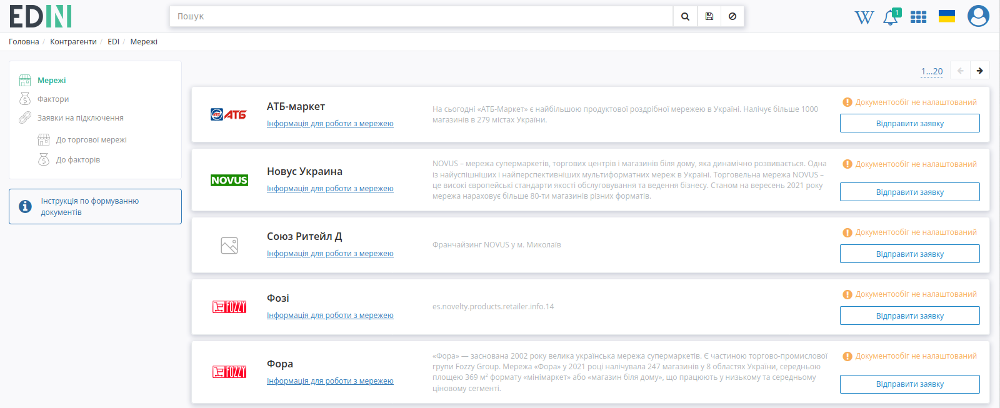

.. hint::
   Опис алгоритму подачі заявки доступний за `посиланням <https://wiki.edin.ua/uk/latest/Personal_Cabinet/PCInstruction.html#counterparties>`__.

.. _commercial-offer:

**1 Створення та відправка комерційної пропозиції**
=====================================================

Для створення комерційної пропозиції потібно натиснути **"Створити"**:

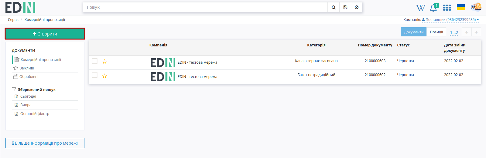

Після чого відкриється форма документа для заповнення:

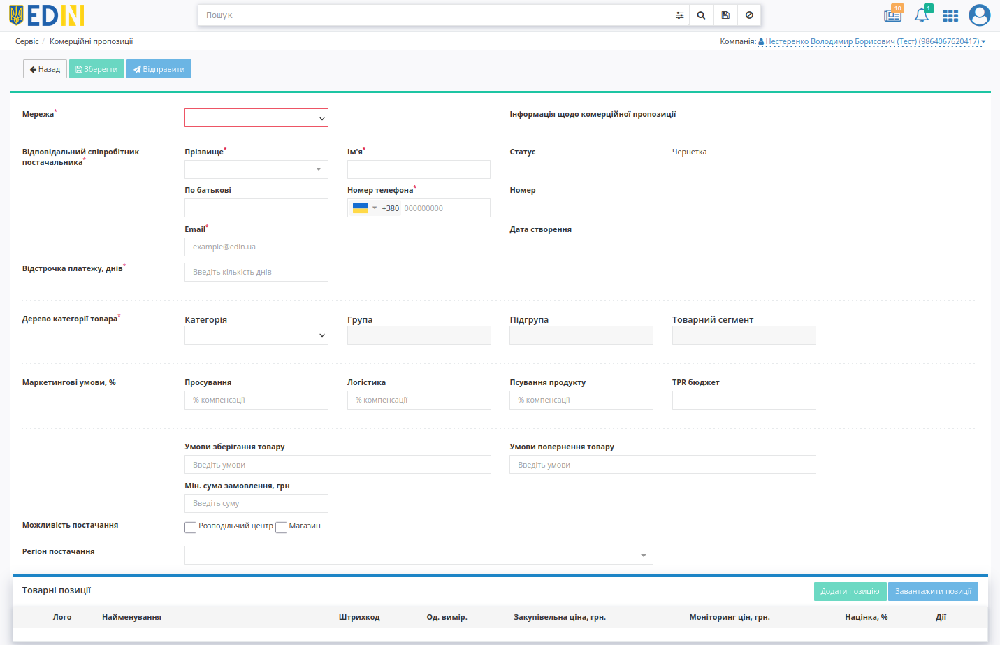

Для початку **Постачальнику** потрібно обрати **Мережу** після чого стає можливо **"Зберегти"** даний документ! 

.. note::
   Після першого **"Зберігання"** комерційної пропозиції її присвоюється номер та дата створення, з'являється можливість **"Додати позицію"**. Редагування комерційної пропозиції можливе поки вона перебуває у статусі "Чернетка".

   .. image:: pics_Commercial_offers/Commercial_offers_029.gif
      :align: center

   Після того, як документ було збережено (**у всіх статусах**), комерційну пропозицію можливо **"Клонувати"** - створення нової комерційної пропозиції, що заповнюється даними і товарними позиціями з поточної комерційної пропозиції:

   .. image:: pics_Commercial_offers/Commercial_offers_069.png
      :align: center

Далі необхідно заповнити всі обов'язкові поля (позначні червоною зірочкою :red:`*`):

* вказати контакти **Постачальника** (додати новий контакт чи обрати за прізвищем вказаний раніше контакт):

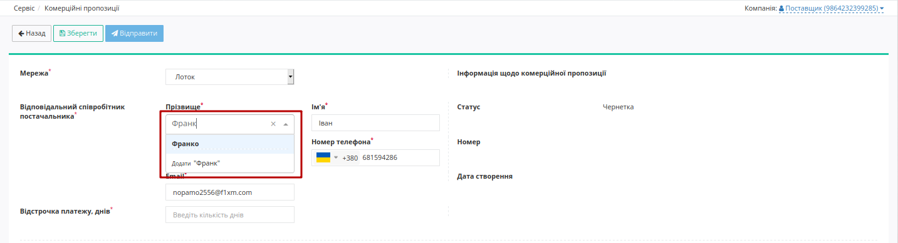

* кількість днів відстрочки платежу;
* послідовно вказати **"Категорію"** -> **"Групу"** -> **"Підгрупу"** -> **"Товарний сегмент"**. 

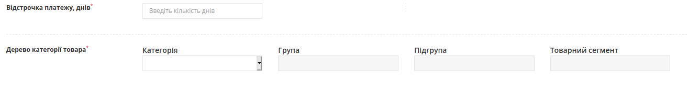

Дані поля "Регіон постачання" обираються зі списку (при введенні назви області України список автоматично фільтується):

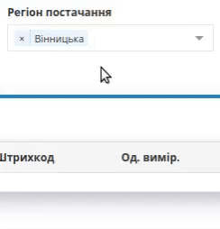

Після того, як чернетка комерційної пропозиції буде збережена можливо додати товарні позиції двома способами:

1. **"Додати позицію"**, заповнюючи форму **"Інфомації про товар"** для кожного товару (обов'язкові поля позначні червоною зірочкою :red:`*`):

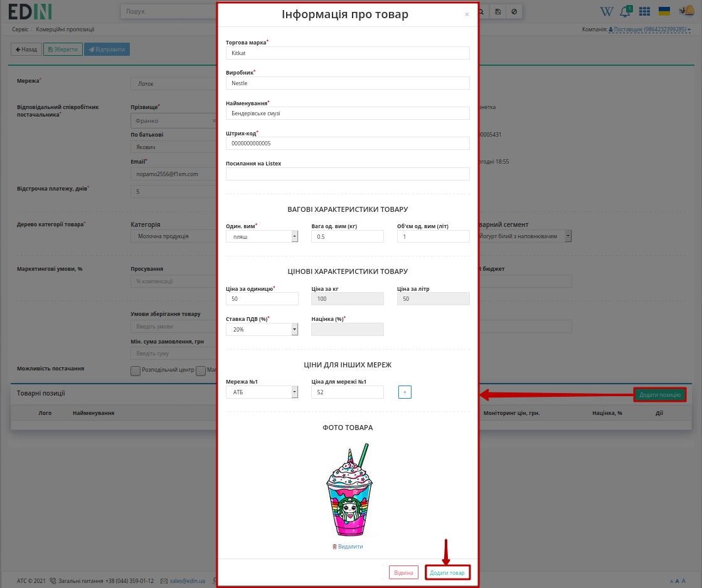

.. note::
   При створенні товарної позиції (Чернетка) замість стандартного лого можливо завантажити фото товару максимальним розміром зображення 5 МБ (JPEG/JPG, PNG).

2. **"Завантажити позиції"** масово Excel файлом (згідно шаблону): 

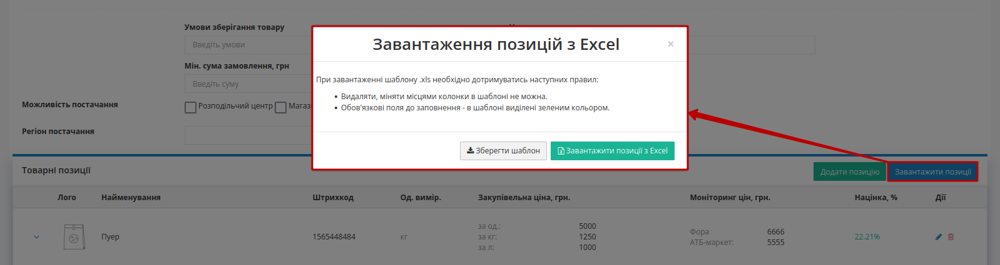

.. important::
   Зверніть увагу! Видаляти, міняти місцями колонки в Excel файлі не можна. Ви можете не заповнювати не обовязкові стовпці, але не видаляйте їх.

Відкрийте та заповніть файл Excel. Колонки виділенні зеленим кольором - **обов'язкові до заповнення**! Штрихкод повинен бути унікальним на рівні Комерційної пропозиції (перевірка на дублі - додається лише перше значення). Деякі стовпці мають підказки до заповнення - наведіть курсор на назву комірки для відображення підказки:

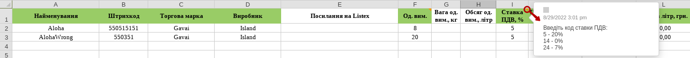

Якщо будь-яку з позицій буде заповнено некоректно, при додаванні файлу з’явиться повідомлення про помилку, у якій буде вказано яку саме позицію і чому потрібно виправити, наприклад:

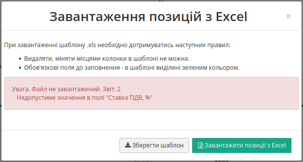

Додані товарні позиції:

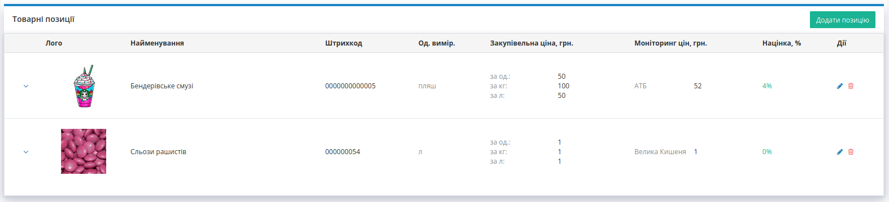

Додаткову інформацію за товарними позиціями можливо переглянути/приховати за допомогою |show| / |hide| кнопок відповідно. Додані товарні позиції можливо **"Редагувати"** (|edit|) чи **"Видалити"** (|del|). При редагуванні відкривається раніше заповнена форма **"Інфомації про товар"**.

--------------------------------------------------------

Після того, як всі обов'язкові поля комерційної пропозиції будуть заповнені її можливо **"Відправити"**:

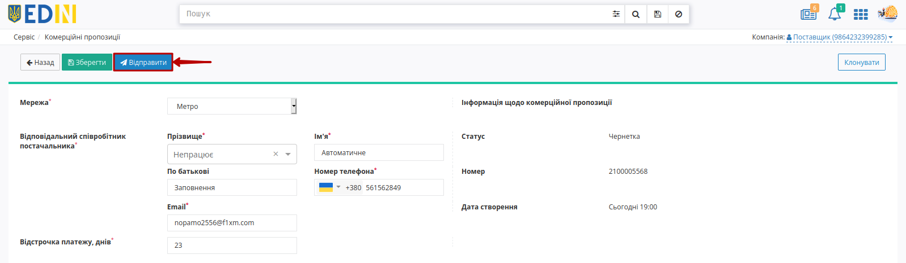

Відправлена комерційна пропозиція змінює свій статус на **"На узгодженні"**:

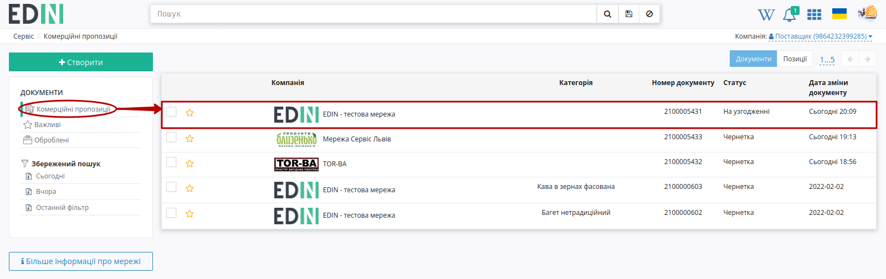

Після того, як документ було відправлено (в статусі :blue:`"На узгодженні"` / :green:`"Прийнято"` / :red:`"Відхилено"`), комерційну пропозицію для зручності можливо **"Завантажити в XLS"**:

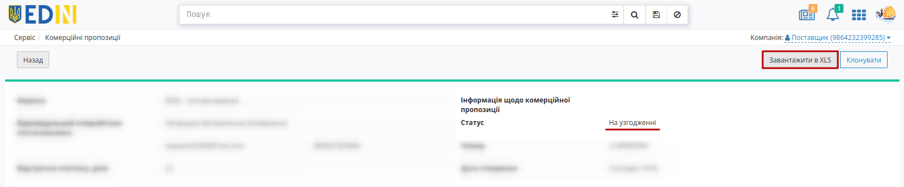

.. hint::
   Шлях зміни статусів Комерціних пропозицій: "Чернетка" -> :blue:`"На узгодженні"` -> :green:`"Прийнято"`/ :red:`"Відхилено"`

Після відправки пропозиції на стороні **Покупця** (**Мережі**) позиції проходить узгодження (статус позицій оновлюється автоматично). :red:`"Відхилені"` пропозиції обов'язково містять коментар-причину відхилення (:green:`"Прийняті"` пропозиції також можуть містити необов'язковий коментар, якщо **Мережа** вирішить його додати):

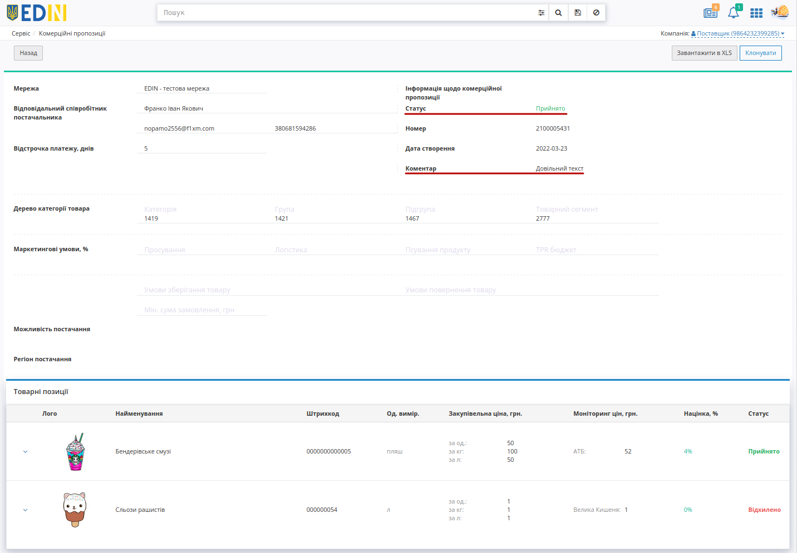

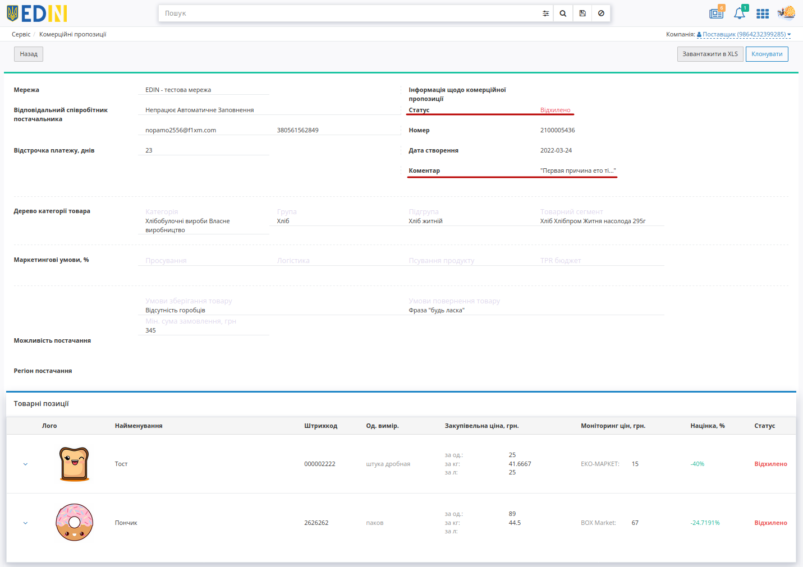

.. колись був такий функціонал   В журналі комерційних пропозицій при наявному коментарі від мережі відображається зафарбована іконка - |comment1| (при відсутності коментарів - |comment0|):

   .. image:: pics_Commercial_offers/Commercial_offers_003.png
      :align: center

   .. hint::
      Користувачі можуть отримувати повідомлення на ел. пошту про зміну статуса відправленої новинки. Для налаштувань такої опції потрібно звертутись до співробітників компанії-провайдера.

**Додатковий функціонал**
=====================================================

**Пошук**
------------------------------

Пошук документів/позицій в сервісі **Комерційна пропозиція** виконується через рядок **"Пошуку"**:

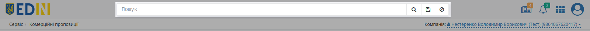

----------------------------------------------------------------------------------------------------

1) Рядок пошуку можливо заповнити, обираючи **"Доступні для пошуку ключі"**:

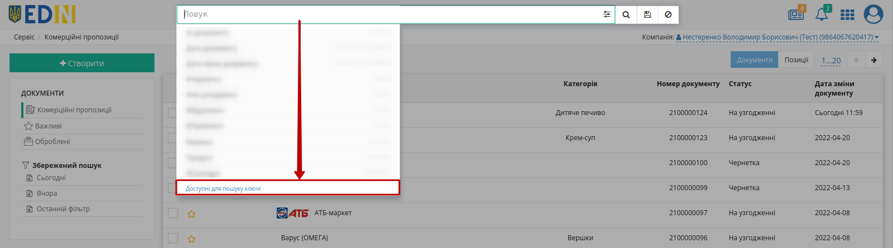

.. note::
   В залежності від того, який журнал відкрито (**Документи** чи **Позиції**) ключі пошуку будуть відрізнятись:

   .. image:: pics_Commercial_offers/Commercial_offers_042.png
      :width: 500

   .. image:: pics_Commercial_offers/Commercial_offers_041.png
      :width: 500

Можливо обрати параметр зі списку/підказки чи почати вводити пошукове значення (система автоматично вкаже на можливі параметри): 

.. image:: pics_Commercial_offers/Commercial_offers_043.png
   :align: center

Після введення значення потрібно натиснути кнопку |лупа| для пошуку. Очищення рядка **"Пошуку"** відбувається за допомогою кнопки **"Скинути фільтри"** |non|.

При складному пошуку усі параметри повині бути розділені комами, наприклад, ``Мережа: EDIN - тестова мережа, #Чернетка``:

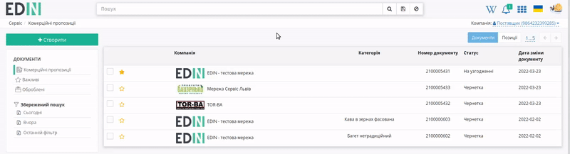

2) Також заповнити рядок пошуку можливо за допомогою набору фільтрів **"Розширеного пошуку"** (|advserch|):

.. note::
   В залежності від того, який журнал відкрито (**Документи** чи **Позиції**) меню пошуку буде відрізнятись:

   .. image:: pics_Commercial_offers/Commercial_offers_061.png
      :align: center

   ⠀⠀⠀⠀⠀⠀⠀⠀⠀

   .. image:: pics_Commercial_offers/Commercial_offers_062.png
      :align: center

Деякі поля містять підказки, що показуються при наведенні курсора на назву параметра:

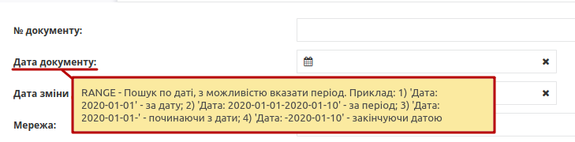

:underline:`Після того, як була обрана мережа` можливо відфільтрувати журнал за ``Категорією`` -> ``Групою`` -> ``Підгрупою`` -> ``Товарним сегментом`` (задаючи параметри лише в такій послідовності) товарних позицій:

.. image:: pics_Commercial_offers/Commercial_offers_076.png
   :align: center

Пошук працює тільки за повним збігом.

----------------------------------------------------------------------------------------------------

Окремо винесені фільтри документів по даті (**"Сьогодні"**, **"Вчора"**), а останній введений пошук зберігається платформою автоматично і при натисканні кнопки **"Останній фільтр"** він виконується повторно:

.. image:: pics_Commercial_offers/Commercial_offers_064.png
   :align: center

Також можливо перманентно **Зберегти** данні власного рядку пошуку, натиснувши на іконку дискети. Переглянути збережений пошук можливо в блоці **Збережений пошук**. Вилучити збережений пошук можна за допомогою хрестика.

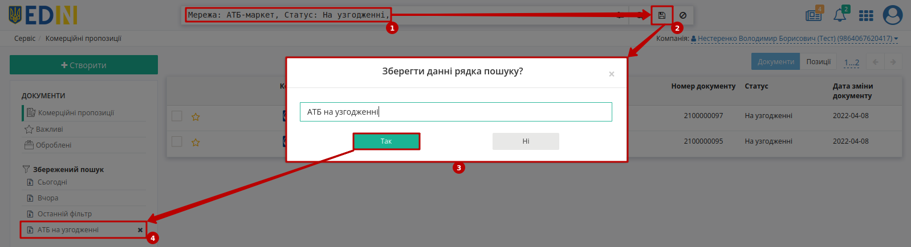

----------------------------------

.. include:: /_constant/kontakti.rst

