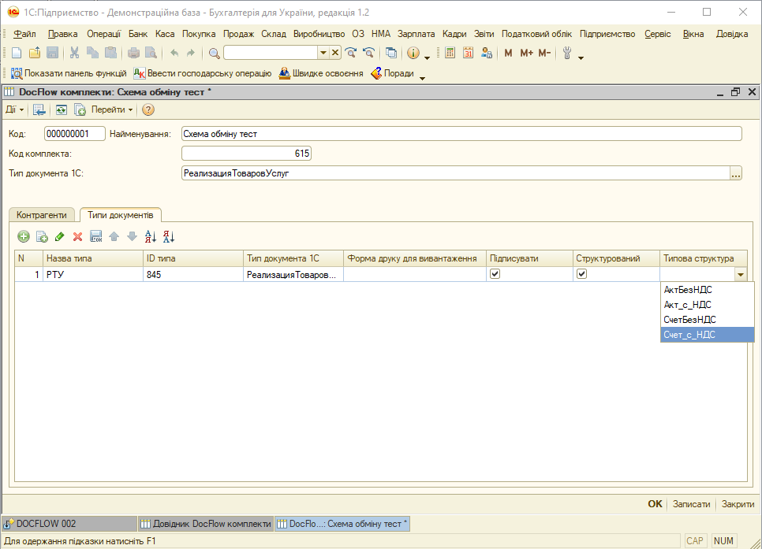

Інструкція користувача модуля DocFlow
#############################################################

.. role:: red

.. role:: grey

.. role:: beige

.. role:: green

.. role:: peachpuff

.. role:: underline

.. contents:: Зміст:
   :depth: 6

---------

Скорочення:

ОС - облікова система

ЮЗД - юридично значущий документ/документообіг

ЕЦП - електронно-цифровий підпис/печатка

---------

**Вступ**
================================================

Розроблений компанією EDIN інтеграційний модуль EDIN.DocFlow (в подальшому просто модуль) дозволяє працювати з обліковими системами 1С | BAS: Підприємство 8.Х :underline:`на звичайних формах` (надалі ОС) на базі операційної системи Windows. Модуль за замовчуванням дозволяє відправляти структуровані/ неструктуровані документи та переглядати комплекти документів, самі документи з платформи DocFlow, слідкувати за статусом документообігу.

Для роботи з модулем користувачеві потрібно мати логін (email) і пароль для доступу до платформи EDIN.DocFlow.

**Налаштування**
================================================

Для корректної роботи інтеграційного модуля EDIN.DocFlow необхідно внести зміни в конфігуратор 1С | BAS: долучити 2 довідника (**DocFlow_Settings** - довідник налаштувань та **DocFlow_Sets** - довідник комплектів документів) та 1 регістр відомостей (**DocFlow_DocInfo**), що надаються співробітниками компанії EDIN. 

Для запуску модуля необхідно в обліковій системі 1С | BAS відкрити файл запуску модуля (передається користувачеві співробітниками EDIN):

.. image:: pics_Integration_1C/Integration_1C_00.png
   :align: center

Також облікова система 1С | BAS дозволяє налаштувати запуск модуля, як встроєним функціоналом (через "Файл"->"Зовнішні друковані форми і обробки"). 

**Підключення**
-------------------------------

При першому запуску модуля для початку роботи потрібно провести налаштування модуля (про це також повідомить повідомлення-підказка):

Для підключення модуля EDIN.DocFlow до платформи документообігу в вкладці **"Налаштування"** потрібно ввести адресу платформи (https://doc.edin.ua), свій логін та пароль. Після того, як дані користувачів були введені можливо здійснити перевірку (кнопка **"Перевірити підключення"** (1)) введених даних. Модуль повідомить про корректність введених даних. Після того, як всі дані введені потрібно **"Зберегти налаштування"** (2). Для користування електронним юридично значущим документообігом (ЮЗД) потрібно додатково вказати на місцерозташування зовнішнього файлу підпису та ввести особистий пароль (3).

.. note::
   Пароль зберігається в "Операції"->"Довідник"->"DocFlow_параметри" в неявному (зашифрованому) вигляді.

**Схеми обміну (довідник комплектів)**
------------------------------------------

Окрім основних налаштувань модуля під особливості документообігу в Вашій організації необхідно також провести налаштування "Схеми обміну" (довідник комплектів): 

.. hint::
   Налаштування можуть бути проведені спеціалістом Вашої організації чи співробітником EDIN.

У вікні "Налаштувань схеми обміну" вказуються:

* Код схеми (надається співробітником EDIN)
* Назва схеми обміну (довільно)
* Код комплекта (надається співробітником EDIN)
* Тип документа 1С | BAS (через кнопку **"..."** обирається головний тип документа)

В налаштуваннях схем обміну розміщені вкладки "Контрагенти" і "Типи документів".

"Контрагенти" - вкладка, в якій додаються та налаштовуютья контрагенти електронного документообігу
   * Контрагент - контрагенти 1С | BAS (довідник)
   * ID сценарію документообігу - вказується ідентифікатор сценарію документообігу з платформи EDIN.DocFlow (надається співробітником EDIN)

.. attention::
   Якщо в схему обміну додано більше одного типа документу, то для внесення змін в логіку документообігу потрібне втручання програміста 1С | BAS.

"Типи документів" - вкладка, в якій додаються і налаштовуються правила обробки документів схеми документообігу

1. Назва типу - довільна назва типу документа
2. ID типу - вказується ідентифікатор типу документа з платформи EDIN.DocFlow (надається співробітником EDIN)
3. Тип документа 1С | BAS - обирається зі списку (за замовчуванням відповідає головному "Типу документа 1С | BAS")

4. Форма друку для вивантаження - зовнішні друковані форми вказуються лише для неструктурованого типу документу (задаються програмістом 1С | BAS - можуть бути зареєстровані і виведені разом із внутрішніми формами 1С | BAS)
5. Підписувати - за активованої відмітки (проставлена галочка) модуль буде автоматично здійснювати спробу підписання документу при його вивантаженні
6. Струтурований - активована відмітка (проставлена галочка) свідчить про те, що обраний документ є структурованим. Активує налаштування "Типова структура".
7. Типова структура:
* АктБезНДС (тільки для послуг)
* Акт_с_НДС (тільки для послуг)
* СчетБезНДС
* Счет_с_НДС

**Робота з модулем**
================================================

Всі дії з документами проводяться у вкладці **"Вихідні"**. Для початку роботи з документами потрібно обрати період (1) та якщо документи не відобразились натиснути **"Відобразити документи 1С | BAS"** (2) - в журналі комплектів документів відобразяться всі документи всіх контрагентів (вказані в налаштуваннях схеми) за обраний період:

Якщо при відображенні документів в комплекта документів вже вказано "ID_Пакета", то це свідчить про те, що даний комплект вже був вивантажений і для перевірки його статусу потрібно **"Завантажити інфо з DocFlow"** (1) (з платформи підвантажиться "Номер комплекта", "Статус DocFlow" та інформація по документах, що входять в цей комплект):

.. note::
   **"Завантажити інфо з DocFlow"** не потребує вибору конкретного комплекта документів, а завантажує інформацію по всім комплектам, що відображаються в журналі.

Комплекти документів можуть містити кілька документів, що відображаються в журналі документів при виборі відповідного комплекту:

Для зручності деякі статуси комплектів та документів відображаються різними кольорами.

Статуси комплектів документів:

1. :grey:`Чернетка`
2. :beige:`Відправлено`
3. :green:`Прийнято`
4. :peachpuff:`Відхилено`
5. Не погоджено

Статуси документів: 

1. :grey:`Чернетка`
2. :beige:`Відправлено`
3. :green:`Прийнято`
4. Уточнення
5. :peachpuff:`Відхилено`
6. Оброблено
7. Відміна
8. Доповнення

В журналі документів присутній функціонал, що дозволяє:

* **"Зберегти файли"** - можливо обрати документи (навіть із різних комплектів) і після натискання кнопки завантажує файл до локального сховища користувача.

* **"Підписати обрані"** - дозволяє підписати за допомогою ЕЦП всі обрані документи (навіть із різних комплектів) незважаючи на налаштування `Схеми обміну (довідник комплектів)`_.

**Відправка комплектів документів**
------------------------------------------

Для **відправки** комплекта документів потрібно:

1. **"Відобразити документи 1С | BAS"**;
2. Обрати бажані комплекти документів для вивантаження/відправки;
3. **Вивантажити документи в DocFlow**;
4. **Завантажити інфо з DocFlow** - таким чином можливо пересвідчитись, що документи пройшли всі перевірки: вони виділяються жирним та мають статус "Готові до відправлення";
5. Обрати (пункт 2) за необхідності комплекти документів, що можуть бути відправлені та натиснути **"Відправити комплекти"**.

.. note::
   Документи підписуються автоматично, якщо в налаштуваннях `Схеми обміну (довідник комплектів)`_ проставлена відмітка "Підписувати". Однак, якщо відмітки не було, а документи вже помилково відправлені непідписаними, то можливо проставити відмітку "Підписувати" і натиснути кнопку **"Підписати вивантажені"** - всі вивантажені документи в даній "Схемі обміну" будуть підписані.  

Також в додатковий функціонал входить можливість **"Зберегти архів пакета"**, що дозволяє завантажити :underline:`вибрані` пакети в якості архіву:

* в випадку, якщо це неструктурований документ архів містить: оригінал документу (pdf) та при наявності підписи (p7s) + документ з інформацією про підписи (pdf);
* в випадку, якщо це структурований документ архів містить: оригінал документу (xml) та при наявності підписи (p7s) +  документ з інформацією про підписи (pdf).

.. include:: kontakti.rst
