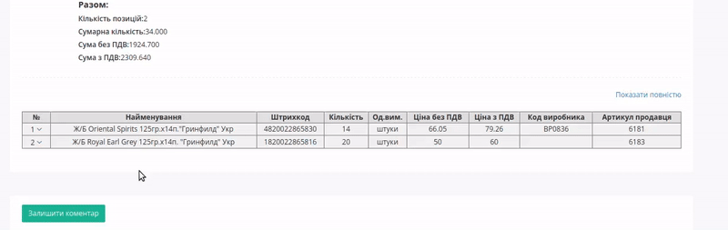
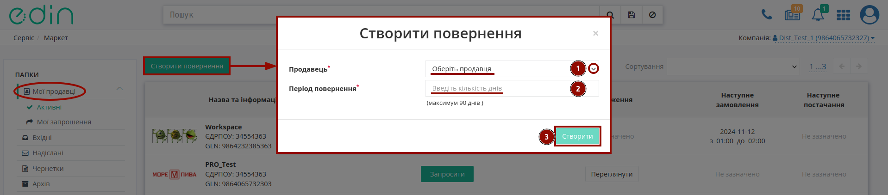
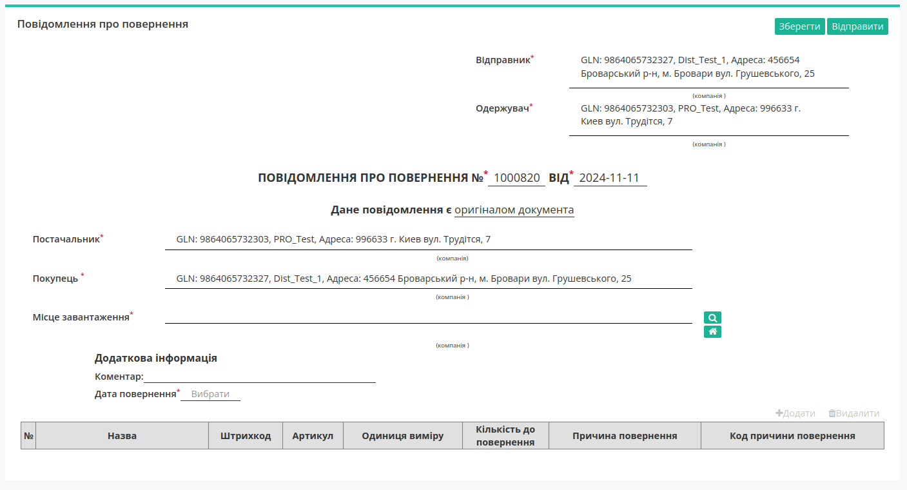
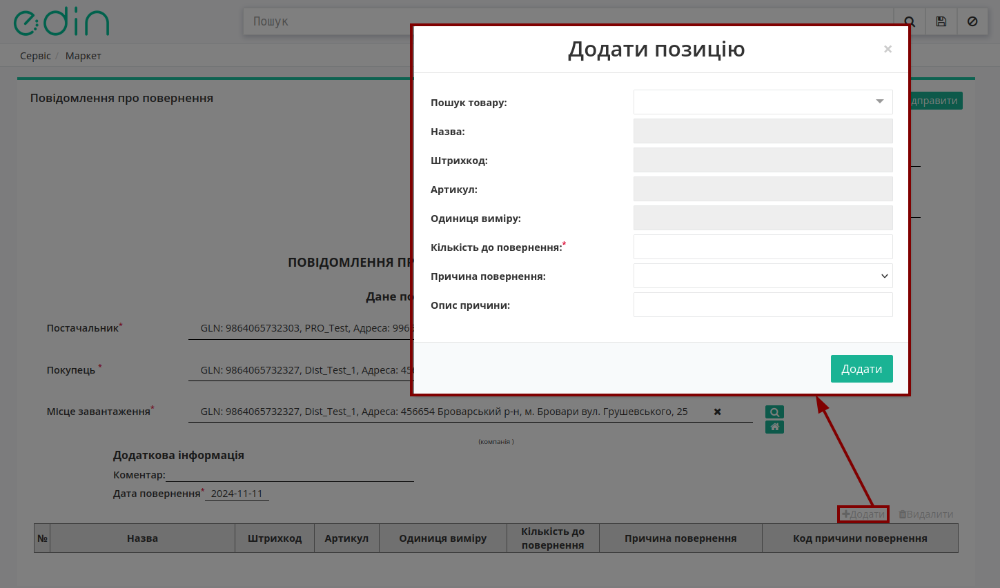
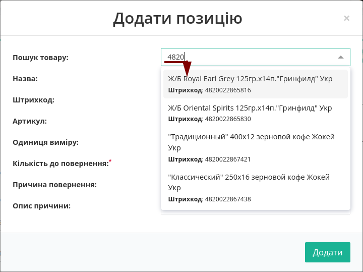
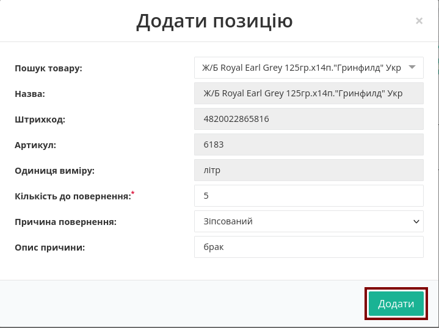
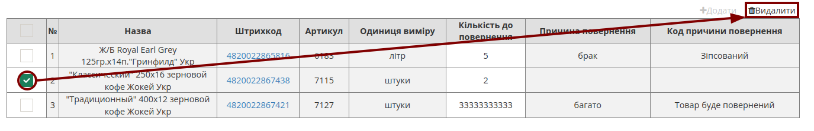
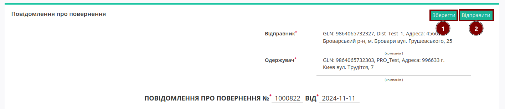

Робота в сервісі "Маркет". Інструкція для Покупця
########################################################################

.. role:: red

.. role:: green

.. role:: blue

.. role:: orange

.. role:: underline

.. сюда закину немного картинок для текста

.. |view_price| image:: pics_dlia_dystrybiutora/Instruktsiia_dlia_dystrybiutora_014.png

.. |get_price| image:: pics_dlia_dystrybiutora/Instruktsiia_dlia_dystrybiutora_015.png

.. |trash_f_red| image:: /_constant/icons/trash_f_red.png

.. |clone| image:: /_constant/icons/clone.png

.. |print| image:: /_constant/icons/print.png

.. |arch| image:: /_constant/icons/arch.png

.. |doc_download| image:: /_constant/icons/doc_download.png

.. |pdf| image:: /_constant/icons/pdf.png

.. |comment_dots| image:: /_constant/icons/comment_dots.png

.. |лупа| image:: /_constant/icons/magnifying_glass.png

.. |будинок| image:: /_constant/icons/house.png

.. contents:: Зміст:
   :depth: 2

---------

Вступ
===================================

**Маркет** — це комплексне електронне рішення, яке оптимізує процеси обміну електронними даними між Продавцями (Виробниками) та Покупцями (Дистриб’юторами).

Дана інструкція описує порядок формування документа `Замовлення (ORDERS) <https://wiki.edin.ua/uk/latest/Distribution/EDIN_2_0/XML/ORDER_x.html>`__ за `Прайс-листом (PRICAT) <https://wiki.edin.ua/uk/latest/Distribution/EDIN_2_0/XML/PRICAT_x.html>`__.

1 Вхід на платформу
====================================

.. include:: /general_2_0/rabota_s_platformoj_EDIN_2.0.rst
   :start-after: .. початок блоку для Enter
   :end-before: .. кінець блоку для Enter

Після успішної авторизації відкриється основне меню, де у вкладці **"Продукти та рішення"** EDIN потрібно обрати сервіс **Маркет**:

.. image:: /_constant/pics_landing/landing_distribution.png
   :align: center

.. _invited:

2 Запрошення
======================================

Продавець може запросити Вас через сервіс "Маркет", використовуючи Ваш email/номер телефону. При запрошенні через email Ви отримаєте електронного листа з посиланням (кнопка **"Приєднатись"**), що також може містити pdf-вкладення (офіційний лист від Продавця):

.. image:: /Distribution/EDIN_2_0/Instructions_2_0/pics_dlia_dystrybiutora/Instruktsiia_dlia_dystrybiutora_095.png
   :align: center

У відкритому вікні (за посиланням з листа) можливо **"Прийняти"** запрошення - при цьому в сервісі "Маркет" формується зв'язок з даним Продавцем для подальшої співпраці:

.. image:: /Distribution/EDIN_2_0/Instructions_2_0/pics_dlia_dystrybiutora/Instruktsiia_dlia_dystrybiutora_096.png
   :align: center

Також можливо **"Відхилити"** запрошення, обов'язково вказавши причину відмови текстовим коментарем:

.. image:: /Distribution/EDIN_2_0/Instructions_2_0/pics_dlia_dystrybiutora/Instruktsiia_dlia_dystrybiutora_097.gif
   :align: center

.. hint::
   Якщо Ви раніше не користувались сервісом "Маркет" потрібно зареєструватись на платформі (`детальніше в інструкції <https://wiki.edin.ua/uk/latest/general_2_0/User_registration.html#register>`__), а також `підключитись до EDIN Market <https://wiki.edin.ua/uk/latest/Distribution/EDIN_2_0/Instructions_2_0/Instruktsiia_dlia_dystrybiutora.html#market-registration>`__. 

При переході в сервіс в розділі **"Мої продавці"** -> **"Мої запрошення"** у Вас будуть відображатись всі заявки (за якими потрібно прийняти рішення та ті, за якими рішення вже прийняте):

.. image:: /Distribution/EDIN_2_0/Instructions_2_0/pics_dlia_dystrybiutora/Instruktsiia_dlia_dystrybiutora_100.png
   :align: center

Запрошення можуть мати статус:

* :orange:`Запрошено` - запрошення відправлено, Ви ще не відповіли Продавцю;
* :green:`Прийнято` - Ви прийняли запрошення, але ще не завершили налаштування;
* :red:`Відхилено` - Ви відхилили запрошення.

Якщо в запрошення Продавець вклав pdf-файл, то Ви можете ознайомитись з його змістом для прийняття рішення за запрошенням, натиснувши на іконку |pdf|.

За всіма :red:`Відхиленими` запрошеннями зберігається коментар-причина відмови (текст доступний при натисканні на іконку |comment_dots|:

.. image:: /Distribution/EDIN_2_0/Instructions_2_0/pics_dlia_dystrybiutora/Instruktsiia_dlia_dystrybiutora_101.png
   :align: center

Після того, як Ви вирішуєте **"Прийняти"** запит на підключення до Продавця потрібно **"Завершити налаштування"**, `підключивши свій GLN <https://wiki.edin.ua/uk/latest/Distribution/EDIN_2_0/Instructions_2_0/Instruktsiia_dlia_dystrybiutora.html#market-registration>`__ ("точку") для зв'язку з Продавцем (детальніше в наступному розділі):

.. image:: /Distribution/EDIN_2_0/Instructions_2_0/pics_dlia_dystrybiutora/Instruktsiia_dlia_dystrybiutora_102.png
   :align: center

По завершенню налаштувань зв'зку з контрагентом Ви можете `почати роботу з Продавцем <https://wiki.edin.ua/uk/latest/Distribution/EDIN_2_0/Instructions_2_0/Instruktsiia_dlia_dystrybiutora.html#market-registration>`__ в розділі **"Мої продавці"** -> **"Активні"**.

.. _market-registration:

2.1 Підключення до EDIN Market
--------------------------------------

Після проходження реєстації на платформі EDIN за запрошенням чи при першому переході в сервіс "Market":

.. image:: /_constant/pics_landing/landing_distribution.png
   :align: center

відкривається вікно Підключення до EDIN Market, де Вам потрібно обрати роль та натиснути **"Далі"** : 

.. image:: /Distribution/EDIN_2_0/Instructions_2_0/pics_dlia_dystrybiutora/Instruktsiia_dlia_dystrybiutora_098.png
   :align: center

Після чого потрібно обрати чи створити GLN, що буде використовуватись для сервісу "Market":

.. image:: /Distribution/EDIN_2_0/Instructions_2_0/pics_dlia_dystrybiutora/Instruktsiia_dlia_dystrybiutora_099.png
   :align: center

І це все, вітаємо в сервісі "Market"!

.. _work-with-seller:

3 Робота з Продавцями (Виробниками)
======================================

.. початок блоку для Order_create1

Після вибору сервісу за замовчуванням відобразиться розділ з Вашими Продавцями (Виробниками). В журналі відображаються усі Ваші конрагенти та коротка інформація в табличному форматі (назва, ЄДРПОУ, GLN). В розділі **"Мої продавці"** доступне сортування списка контрагентів за назвою:

.. image:: /Distribution/EDIN_2_0/Instructions_2_0/pics_dlia_dystrybiutora/Instruktsiia_dlia_dystrybiutora_066.png
   :align: center

.. important::
   Продавцем (Виробником) можуть бути встановлені **Обмеження** щодо максимальної ваги, максимального об’єму, максимальної кількості позицій і мінімальній сумі замовленої партії й т.д., яких потрібно дотримуватись при формуванні "Замовлення". Ви можете **"Переглянути"** їх за допомогою одноіменної кнопки: 

   .. image:: /Distribution/EDIN_2_0/Instructions_2_0/pics_dlia_dystrybiutora/Instruktsiia_dlia_dystrybiutora_067.png
      :align: center
   
   Дата/час в колонці **"Наступне замовлення"** свідчить про те, що Продавець (Виробник) налаштував графік замовлень для Вас або для всіх свої контрагентів (детальніше з налаштуваннями графіка замовлень можливо ознайомитись при перегляді Прайс-листа).

Для початку роботи можливо **Запросити** "Прайс-лист" у Продавця (Виробника) чи **Переглянути** вже доступний "Прайс-лист":

.. image:: /Distribution/EDIN_2_0/Instructions_2_0/pics_dlia_dystrybiutora/Instruktsiia_dlia_dystrybiutora_068.png
   :align: center

За допомогою зручного рядка пошуку можливо відфільтрувати потрібних контрагентів:

.. image:: /Distribution/EDIN_2_0/Instructions_2_0/pics_dlia_dystrybiutora/Instruktsiia_dlia_dystrybiutora_069.gif
   :align: center

.. кінець блоку для Order_create1

.. _prod-pricelist:

4 Перегляд "Прайс-листа" Продавця (Виробника)
=======================================================

.. початок блоку для Order_create2

Для початку роботи потрібно **Запросити** "Прайс-лист" у Продавця (Виробника). Кнопка **Переглянути** свідчить про те, що Продавець (Виробник) надіслав Вам свій "Прайс-лист" і ви можете з ним ознайомитись:

.. image:: /Distribution/EDIN_2_0/Instructions_2_0/pics_dlia_dystrybiutora/Instruktsiia_dlia_dystrybiutora_070.png
   :align: center

.. hint::
   Також в журналі одразу можливо **"Переглянути"** й "Обмеження" даного Продавця (Виробника) за надісланим "Прайс-листом":

   .. image:: /Distribution/EDIN_2_0/Instructions_2_0/pics_dlia_dystrybiutora/Instruktsiia_dlia_dystrybiutora_073.png
      :align: center

При **"Перегляді"** "Прайс-листа" відкривається вікно з усіма доданими позиціями, де список товарів можливо відсортувати за назвою чи ціною:

.. image:: /Distribution/EDIN_2_0/Instructions_2_0/pics_dlia_dystrybiutora/Instruktsiia_dlia_dystrybiutora_074.png
   :align: center

Також можливо відобразити в журналі товарів "Прайс-листа" товари обраної лінійки/категорії/підкатегорії, відмітивши їх в деревовидній структурі **"Категорії товарів"** та натиснувши **"Застосувати"** (при цьому в ієрархії вже відображаються додані товари (кількість/сума)):

.. image:: /Distribution/EDIN_2_0/Instructions_2_0/pics_dlia_dystrybiutora/Instruktsiia_dlia_dystrybiutora_075.png
   :align: center

.. note::
   За замовчуванням в журналі позицій зверху вниз спочатку відображаються товари *за алфавітом* [1]_ з мітками, а потім товари *за алфавітом* [1]_ без міток, однак в **"Категорії товарів"** інше правило: нові завантажені категорії відображаються знизу (в порядку завантаженого прайс-листа)!

Якщо Продавець (Виробник) повідомляє своїх Покупців (Дистрибʼюторів) про залишки на складі, тобто відправляє в Прайс-листі свої дані про залишки продукції, то ці значення відображаються в бланку в колонці **Залишок**. Неможливо оформити більшу кількість товару, ніж **Залишок**, навіть якщо не встановлена **Квота на замовлення** (максимальна кількість товару в одному замовленні, встановлена Продавцем (Виробником)).

.. image:: /Distribution/EDIN_2_0/Instructions_2_0/pics_dlia_dystrybiutora/Instruktsiia_dlia_dystrybiutora_076.png
   :align: center

.. hint::
   Якщо Продавець (Виробник) в обраній позиції вказує "Кратність", то при формуванні "Замовлення" Покупцем кількість замовлених позицій має бути кратною вказаній кількості. Наприклад, якщо "Кратність"=3, то "Кількість одиниць" для формування "Замовлення" може бути 3, 6, 9...

   .. image:: /Distribution/EDIN_2_0/Instructions_2_0/pics_dlia_dystrybiutora/Instruktsiia_dlia_dystrybiutora_077.png
      :align: center

Помітки :red:`Новинка!`, :blue:`Акція!`, :green:`Публічна позиція!` та :orange:`Надбавка!` додає Продавець (Виробник).

Під табличною частиною з позиціями ви можете переглягути підсумки за поточним "Замовленням" та "Обмеження" на замовлення, встановлені Продавцем (Виробником) (за відсутності обмеження в прайс-листі відображається прочерк "-" ):

.. image:: /Distribution/EDIN_2_0/Instructions_2_0/pics_dlia_dystrybiutora/Instruktsiia_dlia_dystrybiutora_078.png
   :align: center

.. кінець блоку для Order_create2

5 Створення Замовлення за Прайс-листом
=================================================

.. початок блоку для Order_create3

При створенні `Замовлення (ORDERS) <https://wiki.edin.ua/uk/latest/Distribution/EDIN_2_0/XML/ORDER_x.html>`__ варто враховувати встановлені Продавцем (Виробником) **Обмеження** та кратності, що зазначаються за кожною позицією окремо.

Якщо Продавець (Виробник) налаштував для Вас індивідуально чи для всіх своїх контрагентів **"Графік замовлень"**, то Ви можете ознайомитись з ним, натиснувши на одноіменну кнопку:

.. image:: /Distribution/EDIN_2_0/Instructions_2_0/pics_dlia_dystrybiutora/Instruktsiia_dlia_dystrybiutora_079.png
   :align: center

Обравши дату, Ви можете ознайомитись з інформацією по графіку приймання замовлень від Продавця (Виробника):

.. image:: /Distribution/EDIN_2_0/Instructions_2_0/pics_dlia_dystrybiutora/Instruktsiia_dlia_dystrybiutora_062.png
   :align: center

Зеленим кольором в календарі будуть відмічені дні прийому замовлень; години прийому замовлень можуть бути додатково зазначені при перегляді дати в календарі:

.. image:: /Distribution/EDIN_2_0/Instructions_2_0/pics_dlia_dystrybiutora/Instruktsiia_dlia_dystrybiutora_063.png
   :align: center

.. attention::
   Якщо Продавець (Виробник) заборонив відправляти замовлення поза своїм графіком замовлень, то при відправці замовлення не в визначений період, Ви отримаєте помилку!

Для того аби не виникали непорозуміння Продавець (Виробник) може налаштувати відправку системних сповіщень (а також на пошту) про свою готовність приймати замовлення.

Замовлення формується через заповнення значень у ствопцях **Кількість одиниць** та **Кількість коробок**:

.. image:: /Distribution/EDIN_2_0/Instructions_2_0/pics_dlia_dystrybiutora/Instruktsiia_dlia_dystrybiutora_080.png
   :align: center

Якщо Продавець (Виробник) активував процес **Рекомендації до замовлення**, то Ви можете заповнити чернетку "Замовлення" згідно рекомендації Продавця за допомогою кнопки **"Замовити згідно рекомендації"** (кнопка відображається лише при налаштуваннях Продавця):

.. image:: /Distribution/EDIN_2_0/Instructions_2_0/pics_dlia_dystrybiutora/Instruktsiia_dlia_dystrybiutora_071.png
   :align: center

При цьому вказується лише рекомендовані товари і зазначаються рекомендовані кількості. При зміні рекомендованої кількості зазначається розбіжність з відповідним знаком:

.. image:: /Distribution/EDIN_2_0/Instructions_2_0/pics_dlia_dystrybiutora/Instruktsiia_dlia_dystrybiutora_072.png
   :align: center

.. hint::
   Також у Продавця (Виробника) є можливість (за домовленістю) надіслати Вам в кошик "Попереднє замовлення", в якому Продавець (Виробник) зазначає рекомендовані (персонально для Вас) товари та кількості до замовлення. В цьому випадку при перегляді прайс-листа товари і кількості вже вказані і Ви можете одразу **"+Створити замовлення"** (всі рекомендовані кількості доступні до редагування).

   Коли Продавець (Виробник) надсилає Вам свої рекомендації Ви отримуєте `повідомлення "в дзвіночок" <https://wiki.edin.ua/uk/latest/general_2_0/rabota_s_platformoj_EDIN_2.0.html#messages>`__ та лист на пошту:

   .. image:: /Distribution/EDIN_2_0/Instructions_2_0/pics_dlia_dystrybiutora/Instruktsiia_dlia_dystrybiutora_053.png
      :align: center

   При натисканні на кнопку **"Перевірити кошик"** відкривається прайс-лист з рекомендаціями Продавця (Виробника). 

Значення в цих колонках можливо вносити **вручну**, обираючи потрібні поля, або за допомогою XLSX/XLS файлу (кнопка **"Завантажити з Excel"**). Для масового внесення кількостей за товарами за допомогою файла потрібно спочатку **"Скачати шаблон"**:

.. image:: /Distribution/EDIN_2_0/Instructions_2_0/pics_dlia_dystrybiutora/Instruktsiia_dlia_dystrybiutora_081.png
   :align: center

Відкрийте та заповніть файл Excel.

.. hint::
   Дані завжди підвантажуються лише з першого листа файлу, однак просунутим користувачам Excel буде цікаво знати, що в полях для завантаження Ви можете використовувати формули, що також можуть включати значення з інших листів файлу, наприклад: 

   .. image:: /Distribution/EDIN_2_0/Instructions_2_0/pics_dlia_dystrybiutora/Instruktsiia_dlia_dystrybiutora_094.png
      :align: center

Заповнений Вашими даними файл можливо додати за допомогою кнопки **"Завантажити шаблон"**:

.. image:: /Distribution/EDIN_2_0/Instructions_2_0/pics_dlia_dystrybiutora/Instruktsiia_dlia_dystrybiutora_082.png
   :align: center

.. important::
   Зверніть увагу! Видаляти, міняти місцями колонки в Excel файлі не можна. Колонки виділенні зеленим кольором - **обов'язкові до заповнення**! Пара значень "Штрихкод"-"Артикул" повинна бути унікальною на рівні Замовлення (перевірка на дублі - додається лише перше значення). Якщо будь-яку з позицій буде заповнено некоректно, при додаванні файлу на платформі відображається підказка з переліком помилок в конкретних рядках, що потібно виправити:

   .. image:: /Distribution/EDIN_2_0/Instructions_2_0/pics_dlia_dystrybiutora/Instruktsiia_dlia_dystrybiutora_083.png
      :align: center

Після вказання кількості, що повинна бути замовлена в сервісі EDIN **Маркет** автоматично для цієї позиції та для всього документа `Замовлення (ORDERS) <https://wiki.edin.ua/uk/latest/Distribution/EDIN_2_0/XML/ORDER_x.html>`__ розраховуються значення:

* Загальна кіл-ть позицій в замовленні = кількість блоків в POSITION в Замовленні (ORDERS) 
* Загальна кіл-ть коробок = сума всіх значень BOXESCOUNT в Замовленні (ORDERS)
* Загальна кіл-ть палет = сума всіх значень PALLETS в Замовленні (ORDERS)
* Загальна вага замовлення = сума всіх значень множників WEIGHT * BOXESCOUNT в Замовленні (ORDERS)
* Сумма замовлення з ПДВ = сума всіх значень множників ORDEREDQUANTITY * PRICEWITHVAT в Замовленні (ORDERS)
* Сума замовлення без ПДВ = сума всіх значень множників ORDEREDQUANTITY * ORDERPRICE в Замовленні (ORDERS)

.. image:: /Distribution/EDIN_2_0/Instructions_2_0/pics_dlia_dystrybiutora/Instruktsiia_dlia_dystrybiutora_084.png
   :align: center

Натисніть на **Найменування** позиції для відображеня детальної інформації про товар:

.. image:: /Distribution/EDIN_2_0/Instructions_2_0/pics_dlia_dystrybiutora/Instruktsiia_dlia_dystrybiutora_085.png
   :align: center

Вся введена інформація автоматично зберігається і Ви завжди можете повернутись до Замовлення пізніше: потрібно повторно відкрити "Прайс-лист" Продавця (Виробника) та продовжити роботу. При заповненні кількості одиниць або кількості коробок, якщо поле позначене червоним - перевірте, чи не перевищили ви обмеження та квоти, а також відповідність кількості одиниць до кількості коробок. В випадку невідповідності до квот чи обмежень потрібно зменшити кількість товару в замовленні до значення, що не призводить до помилок при перегляді товарів у **Кошику**:

.. image:: /Distribution/EDIN_2_0/Instructions_2_0/pics_dlia_dystrybiutora/Instruktsiia_dlia_dystrybiutora_086.gif
   :align: center

Перед переходом в **Кошик** переконайтеся в тому, що не перевищено обмеження - в блоці в нижній частині екрану не повинно бути значень, виділених червоним кольором. Якщо ліміт по одному з встановлених обмежень перевищено, `Замовлення (ORDERS) <https://wiki.edin.ua/uk/latest/Distribution/EDIN_2_0/XML/ORDER_x.html>`__ не створиться.

Якщо у Вас виникнуть питання щодо значень встановлених обмежень, зверніться безпосередньо до Продавця (Виробника). 

При введених значеннях, що відповідають квотам/обмеженням документ `Замовлення (ORDERS) <https://wiki.edin.ua/uk/latest/Distribution/EDIN_2_0/XML/ORDER_x.html>`__ потрібно перейти в **Кошик** (на червоному фоні вказується кількість товарних позицій):

.. image:: /Distribution/EDIN_2_0/Instructions_2_0/pics_dlia_dystrybiutora/Instruktsiia_dlia_dystrybiutora_087.png
   :align: center

В **Кошику** відображаються обрані товарні позиції, їх кількості попозиційно та загальний блок **Підсумок**. В блоці **Замовлення** потрібно заповнити основні атрибути майбутнього документа (поля, позначені червоною зірочкою :red:`*` - **обов'язкові до заповнення**):

.. image:: /Distribution/EDIN_2_0/Instructions_2_0/pics_dlia_dystrybiutora/Instruktsiia_dlia_dystrybiutora_088.png
   :align: center

Потрібно обрати бажану дату доставки зі зручного календаря, спосіб оплати (готівковий/безготівковий):

.. image:: /Distribution/EDIN_2_0/Instructions_2_0/pics_dlia_dystrybiutora/Instruktsiia_dlia_dystrybiutora_089.png
   :align: center

Обрати місце доставки з випадаючого списку, спосіб відвантаження (Самовивіз/Доставка транспортом Продавця (Виробника)) та можливо написати текстовий коментар Продавцю (Виробнику):

.. image:: /Distribution/EDIN_2_0/Instructions_2_0/pics_dlia_dystrybiutora/Instruktsiia_dlia_dystrybiutora_090.png
   :align: center

.. hint::
   Ви також можете редагувати своє "Замовлення" прямо в Кошику, редагуючи кількості товарів, видаляючи позиції чи навіть все Замовлення за допомогою |trash_f_red| кнопок!

Після перевірки та заповнення основих даних документа можливо **Відправити замовлення**:

.. image:: /Distribution/EDIN_2_0/Instructions_2_0/pics_dlia_dystrybiutora/Instruktsiia_dlia_dystrybiutora_091.png
   :align: center

.. attention::
   Якщо при натисканні на кнопку Ви отримуєте помилку: перевірте графік отримання замовлень Продавця (Виробника)! Продавець (Виробник) може блокувати відправку замовлення поза своїм графіком замовлень:

   .. image:: /Distribution/EDIN_2_0/Instructions_2_0/pics_dlia_dystrybiutora/Instruktsiia_dlia_dystrybiutora_092.png
      :align: center

.. кінець блоку для Order_create3

5.1 Перегляд Замовлення
---------------------------------

Після відправки `Замовлення (ORDERS) <https://wiki.edin.ua/uk/latest/Distribution/EDIN_2_0/XML/ORDER_x.html>`__ документ стає недоступним до редагування, його можливо лише переглянути в папці "Надіслані":

.. image:: pics_dlia_dystrybiutora/Instruktsiia_dlia_dystrybiutora_093.png
   :align: center

У `Замовленні (ORDERS) <https://wiki.edin.ua/uk/latest/Distribution/EDIN_2_0/XML/ORDER_x.html>`__ Ви можете перевірити вказані дані (GLN Покупця, GLN Місця доставки, дату поставки...), табличну частину з товарними позиціями, а також виконати наступні дії з документом:

.. include:: /general_2_0/rabota_s_platformoj_EDIN_2.0.rst
   :start-after: .. початок блоку для Doc_actions
   :end-before: .. кінець блоку для Doc_actions

В табличній частині відображається основна інформація, для ознайомлення з усією інформацією за товарною позицією предбачені кнопки **∨** / **∧** в "№" позиції та **"Показти повністю"** / **"Згорнути"** для всієї таблиці:

.. image:: pics_dlia_dystrybiutora/Instruktsiia_dlia_dystrybiutora_022.gif
   :align: center

Користувачі замовника, наприклад, співробітники бухгалтерії, зайшовши в відправлений документ, можуть додавати до нього свої Коментарі (видалити коментар неможливо):

Отримувач Замовлення (Продавець (Виробник)) також може лишати в ньому коментарі.

.. _retann-create:

5 Повернення товарів
=================================================

Повернення товарів передбачає собою формування документа "Повідомлення про повернення" (RETANN) від Покупця (Дистрибʼютора) до Продавця (Виробника), в якому зазначається перелік товарних позицій, які користувач збирається повернути.

Для ініціації процесу Покупець в розділі "Мої продавці" натискає на кнопку **"Створити повернення"**:

Далі в модальному вікні потрібно обрати одного Продавця, з яким Ви співпрацюєте, зазначити період повернення (кількість днів, за які може бути сформоване повернення (починаючи від поточного) змінюється відповідно до наявності Лімітів зазначених Продавцем) та натиснути **"Створити"**. Відкриється частково заповнена форма "Повідомлення про повернення" (RETANN) (обов'язкові до заповнення поля позначені червоною зірочкою :red:`*`):

Дані **Відправника** та **Одержувача** - це Ваші дані та дані Вашого Продавця відповідно - заповнюються автоматично і не підлягають редагуванню. **Номер**, **Дата** теж заповнюються автоматично (зазначається поточна дата, але доступна до редагування). Дані **Постачальник**, **Покупець** також заповнюються автоматично і не доступні до редагування.

Вам потрібно заповнити **Місце завантаження** за допомогою кнопок "Пошук контрагента" (|лупа|) (вибір серед GLNів Вашого акаунта, що мають ознаку "Покупець") чи "Вказати себе" (|будинок|);

.. image:: /retail_2.0/pics_formirovanie_ORDERS_na_EDI_Network_2.0/ORDERS_na_EDI_Network_2.0_024.png
   :align: center

В блоці **Додаткова інформація** потрібно обрати **"Дату повернення"**, можливо опціонально вписати текстовий коментар з причинами повернення, тощо.

Для наповнення табличної частини потрібно **"+Додати"** товари:

В модальному вікні для пошуку товару потрібно лише почати вводити назву чи штрих-код товару (від 3 символів), після чого його можливо обрати з випадаючого списку:

.. note::
   Пошук товару здійснюється на рівні даного Продавця серед позицій, що були прийняті, відвантажені/підтверджені/замовлені за обраний період повернення!

Далі потрібно зазначити Кількість товару до повернення, обрати зі списку причину повернення саме для цього товару (також можна додати текстовий опис причини) та **"Додати"** в таблицю документа:

**"Змінити"** "Дані позиції" доданого товару також можливо після натискання на штрих-код позиції:

.. image:: pics_dlia_dystrybiutora/Instruktsiia_dlia_dystrybiutora_108.png
   :align: center

Якщо якась із була додано помилково, її можливо відзначити галочкою і **"Видалити"** з таблиці документа:

Після внесення всіх даних потрібно **"Зберегти"** (1) документ, після чого його можливо **"Відправити"** (2):

Після збереження документ можливо знайти в папці **"Чернетки"**. Відправлений документ автоматично потрапляє в папку **"Надіслані"**:

Робота з EDI та ЮЗД
===================================

Користувачу доступна робота з наступними документами:

* `Замовлення (ORDERS) <https://wiki.edin.ua/uk/latest/EDIN_Specs/XML/ORDER_x.html>`__
* `Підтвердження замовлення (ORDRSP) <https://wiki.edin.ua/uk/latest/EDIN_Specs/XML/ORDRSP_x.html>`__
* `Повідомлення про відвантаження (DESADV) <https://wiki.edin.ua/uk/latest/EDIN_Specs/XML/DESADV_x.html>`__
* `Повідомлення про прийом (RECADV) <https://wiki.edin.ua/uk/latest/EDIN_Specs/XML/RECADV_x.html>`__
* `Рахунок (INVOICE) <https://wiki.edin.ua/uk/latest/EDIN_Specs/XML/INVOICE_x.html>`__
* `Видаткова накладна (COMDOC_006) <https://wiki.edin.ua/uk/latest/EDIN_Specs/XML/COMDOC_006_x.html>`__

Для зручності документи логічно пов'язуються в так звані ланцюжки. Далі представлені можливі схеми/комбінації документообігу (в дужках вказаний відправник документу):

1) ORDERS (Покупець (Дистрибʼютор)) -> ORDRSP (Продавець (Виробник)) -> DESADV (Продавець (Виробник)) -> RECADV (Покупець (Дистрибʼютор)) -> INVOICE (Продавець (Виробник))
2) ORDERS (Покупець (Дистрибʼютор)) -> ORDRSP (Продавець (Виробник)) -> DESADV (Продавець (Виробник)) -> COMDOC_006 (Продавець (Виробник))
3) ORDERS (Покупець (Дистрибʼютор)) -> ORDRSP (Продавець (Виробник)) -> INVOICE (Продавець (Виробник))
4) ORDERS (Покупець (Дистрибʼютор)) -> ORDRSP (Продавець (Виробник)) -> COMDOC_006 (Продавець (Виробник))
5) ORDERS (Покупець (Дистрибʼютор)) -> ORDRSP (Продавець (Виробник)) -> RECADV (Покупець (Дистрибʼютор)) -> INVOICE (Продавець (Виробник))
6) ORDERS (Покупець (Дистрибʼютор)) -> DESADV (Продавець (Виробник)) -> RECADV (Покупець (Дистрибʼютор)) -> INVOICE (Продавець (Виробник))
7) ORDERS (Покупець (Дистрибʼютор)) -> DESADV (Продавець (Виробник)) -> COMDOC_006 (Продавець (Виробник))
8) ORDERS (Покупець (Дистрибʼютор)) -> INVOICE (Продавець (Виробник))
9) ORDERS (Покупець (Дистрибʼютор)) -> COMDOC_006 (Продавець (Виробник))

FAQ / Часті запитання
===================================

**Що робити, якщо Прайс-лист порожній?**

Зверніться до служби технічної підтримки АТС, і ми подбаємо про його завантаження постачальником для вашої компанії. 
Також, звернувшись до постачальника, ви можете уточнити причину, по якій вам не надано Прайс-лист і узгодити надання.

**Що робити, якщо ціни в прайсі не актуальні?**

Всі дані, що містяться в Прайс-листі, отримуються безпосередньо від постачальника. В такому випадку необхідно звернутися до відповідного постачальника для узгодження цін і подальшої актуалізації Прайс-листа.

**Як підключити Прайс-лист іншого Продавця (Виробника)?**

Для вирішення даного питання зверніться до свого менеджера компанії АТС.

**Чи можу я надсилати замовлення зі своєї облікової системи та як це зробити?**

Для відправки замовлення з облікової системи потрібні додаткові налаштування. Як це зробити підкаже ваші відповідальні менеджери компанії АТС.

-------------------------------------

.. [#] тут *за алфавітом* мається на увазі порядок відображення товарів, назви яких починаються з: **спец. символів (пробіл, лапки та ін.)** -> **цифр** -> **латиниці** -> **кирилиці**.

-------------------------------------

.. include:: /_constant/kontakti.rst