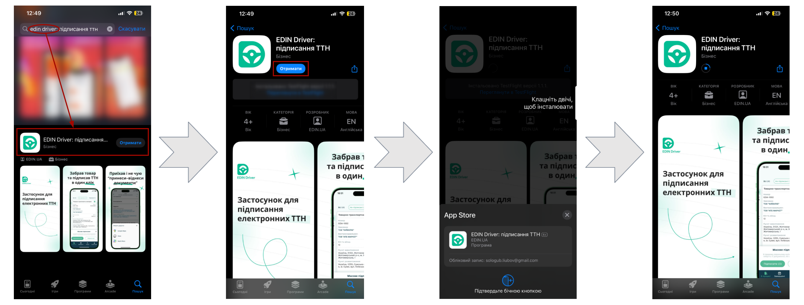

########################################################################################################################
|apple_logo| **iOS** | Робота в додатку "EDIN Driver" (інструкція для Водіїв)
########################################################################################################################

.. role:: green

.. role:: blue

.. role:: navy

.. role:: red

.. role:: orange

.. сюда закину немного картинок для текста

.. |diskette| image:: /_constant/icons/diskette.png

.. |green_trash| image:: /_constant/icons/green_trash.png

.. |apple_logo| image:: /_constant/icons/apple_logo.png
                  :height: 30px

.. |app-store| image:: /_constant/icons/app-store.png
                  :height: 35px
                  :target: https://apps.apple.com/ua/app/edin-driver-signing-waybill/id1658986357

.. contents:: Зміст:
   :depth: 5
   :local:

---------

.. attention::
   Для коректної роботи сервісу додаток **"EDIN Driver"** та всі додатки, від яких залежить підписання мають бути оновлені до останньої версії!

.. _app-install:

1 Встановлення додатка **"EDIN Driver"**
==============================================

Для встановлення додатка **"EDIN Driver"** натисніть на кнопку |app-store| чи самостійно знайдіть віджет за назвою в **"Apple App Store"**. Далі потрібно **"Отримати"** додаток (потребує підтвердження):

Встановлений додаток **"EDIN Driver"** можливо одразу **"Відкрити"** з **"Apple App Store"** чи знайти серед встановлених додатків на Вашому пристрої за назвою:

.. image:: pics_iOS/iOS_002.png
   :align: center

.. include:: /Driver/Instructions/Android.rst
   :start-after: .. початок блоку для Android_to_iOS_001
   :end-before: .. кінець блоку для Android_to_iOS_001

---------------------------------

.. include:: /_constant/kontakti.rst

