Інструкція з налаштування ЕЦП/КЕП
##############################################

---------

.. contents:: Зміст:
   :depth: 2

---------
	
Дана інструкція описує  порядок завантаження  та налаштування електронного цифрового підпису. 

------------------

.. |иконка-ведерко| image:: pics_instruktsia-nastroyka-ecp/instruktsia_nastroyka_ecp_3_vederko.png
.. |иконка-сброс| image:: pics_instruktsia-nastroyka-ecp/instruktsia_nastroyka_ecp_4_sbros.png
.. |иконка-мобилка| image:: pics_instruktsia-nastroyka-ecp/instruktsia_nastroyka_ecp_5_mobileid.png

1 Терміни та визначення
------------------------
Електронний цифровий підпис (ЕЦП/КЕП) — електронний цифровий підпис уповноважених осіб та окремий електронний цифровий підпис, що виконує функцію печатки (у разі наявності), з посиленим сертифікатом ключа, наданим акредитованими центрами сертифікації ключів (далі – АЦСК).

Токен – це носій інформації у формі флешки із захистом від несанкціонованого доступу при генерації секретних ключів, зберіганні цифрового підпису та підписанні електронних документів.

2 Авторизація в системі
------------------------
Для авторизації на платформі перейдіть за посиланням https://doc.edin.ua/auth та введіть свої логін (email) і пароль на формі авторизації. Детальна інформація з авторизації міститься в  `«Інструкції з авторизації»`_.

.. _«Інструкції з авторизації»: https://wiki.edin.ua/uk/latest/EDIN_DOCflow/edin_docflow/instruktsia-avtorizatsia.html

3 Налаштування електронного підпису
---------------------------------------
Для підписання та шифрування документів необхідно, щоб у системі користувача були зчитані (завантажені) ключі підписів.

**3.1 Зчитування ключа**

Для налаштування ключів перейдіть до розділу «Налаштування ЕЦП/КЕП». Натискання ініціалізує бібліотеку підписання:

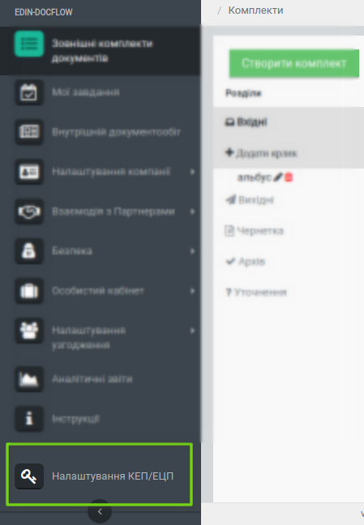

У формі налаштування ключів виберіть формат ключа - токен або файловий ключ. 
Спочатку додамо файловий ключ - для цього натисніть «Обрати файл»:

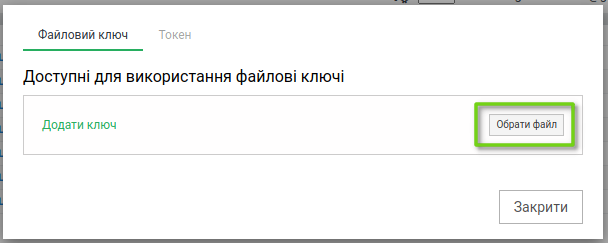

Наступним кроком виберіть файл підпису в каталозі на жорсткому диску ПК (чи на іншому носії) та натисніть «Відкрити»:

.. image:: pics_instruktsia-nastroyka-ecp/instruktsia_nastroyka_ecp_3.png
   :align: center

Система відобразить форму для вводу пароля до ЕЦП.

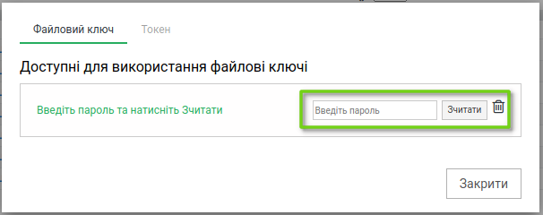

Після вводу пароля натисніть «Зчитати». У разі успішного зчитування ЕЦП/КЕП з’явиться відповідне повідомлення "Ключ зчитаний успішно": 

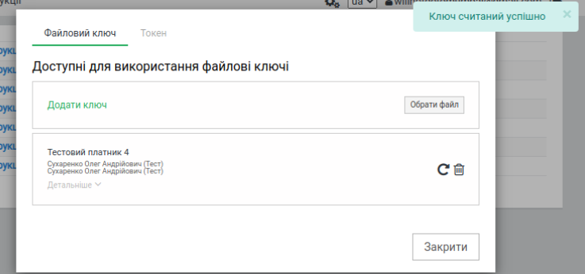

Ви можете переглянути детальнішу інформацію про підписанта й переконатися що завантажено вірний ключ.

Зчитування декількох підписів виконується по черзі, кожен файл підпису зчитується окремо.

**3.2 Активація ЕЦП/КЕП для нової сесії**

Згідно з політикою безпеки, паролі до ЕЦП/КЕП зберігаються лише упродовж сеансу роботи в браузері. Тобто при наступній роботі вам знову потрібно буде ввести пароль.

При повторному сеансі необхідно активувати ЕЦП/КЕП, вказавши пароль до ключа. 

Для активації ключа натисніть на «Налаштування ЕЦП/КЕП». Також ви можете ввести пароль при безпосередньому підписанні документа.

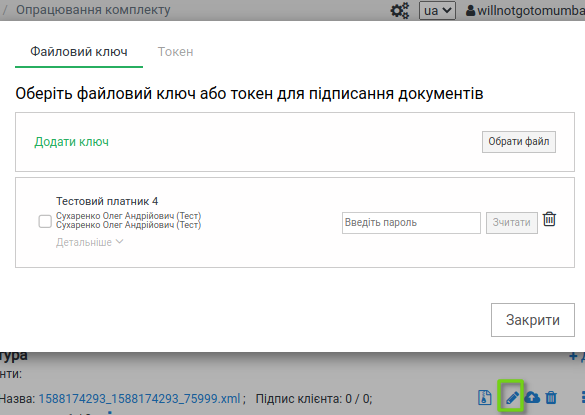

Для активації ключа введіть пароль у відповідне поле та натисніть «Зчитати».

**3.3 Скидання пароля та видалення ключа**

Підписи зберігаються у локальному сховищі браузера. Для скидання пароля зчитаного та активованого ключа завершіть сеанс роботи в браузері або натисніть на іконку |иконка-ведерко| біля необхідного ключа для видалення, чи на кнопку «Скинути пароль» лише для видалення паролю.

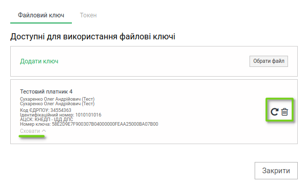

Підписання за допомогою ЕЦП/КЕП
***********************************************

При підписанні документа (натискання на іконку *олівця* біля документа), відмітьте галочкою потрібний ключ підписання, після чого він зафатбується зеленим, та натисніть **Підписати**.

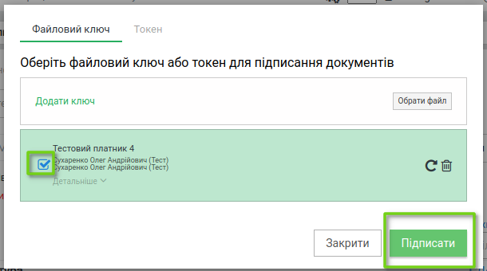

Після успішного процессу підписання, відобразиться *Звіт про підписання документів*, де вказано назву документу та кількість підписів, та сам результат підписання. 

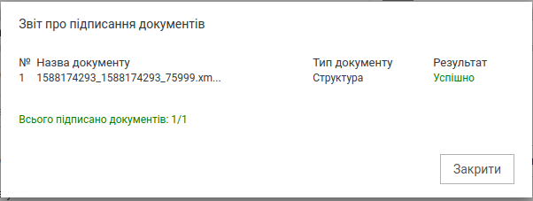

У разі неуспішного підписання також відобразиться *Звіт про підписання документів*, де вказано результат підписання "Помилка", а також з'явиться інформаційне вікно де вказано причину помилки, наприклад: *Підпис вже використовується*.

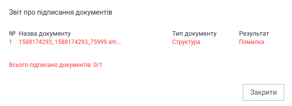

Результат підписання кількох документів в пакеті одночасно (якщо позначити галочкою декілька і натиснути кнопку Підписати виділені):

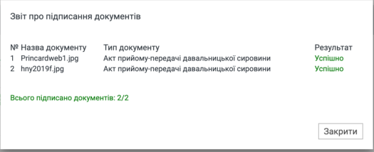

4 Налаштування Апаратного ключа (Токен)
-----------------------------------------------

В сервісі DOCflow реалізована можливість підписання документів використовуючи зовнішній Електронний USB-ключ, токен від виробника ТОВ “Автор” сумісні з АЦСК “Україна”: «Алмаз-1К» та «SecureToken-337М».

 Токен – це носій інформації у формі флешки із захистом від несанкціонованого доступу при генерації секретних ключів, зберіганні цифрового підпису та підписанні електронних документів.

При підписанні документа, є можливість вибрати яким Електронним ключем підписати документ - за допомогою налаштованого КЕП/ЕЦП, чи USB-ключем.

До налаштування ПО для роботи з токеном, при переході на вкладку Токен відображення буде таким:

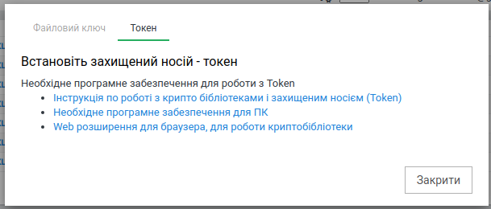

Усі пункти є робочими посиланнями з необхідною інформацією. Натиснувши **Необхідне програмне забезпечення для ПК** почнеться автоматичне завантаження програми для ПК.

Після скачування, переходимо встановлення программи.

.. note:: Для різних операційних систем процес може виглядати трохи інакше. Подальші дії для різних ОС також детально описані в `«Інструкції по роботі з крипто бібліотеками і захищеним носієм» <https://iit.com.ua/download/productfiles/EUSignWebOManual.pdf>`__ .

.. image:: pics_instruktsia-nastroyka-ecp/instruktsia_nastroyka_token_2.png
   :align: center

.. image:: pics_instruktsia-nastroyka-ecp/instruktsia_nastroyka_token_3.png
   :align: center

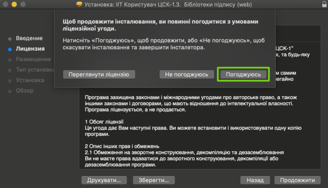

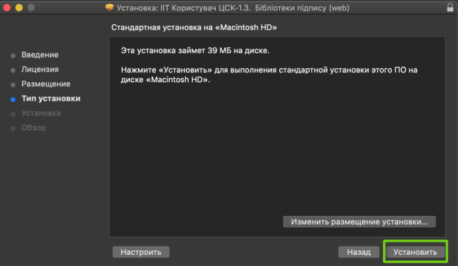

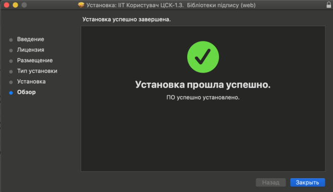

Натискаемо та посилання №3 "Web розширення для браузера, для роботи криптобібліотеки". Встановлюємо розширення.

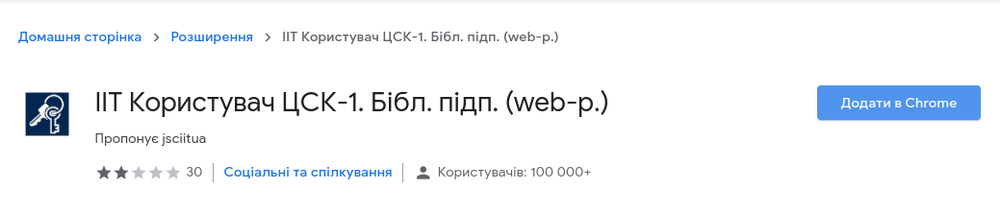

Дозволяємо сайту доступ до Web розширення.

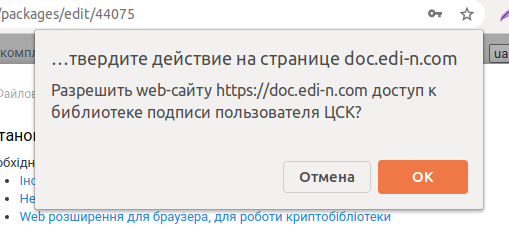

Обов'язково оновлюємо сторінку! Після чого знову відкриваємо віджет, вкладка Токен виглядає так:

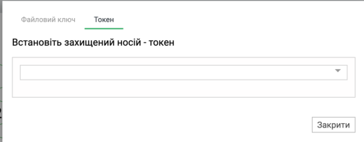

Вибираємо токен зі списку, вводимо пароль, натискаемо **Зчитати**:

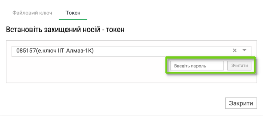

Після успішного зчитування з'являється інформація про ключ. Подивитися детальну інформацію можна натисканням на кнопку Детальніше:

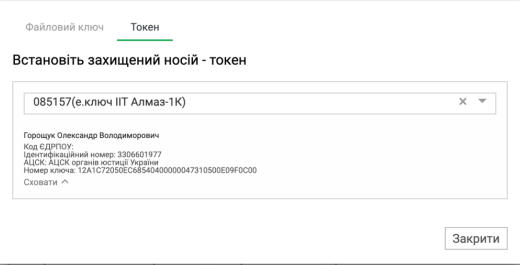

Підписання за допомогою токена
***********************************************
У пакеті вибираємо документ і натискаємо на значок олівця для його підписання, відкривається вікно підписання. Переходимо на вкладку Токен. Так як він вже зчитаний, інформація про ключі відображається, кнопка Підписати активна:

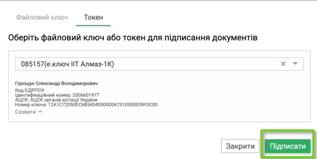

За фактом підписання, відобразиться *Звіт про підписання документів*, де вказано назву документу та кількість підписів, та сам результат підписання, а також підсумок про кількість успішно підписаних документів по відношенню до загальної кількості документів, відправлених на підписання (якщо ви скористалися масовим підписанням). 

У разі неуспішного підписання також відобразиться *Звіт про підписання документів*, де вказано результат підписання "Помилка", а також з'явиться інформаційне вікно де вказано причину помилки, наприклад: *Підпис вже використовується*.

Підписання шифрованих документів
********************************
Якщо при підписанні (натискання на іконку *олівця* біля документа), у документа встановлено шифрування, його слід розшифрувати. З'явиться відповідне вікно, переходимо на вкладку Токен та натискаємо **Розшифрувати**:

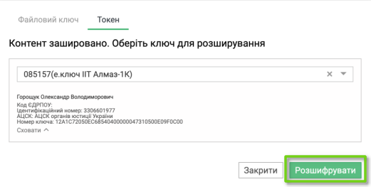

Після натискання на кнопку **Розшифрувати** відобразиться вікно підписання, а потім - звіт про підписання (як при звичайному підписанні).

При натисканні на кнопку **+Додати** в документі, у якого встановлено шифрування, відобразиться відповідне вікно підписання. При переході на вкладку Токен - інформація, що документ потребує шифрування:

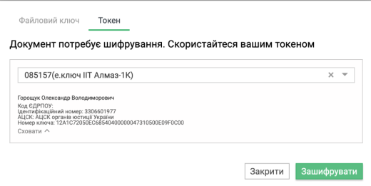

Після натискання на кнопку Зашифрувати, відобразиться вікно завантаження файлу. У разі, якщо шифрування у документа не встановлено, відразу після натискання на кнопку Додати відобразиться вікно завантаження файлу:

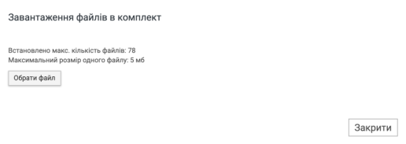

Після натискання на кнопку вибору файлу і, відповідно, вибору файлу,  у вікні відобразиться його назва та формат, та є можливість його видалити натисканням на корзинку:

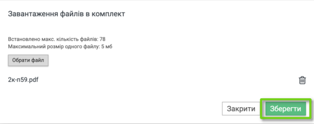

Після натискання кнопки **Зберегти**:

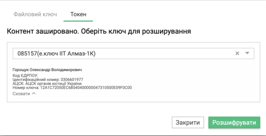

Підписання в Завданнях
***********************************************

При натисканні на кнопку Підписати в завданні, або в списку завдань, відобразиться вікно підписання. При переході на вкладку Токен:

Підписання при створенні або підтвердженні компанії
****************************************************
У розділі "Налаштування компанії"-> "Мої компанії" натискаємо кнопку **Створити** і переходимо на вкладку Токен. Кнопка Створити неактивна, поки не налаштовано Токен (або КЕП/ЕЦП) та не відмічена галочка "Згоден з умовами договору оферти":

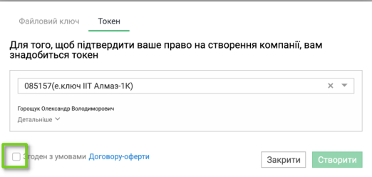

Після налатування токена та встановлення галочки кнопка стає активною, та з'являється можливість створити компанію.

.. admonition::  Зверніть увагу!

   Більше неможливо створення компанії без ЕЦП / Токена, але якщо ви колись створили компанію без ЕЦП / Токена -  вам необхідно їх підтвердити.
   
У вже створеній раніше компанії, якщо ви створювали її без ЕЦП або Токена, вам потрібно підтвердити компанію. При натисканні на кнопку **Підтвердити з ЕЦП / КЕП**, відкривається вікно, переходимо на вкладку Токен. Якщо токен не прочитано, його потрібно вибрати в списку, що випадає, ввести пароль і натиснути на кнопку Зчитати.

Якщо / коли токен зчитано, відображається інформація про ключі. Залишається тільки погодитися з умовами оферти і натиснути на кнопку Підтвердити:

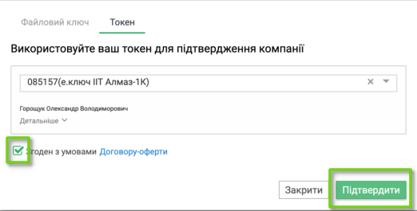

З використанням апаратного ключа не потрібно проводити жодних налаштувань КЕП/ЕЦП!

.. include:: kontakti.rst
