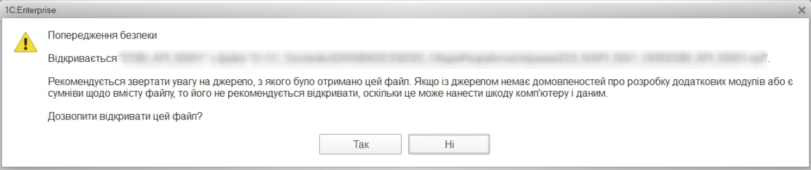
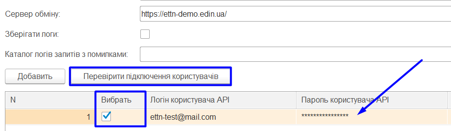
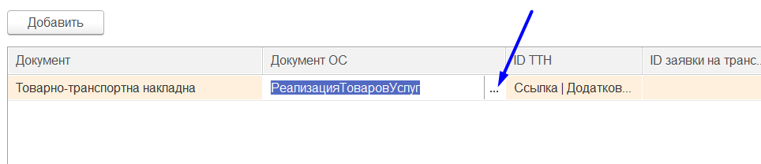
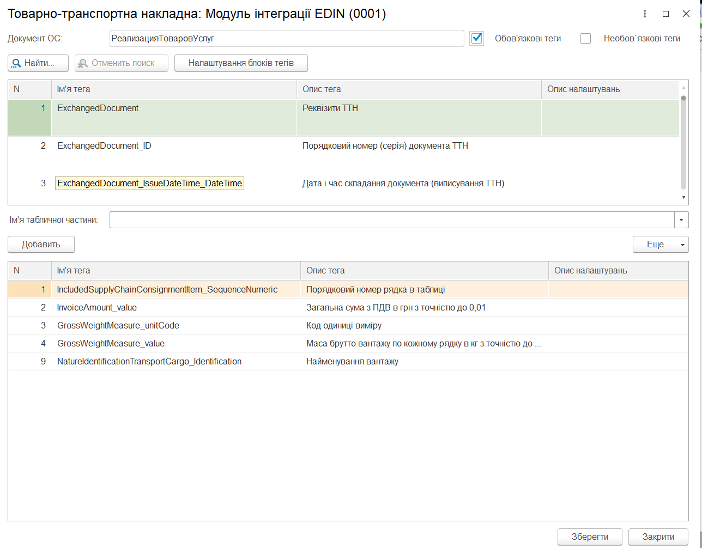
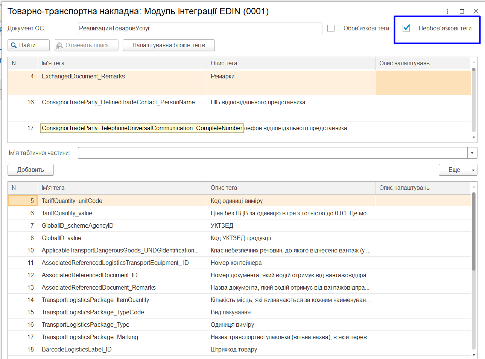
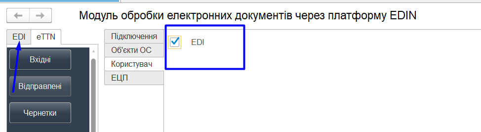

#################################################################################
Інструкція з налаштування "ERP Connector PRO"
#################################################################################

.. матеріал взято з operator_instruction

.. role:: underline

.. contents:: Зміст:
   :depth: 6

---------

Скорочення:

ОС - облікова система

ЕЦП - електронно-цифровий підпис/печатка

GLN - (Global Location Number) глобальний номер місцезнаходження

НКІ - носій конфіденційної інформації

---------

1 Запуск і налаштування "ERP Connector PRO"
===============================================================

Комп’ютерна програма "ERP Connector PRO" дозволяє працювати з обліковими системами 1С | BAS: Підприємство 8.Х, платформа 8.3.11 та вище, на звичайних та керованих формах (надалі 1С | BAS) на базі операційної системи Windows.

.. note::
   
   Список типових конфігурацій в підтримці конектора:

   * Конфігурації на керованих формах:
   * BAS ERP 2.1
   * BAS ERP 2.5
   * BAS Бухгалтерія
   * BAS КУП
   * BAS Small Company - можлививий не повний функціонал
   * Бухгалтерія 2.0 - потребує додаткового аналізу перед встановленням.
   * Керування невеликою фірмою (Керування нашою фірмою) (УНФ 1.6) - Аналіз конкретної версії, тільки з доопрацюваннями

   Конфігурації на звичайних формах:

   * Управління торговим підприємством (УТП)
   * Управління виробничим підприємством(УПП)
   * Управління торгівлею 2.3 (УТ 2.3)
   * Бухгалтерія 1.2 - частковий функціонал, потрібен аналіз і доопрацювання.

Підтримка нестандартних, змінених та застарілих конфігурацій здійснюється через додаткові доопрацювання.

Для роботи з "ERP Connector PRO" у користувача повинна бути підключена послуга для роботи з API. Для роботи з програмою користувачеві надаються логін та пароль:

- **email** - логін користувача;
- **password** - пароль користувача.

Для запуску "ERP Connector PRO" необхідно в обліковій системі 1С | BAS відкрити файл запуску програми (передається користувачеві співробітниками EDIN):

.. important:: У користувача повинні бути повні права на каталог, в якому знаходиться файл програми

.. note:: Для 1С | BAS на керованих формах не потрібні права на каталог, в якому знаходиться обробка

При підключенні "ERP Connector PRO" облікова система 1С | BAS може вимагати від користувача дозвіл на виконання операцій з боку програми (захист від небезпечних дій).

При першому запуску (відсутній **config.txt**) автоматично відкривається розділ **"Налаштування"** для введення всіх необхідних даних (надалі при запуску відкривається розділ "Вхідні"). У каталозі, в якому розташований файл програми, автоматично створюються:

1) файл основних налаштувань **Config.txt**;
2) каталог з назвою поточного користувача 1С | BAS, в якому створюється файл налаштувань користувача **UserSettings.txt** 

.. note:: 
   Налаштування для 1С | BAS на керованих формах зберігаються у типовому довіднику 1С | BAS "Файли". Загальні налаштування зберігаються у елементі довіднику з назвою "EDIN_config", налаштування користувача зберігаються у елементі довідника із назвою "EDIN_UserSettings" + Назва користувача інформаційної бази. При першому запуску (відсутній елемент довідника "Файли" з назвою "EDIN_config" ) автоматично відкривається розділ **"Налаштування"** для введення всіх необхідних даних (надалі при запуску відкривається розділ **"Вхідні"**).

Налаштування "EDI" та "ETTN" блоків відрізняються і описані в різних підрозділах даної інструкції.

2 Налаштування "EDI" блоку
===============================================================

Розділ містить 4 вкладки:

- **"Підключення"**
- **"Об'єкти 1С | BAS"**
- **"Користувач"**
- **"ЕЦП"**

2.1 "Підключення"
------------------------

При переході до вкладки доступні рядки для вводу даних:

 * **Основний каталог** – для введення місця розташування файлу програми.
 * **Каталог для збереження документів** – для введення місця розташування документів.
 * **Сервер обміну** – для введення адреси платформи електронного документообігу (на цю адресу будуть надсилатись запити).
 * **Зберігати логи** – при встановленій відмітці зберігається логи.

У цій вкладці додаються (кнопка **"Додати"**) користувачі, для кожного вказуються свої **Логін (email) / Пароль**:

У цій вкладці також здійснюється вибір користувачів, від імені яких будуть здійснюватися подальші дії, наприклад, запити на відображення Вхідних / Вихідних документів.

Налаштування користувачів зберігаються в файлі **UserSettings**, який розміщується в підкаталозі (найменування = <користувач 1С | BAS>) на одному рівні з файлом запуску "ERP Connector PRO".

.. note:: 
   Налаштування користувачів для 1С | BAS на керованих формах зберігаються у типовому довіднику 1С | BAS "Файли" у елементі довідника із назвою "EDIN_UserSettings" + Назва користувача інформаційної бази. 

Після того, як дані користувачів були введені можливо здійснити перевірку (кнопка **"Перевірити підключення користувачів"**) введених даних (за обраними користувачам, тобто у рядках яких встановлено відмітки в колонці "Вибрати"). В результаті перевірки отриманий токен свідчить про коректно заповнені дані, пройдену авторизацію.

2.2 Об'єкти 1С | BAS
------------------------

Для подальшої роботи необхідно провести синхронізацію "ERP Connector PRO" і 1С | BAS, а також здійснити налаштування збереження даних довідників і документів.

**Вид конфігурації** - поле заповнюється автоматично ("ERP Connector PRO" підставляє поточну версію конфігурації ОС 1С | BAS).

.. important::
   Подивитися версію своєї 1С | BAS: Меню -> Довідка -> Про програму:

   .. image:: pics_operator_instruction/operator_instruction_06.jpg
      :align: center

   У разі якщо облікова система 1С | BAS самописна або модифікована, то необхідно вибрати типову версію 1С | BAS, на підставі якої вона була написана/змінена. Неправильно обраний вид конфігурації може привести до проблем створення документів з 1С | BAS.

За допомогою функціональних кнопок зручно налаштовувати одноіменну категорію:

* **Мережі** - відкриває вікно переліку всіх доступних мереж. З цього переліку необхідно вибрати мережі (контрагентів) з якими користувач буде обмінюватися документами (вибір впливає на заповнення довідника **Контрагенти**).
* **Коди одиниць виміру** - одиниці виміру, які повинні бути внесені в 1С | BAS (вказувати коди одиниць виміру необхідно в формі, яка відкривається після натискання кнопки):

* **Номенклатура контрагентів** – налаштування об’єкта 1С | BAS, в якому зберігаються артикули і штрихкоди номенклатури контрагентів. В залежності від виду конфігурації назва колонки і відповідно об’єкт 1С | BAS можуть змінюватися. Для всіх конфігурацій на звичайних формах і для конфігурації "Бухгаглерія" на керованих формах використовується регістр відомостей «Номенклатура контрагентів». Для інших конфігурацій на керованих використовується довідник «Номенклатура постачальників».
* **Мережі з особливою схемою роботи** – налаштування для мереж, в яких GLN контрагента співпадає з GLN точки доставки, тому потрібно вказувати, в якому полі знаходиться GLN контрагента для відправки документів:

Після натискання на кнопку відкривається форма, для наповнення. Для відображення списку всіх доступних мереж потрібно натиснути кнопку **"Заповнити таблицю доступних мереж"**:

Далі у списку мереж потрібно відмітити ті, що будуть з Вами працювати і вказати роль мережі-контрагента у Вашому документообігу (поле документа, в якому буде автоматично зазначатись GLN обраного контрагента):

2.2.1 Налаштування довідників
~~~~~~~~~~~~~~~~~~~~~~~~~~~~~~~~~~~~~~~~

.. important:: Налаштування цього розділу рекомендовано виконувати, володіючи знаннями досвідченного користувача або спільно з розробником 1С | BAS.

Для постачальників доступні 3 основні типи довідників (**Організації**, **Контрагенти**, **Точки доставки**), в які в ОС 1С | BAS будуть зберігатися власні дані користувача, дані контрагентів і їх точки доставки відповідно:

У цьому розділі для кожного довідника проводяться налаштування "місця розташування" зберігання даних (**GLN** (обов'язково), **Формат НН**, **Ціни з бази 1С | BAS**...) всередині облікової системи 1С | BAS. Можливо заповнити всі табличні налаштування розділу **"Довідники"** за замовчуванням (кнопка **"Заповнити за замовчуванням"**) або зробити всі налаштування **вручну**.

.. note::
   При автоматичному заповненні за допомогою кнопки **"Заповнити за замовчуванням"** (рекомендований спосіб) обираються типові довідники конфігурації і тільки необхідні налаштування. Вибір розташування обмежений двома варіантами: "Додаткові відомості" і "Реквізити довідника". В залежності від конфігурації, в якій використовується програма, визначаються доступні варіанти. При доступності обох варіантів збереження перевага надається "Додатковим відомостям", оскільки вони не вносять зміни до вже існуючих довідників ОС користувача, а дозволяють зберігати дані окремо (незалежно від інших компонентів програми).
   
   При **ручному** налаштуванні в колонці "Довідник 1С | BAS" відображаються списки доступних довідників, а в полях налаштувань (через double-click по необхідному полю) відкривається окрема форма для заповнення налаштувань.

.. important:: У табличній частині налаштування **"Довідник 1С | BAS"** і **"GLN"** є обов'язковими до заповнення. 

Приклад заповнення табличної частини налаштувань розділу **"Довідники"**:

В довідники **Організації**, **Контрагенти**, **Точки доставки** дані можуть підтягуватись автоматично (перегляд/редагування через double-click). **Організації** наповнюються по користувацькому логіну (після успішної авторизації):

В довіднику **Контрагенти** відображаються юридичні особи і точки доставки контрагентів, для яких можливо вказати додаткові налаштування:

Довідник **Точки доставки** відрізняється від останнього наповненням колонок, відповідно до вимог EDI документообігу.

Відмітка **"Точки доставки віртуально"** призначена для тих коритувачів, що не ведуть точки доставки в базі 1С | BAS. Поставлена відмітка прибирає з налаштувань довідників налаштування за точками доставки. Створення документів та їх відправка буде використовувати ті точки доставки, які надаються "ERP Connector PRO".

.. _doc-settings:

2.2.2 Налаштування документів
~~~~~~~~~~~~~~~~~~~~~~~~~~~~~~~~~~~~~~~~

.. important:: Налаштування цього розділу рекомендовано виконувати, володіючи знаннями досвідченного користувача або спільно з розробником 1С | BAS.

У цьому розділі для кожного типу документа проводяться налаштування "місця розташування" зберігання даних документів в ОС 1С | BAS. Налаштування також можливо проводити **За замовчуванням** (кнопка **"Заповнити за замовчуванням"**) та **вручну** через double-click.

.. note::
   При автоматичному заповненні за допомогою кнопки **"Заповнити за замовчуванням"** (рекомендований спосіб) обираються типові документи конфігурації і тільки необхідні налаштування. Вибір розташування обмежений двома варіантами: "Додаткові відомості" і "Реквізити довідника". В залежності від конфігурації, в якій використовується програма, визначаються доступні варіанти. При доступності обох варіантів збереження перевага надається "Додатковим відомостям", оскільки вони не вносять зміни до вже існуючих довідників ОС користувача, а дозволяють зберігати дані окремо (незалежно від інших компонентів програми).
   
   При **ручному** налаштуванні в колонці "Документ 1С | BAS" відображаються списки доступних документів, а в полях налаштувань (через double-click по необхідному полю) відкривається окрема форма для заповнення налаштувань.

Створення документів в 1С | BAS залежить від виду конфігурації. **1С | BAS Бухгалтерія** на звичайних і керованих формах дозволяє створювати **"Рахунок на оплату покупця"**, **"Реалізація товарів і послуг"**. Інші 1С | BAS (НЕ БУХГАЛТЕРІЯ) на звичайних формах дозволяють створити "Замовлення покупця", "Реалізація товарів і послуг". В **1С | BAS Управління невеликою фірмою** і **Управління середнім бізнесом** на керованих формах можливо створити "Замовлення клієнта", "Видаткову накладну". Для **1С | BAS Управління торгівлею**,  **Управління підприємством**, **Управління виробничим підприємством** можливо створити **"Замовлення клієнта"** и **"Реалізація товарів і послуг"**:

.. _user:

2.3 Користувач
------------------------

Розділ в якому користувач може вибрати шлях локального сховища, в якому будуть зберігатися вхідні / вихідні ЮЗД документи, а також логи роботи "ERP Connector PRO" (аналіз документообігу). Поля **Склад** і **Підрозділ** також заповнюються для зручності користувача:

Проставлена відмітка в налаштуваннях **"Тестовий режим"** - додатково при відправці документа направляє його в розділ **"Чернетки"** (містить створені, але ще не відправлені документи) - такі налаштування дозволяють співробітнику (наприклад недосвідченому чи без ЕЦП) створювати документи, а безпосередньою перевіркою/відправкою вже займається бухгалтер/керівник чи інший відповідальний співробітник.

Також у даному розділі можливо зберігати налаштування користувача у файл для подальшого перенесення їх для іншого користувача:

Кнопка **"Зберегти налаштування"** відповідає за збереження налаштувань користувача у файли **config.txt** та **UserSettings.txt** у вибраному каталозі; вікно вибору каталогу відкривається після натискання на кнопку.

Кнопка **"Завантажити налаштування"** відповідає за завантаження вище зазначених файлів, для налаштування поточного користувача. Після натискання на кнопку, відкриється вікно вибору файлу.

.. attention::
   Файли налаштувань потрібно завантажувати по черзі. Перенесення налаштувань можливо здійснювати лише в межах однієї конфігурації та бази даних.

Проставлена відмітка в налаштуваннях **"Розширений режим для оператора"** додає на панель новий розділ **"Оператор"**. Дана кнопка відповідає за розширений режим роботи:

.. _etsp:

2.4 ЕЦП
------------------------

Розділ настройки електронно-цифрового підпису і печатки (ЕЦП), в якому зазначаються сертифікати ДФС (знаходяться у вільному доступі) і EDIN (надається співробітником компанії або за :download:`посиланням</_static/files/Certs/ats_stamp_crypt_EU-3FAA9288358EC00304000000C9C427007CB9D400.cer>`):

У таблицю через кнопку **"Додати"** можливо вности або шляхи до ключів бухгалтера і печатки для організацій, за якими планується вивантаження юридично значущих документів або вказати токен (НКІ). Якщо вказано шлях до файлу (ключа) і токену, то пріоритет надається файлу. Налаштування для токену (**"Тип пристрою"** та **"Пристрій"** (серійний номер часто вказується на фізичному носії)) можливо вибрати зі списку або скористатись автоматичним підбором налаштувань.

Також ключі можливо додавати окремо за підтипами документів, для цього потрібно **"Додати"** новий рядок налаштувань і заповнити відповідну колонку з підтипом документа і у випадаючому списку вибрати з переліку потрібний підтип. При цьому основний тип має бути порожнім:

Кнопка **"Заповнити за замовчуванням"** додає два порожні рядки для налаштування ключів для основних типів документів:

.. note::
   При використанні окремих ключів для підтипів документів налаштування основних типів документів завжди має бути заповнено. Тобто має бути окремо рядок для комерційних документів і окремо для податкових.

За підпис документів без використання ключа печатки відповідає відмітка **"Не використовувати печатку"**.

.. important:: Деякі оператори АЦСК розділяють розділяють ЕЦП на "ключ печатки" та "ключ печатки для шифрування". В такому випадку потрібно вносити в налаштування три ключа. "Ключ печатки для шифрування" використовується лише при відправці "Податкової накладної". 

При вивантаженні юридично значущих документів паролі можливо вносити або до таблиці, або "ERP Connector PRO" відобразить вікно для їх внесення перед початком підписання. Кнопка **"Перевірити ЕЦП"** дозволяє перевірити коректність введених даних ключів і паролів перед початком підписання. "ERP Connector PRO" дозволяє зберігати будь-яку кількість наборів ключів, але на момент підписання по одній організації і типу документа необхідно вибрати (встановити прапорець в колонці "Вибрати") тільки одну пару ключів.

При виявленні помилки при перевірці потрібно повторно ввести пароль:

.. image:: pics_operator_instruction/operator_instruction_15.jpg
   :align: center

При кожній перевірці ключа у вікні повідомлень відображається опис результату виконаної перевірки.

.. _cloud:

2.5 Підписання хмарним підписом
--------------------------------------------

Налаштування використання хмарного підпису аналогічні з використанням файлових ключів, але для того, щоб мати змогу підписувати документи хмарним підписом поля для заповнення файлових ключів мають бути пусті:

.. image:: pics_operator_instruction/operator_instruction_006.png
   :align: center

Далі в розділі «Підписант НКІ» потрібно вибрати тип токену підписанта:

Відкриється форма вибору типу ключа, в якій ми обираємо необхідний хмарний сервіс:

.. attention::
   Зверніть увагу, що використати хмарні сервіси з підписанням за допомогою QR-коду не є можливим!!!

.. image:: pics_operator_instruction/operator_instruction_008.png
   :align: center

Після вибору необхідного постачальника хмарного сервісу, в поле «Пароль підпису підписанта» потрібно ввести ідентифікатор підпису користувача:

3 Налаштування "ETTN" блоку
===============================================================

Для роботи з "ERP Connector PRO" у користувача повинна бути підключена послуга для роботи з API. Для роботи з програмою користувачеві надаються логін та пароль:

- **email** - логін користувача;
- **password** - пароль користувача на платформі EDIN 2.0.

Для запуску "ERP Connector PRO" необхідно в обліковій системі 1С | BAS відкрити файл запуску програми (передається користувачеві співробітниками EDIN):

.. image:: pics_prog_1C_eTTN_3_0_integration/prog_1C_eTTN_3_0_integration_001.png
   :align: center

.. important:: У користувача повинні бути повні права на каталог, в якому знаходиться файл програми

При підключенні "ERP Connector PRO" облікова система 1С | BAS може вимагати від користувача дозвіл на виконання операцій з боку програми (захист від небезпечних дій).

.. image:: pics_prog_1C_eTTN_3_0_integration/prog_1C_eTTN_3_0_integration_002.png
   :align: center

При першому запуску (відсутній **config.txt**) автоматично відкривається розділ **"Налаштування"** для введення всіх необхідних даних (надалі при запуску відкривається розділ **"Вхідні"**). У каталозі, в якому розташований файл програми, автоматично створюються файл основних налаштувань **Config.txt**.

3.1 Налаштування
--------------------------------------------

При першому запуску "ERP Connector PRO" автоматично відкривається розділ **"Налаштування"**:

Розділ містить 4 вкладки:

- **Підключення**
- **Об'єкти ОС**
- **Користувач**
- **ЕЦП**

3.1.1 Підключення
~~~~~~~~~~~~~~~~~~~~~~~~~~~~~~~~~~~~~~~~

**Основний каталог** – місце розташування файлу програми.

**Каталог архівів** – місце збереження архівів та файлів.

**Каталог вкладень** – місце збереження вкладень документів.

**Сервер обміну** – адреса платформи електронного документообігу (на цю адресу надсилаються запити "ERP Connector PRO").

**Зберігати логи** – при встановленій відмітці зберігається логи.

**Каталог логів запитів з помилками** – місце збереження запитів з помилками.

У цій вкладці додаються (зелена кругла кнопка "+") користувачі, для кожного вказуються свої **Логін користувача API/ Пароль користувача API (збігаються з даними для входу на платформу)**. У цій вкладці також здійснюється вибір користувачів, від імені яких будуть здійснюватися подальші дії, наприклад, запити на відображення Вхідних / Вихідних документів.  

.. note::
   Налаштування користувачів зберігаються в файлі **UserSettings**, який розміщується в підкаталозі (найменування = <користувач 1С | BAS>) на одному рівні з файлом запуску "ERP Connector PRO".

Після того, як дані користувачів були введені можливо здійснити перевірку (кнопка **"Перевірити підключення користувачів"**) введених даних (по користувачам, у рядках яких встановлено відмітки в колонці "Вибрати"). В результаті перевірки отриманий **Токен** свідчить про коректно заповнені дані, пройдену авторизацію на платформі електронного документообігу. Також "ERP Connector PRO" відображає статусні повідомлення про успішність чи помилки, що можуть виникнути у користувача при роботі з програмою.

3.1.2 Об'єкти ОС
~~~~~~~~~~~~~~~~~~~~~~~~~~~~~~~~~~~~~~~~

Для подальшої роботи з електронним документообігом необхідно провести синхронізацію "ERP Connector PRO" і ОС. Для виконання первинних налаштувань необхідно натиснути кнопку **«Заповнити за замовчуванням»**. Дані налаштування можливо відкоригувати у подальшому за необхідності.

За допомогою кнопки **«Контрагенти»** та пошуку необхідно додати контрагентів з якими планується обмін у сервісі ETTN:

.. image:: pics_prog_1C_eTTN_3_0_integration/prog_1C_eTTN_3_0_integration_006.png
   :align: center

Потім необхідно встановити співвідношення довідників EDI з даними в 1С. Для прикладу: у довіднику «Організації» необхідно вказати вашу організацію в 1С (інші довідники заповнюються за необхідності аналогічним чином): 

.. image:: pics_prog_1C_eTTN_3_0_integration/prog_1C_eTTN_3_0_integration_007.png
   :align: center

З випадаючого списку обрати необхідну організацію:

Наступним кроком  необхідно додати та обрати електронні документи сервісу EDIN «ETTN», якими буде здійснюватись в подальшому електронний документообіг (колонка «Документ»):

.. image:: pics_prog_1C_eTTN_3_0_integration/prog_1C_eTTN_3_0_integration_009.png
   :align: center

Далі потрібно для кожного електроного документу обрати документ облікової системи (на підставі цього документа можливо буде створювати електронний документообіг) - колонка «Документ ОС»:

В колонках **ID документа**, **ID заявки на транспортування**, **Hash заявки на транспортування**, **ID акта приймання-передачі** вказуються налаштування місцерозташування **uuid та hash**, які записуються у вказане поле системою автоматично. Обов’язкові для заповнення тільки налаштування тих документів, які будуть використовуватися в роботі.

Приклад заповнення **ID документа**:

.. image:: pics_prog_1C_eTTN_3_0_integration/prog_1C_eTTN_3_0_integration_011.png
   :align: center

А в колонці «Сторона документообігу» обирається роль учасника документообігу, що дозволяє для кожної ролі вказувати різні налаштування для документів.

В колонці "EDIN Налаштування документу" вказуються загальні налаштування документів (маппінг для формування електронного документу з даних документів ОС). Для того аби відкрити форму налаштувань потрібно натиснути на кнопку **"..."**:

Відкрита форма налаштувань відповідності даних документа містить специфікацію тіла обраного електронного документа а також його табличної частини:

Для кожного із представлених тегів (полей) специфікації документу можливо обрати реквізити для заповнення: для цього потрібно обрати потрібний тег та в колонці "Опис налаштування" натиснути на кнопку **"..."**:

.. image:: pics_prog_1C_eTTN_3_0_integration/prog_1C_eTTN_3_0_integration_014.png
   :align: center

Після чого відкриється форма налаштувань відповідності даних електронного документу, в якій можливо обрати реквізит документа ОС для заповнення обраного тега електронного документу (кнопка **"..."**):

.. image:: pics_prog_1C_eTTN_3_0_integration/prog_1C_eTTN_3_0_integration_015.png
   :align: center

На формі в обраному реквізиті (умовно "1") можливо обрати підлеглий до нього інший реквізит (умовно "1.1"). Цю операцію вибору підлеглого реквізиту, що відноситься до вже обраного можливо продовжити ("1.1"->"1.1.1"->"1.1.1.6"->"1.1.1.6.4"->"1.1.1.6.4.2" ...) за допомогою кнопки:

Після вибору реквізиту стане доступним для редагування "Спосіб пошуку значення":

.. image:: pics_prog_1C_eTTN_3_0_integration/prog_1C_eTTN_3_0_integration_017.png
   :align: center

"Спосіб пошуку значення" = "По значенню" свідчить, що для заповнення тегу електронного документа буде обрано значення реквізиту документу ОС. І для даного значення реквізиту, що наведений на зображенні вище не доступні "Додаткові властивості ОС". "Спосіб пошуку значень" = "Додаткові властивості ОС", які використовуються, коли потрібно обрати значення, що не зберігаються безпосередньо в об'єкті 1С | BAS. Після чого можливо обрати назву додаткової відомості:

В формі налаштувань відповідності даних документа в специфікації тіла обраного електронного документа окрім типових тегів містяться й нетипові (додаткові), які відрізняються тим, що дозволяють налаштувати, наприклад, математичні операції та їх використання для автоматичного заповнення тегів електронного документа:

Для додавання додаткових блоків тегів в документ та опис їхніх налаштувань потрібно використовувати додаткове меню, яке відкривається натисканням кнопки **"Налаштування блоків тегів"**:

Далі потрібно галочками відмітити необхідні блоки, натиснути **"ОК"** і вибрані блоки з’являться в списку налаштувань:

Також на формі налаштування блоків тегів є вкладка **"Налаштування розрахунків"**:

В даній вкладці ми можемо включити розрахунок ПДВ в рядку документа реалізація товарів та послуг - чекер «Сума включає ПДВ» документа реалізації. Активний чекер **"Додаткова таблична частина"** дозволяє налаштувати теги додаткової табличної частини, з якої теж потрібно вивантажувати в ТТН дані за позиціями, які транспортуються окремо від основної табличної частини документа-підстави:

3.1.3 Користувач
~~~~~~~~~~~~~~~~~~~~~~~~~~~~~~~~~~~~~~~~

В даному розділі виконується налаштуванння сервісів для використання. Для того, щоб ввімкнути частину "ERP Connector PRO" для роботи з EDI документами (сервіс EDI Network) необхідно відмітити чекером відповідний реквізит:

Після цього в програмі активується вкладка для роботи з сервісом EDI:

Також в цьому розділі є налаштування для масової обробки чернеток при підписані хмарними підписами (eТТН, "Заявка на транспортування"):

Після встановлення данного чекера **"Масова обробка чернеток (хмарний підпис)"** в розділі ЕЦП з’являється додаткова вкладка з налаштуваннями (детальний опис див. розділ ЕЦП):

3.1.4 ЕЦП
~~~~~~~~~~~~~~~~~~~~~~~~~~~~~~~~~~~~~~~~

Розділ налаштувань електронно-цифрового підпису і печатки (ЕЦП).

.. image:: pics_prog_1C_eTTN_3_0_integration/prog_1C_eTTN_3_0_integration_022.png
   :align: center

У таблицю через кнопку **"+"** можливо додати або шляхи до ключів підписанта, якими будуть підписуватись юридично значимі документи або вказати токен (НКІ). Якщо вказано шлях до файлу (ключа) і токену, то пріоритет надається файлу. Налаштування для токену ("Тип пристрою" та "Пристрій" (серійний номер часто вказується на фізичному носії)) можливо вибрати зі списку або скористатись автоматичним підбором налаштувань.

При вивантаженні юридично значимих документів паролі можна вносити або до таблиці, або обробка відобразить вікно для їх внесення перед початком підписання. Кнопка **"Перевірити ЕЦП"** дозволяє перевірити коректність введених даних ключів і паролів перед початком підписання. 

"ERP Connector PRO" дозволяє зберігати будь-яку кількість наборів ключів, але на момент підписання по одній організації і типу документу необхідно вибрати (встановити прапорець в колонці "Вибрати") тільки одну пару ключів.

При виявленні помилки при перевірці програма попросить повторно ввести пароль:

При кожній перевірці ключа у вікні повідомлень відображається опис результату виконаної перевірки:

.. image:: pics_prog_1C_eTTN_3_0_integration/prog_1C_eTTN_3_0_integration_024.png
   :align: center

3.1.4.1 Хмарний підпис
***************************************

Налаштування хмарного підпису виконуються аналогічно налаштування файлових ключів, але для підписання документів хмарним підписом поля для заповнення файлових ключів мають бути порожні!

Далі в розділі "Підписант НКІ" потрібно обрати тип токену підписанта:

.. image:: pics_operator_instruction/operator_instruction_017.png
   :align: center

Відкриється форма вибору типу ключа, в якій потрібно обрати бажаний хмарний сервіс.

.. attention::
   Зверніть увагу, що використати хмарні сервіси з підписанням за допомогою QR-коду не є можливим!!!

Після вибору необхідного постачальника хмарного сервісу в поле "Пароль підпису підписанта" потрібно ввести ідентифікатор підпису користувача:

.. image:: pics_operator_instruction/operator_instruction_019.png
   :align: center

3.1.4.2 Масова обробка чернеток
***************************************

Для "Налаштування масового підпису чернеток" потрібно вибрати сервер підпису та вказати ідентифікатор підписанта:

4 Додатково
===============================================================

`Опис конфігураційного файлу Config.txt <https://wiki.edin.ua/uk/latest/ERP_Connector_PRO/Instructions/config_description.html>`__.

`Опис файлу користувацьких налаштувань UserSettings.txt <https://wiki.edin.ua/uk/latest/ERP_Connector_PRO/Instructions/UserSettings_description.html>`__.

-------------------------------------

.. include:: /_constant/kontakti.rst
