"Акт виконаних робіт" на підставі ЕТТН (створення, підписання, відправлення та відхилення) 
#################################################################################################################################

.. role:: red

.. role:: green

.. role:: underline

.. сюда закину немного картинок для текста

.. |фільтр| image:: pics_Create_act_at_accepted_work/Create_act_at_accepted_work_28n.png

.. |drop_pass| image:: signing/drop_pass.png

.. |del_key| image:: signing/del_key2.png

.. :underline:`"Чернетки" для ролі "Організатор"`

.. contents:: Зміст:
   :depth: 3

---------

При формуванні "Акта виконаних робіт" ініціатором документа виступає **"Перевізник"** (в сервісі ETTN передбачені 3 основні ролі учасників документообігу: **"Вантажовідправник"**, **"Перевізник"**, **"Вантажоотримувач"**). Обмін документом здійснюється між **"Перевізником"** та **"Вантажовідправником"**

:green:`"Перевізник" -> "Вантажовідправник"`

.. important::
   Функціонал створення актів доступний для компанії з роллю **"Перевізника"** з "нуля" чи на підставі підписаного з трьох сторін ЕТТН (в статусі "Підписано перевізником" чи повторно "Очікує підписання водієм / перевізником"):

   .. image:: pics_Create_act_at_accepted_work/Create_act_at_accepted_work_34.png
      :align: center

**1 Створення "Акта виконаних робіт" на підставі ЕТТН ("Перевізник")**
==============================================================================

Для того аби створити "Акт виконаних робіт" потрібно перейти до каталогу **"Вхідні"** (1) та в розділі **"Додатковий пошук"** (2) скористатись |фільтр| фільтром **"Для актів виконаних робіт"** (3), що дозволяє відсортувати ЕТТН документи, на підставі яких може бути створений відповідний акт.

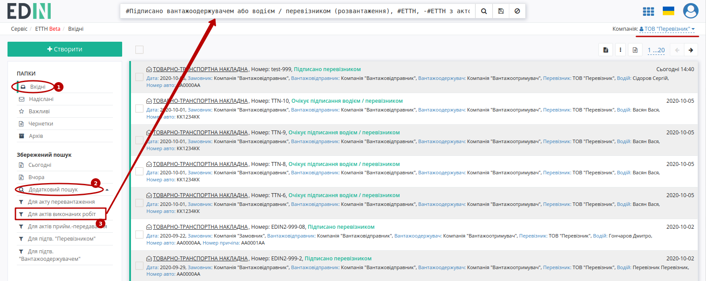

При створенні "Акта виконаних робіт" можливо вибрати 1 або кілька документів ЕТТН, на підставі яких він буде створений:

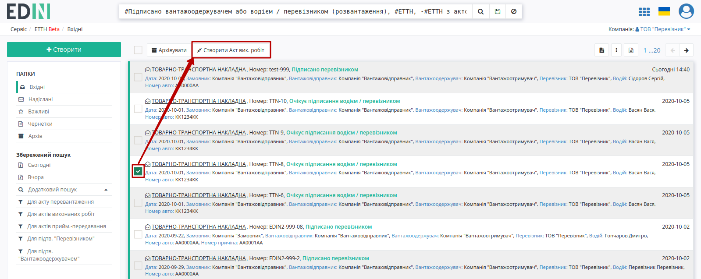

Далі необхідно заповнити форму "Акта виконаних робіт": 

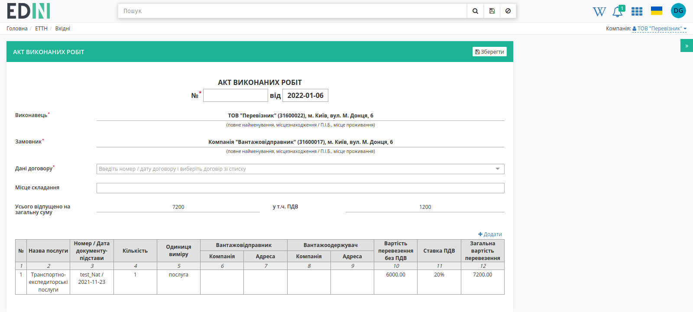

Поле "Дані договору" - номер/дата договору, на підставі якого створено документ (створити та переглянути всі договори можливо в розділі "Компанії" `"Особистого кабінету" <https://wiki.edin.ua/uk/latest/Personal_Cabinet/PCInstruction.html#company-contracts>`__). Якщо договорів кілька, то можливо обрати договір зі списку або створити **"+Новий договір"** прямо в цьому документі, якщо їх поки немає:

.. image:: pics_Create_act_at_accepted_work/Create_act_at_accepted_work_001.png
   :align: center

.. image:: pics_Create_act_at_accepted_work/Create_act_at_accepted_work_61.png
   :align: center

.. attention::
   При створенні документа шляхом `клонування <https://wiki.edin.ua/uk/latest/ETTN_2_0/Work_with_ETTN.html#doc-clone>`__ поле "Дані договору" заповнюється автоматично лише за наявності цього договору в `"Особистому кабінеті" <https://wiki.edin.ua/uk/latest/Personal_Cabinet/PCInstruction.html#company-contracts>`__.

Можливо **"Додати"** дані про новий вантаж або **"Змінити"** / **"Видалити"** дані, що автоматично підтягнулись з е-ТТН (документа-підстави):

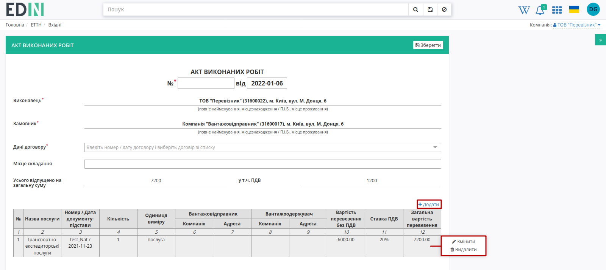

.. image:: pics_Create_act_at_accepted_work/Create_act_at_accepted_work_002.png
   :align: center

Після збереження чернетки (кнопка **"Зберегти"**) можливо додати супровідні документи на вантаж через кнопку **"Додати файл"**:

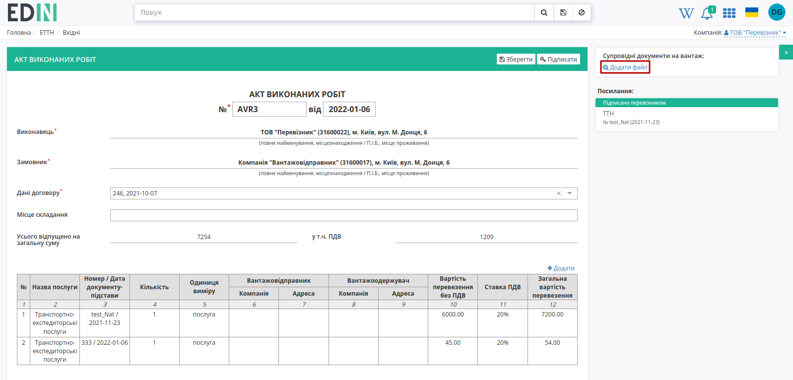

Для того щоб видалити доданий файл необхідно натиснути на іконку корзини. Для того щоб зберегти доданий файл необхідно натиснути на його назву. Після того, як обов'язкові поля документа (позначені червоною зірочкою :red:`*`) будуть заповнені документ за потреби можливо повторно **"Зберегти"** (1) та **"Підписати"** (2):

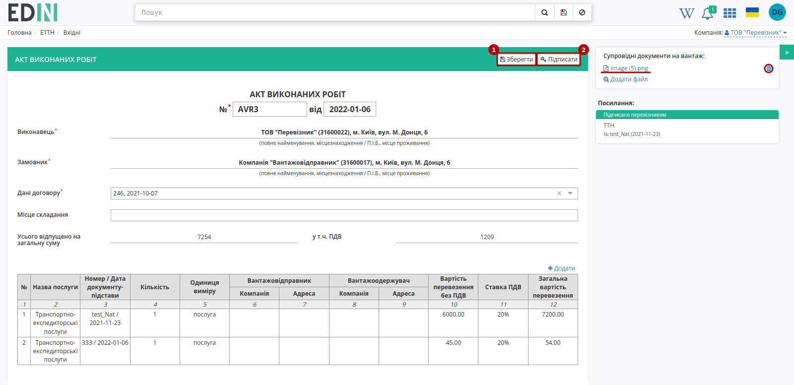

.. _sign:

**1.1 Підписання та відправка "Акта виконаних робіт" "Перевізником"**
----------------------------------------------------------------------------

.. загальне підписання на платформі

.. include:: /_constant/atb_check/atb_check.rst
   :start-after: .. початок блоку для ATB_check
   :end-before: .. кінець блоку для ATB_check

.. tabs::

   .. tab:: Файловий ключ

      .. include:: /_constant/signing/signing.rst
         :start-after: .. початок блоку для Signing
         :end-before: .. кінець блоку для Signing

   .. tab:: Token

      .. include:: /_constant/token_signing/token_signing.rst
         :start-after: .. початок блоку для TokenSign
         :end-before: .. кінець блоку для TokenSign

   .. tab:: Гряда

      .. include:: /_constant/gryada_signing/gryada_signing.rst
         :start-after: .. початок блоку для GryadaSign
         :end-before: .. кінець блоку для GryadaSign

   .. tab:: Cloud

      .. include:: /_constant/cloud_signing/cloud_signing.rst
         :start-after: .. початок блоку для CloudSign
         :end-before: .. кінець блоку для CloudSign

Після підписання "Акта виконаних робіт" інформація щодо підписанта відображається в блоці "Підписанти", а документ можливо **"Надіслати"**:

.. image:: pics_Create_act_at_accepted_work/Create_act_at_accepted_work_003.png
   :align: center

У **"Перевізника"** відправлений документ відображається у **"Надіслані"** зі статусом **"Очікує підписання замовником"**.

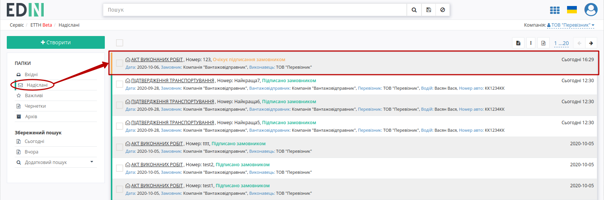

Відправлений "Акт виконаних робіт" має наступний вигляд:

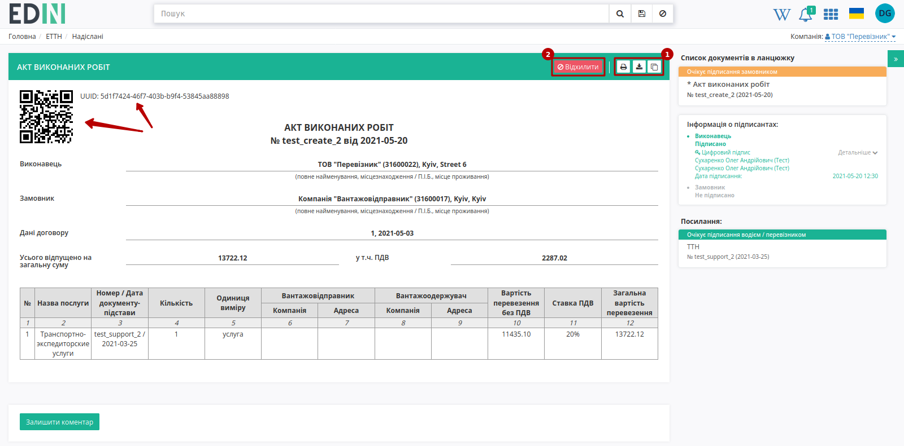

На формі "Акта виконаних робіт" у лівій верхній частині відображаються QR-код та унікальний ідентифікатор документа.

Користувач може скористатись функціоналом для "Друку", "Завантаження" чи "Клонування" (1); також у разі виявлення помилки в документі у **"Перевізника"** є можливість **"Відхилити"** (2) відправлений "Акт виконаних робіт" до підписання **"Вантажовідправником"**.

**1.2 Відхилення "Акта виконаних робіт" "Перевізником"**
----------------------------------------------------------------------------

Для того, щоб відхилити документ (доступно **до підписання "Вантажовідправником"**) потрібно натиснути **"Відхилити"**. 

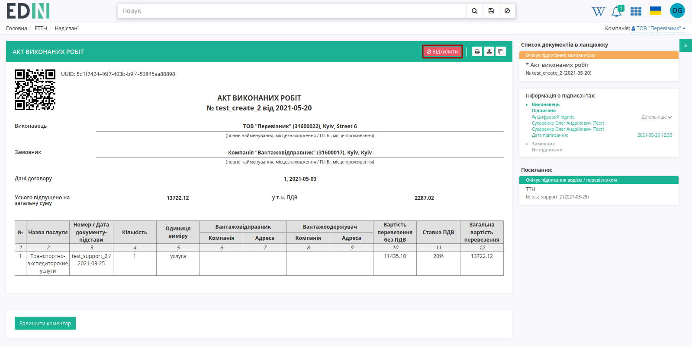

Після чого в модульному вікні обов'язково потрібно заповнити причину відміни документа:

.. image:: pics_Create_act_at_accepted_work/Create_act_at_accepted_work_20n.png
   :align: center

.. image:: pics_Create_act_at_accepted_work/Create_act_at_accepted_work_010.png
   :align: center

На платформі відображається повідомлення та змінюється статус документа в ланцюжку (**"Скасовано виконавцем"**).

.. hint::
   Якщо "Акт виконаних робіт" було відхилено однією зі сторін, то на основі однієї і тієї ж ТТН **"Перевізник"** може створити і відправити новий акт (в посиланнях до ТТН будуть відображатись всі прив'язані акти). 

**2 Отримання "Акта виконаних робіт" "Вантажовідправником"**
=================================================================================================================

Відправлений з боку **"Перевізника"** "Акт виконаних робіт" відображається в папці "Вхідні".

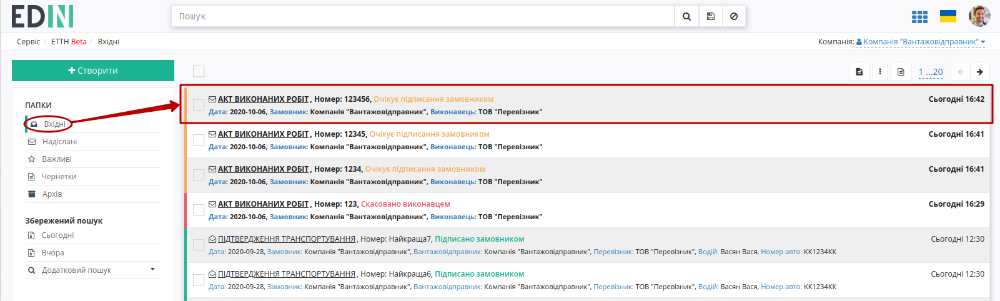

Вхідний підписаний документ можливо "Підписати" чи "Відхилити".

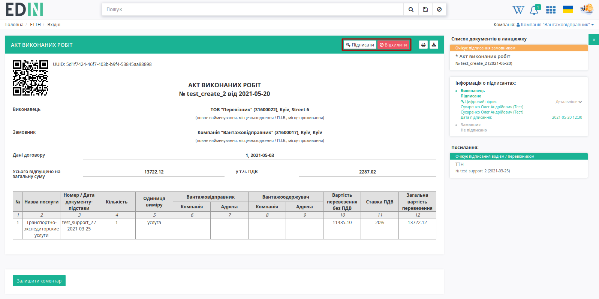

**2.1 Підписання "Акта виконаних робіт" "Вантажовідправником"**
----------------------------------------------------------------------------

**"Замовник"** акта ("Вантажовідправник" чи "Вантажоотримувач") може **"Підписати"** вхідний документ за допомогою одноіменної кнопки в формі документа:

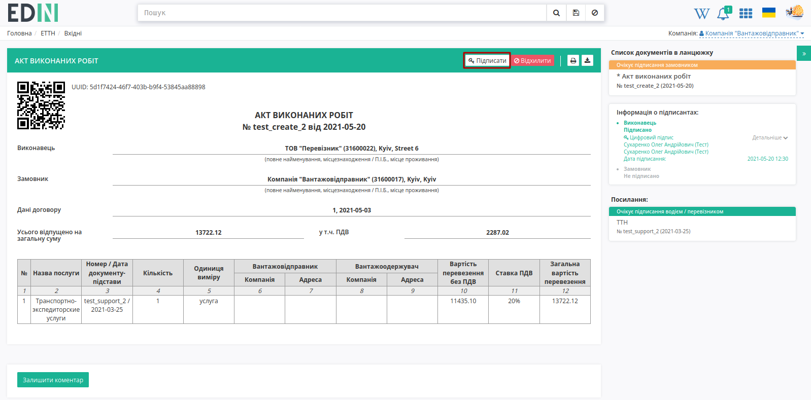

Або **масово** підписати одразу кілька вхідних "Актів виконаних робіт" в журналі документів (детальніше про `Масове підписання "Актів виконаних робіт" <https://wiki.edin.ua/uk/latest/ETTN_2_0/Create_act_at_accepted_work.html#mass-sign>`__).

.. hint::
    Процес підписання **"Перевізником"** не відрізняється від підписання **"Вантажовідправником"** та описаний в `розділі вище <https://wiki.edin.ua/uk/latest/ETTN_2_0/Create_act_at_accepted_work.html#sign>`__.

Після підписання документ змінює свій статус на **"Підписано замовником"** система повідомить про завершення документообігу інформаційним повідомленням в формі документу:

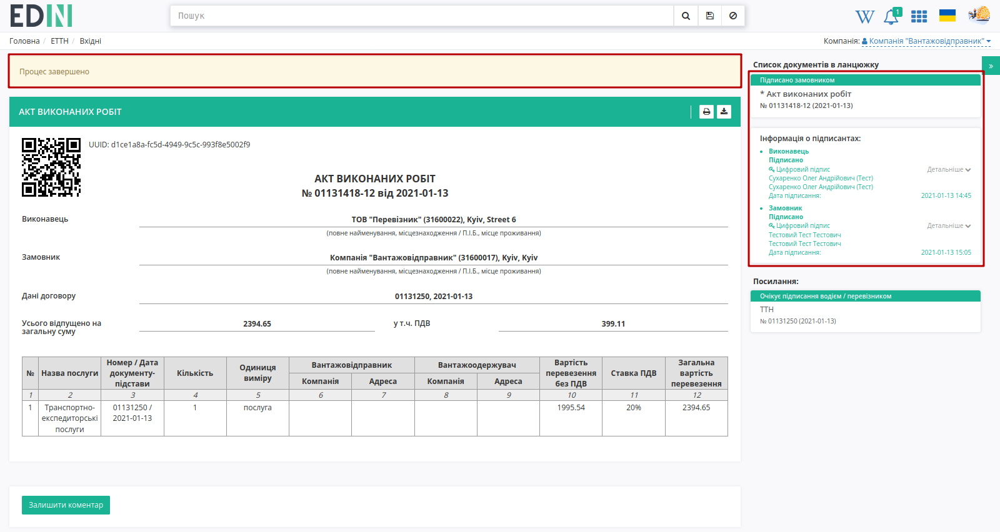

**2.2 Відхилення "Акта виконаних робіт" "Вантажовідправником"**
----------------------------------------------------------------------------

У **"Вантажовідправника"** є можливість відхилити "Акт виконаних робіт". Для цього потрібно натиснути на кнопку **"Відхилити"**. Після чого в модульному вікні обов'язково потрібно заповнити причину відміни документа:

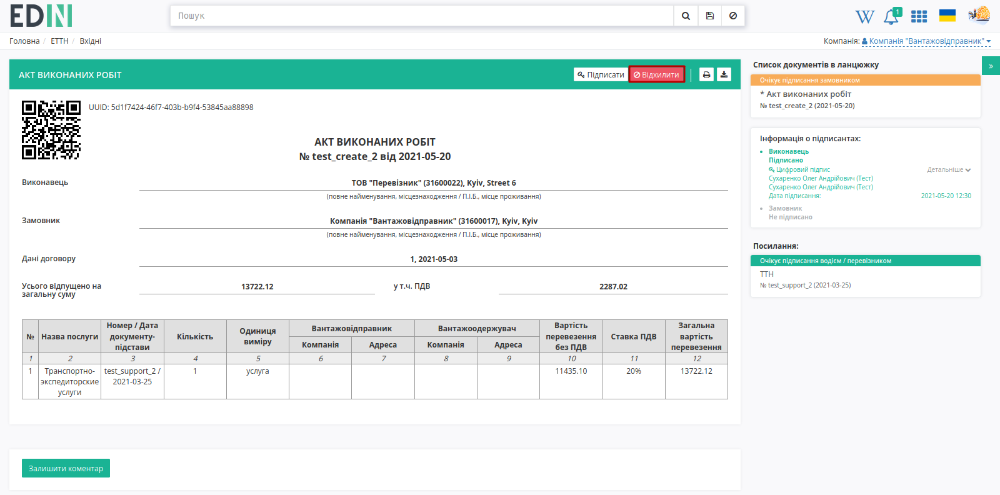

.. image:: pics_Create_act_at_accepted_work/Create_act_at_accepted_work_20n.png
   :align: center

Для відхиленого **"Вантажовідправником"** "Акта виконаних робіт" присвоєно статус "Відхилено".

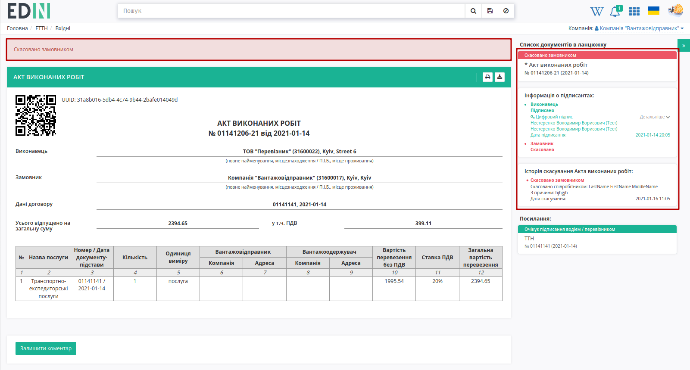

Документ з цим статусом відображається у "Вхідних" **"Вантажовідправника"** - документообіг завершено.

.. hint::
   Якщо "Акт виконаних робіт" було відхилено однією зі сторін, то на основі однієї і тієї ж ТТН **"Перевізник"** може створити і відправити новий акт (в посиланнях до ТТН будуть відображатись всі прив'язані акти). 

.. _additional-functionality:

**3 Додатковий функціонал**
==============================================================================

.. початок блоку для additional-functionality

Додатково в "Акті виконаних робіт" можливо налаштувати автоматичне підрахування цін за послугу **"Перевізника"**.

.. note::
   Налаштування здійснюються на стороні контрагента з роллю **"Вантажовідправника"**!

Для налаштування автоматичного підрахування цін за послугу **"Вантажовідправнику"** потрібно перейти в "Налаштування":

.. image:: pics_Create_act_at_accepted_work/Create_act_at_accepted_work_52.png
   :align: center

Далі серед своїх компаній (якщо їх кілька) обрати компанію, для якої потрібно налаштувати автоматичне підрахування цін за послугу **"Перевізника"**.

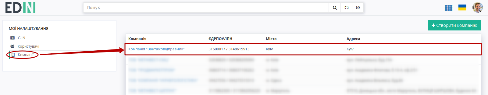

Обрати вкладку **"Тарифи"** та натиснути кнопку **"+Додати"**:

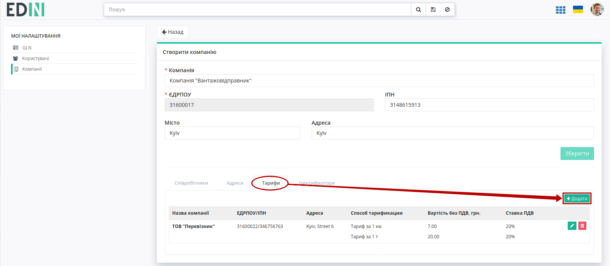

Обрати (за назвою чи ЄДРПОУ) компанію-**"Перевізника"**, яка вже зареєстрована на платформі EDIN (1) і встановити фіксований **"Спосіб тарифікації"** ("Тариф за 1 т" або "Тариф за 1 км"), вказавши при цьому вартість та ставку ПДВ (2). Згідно вказаного тарифу буде проводитись автоматичний підрахунок цін (лише для обраного **"Перевізника"**). Кнопка "Зберегти" (3) зберігає вказані налаштування. 

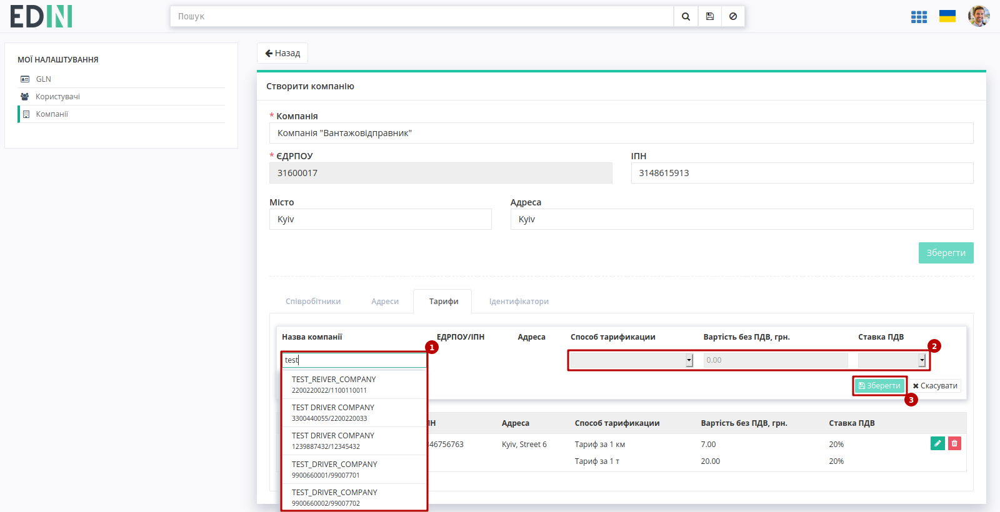

Для цього ж **"Перевізника"** додатково можливо додати ще один альтернативний спосіб тарифікації або відредагувати/видалити раніше введені налаштування:

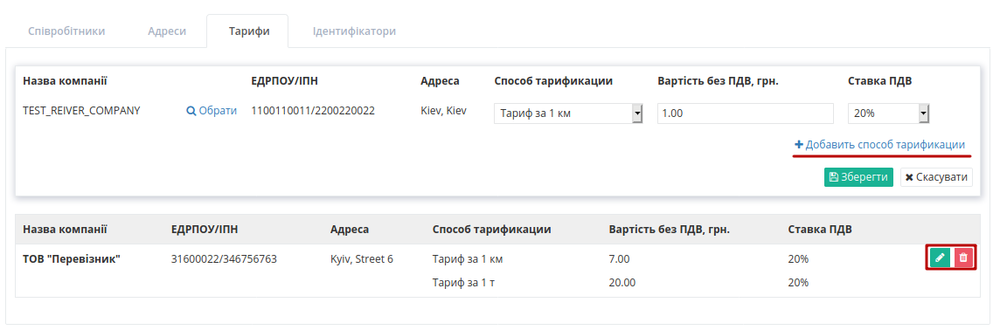

.. кінець блоку для additional-functionality

Тож при формуванні "Акта виконаних робіт" на підставі "е-ТТН" при заданих налаштуваннях в створюваному акті виконується автоматичний розрахунок вартості перевезення (тариф за 1 т):

.. image:: pics_Create_act_at_accepted_work/Create_act_at_accepted_work_59.png
   :align: center

.. _mass-sign:

**4 Масове підписання "Актів виконаних робіт"**
==============================================================================

.. початок блоку для mass-sign

.. attention::
   Лише **"Замовник"** акта ("Вантажовідправник" чи "Вантажоотримувач") може підписати одразу кілька вхідних "Актів виконаних робіт", що мають статус "Очікує підписання замовником".

Для масового підписання "Актів виконаних робіт" потрібно перейти до каталогу **"Вхідні"** (1) та в розділі **"Додатковий пошук"** (2) скористатись |фільтр| фільтром **"Для підписання Актів Виконаних робіт"** (3), що дозволяє відсортувати акти для масового підписання:

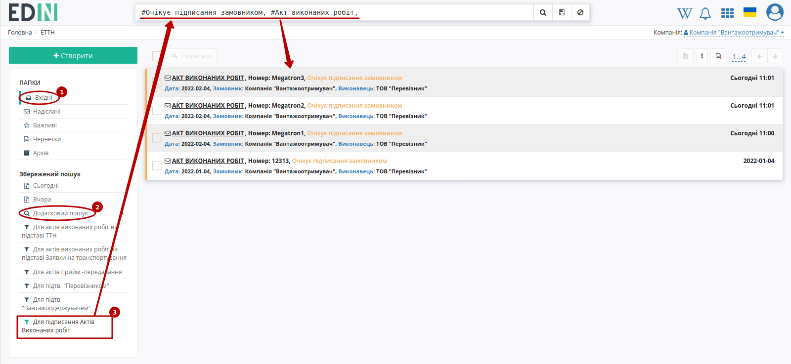

За такого підписання "Актів виконаних робіт" можливо вибрати 1 або кілька документів та натиснути **"Підписати"**:

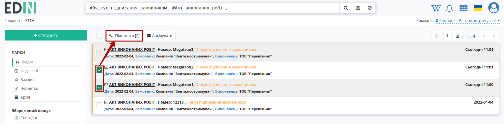

Далі відкривається стандартне модальне вікно для підписання (вибираємо необхідний ключ) - процес детально описаний в **розділі 1.1**. Після вибору ключа відкривається модальне вікно зі списком документів та їх статусом підписання:

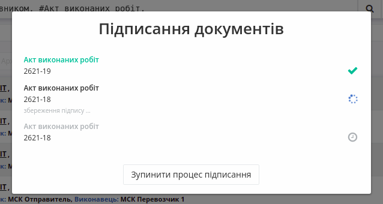

Є можливість зупинити операцію підписання документів за допомогою кнопки **"Зупинити процес підписання"**. Після завершення операції підписання по кожному докумену відображається статус операції: "успішно" або "помилка" та текст помилки:

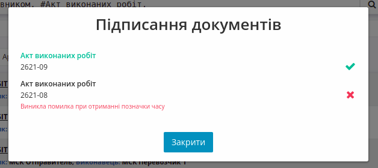

.. кінець блоку для mass-sign

---------------------------------

.. include:: /_constant/kontakti.rst