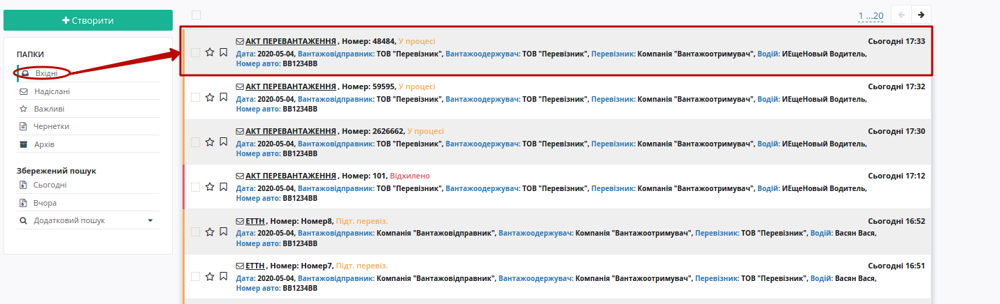

"Акт перевантаження" на підставі ЕТТН (створення, підписання, відправлення та відхилення)
###############################################################################################

.. role:: red

.. role:: green

.. role:: underline

.. сюда закину немного картинок для текста

.. |фільтр| image:: pics_Create_act_overload/Create_act_overload_33n.png

.. |drop_pass| image:: signing/drop_pass.png

.. :underline:`"Чернетки" для ролі "Організатор"`

.. contents:: Зміст:
   :depth: 6

---------

При формуванні "Акта перевантаження" ініціатором документа виступає **"Перевізник"** (в сервісі ETTN передбачені 3 основні ролі учасників документообігу: **"Вантажовідправник"**, **"Перевізник"**, **"Вантажоотримувач"**). Обмін документом здійснюється між компанією, що має роль **"Перевізника"** в схемах обміну ЕТТН та компанією, що відповідальна за "перевантаження" (фактично це може бути компанія з будь-якою роллю). Акт можливо створити на основі документу, що має статус "Підтверджено перевізником" чи "Підписано перевізником".

.. important::
    В одному документі одна і та ж компанія не може виступати в якості "Перевізника", "Вантажовідправника" та "Вантажоотримувача"!!!  

Зазвичай схема зводиться до обміну між двома компаніями:

:green:`"Перевізник" -> "Компанія, що здійснює перевантаження" -> "Перевізник"`

.. important::
    Функціонал створення актів доступний для компанії з роллю **"Перевізника"**

**1 Створення "Акта перевантаження" на підставі ЕТТН ("Перевізник")**
==============================================================================

Загальна схема документообігу з "Актом перевантаження":

.. image:: pics_Create_act_overload/Create_act_overload_02n.png
   :align: center

Для того аби створити "Акт перевантаження" потрібно перейти до каталогу **"Вхідні"** (1) та в розділі **"Додатковий пошук"** (2) скористатись |фільтр| фільтром **"Для акту перевантаження"** (3), що дозволяє відсортувати ЕТТН документи, на підставі яких може бути створений відповідний акт.

.. image:: pics_Create_act_overload/Create_act_overload_01n.png
   :align: center

При створенні "Акту перевантаження" можливо вибрати 1 або кілька документів (наприклад, ЕТТН), на підставі яких він буде створений:

Далі необхідно заповнити обов'язкові поля форми документа, що позначені червоною зірочкою :red:`*` (відомості про вантаж вже заповнені, їх теж можливо редагувати/додавати): 

Для автомобілів та причепів реалізований автоматичний довідник, в який записуються "Реєстраційний номер", "Марка/модель", "Тип". Тож, наприклад, для раніше введеного реєстрайійного номеру BB1234BB користувач може скористатись пошуком (мінімум 3 символи): ``BB1, B12, 123, 234, 34B, 4BB``

Також до "Акту перевантаження" можливо додати супровідні метеріали через кнопку **"Додати файл"** (назва файлу повинна бути унікальною). Для того щоб видалити доданий файл необхідно натиснути на іконку корзини.

Після усіх проведених змін документ необхідно **"Зберегти"** (1) та **"Підписати"** (2):

.. _sign:

**1.1 Підписання та відправка "Акта перевантаження" "Перевізником"**
================================================================================================

.. include:: /_constant/atb_check/atb_check.rst
   :start-after: .. початок блоку для ATB_check
   :end-before: .. кінець блоку для ATB_check

.. tabs::

   .. tab:: Файловий ключ

      .. include:: /_constant/signing/signing.rst
         :start-after: .. початок блоку для Signing
         :end-before: .. кінець блоку для Signing

   .. tab:: Token

      .. include:: /_constant/token_signing/token_signing.rst
         :start-after: .. початок блоку для TokenSign
         :end-before: .. кінець блоку для TokenSign

   .. tab:: Гряда

      .. include:: /_constant/gryada_signing/gryada_signing.rst
         :start-after: .. початок блоку для GryadaSign
         :end-before: .. кінець блоку для GryadaSign

   .. tab:: Cloud

      .. include:: /_constant/cloud_signing/cloud_signing.rst
         :start-after: .. початок блоку для CloudSign
         :end-before: .. кінець блоку для CloudSign

Після підписання "Акту про перевантаження" інформація щодо підписанта відображається в блоці "Підписанти", а документ можливо **"Надіслати"**:

Відправлений "Акт про перевантаження" відображається в "Надісланих":

та має наступний вигляд:

На формі "Акта про перевантаження" у лівій верхній частині відображаються QR-код та унікальний ідентифікатор документа.

Користувач може скористатись функціоналом для "Друку", "Завантаження" чи "Клонування"; також у разі виявлення помилки в документі у **"Перевізника"** є можливість відхилити відправлений "Акт перевантаження" **до підтвердження/підписання компанією, що здійснює перевантаження**. Для цього потрібно натиснути на кнопку "Відхилити".

**1.2 Відхилення "Акта перевантаження" "Перевізником"**
==============================================================================

Для того, щоб відхилити документ **"Перевізнику"** потрібно натиснути **"Відхилити"**. 

Після чого в модульному вікні обов'язково потрібно заповнити причину відміни документа:

.. image:: pics_Create_act_overload/Create_act_overload_27n.png
   :align: center

На платформі відображається повідомлення та змінюється статус документа в ланцюжку ("Відхилено"). Документообіг завершено.

**2 Отримання "Акта перевантаження" "Компанією, що здійснює перевантаження"**
=================================================================================================================

Відправлений з боку **"Перевізника"** "Акт перевантаження" відображається в папці "Вхідні".

Вхідний підписаний документ можливо "Підтвердити" та "Підписати" чи "Відхилити".

**2.1 Підтвердження / Підписання "Акта перевантаження" "Компанією, що здійснює перевантаження"**
===================================================================================================================

.. important::
    В залежності від внутрішньої схеми **"Компанії, що здійснює перевантаження"** документ перед "Підписанням" може бути "Підтверджений" водієм, (кнопка **"Підтвердити"**) і відповідно цей документ у вхідних змінить свій статус на "Підтверджений", підказка в документі:

Для підписання документу потрібно натиснути на кнопку **"Підписати"**:

.. hint::
    Процес підписання не відрізняється від підписання **"Перевізником"** та описаний в `розділі вище <https://wiki.edin.ua/uk/latest/ETTN_2_0/Create_act_overload.html#sign>`__ .

Після підписання документ змінить свій статус, а в інформації про підписантів відобразиться інформація про підписання:

Після підписання документу "Відхилити" його неможливо.

**2.2 Відхилення "Акта перевантаження" "Компанією, що здійснює перевантаження"**
==============================================================================

Для того, щоб відхилити документ потрібно натиснути **"Відхилити"**. 

Після чого в модульному вікні обов'язково потрібно заповнити причину відміни документа:

.. image:: pics_Create_act_overload/Create_act_overload_27n.png
   :align: center

На платформі відображається повідомлення та змінюється статус документа в ланцюжку ("Відхилено"). Документообіг завершено.

**3 Отримання "Акта перевантаження" "Перевізником"**
=================================================================================================================

Відправлений та підписаний "Акт перевантаження" у **"Перевізника"** відображається в папці "Надіслані".

Вхідний підписаний документ можливо "Підтвердити" та "Підписати" чи "Відхилити".

**3.1 Підтвердження / Підписання "Акта перевантаження" "Перевізником"**
===================================================================================================================

.. important::
    В залежності від внутрішньої схеми **"Перевізника"** документ перед "Підписанням" може бути "Підтверджений" приймальником, (кнопка **"Підтвердити"**) і відповідно цей документ у вхідних змінить свій статус на "Підтверджений", підказка в документі:

Для підписання документу потрібно натиснути на кнопку **"Підписати"**:

.. hint::
    Процес підписання не відрізняється від описаного раніше в `розділі вище <https://wiki.edin.ua/uk/latest/ETTN_2_0/Create_act_overload.html#sign>`__ .

Після підписання відображається інформативна підказка:

Документообіг завершено. При перегляді документу/-ів, на основі яких було створено "Акт перевантаження" відображається посилання про прив'язаний акт:

**3.2 Відхилення "Акта перевантаження" "Перевізником"**
=======================================================================================

Для того, щоб відхилити документ потрібно натиснути **"Відхилити"**.

Після чого в модульному вікні обов'язково потрібно заповнити причину відміни документа:

.. image:: pics_Create_act_overload/Create_act_overload_27n.png
   :align: center

На платформі відображається повідомлення та змінюється статус документа в ланцюжку ("Відхилено"). Документообіг завершено.

.. include:: kontakti.rst