Заявка на транспортування (Створення, підписання, відправлення та відхилення)
###################################################################################################

.. сюда закину немного картинок для текста

.. |drop_pass| image:: signing/drop_pass.png

.. |del_key| image:: signing/del_key2.png

.. role:: red

.. role:: green

.. role:: underline

.. contents:: Зміст:
   :depth: 3

---------

При формуванні документообігу "Заявка на транспортування" ініціатором документа виступає користувач з роллю **"Замовник"** (в сервісі ETTN передбачені 4 основні ролі учасників документообігу: **"Замовник"**, **"Вантажовідправник"**, **"Перевізник"**, **"Вантажоотримувач"**). Обмін документом здійснюється між **"Замовником"** та **"Перевізником"**:

:green:`"Замовник" -> "Перевізник"`

.. hint::
   При роботі з "Заявкою на транспортування" можливо організувати:

   1) Документообіг, в якому "Заявка на транспортування" пропонує перевезення між трьома компаніями-учасниками (1 **"Замовник"** - 1 **"Перевізник"** - 1 **"Вантажоотримувач"**) з пункту навантаження в пункт розвантаження (дві адреси).
   2) Документообіг, в якому "Заявка на транспортування" пропонує перевезення одразу з кількома **"Вантажоотримувачами"** (1 **"Замовник"** - 1 **"Перевізник"** - N **"Вантажоотримувачів"**) з відповідною кількістю пунктів навантаження та розвантаження (кілька адрес).

**1 Створення "Заявки на транспортування" "Замовником"**
================================================================================================

Для створення "Заявки на транспортування" на платформі **"Замовнику"** необхідно натиснути на кнопку "Створити".

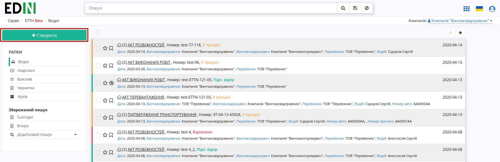

Після цього необхідно вибрати тип створюваного документа в модальному вікні:

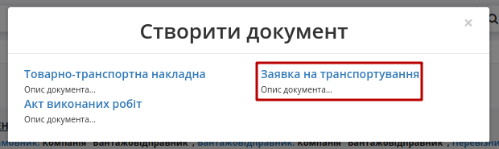

Далі необхідно заповнити форму "Заявка на транспортування" (кнопка "Зберегти" активується лише для заповненої форми).

В документі вказується:

* **Номер заявки на транспортування**;
* **Дата заявки на транспортування**;
* **Найменування вантажу** – вказується загальний характер вантажу;
* **Вид транспорту** – вказуються вимоги до виду транспорту;
* **Вид перевезень** (покілометровий тариф, погодинний тариф, відрядний тариф, централізоване перевезення, внутрішньоміське, приміське, міжміське, міжнародне перевезення);
* **Перевізник** – необхідно обрати з випадаючого списку (для цього в рядку необхідно ввести мінімум 3 символи найменування/П.І.Б. перевізника, після цього обрати його з випадаючого списку);
* **Замовник** – необхідно обрати з випадаючого списку (для цього в рядку необхідно ввести мінімум 3 символи найменування/П.І.Б. перевізника, після цього обрати його з випадаючого списку);
* **Вантажовідправник** – необхідно обрати з випадаючого списку (для цього в рядку необхідно ввести мінімум 3 символи найменування/П.І.Б. вантажовідправника, після цього обрати його з випадаючого списку), місцезнаходження/місце проживання буде додано автоматично;
* **Кількість місць** – вказуються вимоги до місткості грузового транспорту;
* **Температурні вимоги** – вказуються температурні вимоги до перевезення вантажу;
* **Масою брутто,т** – вказуються вимоги до вантажопідйомності грузового транспорту;
* **Вартість перевезення** – вказуються вимоги до вартості послуги перевезення;
* **Дані договору** – номер/дата договору, на підставі якого створено документ (створити та переглянути всі договори можливо в розділі "Компанії" `"Особистого кабінету" <https://wiki.edin.ua/uk/latest/Personal_Cabinet/PCInstruction.html#company-contracts>`__). Якщо договорів кілька, то можливо обрати договір зі списку або створити **"+Новий договір"** прямо в цьому документі, якщо їх поки немає:

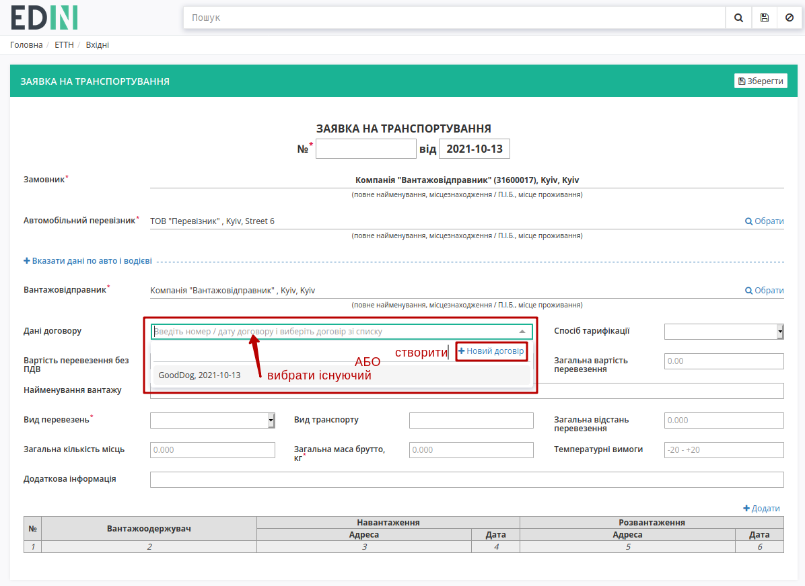

.. image:: pics_Creation_signing_ending_rejection_Proposal/Creation_signing_ending_rejection_Proposal_111n.png
   :align: center

.. attention::
   При створенні документа шляхом `клонування <https://wiki.edin.ua/uk/latest/ETTN_2_0/Work_with_ETTN.html#doc-clone>`__ поле "Дані договору" заповнюється автоматично лише за наявності цього договору в `"Особистому кабінеті" <https://wiki.edin.ua/uk/latest/Personal_Cabinet/PCInstruction.html#company-contracts>`__.

.. _tariffing-method:

.. important::
   Для прискорення створення "Акту виконаних робіт" Перевізником на підставі вихідного документа ("Заявка на транспортування", "Підтвердження транспортування", "ТТН") ми реалізували функціонал автоматичного розрахунку та/або передзаповнення даних вартості перевезення – для цього спочатку необхідно заповнити поле **"Спосіб тарифікації"**. Логіка розрахунку та/або передзаповнення даних вартості перевезення:
      - при виборі **"за кілометраж"**: Вартість перевезення без ПДВ = поле "Загальна відстань перевезення" (стає обов'язковим до заповнення) у "Заявці на транспортування"/"Підтвердження транспортування" * Тариф за 1 км без ПДВ (шлях для встановлення тарифу за 1 км: `Особистий кабінет/Налаштування/Компанії <https://edo-v2.edin.ua/app/#/service/personal/settings/agreements/company/list>`__/ вибір компанії/Тарифи:

         .. image:: ../Personal_Cabinet/pics_PCInstruction/PCInstruction_36.png
            :align: center

         ⠀⠀⠀⠀⠀⠀⠀⠀⠀

         .. image:: pics_Creation_signing_ending_rejection_Proposal/Creation_signing_ending_rejection_Proposal_91n.png
            :align: center

      - при виборі **"фіксована вартість"**: Вартість перевезення без ПДВ = Вартість перевезення без ПДВ у "Заявці на транспортування"/"Підтвердження транспортування". Поля "Вартість перевезення без ПДВ" та "Загальна вартість перевезення" стають обов'язковим до заповнення;
      - при виборі **"за тоннаж"**: Вартість перевезення без ПДВ = поле "Загальна маса брутто, кг" у "Заявці на транспортування"/"Підтвердження транспортування"/"ТТН" * Тариф за 1 кг без ПДВ (шлях для встановлення тарифу за 1 кг: `Особистий кабінет/Налаштування/Компанії <https://edo-v2.edin.ua/app/#/service/personal/settings/agreements/company/list>`__/ вибір компанії/Тарифи:

         .. image:: ../Personal_Cabinet/pics_PCInstruction/PCInstruction_36.png
            :align: center
         
         ⠀⠀⠀⠀⠀⠀⠀⠀⠀

         .. image:: pics_Creation_signing_ending_rejection_Proposal/Creation_signing_ending_rejection_Proposal_92n.png
            :align: center
   
   У "Замовника" є можливість *заборонити редагування вартості перевезення* [1]_ в "Актах виконаних робіт".

.. important::
   Вибір організації-перевізника, адрес навантаження/розвантаження доступні з випадаючого списку або при ручному додаванні! Якщо **Перевізник** відсутній на платформі EDIN, то його можливо додати через кнопку **"Новий перевізник"**:

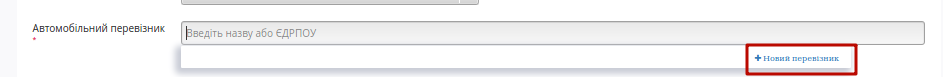

Відкриється модальне вікно, в якому потрібно заповнити всі обов'язкові поля (позначені червоною зірочкою :red:`*`) та натиснути **"Додати"**:

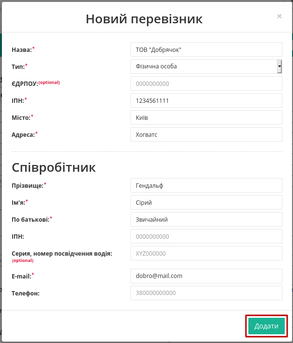

Дані нового контрагента автоматично додаються в таблицю **"Додаткові дані"** (детальніше `детальніше <https://wiki.edin.ua/uk/latest/ETTN_2_0/Creation_signing_ending_rejection_ETTN_shipper.html#additional-data>`__). При корректному заповненні даних (унікальні email, ЄДРПОУ) на вказаний email відправляється запрошення з унікальним посиланням для подальшої реєстрації на платформі EDIN:

.. image:: pics_Creation_signing_ending_rejection_Proposal/Creation_signing_ending_rejection_Proposal_89n.png
   :align: center

.. important::
   Якщо контрагенти були введені вручну (поки не зареєстровані на платформі EDIN), то при збереженні документа відобразиться попередження, наприклад, для **Перевізника**:

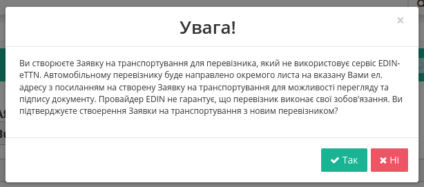

Є можливість **"Вказати дані по авто і водієві"**, якщо відомо хто буде здійснювати поставку (за замовчуванням блок згорнутий):

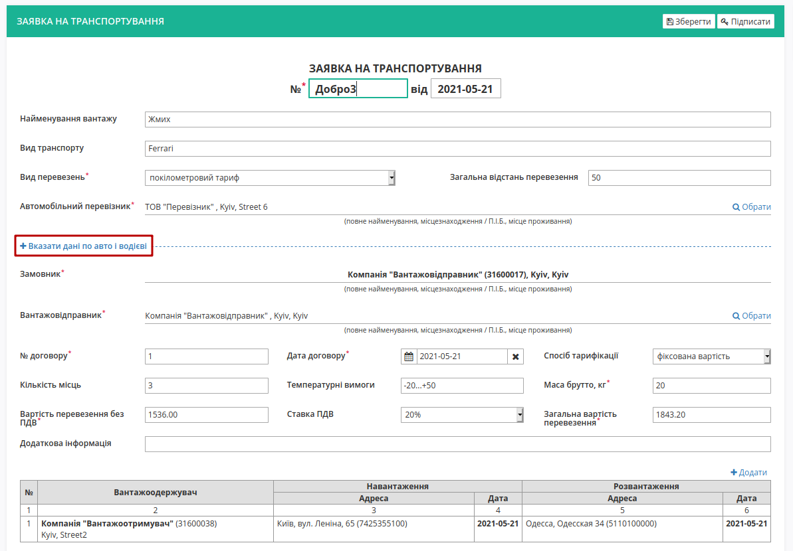

.. початок блоку для driver-data

Для автомобілів та причепів реалізований автоматичний довідник, в який записуються "Реєстраційний номер", "Марка/модель", "Тип". Для раніше введеного реєстрайійного номеру, наприклад, **КК1234КК** користувач може скористатись пошуком (мінімум 3 символи): ``КК1, К12, 123, 234, 34К, 4КК``.

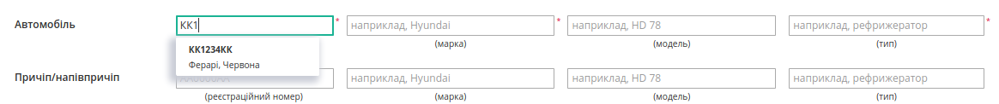

.. note::
   Якщо користувач вказує будь-які дані причіпа/напівпричіпа, то відповідні поля: реєстраційний номер, марка та тип стають обов'язковими до заповнення!

Якщо водій відсутній в списку його можливо додати через кнопку **"Новий водій"**:

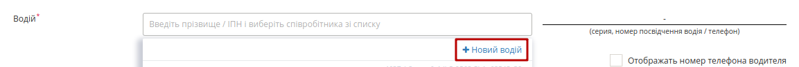

Після чого в модальному вікні потрібно буде заповнити дані про водія ("Серія, номер посвідчення водія" заповнюється в форматі "3 заголовні кириличні/латинські літери + 6 цифр без пробілів", наприклад "DGJ123456", "АБВ123456"). Обов'язкові поля позначені червоною зірочкою :red:`*` . Доданий водій прив'язується в системі до вказаного **"Перевізника"**. Є можливість зробити доступним номер телефону водія для учасників документообігу (відмітка "Відображати номер телефону водія").

.. image:: pics_Creation_signing_ending_rejection_Proposal/Creation_signing_ending_rejection_Proposal_90n.png
   :align: center

.. кінець блоку для driver-data

.. note::
   Згортання блоку після введення данних видаляє блок з документа разом з даними:

   .. image:: pics_Creation_signing_ending_rejection_Proposal/Creation_signing_ending_rejection_Proposal_98n.png
      :align: center

Окрім полей в формі документа необхідно заповнити табличну частину "Заявка на транспортування". Для заповнення табличної частини документа потрібно натиснути на кнопку **"+Додати"**, після чого відкриється модальне вікно "Інформація про маршрут і вантаж" (обов'язкові до заповнення поля позначені червоною зірочкою :red:`*` ):

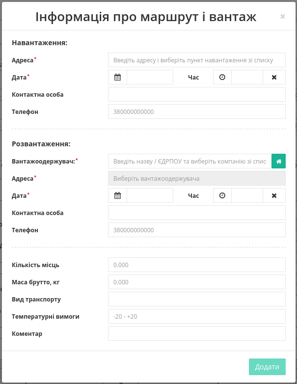

Вікно розділено на блоки з даними про маршрут (Навантаження і Розвантаження) та блоком з інформацією про маршрут. Для блоків Навантаження та Розвантаження вказуються відповідні значення адрес, дат, контактних осіб, телефони:

* **Адреса** – необхідно обрати з випадаючого списку (для навантаження значення підтягуються з довідника **"Вантажовідправника"**, а для розвантаження - **"Вантажоодержувача"**) або можливо ввести **"Нові адреси"**. При введенні нової адреси потрібно ввести адресу, населений пункт (достатньо почати вводити назву населеного пункту та обрати його зі списку) - при цьому код `КАТОТТГ <https://www.minregion.gov.ua/napryamki-diyalnosti/rozvytok-mistsevoho-samovryaduvannya/administratyvno/kodyfikator-administratyvno-terytorialnyh-odynycz-ta-terytorij-terytorialnyh-gromad/>`__ вказується автоматично;
* **Дата та час навантаження/розвантаження** - для кожної адреси вказуються кінцеві терміни в яких потрібно здійснити забір та доставку вантажу;
* **Контактна особа та її телефон** - вказуються для того, щоб водію було зрозуміло, до кого потрібно звертатись при навантаженні/розвантаженні.
* **Вантажоодержувач** – для блоку Розвантаження необхідно обрати з випадаючого списку (для цього в рядку необхідно ввести мінімум 3 символи найменування/П.І.Б. вантажоодержувача, після цього обрати його з випадаючого списку), місцезнаходження/місце проживання буде додано автоматично;

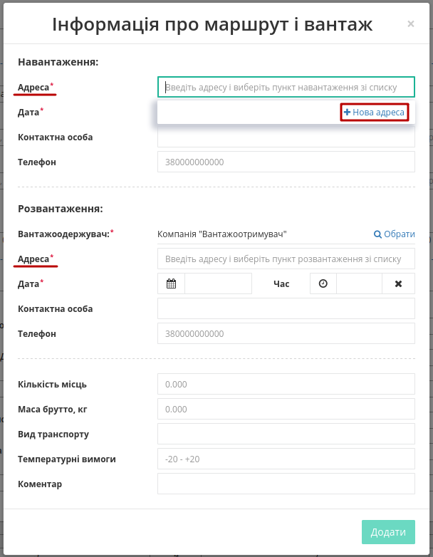

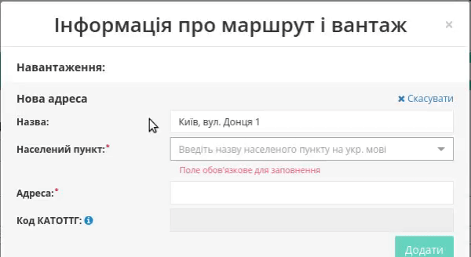

.. image:: pics_Creation_signing_ending_rejection_Proposal/Creation_signing_ending_rejection_Proposal_105n.png
   :align: center

.. tip:: Для повторного вибору перевізника, вантажовідправника, вантажоодержувача, пунктів навантаження/розвантаження необхідно натиснути на кнопку "Обрати".

Для редагування інформації щодо вантажу необхідно навести курсор на рядок цього вантажу та натиснути "Змінити", для видалення – "Видалити".

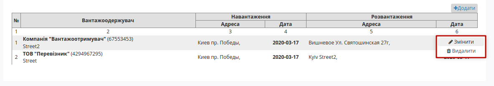

Для збереження "Заявка на транспортування" необхідно натиснути кнопку **"Зберегти"**, документ потрапить у папку **"Чернетки"**.

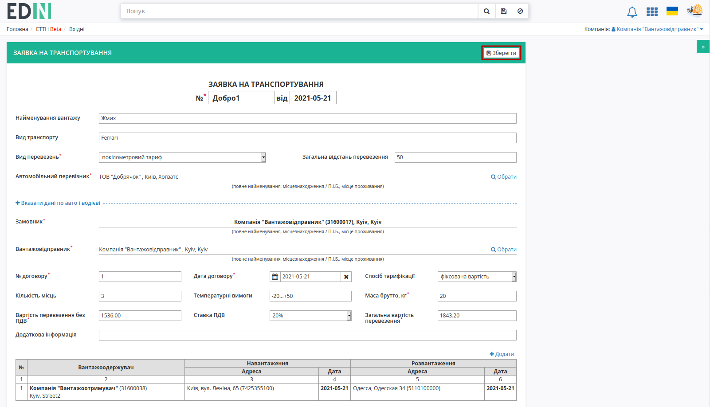

За необхідністю є можливість додати супровідні документи (лише в pdf форматі). Для цього необхідно натиснути на кнопку "Додати файл" (назва файлу повинна бути унікальною).

.. image:: pics_Creation_signing_ending_rejection_Proposal/Creation_signing_ending_rejection_Proposal_95n.png
   :align: center

Для того щоб видалити доданий файл необхідно натиснути на іконку корзини. Для того щоб зберегти доданий файл необхідно натиснути на його назву.

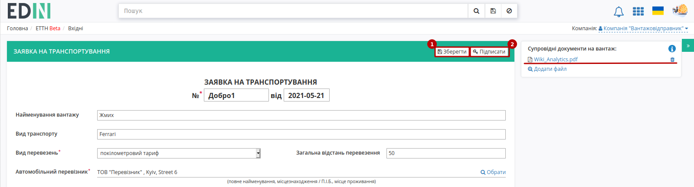

Після усіх проведених змін документ необхідно **"Зберегти"** (1) та **"Підписати"** (2).

.. _sign:

**1.1 Підписання та відправка "Заявки на транспортування" "Замовником"**
================================================================================================

.. include:: /_constant/atb_check/atb_check.rst
   :start-after: .. початок блоку для ATB_check
   :end-before: .. кінець блоку для ATB_check

.. tabs::

   .. tab:: Файловий ключ

      .. include:: /_constant/signing/signing.rst
         :start-after: .. початок блоку для Signing
         :end-before: .. кінець блоку для Signing

   .. tab:: Token

      .. include:: /_constant/token_signing/token_signing.rst
         :start-after: .. початок блоку для TokenSign
         :end-before: .. кінець блоку для TokenSign

   .. tab:: Гряда

      .. include:: /_constant/gryada_signing/gryada_signing.rst
         :start-after: .. початок блоку для GryadaSign
         :end-before: .. кінець блоку для GryadaSign

   .. tab:: Cloud

      .. include:: /_constant/cloud_signing/cloud_signing.rst
         :start-after: .. початок блоку для CloudSign
         :end-before: .. кінець блоку для CloudSign

Після підписання "Заявки на транспортування" окремим блоком відображається інформація про підписантів. Для відправки "Заявки на транспортування" необхідно натинути на кнопку "Надіслати".

.. image:: pics_Creation_signing_ending_rejection_Proposal/Creation_signing_ending_rejection_Proposal_97n.png
   :align: center

Після відправки документа контрагенту він відображається в журналі вихідних документів. Для відправленого **"Замовником"** "Заявка на транспортування"  присвоюється статус **"Очікує підтверження перевізником"**:

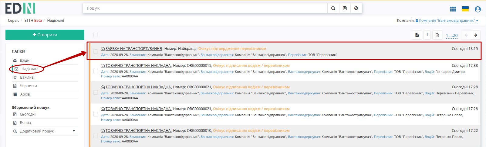

Відправлена "Заявка на транспортування" має наступний вигляд:

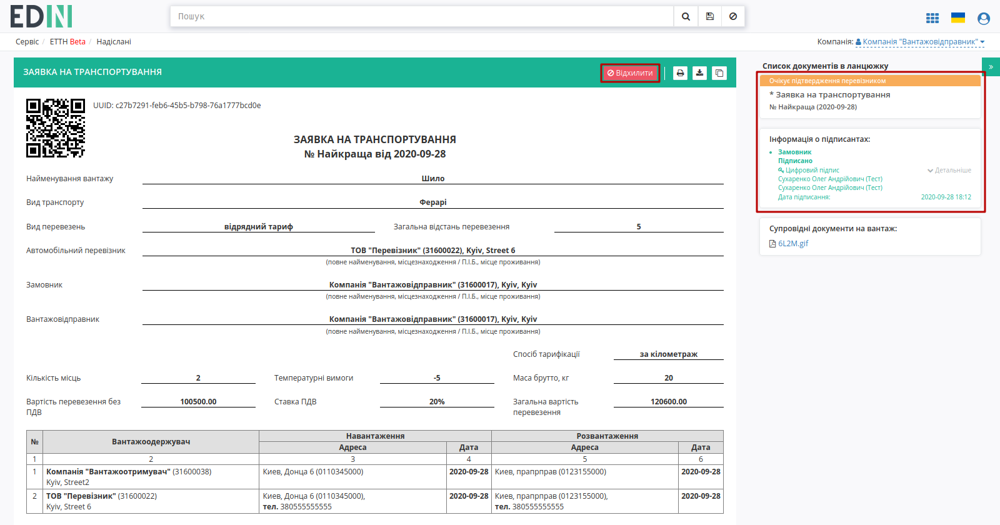

На формі "Заявка на транспортування" у лівій верхній частині відображаються QR-код та унікальний ідентифікатор документа.

Користувач може скористатись функціоналом для "Друку", "Завантаження" чи "Клонування"; також у разі виявлення помилки в документі у **"Замовника"** є можливість відхилити відправлене "Заявка на транспортування" **до підписання "Перевізником"**. Для цього потрібно натиснути на кнопку "Відхилити".

**1.2 Відхилення "Заявка на транспортування" "Замовником"**
---------------------------------------------------------------------------

Для того, щоб відхилити документ (доступно **до підписання "Перевізником"**) потрібно натиснути **"Відхилити"**. Після чого в модульному вікні обов'язково потрібно заповнити причину відміни документа:

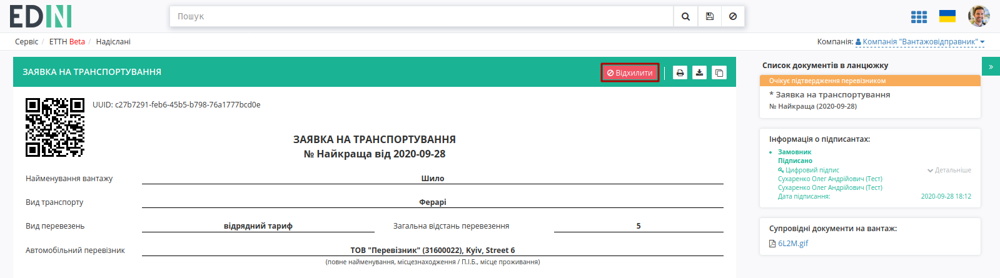

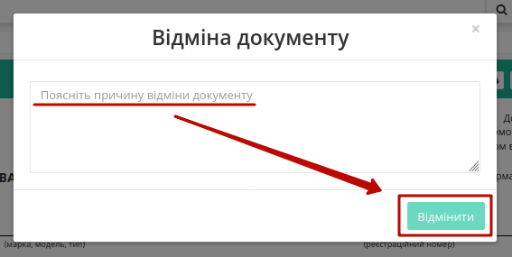

.. image:: pics_Creation_signing_ending_rejection_Proposal/Creation_signing_ending_rejection_Proposal_55n.png
   :align: center

На платформі відображається повідомлення та змінюється статус документа в ланцюжку ("Скасовано замовником").

**2 Отримання "Заявки на транспортування" "Перевізником"**
=================================================================================================================

Відправлена з боку **"Замовника"** "Заявка на транспортування" відображається в папці "Вхідні".

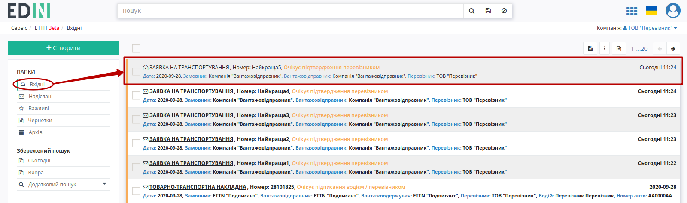

Вхідний підписаний документ можливо **"Підписати"** / **"Відхилити"**, а також **"Надати дані по авто і водієві"** - створення документа "Підтвердження транспортування":

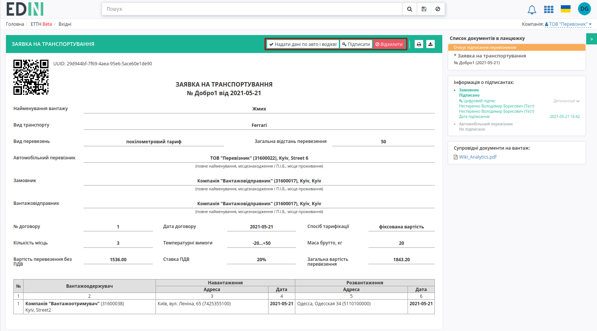

Якщо **"Замовник"** вже вказав дані водія при формуванні документа, то блок **"Дані по авто і водієві"** вже буде в документі:

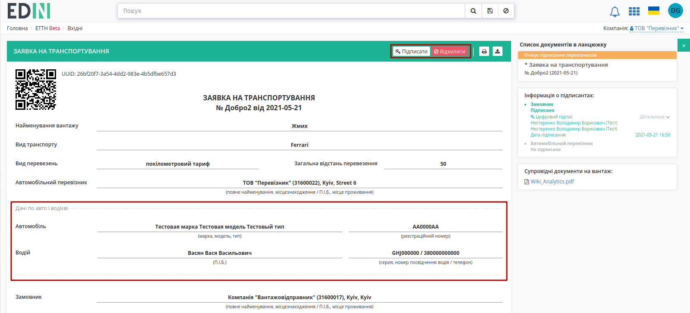

**2.1 Підписання "Заявки на транспортування" "Перевізником"** 
-------------------------------------------------------------------------------------

.. hint::
   Процес підписання документа **"Перевізником"** не відрізняється від підписання **"Замовником"** та описаний в `розділі вище <https://wiki.edin.ua/uk/latest/ETTN_2_0/Creation_signing_ending_rejection_Proposal.html#sign>`__ .

.. important::
   У випадку, якщо **"Замовник"** вірно вказав дані водія, то "Заявка на транспортування" не потребує створення "Підтвердження транспортування". Документообіг завершено. Однак, якщо дані водія не були зазначені, **"Перевізник"** підписав "Заявку на транспортування" і таблиця документа має кілька позицій, то у **"Перевізника"** є можливість **"Розділити заявку"** при формуванні "Підтвердження транспортування":
   
   .. image:: pics_Creation_signing_ending_rejection_Proposal/Creation_signing_ending_rejection_Proposal_108n.png
      :align: center
   
   **"Розділити заявку"** - можливість формування "Підтвердження транспортування" на обрані пункти Навантаження-Розвантаження з "Заявки на транспортування". Після натискання на кнопку відкривається вікно "Поділ заявки на транспортування", в якому можливо обрати табличні позиції "Заявки на транспортування" за якими буде створено "Підтвердження транспортування":

   .. image:: pics_Creation_signing_ending_rejection_Proposal/Creation_signing_ending_rejection_Proposal_109n.png
      :align: center

   Після натискання кнопки **"Створити підтвердження заявки"** відкривається форма "Підтвердження транспортування" (детальніше в розділі `2.3 Формування та відправка «Підтвердження транспортування» <https://wiki.edin.ua/uk/latest/ETTN_2_0/Creation_signing_ending_rejection_Proposal.html#confirmation>`__).

**2.2 Відхилення "Заявки на транспортування" "Перевізником"**
-------------------------------------------------------------------------------------

У **"Перевізника"** є можливість відхилити "Заявку на транспортування". Для цього потрібно натиснути на кнопку **"Відхилити"**. Після чого в модульному вікні обов'язково потрібно заповнити причину відміни документа:

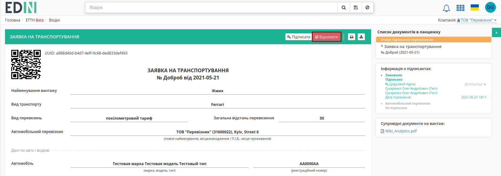

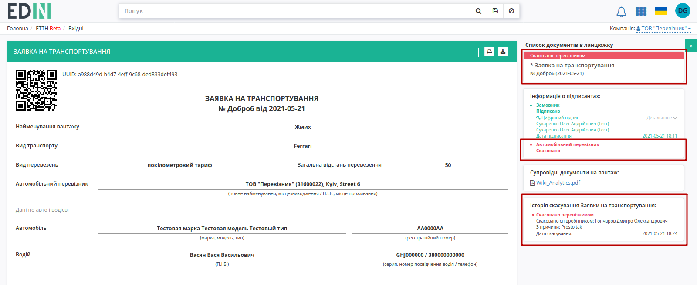

Для відхиленої Перевізником "Заявки на транспортування" присвоєно статус "Скасовано перевізником".

.. _confirmation:

**2.3 Формування та відправка "Підтвердження транспортування" "Перевізником"**
------------------------------------------------------------------------------------------------------------------------------------------

Після того, як водій чи **"Перевізник"** "підтверджує" документ (кнопки **"Надати дані по авто і водієві"**, **"Створити підтвердження заявки"** при розділенні заявки), відкривається форма "Підтвердження транспортування", в якій необхідно заповнити відомості про водія та натиснути **"Зберегти"**:

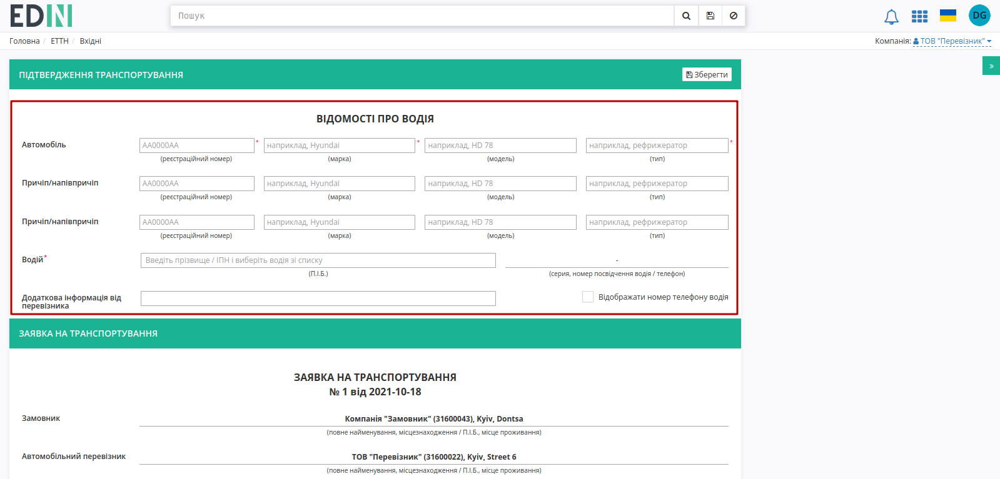

.. include:: /ETTN_2_0/Creation_signing_ending_rejection_Proposal.rst
   :start-after: .. початок блоку для driver-data
   :end-before: .. кінець блоку для driver-data

Після того, як документ буде "Збережено" з'являється можливість додати до "Підтвердження транспортування" супровідні документи (лише в pdf форматі). Для цього необхідно натиснути на кнопку "Додати файл" (назва файлу повинна бути унікальною).

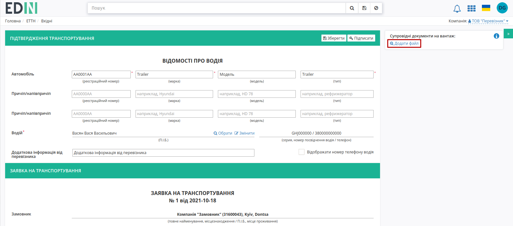

Для того щоб видалити доданий файл необхідно натиснути на іконку корзини. Для того щоб зберегти доданий файл необхідно натиснути на його назву.

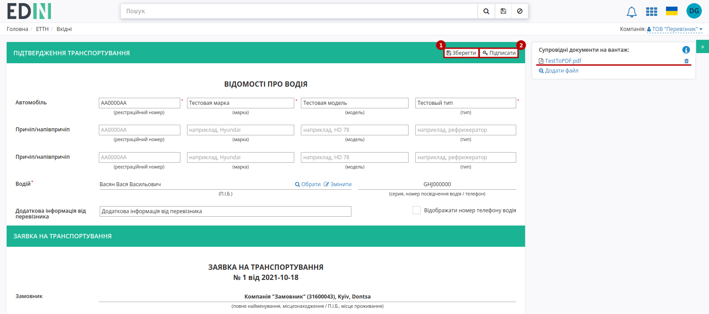

Після усіх проведених змін документ необхідно **"Зберегти"** (1) та **"Підписати"** (2).

.. hint::
   Процес підписання **"Перевізником"** не відрізняється від підписання **"Замовником"** та описаний в `розділі вище <https://wiki.edin.ua/uk/latest/ETTN_2_0/Creation_signing_ending_rejection_Proposal.html#sign>`__ .

Після підписання в "Підтвердження транспортування" додається інформація щодо підписантів документа. Документ можливо **"Надіслати"** контрагенту (**"Замовнику"**): 

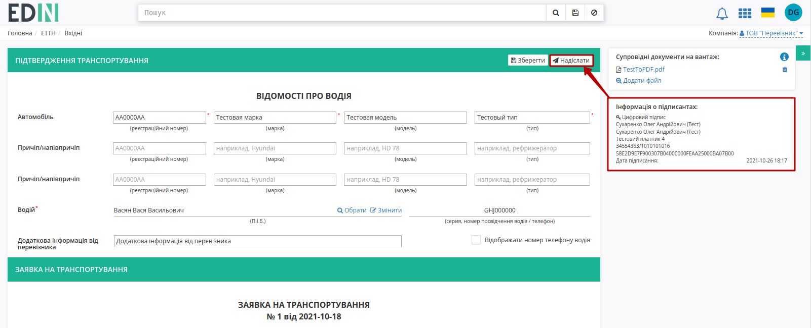

Підписаний документ відображається в журналі надісланих документів зі статусом **"Очікує підписання замовником"**:

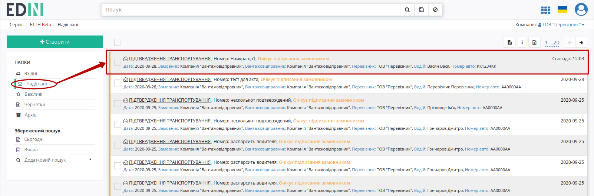

**2.4 Відхилення "Підтвердження транспортування" "Перевізником"**
-------------------------------------------------------------------------------------

У **"Перевізника"** є можливість відхилити "Підтвердження транспортування" **до його підписання замовником**. Для цього потрібно натиснути на кнопку **"Відхилити"**. Після чого в модульному вікні обов'язково потрібно заповнити причину відміни документа:

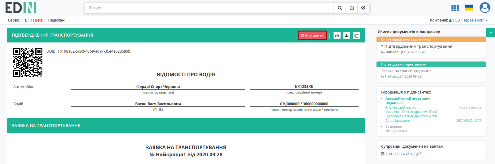

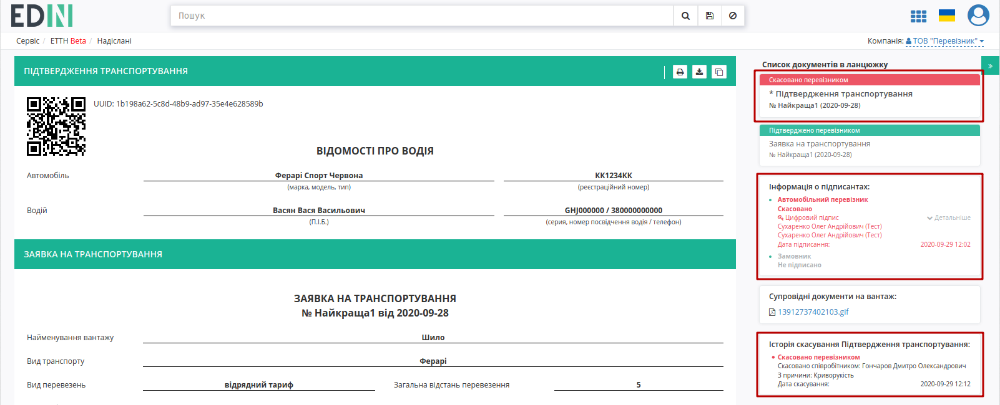

Для відхиленого перевізником "Заявка на транспортування" присвоєно статус "Скасовано перевізником". Документ з цим статусом відображається у "Вхідних" **"Перевізника"**.

**3 Отримання "Підтвердження транспортування" "Замовником"**
================================================================================================

Відправлене з боку **"Перевізника"** "Підтвердження транспортування" відображається в папці "Вхідні".

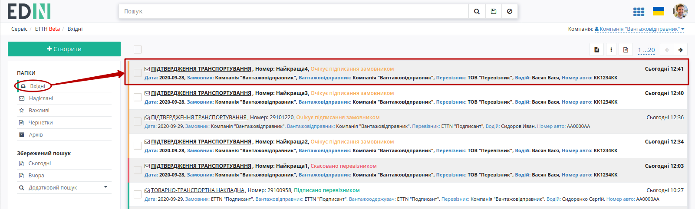

Вхідний відкритий підписаний документ доступно **"Підписати"** чи **"Відхилити"**.

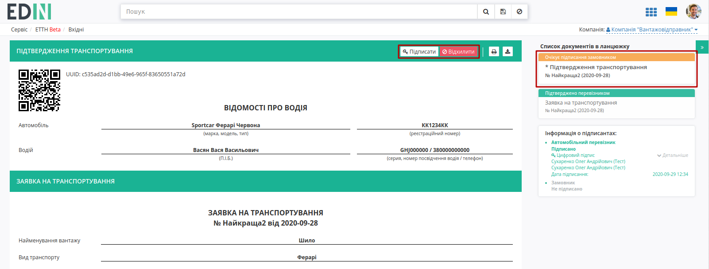

**3.1 Підписання "Підтвердження транспортування" "Замовником"**
-------------------------------------------------------------------------------------

Для підписання Підтвердження транспортування потрібно натиснути на кнопку **"Підписати"**.

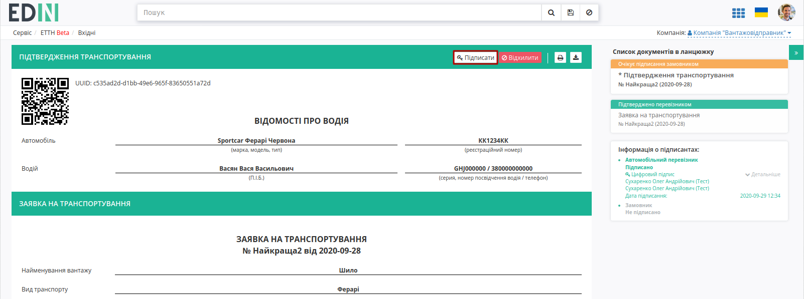

.. hint::
    Процес підписання **"Замовником"** вже описаний раніше в `розділі вище <https://wiki.edin.ua/uk/latest/ETTN_2_0/Creation_signing_ending_rejection_Proposal.html#sign>`__ .

Після підписання інформаційне повідомлення сповіщає про те, що документообіг завершено ("Процес завершено"), а статус документа "Підтвердження транспортування" змінюється на "Підписано замовником".

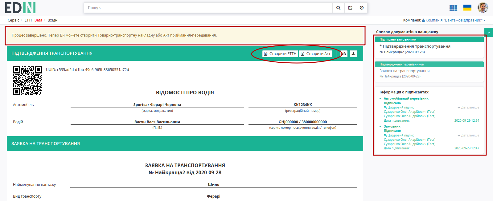

А на панелі підписаного "Підтвердження транспортування" з'являються дві кнопки:

1) **Створити ЕТТН** - дозволяє створити ЕТТН за вибраним **"Замовником"** (якщо їх було кілька в "Замовленні транспортування"):

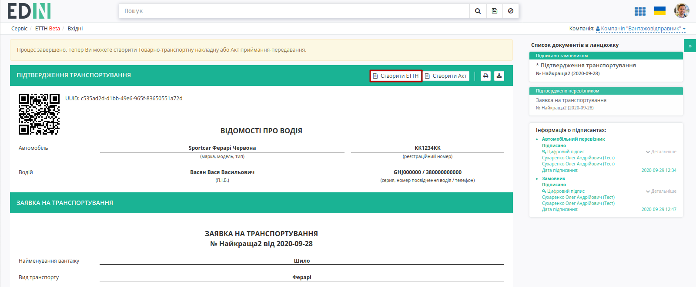

Необхідно вибрати для якої адреси із "Підтвердження транспортування" буде створено ЕТТН: 

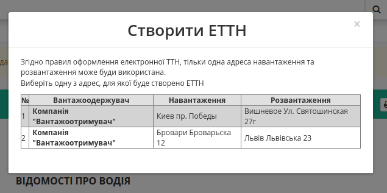

Після чого відкриється частково заповненя форма ЕТТН, що вже матиме зв'язок з раніше створеними документами:

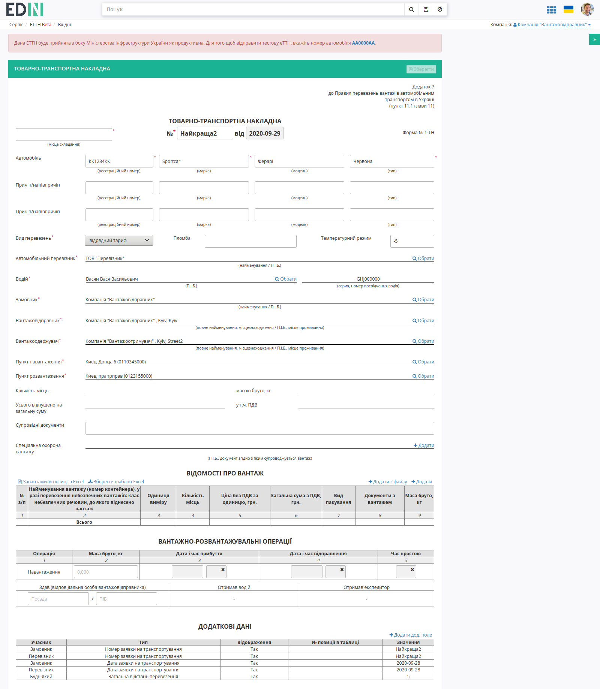

Детальніше про заповнення, підписання, відправку в `інструкції для роботи з "ЕТТН" <https://wiki.edin.ua/uk/latest/ETTN_2_0/Creation_signing_ending_rejection_ETTN_shipper.html>`__ )

2) **Створити Акт** - дозволяє створити "Акт прийому-передачі" за вибраним **"Вантажовідправником"** (якщо їх було кілька в "Замовленні транспортування"):

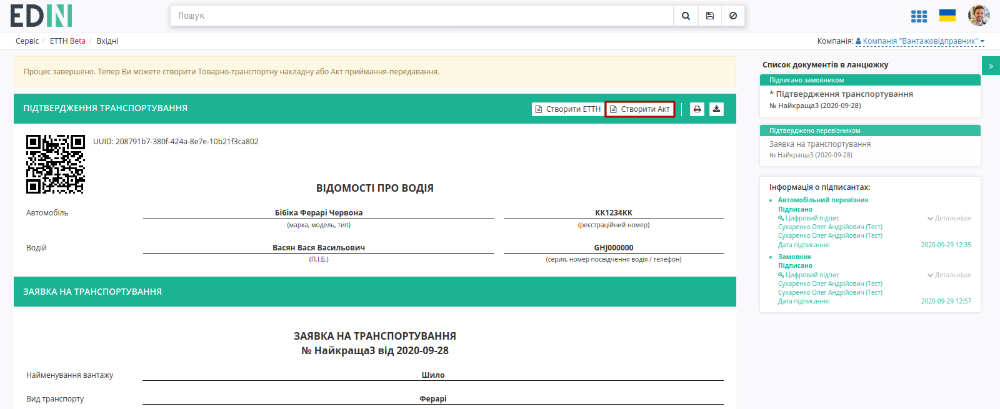

Необхідно вибрати для якої адреси із "Підтвердження транспортування" буде створено "Акт прийому-передачі": 

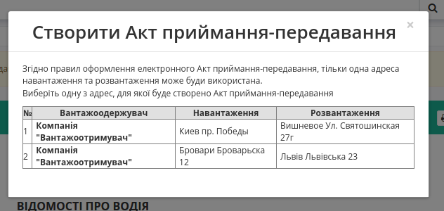

Після чого відкриється частково заповненя форма "Акта прийому-передачі", що вже матиме зв'язок з раніше створеними документами:

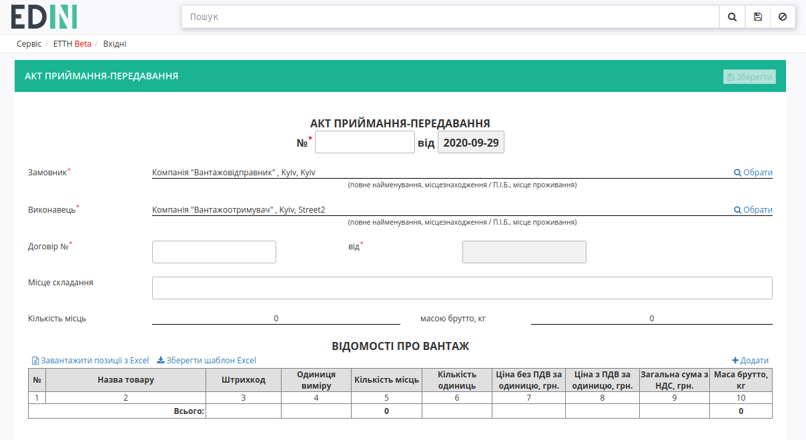

Детальніше про заповнення, підписання, відправку в `інструкції для роботи з "Актом прийому-передачі" <https://wiki.edin.ua/uk/latest/ETTN_2_0/Work_with_acceptance_certificate.html>`__ )

**3.2 Відхилення "Підтвердження транспортування" "Замовником"**
------------------------------------------------------------------------------------

Для того, щоб відхилити документ потрібно натиснути **"Відхилити"**. 

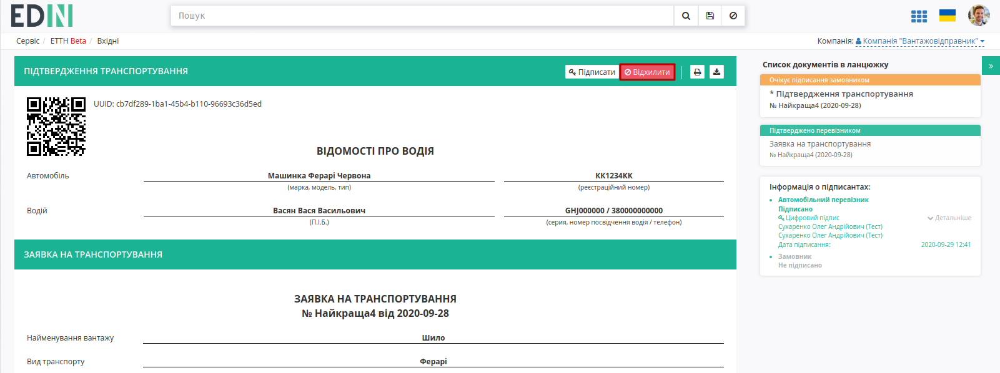

Після чого в модульному вікні обов'язково потрібно заповнити причину відміни документа:

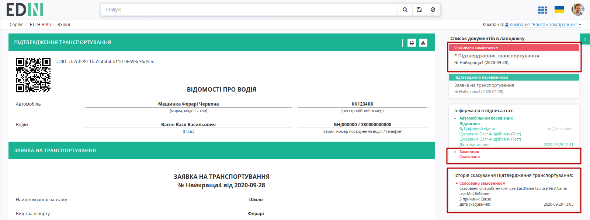

На платформі відображається повідомлення та змінюється статус документа в ланцюжку (**"Скасовано замовником"**).

---------------------------------

.. [#] **Заборонити редагування вартості перевезення** - додаткові налаштування "Замовника", що можуть бути виконані при зверненні через службу підтримки. Якщо ці налаштуванні активовані, то:

   * В "Заявці на транспортування" поля "Вартість перевезення без ПДВ", "Ставка ПДВ", "Загальна вартість перевезення", "Спосіб тарифікації" у "Заявці на транспортування" є обов'язковими до заповнення;
   * В "Актах виконаних робіт", створених на на підставі "Заявки на транспортування" / "Підтвердження транспортування", "Перевізник" ("Виконавець"):

      * не може редагувати вартість перевезення (поля "Вартість перевезення без ПДВ", "Ставка ПДВ", "Загальна вартість перевезення";
      * не може **"Додавати"** / **"Видаляти"** позиції в ВІДОМОСТІ ПРО ВАНТАЖ (табличні дані).

---------------------------------

.. include:: /_constant/kontakti.rst
