Підписання або відхилення е-ТТН вантажоодержувачем
###################################################################################################

.. сюда закину немного картинок для текста

.. |drop_pass| image:: signing/drop_pass.png

.. |del_key| image:: signing/del_key2.png

.. role:: red

.. role:: underline

Підписана з боку перевізника е-ТТН відображається в папці "Вхідні".

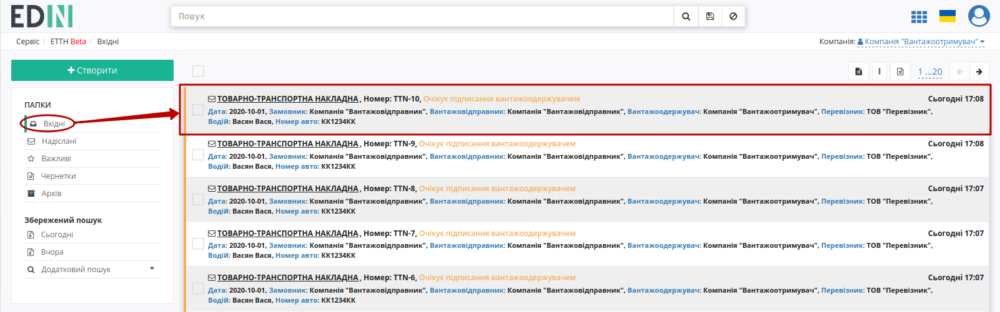

.. important::
   Підписання е-ТТН вантажоодержувачем можливе тільки після підписання перевізником (статус документу – **"Очікує підписання вантажоодержувачем"**).

.. important::
   В залежності від внутрішньої схеми **"Вантажоодержувача"** документ перед "Підписанням" (2) може бути "Підтверджений" (1) приймальником. Також у **"Вантажоодержувача"** є можливість "Відхилити" (3) документ. 

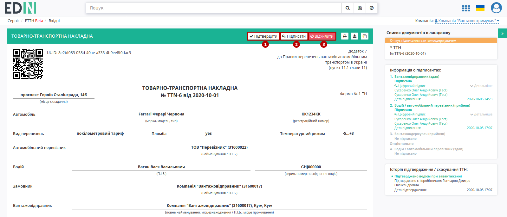

Після підтвердження (кнопка **"Підтвердити"**) документ у вхідних змінює свій статус на **"Очікує підписання вантажоодержувачем (підтверджено приймальником)"**, а також в **"Історії змін статусів"** додається інформація про співробітника, що здійснив "підтвердження":

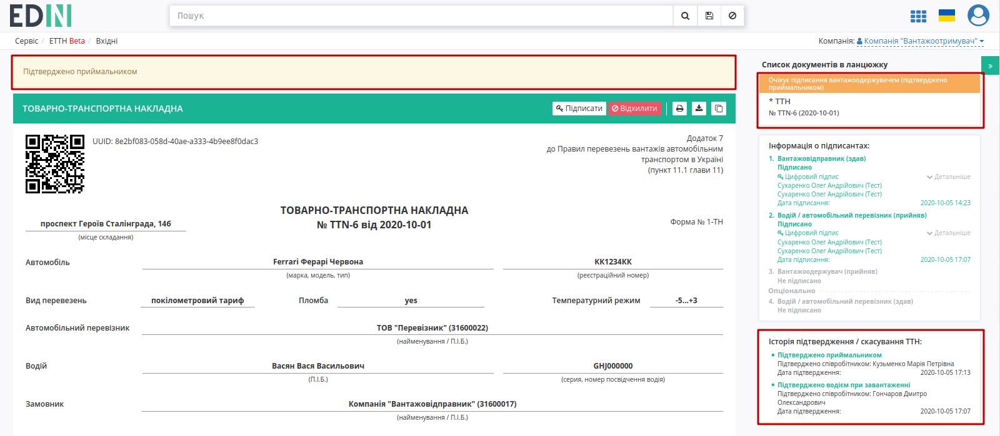

.. _sign:

**Підписання документа**
==============================================================

Для підписання е-ТТН **"Вантажоодержувачу"** потрібно відкрити документ та натиснути на кнопку **"Підписати"**.

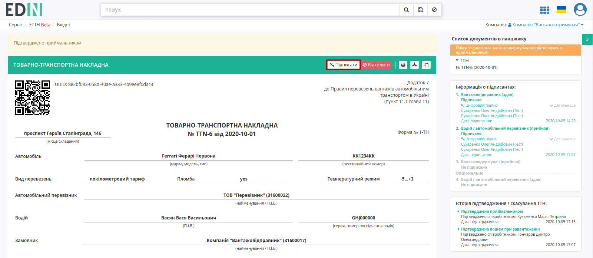

Відкривається модульне вікно підписання, в якому автоматично вказується маса бруто (поля "Дата прибуття", "Час прибуття", "Дата відправлення", "Час відправлення", "Час простою", "Посада відповідальної особи", "П.І.Б. відповідальної особи" обов'язкові до заповнення). Додатково можливо додати дані документів про внесення змін, дані про товарні позиції:

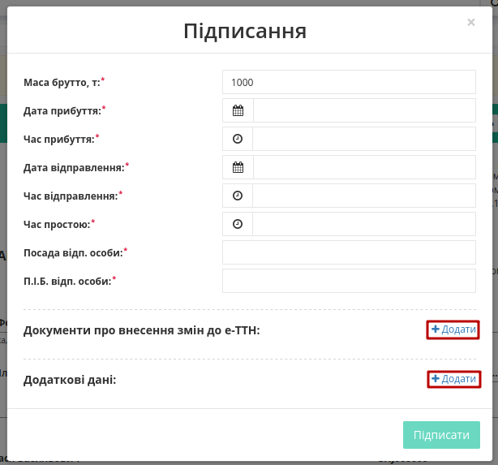

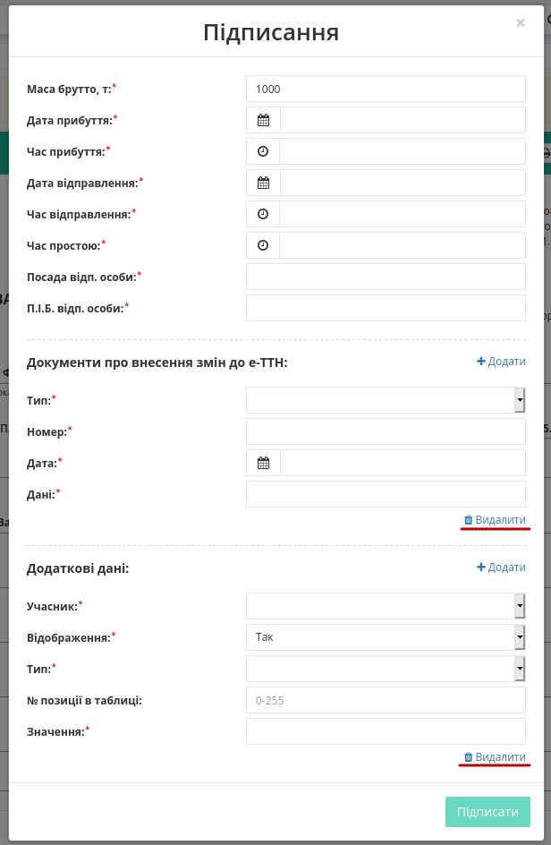

.. attention::
   Блоки, що були додані містять обов'язкові поля (відмічені червоною зірочкою :red:`*`). Додаткові блоки можливо "Видалити". 

Після того, як всі обов'язкові поля будуть заповнені потрібно натиснути **"Підписати"** (введені дані в разі успішного підписання додаються до таблиці вантажно-розвантажувальних робіт).

.. include:: /_constant/atb_check/atb_check.rst
   :start-after: .. початок блоку для ATB_check
   :end-before: .. кінець блоку для ATB_check

.. tabs::

   .. tab:: Файловий ключ

      .. include:: /_constant/signing/signing.rst
         :start-after: .. початок блоку для Signing
         :end-before: .. кінець блоку для Signing

   .. tab:: Token

      .. include:: /_constant/token_signing/token_signing.rst
         :start-after: .. початок блоку для TokenSign
         :end-before: .. кінець блоку для TokenSign

   .. tab:: Гряда

      .. include:: /_constant/gryada_signing/gryada_signing.rst
         :start-after: .. початок блоку для GryadaSign
         :end-before: .. кінець блоку для GryadaSign

   .. tab:: Cloud

      .. include:: /_constant/cloud_signing/cloud_signing.rst
         :start-after: .. початок блоку для CloudSign
         :end-before: .. кінець блоку для CloudSign

Після підписання е-ТТН інформація щодо підписантів відображається в документі ТТН у списку документів у ланцюжку, документ змінює статус на **"Очікує підписання водієм / перевізником"**.

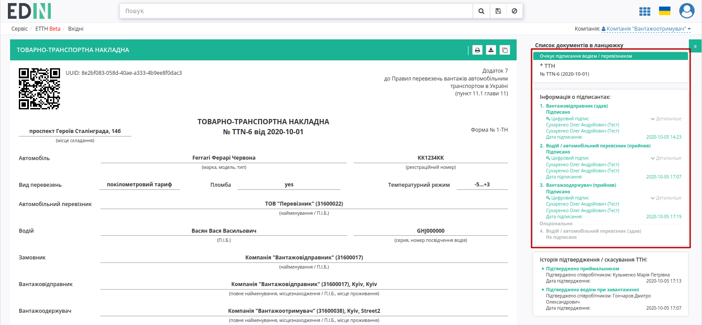

Після підписання документ з оновленим статусом відображається в журналі вхідних документів:

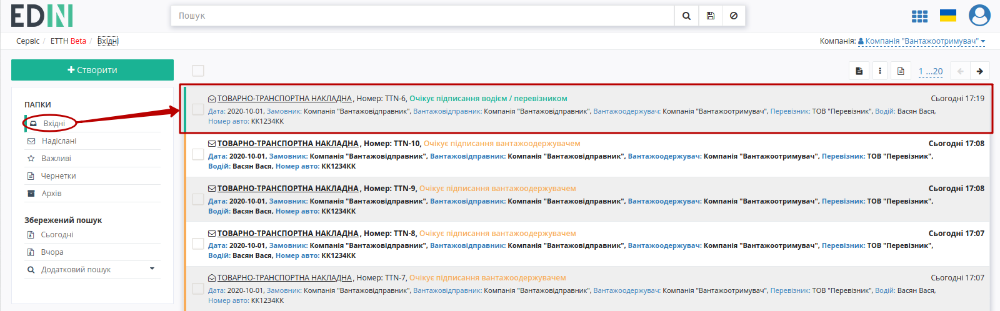

**Відхилення документа**
==============================================================

У **"Вантажоодержувача"** є можливість відхилити е-ТТН **до підписання**. Для цього потрібно натиснути на кнопку **"Відхилити"**:

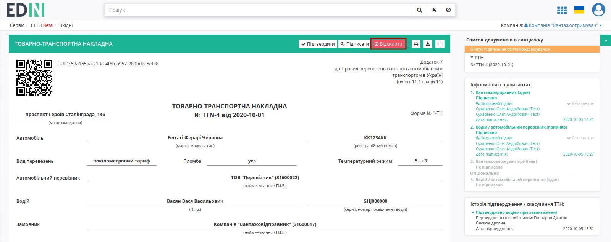

Після чого в модульному вікні обов'язково потрібно заповнити причину відміни документа:

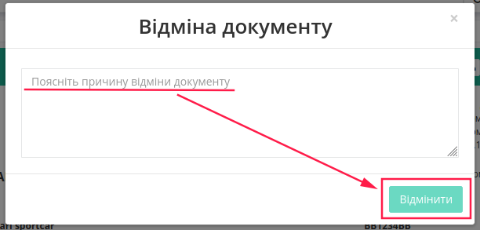

Для відхиленної **"Вантажоодержувачем"** е-ТТН присвоюється статус **"Скасовано вантажоожержувачем"**, робляться відповідні помітки червоним кольором:

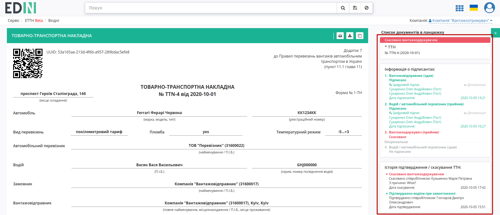

Документ з цим статусом відображається у "Вхідних" **"Вантажоодержувача"**.

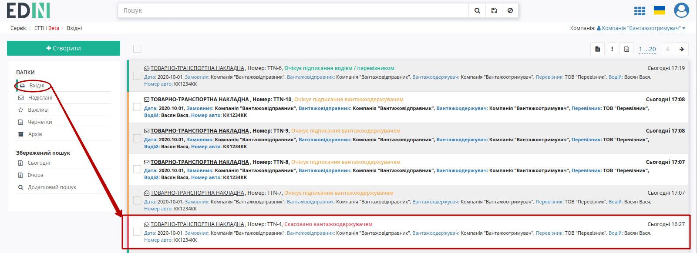

------------------------------

.. include:: kontakti.rst

