Робота з сервісом EDIN-ETTN
#############################################################

.. role:: red

.. role:: green

.. role:: navy

.. role:: underline

.. сюда закину немного картинок для текста

.. |звезда2| image:: pics_Work_with_ETTN/Work_with_ETTN_055.png

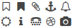

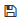

.. |пресуха| image:: pics_Work_with_ETTN/Work_with_ETTN_041.png

.. |ring| image:: /_constant/icons/ring.gif

.. |success| image:: /_constant/icons/success.png

.. |error| image:: /_constant/icons/error.png

.. |repeat| image:: /_constant/icons/repeat.png

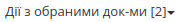

.. :underline:`"Чернетки" для ролі "Організатор"`

.. contents:: Зміст:
   :depth: 6

---------

**1 Вхід на платформу**
================================================

.. include:: /general_2_0/rabota_s_platformoj_EDIN_2.0.rst
   :start-after: .. початок блоку для Enter
   :end-before: .. кінець блоку для Enter

Після успішної авторизації відкриється основне меню продуктів та рішень для вибору сервісу платформи EDIN: **"Вільний", "EDI Network", "Е-ТТН", "Маркет", "Комерційна пропозиція", "Е-Специфікація", "Підключення до мережі", "Товари", "Tender", "Е-Сертифікати", "White Doc", "Інтеграція"**:

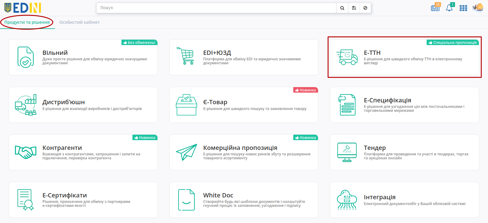

Для переходу до сервісу потрібно натиснути на плитку **"Е-ТТН"**.

.. hint::
   Для повернення до меню сервісів, товарного довідника потрібно натиснути кнопку |пресуха| або натиснувши на логотип EDIN.

.. _main:

**2 Загальний вигляд сервісу**
================================================

Сервіс **"Е-ТТН"** містить `загальні функціональні елементи платформи <https://wiki.edin.ua/uk/latest/general_2_0/rabota_s_platformoj_EDIN_2.0.html#header>`__, а серед основних елементів: власні папки з документами (1) та журнал документів (2) для перегляду та роботи з ними. Функціонал `Пошуку <https://wiki.edin.ua/uk/latest/ETTN_2_0/Work_with_ETTN.html#search>`__ та `Дії з обраними документами <https://wiki.edin.ua/uk/latest/ETTN_2_0/Work_with_ETTN.html#mass-download>`__ суттєво спрощують роботу в сервісі.

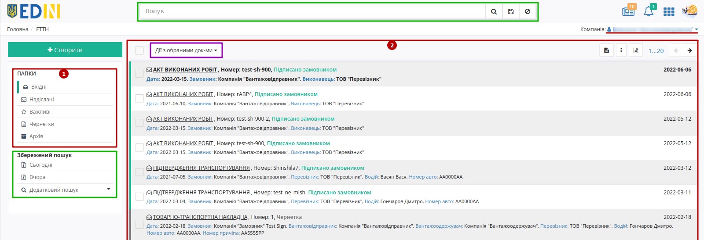

Якщо у акаунті зареєстровано кілька компаній, то у користувача з доступом є можливість переключатись між компаніями, натиснувши на назву компанії:

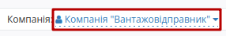

.. _catalogs:

**3 Перегляд каталогів сервісу**
================================================

В путівнику, а також зеленим маркером відмічене поточне місце перебування користувача в сервісі (при первинному вході - в каталозі **"Вхідних"** документів).

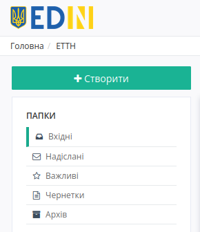

Для переходу в потрібний Вам каталог необхідно його вибрати:

#. **"Вхідні"** - каталог вхідних документів/ланцюжків організації (від контрагентів).
#. **"Надіслані"** - каталог відправлених документів/ланцюжків організації (до контрагентів).
#. **"Важливі"** - каталог всіх документів/ланцюжків, що були відзначені, як "важливі" символом зірочки ("важливі" |звезда2| / |звезда| "звичайні").
#. **"Чернетки"** - каталог для документів, що були створені, але не були відправлені. 
#. **"Архів"** - каталог для документів/ланцюжків, що були перенесені в архів.

.. _doc-journal:

**4 Журнал документів/ланцюжків документів**
================================================

.. hint::
   **Ланцюжок документів** - це послідовний список пов'язаних документів, що передбачаються і пов'язані документообігом.

В журналі відображаються документи/ланцюжки, що потрапили до вибраної `папки <https://wiki.edin.ua/uk/latest/ETTN_2_0/Work_with_ETTN.html#catalogs>`__. На відображаємий список та дії з документами/ланцюжками в значній мірі впливають фільтри (частина `пошукової системи <https://wiki.edin.ua/uk/latest/ETTN_2_0/Work_with_ETTN.html#search>`__):

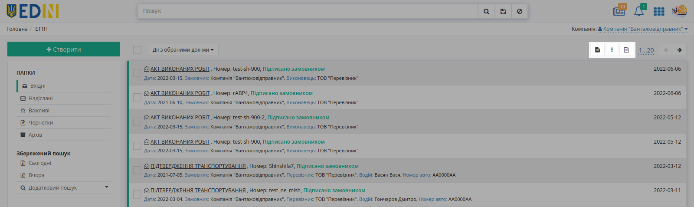

В папках **"Вхідні"**, **"Надіслані"**, **"Важливі"**, **"Архів"** можливо обрати, в якому вигляді буде відображатись інформація, у вигляді документів чи ланцюжків документів:

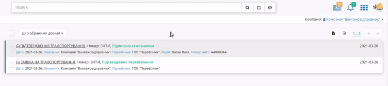

У **"Вхідних"** можливо відсортувати окремо **Непрочитані/Прочитані** документи (непрочитані виділяються жирним):

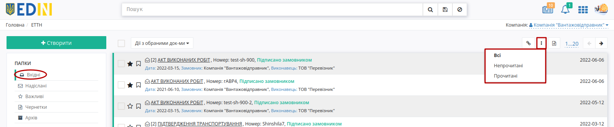

В **"Надісланих"** ця ж кнопка дозволяє відсортувати окремо **Відправлені/Доставлені** документи чи документи **з Помилками** (необроблені платформою):

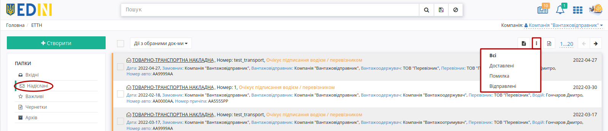

Додатково можливо відсортувати журнал за типом документа:

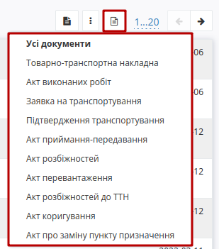

Доступно обрати кількість документів, що будуть відображатись на одній сторінці журналу (для подальшої пагінації):

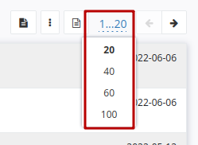

**Лише для Ланцюжків документів** в журналі відображаються символи:

* |звезда| / |звезда2| - регульована відмітка користувача, "важливий"/"звичайний" документ. Відмічені документи відображаються в каталозі **"Важливі"**.
* |прапорець| - дозволяє відмітити документ одним із символів |набор|

.. _search:

**5 Пошук**
=============================================================

Для пошуку передбачені стандартні "ключі запиту", переглянути які можливо, натиснувши на рядок Пошуку і в списку вибрати "Доступні для пошуку ключі":

.. image:: pics_Work_with_ETTN/Work_with_ETTN_12.png
   :align: center

Після чого відобразиться спливаюче вікно з можливостями пошуку:

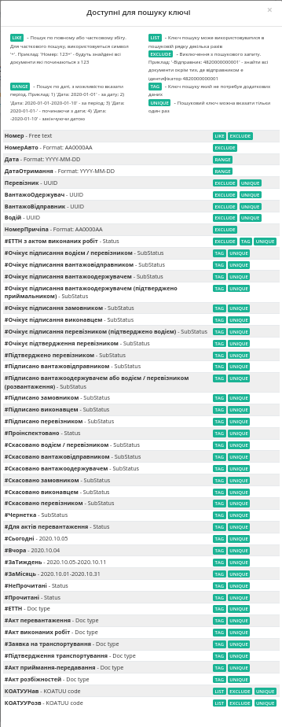

Для зручності можливо зберегти Ваш запит для пошуку - для цього потрібно виконати пошук, натиснути на іконку |Дискета| "зберегти" в рядку Пошуку:

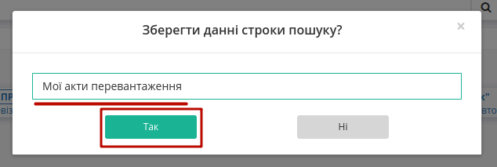

Ввести назву, натиснути "Так". Збережений результат пошуку буде відображатися в "Історії пошуку".

.. image:: pics_Work_with_ETTN/Work_with_ETTN_15.png
   :align: center

.. _scenario:

**6 Сценарії взаємодії з контрагентами (обмін е-ТТН)**
=============================================================

В сервісі ETTN передбачені 3 основні ролі учасників документообігу: **"Вантажовідправник"**, **"Перевізник"**, **"Вантажоотримувач"**, а також реалізовано кілька можливих сценаріїв взаємодії учасників документообігу ЕТТН.

.. hint::
   При роботі в рамках однієї компанії (**"Вантажовідправник"** та **"Вантажоотримувач"** - одна компанія) документи позначаються відміткою "Внутрішні перевезення":

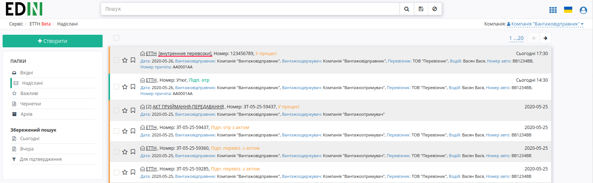

**6.1 Пряма схема документообігу ЕТТН**
------------------------------------------

:green:`"Вантажовідправник" -> "Перевізник" -> "Вантажоотримувач" -> "Перевізник" (опціонально)`

Ініціатором документообігу виступає **"Вантажовідправник"** - створює, підписує, відправляє ЕТТН (детально в `інструкції для вантажовідправника <https://wiki.edin.ua/uk/latest/ETTN_2_0/Creation_signing_ending_rejection_ETTN_shipper.html>`__ ). Далі **"Перевізник"** приймає вхідний документ, підписує та відправляє (детально в `інструкції для перевізника <https://wiki.edin.ua/uk/latest/ETTN_2_0/Signing_rejection_ETTN_carrier.html>`__ ). Завершальним підписантом в цій схемі є компанія-**"Вантажоотримувач"** (детально в `інструкції для вантажоодержувача <https://wiki.edin.ua/uk/latest/ETTN_2_0/Signing_rejection_ETTN_consignee.html>`__ )

**6.2 Документообіг ЕТТН між розподільчими центрами (всередині однієї компанії)**
-------------------------------------------------------------------------------------------

:green:`РЦ-"Вантажовідправник" -> "Перевізник" -> РЦ-"Вантажоотримувач" -> "Перевізник" (опціонально)`

Алгоритм взаємодії ідентичний до прямої схеми за виключенням того, що в якості **"Вантажовідправника"** та **"Вантажоотримувача"** виступає одна компанія. 

.. _reverse-schema:

**6.3 Обернена схема документообігу ЕТТН**
-------------------------------------------------------------------------------------

1. :red:`"Вантажоотримувач"` -> :green:`"Вантажовідправник" -> "Перевізник" -> "Вантажоотримувач" -> "Перевізник" (опціонально)`
2. :red:`"Перевізник"` -> :green:`"Вантажовідправник" -> "Перевізник" -> "Вантажоотримувач" -> "Перевізник" (опціонально)`

Обидва варіанти оберненої схеми документообігу ЕТТН відрізняються від "прямої" схеми тим, що ініціатором документообігу виступає **"Вантажоотримувач"** (1) або **"Перевізник"** (2). Алгоритм детально описаний в `інструкції створення документів перевізником/вантажоодержувачем <https://wiki.edin.ua/uk/latest/ETTN_2_0/Creation_sending_ETTN_carrier_consignee.html>`__ )

.. _responsible-schema:

**6.4 Створення ЕТТН на основі "Акта приймання-передавання" (БП "Відповідальне зберігання")**
--------------------------------------------------------------------------------------------------

ЕТТН також можливо створити на підставі підписаного з обох сторін "Акта приймання-передавання" ( `детальніше про Акт <https://wiki.edin.ua/uk/latest/ETTN_2_0/Work_with_acceptance_certificate.html>`__ )

В цьому випадку сама схема документообігу залишається "класичною" (ініціатором виступає **"Вантажовідправник"**):

:green:`"Вантажовідправник" -> "Перевізник" -> "Вантажоотримувач" -> "Перевізник" (опціонально)`

.. important::
    Особливістю такого документообігу є створення практично повністю заповненого документу ЕТТН (дані контрагентів, адрес, вантажу підтягуються з попередніх документів, на основі яких створюється ця ЕТТН) - залишається лише внести ціну вантажу в табличну частину (кнопка "Додати").

**7 Повідомлення контрагентів, водіїв**
================================================

На кожному єтапі в вище зазначених схемах (новий документ чи зміна статусу) контрагенти отримують повідомлення на e-mail про документ, до якого вони причасні в форматі:

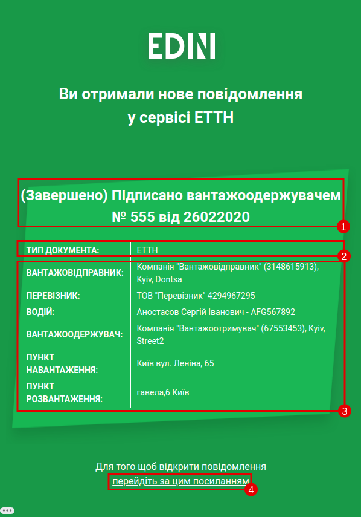

#. **Статус документу**: "У процесі" / "Підписано Вантажовідправником" / "Підтверджено водієм" / "Відхилено Вантажовідправником" / "Підписано Перевізником" / "Відхилено Перевізником" / "Підписано Вантажоотримувачем" / "Підтверджено Приймальником"
#. **Тип документа**: "ЕТТН" / "Заявка на трпнспортування" / "Акт перевантаження" / "Акт виконаних робіт"
#. **Блок даних контрагентів**
#. **Посилання на документ**

.. _doc-form:

**8 Загальний вигляд форми документа**
================================================

Функціонал форми документа дещо відрізняється в залежності від ролі користувача та етапу/статусу документообігу (детальніше у інструкціях, присвяченим цим ролям).

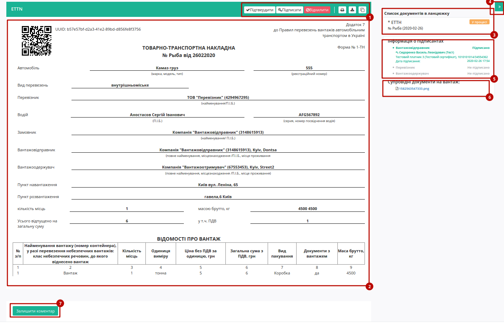

Розглянемо основні елементи форми:

#. Кнопки **"Підтвердити" / "Підписати" / "Відхилити" / "Змінити" / "Зберегти" / "Створити" / "Відправити"** відображаються лише там, де цей функціонал є логічним (згідно `сценаріїв взаємодії з контагентами <https://wiki.edin.ua/uk/latest/ETTN_2_0/Work_with_ETTN.html#scenario>`__ ). Кнопки **"Друк", "Завантажити", "Клонувати"** - є загальним функціоналом для всіх ролей та документів:
    * |Друк| - **"Друк"** - відкриває друковану форму документа, яку можливо зберегти в *.pdf форматі;
    * |Завантажити| - **"Завантажити"** - дозволяє завантажити документ в окремо json, xml форматах, а також у вигляді архіву (zip), що одразу містить документ в json, xml, pdf форматах, а також p7s форматі, якщо документ був підписаний.
    * |Клонувати| - **"Клонувати"** - функціонал, що дозволяє клонувати заповнений документ і всі його вкладення для подальшого редагування/підписання/відправки контрагентам (детальніше в `Клонування документа <https://wiki.edin.ua/uk/latest/ETTN_2_0/Work_with_ETTN.html#scenario>`__ ).
#. Сам документ разом з табличною частиною ("Відомості про вантаж").
#. Список документів у ланцюжку, в якому також відображається їх статус. Якщо під час перевезення вантажу (на етапі "Підтверджено водієм" / "Підписано перевізником") була здійснена перевірка інспектором - документ позначається відміткою |Бінокль| "Проінспектовано" (окремий фільтр пошуку). 
#. Кнопка, що згортає додаткову інформацію про ланцюжок документів, підписантів та супровідні документи (вкладення). 
#. Інформація про підписантів зі статусами про підписання.
#. Супровідні документи про вантаж, що додав користувач при створенні документа (вкладення).
#. Функціонал, що дозволяє долучити до документа додаткові коментарі (відображаються лише для користувача, що їх залишив).  

.. _doc-clone:

**9 Клонування документа**
================================================

Функціонал, що дозволяє копіювати заповнений документ і всі його вкладення для подальшого редагування/підписання/відправки контрагентам.

.. note::
    Клонувати можливо лише такі типи документів, які доступні для створення для даної ролі користувача (**"Вантажовідправник"**, **"Перевізник"**, **"Вантажоотримувач"**).

Для створення копії потрібно натиснути на кнопку |Клонувати| "Клонувати":

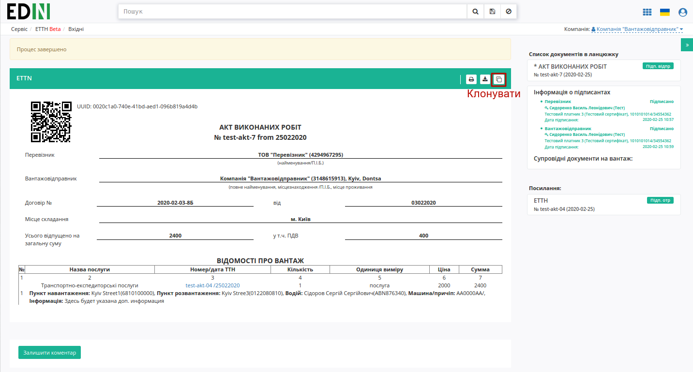

В клонованому документі можливо внести правки, після яких перед **"Підписанням"** обов'язково потрібно **"Зберегти"** документ:

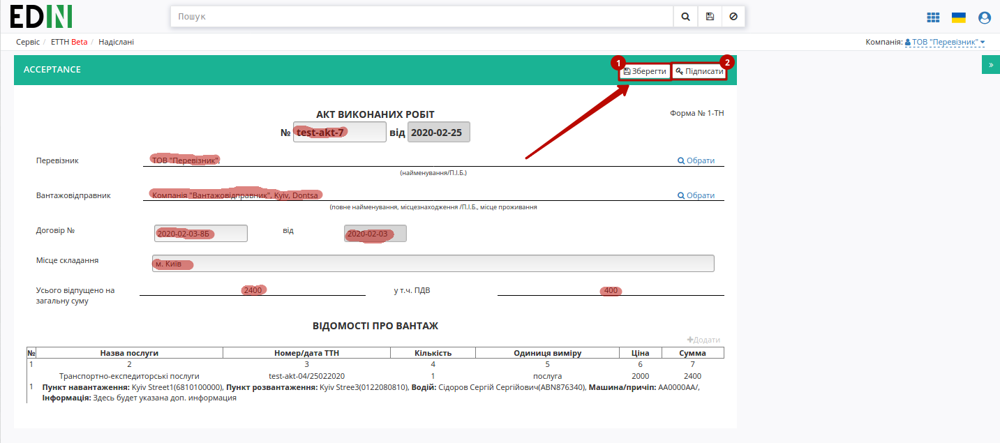

Підписаний документ можливо відправити контрагенту:

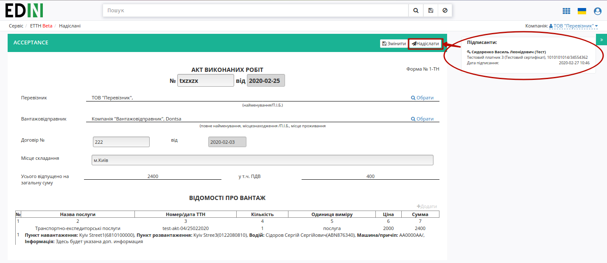

**10 Фільтрація документів для співробітників компанії**
==================================================================

В сервісі **EDIN ETTN** передбачені налаштування (на стороні адміністраторів платформи) фільтрації документів для вказаних співробітників компанії за кодом `КАТОТТГ <https://www.minregion.gov.ua/napryamki-diyalnosti/rozvytok-mistsevoho-samovryaduvannya/administratyvno/kodyfikator-administratyvno-terytorialnyh-odynycz-ta-terytorij-terytorialnyh-gromad/>`__ (по регіонах). Мається на увазі, що в рамках однієї компанії можливо налаштувати її співробітників (користувачів сервісу) таким чином, що вони будуть мати можливість переглядати і працювати лише з документами, що були відправлені "до" чи "від" їх регіону (за кодом `КАТОТТГ <https://www.minregion.gov.ua/napryamki-diyalnosti/rozvytok-mistsevoho-samovryaduvannya/administratyvno/kodyfikator-administratyvno-terytorialnyh-odynycz-ta-terytorij-terytorialnyh-gromad/>`__).

.. note::
    Співробітники (користувачі сервісу) без додаткових налаштувань можуть працювати з усіма документами в рамках компанії.

Розглянемо для прикладу компанію з 3 співробітниками:

- **Співробітник1** (м.Київ)
- **Співробітник2** (м.Харків), для якого зроблені налаштування фільтрації по `КАТОТТГ <https://www.minregion.gov.ua/napryamki-diyalnosti/rozvytok-mistsevoho-samovryaduvannya/administratyvno/kodyfikator-administratyvno-terytorialnyh-odynycz-ta-terytorij-terytorialnyh-gromad/>`__
- **Співробітник3** (м.Львів), для якого зроблені налаштування фільтрації по `КАТОТТГ <https://www.minregion.gov.ua/napryamki-diyalnosti/rozvytok-mistsevoho-samovryaduvannya/administratyvno/kodyfikator-administratyvno-terytorialnyh-odynycz-ta-terytorij-terytorialnyh-gromad/>`__ 

Після того, як ці співробіники здійснили документообіг **Співробітник2** та **Співробітник3** можуть бачити і відповідно працювати лише з документами, в яких вказано `КАТОТТГ <https://www.minregion.gov.ua/napryamki-diyalnosti/rozvytok-mistsevoho-samovryaduvannya/administratyvno/kodyfikator-administratyvno-terytorialnyh-odynycz-ta-terytorij-terytorialnyh-gromad/>`__ їх регіону (Харківського та Львівського відповідно), а **Співробітник1** може переглядати всі документи (усіх користувачів) на рівні компанії.  

**11 Коментарі до документів**
==================================================================

В сервісі **EDIN ETTN** реалізована можливість відправки коментаря до документів сервісу. Коментар може бути доступний до перегляду усім участникам документообігу або може бути "приватним" (доступним до перегляду лише співробітникам компанії, від імені якої був здійснений коментар). Для того аби коментар був приватним потрібно поставити відповідну відмітку:

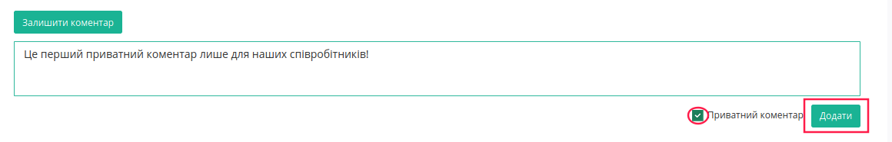

Таким чином на стороні компанії, що додає коментарі вони можуть виглядати:

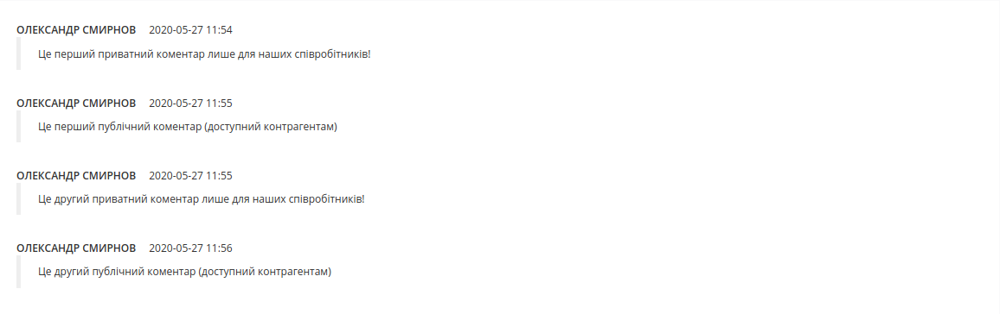

А для контрагентів доступні лише:

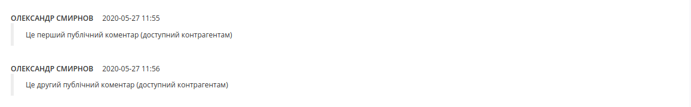

.. _mass-operations:

**12 Дії з обраними документами**
================================================

За допомогою масових операцій (кнопка **"Дії з обраними документами"**) в сервісі легко завантажувати, підписувати, видаляти одразу кілька документів в один клік! Після того, як документи/ланцюжки будуть обрані (відмічені чекером) в квадратних дужках в кнопці одразу вказується кількість обраних документів/ланцюжків: |button_counter|. При запуску масових операцій в правому нижньому куті екрану запускається віджет, що відображає :navy:`процес` та :green:`успішний` / :red:`з помилками` результат виконання поставлених задач для кожного документа/дії окремо:

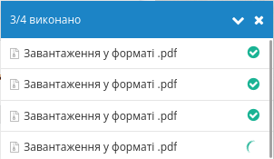

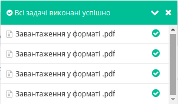

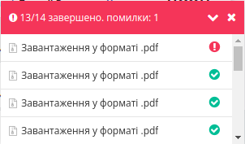

Навпроти назви документа/дії у віджеті відображається статус:

* |ring| - задача в процесі обробки;
* |success| - задача успішно виконана;
* |error| - помилка виконання задачі + |repeat| - повторити виконання дії.

Віджет можливо згорнути чи закрити навіть під час виконання задач. Віджет можливо відновити, натиснувши на іконку процесу/помилки в нижній частині екрану (віджет з усіма успішно виконаними задачами не відновлюється після закривання):

.. image:: /Vilnyi/pics_Work_with_Vilnyi/Work_with_Vilnyi_127.png

.. image:: /Vilnyi/pics_Work_with_Vilnyi/Work_with_Vilnyi_132.png

.. image:: /Vilnyi/pics_Work_with_Vilnyi/Work_with_Vilnyi_133.png

.. _mass-download:

**12.1 Масове завантаження документів у форматі .pdf**
-------------------------------------------------------------------

.. note::
   Дана операція доступна лише для наступних документів: **Акт виконаних робіт, ТТН, Акт перевантаження, Акт коригування, Акт про заміну пункту призначення вантажу**!

Масово **"Завантажити у форматі .pdf"** :underline:`документи` можливо за допомогою відповідної кнопки в **"Діях з обраними документами"**:

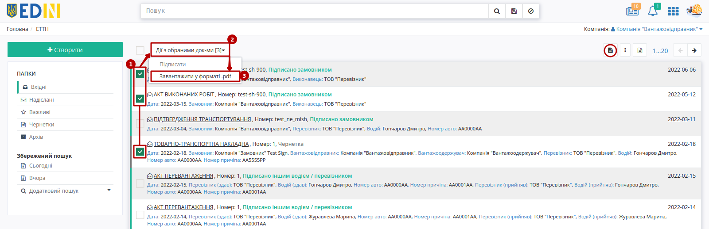

PDF-документи завантажуються у zip-архіві (найменування архіву: ``documents_[дата та час у форматі YYYYMMDDHHMMSS].zip``).

.. _mass-arch:

**12.2 Масове архівування/розархівування**
-------------------------------------------------

Будь-який :underline:`ланцюжок` документів з папок **"Вхідні" / "Надіслані" / "Важливі"** можливо вибірково чи масово (чекер в верхній частині журналу) відправити до архіву (кнопка **"Дії з обраними документами"** -> **"Архівувати"**):

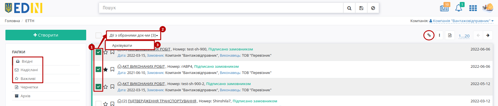

Цей процес зворотній: ланцюжки, що потрапили до архіву можливо розархівувати в такий же спосіб через кнопку **"Дії з обраними документами"** -> **"Розархівувати"**:

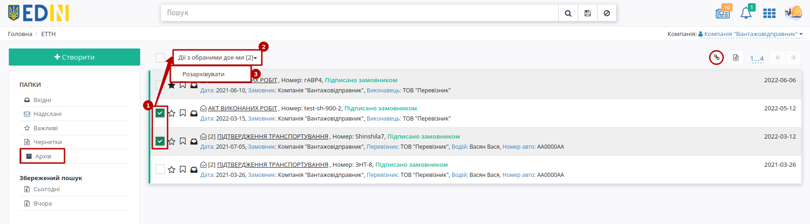

**12.3 Масове видалення чернеток**
-------------------------------------------------

Документи з **"Чернеток"** не були відправлені іншим контрагентам; ці документи можливо вибірково чи масово (чекер в верхній частині журналу) **"Видалити"**: 

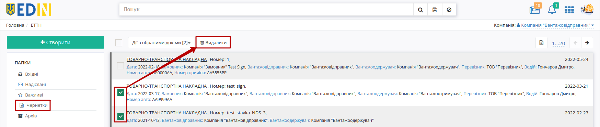

----------------------------
   
.. include:: /_constant/kontakti.rst
