"Акт приймання-передавання" на підставі "Підтвердження транспортування" (створення, підписання, відправлення та відхилення) 
#################################################################################################################################

.. role:: red

.. role:: green

.. role:: underline

.. сюда закину немного картинок для текста

.. |фільтр| image:: pics_Work_with_acceptance_certificate/Work_with_acceptance_certificate_01.png

.. |drop_pass| image:: signing/drop_pass.png

.. |del_key| image:: signing/del_key2.png

.. :underline:`"Чернетки" для ролі "Організатор"`

.. contents:: Зміст:
   :depth: 3

---------

При формуванні "Акта приймання-передавання" ініціатором документа виступає **"Вантажовідправник"** (в сервісі ETTN передбачені 3 основні ролі учасників документообігу: **"Вантажовідправник"**, **"Перевізник"**, **"Вантажоотримувач"**). Обмін документом здійснюється між **"Вантажовідправником"** та **"Вантажоодержувачем"**

:green:`"Вантажовідправник" -> "Вантажоотримувач"`

.. important::
   Функціонал створення актів доступний для компанії з роллю **"Вантажовідправника"**

**1 Створення "Акта приймання-передавання" "Вантажовідправником"**
==============================================================================

.. important::
   Створити "Акта приймання-передавання" можливо лише на підставі підписаного з обох сторін "Підтвердження транспортування" (детальніше про `"Підтвердження транспортування" <https://wiki.edin.ua/uk/latest/ETTN_2_0/Creation_signing_ending_rejection_Proposal.html#confirmation>`__ )) 

Для того аби створити "Акт приймання-передавання" потрібно перейти до каталогу **"Вхідні"** (1) та в розділі **"Додатковий пошук"** (2) скористатись |фільтр| фільтром **"Для актів приймання-передавання"** (3), що дозволяє відсортувати "Підтвердження транспортування", на підставі яких може бути створений відповідний акт.

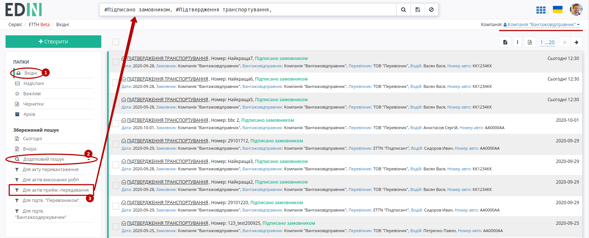

В журналі з відібраними документами потрібно вибрати один зі списку та відкрити його. У відкритому документі натиснути кнопку "Створити Акт":

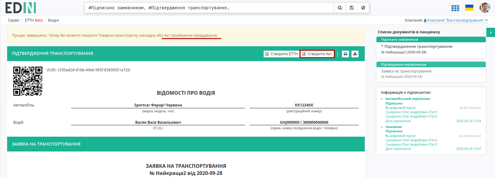

Якщо в "Підтвердженні транспортування" в табличній частині було вказано кілька **"Вантажоотримувачів"**, то при створенні "Акта приймання-передавання" платформа запитає для якого вантажоотримувача потрібно створювати документ:

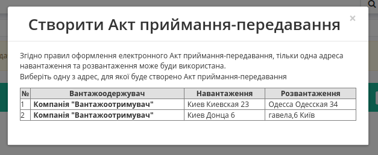

Далі відкриється форма "Акта приймання-предавання" з уже заповненою датою документа, Замовником та Виконавцем (дані контрагентів підтягуються з "Підтвердження транспортування"): 

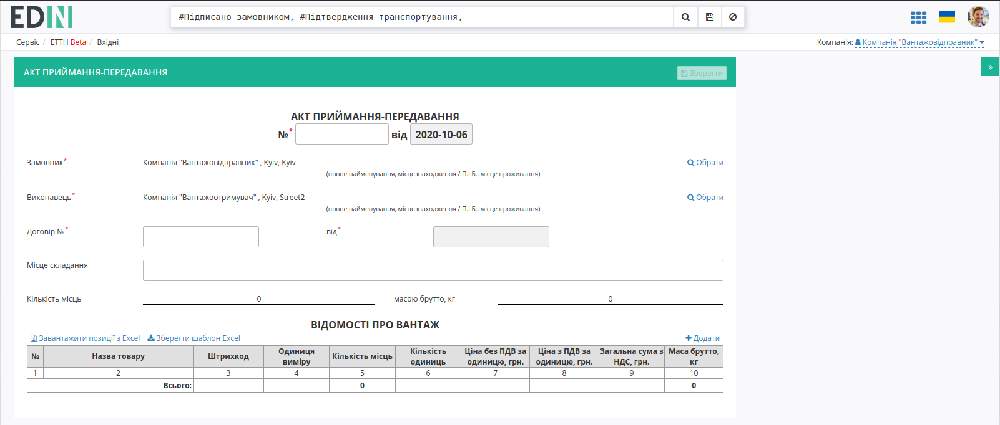

Окрім обов'язкових до заповнення номеру та дати договору потрібно додати (кнопка "Додати") та заповнити табличку частину "Відомості про вантаж":

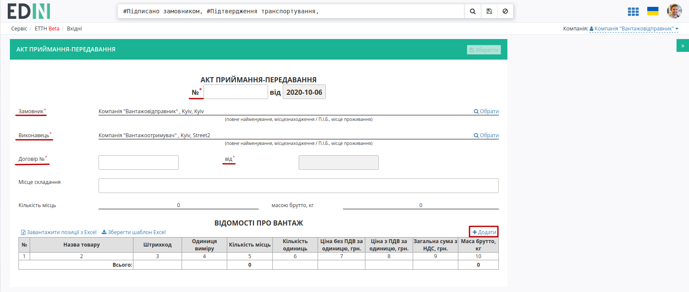

У модальному вікні обов'язкові до заповнення поля позначені червоною зірочкою :red:`*` :

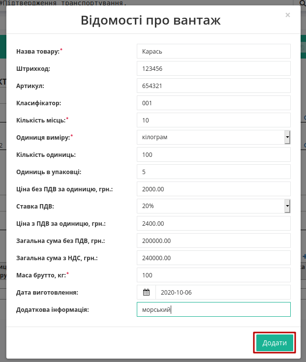

Також для додавання табличних даних (вантаж) є можливість скористатись шаблоном. Для цього над таблицею необхідно натиснути **"Зберегти шаблон Excel"** (1).

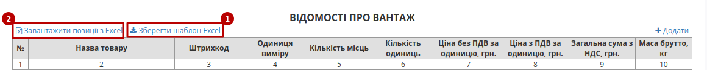

На Ваш комп’ютер буде завантажено файл з назвою **acceptance_products_sample.xlsx**. Відкривши його, необхідно внести інформацію про вантаж.

Як і в web-формі бов’язковими до заповнення є наступні поля:

* Назва товару
* Кількість місць
* Одиниці виміру
* Маса брутто, кг

.. important:: Ні в якому разі не змінювати формат шаблону, не видаляти або додавати нові стовпці. Також не допускається зміна формату комірок.

Після збереження заповненої інформації завантажуємо файл на web-портал, скориставшись кнопкою **"Завантажити позиції з Excel"** (2).

.. important:: Якщо завантажений файл не відповідає очікуваному формату, то система повідомить про це "Звітом про помилки":

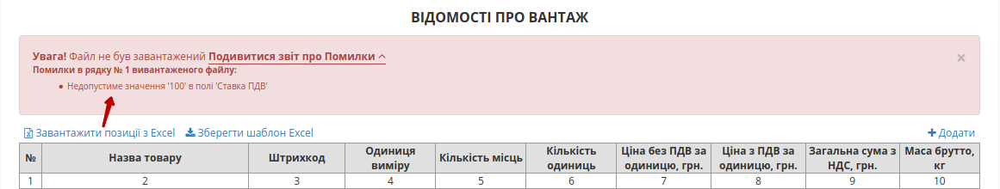

За необхідністю є можливість доповнювати таблицю вантажів (активні кнопки **"Додати"** та **"Завантажити позиції з Excel"**).

Для редагування інформації щодо вантажу необхідно навести курсор на рядок цього вантажу та натиснути "Змінити", для видалення – "Видалити".

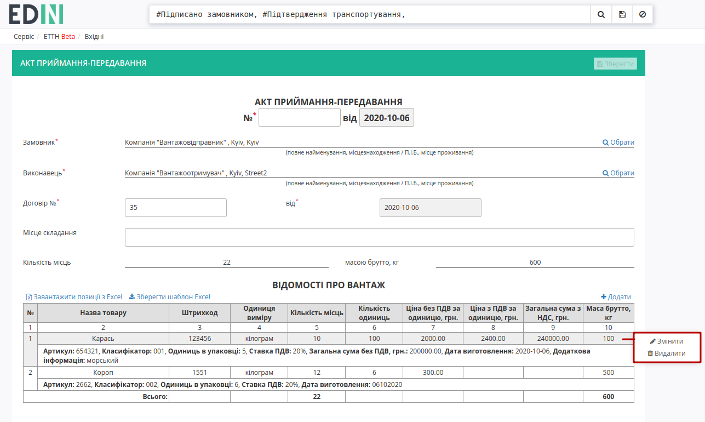

Загальна інформація по вантажу в полях "Кількість місць" і "Маса бруто" підтягується з таблиці автоматично:

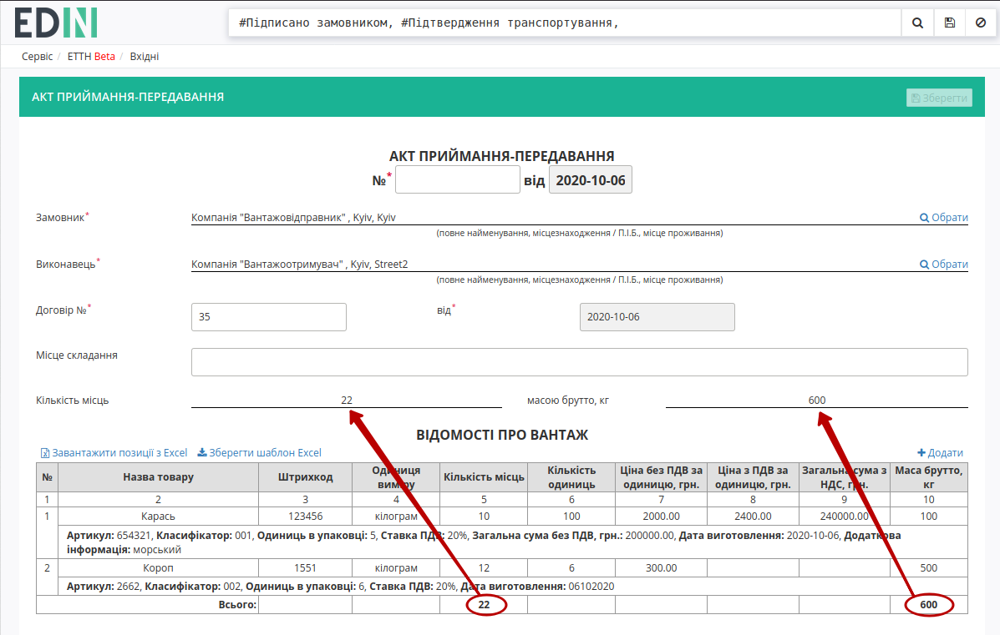

Після того, як документ буде заповнений його потрібно **"Зберегти"** (документ потрапить в "Чернетки") :

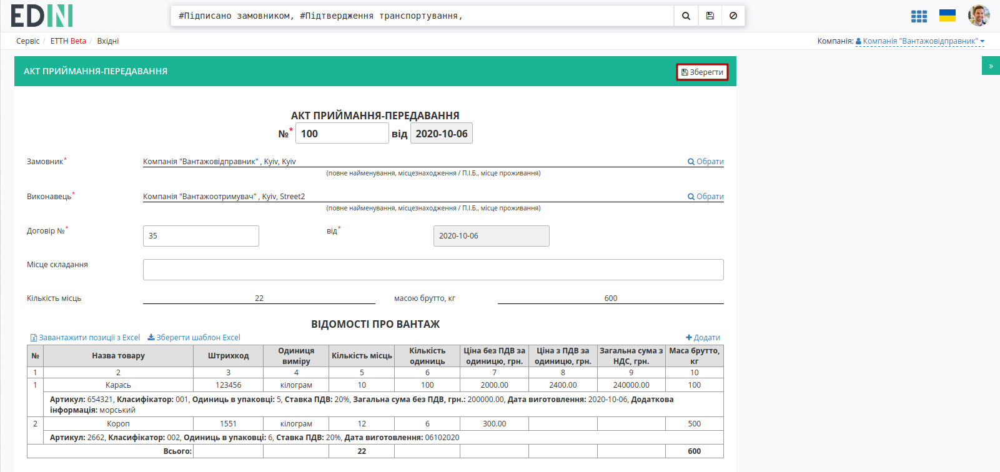

Після всіх подальших змін в "Акті приймання-передавання" його можливо, за необхідності, повторно **"Зберегти"** (1) та **"Підписати"** (2):

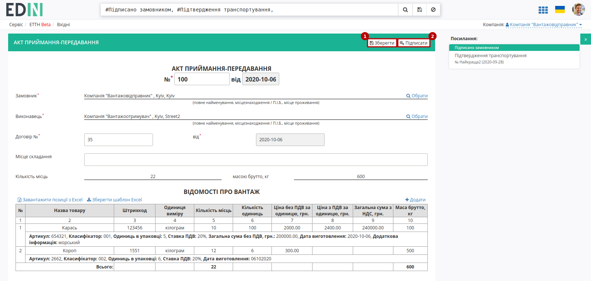

.. _sign:

**1.1 Підписання та відправка "Акта приймання-передавання" "Вантажовідправником"**
-----------------------------------------------------------------------------------------

.. include:: /_constant/atb_check/atb_check.rst
   :start-after: .. початок блоку для ATB_check
   :end-before: .. кінець блоку для ATB_check

.. tabs::

   .. tab:: Файловий ключ

      .. include:: /_constant/signing/signing.rst
         :start-after: .. початок блоку для Signing
         :end-before: .. кінець блоку для Signing

   .. tab:: Token

      .. include:: /_constant/token_signing/token_signing.rst
         :start-after: .. початок блоку для TokenSign
         :end-before: .. кінець блоку для TokenSign

   .. tab:: Гряда

      .. include:: /_constant/gryada_signing/gryada_signing.rst
         :start-after: .. початок блоку для GryadaSign
         :end-before: .. кінець блоку для GryadaSign

   .. tab:: Cloud

      .. include:: /_constant/cloud_signing/cloud_signing.rst
         :start-after: .. початок блоку для CloudSign
         :end-before: .. кінець блоку для CloudSign

Після підписання "Акта приймання-передавання" інформація щодо підписанта відображається в блоці "Підписанти", а документ можливо **"Надіслати"**:

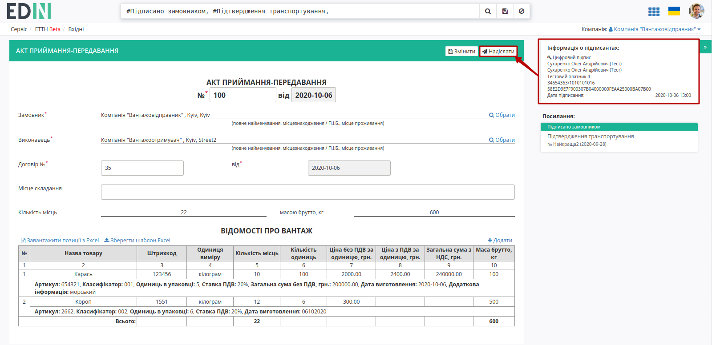

У **"Вантажовідправника"** відправлений документ відображається у **"Надіслані"** зі статусом **"Очікує підписання виконавцем"** (**Вантажоотримувач**).

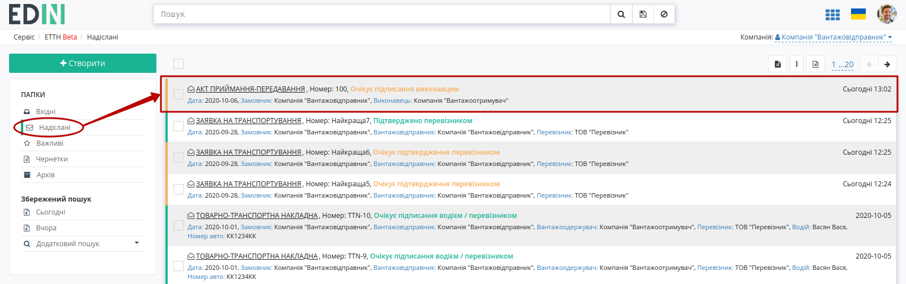

Відправлений "Акт приймання-передавання" має наступний вигляд:

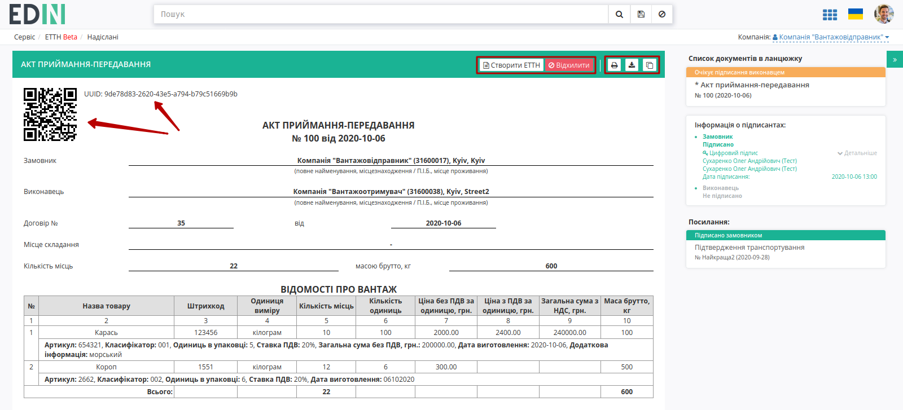

На формі "Акта приймання-передавання" у лівій верхній частині відображаються QR-код та унікальний ідентифікатор документа.

Користувач може скористатись функціоналом для "Друку", "Завантаження" чи "Клонування"; також у разі виявлення помилки в документі у **"Вантажовідправника"** є можливість відхилити відправлений "Акт приймання-передавання" до підписання **"Вантажоодержувачем"**. Для цього потрібно натиснути на кнопку **"Відхилити"**.

**1.2 Відхилення "Акта приймання-передавання" "Вантажовідправником"**
----------------------------------------------------------------------------------------

Для того, щоб відхилити документ (документ доступний **до підписання "Вантажоодержувачем"**) потрібно натиснути **"Відхилити"**. 

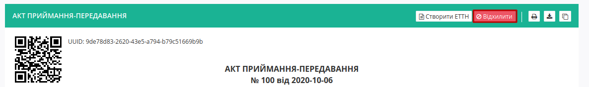

Після чого в модульному вікні обов'язково потрібно заповнити причину відміни документа:

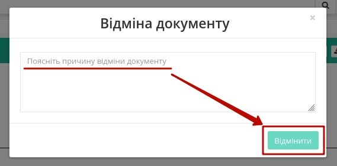

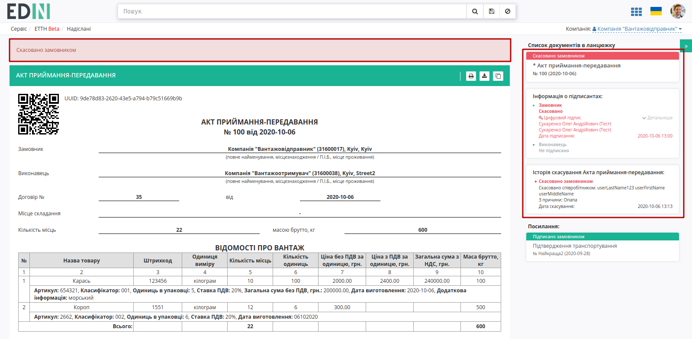

На платформі відображається повідомлення та змінюється статус документа в ланцюжку на **"Скасовано замовником"**.

**2 Отримання "Акта приймання-передавання" "Вантажоодержувачем"**
=================================================================================================================

Відправлений з боку **"Вантажовідправника"** "Акт приймання-передавання" відображається в папці "Вхідні".

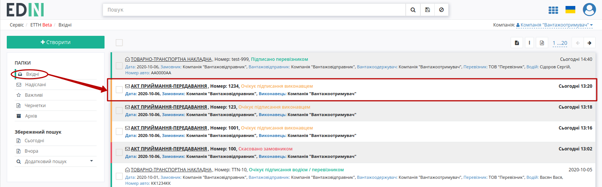

Вхідний підписаний документ можливо "Підписати" чи "Відхилити".

**2.1 Підписання "Акта приймання-передавання" "Вантажоодержувачем"**
----------------------------------------------------------------------------

Для підписання документу потрібно натиснути на кнопку **"Підписати"**:

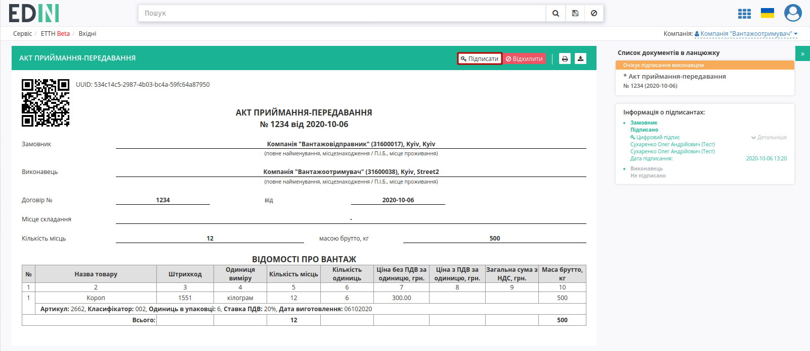

.. hint::
    Процес підписання **"Вантажоодержувачем"** не відрізняється від підписання **"Вантажовідправником"** та описаний в `розділі вище <https://wiki.edin.ua/uk/latest/ETTN_2_0/Work_with_acceptance_certificate.html#sign>`__ . 

Після підписання документ змінює свій статус на **"Підписано виконавцем"**, система повідомляє про завершення документообігу інформаційним повідомленням в формі документу:

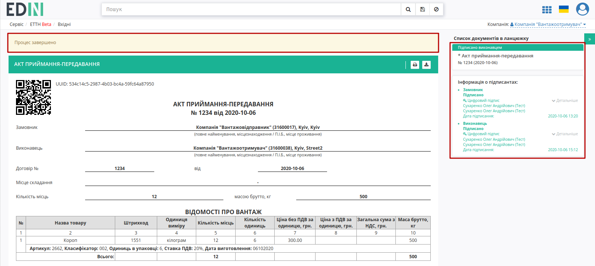

**2.2 Відхилення "Акта приймання-передавання" "Вантажоодержувачем"**
----------------------------------------------------------------------------

У **"Вантажоотримувача"** є можливість відхилити отриманий "Акт приймання-передавання". Для цього потрібно натиснути на кнопку **"Відхилити"**. Після чого в модульному вікні обов'язково потрібно заповнити причину відміни документа:

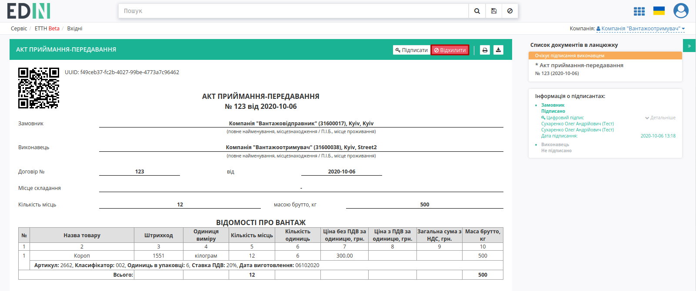

Для відхиленого **"Вантажоодержувачем"** "Акта приймання-передавання" присвоюється статус **"Скасовано виконавцем"**.

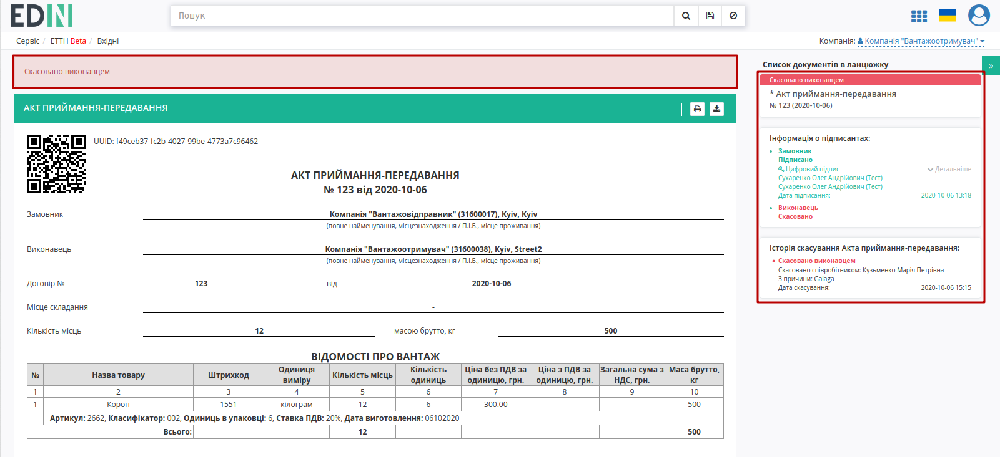

Документ з цим статусом відображається у "Вхідних" **"Вантажоотримувача"** - документообіг завершено.

-----------------------------------

.. include:: kontakti.rst