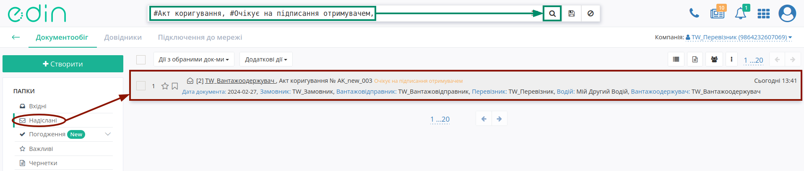
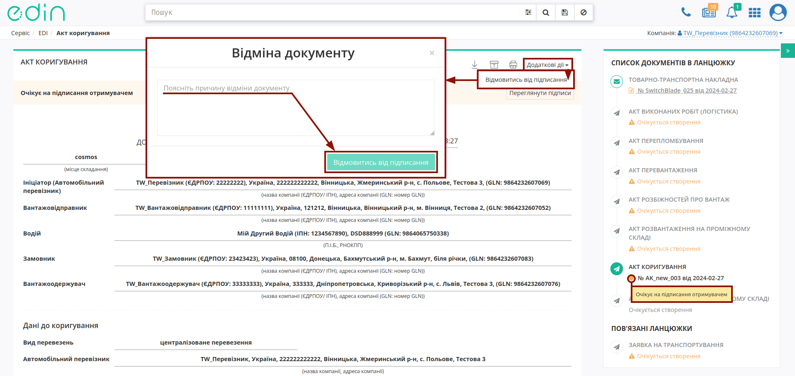
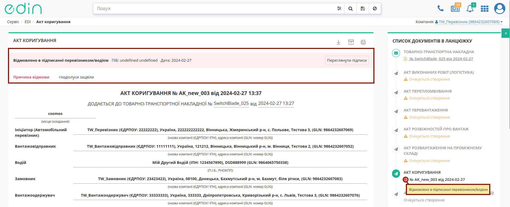
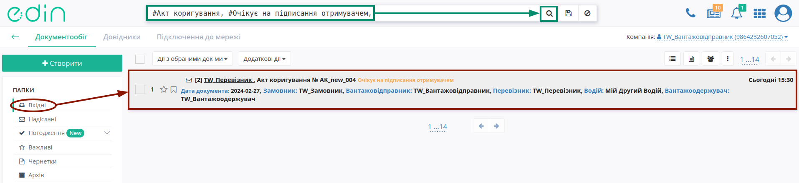
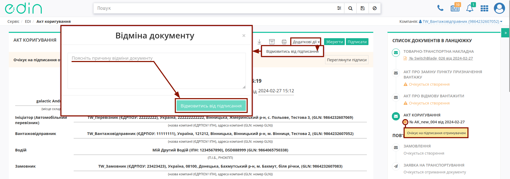
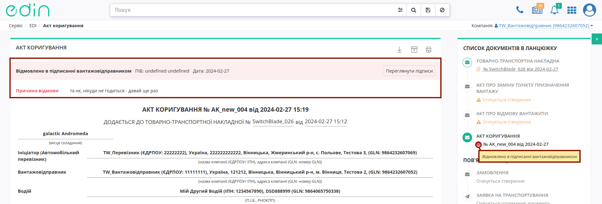

Відхилення "Акта коригування"
####################################################################################################################################

.. role:: red

.. role:: green

.. role:: orange

.. role:: underline

.. contents:: Зміст:
   :depth: 3

---------

Серед передбачених в сервісі "EDI Network" ролей учасників **Ініціатором** "Акта коригування" може виступати: **"Замовник"**, **"Вантажовідправник"**, **"Перевізник/Водій"**, **"Вантажоодержувач"**.

Відхилити "Акт коригування" можливо:

   * зі сторони **Ініціатора** поки документ перебуває в статусі :orange:`"Очікує на підписання отримувачем"` тобто поки Отримувачі не підписали документ;
   * зі сторони **Отримувача"** Акта поки документ перебуває в статусі :orange:`"Очікує на підписання отримувачем"` (до підписання).

.. _initiator-reject:

**1 Відхилення "Акта коригування" Ініціатором**
=============================================================================================================================

Для відхилення "Акта коригування" **Ініціатору** (відправнику документа) в сервісі "EDI Network" потрібно перейти в **"Надіслані"** та вибрати **"Акт коригування"** в статусі :orange:`"Очікує на підписання отримувачем"` (для зручності можливо скористатись рядком `пошуку <https://wiki.edin.ua/uk/latest/general_2_0/rabota_s_platformoj_EDIN_2.0.html#doc-search>`__):

Далі у випадаючому списку під кнопкою **"Додаткові дії"** потрібно обрати дію **"Відмовитись від підписання"** (в модульному вікні обов'язково потрібно заповнити причину відхилення документа та підтвердити дію - **"Відмовитись від підписання"**):

Після відхилення документ змінює свій статус на :red:`"Відхилено в підписанні [роль ініціатора]"`, а кінцевий статус документа разом з ПІБ особи, що відмовилась від підписання, датою та текстом причини відхилення відображається в шапці документа:

Після відхилення Акта функціонал по роботі з "е-ТТН" знову стає доступним.

.. _receiver-reject:

**2 Відхилення "Акта коригування" Отримувачем Акта**
==================================================================================================================

Для відхилення "Акта коригування" **Отримувачу** документа потрібно перейти у **"Вхідні"** та вибрати **"Акт коригування"** в статусі :orange:`"Очікує на підписання отримувачем"` (для зручності можливо скористатись рядком `пошуку <https://wiki.edin.ua/uk/latest/general_2_0/rabota_s_platformoj_EDIN_2.0.html#doc-search>`__):

Далі у випадаючому списку під кнопкою **"Додаткові дії"** потрібно обрати дію **"Відмовитись від підписання"** (в модульному вікні обов'язково потрібно заповнити причину відхилення документа та підтвердити дію - **"Відмовитись від підписання"**):

Після відхилення документ змінює свій статус на :red:`"Відмовлено в підписанні [роль отримувача]"`, а кінцевий статус документа разом з ПІБ особи, що відмовилась від підписання, датою та текстом причини відхилення відображається в шапці документа:

Після відхилення Акта функціонал по роботі з "е-ТТН" знову стає доступним.

---------------------------------

.. include:: /_constant/kontakti.rst

