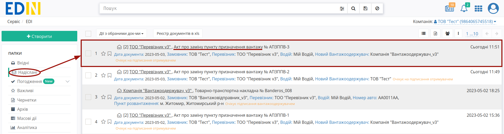
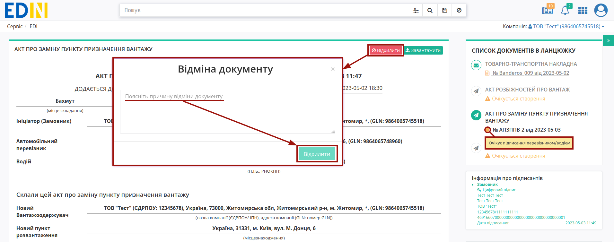
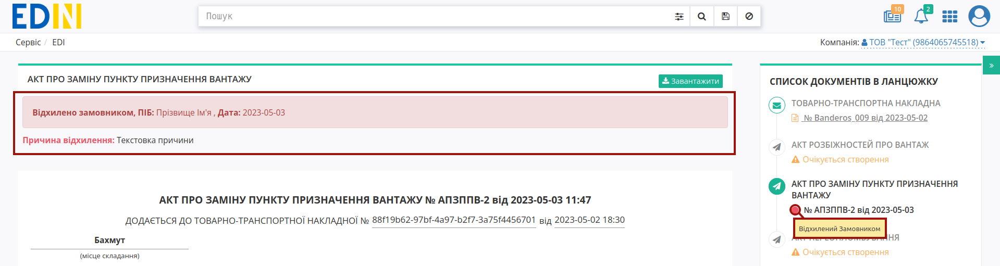
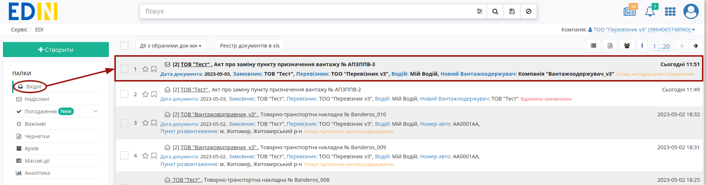
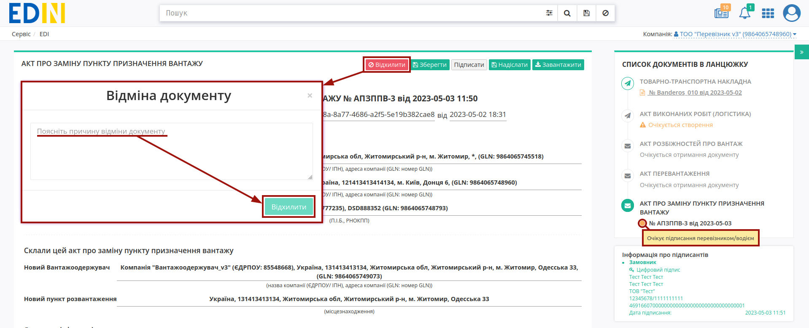
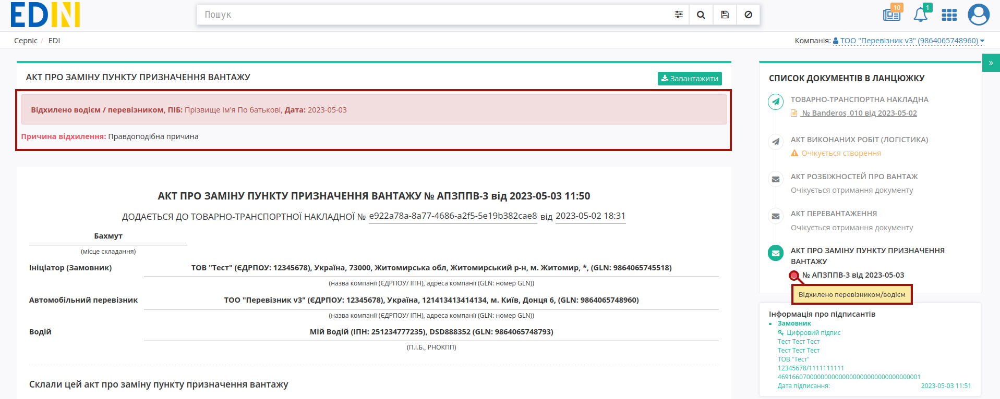

Відхилення "Акта про заміну пункту призначення вантажу"
####################################################################################################################################

.. role:: red

.. role:: green

.. role:: orange

.. role:: underline

.. contents:: Зміст:
   :depth: 3

---------

При роботі з транспортними документами передбачені 4 основні ролі учасників документообігу: **"Замовник"**, **"Вантажовідправник"**, **"Перевізник"**, **"Вантажоотримувач"**. Ініціатором відхилення "Акта про заміну пункту призначення вантажу", в залежності від налаштованої `схеми обміну <https://wiki.edin.ua/uk/latest/ETTN_3_0/Create_Consignee_Change_Act_from.html>`__, може виступати будь-яка роль (**"Ініціатор"** відхилення). 

Відхилити "Акт про заміну пункту призначення вантажу" можливо:

   * зі сторони Ініціатора Акта поки документ перебуває в статусі :orange:`"Очікує підписання перевізником/водієм" / "Очікує підписання замовником"` тобто поки Отримувач (**"Перевізник"** / **"Замовник"**) не підписав документ;
   * зі сторони одного з Отримувачів Акта (**"Перевізник"** / **"Замовник"**) поки документ перебуває в статусі :orange:`"Очікує підписання перевізником/водієм" / "Очікує підписання замовником"` відповідно.

.. _initiator-reject:

**1 Відхилення "Акта про заміну пункту призначення вантажу" Ініціатором (Вантажовідправник/Вантажоодержувач/Перевізник/Замовник)**
========================================================================================================================================

Для відхилення "Акта про заміну пункту призначення вантажу" **"Ініціатору"** (відправнику документа) потрібно перейти в **"Надіслані"** та відкрити потрібний документ: 

Документ можливо **"Відхилити"** за допомогою відповідної кнопки (в модульному вікні обов'язково потрібно заповнити причину відхилення документа):

Після відхилення документ змінює свій статус на:

* для ініціатора "Вантажовідправника" **=>** **"Відхилено вантажовідправником"**
* для ініціатора "Вантажоодержувача" **=>** **"Відхилено вантажоодержувачем"**
* для ініціатора "Перевізника" **=>** **"Відхилено перевізником / водієм"**
* для ініціатора "Замовника" **=>** **"Відхилено замовником"**

Кінцевий статус документа разом з датою та текстом причини відхилення відображається в шапці документа:

Після відхилення Акта функціонал по роботі з "е-ТТН" знову стає доступним.

.. _receiver-reject:

**2 Відхилення "Акта про заміну пункту призначення вантажу" Отримувачем Акта (Перевізник/Замовник)**
==================================================================================================================

Для відхилення "Акта про заміну пункту призначення вантажу" Отримувачу документа потрібно перейти в **"Вхідні"** та відкрити потрібний документ: 

Документ можливо **"Відхилити"** за допомогою відповідної кнопки (в модульному вікні обов'язково потрібно заповнити причину відхилення документа):

Після відхилення документ змінює свій статус на:

* для отримувача "Перевізника" **=>** **"Відхилено перевізником / водієм"**
* для отримувача "Замовника" **=>** **"Відхилено замовником"**

Кінцевий статус документа разом з датою та текстом причини відхилення відображається в шапці документа:  

Після відхилення Акта функціонал по роботі з "е-ТТН" знову стає доступним.

---------------------------------

.. include:: /_constant/kontakti.rst

