Створення "Акта коригування" до е-ТТН
###################################################################################################

.. картинки в текст

.. |лупа| image:: /_constant/icons/magnifying_glass.png

.. |будинок| image:: /_constant/icons/house.png

.. |pencil_stencil| image:: /_constant/icons/pencil_stencil.png

.. |лупа2| image:: /_constant/icons/magnifying_glass2.png

.. |trash| image:: /_constant/icons/trash.png

.. role:: red

.. role:: green

.. role:: orange

.. role:: underline

.. contents:: Зміст:
   :depth: 3

---------

В разі виявлення помилки в реквізитах "е-ТТН" є можливість створити і зберегти "Акт коригування", щоб зафіксувати в ньому правильні реквізити "е-ТТН".

Серед передбачених в сервісі "EDI Network" ролей учасників ініціатором "Акта коригування" може виступати: **"Замовник"**, **"Вантажовідправник"**, **"Перевізник/Водій"**, **"Вантажоодержувач"**. 

.. attention::
   Акт коригування складається Замовником або будь-яким іншим учасником е-ТТН, що ініціює виправлення помилки. В залежності від стадії перевезення набір сторін-підписувачів може змінюватись. Так, **Акт підписується всіма учасниками перевезення, які заявлені в мета-даних е-ТТН і накладали свій підпис на документ у процесі перевезення** , при цьому учасники, які ще не накладали підпис на е-ТТН (наприклад, Вантажоодержувач), можуть не підписувати Акт.

.. приховали через неточність:

   Схема і послідовність підписання документа "Акт коригування" в залежності від ролі Ініціатора:

   1) "Вантажовідправник" **=>** :green:`"Вантажовідправник" -> "Перевізник" -> "Вантажоодержувач"` (3 підписанти)

   2) "Перевізник" **=>** :green:`"Перевізник" -> "Вантажовідправник" -> "Вантажоодержувач"` (3 підписанти)

   3) "Вантажоодержувач" **=>** :green:`"Вантажоодержувач" -> "Вантажовідправник" -> "Перевізник"` (3 підписанти)

   4) "Замовник" **=>** :green:`"Замовник" -> "Вантажовідправник" -> "Перевізник" -> "Вантажоодержувач"` (4 підписанти)

"Акт коригування" створюється на підставі "е-ТТН", що вже підписаний **Перевізником** (документ має статус :orange:`"Очікує підписання вантажоодержувачем"`) чи **Вантажоодержувачем** (документ має статус :green:`"Підписано вантажоодержувачем"`).

.. _create-from-ttn:

**1 Створення "Акта коригування" на підставі "е-ТТН"**
================================================================================================================================

Розглянемо створення "Акта коригування" в сервісі "EDI Network" з боку **Перевізника** на прикладі підписаного трьома сторонами "е-ТТН" (в статусі :green:`"Підписано вантажоодержувачем"`):

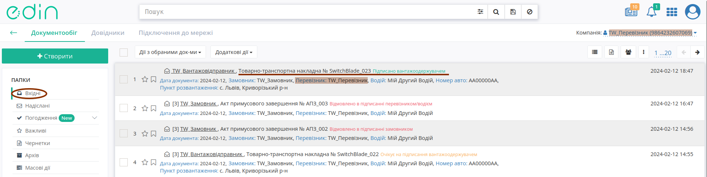

У відкритому документі натисніть **"Створити документ"** "Акт коригування" в блоці `ланцюжка документів <https://wiki.edin.ua/uk/latest/_constant/chain/chain.html>`__:

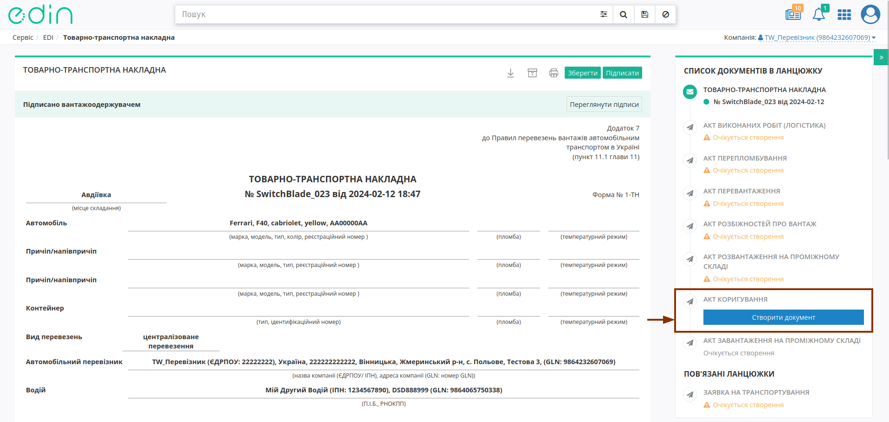

При створенні документа "Акта коригування" його форма в значній мірі автоматично заповнюється даними (дані **"Перевізника"**, **"Вантажовідправника"**, **"Водія"**, **"Замовника"**, **"Вантажоодержувача"**) з "е-ТТН", як документа-підстави: 

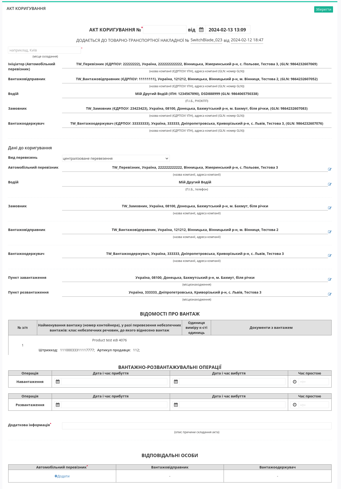

Потрібно зазначити номер Акта (автоматично проставляється поточна дата та час створення документа) та місце його складання (обов'язкові до заповнення поля позначені червоною зірочкою :red:`*`). "Акт коригування" складається з незмінного блоку з даними "е-ТТН" та **Даних до коригування** - дані в цьому блоці також заповнюються, але доступні до редагування:

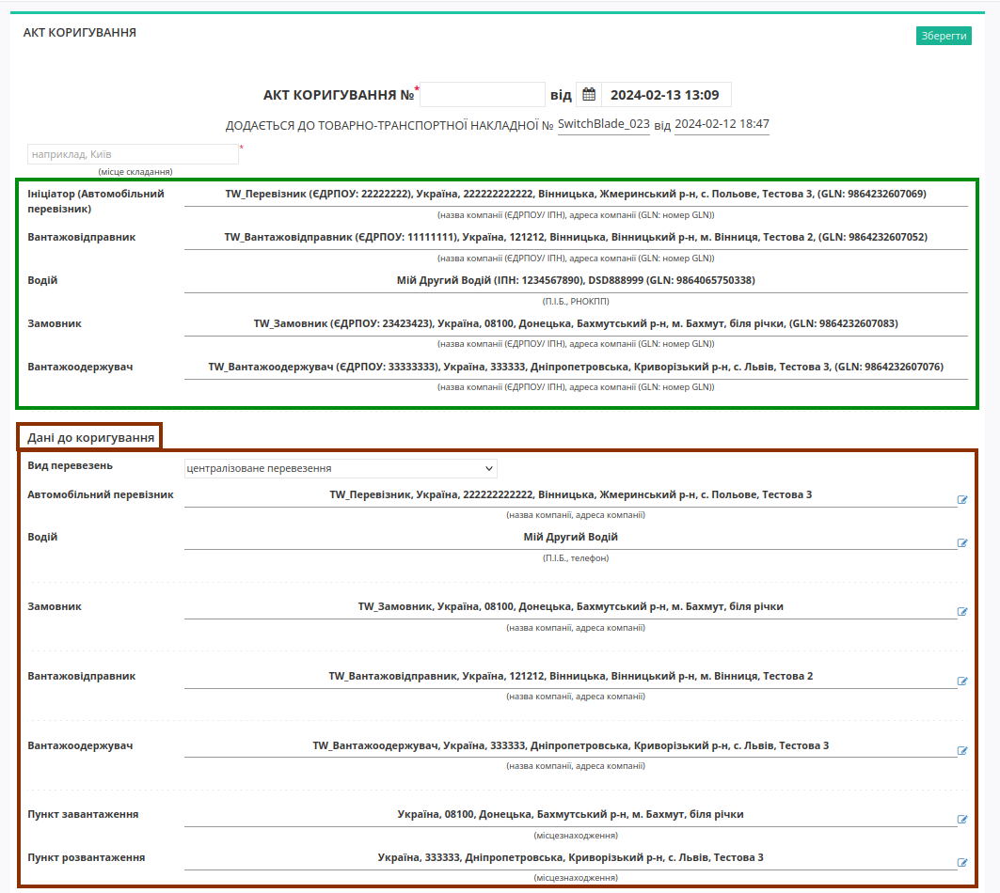

При коригуванні даних **"Перевізника"** / **"Замовника"** / **"Вантажовідправника"** / **"Вантажоодержувача"** відкривається модальне вікно **"Дані компанії"** для **"Зміни"** одного чи кількох полів блоку контрагента:

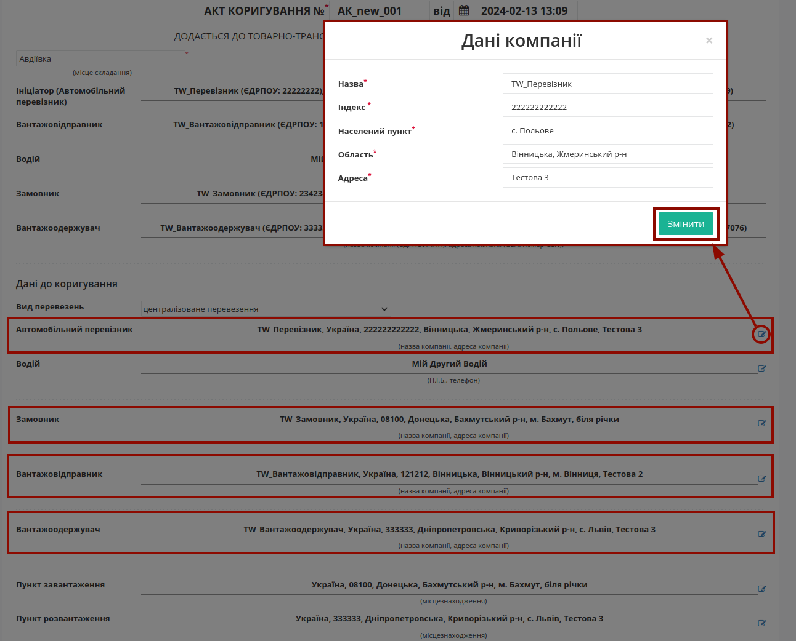

При коригуванні даних **"Водія"** в модальнму вікні **"Відповідальної особи"** можливо **"Змінити"** ПІБ та/або номер телефону:

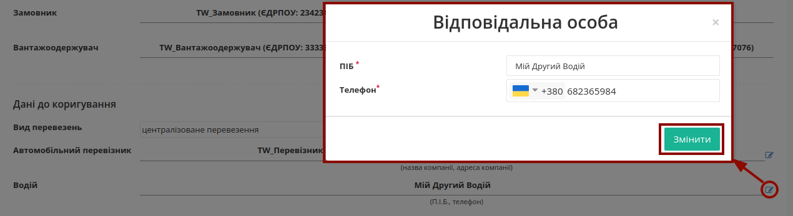

При коригуванні даних **"Пункту завантаження"** / **"Пункту розвантаження"** в модальнму вікні **"Місцезнаходження"** можливо **"Змінити"** назву та адресу пункту:

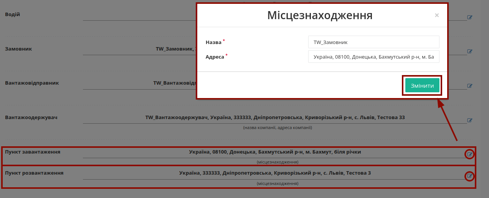

Для коригування **Відомостей про вантаж** (табличну частину) потрібно натиснути **"Змінити"** навпроти бажаної позиції, внести зміни в модальному вікні з даними та **"Змінити"**, натиснувши одноіменну кнопку:

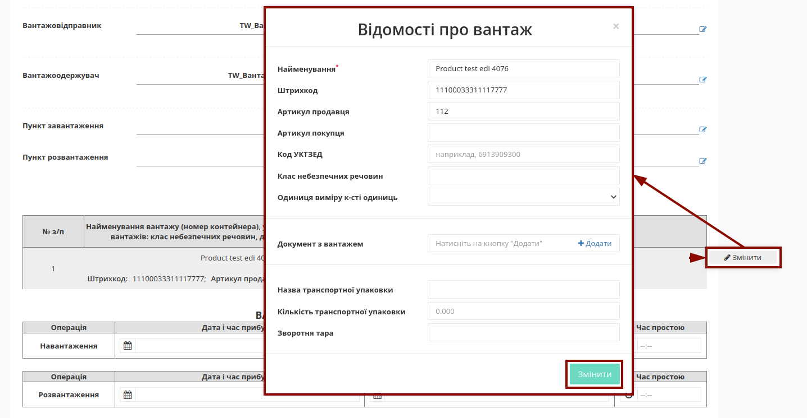

До кожної позиції також можливо змінити чи **"+Додати"** дані про документ з вантажем:

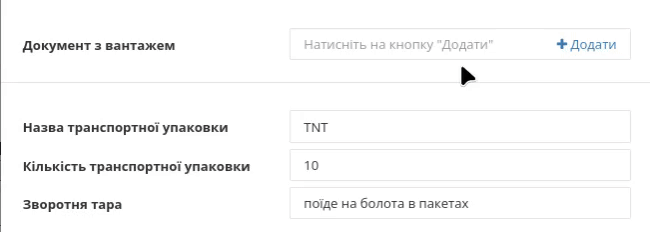

Для коригування дати і часу **Вантажно-розвантажувальних операцій** передбачений зручний календар та годинник: 

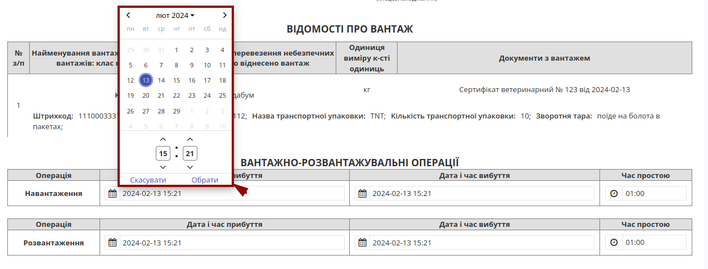

При формуванні "Акта коригування" обов'язково заповнюється поле **"Додаткова інформація"** з описом причини складання Акта!

В документі також обов'язково зазначається відповідальна/-ні особи **Ініціатора** акта (в нашому прикладі **"Перевізника"**) за допомогою кнопки **"+Додати"**. Дані раніше доданих відповідальних осіб можливо обрати з віртуального довідника чи видалити зі списку за допомогою |trash|:

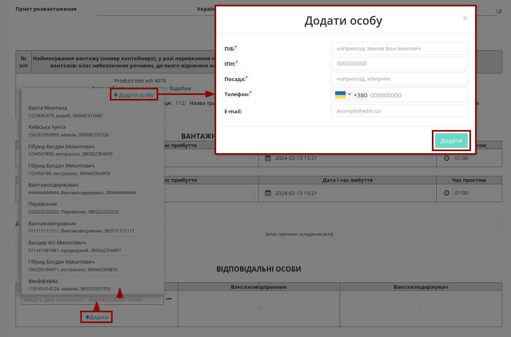

Довідник автоматично наповнюється при додаванні нового відповідального (кнопка **"+Додати особу"**). При додаванні нового відповідального в модальному вікні потрібно заповнити обов'язкові контактні дані (обов'язкові поля позначені червоною зірочкою :red:`*`).

Редагувати дані раніше введених осіб можливо за допомогою кнопки **"Змінити"** (|pencil_stencil|):

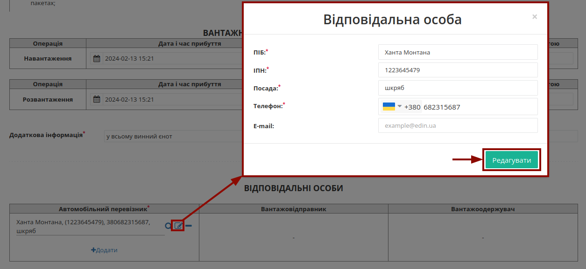

За потреби можливо **"Обрати"** (|лупа2|) іншу особу замість обраної/доданої раніше.

.. hint::
   **При підписанні:** якщо поле Вашої **"Відповідальної особи"** :underline:`незаповнене`, то воно може автоматично заповнюватись даними з Вашого ЕЦП (якщо це можливо).

Після того, як обов'язкові дані будуть введені потрібно **"Зберегти"**, **"Підписати"** та **"Надіслати"** документ (кнопки в правій верхній частині форми документа відображаються для виконання потрібної дії):

.. image:: /_constant/signing/universal_button.gif
   :align: center

.. _sign:

**1.1 Підписання та відправка "Акта коригування" Ініціатором**
------------------------------------------------------------------------------------------------------------

.. include:: /_constant/atb_check/atb_check.rst
   :start-after: .. початок блоку для ATB_check
   :end-before: .. кінець блоку для ATB_check

.. tabs::

   .. tab:: Файловий ключ

      .. include:: /_constant/signing/signing.rst
         :start-after: .. початок блоку для Signing
         :end-before: .. кінець блоку для Signing

   .. tab:: Token

      .. include:: /_constant/token_signing/token_signing.rst
         :start-after: .. початок блоку для TokenSign
         :end-before: .. кінець блоку для TokenSign

   .. tab:: Гряда

      .. include:: /_constant/gryada_signing/gryada_signing.rst
         :start-after: .. початок блоку для GryadaSign
         :end-before: .. кінець блоку для GryadaSign

   .. tab:: Дія.Підпис

      .. include:: /_constant/diya_signing/diya_signing.rst
         :start-after: .. початок блоку для DiyaPidps
         :end-before: .. кінець блоку для DiyaPidps

   .. tab:: Cloud

      .. include:: /_constant/cloud_signing/cloud_signing.rst
         :start-after: .. початок блоку для CloudSign
         :end-before: .. кінець блоку для CloudSign

Після підписання "Акта коригування" відображається "Інформація про підписантів", а документ можливо **"Надіслати"**:

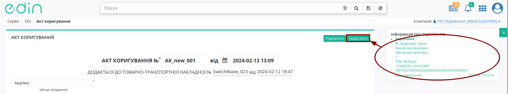

Після відправки автоматично відкривається папка **"Надіслані"**, де надісланий акт відображається зі статусом :orange:`"Очікує на підписання отримувачем"`:

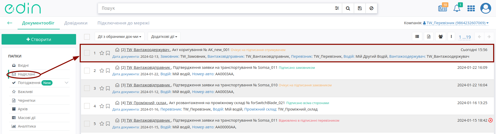

Після відправки у пов'язаного документа "е-ТТН" при його перегляді в блоці `ланцюжка документів <https://wiki.edin.ua/uk/latest/_constant/chain/chain.html>`__ відобрається створений Акт і виводиться повідомлення про обмежені дії з документом до кінця життєвого циклу акта (поки всі учасники "Акта коригування" не підпишуть документ або один з учасників не відхилить документ):

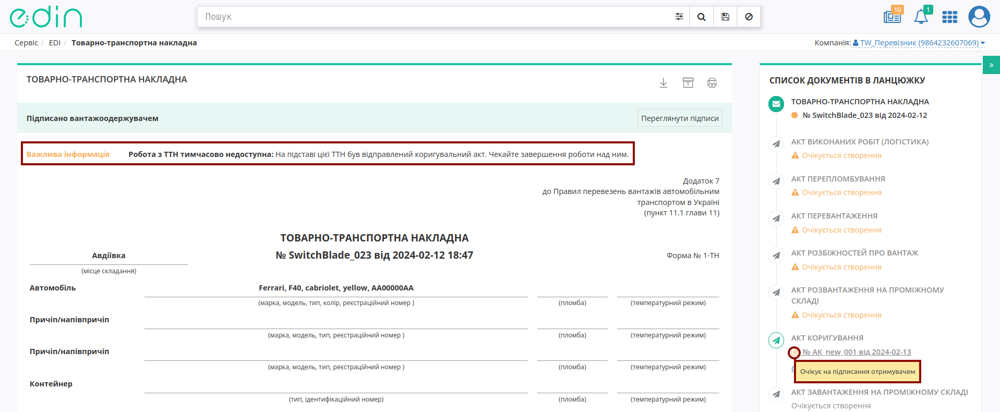

-------------------------------------

.. include:: /_constant/kontakti.rst

