Створення "Акта про заміну пункту призначення вантажу" на базі інших електронних документів
###################################################################################################

.. сюда закину немного картинок для текста + юзаєм спільні зображення

.. |лупа| image:: /_constant/icons/magnifying_glass.png

.. |будинок| image:: /_constant/icons/house.png

.. |pencil_stencil| image:: /_constant/icons/pencil_stencil.png

.. |лупа2| image:: /_constant/icons/magnifying_glass2.png

.. |trash| image:: /_constant/icons/trash.png

.. role:: red

.. role:: green

.. role:: orange

.. role:: underline

.. contents:: Зміст:
   :depth: 3

---------

Документ "Акт про заміну пункту призначення вантажу" можливо створити на підставі "е-ТТН", що вже підписаний **Перевізником** (документ має статус "Очікує підписання вантажоодержувачем"). Ініціатором "Акта про заміну пункту призначення вантажу" може виступає будь-який учасник, що відмовляється прийняти вантаж (при роботі з транспортними документами передбачені 4 основні ролі учасників документообігу: **"Замовник"**, **"Вантажовідправник"**, **"Перевізник"**, **"Вантажоотримувач"**).

"Акт про заміну пункту призначення вантажу" складається у випадку:

   * заміни Пункту розвантаження
   * заміни Вантажоодержувача та Пункту розвантаження

.. include:: /API_ETTNv3_1/Work_with_API/ConsigneeChangeActv3_API_work.rst
   :start-after: .. початок блоку для ConsigneeChangeActInstructions
   :end-before: .. кінець блоку для ConsigneeChangeActInstructions

.. note::
   По завершенню життєвого циклу "Акта про заміну пункту призначення вантажу" **"Замовник"** має доповнити "е-ТТН" (до якої створювався Акт), підписавши і надіславши транзакцію до "е-ТТН":

.. image:: /ETTN_3_0/BasicActChanges.png
   :align: center

.. _create-from-ttn:

**1 Створення "Акта про заміну пункту призначення вантажу" на підставі "е-ТТН"**
================================================================================================================================

.. attention::
   Після створення "Акта про заміну пункту призначення вантажу" дії з документом-підставою ("е-ТТН") будуть обмежені до кінця життєвого циклу акта (поки "Акт про заміну пункту призначення вантажу" не буде підписаний усіма Учасниками документообігу або не буде відхилений одним з Учасників).

Ініціатору для створення **"Акта про заміну пункту призначення вантажу"** в сервісі "EDI Network" потрібно перейти у **"Вхідні"** (**"Надіслані"** в випадку Ініціатора-Вантажовідправника) та перейти в "Товарно-транспортну накладну", до якої потібно створити коригуючий акт ("е-ТТН" в статусі "Очікує підписання вантажоодержувачем"):

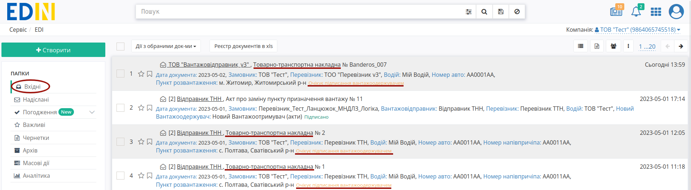

У відкритому документі натисніть **"Створити документ"** "Акт про заміну пункту призначення вантажу" в блоці `ланцюжка документів <https://wiki.edin.ua/uk/latest/_constant/chain/chain.html>`__:

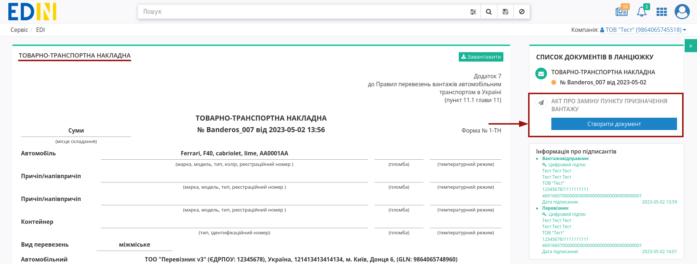

При створенні документа "Акта про заміну пункту призначення вантажу" його форма в значній мірі автоматично заповнюється даними (дані контрагентів, перевізника, відомості про вантаж) з е-ТТН, як документа-підстави: 

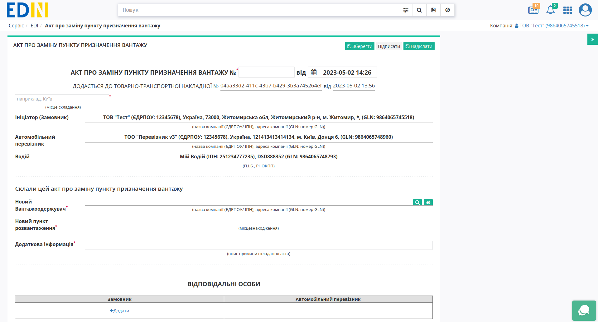

Всі обов'язкові до заповнення поля позначені червоною зірочкою :red:`*`. Вам необхідно вказати "Номер документа" ("Дата документа" заповнюється поточною автоматично), "Місце складання". Учасники документообігу Актом автоматично визначаються з документа-підстави й недоступні до редагування (роль Ініціатора вказується в дужках і визначає Учасників):

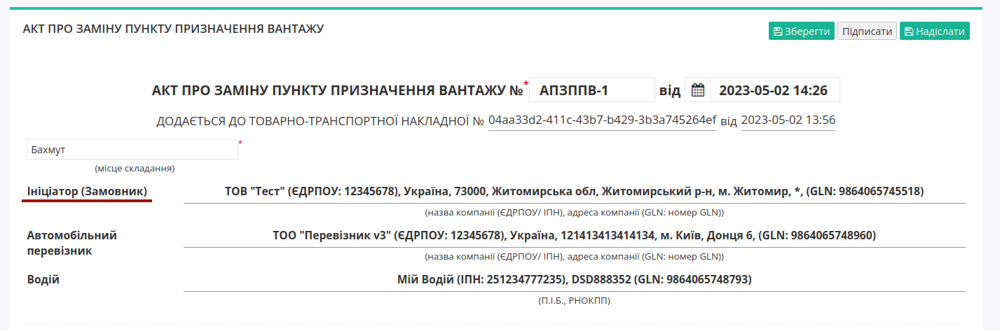

Заповнити дані **"Нового Вантажоодержувача"** можливо за допомогою кнопки **"Вказати себе"** (|будинок|) або ж за допомогою кнопки **"Пошук контрагента"** (|лупа|) за назвою компанії, GLN або ІПН можливо **"Вибрати"** іншого контрагента:

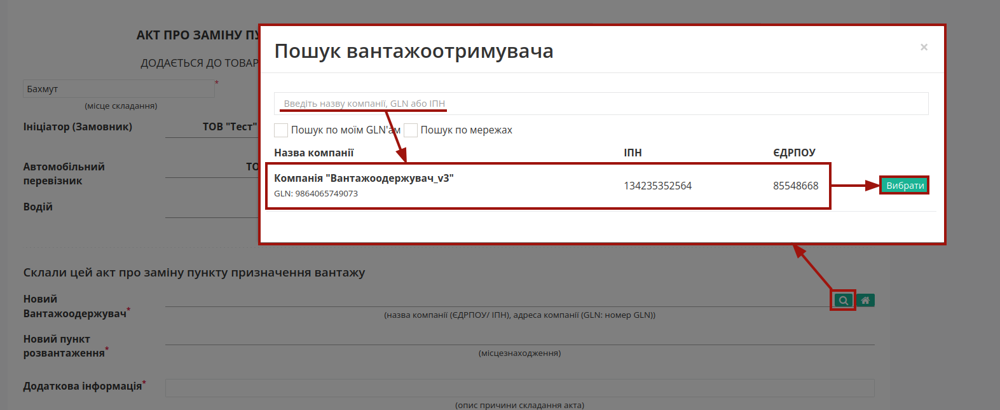

Після того, як контрагента обрано можливо вказати "Новий пункт розвантаження" (|лупа|):

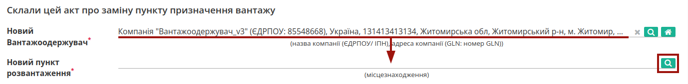

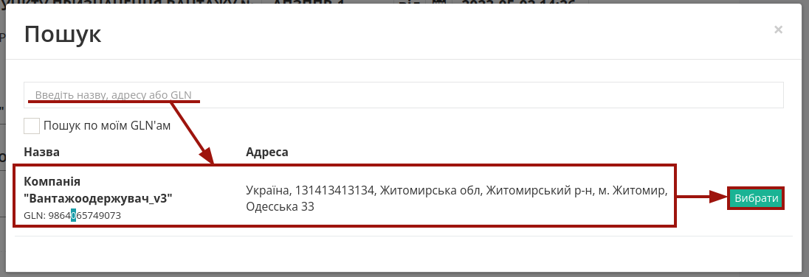

Обов'язково зазначається опис причини складання акта в полі "Додаткова інформація". Також у транспортних документах обов'язково вказується відповідальна особа (ролі та кількість Учасників визначається автоматично) за допомогою кнопки **"+Додати"** (можливо вказати кілька осіб):

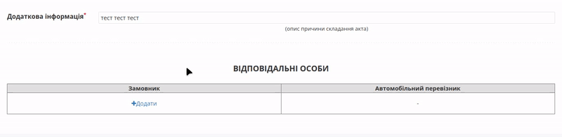

Дані раніше доданих відповідальних осіб можливо обрати з віртуального довідника чи видалити зі списку за допомогою |trash|:

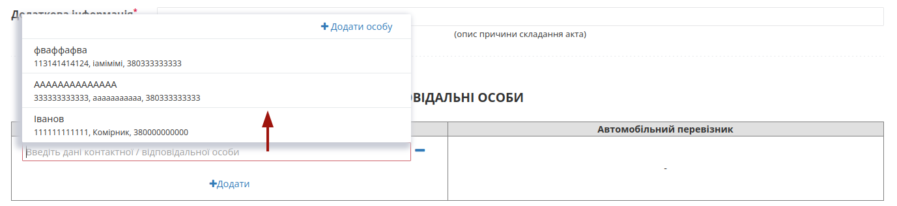

Довідник автоматично наповнюється при додаванні нового відповідального (кнопка **"+Додати особу"**). При додаванні нового відповідального в модальному вікні потрібно заповнити обов'язкові контактні дані (обов'язкові поля позначені червоною зірочкою :red:`*`):

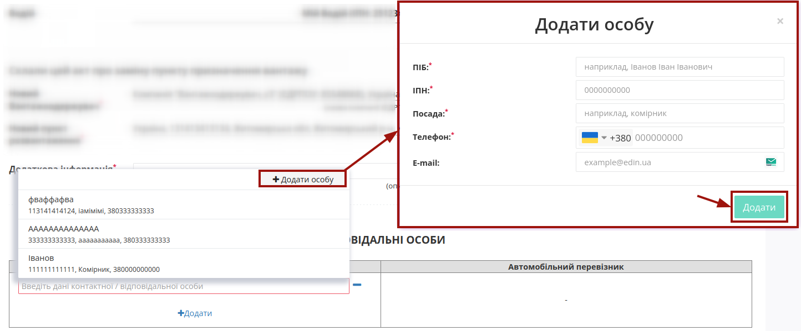

Редагувати дані раніше введених осіб можливо за допомогою кнопки **"Змінити"** (|pencil_stencil|):

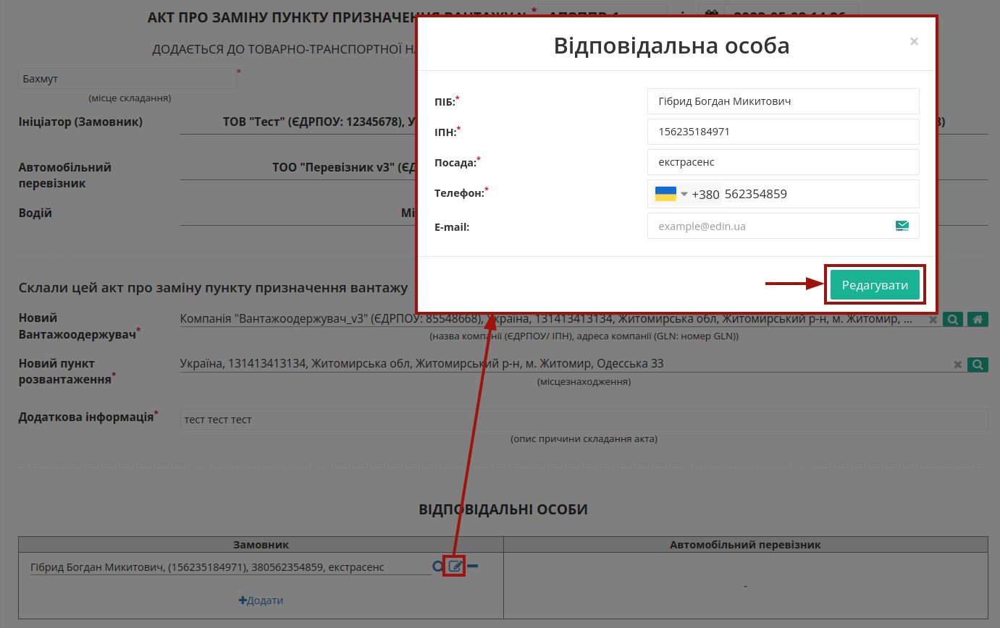

За потреби можливо **"Обрати"** (|лупа2|) іншу особу замість обраної/доданої раніше.

.. hint::
   **При підписанні:** якщо поле Вашої **"Відповідальної особи"** :underline:`незаповнене`, то воно може автоматично заповнюватись даними з Вашого ЕЦП (якщо це можливо).

Після того, як обов'язкові дані будуть введені потрібно **"Зберегти"** (1), **"Підписати"** (2) та **"Надіслати"** (3) документ:

.. image:: pics_Create_Consignee_Change_Act_from/Create_Consignee_Change_Act_from_012.png
   :align: center

.. _sign:

**1.1 Підписання та відправка "Акта про заміну пункту призначення вантажу"**
------------------------------------------------------------------------------------------------------------

.. include:: /_constant/atb_check/atb_check.rst
   :start-after: .. початок блоку для ATB_check
   :end-before: .. кінець блоку для ATB_check

.. tabs::

   .. tab:: Файловий ключ

      .. include:: /_constant/signing/signing.rst
         :start-after: .. початок блоку для Signing
         :end-before: .. кінець блоку для Signing

   .. tab:: Token

      .. include:: /_constant/token_signing/token_signing.rst
         :start-after: .. початок блоку для TokenSign
         :end-before: .. кінець блоку для TokenSign

   .. tab:: Гряда

      .. include:: /_constant/gryada_signing/gryada_signing.rst
         :start-after: .. початок блоку для GryadaSign
         :end-before: .. кінець блоку для GryadaSign

   .. tab:: Дія.Підпис

      .. include:: /_constant/diya_signing/diya_signing.rst
         :start-after: .. початок блоку для DiyaPidps
         :end-before: .. кінець блоку для DiyaPidps

   .. tab:: Cloud

      .. include:: /_constant/cloud_signing/cloud_signing.rst
         :start-after: .. початок блоку для CloudSign
         :end-before: .. кінець блоку для CloudSign

Після підписання "Акта про заміну пункту призначення вантажу" відображається "Інформація про підписантів", а документ можливо **"Надіслати"**:

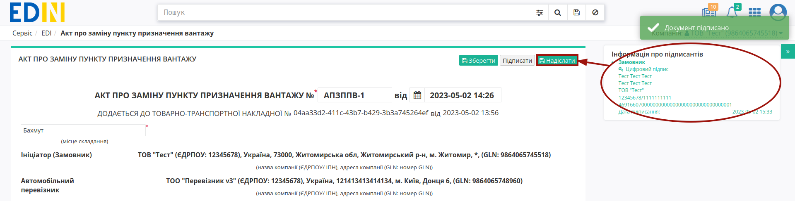

Після відправки автоматично відкривається папка **"Надіслані"**, де надісланий акт відображається зі статусом **"Очікує підписання перевізником/водієм"** (**"Очікує підписання замовником"** в випадку Ініціатора-Перевізника):

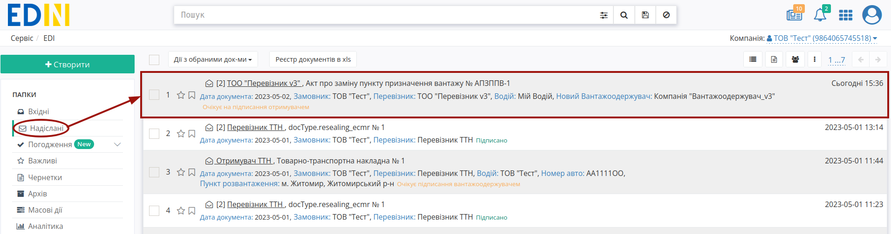

Після відправки у пов'язаного документа "е-ТТН" при його перегляді в блоці `ланцюжка документів <https://wiki.edin.ua/uk/latest/_constant/chain/chain.html>`__ відобрається створений Акт і виводиться повідомлення про обмежені дії з документом до кінця життєвого циклу акта (поки "Акт про заміну пункту призначення вантажу" не буде підписаний усіма Учасниками документообігу або не буде відхилений одним з Учасників):

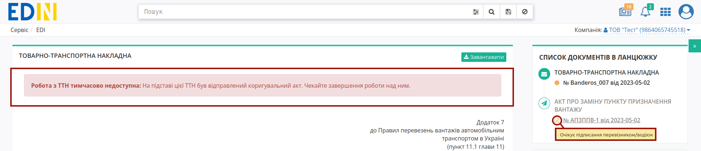

---------------------------------

.. include:: /_constant/kontakti.rst

