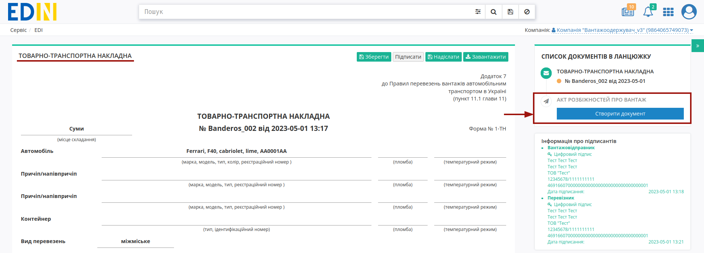
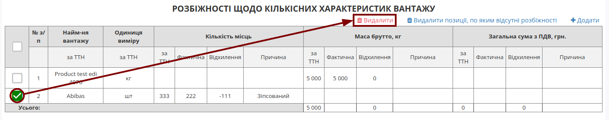

Створення "Акта розбіжностей про вантаж" на базі інших електронних документів
###################################################################################################

.. сюда закину немного картинок для текста + юзаєм спільні зображення

.. |лупа| image:: /_constant/icons/magnifying_glass.png

.. |будинок| image:: /_constant/icons/house.png

.. |pencil_stencil| image:: /_constant/icons/pencil_stencil.png

.. |лупа2| image:: /_constant/icons/magnifying_glass2.png

.. |trash| image:: /_constant/icons/trash.png

.. role:: red

.. role:: green

.. role:: orange

.. role:: underline

.. contents:: Зміст:
   :depth: 3

---------

При формуванні "Акта розбіжностей про вантаж" ініціатором документа виступає **"Вантажоодержувач"** (при роботі з транспортними документами передбачені 4 основні ролі учасників документообігу: **"Замовник"**, **"Вантажовідправник"**, **"Перевізник"**, **"Вантажоодержувач"**). Обмін документом здійснюється між учасниками в наступному порядку: 

:green:`"Вантажоодержувач" -> "Перевізник" -> "Вантажовідправник"` *(Підписання зі сторони "Вантажовідправника" є опціональним)

.. note::
   По завершенню життєвого циклу "Акта розбіжностей про вантаж" **"Вантажоодержувач"** має доповнити "е-ТТН" (до якої створювався Акт), підписавши і надіславши транзакцію до "е-ТТН":

   .. image:: pics_Create_Disagreement_Act_from/Create_Disagreement_Act_from_016.png
      :align: center

.. _create-from-ttn:

**1 Створення "Акта розбіжностей про вантаж" на підставі "е-ТТН"**
================================================================================================================================

.. important::
   Функціонал створення актів доступний для компанії з роллю **"Вантажоодержувача"** на підставі підписаного з двох сторін е-ТТН (в статусі "Очікує підписання вантажоодержувачем").

.. attention::
   Після створення "Акта розбіжностей про вантаж" дії з документом-підставою ("е-ТТН") будуть обмежені до кінця життєвого циклу акта (поки **"Перевізник"** не підпише або відхилить створений "Акт розбіжностей про вантаж").

Для того аби створити "Акт розбіжностей про вантаж" **"Вантажоодержувачу"** потрібно перейти до каталогу **"Вхідні"** та обрати потрібний е-ТТН документ в статусі "Очікує підписання вантажоодержувачем":

У відкритому документі натисніть **"Створити документ"** "Акт розбіжностей про вантаж" в блоці `ланцюжка документів <https://wiki.edin.ua/uk/latest/_constant/chain/chain.html>`__:

.. note::
   Якщо в документі зазначені логістичні та користувацькі одиниці виміру, то на платформі з'явиться модальне вікно, в якому потрібно буде обрати одиниці виміру:

   .. image:: pics_Create_Disagreement_Act_from/Create_Disagreement_Act_from_024.png
      :align: center

При створенні документа "Акта розбіжностей про вантаж" його форма в значній мірі автоматично заповнюється даними (дані контрагентів, перевізника, відомості про вантаж) з е-ТТН, як документа-підстави: 

Таблиця **"Розбіжності щодо кількісних характеристик вантажу"** за потреби підлягає редагуванню та зміні обраної товарної позиції за допомогою кнопки **"Змінити"**:

При редагуванні позиції при введенні фактичного значення (по кількості місць, массі брутто, загальній сумі з ПДВ) "Відхилення" розраховується автоматично, а також опціонально можливо вказати причину розбіжності. По завершенню введення потрібно натиснути кнопку **"Змінити"**:

При формуванні "Акт розбіжностей про вантаж" можливі варіанти, коли позиція була відсутня у е-ТТН, але приїхала з авто (пересорт) - таку позицію також можливо **"+Додати"** в акт:

Для того, щоб в один клік прибрати з "Акту розбіжностей про вантаж" всі позиції, у яких Відхилення = 0 реалізована кнопка **"Видалити позиції, по яким відсутні розбіжності"**:

Також можливо відмітити позиції (всі чи поодинично) та **"Видалити"** всі обрані позиції:

Для внесення даних в таблицю **"Розбіжностей щодо якісних характеристик вантажу"** потрібно поставити курсор в колонку виявлених порушень перевезення для стандартних показників чи вказати :underline:`інше` недотримання: 

Поля, що потребують обов'язкового заповнення позначені червоною зірочкою :red:`*`: окрім номера документа, місця його складання обов'язково потрібно вказати опис причин складання акта (поле "Додаткова iнформацiя") та рішення за виявленими розбіжностями (поле "Висновок"):

.. image:: pics_Create_Disagreement_Act_from/Create_Disagreement_Act_from_007.png
   :align: center

Також у транспортних документах обов'язково вказується відповідальна особа (Вантажоодержувач) за допомогою кнопки **"+Додати"** (можливо вказати кілька осіб):

Дані раніше доданих відповідальних осіб можливо обрати з віртуального довідника чи видалити зі списку за допомогою |trash|:

Довідник автоматично наповнюється при додаванні нового відповідального (кнопка **"+Додати особу"**). При додаванні нового відповідального в модальному вікні потрібно заповнити обов'язкові контактні дані (обов'язкові поля позначені червоною зірочкою :red:`*`):

Редагувати дані раніше введених осіб можливо за допомогою кнопки **"Змінити"** (|pencil_stencil|):

За потреби можливо **"Обрати"** (|лупа2|) іншу особу замість обраної/доданої раніше.

.. hint::
   **При підписанні:** якщо поле Вашої **"Відповідальної особи"** :underline:`незаповнене`, то воно може автоматично заповнюватись даними з Вашого ЕЦП (якщо це можливо).

Після того, як обов'язкові дані будуть введені потрібно **"Зберегти"** (1), **"Підписати"** (2) та **"Надіслати"** (3) документ:

.. image:: pics_Create_Consignee_Change_Act_from/Create_Consignee_Change_Act_from_012.png
   :align: center

.. _sign:

**1.1 Підписання та відправка "Акта розбіжностей про вантаж" "Вантажоодержувачем"**
------------------------------------------------------------------------------------------------------------

.. include:: /_constant/atb_check/atb_check.rst
   :start-after: .. початок блоку для ATB_check
   :end-before: .. кінець блоку для ATB_check

.. tabs::

   .. tab:: Файловий ключ

      .. include:: /_constant/signing/signing.rst
         :start-after: .. початок блоку для Signing
         :end-before: .. кінець блоку для Signing

   .. tab:: Token

      .. include:: /_constant/token_signing/token_signing.rst
         :start-after: .. початок блоку для TokenSign
         :end-before: .. кінець блоку для TokenSign

   .. tab:: Гряда

      .. include:: /_constant/gryada_signing/gryada_signing.rst
         :start-after: .. початок блоку для GryadaSign
         :end-before: .. кінець блоку для GryadaSign

   .. tab:: Дія.Підпис

      .. include:: /_constant/diya_signing/diya_signing.rst
         :start-after: .. початок блоку для DiyaPidps
         :end-before: .. кінець блоку для DiyaPidps

   .. tab:: Cloud

      .. include:: /_constant/cloud_signing/cloud_signing.rst
         :start-after: .. початок блоку для CloudSign
         :end-before: .. кінець блоку для CloudSign

Після підписання "Акта розбіжностей про вантаж" відображається "Інформація про підписантів", а документ можливо **"Надіслати"**:

Після відправки автоматично відкривається папка **"Надіслані"**, де надісланий акт відображається зі статусом **"Очікує підписання перевізником/водієм"**:

Після відправки у пов'язаного документа "е-ТТН" при його перегляді в блоці `ланцюжка документів <https://wiki.edin.ua/uk/latest/_constant/chain/chain.html>`__ відобрається створений Акт і виводиться повідомлення про обмежені дії з документом до кінця життєвого циклу акта (поки **"Перевізник"** не підпише або відхилить створений "Акт розбіжностей про вантаж"):

-------------------------------------

.. include:: /_constant/kontakti.rst