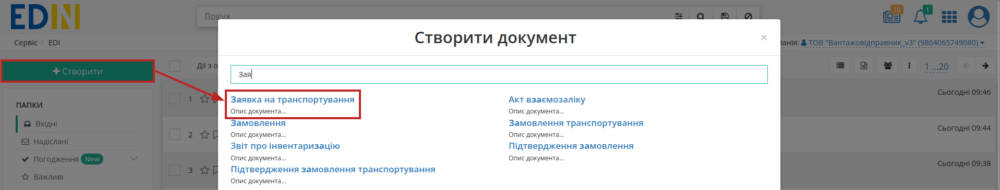
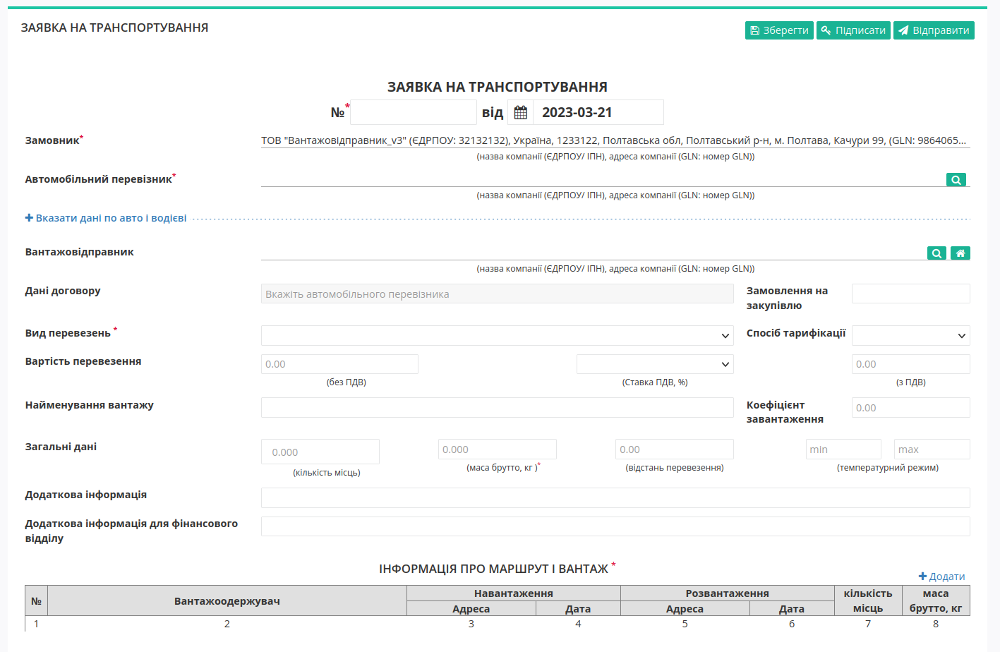
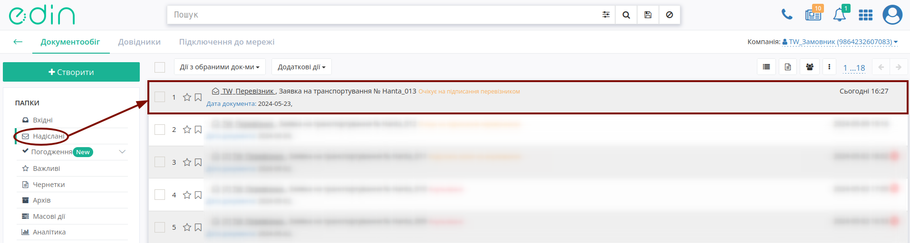
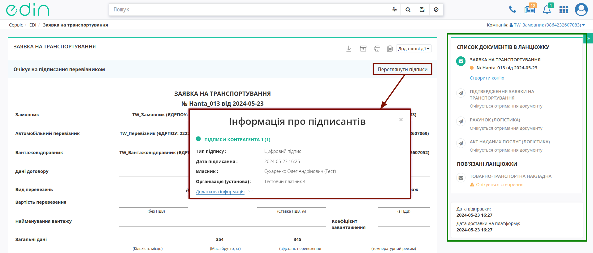

Створення та відправка "Заявки на транспортування" з "нуля" (ручне заповнення)
###################################################################################################

.. сюда закину немного картинок для текста + юзаєм спільні зображення

.. |лупа| image:: /_constant/icons/magnifying_glass.png

.. |будинок| image:: /_constant/icons/house.png

.. |drag_dots| image:: /_constant/icons/drag_dots.png

.. |trash| image:: /_constant/icons/trash.png

.. role:: red

.. role:: green

.. role:: orange

.. role:: underline

.. contents:: Зміст:
   :depth: 3

---------

Ініціатором документообігу "Заявка на транспортування" -> "Підтвердженням заявки на транспортування" виступає користувач з роллю **"Замовник"** (при роботі з транспортними документами передбачені 4 основні ролі учасників документообігу: **"Замовник"**, **"Вантажовідправник"**, **"Перевізник"**, **"Вантажоотримувач"**). Обмін документами здійснюється між **"Замовником"** та **"Перевізником"**:

:green:`"Замовник" -> "Перевізник"`

.. hint::
   При роботі з "Заявкою на транспортування" можливо організувати:

   1) Документообіг, в якому "Заявка на транспортування" пропонує перевезення між трьома компаніями-учасниками (1 **"Замовник"** - 1 **"Перевізник"** - 1 **"Вантажоотримувач"**) з пункту навантаження в пункт розвантаження (дві адреси).
   2) Документообіг, в якому "Заявка на транспортування" пропонує перевезення одразу з кількома **"Вантажоотримувачами"** (1 **"Замовник"** - 1 **"Перевізник"** - N **"Вантажоотримувачів"**) з відповідною кількістю пунктів навантаження та розвантаження (кілька адрес).

**1 Створення "Заявки на транспортування" Замовником**
================================================================================================

Для створення "Заявки на транспортування" в сервісі **"EDI Network"** **"Замовнику"** необхідно натиснути на кнопку **"Створити"**, вибрати **"Заявка на транспортування"**, як тип створюваного документа в модальному вікні (для зручності можливо скористатись рядком пошуку):

Після чого відкривається готова до заповнення порожня форма документа "Заявка на транспортування":

.. початок блоку для Proposal_for_Proposal_from

.. hint::
   Авторизований учасник-ініціатор документообігу автоматично зазначається, як **Замовник** без можливості редагування. Поля обов'язкові до заповнення позначені червоною зірочкою :red:`*`!

Заповнити дані **"Автомобільного Перевізника"** (обов'язково) та **"Вантажовідправника"** (опціонально) можливо за допомогою кнопки **"Пошук контрагента"** (|лупа|) або ж за допомогою кнопки **"Вказати себе"** (|будинок|):

.. image:: /ETTN_3_0/pics_Create_Proposal/Create_Proposal_003.png
   :align: center

Для пошуку контрагента в модальному вікні потрібно ввести назву компанії, GLN або ІПН:

.. image:: /ETTN_3_0/pics_Create_Proposal/Create_Proposal_004.png
   :align: center

-------------------------------

Є можливість **"Вказати дані по авто і водієві"**, якщо відомо хто буде здійснювати поставку (за замовчуванням блок згорнутий):

.. image:: /ETTN_3_0/pics_Create_Proposal/Create_Proposal_005.png
   :align: center

Для автомобілів та причепів реалізований Ваш особистий довідник, що автоматично формується при додаванні нового транспортного засобу (кнопка **"+Новий транспортний засіб"**). При додаванні нового транспортного засобу в модальному вікні потрібно заповнити "Реєстраційний номер", "Марка", "Модель", "Тип" (також при заповненні "Довжина" / "Ширина" / "Висота" / "Загальна вага без вантажу" вся група стає теж обов'язковою до заповнення):

.. image:: /ETTN_3_0/pics_Create_Proposal/Create_Proposal_034.png
   :align: center

.. hint::
   Для раніше введеного реєстрайійного номеру (лише латинниця), наприклад, **AA0001AA** користувач може скористатись пошуком з довідника (min 4 символи), наприклад, ``AA00, 0001, 01AA, ...``:

   .. image:: /ETTN_3_0/pics_Create_Proposal/Create_Proposal_035.png
      :align: center

   Також через наш пошук можливо за повним збігом (8 символів) знайти транспортний засіб у відкритих джерелах:

   .. image:: /ETTN_3_0/pics_Create_ETTN/Create_ETTN_075.png
      :align: center

   **Примітка:** запис про зміни даних транспортного засобу вносяться в довідник лише при відправці документа!

Після додавання чи вибору транспортного засобу з'являються кнопки:

* **"Обрати"** - вибір іншого транспортного засобу;
* **"Змінити"** - редагування даних обраного транспортного засобу (редагування довідника);
* **"Очистити"** - видалити введені в рядок дані.

.. image:: /ETTN_3_0/pics_Create_Proposal/Create_Proposal_036.png
   :align: center

.. note::
   Незважаючи на те, що поля причіпа/напівпричіпа є опціональним, при їх наявності такі дані є обов'язковими до заповнення! 

Принцип заповнення причіпа/напівпричіпа теж реалізований через довідник (аналогічно додаванню даних про автомобіль): 

.. image:: /ETTN_3_0/pics_Create_Proposal/Create_Proposal_037.png
   :align: center

По кожному вказаному транспортному засобу є можливість зазначити температурний режим (ми рекомендуємо заповнювати поля температурного режиму для більш точної інформації по умовам перевезення в документі та кращого порозуміння з Вашими контрагентами):

.. image:: /ETTN_3_0/pics_Create_Proposal/Create_Proposal_010.png
   :align: center

Дані **"Водія"** можливо обрати за допомогою кнопки **"Пошук контрагента"** (|лупа|) за ПІБ / ІПН / даними водійського посвідчення:

.. image:: /ETTN_3_0/pics_Create_Proposal/Create_Proposal_011.png
   :align: center

.. note::
   За потреби можливо **"Очистити дані по авто і водієві"** за допомогою відповідної кнопки - ця дія зготає блок з полями:

   .. image:: /ETTN_3_0/pics_Create_Proposal/Create_Proposal_012.png
      :align: center

---------------------------------

Якщо з обраним контрагентом вже був заключений договір (є **договір поставки** в `"Довіднику для Договорів" <https://wiki.edin.ua/uk/latest/general_2_0/Directories.html#gln-contracts>`__ в **Довідниках**), то поле "Дані договору" заповнюється автоматично в якості даних номера/дати договору, на підставі якого створюється даний документ. Якщо договорів з обраним контрагентом кілька, то можливо обрати договір зі списку або створити **"+Новий договір"** прямо в цьому документі:

.. image:: /ETTN_3_0/pics_Create_Proposal/Create_Proposal_013.png
   :align: center

Завжди можливо **"Обрати"** новий договір:

.. image:: /ETTN_3_0/pics_Create_Proposal/Create_Proposal_014.png
   :align: center

.. поки не реалізовано - взято з v2
   .. attention::
      При створенні документа шляхом `клонування <https://wiki.edin.ua/uk/latest/ETTN_2_0/Work_with_ETTN.html#doc-clone>`__ поле "Дані договору" заповнюється автоматично лише за наявності цього договору в `"Довіднику для Договорів" <https://wiki.edin.ua/uk/latest/general_2_0/Directories.html#gln-contracts>`__ в **Довідниках**.

Далі потрібно обрати з випадаючого списку **"Вид перевезень"**:

.. image:: /ETTN_3_0/pics_Create_Proposal/Create_Proposal_015.png
   :align: center

В залежності від обраного значення поля **"Спосіб тарифікації"** змінюється набір обов'язкових до заповненння полів:

* **без способу тарифікації** (порожнє поле) - в загальних даних вантажу обов'язково заповнюється "маса брутто, кг": 

.. image:: /ETTN_3_0/pics_Create_Proposal/Create_Proposal_025.png
   :align: center

* "Спосіб тарифікації" = **за кілометаж** - в загальних даних вантажу обов'язково заповнюється "маса брутто, кг" та "відстань перевезення": 

.. image:: /ETTN_3_0/pics_Create_Proposal/Create_Proposal_026.png
   :align: center

* "Спосіб тарифікації" = **фіксована вартість** - в загальних даних вантажу обов'язково заповнюється "маса брутто, кг", вартість перевезення "без ПДВ" (вартість перевезення "з ПДВ" розраховується автоматично, якщо вказати ставку ПДВ):

.. image:: /ETTN_3_0/pics_Create_Proposal/Create_Proposal_027.png
   :align: center

* "Спосіб тарифікації" = **за тоннаж** - в загальних даних вантажу обов'язково заповнюється "маса брутто, кг":

.. image:: /ETTN_3_0/pics_Create_Proposal/Create_Proposal_028.png
   :align: center

.. кінець блоку для Proposal_for_Proposal_from

.. _customer-table:

**1.1 Заповнення табличної частини**
---------------------------------------

Для заповнення табличної частини документа потрібно натиснути на кнопку **"+Додати"**, після чого відкриється модальне вікно "Інформація про маршрут і вантаж" (обов'язкові до заповнення поля позначені червоною зірочкою :red:`*` ):

.. image:: /ETTN_3_0/pics_Create_Proposal/Create_Proposal_016.png
   :align: center

.. початок блоку для Proposal_for_Proposal_from2

Вікно розділено на блоки з даними про маршрут (Навантаження і Розвантаження) та блок з інформацією про вантаж. Для блоків Навантаження та Розвантаження дані "Адрес" необхідно обрати з випадаючого списку, користуючись пошуком (для Навантаження значення підтягуються з довідника **"Вантажовідправника"**, а для Розвантаження - **"Вантажоодержувача"**):

.. image:: /ETTN_3_0/pics_Create_Proposal/Create_Proposal_017.png
   :align: center

За потреби можливо додати дату та час **"Обравши"** значення кінцевих термінів, в рамках яких потрібно здійснити доставку вантажу:

.. image:: /ETTN_3_0/pics_Create_Proposal/Create_Proposal_018.png
   :align: center

Дані відповідальних осіб **"Вантажовідправника"** / **"Вантажоодержувача"** можливо обрати з віртуального довідника чи видалити зі списку за допомогою |trash| (присутній пошук):

.. image:: /ETTN_3_0/pics_Create_Proposal/Create_Proposal_019.png
   :align: center

Довідник автоматично наповнюється при додаванні нового відповідального (кнопка **"+Додати особу"**). При додаванні нового відповідального в модальному вікні потрібно заповнити обов'язкові контактні дані (обов'язкові поля позначені червоною зірочкою :red:`*`):

.. image:: /ETTN_3_0/pics_Create_Proposal/Create_Proposal_020.gif
   :align: center

Редагувати дані раніше введених осіб можливо за допомогою кнопки **"Змінити"**:

.. image:: /ETTN_3_0/pics_Create_Proposal/Create_Proposal_021.gif
   :align: center

Заповнене поле документа даними відповідальної особи можливо **"Очистити"** за потреби чи **"Обрати"** іншу особу. 

Дані пункту **"Розвантаження"** заповнюються аналогічно після вибору **Вантажоодержувача** за допомогою пошуку за назвою компанії чи GLN:

.. image:: /ETTN_3_0/pics_Create_Proposal/Create_Proposal_022.png
   :align: center

Для редагування інформації щодо вантажу необхідно навести курсор на рядок цього вантажу та натиснути **"Змінити"**, для видалення – **"Видалити"** (або масово відмітити галочками та **"Видалити"** кнопкою над таблицею):

.. image:: /ETTN_3_0/pics_Create_Proposal/Create_Proposal_038.png
   :align: center

Перевізники, отримавши "Заявку на транспортування", орієнтуються на послідовність вказаних в ній маршрутів. До відправки документа можливо змінити послідовність маршрутів, перетягнувши позицію лівою кнопкою миші за |drag_dots|:

.. image:: /ETTN_3_0/pics_Create_Proposal/Create_Proposal_039.gif
   :align: center

Для збереження "Заявки на транспортування" необхідно натиснути кнопку **"Зберегти"**, документ потрапить у папку **"Чернетки"**:

.. image:: /ETTN_3_0/pics_Create_Proposal/Create_Proposal_040.png
   :align: center

Після того, як усі обов'язкові поля заповнені та збережені документ можливо **"Підписати"**:

.. image:: /ETTN_3_0/pics_Create_Proposal/Create_Proposal_041.png
   :align: center

.. hint::
   Також для даного документа доступні `масове підписання та масова відправка <https://wiki.edin.ua/uk/latest/general_2_0/massovi_operacii_EDIN_2.0.html#mass-sign-and-send>`__.

.. _sign:

**1.2 Підписання та відправка "Заявки на транспортування" Замовником**
------------------------------------------------------------------------------

.. include:: /_constant/atb_check/atb_check.rst
   :start-after: .. початок блоку для ATB_check
   :end-before: .. кінець блоку для ATB_check

.. tabs::

   .. tab:: Файловий ключ

      .. include:: /_constant/signing/signing.rst
         :start-after: .. початок блоку для Signing
         :end-before: .. кінець блоку для Signing

   .. tab:: Token

      .. include:: /_constant/token_signing/token_signing.rst
         :start-after: .. початок блоку для TokenSign
         :end-before: .. кінець блоку для TokenSign

   .. tab:: Гряда

      .. include:: /_constant/gryada_signing/gryada_signing.rst
         :start-after: .. початок блоку для GryadaSign
         :end-before: .. кінець блоку для GryadaSign

   .. tab:: Cloud

      .. include:: /_constant/cloud_signing/cloud_signing.rst
         :start-after: .. початок блоку для CloudSign
         :end-before: .. кінець блоку для CloudSign

Після підписання "Заявки на транспортування" окремим блоком відображається інформація про підписантів. Підписаний документ можливо **"Надіслати"**:

.. image:: /ETTN_3_0/pics_Create_Proposal/Create_Proposal_042.png
   :align: center

.. кінець блоку для Proposal_for_Proposal_from2

Після відправки документа контрагенту він відображається в журналі вихідних документів. Відправленій **"Замовником"** "Заявці на транспортування" присвоюється статус :orange:`"Очікує підписання перевізником"`:

Відправлена "Заявка на транспортування" має наступний вигляд:

В правій частині відображається блок з даними про `ланцюжок документів <https://wiki.edin.ua/uk/latest/_constant/chain/chain.html>`__. Інформація про нового підписанта відображається після натискання кнопки **"Переглянути підписи"**. У разі помилкової відправки документа можливо виконати **"Відкликання підпису"** поки отримувач не підписав документ (`детальніше про відкликання <https://wiki.edin.ua/uk/latest/ETTN_3_0/Proposal_Revoke.html>`__).

---------------------------------

.. include:: /_constant/kontakti.rst
