Створення "Акта перевантаження" на базі інших електронних документів
###################################################################################################

.. картинки в текст

.. |лупа| image:: /_constant/icons/magnifying_glass.png

.. |будинок| image:: /_constant/icons/house.png

.. |pencil_stencil| image:: /_constant/icons/pencil_stencil.png

.. |лупа2| image:: /_constant/icons/magnifying_glass2.png

.. |trash| image:: /_constant/icons/trash.png

.. role:: red

.. role:: green

.. role:: orange

.. role:: underline

.. contents:: Зміст:
   :depth: 3

---------

"Акт перевантаження" складається у разі повного перевантаження вантажу (за однією е-ТТН) в процесі перевезення на інший транспортний засіб у випадку заміни транспортного засобу та/або водія чи навіть **Перевізника** (при роботі з транспортними документами передбачені 4 основні ролі учасників документообігу: **"Замовник"**, **"Вантажовідправник"**, **"Перевізник"**, **"Вантажоодержувач"**). Документ "Акт перевантаження" можливо створити на підставі "е-ТТН", що вже підписаний **Перевізником** (документ має статус :orange:`"Очікує підписання вантажоодержувачем"`). Документообіг "Актом перевантаження" здійснюється між двома контагентами-Перевізниками. При формуванні "Акта перевантаження" ініціатором документа виступає **"Перевізник, що здає вантаж"**. Обмін документом здійснюється між учасниками в наступному порядку: 

:green:`"Перевізник, що здає вантаж" -> "Перевізник, що приймає вантаж"`

.. note::
   По завершенню життєвого циклу "Акта перевантаження" **"Перевізник, що приймає вантаж"** має доповнити "е-ТТН" (до якої створювався Акт), підписавши і надіславши транзакцію до "е-ТТН":

   .. image:: /ETTN_3_0/BasicActChanges.png
      :align: center

.. _create-from-ttn:

**1 Створення "Акта перевантаження" на підставі "е-ТТН"**
================================================================================================================================

.. attention::
   Після створення "Акта перевантаження" дії з документом-підставою ("е-ТТН") будуть обмежені до кінця життєвого циклу акта (поки "Акт перевантаження" не буде підписаний чи відхилений **"Перевізником, що приймає вантаж"**).

**"Перевізнику, що здає вантаж"** для створення **"Акта перевантаження"** в сервісі "EDI Network" потрібно перейти у **"Вхідні"** та перейти в "Товарно-транспортну накладну", до якої потібно створити коригуючий акт ("е-ТТН" в статусі :orange:`"Очікує підписання вантажоодержувачем"`):

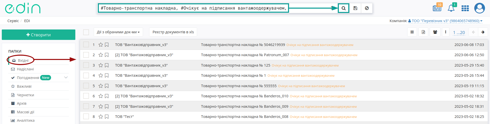

У відкритому документі натисніть **"Створити документ"** "Акт перевантаження" в блоці `ланцюжка документів <https://wiki.edin.ua/uk/latest/_constant/chain/chain.html>`__:

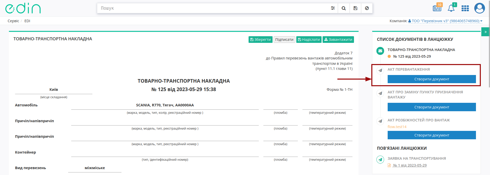

При створенні документа "Акта перевантаження" його форма в значній мірі автоматично заповнюється даними (дані **"Перевізника"**, **"Водія"**, автомобіль, причепи) з е-ТТН, як документа-підстави: 

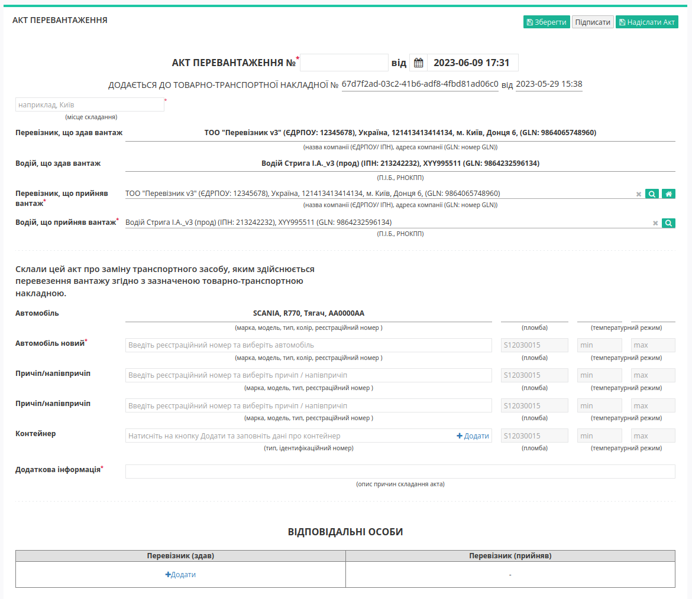

Потрібно зазначити номер Акта (автоматично проставляється поточна дата та час створення документа) та місце його складання (обов'язкові до заповнення поля позначені червоною зірочкою :red:`*`). Як вже було зазначено раніше, "Акта перевантаження" може складатись для заміни транспортного засобу та/або водія чи навіть **Перевізника**, тому поля **"Перевізника, що прийняв вантаж"** та **"Водія, що прийняв вантаж"** дублюють значення **"Перевізника, що здав вантаж"** та **"Водія, що здав вантаж"**. Значення для нового/-их **Перевізника/Водія** можливо заповнити за допомогою кнопки **"Пошук контрагента"** (|лупа|) або ж за допомогою кнопки **"Вказати себе"** (|будинок|):

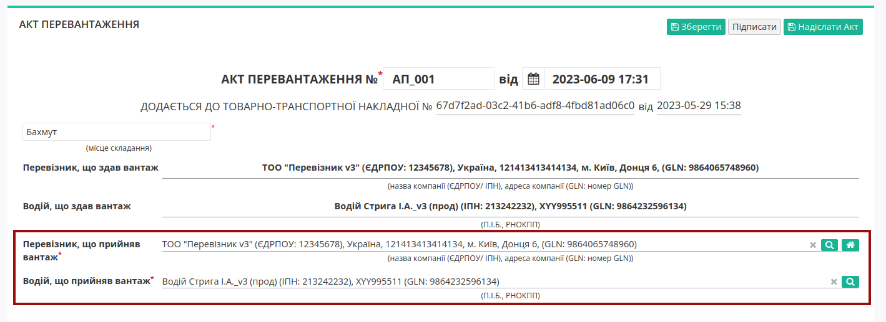

Для пошуку контрагента в модальному вікні потрібно ввести назву компанії, GLN або ІПН:

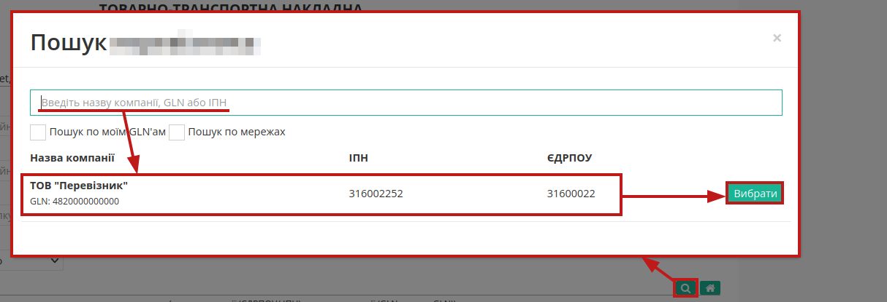

Для вибору нового автомобіля / причепів реалізований Ваш особистий довідник, що автоматично формується при додаванні нового транспортного засобу (кнопка **"+Новий транспортний засіб"**). При додаванні нового транспортного засобу в модальному вікні потрібно заповнити "Реєстраційний номер", "Марка", "Модель", "Тип":

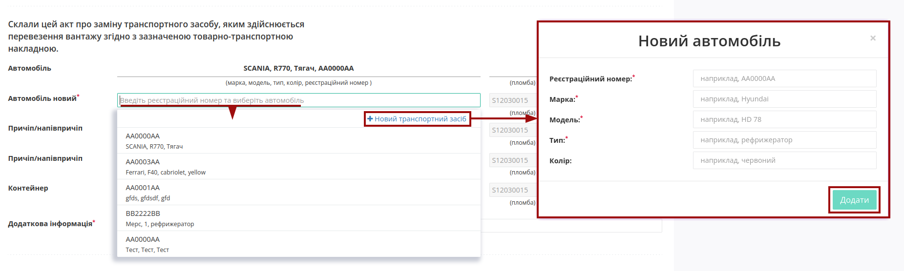

.. hint::
   Для раніше введеного реєстрайійного номеру (лише латинниця), наприклад, **AA0001AA** користувач може скористатись пошуком з довідника (min 4 символи), наприклад, ``AA00, 0001, 01AA, ...``:

   .. image:: pics_Create_Reload_Act_from/Create_Reload_Act_from_006.png
      :align: center

   Також через наш пошук можливо за повним збігом (8 символів) знайти транспортний засіб у відкритих джерелах:

   .. image:: /ETTN_3_0/pics_Create_ETTN/Create_ETTN_075.png
      :align: center

   **Примітка:** запис про зміни даних транспортного засобу вносяться в довідник лише при відправці документа!

Після додавання чи вибору транспортного засобу з'являються кнопки:

* **"Обрати"** - вибір іншого транспортного засобу;
* **"Змінити"** - редагування даних обраного транспортного засобу (редагування довідника);
* **"Очистити"** - видалити введені в рядок дані.

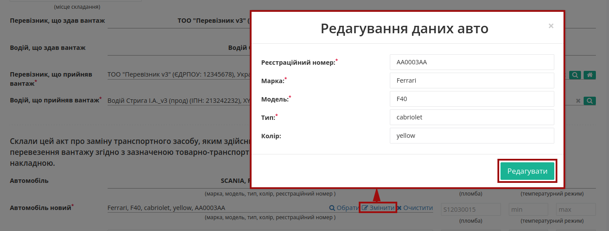

.. note::
   Незважаючи на те, що поля причіпа/напівпричіпа / контейнера є опціональним, при їх наявності такі дані є обов'язковими до заповнення! 

Принцип заповнення причіпа/напівпричіпа теж реалізований через довідник (аналогічно додаванню даних про автомобіль): 

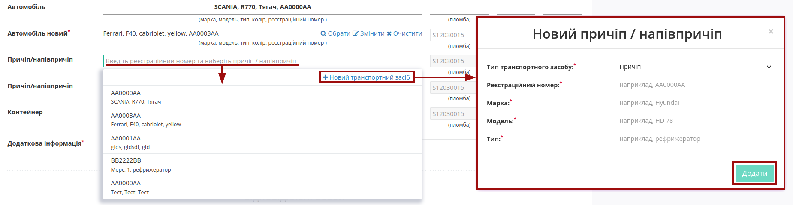

При додаванні даних контейнера (кнопка **"+Додати"**) в модальному вікні потрібно обрати "Тип контейнера": 20-футовий / 40-футовий та зазначити "Ідентифікаційний номер":

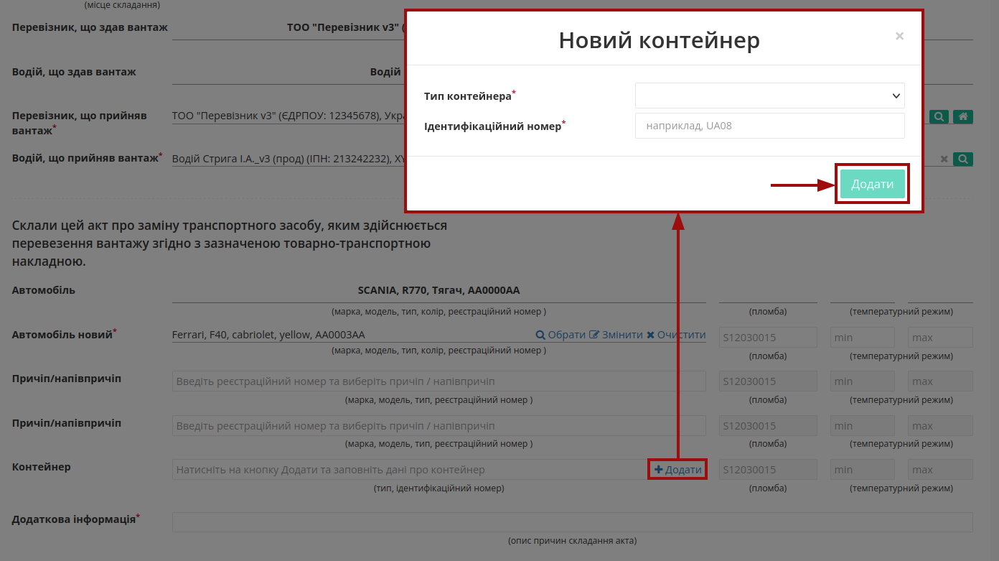

По кожному вказаному транспорному засобу є можливість зазначити (опціонально) номер пломби та температурний режим:

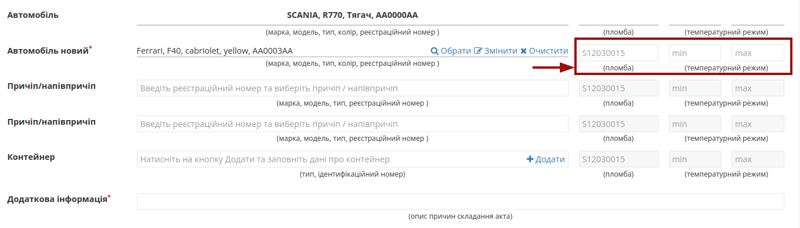

При формуванні "Акта перевантаження" обов'язково заповнюється поле **"Додаткова інформація"** з описом причини складання Акта!

В документі також обов'язково зазначається відповідальна/-ні особи **"Перевізника, що здає вантаж"** за допомогою кнопки **"+Додати"**. Дані раніше доданих відповідальних осіб можливо обрати з віртуального довідника чи видалити зі списку за допомогою |trash|:

.. image:: pics_Create_Reload_Act_from/Create_Reload_Act_from_011.png
   :align: center

Довідник автоматично наповнюється при додаванні нового відповідального (кнопка **"+Додати особу"**). При додаванні нового відповідального в модальному вікні потрібно заповнити обов'язкові контактні дані (обов'язкові поля позначені червоною зірочкою :red:`*`).

Редагувати дані раніше введених осіб можливо за допомогою кнопки **"Змінити"** (|pencil_stencil|):

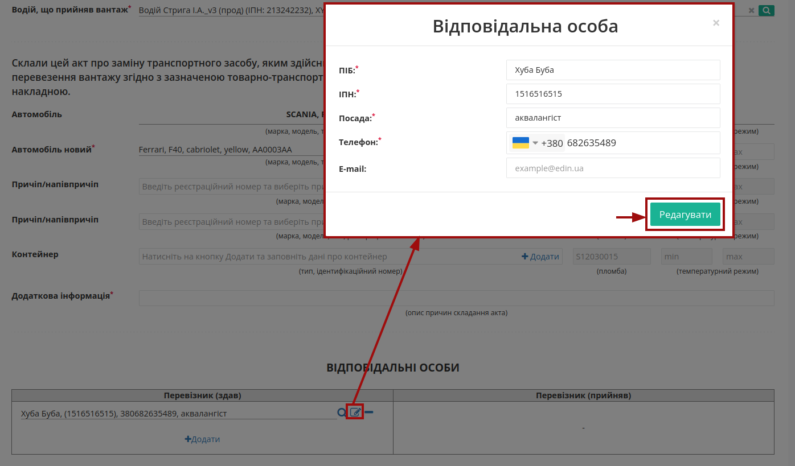

За потреби можливо **"Обрати"** (|лупа2|) іншу особу замість обраної/доданої раніше.

.. hint::
   **При підписанні:** якщо поле Вашої **"Відповідальної особи"** :underline:`незаповнене`, то воно може автоматично заповнюватись даними з Вашого ЕЦП (якщо це можливо).

Після того, як обов'язкові дані будуть введені потрібно **"Зберегти"** (1), **"Підписати"** (2) та **"Надіслати"** (3) документ:

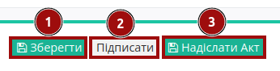

.. _sign:

**1.1 Підписання та відправка "Акта перевантаження" "Перевізником, що здає вантаж"**
------------------------------------------------------------------------------------------------------------

.. include:: /_constant/atb_check/atb_check.rst
   :start-after: .. початок блоку для ATB_check
   :end-before: .. кінець блоку для ATB_check

.. tabs::

   .. tab:: Файловий ключ

      .. include:: /_constant/signing/signing.rst
         :start-after: .. початок блоку для Signing
         :end-before: .. кінець блоку для Signing

   .. tab:: Token

      .. include:: /_constant/token_signing/token_signing.rst
         :start-after: .. початок блоку для TokenSign
         :end-before: .. кінець блоку для TokenSign

   .. tab:: Гряда

      .. include:: /_constant/gryada_signing/gryada_signing.rst
         :start-after: .. початок блоку для GryadaSign
         :end-before: .. кінець блоку для GryadaSign

   .. tab:: Дія.Підпис

      .. include:: /_constant/diya_signing/diya_signing.rst
         :start-after: .. початок блоку для DiyaPidps
         :end-before: .. кінець блоку для DiyaPidps

   .. tab:: Cloud

      .. include:: /_constant/cloud_signing/cloud_signing.rst
         :start-after: .. початок блоку для CloudSign
         :end-before: .. кінець блоку для CloudSign

Після підписання "Акта перевантаження" відображається "Інформація про підписантів" і можливо **"Надіслати Акт"**:

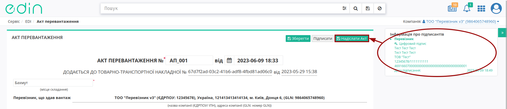

.. hint::
   При заміні **"Перевізника"** і зберіганні Акта з'являється підказка про необхідність внесення змін в ТТН:

   .. image:: pics_Create_Reload_Act_from/Create_Reload_Act_from_015.png
      :align: center
   
   Зміни в ТТН потребують додаткової операції підписання!

Після відправки автоматично відкривається папка **"Надіслані"**, де надісланий акт відображається зі статусом **"Очікує підписання отримувачем"**:

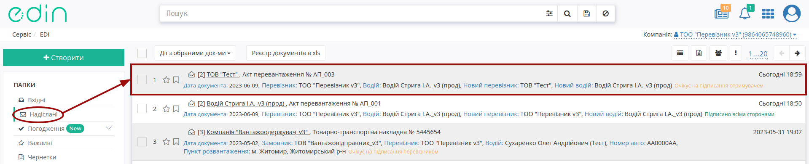

Після відправки у пов'язаного документа "е-ТТН" при його перегляді в блоці `ланцюжка документів <https://wiki.edin.ua/uk/latest/_constant/chain/chain.html>`__ відобрається створений Акт і виводиться повідомлення про обмежені дії з документом до кінця життєвого циклу акта (поки **"Перевізник"** не підпише або відхилить створений "Акт перевантаження"):

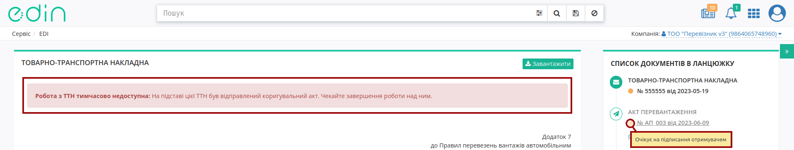

-------------------------------------

.. include:: /_constant/kontakti.rst

