Створення "Акта розвантаження на проміжному складі" на базі інших електронних документів
###################################################################################################

.. картинки в текст

.. |лупа| image:: /_constant/icons/magnifying_glass.png

.. |будинок| image:: /_constant/icons/house.png

.. |pencil_stencil| image:: /_constant/icons/pencil_stencil.png

.. |лупа2| image:: /_constant/icons/magnifying_glass2.png

.. |trash| image:: /_constant/icons/trash.png

.. role:: red

.. role:: green

.. role:: orange

.. role:: underline

.. contents:: Зміст:
   :depth: 3

---------

"Акт розвантаження на проміжному складі" складається у разі повного перевантаження вантажу (без розподілу на кілька актів) в процесі перевезення на Проміжний склад з подальшим перевантаженням на інший автомобіль. Ініціатором "Акт розвантаження на проміжному складі" виступає **"Перевізник"** (**"Водій"** або відповідальна особа компанії **"Перевізника"**). Обмін документом здійснюється та скріплюється електронними підписами представників між учасниками в наступному порядку: 

:green:`"Перевізник" -> "Проміжний склад"`

.. _create-from-ttn:

**1 Створення "Акта розвантаження на проміжному складі" на підставі "е-ТТН"**
================================================================================================================================

.. important::
   Функціонал створення актів доступний для компанії з роллю **"Перевізника"** на підставі підписаного з двох сторін е-ТТН (в статусі :orange:`"Очікує підписання вантажоодержувачем"`).

.. attention::
   Після створення "Акта розвантаження на проміжному складі" дії з документом-підставою ("е-ТТН") будуть обмежені до кінця життєвого циклу "Акта завантаження на проміжному складі". Ці два акти логічно об'єднані і процесно не можуть існувати один без іншого - тому дії з "е-ТТН" обмежуються поки "Акта розвантаження на проміжному складі" та, слідуючий за ним, "Акта завантаження на проміжному складі" не завершать свої життєві цикли або не будуть відхилені!

   .. image:: pics_Create_StorageDelivery_Act_from/Create_StorageDelivery_Act_from_014.png
      :align: center

Для того аби створити "Акт розвантаження на проміжному складі" **"Перевізнику"** потрібно перейти до каталогу **"Вхідні"** (**"Надіслані"**, якщо Ви також виступали в якості **"Вантажовідправника"** документа) та обрати потрібний "е-ТТН" документ в статусі :orange:`"Очікує підписання вантажоодержувачем"` (для зручності можливо скористатись `пошуком <https://wiki.edin.ua/uk/latest/general_2_0/rabota_s_platformoj_EDIN_2.0.html#doc-search>`__):

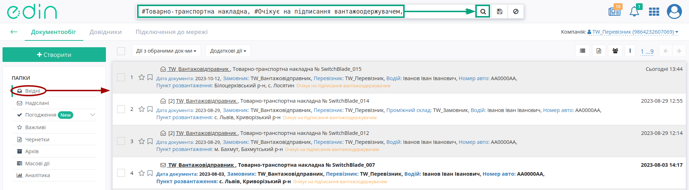

У відкритому документі натисніть **"Створити документ"** "Акт розвантаження на проміжному складі" в блоці `ланцюжка документів <https://wiki.edin.ua/uk/latest/_constant/chain/chain.html>`__:

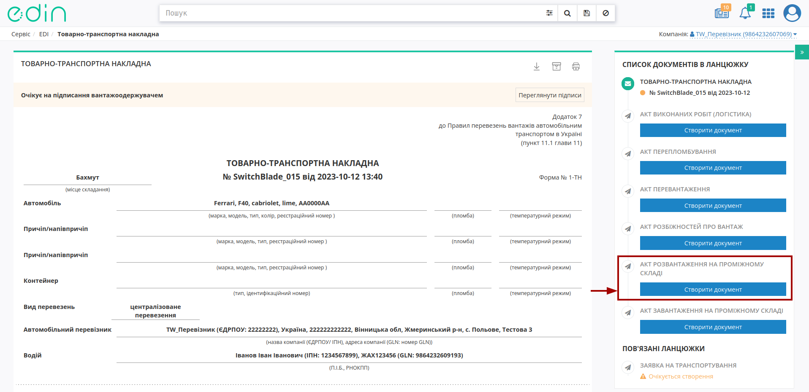

При створенні документа "Акта розвантаження на проміжному складі" його форма в значній мірі автоматично заповнюється недоступними до редагування даними пов'язаної "е-ТТН", **"Перевізника"**, **"Водія"**, автомобіля, причепа з е-ТТН, як документа-підстави: 

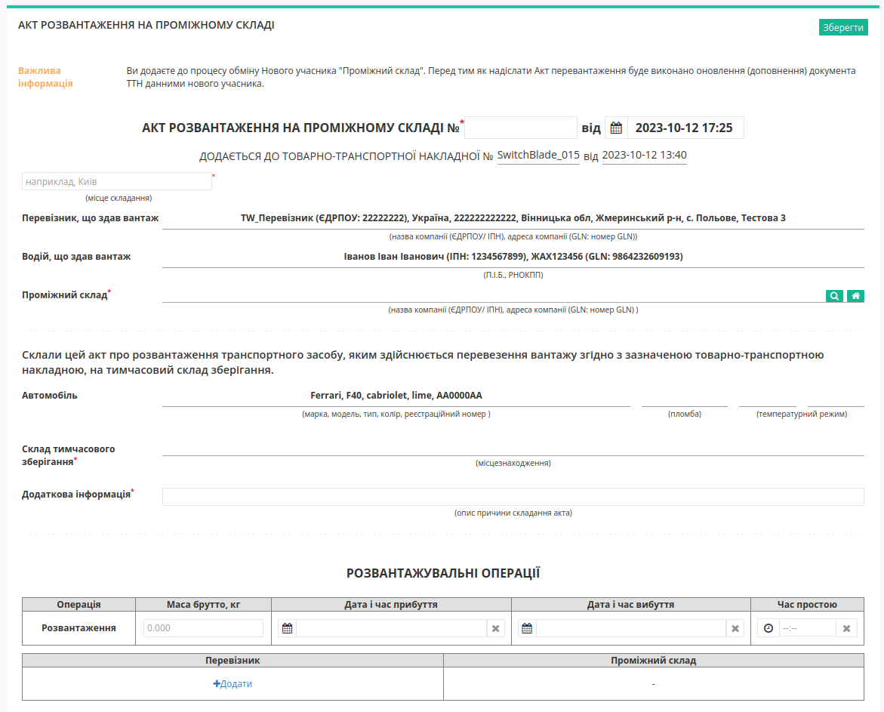

Потрібно зазначити номер Акта (автоматично проставляється поточна дата та час створення документа) та місце його складання (обов'язкові до заповнення поля позначені червоною зірочкою :red:`*`). Значення для **Проміжного складу** можливо заповнити за допомогою кнопки **"Пошук контрагента"** (|лупа|) або ж за допомогою кнопки **"Вказати себе"** (|будинок|):

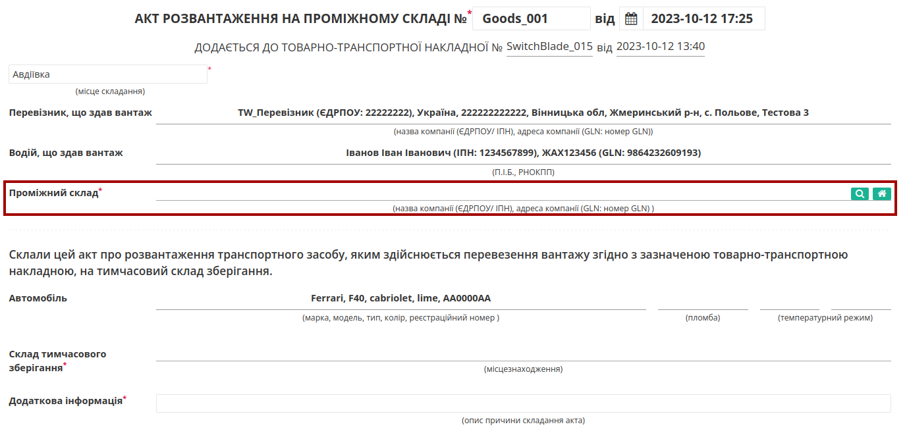

Для пошуку контрагента в модальному вікні потрібно ввести назву компанії, GLN або ІПН:

.. image:: pics_Create_ETTN/Create_ETTN_010.png
   :align: center

Лише після того, як поле "Проміжний склад" заповнено можливо заповнити адресу "Складу тимчасового зберігання" за допомогою кнопки **"Пошук контрагента"** (|лупа|):

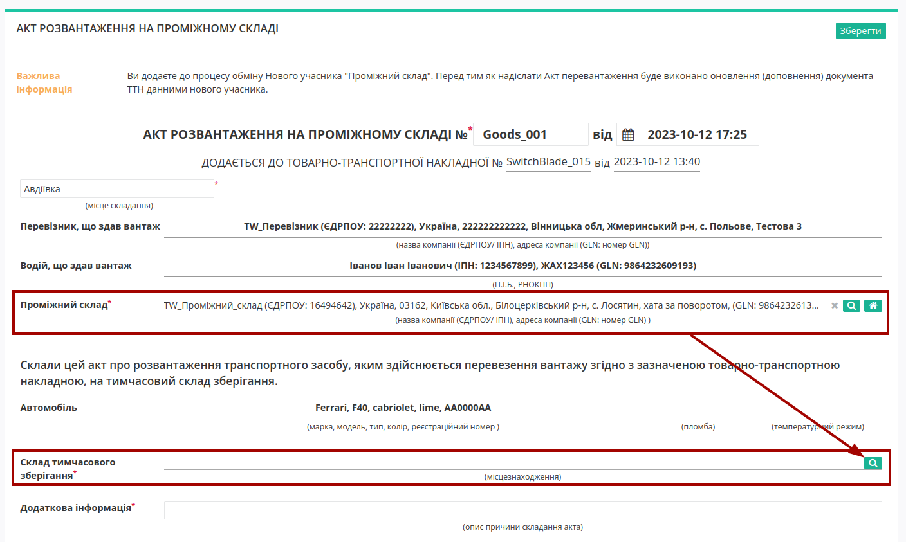

При формуванні "Акта розвантаження на проміжному складі" обов'язково заповнюється поле **"Додаткова інформація"** з описом причини складання Акта!

В документі також обов'язково зазначається відповідальна/-ні особи **"Перевізника, що здає вантаж"** за допомогою кнопки **"+Додати"**. Дані раніше доданих відповідальних осіб можливо обрати з віртуального довідника чи видалити зі списку за допомогою |trash|:

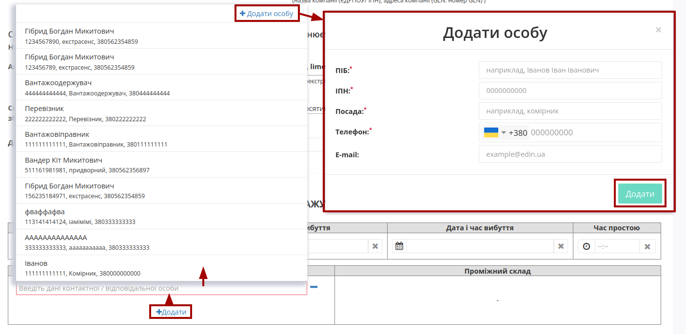

Довідник автоматично наповнюється при додаванні нового відповідального (кнопка **"+Додати особу"**). При додаванні нового відповідального в модальному вікні потрібно заповнити обов'язкові контактні дані (обов'язкові поля позначені червоною зірочкою :red:`*`).

Редагувати дані раніше введених осіб можливо за допомогою кнопки **"Змінити"** (|pencil_stencil|):

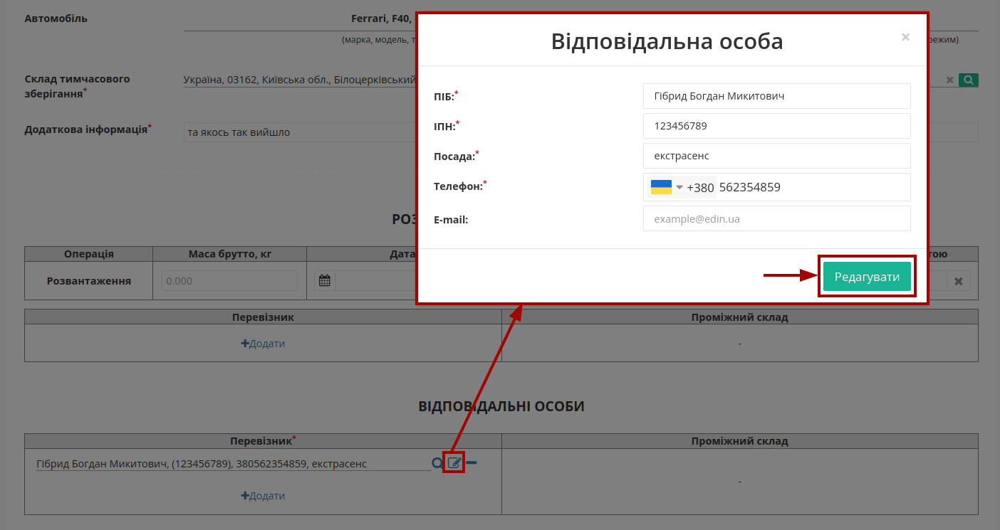

За потреби можливо **"Обрати"** (|лупа2|) іншу особу замість обраної/доданої раніше.

.. hint::
   **При підписанні:** якщо поле Вашої **"Відповідальної особи"** :underline:`незаповнене`, то воно може автоматично заповнюватись даними з Вашого ЕЦП (якщо це можливо).

Після того, як обов'язкові дані будуть введені потрібно **"Зберегти"**:

.. image:: pics_Create_StorageDelivery_Act_from/Create_StorageDelivery_Act_from_008.png
   :align: center

та **"Підписати"** документ:

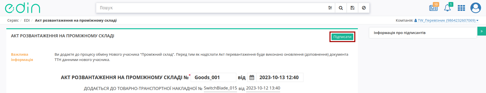

.. _sign:

**1.1 Підписання та відправка "Акта розвантаження на проміжному складі" "Перевізником"**
------------------------------------------------------------------------------------------------------------

.. include:: /_constant/atb_check/atb_check.rst
   :start-after: .. початок блоку для ATB_check
   :end-before: .. кінець блоку для ATB_check

.. tabs::

   .. tab:: Файловий ключ

      .. include:: /_constant/signing/signing.rst
         :start-after: .. початок блоку для Signing
         :end-before: .. кінець блоку для Signing

   .. tab:: Token

      .. include:: /_constant/token_signing/token_signing.rst
         :start-after: .. початок блоку для TokenSign
         :end-before: .. кінець блоку для TokenSign

   .. tab:: Гряда

      .. include:: /_constant/gryada_signing/gryada_signing.rst
         :start-after: .. початок блоку для GryadaSign
         :end-before: .. кінець блоку для GryadaSign

   .. tab:: Дія.Підпис

      .. include:: /_constant/diya_signing/diya_signing.rst
         :start-after: .. початок блоку для DiyaPidps
         :end-before: .. кінець блоку для DiyaPidps

   .. tab:: Cloud

      .. include:: /_constant/cloud_signing/cloud_signing.rst
         :start-after: .. початок блоку для CloudSign
         :end-before: .. кінець блоку для CloudSign

Після підписання "Акта розвантаження на проміжному складі" відображається "Інформація про підписантів", а документ можливо **"Надіслати"**:

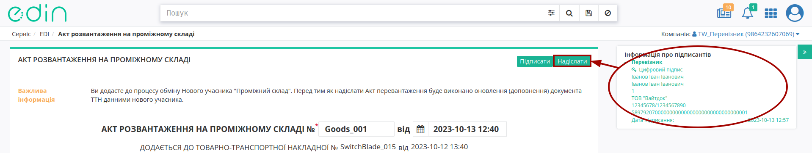

При відправці "Акта розвантаження на проміжному складі" на початку життєвого циклу даного Акта автоматично ініціюється внесення змін в "е-ТТН" (`Додаткові транзакції та зміни до е-ТТН v3 при формуванні актів <https://wiki.edin.ua/uk/latest/API_ETTNv3_1/Additional_transactions.html>`__). Зміни в "е-ТТН" також потребують підписання, наприклад:

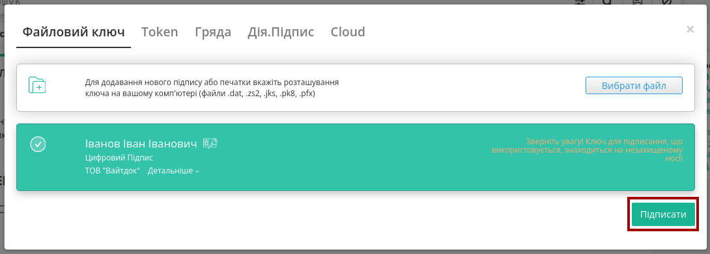

Після відправки автоматично відкривається папка **"Надіслані"**, де надісланий акт відображається зі статусом :orange:`"Очікує підписання отримувачем"`:

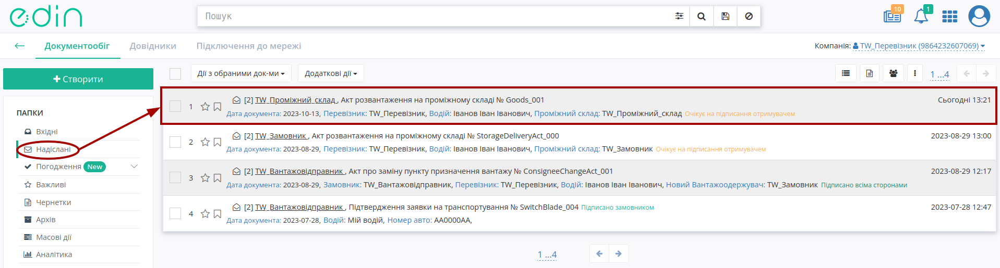

Після відправки у пов'язаного документа "е-ТТН" при його перегляді в блоці `ланцюжка документів <https://wiki.edin.ua/uk/latest/_constant/chain/chain.html>`__ відобрається створений Акт і виводиться повідомлення про обмежені дії з документом до кінця життєвого циклу акта (поки **"Перевізник"** не підпише або відхилить створений "Акт перепломбування"):

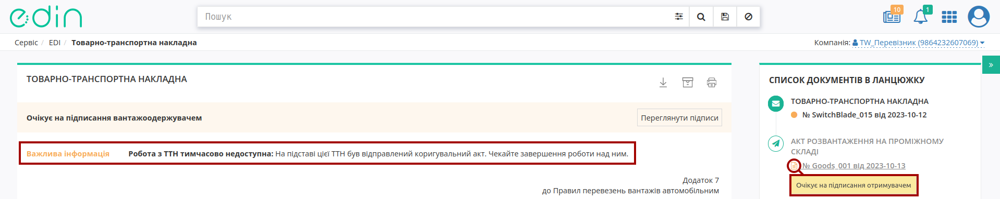

-------------------------------------

.. include:: /_constant/kontakti.rst