Створення "Акта завантаження на проміжному складі" на базі інших електронних документів
###################################################################################################

.. картинки в текст

.. |лупа| image:: /_constant/icons/magnifying_glass.png

.. |будинок| image:: /_constant/icons/house.png

.. |pencil_stencil| image:: /_constant/icons/pencil_stencil.png

.. |лупа2| image:: /_constant/icons/magnifying_glass2.png

.. |trash| image:: /_constant/icons/trash.png

.. role:: red

.. role:: green

.. role:: orange

.. role:: underline

.. contents:: Зміст:
   :depth: 3

---------

"Акт завантаження на проміжному складі" складається у разі повного перевантаження вантажу (без розподілу на кілька актів) в процесі перевезення на Проміжний склад з подальшим перевантаженням на інший автомобіль. Ініціатором "Акт завантаження на проміжному складі" виступає **"Проміжний склад"**. Обмін документом здійснюється та скріплюється електронними підписами представників між учасниками в наступному порядку: 

:green:`"Проміжний склад" -> "Перевізник"`

.. note::
   По завершенню життєвого циклу "Акта завантаження на проміжному складі" **"Перевізник"** має доповнити "е-ТТН" (до якої створювався Акт), підписавши і надіславши транзакцію до "е-ТТН":

   .. image:: /ETTN_3_0/BasicActChanges.png
      :align: center

.. _create-from-ttn:

**1 Створення "Акта завантаження на проміжному складі" на підставі "е-ТТН"**
================================================================================================================================

.. important::
   Функціонал створення "Акта завантаження на проміжному складі" доступний для компанії з роллю **"Проміжний склад"** на підставі підписаного з двох сторін "е-ТТН" (в статусі :orange:`"Очікує підписання вантажоодержувачем"`), до якого був складений "Акт розвантаження на проміжному складі" (цей вхідний для **"Проміжного складу"** документ має бути підписаний):

   .. image:: pics_Create_StoragePickUp_Act_from/Create_StoragePickUp_Act_from_015.png
      :align: center

Для того аби створити "Акт завантаження на проміжному складі" **"Проміжний склад"** має перейти до каталогу **"Вхідні"** (**"Надіслані"**, якщо Він також виступав в якості **"Вантажовідправника"** документа) та обрати потрібний "е-ТТН" документ в статусі :orange:`"Очікує підписання вантажоодержувачем"` (для зручності можливо скористатись `пошуком <https://wiki.edin.ua/uk/latest/general_2_0/rabota_s_platformoj_EDIN_2.0.html#doc-search>`__):

.. image:: pics_Create_StoragePickUp_Act_from/Create_StoragePickUp_Act_from_001.png
   :align: center

У відкритому документі натисніть **"Створити документ"** "Акт завантаження на проміжному складі" в блоці `ланцюжка документів <https://wiki.edin.ua/uk/latest/_constant/chain/chain.html>`__:

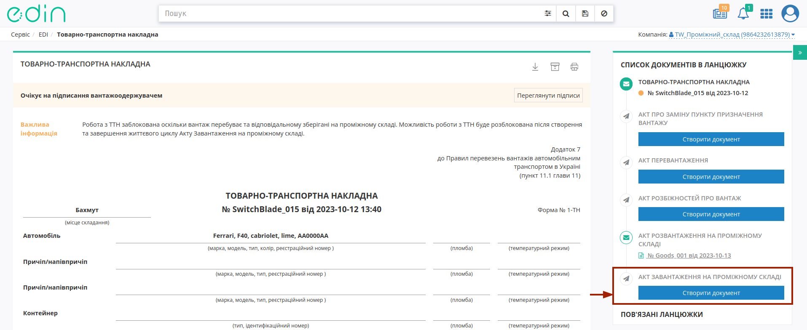

При створенні документа "Акта завантаження на проміжному складі" його форма автоматично заповнюється недоступними до редагування даними пов'язаних "е-ТТН" та "Акта розвантаження на проміжному складі", як документів-підстав: 

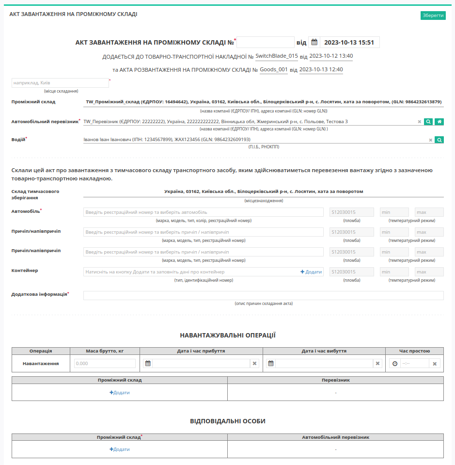

Потрібно зазначити номер Акта (автоматично проставляється поточна дата та час створення документа) та місце його складання (обов'язкові до заповнення поля позначені червоною зірочкою :red:`*`). Дані "Автомобільного перевізника" та "Водія" заповнюються автоматично з "е-ТТН", однак доступні до редагування за допомогою кнопки **"Пошук контрагента"** (|лупа|) або ж за допомогою кнопки **"Вказати себе"** (|будинок|):

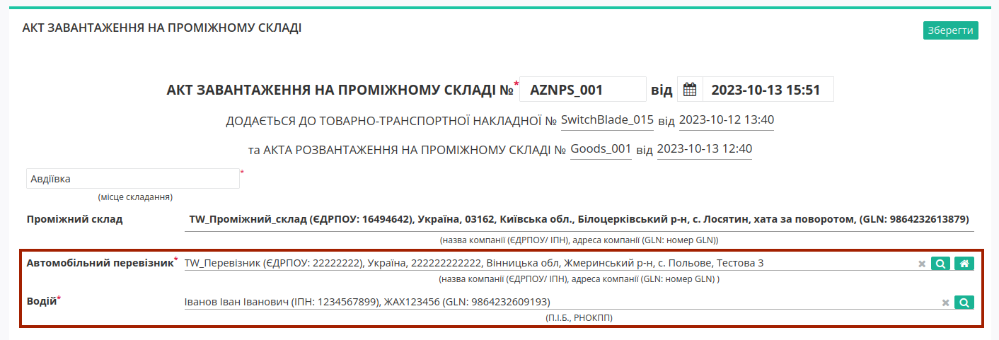

Для пошуку контрагента в модальному вікні потрібно ввести назву компанії, GLN або ІПН:

.. image:: pics_Create_ETTN/Create_ETTN_010.png
   :align: center

Поле "Склад тимчасового зберігання" заповнюється автоматично з попереднього "Акта розвантаження на проміжному складі".

Для вибору нового автомобіля / причепів реалізований Ваш особистий довідник, що автоматично формується при додаванні нового транспортного засобу (кнопка **"+Новий транспортний засіб"**). При додаванні нового транспортного засобу в модальному вікні потрібно заповнити "Реєстраційний номер", "Марка", "Модель", "Тип":

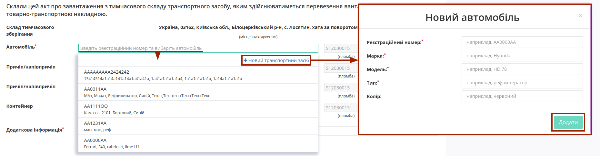

.. hint::
   Для раніше введеного реєстрайійного номеру (лише латинниця), наприклад, **AA0001AA** користувач може скористатись пошуком з довідника (min 4 символи), наприклад, ``AA00, 0001, 01AA, ...``:

   .. image:: pics_Create_StoragePickUp_Act_from/Create_StoragePickUp_Act_from_005.png
      :align: center

   Також через наш пошук можливо за повним збігом (8 символів) знайти транспортний засіб у відкритих джерелах:

   .. image:: /ETTN_3_0/pics_Create_ETTN/Create_ETTN_075.png
      :align: center

   **Примітка:** запис про зміни даних транспортного засобу вносяться в довідник лише при відправці документа!

Після додавання чи вибору транспортного засобу з'являються кнопки:

* **"Обрати"** - вибір іншого транспортного засобу;
* **"Змінити"** - редагування даних обраного транспортного засобу (редагування довідника);
* **"Очистити"** - видалити введені в рядок дані.

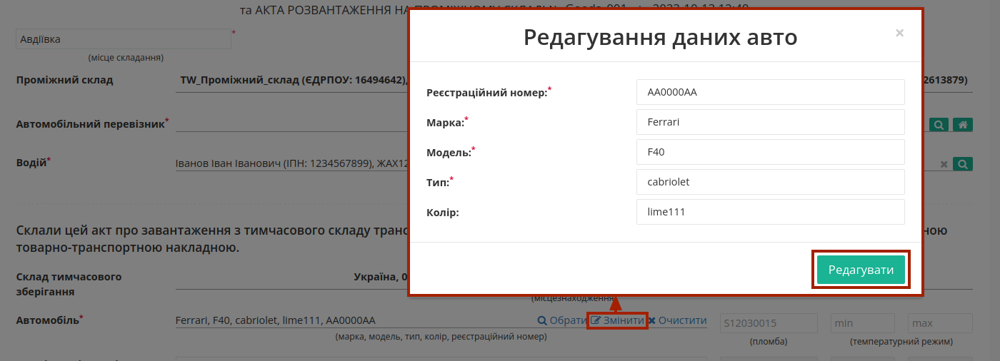

.. note::
   Незважаючи на те, що поля причіпа/напівпричіпа / контейнера є опціональним, при їх наявності такі дані є обов'язковими до заповнення! 

Принцип заповнення причіпа/напівпричіпа теж реалізований через довідник (аналогічно додаванню даних про автомобіль): 

.. image:: pics_Create_StoragePickUp_Act_from/Create_StoragePickUp_Act_from_008.png
   :align: center

При додаванні даних контейнера (кнопка **"+Додати"**) в модальному вікні потрібно обрати "Тип контейнера": 20-футовий / 40-футовий та зазначити "Ідентифікаційний номер":

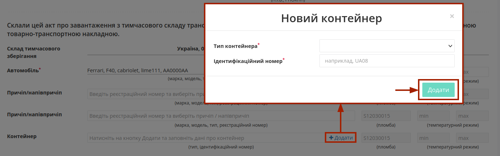

По кожному вказаному транспорному засобу є можливість зазначити (опціонально) номер пломби та температурний режим:

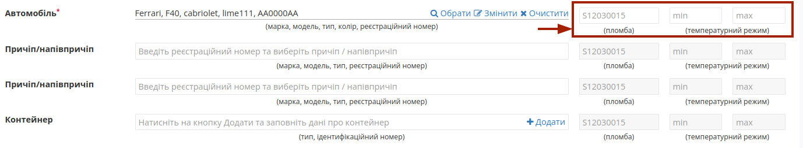

При формуванні "Акта завантаження на проміжному складі" обов'язково заповнюється поле **"Додаткова інформація"** з описом причини складання Акта!

В документі також обов'язково зазначається відповідальна/-ні особи **"Проміжного складу"** за допомогою кнопки **"+Додати"**. Дані раніше доданих відповідальних осіб можливо обрати з віртуального довідника чи видалити зі списку за допомогою |trash|:

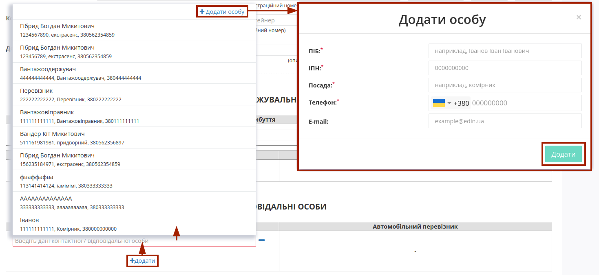

Довідник автоматично наповнюється при додаванні нового відповідального (кнопка **"+Додати особу"**). При додаванні нового відповідального в модальному вікні потрібно заповнити обов'язкові контактні дані (обов'язкові поля позначені червоною зірочкою :red:`*`).

Редагувати дані раніше введених осіб можливо за допомогою кнопки **"Змінити"** (|pencil_stencil|):

.. image:: pics_Create_StoragePickUp_Act_from/Create_StoragePickUp_Act_from_012.png
   :align: center

За потреби можливо **"Обрати"** (|лупа2|) іншу особу замість обраної/доданої раніше.

.. hint::
   **При підписанні:** якщо поле Вашої **"Відповідальної особи"** :underline:`незаповнене`, то воно може автоматично заповнюватись даними з Вашого ЕЦП (якщо це можливо).

Після того, як обов'язкові дані будуть введені потрібно **"Зберегти"**:

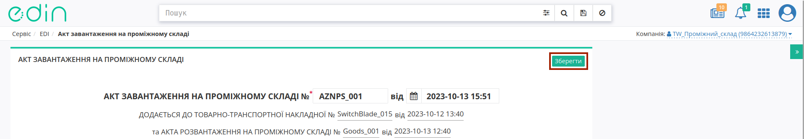

та **"Підписати"** документ:

.. image:: pics_Create_StoragePickUp_Act_from/Create_StoragePickUp_Act_from_014.png
   :align: center

.. _sign:

**1.1 Підписання та відправка "Акта завантаження на проміжному складі" "Проміжним складом"**
------------------------------------------------------------------------------------------------------------

.. include:: /_constant/atb_check/atb_check.rst
   :start-after: .. початок блоку для ATB_check
   :end-before: .. кінець блоку для ATB_check

.. tabs::

   .. tab:: Файловий ключ

      .. include:: /_constant/signing/signing.rst
         :start-after: .. початок блоку для Signing
         :end-before: .. кінець блоку для Signing

   .. tab:: Token

      .. include:: /_constant/token_signing/token_signing.rst
         :start-after: .. початок блоку для TokenSign
         :end-before: .. кінець блоку для TokenSign

   .. tab:: Гряда

      .. include:: /_constant/gryada_signing/gryada_signing.rst
         :start-after: .. початок блоку для GryadaSign
         :end-before: .. кінець блоку для GryadaSign

   .. tab:: Дія.Підпис

      .. include:: /_constant/diya_signing/diya_signing.rst
         :start-after: .. початок блоку для DiyaPidps
         :end-before: .. кінець блоку для DiyaPidps

   .. tab:: Cloud

      .. include:: /_constant/cloud_signing/cloud_signing.rst
         :start-after: .. початок блоку для CloudSign
         :end-before: .. кінець блоку для CloudSign

Після підписання "Акта завантаження на проміжному складі" відображається "Інформація про підписантів", а документ можливо **"Надіслати"**:

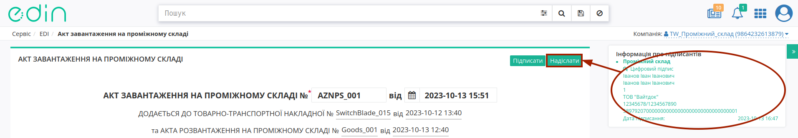

Після відправки автоматично відкривається папка **"Надіслані"**, де надісланий акт відображається зі статусом :orange:`"Очікує підписання отримувачем"`:

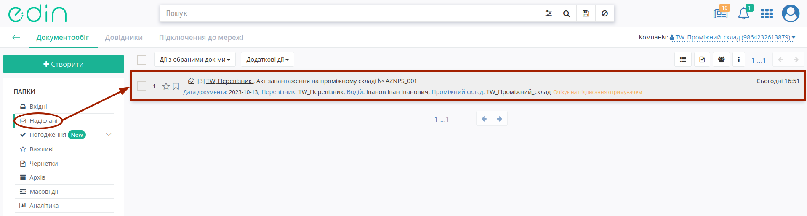

Документ "е-ТТН" все ще залишається залишається недоступним до опрацювання на стороні кінцевого контрагента поки **"Перевізник"** не підпише даний "Акта завантаження на проміжному складі" або дані акти не будуть відхилені:

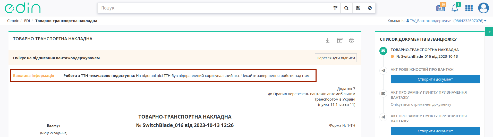

-------------------------------------

.. include:: /_constant/kontakti.rst