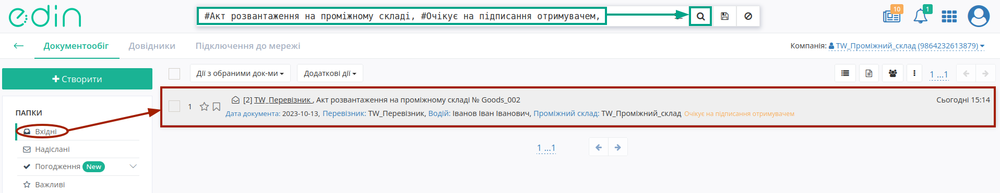
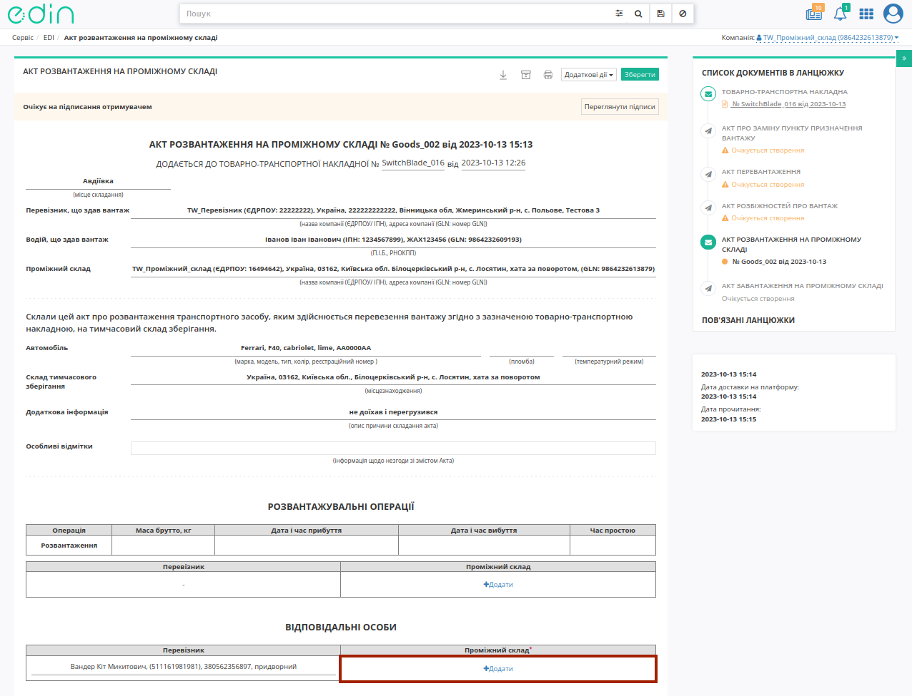
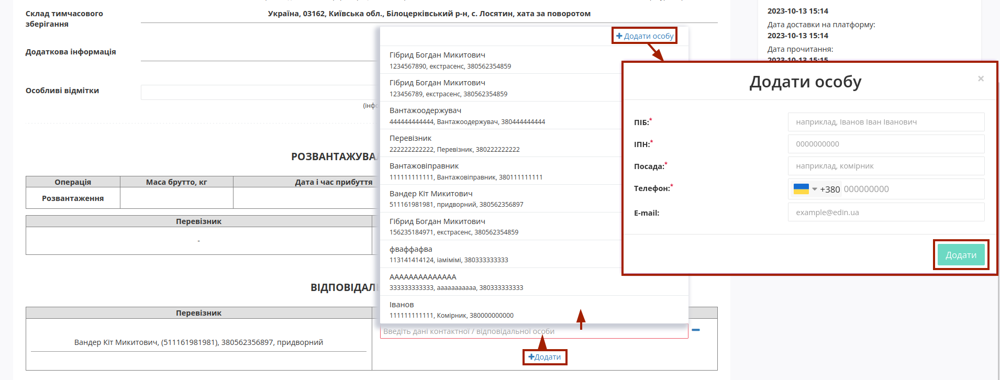
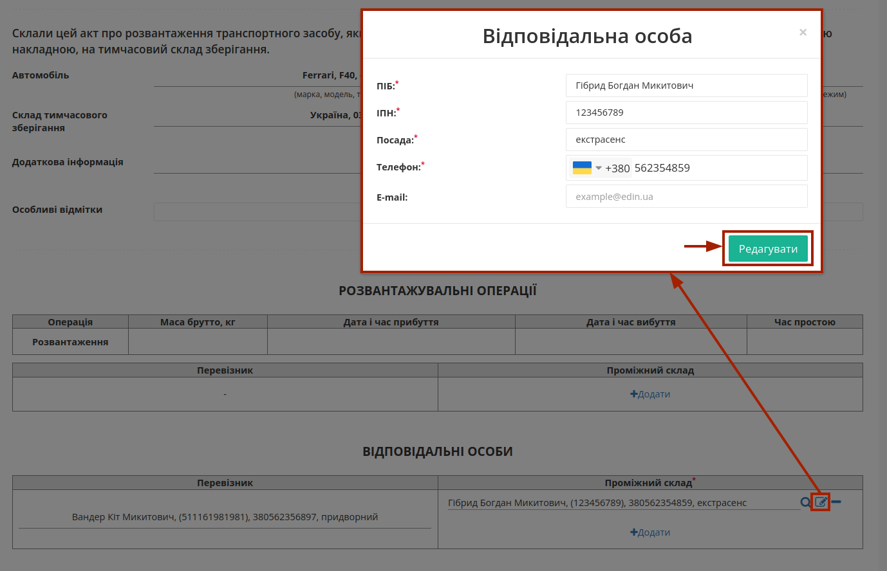
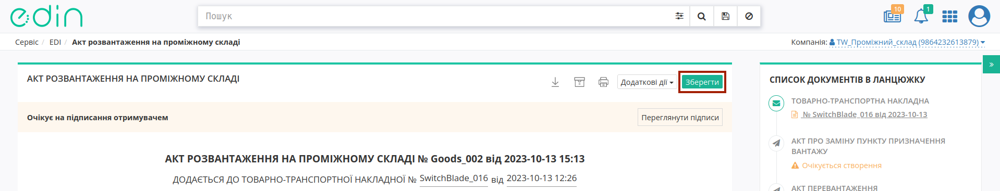
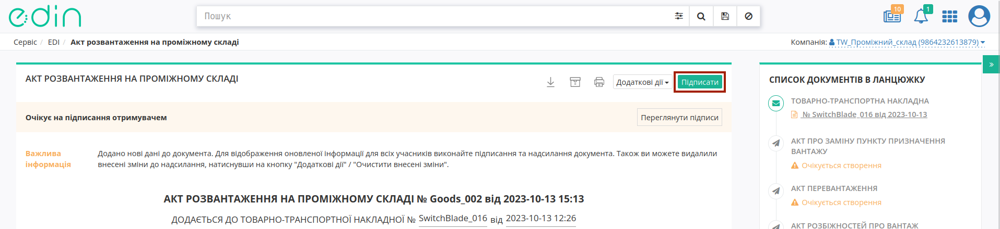
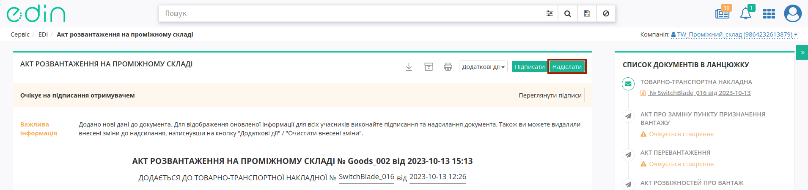
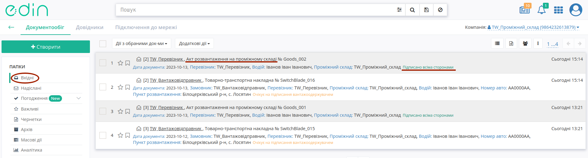

Обробка вхідного "Акта розвантаження на проміжному складі"
###################################################################################################

.. картинки в текст

.. |лупа| image:: /_constant/icons/magnifying_glass.png

.. |будинок| image:: /_constant/icons/house.png

.. |pencil_stencil| image:: /_constant/icons/pencil_stencil.png

.. |лупа2| image:: /_constant/icons/magnifying_glass2.png

.. |trash| image:: /_constant/icons/trash.png

.. role:: red

.. role:: green

.. role:: orange

.. role:: underline

.. contents:: Зміст:
   :depth: 3

---------

"Акт розвантаження на проміжному складі" складається у разі повного перевантаження вантажу (без розподілу на кілька актів) в процесі перевезення на Проміжний склад з подальшим перевантаженням на інший автомобіль. Ініціатором "Акт розвантаження на проміжному складі" виступає **"Перевізник"** (**"Водій"** або відповідальна особа компанії **"Перевізника"**). Обмін документом здійснюється та скріплюється електронними підписами представників між учасниками в наступному порядку: 

:green:`"Перевізник" -> "Проміжний склад"`

Отримувачем "Акта розвантаження на проміжному складі" виступає учасник з роллю **"Проміжний склад"**.

.. _from-carrier-to-storage:

**1 Обробка вхідного "Акта розвантаження на проміжному складі" на стороні "Проміжного складу"**
====================================================================================================================================

Для обробки "Акта розвантаження на проміжному складі" **Проміжним складом** в сервісі "EDI Network" потрібно перейти у **"Вхідні"** та вибрати **"Акт розвантаження на проміжному складі"** в статусі :orange:`"Очікує на підписання отримувачем"` (для зручності можливо скористатись рядком `пошуку <https://wiki.edin.ua/uk/latest/general_2_0/rabota_s_platformoj_EDIN_2.0.html#doc-search>`__):

Після ознайомлення з документом Ви можете **Прийняти** чи `"Відхилити" <https://wiki.edin.ua/uk/latest/ETTN_3_0/StorageDelivery_Act_Reject.html>`__ "Акт розвантаження на проміжному складі". Для того, щоб **Прийняти** документ обов'язково потрібно **"+Додати"** дані відповідальної особи в табличній частині блоку **"Вантажно-розвантажувальні операції"** в нижній частині документа:

Дані раніше доданих відповідальних осіб можливо обрати з віртуального довідника чи видалити зі списку за допомогою |trash|:

Довідник автоматично наповнюється при додаванні нового відповідального (кнопка **"+Додати особу"**). При додаванні нового відповідального в модальному вікні потрібно заповнити обов'язкові контактні дані (обов'язкові поля позначені червоною зірочкою :red:`*`).

Редагувати дані раніше введених осіб можливо за допомогою кнопки **"Змінити"** (|pencil_stencil|):

За потреби можливо **"Обрати"** (|лупа2|) іншу особу замість обраної/доданої раніше.

Після того, як обов'язкові дані будуть введені потрібно **"Зберегти"**:

та **"Підписати"** документ:

.. _sign:

**1.1 Підписання та відправка "Акта розвантаження на проміжному складі" "Проміжним складом"**
-----------------------------------------------------------------------------------------------------

.. include:: /_constant/atb_check/atb_check.rst
   :start-after: .. початок блоку для ATB_check
   :end-before: .. кінець блоку для ATB_check

.. tabs::

   .. tab:: Файловий ключ

      .. include:: /_constant/signing/signing.rst
         :start-after: .. початок блоку для Signing
         :end-before: .. кінець блоку для Signing

   .. tab:: Token

      .. include:: /_constant/token_signing/token_signing.rst
         :start-after: .. початок блоку для TokenSign
         :end-before: .. кінець блоку для TokenSign

   .. tab:: Гряда

      .. include:: /_constant/gryada_signing/gryada_signing.rst
         :start-after: .. початок блоку для GryadaSign
         :end-before: .. кінець блоку для GryadaSign

   .. tab:: Cloud

      .. include:: /_constant/cloud_signing/cloud_signing.rst
         :start-after: .. початок блоку для CloudSign
         :end-before: .. кінець блоку для CloudSign

Після підписання "Акта розвантаження на проміжному складі" інформація про нового підписанта відображається після натискання кнопки **"Переглянути підписи"**. Підписаний документ можливо **"Надіслати"**:

Після відправки документа **Проміжним складом** "Акту розвантаження на проміжному складі" присвоюється статус :green:`"Підписано всіма сторонами"`:

.. hint::
   Обробка "Акта розвантаження на проміжному складі" логічно пов'язана з подальшим формуванням `"Акта завантаження на проміжному складі" <https://wiki.edin.ua/uk/latest/ETTN_3_0/Create_StoragePickUp_Act_from.html>`__. Ці два акти логічно об'єднані і процесно не можуть існувати один без іншого - тому дії з "е-ТТН" обмежуються поки "Акт розвантаження на проміжному складі" та, слідуючий за ним, "Акт завантаження на проміжному складі" не завершать свої життєві цикли або не будуть відхилені!

   .. image:: pics_Processing_StorageDelivery_Act/Processing_StorageDelivery_Act_009.png
      :align: center

---------------------------------

.. include:: /_constant/kontakti.rst
