Узгодження цін на web-платформі EDIN-Price. Інструкція для роздрібної мережі
#############################################################################
---------

.. contents:: Зміст:
   :depth: 2

---------

Вивантаження товарного довідника для Постачальника. Схема роботи
****************************************************************

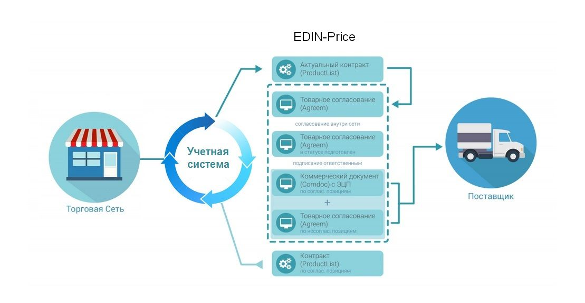

Роздрібна мережа зі своєї облікової системи вивантажує на **FTP** актуальний товарний довідник (контракт, специфікації) в форматі **XML** (PRODUCTLIST.XML). Після обробки даного файлу на платформі EDIN, у постачальника, в меню **Сервіс** - **EDIN-Price**, відобразиться перелік діючих контрактів з мережею.
Постачальник на підставі узгодженого товарного довідника формує пропозицію щодо зміни цін і направляє його в торговельну мережу. 

Торгова мережа проводить узгодження даної пропозиції, в разі успішного погодження, підписує зі свого боку комерційний документ і направляє його постачальнику.
Постачальник зі свого боку підписує комерційний документ і відправляє Торгової мережі. Після отримання підписаного з обох сторін комерційного документа, на FTP Торгової мережі викладається новий узгоджений PRODUCTLIST.XML, на підставі якого оновлюються дані в обліковій системі. Після цих змін мережа повторно вивантажує вже оновлений товарний довідник (контракт, специфікацію) на FTP.

.. note::  В разі будь-яких змін, погоджених не через систему EDI, PRODUCTLIST.XML вивантажується повторно. 

Обробка Товарного узгодження
****************************************************************

Примітка! При наявності в бізнес процесі додаткових департаментів (керівник відділу закупівлі, служба безпеки, економічна безпека, фінансовий аналітик, логістика) статуси можуть змінюватися. 

Нижче представлений список можливих статусів:

1. **На погодженні** - отримано мережею, без внесення змін
2. **Підготовлено** - оброблений категорійним менеджером мережі

Проміжні статуси обробки документів для регулювання бізнес процесів узгодження:

- *Підтверджений*
- *Перевірений*
- *Готовий до підписання*
- *Узгоджений*

3. **Підписано** - оброблений фінальним підписантом і накладена ЕЦП з боку мережі

1 етап. Обробка товарного узгодження категорійним менеджером
====================================================================
Документ Товарне узгодження, відправлений Постачальником, знаходитися в розділі Вхідні.
Відібрати документи для обробки можна за допомогою фільтра. Для цього необхідно вибрати тип документа «Товарне узгодження» і відповідний статус:

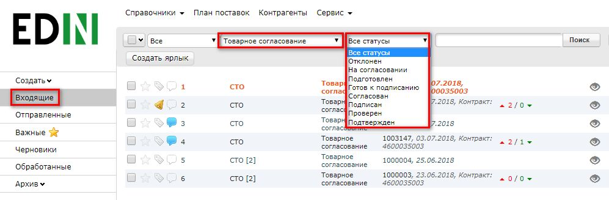

Для швидкого доступу до документів, які потребують обробки, можна створити ярлик «**Необхідно узгодження**»:

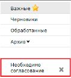

Для відкриття вхідного документа натисніть на нього:

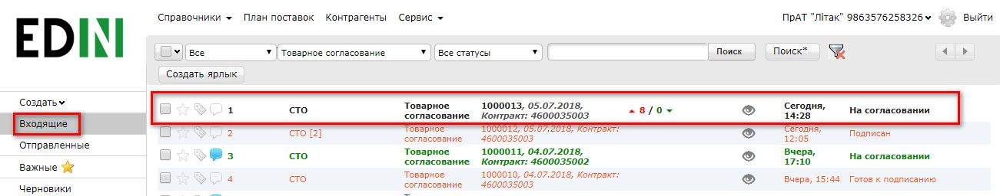

У відкритому документі можна побачити основну інформацію, яка залежить від типу документа, а при натисканні на кнопку **Показати повністю** можна подивитися додатковий вміст документа. У документі на зміну регулярної / промо ціни Вам необхідно перевірити ціни в кожній з позицій і вказати статус - Прийнято / Не прийнято, по необхідності змінити період для нової ціни, а потім змінити загальний статус документа - На погодженні / Підготовлено.

Біля найменування товарної позиції розміщена ікона "інфо". Після її натискання, в додатковому вікні відкриваються піктограми *Listex* і *Ucat*. Натиснувши на них відбувається перехід на сайт каталогів.
Якщо по товару постачальник завантажив сертифікат, то біля штрих-коду буде іконка "галочка", яка свідчить про те, що до штрих-коду прикріплений сертифікат. Після її натискання в додатковому вікні відобразиться основна інформація по сертифікату:

.. image:: pics_Soglasovanie_cen_Instrukcija_dlja_seti/pics_Soglasovanie_cen_Instrukcija_dlja_seti_05.png
   :align: center

За допомогою кнопок «**Дія**» можливо:

- скачати сертифікат з усіма додатками (архів з файлами)
- переглянути скан-копію сертифіката
- отримати пряме посилання на скан-копію сертифіката
- скачати основний бланк сертифіката (титульна сторінка)

Додатково, для перепогодження регулярної ціни, якщо зазначений період документа має спільні дати з раніше узгодженими промо цінами, то біля дати останньої зміни буде розміщена іконка "відсотки". Після її натискання, в додатковому вікні відкриється раніше узгоджена додаткова інформація по промо: період і ціна з ПДВ:

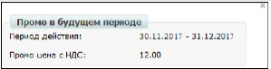

Після зміни статусу, Вам необхідно підтвердити дію, для цього натисніть «**Закінчити**»:

.. image:: pics_Soglasovanie_cen_Instrukcija_dlja_seti/pics_Soglasovanie_cen_Instrukcija_dlja_seti_07.png
   :align: center

У вікні «**Зв'язок з продавцем**» у Вас є можливість читати коментарі постачальника і залишати свої. Для цього введіть текст повідомлення в порожнє поле і натисніть кнопку **Надіслати**:

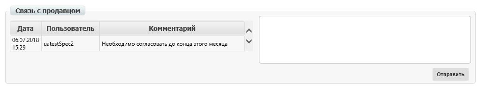

2 етап. Обробка Товарного узгодження Керівником відділу закупівель
=======================================================================
Документ Товарне узгодження, узгоджений Категорійним менеджером знаходиться в розділі **Вхідні** зі статусом Підготовлено. Аналогічно, як і для категорійного менеджера, можна скористатися фільтрами або перейти по ярлику «**Необхідно узгодження**» для відображення потрібного списку документів.
Для відкриття вхідного документа натисніть на нього:

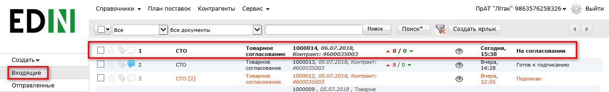

У формі документа Вам необхідно перевірити ціни в кожній з позицій, вказати статус - Прийнято / Не прийнято, а потім змінити загальний статус документа - Готовий до підписання / Відхилено.

Також нижче в формі документа у Вас є можливість звернутися до відповідного постачальника і залишити йому коментар. Для цього введіть текст повідомлення в порожнє поле і натисніть кнопку **Надіслати**.

Після зміни статусу, Вам необхідно підтвердити дію, для цього натисніть «**Закінчити**»:

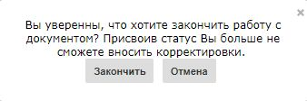

3 етап. Обробка і підписання Товарного узгодження Комерційним директором
================================================================================
Документ Товарне узгодження, узгоджений Керівником відділу закупівель знаходиться в розділі Вхідні зі статусом Готовий до підписання. Як і для попередніх ролей, документи можна відфільтрувати за статусом або перейти по ярлику «**Необхідно узгодження**».

Примітка! Є можливість масового підписання. Цей процес описаний в розділі Додаткові можливості і функції.

У разі одиничного підписання необхідно відкрити вхідний документ Товарне узгодження, натиснувши на нього:

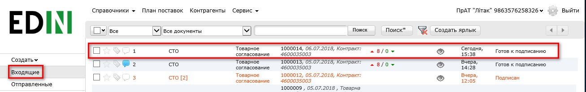

У формі документа Вам необхідно перевірити ціни в кожній з позицій, вказати статус - Прийнято / Не прийнято, потім змінити загальний статус документа - Погоджено / Відхилено. Після зміни статусу натисніть кнопку **Підписати**.

Після первинної настройки ЕЦП і введення ключів натисніть кнопку **Зчитати ключі**:

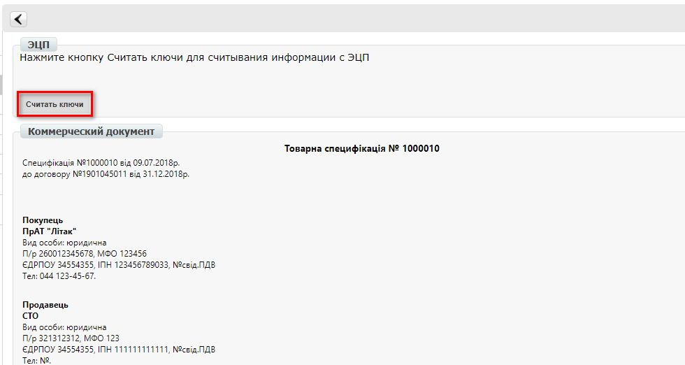

Виберіть відповідні ключі для підписання і натисніть знову **Зчитати ключі**:

.. image:: pics_Soglasovanie_cen_Instrukcija_dlja_seti/pics_Soglasovanie_cen_Instrukcija_dlja_seti_14.png
   :align: center

Потім натисніть **Підписати**:

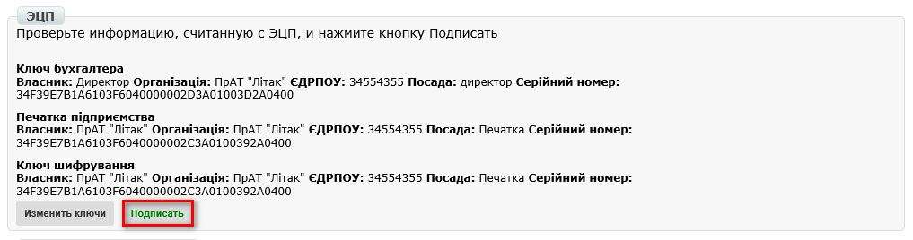

Після успішного підписання, натисніть кнопку **Надіслати**:

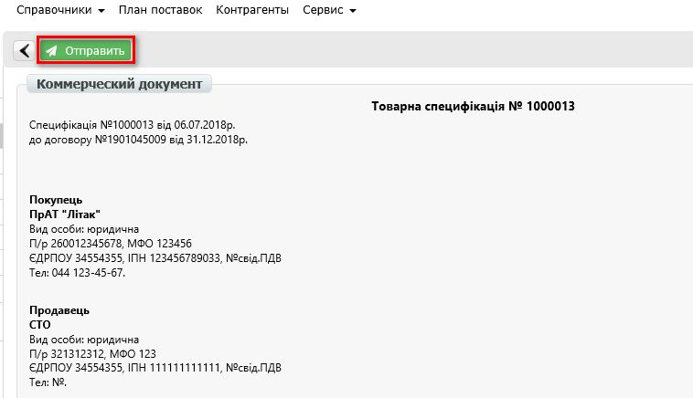

Створення Товарного узгодження
****************************************************************
Перегляд актуального узгодженого довідника
================================================================================
Для перегляду і подальшої роботи з узгодженим довідником необхідно навести курсор миші на трикутник біля меню «**Сервіс**» і в випадаючому списку вибрати **EDIN-Price**:

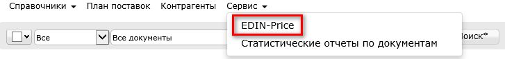

При цьому відкриється сторінка з актуальними товарними довідниками, згрупованими за назвою постачальника:

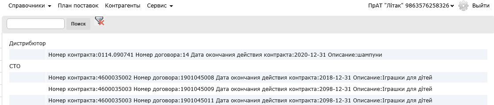

Фільтр «**пошук**» шукає по найменуванню компанії, товарної позиції, ЄДРПОУ, номеру договору, номеру контракту, штрих-коду, артикулу. Для перегляду вмісту довідника необхідно зайти в відповідний документ шляхом натискання лівої кнопки миші.
Буде відкрита детальна форма довідника.

.. note:: Всі дані, наведені на формі - фіктивні, використовуються тільки в якості прикладу 

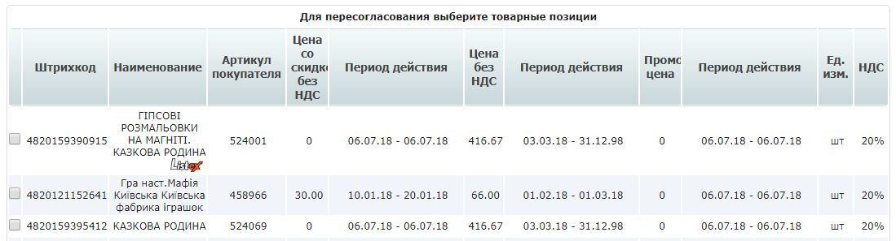

Створення пропозиції
========================================================
Для ініціювання процесу перепогодження регулярної ціни необхідно створити документ «**Товарне узгодження**». Створення документа для перепогодження промо цін можливе в 2-х режимах - вручну та за допомогою завантаження Excel файла.

Створення Товарного узгодження для перепогодження промо ціни вручну
---------------------------------------------------------------------------
Для створення товарного узгодження зайдіть в необхідний узгоджений довідник. У формі що відкрилась виберіть позиції для перепогодження, і натисніть кнопку **Перепогодити**:

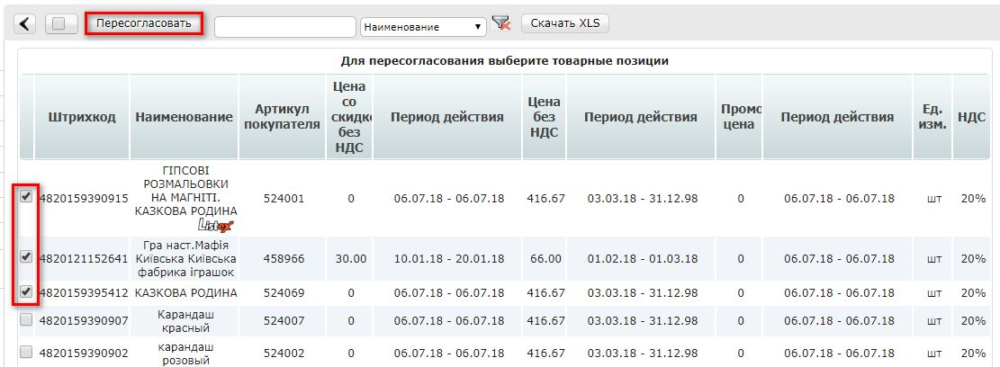

У спливаючому вікні виберіть «**Змінити промо ціну**» і натисніть «**ОК**»:

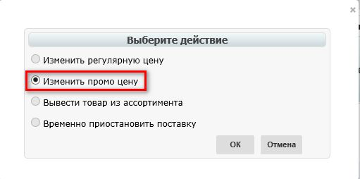

У вікні встановіть нові ціни у відповідних колонках (Нова ціна без ПДВ / Нова ціна з ПДВ - за умовами договору з мережею). Потім вкажіть Дату початку і Дату закінчення дії нової ціни. Дата початку дії нової ціни повинна перевищувати узгоджену к-ть днів від дати створення документа Товарне узгодження.

При необхідності перелік позицій можна розширити або скоротити за допомогою кнопок «Додати позицію» і «Видалити позицію». Біля найменування товарної позиції розміщена іконка з назвою каталогу. Після її натискання, в додатковому вікні відкриваються піктограми *Listex* і *Ucat*. Натиснувши на них відбувається перехід на сайт відповідних каталогів.

Існує можливість додати обгрунтування зміни ціни або інші документи, які можуть прискорити узгодження. Для цього натисніть кнопку «**Додати обгрунтування**»:

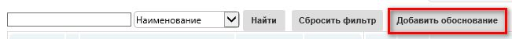
 
У вікні що відкрилось можна додати необхідні файли:

.. image:: pics_Soglasovanie_cen_Instrukcija_dlja_seti/pics_Soglasovanie_cen_Instrukcija_dlja_seti_23.png
   :align: center

Для додавання файлів використовується кнопка «**Додати файл**», для видалення зайвих файлів - кнопка з хрестиком біля імені файлу.

Після того, як всі файли були додані - необхідно натиснути на кнопку «**Створити обгрунтування**», в результаті файли будуть збережені в окремий архів і довантажені до товарного узгодженням. Після натискання кнопки «Створити обгрунтування» зміна архіву буде неможлива. У разі якщо необхідно додати і / або видалити якісь файли - всю процедуру слід повторити спочатку. Після збереження внесених змін натисніть кнопку **Відправити**.

Зверніть увагу! Доступ до поля Кількість регулюється (заповнюється / не заповнюється). Дату початку дії нової ціни і дату закінчення дії нової ціни постачальник не змінює.

У розділі **Відправлені** знаходяться відправлені на перепогодження постачальнику документи:

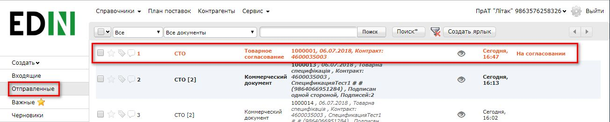

Жирним курсивом виділено ще не прочитаний Постачальником документ.

Товарне узгодження має кілька етапів узгодження документа на стороні постачальника, які у Вас відображаються у вигляді статусу документа:

- **На погодженні** - отриманий постачальником
- **Відхилено** - відхилений постачальником
- **Погоджено** - узгоджений, але комерційний документ не підписаний
- **Підписано** - накладена ЕЦП з боку постачальника

Для перегляду відправленого документа «**Товарне узгодження**» натисніть на нього. У відкритому документі можна побачити основну інформацію по документу.
Для зв'язку з постачальником введіть текст повідомлення у вікно **Зв'язок з продавцем** і натисніть кнопку **Надіслати**:

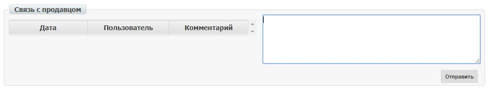

Створення Товарного узгодження для перепогодження промо ціни за допомогою завантаження з Excel
----------------------------------------------------------------------------------------------------
Виберіть розділ **Узгоджений довідник**, відкрийте необхідний запис товарного довідника і натисніть кнопку **Завантажити шаблон**:

.. image:: pics_Soglasovanie_cen_Instrukcija_dlja_seti/pics_Soglasovanie_cen_Instrukcija_dlja_seti_26.png
   :align: center

Після натискання на кнопку відкриється форма збереження шаблону. Збережіть файл на комп'ютер, відкрийте його для заповнення. У шаблоні заповніть поля по позиціях для перепогодження:

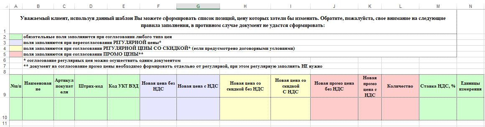

.. admonition:: Зверніть увагу!

   Не міняйте розширення файлу шаблону. Воно повинно бути тільки xls. Не міняйте структуру файлу і послідовність колонок, не видаляйте верхні рядки.

Збережіть заповнений файл шаблону, а потім натисніть кнопку **Завантажити Промо ціни XLS** - для завантаження шаблону з заповненими промо цінами. Після натискання на кнопку завантаження відкриється стандартна форма для завантаження файлу.

Виберіть збережений вами шаблон.
На підставі завантаженого файлу сформується документ Товарне узгодження. Перевірте правильність заповнення даних, вкажіть період початку і закінчення дії нової ціни, заповніть кількість, а потім натисніть кнопку Зберегти і після збереження документа кнопку **Надіслати**.

Важливо! У документ Товарне узгодження потрапляють тільки ті товарні позиції, які є в вибраній специфікації на платформі. Звірка проводиться по артикулу і по штрих-коду.

Додаткові можливості і функції
****************************************************************

Інтерфейс
===============================================
Для зручності визначення типу Товарного узгодження, документи різних типів виділені різними кольорами:
 
- чорні - пропозиції щодо зміни регулярної ціни
- помаранчеві - пропозиції щодо зміни промо ціни
- зелені - пропозиція щодо виведення товару з асортименту та тимчасового призупинення постачання товару

Статус документа винесений останньої колонкою. Є лічильник позицій з підвищенням і зниженням регулярної ціни, червоним виводиться кількість позицій на підвищення ціни, а зеленим - зниження. За необхідності документ можна виділити як важливий, ставити мітки, а також прочитати всю історію листування не заходячи в документ.

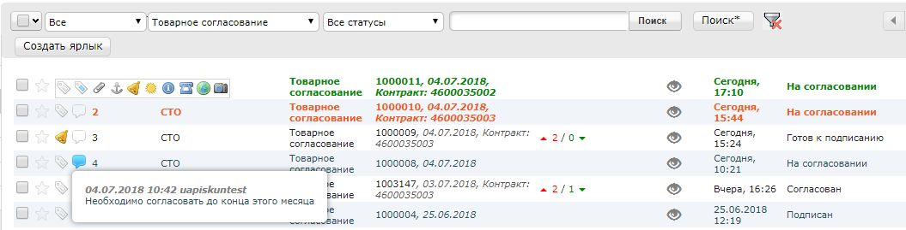

Історія змін
===============================================
При обробці товарного узгодження є можливість переглянути історію змін як по всьому документу, так і за окремими позиціями. Для перегляду історії змін по всьому документу в товарному узгодженні натисніть кнопку «**Історія змін**»:

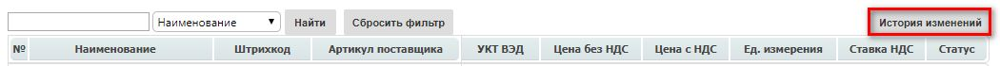

Відкриється вікно з історією змін по документу.

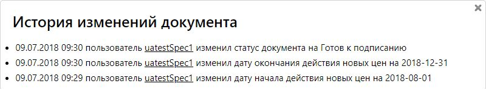

Для перегляду історії змін по конкретній позиції необхідно натиснути на Найменування, Штрих-код або Артикул. В результаті буде відкрито вікно з історією змін по позиції.

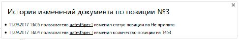

Обгрунтування
===============================================
У разі якщо постачальник додавав обгрунтування зміни ціни або приклав якісь інші файли, то в розділі Вхідні документи з обгрунтуванням будуть позначені скріпкою біля статусу:

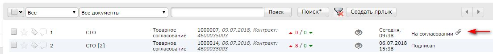

Завантажити та ознайомитися з вкладенням можна зайшовши в товарне узгодження і натиснувши на кнопку «**Завантажити обгрунтування**»:

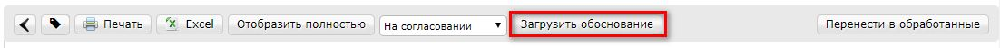

Масове підписання
===============================================

1. У журналі оберіть чекбоксами документи готові до підписання і натисніть "**Підписати**"

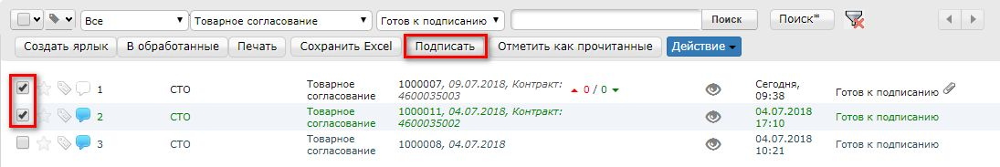

2. Відкриється вікно Підписання з кнопкою «**Зчитати ключі**». Натисніть на цю кнопку.

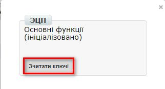

3. При натисканні на «Зчитати ключі» відкривається вікно Зчитування ключів, в яке підтягніть ЕЦП, введіть пароль і натисніть «**Зчитати ключ**».

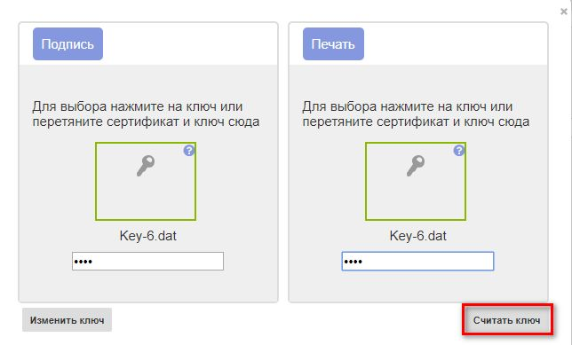

4. Після успішного зчитування відкриється вікно Підписання. Натисніть на «**Підписати**». Всі вибрані документи успішно підпишуться і відправляться.

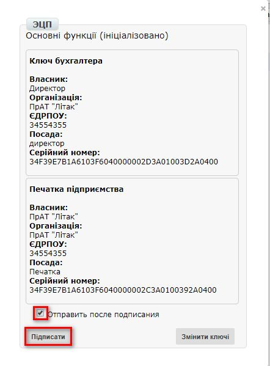

У разі, якщо ключі вже підтягувалися раніше і дані про них були збережені в кеші браузера, то повторно підтягувати ЕЦП немає необхідності, тільки ввести пароль, активуйте чекбокс «Надіслати після підписання» і натисніть на кнопку «**Зчитати ключ**».

.. include:: kontakti.rst
