Узгодження цін на платформі EDIN-Price. Інструкція для постачальника
########################################################################
---------

.. contents:: Содержание:
   :depth: 2

---------

Вступ
************************************
Інструкція визначає порядок узгодження ціни і підписання документа на стороні Постачальника на веб-платформі EDIN-Price. Описаний функціонал не передбачає введення нових товарних позицій!
 
Схема роботи
************************************

.. image:: pics_Soglasovanie_cen_web_EDIN-Price_dlja_postavshhika/pics_Soglasovanie_cen_web_EDIN-Price_dlja_postavshhika_01.png
   :align: center 

Роздрібна мережа зі своєї облікової системи вивантажує на FTP товарний довідник (контракт, специфікацію) в форматі XML (PRODUCTLIST.XML), актуальний на даний момент. Після обробки даного файлу на платформі, у постачальника, в меню «**Сервіс -> EDIN-Price**», відобразиться перелік діючих контрактів з мережею. Постачальник на підставі узгодженого товарного довідника формує пропозицію щодо зміни цін і направляє його в торговельну мережу.

Торгова мережа проводить узгодження даної пропозиції. У разі успішного вирішення підписує зі свого боку комерційний документ і направляє його постачальнику. Постачальник зі свого боку підписує комерційний документ і відправляє Торгової мережі. Після отримання підписаного з обох сторін комерційного документа, на FTP Торгової мережі викладається новий узгоджений PRODUCTLIST.XML, на підставі якого оновлюються дані в обліковій системі. Після цих змін мережа повторно вивантажує вже оновлений товарний довідник (контракт, специфікацію) на FTP. 

.. note:: У разі будь-яких змін даних, погоджених не через систему EDI, PRODUCTLIST.XML вивантажується повторно. 

Обробка Товарного узгодження 
************************************

Перегляд актуального узгодженого товарного довідника 
===============================================================

Для перегляду і подальшої роботи з узгодженим довідником необхідно виконати вхід в систему за допомогою наданих логіна і пароля. Далі навести курсор мишки на трикутник біля меню «Сервіс» і в випадаючому списку вибрати **EDIN-Price**

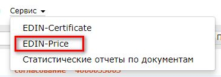

При цьому відкриється сторінка з актуальними товарними довідниками, згрупованими за назвою торгової мережі:

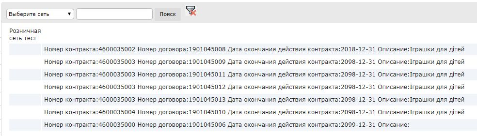

Для перегляду вмісту довідника необхідно перейти до вмісту відповідного документа клікнувши лівою кнопкою миші по документу. Буде відкрита детальна форма довідника.

.. note:: Всі дані, наведені на формі - фіктивні, використовуються тільки в якості прикладу 

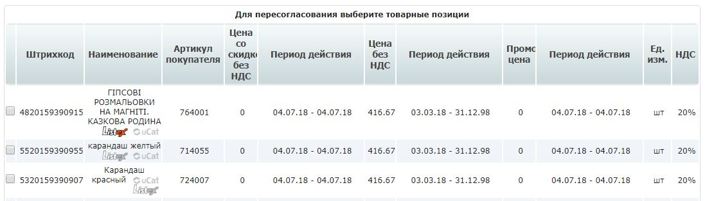

Створення пропозиції 
===============================================================

Процес ініціації доступний тільки на WEB-платформі. Для ініціювання процесу перепогодження регулярної / промо ціни, виведення товару з асортименту, тимчасового призупинення постачання необхідно створити документ «**Товарне узгодження**». Створення документа для перепогодження регулярної та промо цін можливе в 2-х режимах - вручну та за допомогою завантаження Excel файла.

Створення Товарного узгодження для перепогодження регулярної / промо ціни вручну 
------------------------------------------------------------------------------------

Для створення товарного узгодження зайдіть в необхідний узгоджений довідник. У формі що відкрилась виберіть позиції для перепогодження, і натисніть кнопку **Перепогодити**: 

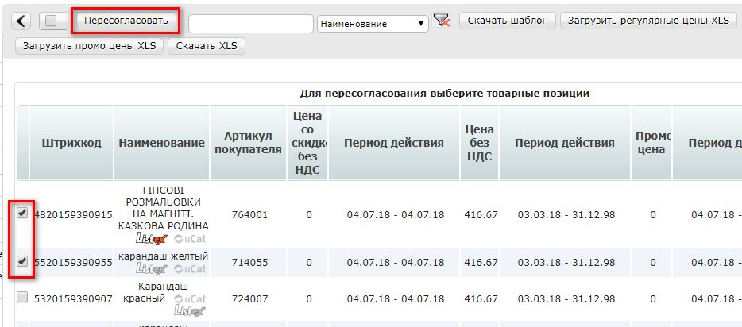

У спливаючому вікні **Виберіть дію** виберіть тип ціни для узгодження - Регулярна або Промо і натисніть «**ОК**»:

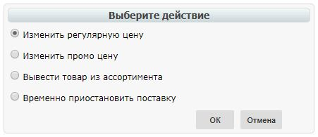

У вікні, встановіть нові ціни у відповідних колонках (Нова ціна без ПДВ або Нова ціна з ПДВ - за умовами договору з мережею), а також код УКТ ЗЕД, якщо раніше він не був заповнений в Товарному довіднику. Потім вкажіть Дату початку дії і Дату закінчення дії нової ціни. Дата початку дії нової ціни повинна перевищувати узгоджену з мережею к-ть днів від дати створення документа Товарне узгодження. При необхідності перелік позицій можна розширити або скоротити за допомогою кнопок «Додати позицію» і «Видалити позицію».

Біля найменування товарної позиції розміщена ікона "інфо". Після її натискання, в додатковому вікні відкриються піктограми *Listex* і *Ucat*. Натиснувши на них відбувається перехід на сайт відповідних каталогів. Додатково для перепогодження регулярної ціни, якщо зазначений період документа має спільні дати до раніше узгоджених промо цін, то біля дати останнього зміни буде розміщена іконка "відсотки". Після її натискання, в додатковому вікні відкривається раніше узгоджена додаткова інформація по промо - період дії і ціна з ПДВ:

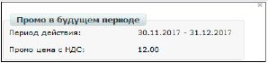

Існує можливість додати обгрунтування зміни ціни або інші документи, які можуть прискорити погодження. Для цього натисніть кнопку «**Додати обгрунтування**»:

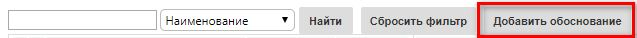
 
У вікні що відкрилось можна додати необхідні файли: 

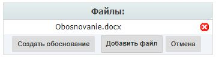

Для додавання файлів використовується кнопка «**Додати файл**», для видалення зайвих файлів - кнопка з хрестиком біля імені файлу. 
Після того, як всі файли були додані - необхідно натиснути на кнопку «**Створити обгрунтування**», в результаті файли будуть збережені в окремий архів і довантажені до товарного узгодженням. Після натискання кнопки «Створити обгрунтування» зміна архіву буде неможлива. У разі якщо необхідно додати і / або видалити якісь файли - всю процедуру слід повторити спочатку. Після збереження внесених змін з'являється кнопка «**Прикріпити сертифікати**». При натисканні на кнопку «Прикріпити сертифікат» біля кожного штрих-коду відобразиться іконка "галочка", яка свідчить про те, що до товару прикріплений сертифікат.

.. note:: Якщо сертифікати не були прив'язані до штрих-коду в сервісі **EDIN-Certificate**, в Товарному узгодженні іконка біля штрих-коду відображатися не буде. Для можливості передачі сертифікатів в документі Товарне узгодження необхідна наявність тарифного пакета сервісу EDIN-Certificate.

Натиснувши на іконку "галочка", в додатковому вікні з'явиться перелік всіх сертифікатів, які прив'язані до штрих-коду товару. Сертифікати, які потрібно передати, необхідно відзначити галочкою.

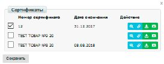

За допомогою кнопок «**Дія**» можливо:

- завантажити сертифікат з усіма додатками (архів з файлами)
- переглянути скан-копію сертифіката
- отримати пряме посилання на скан-копію сертифіката
- завантажити основний бланк сертифіката (титульна сторінка)

Для відправки документа необхідно натиснути на кнопку «**Надіслати**».

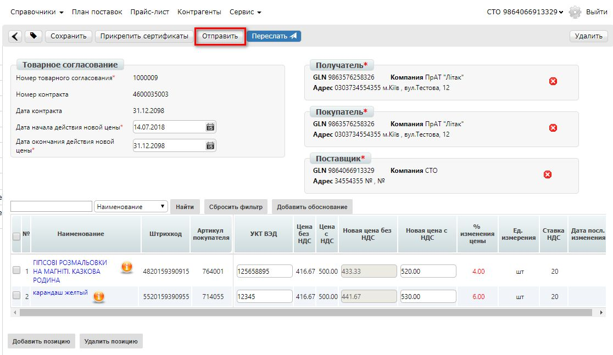

Все невідправлені документи знаходяться в розділі **Чернетки**.

.. note:: Зверніть увагу! Промо ціна змінюється тільки в окремому документі Товарне узгодження для промо ціни.

.. important:: Важливо! Мережа має право змінити запропоновані / зазначені Постачальником дати перед підписанням документа.

У розділі Відправлені знаходяться відправлені на переузгодження в Мережу документи:

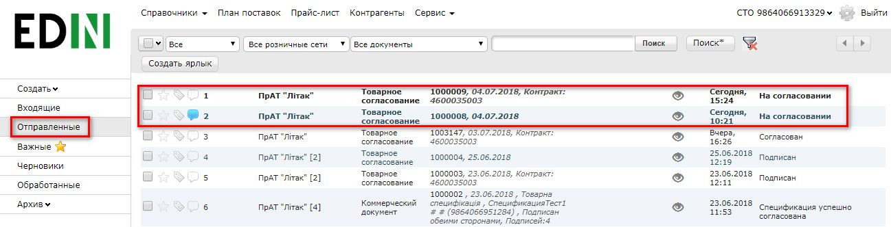

Жирним курсивом виділено ще не прочитаний Мережею документ. Товарне узгодження має кілька етапів узгодження документа на стороні мережі, які у Вас відображаються у вигляді статусу документа:

1. На погодженні - отриманий мережею, без внесення змін
2. Підготовлений - оброблений категорійним менеджером мережі.

Проміжні статуси обробки документів для регулювання бізнес процесів узгодження (керівник відділу закупівлі, служба безпеки, економічна безпека, фінансовий аналітик, логістика):

- Підтверджений
- Перевірений
- Готовий до підписання
- Погоджений

3. Підписаний - оброблений фінальним підписантом і накладена ЕЦП з боку мережі. Для перегляду відправленого документа «Товарне узгодження» натисніть на нього. У відкритому документі можна побачити основну інформацію по документу.

Для зв'язку з Мережею введіть текст повідомлення у вікно Зв'язок з покупцем і натисніть кнопку **Надіслати**:

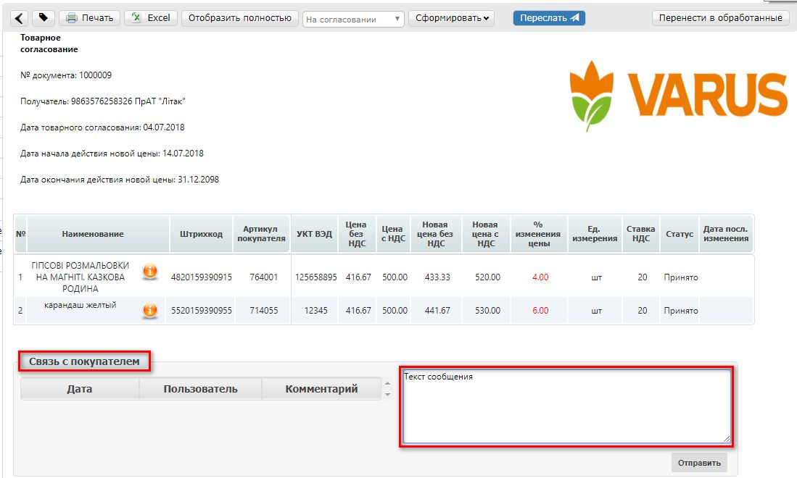

Документ, що містить коментар, в списку буде відображатися з позначкою "коментар":

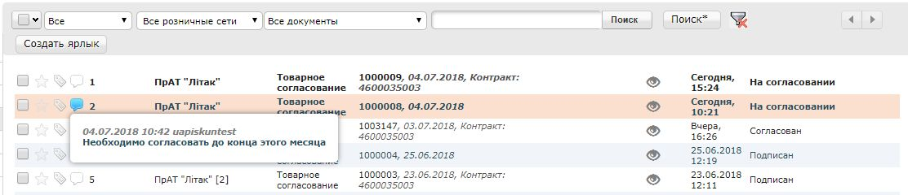

У документів на узгодження промо-ціни текст виділений помаранчевим. 

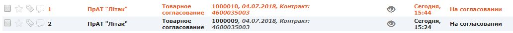

Створення Товарного узгодження для перепогодження регулярної / промо ціни за допомогою завантаження з Excel
--------------------------------------------------------------------------------------------------------------------

Виберіть розділ **Узгоджений довідник**, відкрийте необхідний запис товарного довідника і натисніть кнопку **Завантажити шаблон**: 

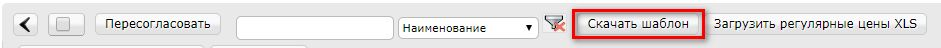

Після натискання на кнопку відкриється форма збереження шаблону. Збережіть файл на комп'ютер, відкрийте його для заповнення. У шаблоні заповніть поля по позиціях для перепогодження:

.. image:: pics_Soglasovanie_cen_web_EDIN-Price_dlja_postavshhika/pics_Soglasovanie_cen_web_EDIN-Price_dlja_postavshhika_17.png
   :align: center

.. admonition:: Зверніть увагу!

   Не міняйте розширення файлу шаблону. Воно повинно бути тільки xls. Не міняйте структуру файлу і послідовність колонок, не видаляйте верхні рядки. 

Збережіть заповнений файл шаблону, а потім натисніть кнопку **Завантажити Регулярні ціни XLS** - для завантаження шаблону з заповненими регулярними цінами, **Завантажити Промо ціни XLS** - для завантаження шаблону з заповненими промо цінами. Після натискання на кнопку завантаження відкриється стандартна форма для завантаження файлу. Виберіть збережений вами шаблон.

На підставі завантаженого файлу буде сформований документ Товарне узгодження. Перевірте правильність заповнення даних, вкажіть період початку і закінчення дії нової ціни, потім натисніть кнопку Зберегти і після збереження документа кнопку **Надіслати**:

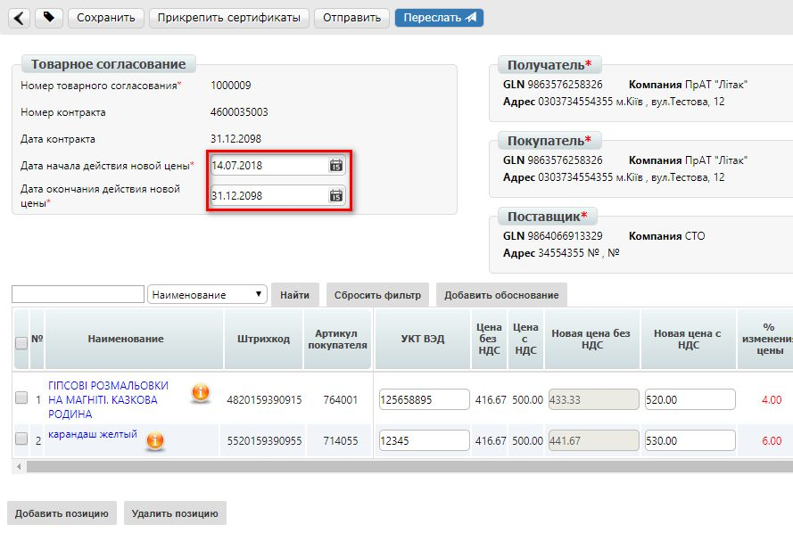

.. important:: У документ Товарне узгодження потрапляють тільки ті товарні позиції, які є в вибраній специфікації на платформі. Звірка проводиться по артикулу і по штрих-коду. 

Створення Товарного узгодження для виведення товару з асортименту / тимчасового призупинення постачання
------------------------------------------------------------------------------------------------------------------------

У спливаючому вікні **Виберіть дію** - виберіть Вивести товар з асортименту або Тимчасово призупинити поставку: 

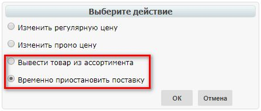

У вікні вкажіть причину виведення / призупинення постачання товару. Потім для припинення постачання товару вкажіть дату початку припинення постачання товару і дату закінчення припинення постачання, а для виведення товару з асортименту - дату виведення товару з асортименту.
Дата початку припинення постачання / дата виведення товару з асортименту повинна перевищувати узгоджену з мережею к-ть днів від дати створення документа Товарне узгодження.

При необхідності перелік позицій можна розширити або скоротити за допомогою кнопок «**Додати позицію**» і «**Видалити позицію**». Існує можливість додати обґрунтування виведення / призупинення постачання товару або інші документи. Для цього натисніть кнопку «Додати обгрунтування». Збережіть внесені зміни, при необхідності прикріпіть сертифікати і відправте документ. Все невідправлені документи знаходяться в розділі **Чернетки**. 

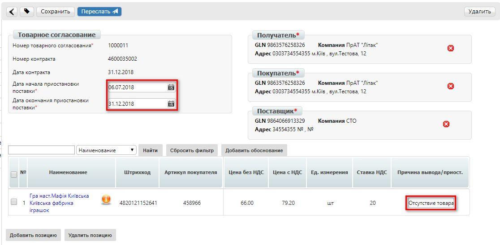

.. note:: Зверніть увагу! Вивід товару з асортименту погоджується лише в окремому документі Товарне узгодження.

.. important:: Важливо! Мережа має право змінити запропоновані / зазначені Постачальником дати перед підписанням документа.

Для перегляду відправленого документа «Товарне узгодження» натисніть на нього. У відкритому документі можна побачити основну інформацію по документу. У розділі Відправлені знаходяться відправлені на переузгодження в Мережу документи:

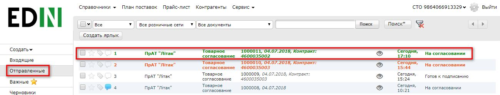

Жирним курсивом виділено ще не прочитаний Мережею документ. Для зв'язку з Мережею введіть текст повідомлення у вікно **Зв'язок з покупцем** і натисніть кнопку Надіслати:

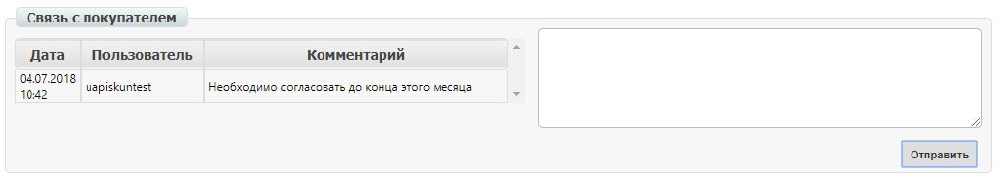

Документ, що містить коментар, в списку буде відображатися з позначкою "коментар": 

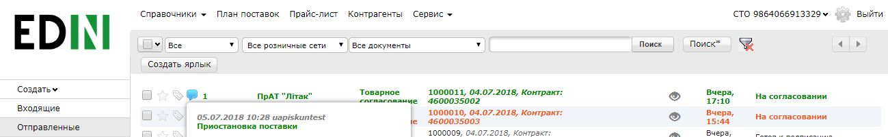

У документів на узгодження виведення товару з асортименту та тимчасового призупинення постачання товару, текст виділений зеленим. 

Перегляд і обробка вхідного документа від Мережі (ініціація постачальника) 
======================================================================

За затвердженими позиціями Ви отримаєте Комерційний документ, підписаний з боку мережі. Знаходиться він в розділі Вхідні. Для відкриття вхідного документа натисніть на нього:

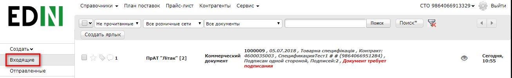

У відкритому документі можна побачити основну інформацію по документу (підписи від Мережі, перелік прийнятих позицій, коментарі від Мережі). Натисніть кнопку Підписати щоб підписати документ:

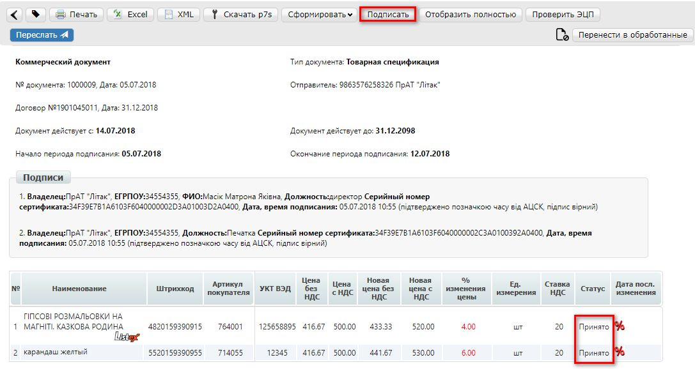

Після первинного налаштування ЕЦП і введення ключів натисніть кнопку «**Зчитати ключі**»:

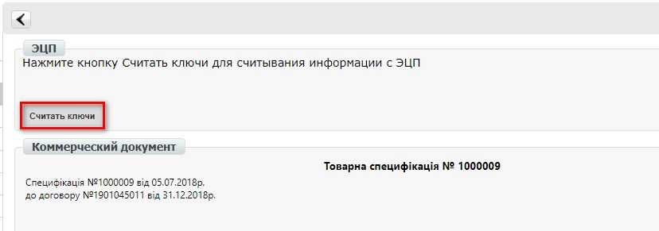

Виберіть необхідні ключі для підписання і натисніть «Зчитати ключі»:

.. image:: pics_Soglasovanie_cen_web_EDIN-Price_dlja_postavshhika/pics_Soglasovanie_cen_web_EDIN-Price_dlja_postavshhika_27.png
   :align: center

Опісля натисніть на «**Підписати**».: 

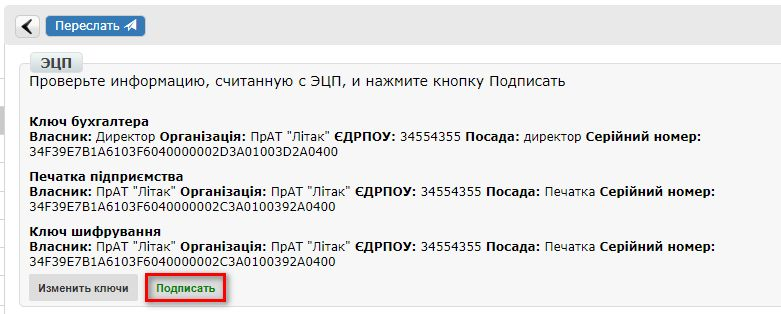

Після успішного підписання, натисніть кнопку **Надіслати**:

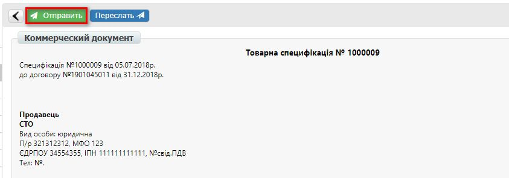

Підписаний і відправлений комерційний документ Товарна специфікація знаходяться в розділі Надіслані.

У разі відхилення частини запропонованих цін, Ви отримаєте Комерційний документ по прийнятим цінам (необхідно підписати ЕЦП) і документ Товарне узгодження зі списком не прийнятих позицій, які Ви можете переузгодити ще раз за допомогою відправки нового документа для узгодження.

Перегляд і обробка вхідного документа від Мережі (ініціація мережі) 
======================================================================

Документ Товарне узгодження, відправлений Мережею для узгодження промо ціни, знаходиться в розділі Вхідні і виділений помаранчевим кольором.

Відібрати документи для обробки можна за допомогою фільтра. Для цього необхідно вибрати тип документа «Товарне узгодження» і статус «На погодженні». Усі не прочитані документи виділені жирним шрифтом. Для відкриття вхідного документа натисніть на нього. У відкритому документі необхідно ознайомитися з кількістю товару, промо цінами і періодом їх дії. Також є можливість зв'язатися з мережею, залишивши повідомлення в вікні Зв'язок з покупцем. Доступно дві кнопки -  Відхилити і Підписати. Після натискання на Відхилити Вам необхідно підтвердити дію, натиснувши Закінчити, або відхилити, натиснувши Скасування.

Якщо підтвердити відхилення документа, то змінити рішення Ви не зможете і специфікація буде не узгодженою.

Натисніть кнопку Підписати для створення комерційного документа. Відкриється друкована форма документа. Необхідно виконати процедуру підписання і відправити документ в Мережу. У свою чергу Мережа підпише документ зі свого боку і комерційному документу буде присвоєно статус «**Специфікація узгоджена**».

.. include:: kontakti.rst
