Введення нових SKU (товарних позицій) на платформі
###################################################

Вступ
************************************

Інструкція описує процес створення пропозиції щодо розширення товарного асортименту в діючих специфікаціях.

**Для формування пропозиції необхідно**:

1. Перевірити наявність товарної позиції в Товарному довіднику
************************************

1.1 Для цього в меню виберіть **«Довідники» => «Товарний довідник»**

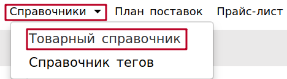

1.2. Скористатися стандартним пошуком по штрих-коду, найменуванню або вн. № продукту.

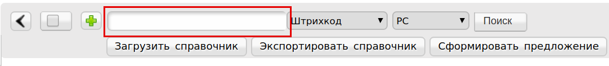

Якщо позиція знайдена - необхідно перевірити коректність заповнення і доповнити відсутні параметри товару.
Якщо позиція не знайдена - скориставшись кнопкою «**+**» створити картку нового товару, заповнивши всі необхідні параметри.

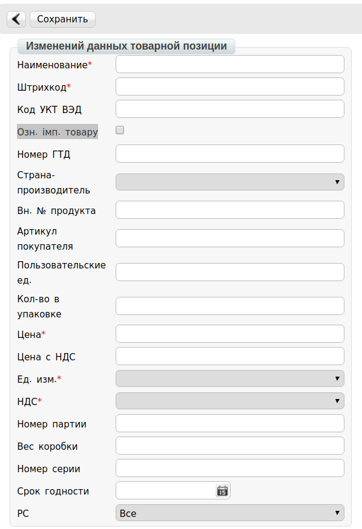

2. Сформувати пропозицію натиснувши кнопку Сформувати
************************************************************************

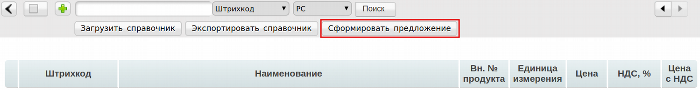

Відкриється форма створення в якій необхідно вибрати торгову мережу, категорії, позиції для відправки на розгляд.

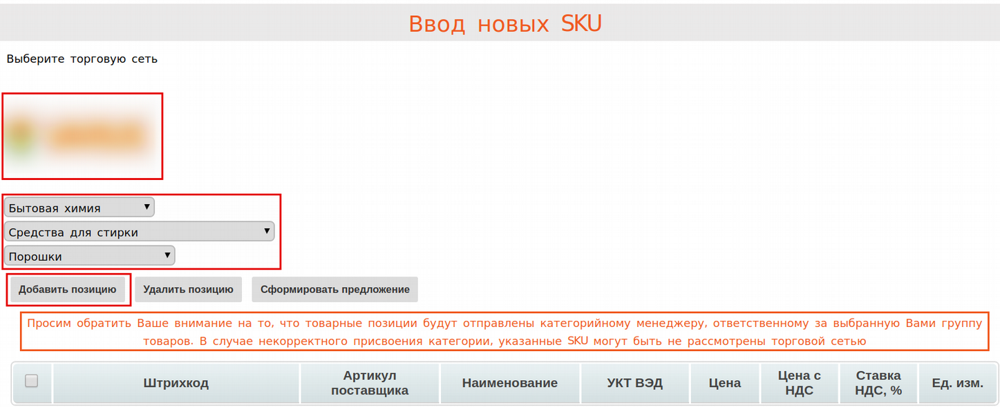

При додаванні товару в рядку «Найменування з товарного довідника» Ви можете скористатися пошуком по штрих-коду, артикулу покупця або найменуванням.

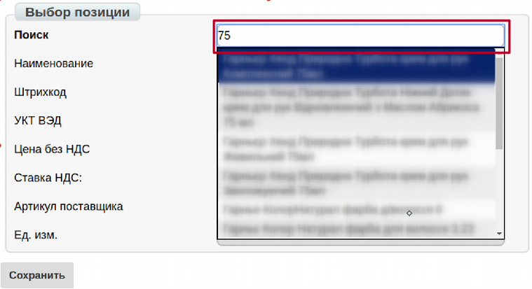

Після вибору товарної позиції, все поля заповняться автоматично. У разі, якщо частина полів виявилися порожніми - внесіть інформацію, якої бракує і натисніть кнопку **Зберегти**.

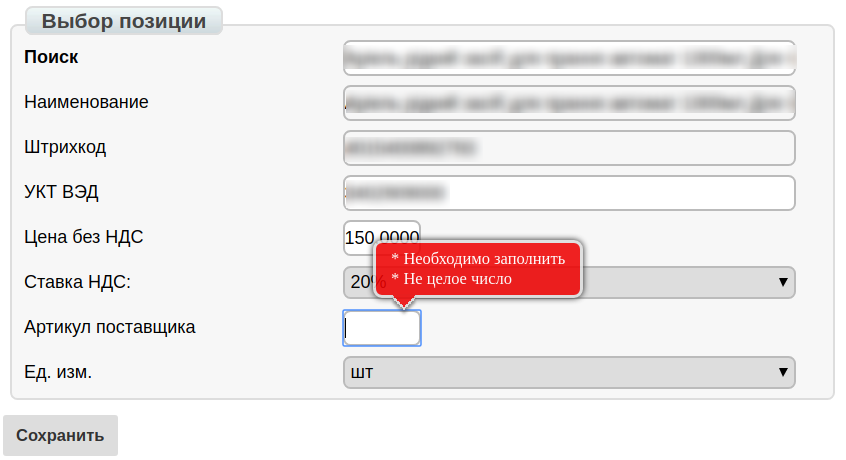

3. Створити документ Товарне узгодження натиснувши на «Сформувати»
************************************************************************

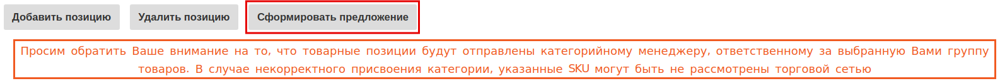

.. important:: Обрані Вами товарні позиції будуть відправлені конкретному категорійного менеджеру, відповідальному за обрану Вами групу товарів. У разі некоректного присвоєння категорії або вибору позиції, що не відноситься до зазначеної Вами категорії - SKU можуть бути не розглянуті торговельною мережею.

Деякі мережі працюють з введенням нових SKU тільки при наявності розширених характеристик. Таким мережам не відправляться SKU, що не мають посилання на каталог *Listex* або *uCat*.

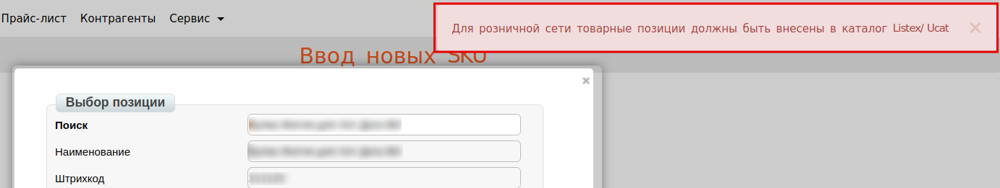

Якщо SKU занесені в Listex / uCat або ж мережа не вимагає характеристик, то документ сформується. При необхідності можна вказати дату початку дії нової ціни, дату закінчення дії нової ціни, Зберегти, Надіслати.

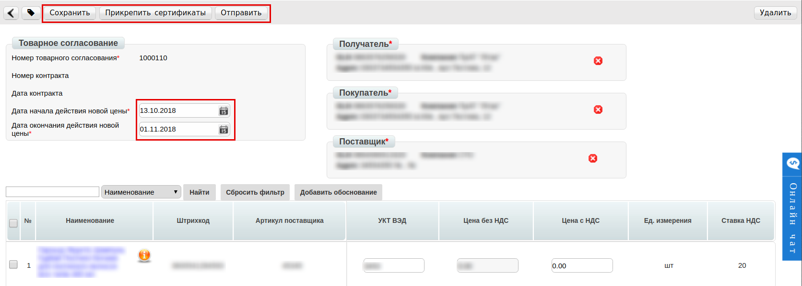

На стороні постачальника, товарне узгодження знаходиться в «Відправлених».

4. Залежно від бізнес процесів всередині Торгової мережі, далі відбувається відбір товару.
************************************

4.1. В буфер Облікової Системи мережі імпортуються всі запропоновані постачальником позиції з Товарного узгодження. Після підтвердження введення позицій в специфікацію, в ОС для кожного товару створюється картка товару, при цьому кожній позиції присвоюється номер договору і контракт.

4.2. Торгова мережа зі своєї ОС інтегровано вивантажує контракт з затвердженими товарними позиціями. В xml файлі, для таких позицій вказується <ACTION> 2 </ ACTION>.
Також, відправляє постачальнику товарне узгодження на відхилені позиції.
В xml файлі, для таких позицій вказується:

- <PRICETYPE>addSKU</PRICETYPE> - підтип документа (дія)
- <DOCACTION>1</DOCACTION> - ознака документа (1 - рахунок прийнятий, 3 - умовно прийнятий, 5 - тільки для інформації, 8 - не прийнятий)

5. На стороні Постачальника, контракти c новими SKU розміщуються на початку списку і виділяються позначкою «NEW!».
************************************************************************

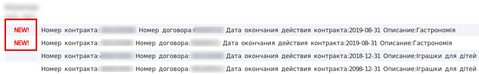

5.1. При відкритті контракту з позначкою «NEW!», нові позиції виділяються червоним кольором і розміщуються на початку списку. При наведенні курсора миші на такі позиції, спливає підказка "Необхідно підписання нових SKU!"

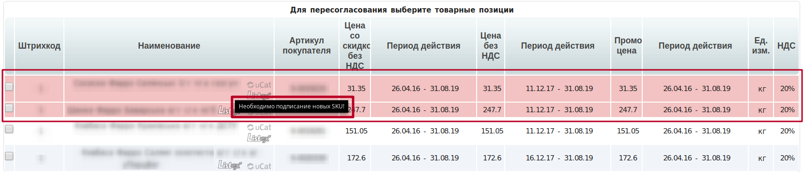

5.2. Для вибору необхідних позицій в контракті, встановіть «прапорець» навпроти нових або узгоджених SKU.

.. important:: Вибір позицій розмежований на можливість вибрати або тільки нові або тільки узгоджені позиції. При активації «прапорців» навпроти нових позиції - узгоджені будуть недоступні для вибору, і навпаки.

5.3. Масовий вибір позицій здійснюється за допомогою меню, що розвертається «**Вибрати позиції**».

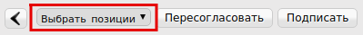

5.3.1. Для вибору тільки узгоджених позицій, виберіть пункт меню «Узгоджені». При цьому «прапорцями» відзначаться тільки все раніше узгоджені позиції і стане доступною кнопка «**Переузгодити**».

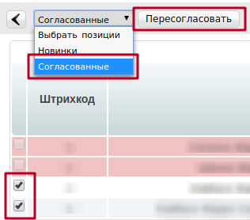

5.3.2. Для вибору тільки нових позицій, виберіть пункт меню «Новинки».
При цьому «прапорцями» відзначаться тільки нові позиції контракту і стане доступною кнопка «**Підписати**».

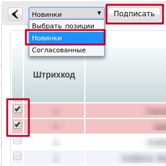

5.4. Підписання нових товарних позицій

При натисканні на кнопку «Підписати» формується комерційний документ «**Товарна специфікація**».

Введіть паролі і натисніть «**Зчитати ключі**»:

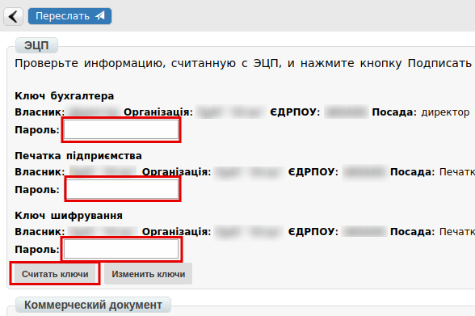

Далі натисніть «**Підписати**»:

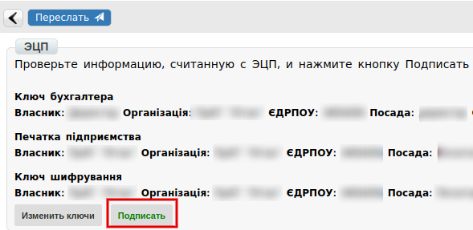

Після зчитування ключів натисніть «**Надіслати**»

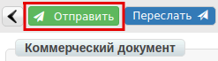

Після чого документ відправляється в торгову мережу. На стороні постачальника відобразиться в розділі «Відправлені».

5.5. Нові SKU, в контракті, можуть відображатися «бузковим» кольором в таких випадках:

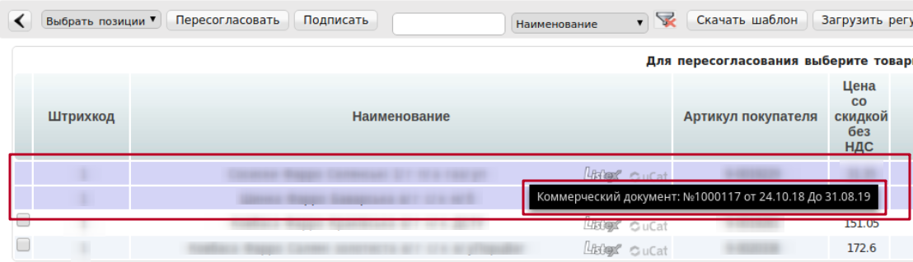

- Сформовано, але не підписаний, або підписаний, але не відправлений комерційний документ «**Товарна специфікація**» (наприклад, якщо випадково закрили вкладку) - такий документ переноситься в розділ «Чернетки».

    Продовжити процес підписання / відправки таких документів можливо з розділу «Чернетки» або знову відкривши контракт з цією товарною позицією (тепер вона виділена «бузковим» кольором) і клікнути на неї.
    При видаленні документа з «Чернеток», нові SKU будуть знову відображатися червоним кольором в Контракті.

- Сформовано, підписаний, відправлений в торговельну мережу комерційний документ «Товарна специфікація». Очікується підписання з боку мережі. Клікнувши на таку позицію відкриється підписаний документ.

    При наведенні курсора миші на позиції бузкового кольору спливає підказка «Комерційний документ: No______ від __.__.__ До __.__.__»

6. На стороні торгової мережі, комерційний документ відображається в розділі «Вхідні» з поміткою «Документ вимагає підписання».
************************************************************************

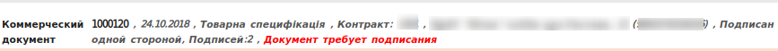

Мережа підписує зі свого боку Комерційний документ і відправляє постачальнику.

7. Процес введення нових товарних позицій вважається завершеним, коли комерційний документ «Товарна специфікація» підписаний з двох сторін.
************************************************************************

При цьому, на стороні постачальника, біля контрактів, в яких підписані Нові SKU перестають відображатися піктограми «NEW!». Такі контракти не відображаються на початку списку. Товарні позиції в таких контрактах не відображаються червоним або фіолетовим кольорами.

Повторна відправка комерційного документа «Товарна специфікація» щодо введення нових SKU неможлива.

.. include:: kontakti.rst
