Узгодження цін на платформі Е-СПЕЦИФІКАЦІЯ. Інструкція для постачальника
########################################################################

.. сюда закину немного картинок для текста

.. |drop_pass| image:: signing/drop_pass.png

.. |del_key| image:: signing/del_key2.png

.. role:: red

.. role:: underline

---------

.. contents:: Зміст:
   :depth: 3

---------

Вступ
===============================================================

Е-СПЕЦИФІКАЦІЯ - рішення для швидкого узгодження цін між постачальниками і торговими мережами.
Інструкція визначає порядок узгодження ціни і підписання документа на стороні Постачальника на веб-платформі EDIN-Price. Описаний функціонал не передбачає введення нових товарних позицій!
 
Схема роботи
===============================================================

Роздрібна мережа зі своєї облікової системи вивантажує на FTP товарний довідник (контракт, специфікацію) в форматі XML (PRODUCTLIST.XML), актуальний на даний момент. Після обробки даного файлу на платформі, у постачальника, у сервісі **Е-СПЕЦИФІКАЦІЯ** у вкладці **Контракти**, відобразиться перелік мереж та діючих контрактів з мережею. Усі контракти зручно згруповані по назві мережі. Фільтр допоможе знайти необхідну мережу, а за допомогою пошуку по номеру контракту або договору, чи навіть по штрихкоду або артикулу позиції можна вибрати конкретний контракт. 

Постачальник на підставі узгодженого товарного довідника формує пропозицію щодо зміни цін і направляє його в торговельну мережу.

Торгова мережа проводить узгодження даної пропозиції. У разі успішного вирішення підписує зі свого боку комерційний документ і направляє його постачальнику. Постачальник зі свого боку підписує комерційний документ і відправляє Торгової мережі. Після отримання підписаного з обох сторін комерційного документа, на FTP Торгової мережі викладається новий узгоджений PRODUCTLIST.XML, на підставі якого оновлюються дані в обліковій системі, а також документ з підписами comdoc_008.p7s. Після цих змін мережа повторно вивантажує вже оновлений товарний довідник (контракт, специфікацію) на FTP. 

.. note:: У разі будь-яких змін даних, погоджених не через систему EDI, PRODUCTLIST.XML вивантажується повторно. 

Для перегляду і подальшої роботи з узгодженим довідником необхідно виконати вхід в систему за допомогою наданих логіна і пароля. Далі серед доступних сервісів обрати **Е-СПЕЦИФІКАЦІЯ**:

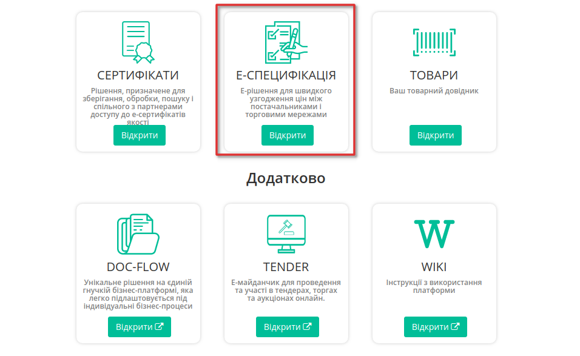

Сервіс містить чотири основні вкладки: **"Пропозиції"**,**"Контракти"**, **"Акції"** та **"Новинки"**. 

Контракти (актуальний узгоджений товарний довідник) 
===============================================================

Товарне узгодження
-----------------------------------------------------------

У вкладці **Контракти**, відобразиться перелік роздрібних мереж та діючих контрактів з мережами (з актуальними товарними довідниками). Фільтри по **Компанії**, **Статусу** допоможуть вибрати необхідну мережу, а за допомогою Пошуку по номеру контракту, номеру договору, штрих-коду або артикулу позиції можна відібрати конкретний контракт. Усі контракти зручно згруповані за назвою торгової мережі:

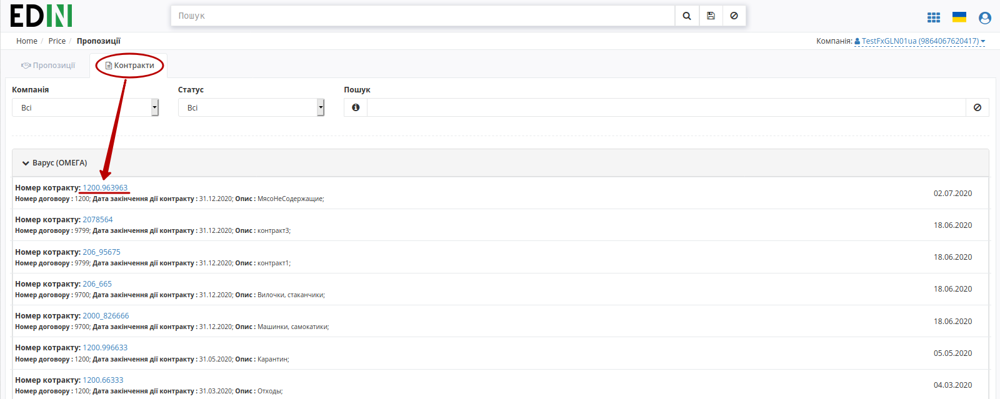

.. note:: Всі дані, наведені в Інструкції - фіктивні, використовуються тільки в якості прикладу 

Для перегляду вмісту довідника необхідно перейти до відповідного документа клікнувши лівою кнопкою миші на номер контракту. Буде відкрита детальна форма довідника з пропозиціями та можливими діями з ними.

Створення Пропозиції 
-----------------------------------------------------------

Товарні позиції в контракті відображаються в алфавітному порядку. Створити пропозицію (документ **"Товарне узгодження"** `AGREEM <https://wiki.edin.ua/uk/latest/general_2_0/massovi_operacii_EDIN_2.0.html#id9>`__) в контракті можливо шляхом вивантаження xls-файлу (згідно шаблону) чи в якості формування "Переузгодження" на всі/окремі товарні позиції в контракті.

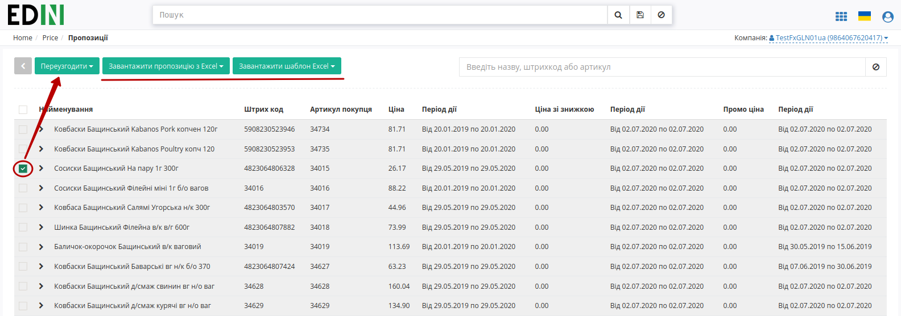

Формування пропозиції з xls-файлу
~~~~~~~~~~~~~~~~~~~~~~~~~~~~~~~~~~~~~~~~~~~~~~~~~~~~~~~~

Постачальник може **"Завантажити пропозицію до контракту з Excel"** (2) (в форматі xls), використовуючи відповідний шаблон (1), як для **"Для регулярної ціни"** так і **"Для промо ціни - "Зниження ціни""**. Після завантаження заповненої xls-форми на WEB-платформу формується і відображається пропозиція (в статусі "Чернетка"). 

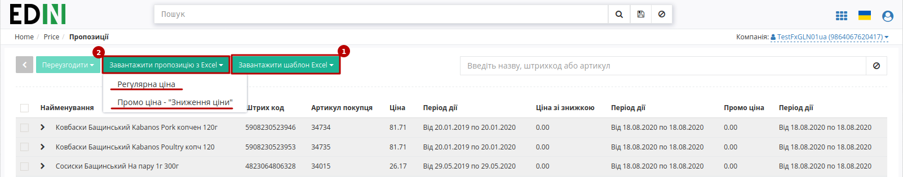

Переузгодження
~~~~~~~~~~~~~~~~~~~~~~~~~~~~~~~~~~~~~~~~~~~~~~~~~~~~~~~~

Процес переузгодження можливо здійснити тільки на WEB-платформі для різних типів Пропозицій:

* Зміна регулярної ціни
* Зміна промо ціни - "Зниження ціни"
* Зміна промо ціни - "Компенсація"
* Зміна промо ціни - "Комбо" ("Зниження ціни" + "Компенсація")

Для ініціювання процесу переузгодження необхідно створити **"Товарне узгодження"** (документ `AGREEM <https://wiki.edin.ua/uk/latest/general_2_0/massovi_operacii_EDIN_2.0.html#id9>`__), обравши попередньо бажані товарні позиції з контракту.

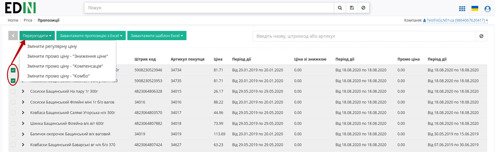

.. note:: Відображення табличної частини з позиціями залежить від налаштувань Мережі та обраного типу пропозиції! 

Створення Товарного узгодження для переузгодження регулярної ціни та ціни зі знижкою
---------------------------------------------------------------------------------------------

Для створення товарного узгодження зайдіть в необхідний узгоджений довідник ("Контракти"). У формі що відкрилась виберіть позиції для переузгодження, і натисніть кнопку **Переузгодити** -> **"Змінити регулярну ціну"** (також для ціни зі знижкою).

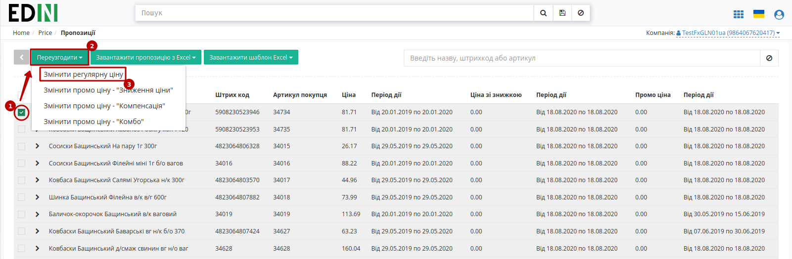

У новому вікні відкриється нова створена пропозиція - ви можете переглянути її номер та статус (Чернетка), опис та номер контракту, до якого вона створена, дані контрагентів та табличну частину з позиціями на переузгодження. 

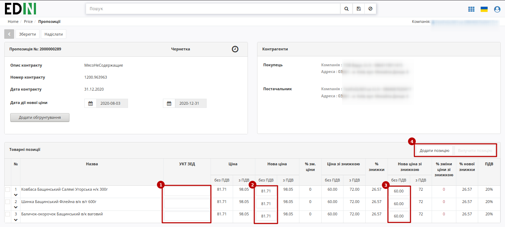

У табличній частині встановіть нові ціни у відповідних колонках (у данному прикладі - "Нову ціну без ПДВ" та "Нову ціну зі знижкою без ПДВ", за умовами договору з мережею), а також код УКТ ЗЕД (1), якщо раніше він не був заповнений в Товарному довіднику. 

В Пропозиціях-Чернетках на етапі редагування можливо **"Додати/Вилучити товарну позицію"** (4) (для вилучення потрібно обрати позицію чекером). При додаванні відкриється вікно з товарними позиціями, що належать до раніше обраного контракту, але не були додані в пропозицію-чернетку.

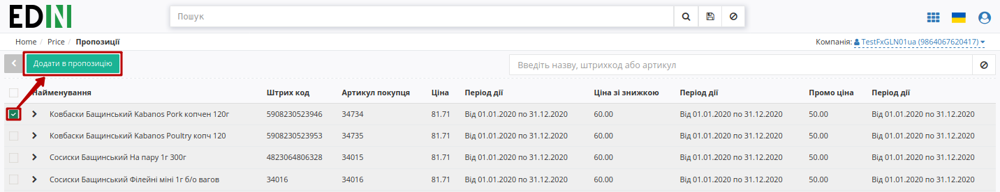

Потім виберіть Дату початку дії і Дату закінчення дії нової ціни. Дата початку дії нової ціни не може бути більше дати закінчення дії нової ціни.
Дата початку дії нової ціни повинна враховувати кількість днів на розгляд пропозиції, тобто, не може бути менше ніж дата створення документу Товарне узгодження + N днів на розгляд та прийняття пропозиції мережею, а також не може бути пізніше ніж дата закінчення терміну дії. Мінімальна кількість днів на розгляд  - 3 дні.
Дата закінчення терміну дії не може бути більше, ніж дата закінчення дії контракту.

**Обов'язково збережіть зміни.**

Можливе формування пропозиції на зміну регулярної ціни зі знижкою, в залежності від налаштувань мережі. У такому випадку таблична частина з позиціями буде розширена додатковими стовбцями з можливістю вказати ціну зі знижкою. У таких пропозиціях мережа може знінювати поле **кількість**!

.. note:: Зверніть увагу! Промо ціна змінюється тільки в окремому документі Товарне узгодження для промо ціни. Ціна зі знижкою - це НЕ те саме, що промо!

Створення Товарного узгодження для переузгодження промо ціни - "Зниження ціни"
---------------------------------------------------------------------------------------------

Промо ціна - акційна ціна, яка діє протягом короткого терміну часу. Пропозиція на узгодження промо ціни виділяється зеленим кольором. Також у списку відображається тип ціни, яку узгоджують, та кількість позицій в узгодженні:

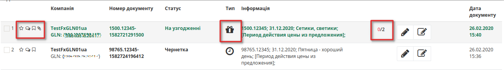

Для створення Пропозиції для переузгодження промо ціни зайдіть в необхідний узгоджений довідник ("Контракти"). У формі що відкрилась виберіть позиції для переузгодження, і натисніть кнопку **Переузгодити** -> **"Змінити промо ціну - "Зниження ціни""**: 

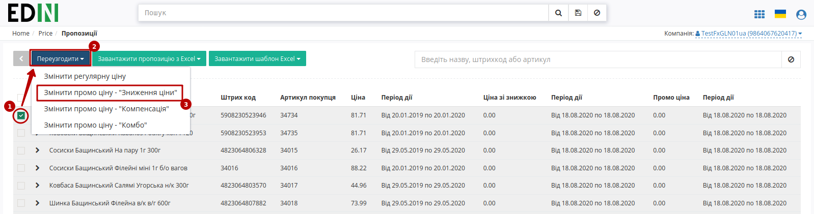

Від Пропозиції з "Регулярними цінами" Пропозиція "Промо ціни - "Зниження ціни"" відрізняється полями в шапці документу і табличній частині:

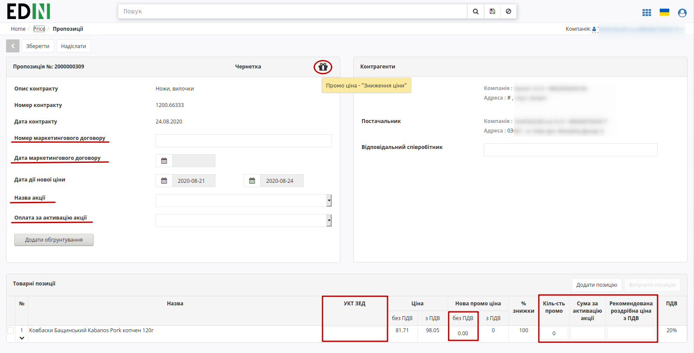

Для всіх "промо-пропозицій" можливо обрати `Акції`_, якщо вони були додані мережею і їх дати не конфліктують з датами створюваної Пропозиції на підставі договору з цією мережею.

.. note::
   "Дата початку дії нової ціни" повинна враховувати кількість днів на розгляд пропозиції, тобто, не може бути менше ніж дата створення документу Товарне узгодження + N днів на розгляд та прийняття пропозиції мережею, а також не може бути пізніше ніж дата закінчення терміну дії. Мінімальна кількість днів на розгляд  - 3 дні. "Дата закінчення терміну дії нової ціни" не може бути більше, ніж "Дата закінчення дії контракту".

**Обов'язково збережіть зміни.**

.. important:: Мережа має право змінити запропоновані / зазначені Постачальником дати перед підписанням документа.

Створення Товарного узгодження для переузгодження промо ціни - "Компенсація"
---------------------------------------------------------------------------------------------

Формування пропозицій на компенсацію продажів під конкретну акцію дозволяє збільшити кількість товару в обігу. 

Для створення Пропозиції для переузгодження промо ціни зайдіть в необхідний узгоджений довідник ("Контракти"). У формі що відкрилась виберіть позиції для переузгодження, і натисніть кнопку **Переузгодити** -> **"Змінити промо ціну - "Компенсація""**: 

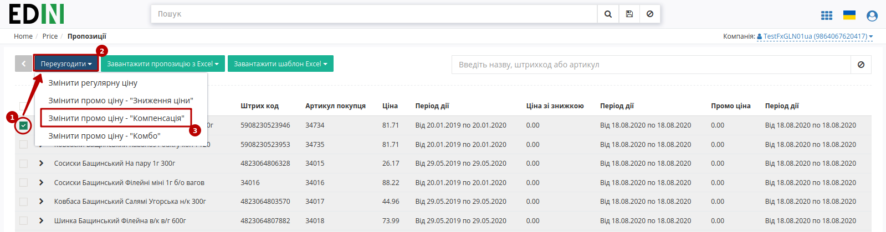

Від Пропозиції з "Регулярними цінами" Пропозиція "Промо ціни - "Компенсація"" відрізняється полями в шапці документу і табличній частині:

.. image:: pics_E_Spec_Іnstrukcіya_dlya_postachalnika/pics_Іnstrukcіya_dlya_postachalnika_24.png
   :align: center

Для всіх "промо-пропозицій" можливо обрати `Акції`_, якщо вони були додані мережею і їх дати не конфліктують з датами створюваної Пропозиції на підставі договору з цією мережею.

.. note::
   "Дата початку дії нової ціни" повинна враховувати кількість днів на розгляд пропозиції, тобто, не може бути менше ніж дата створення документу Товарне узгодження + N днів на розгляд та прийняття пропозиції мережею, а також не може бути пізніше ніж дата закінчення терміну дії. Мінімальна кількість днів на розгляд  - 3 дні. "Дата закінчення терміну дії нової ціни" не може бути більше, ніж "Дата закінчення дії контракту". Поле "Кількість промо" повинно бути >0

**Обов'язково збережіть зміни.**

Створення Товарного узгодження для переузгодження промо ціни - "Комбо" ("Зниження ціни" + "Компенсація")
----------------------------------------------------------------------------------------------------------------

Формування пропозицій на зниження закупочної ціни і компенсацію продажів під конкретну акцію дозволяє збільшити кількість товару в обігу. 

Для створення Пропозиції для переузгодження промо ціни зайдіть в необхідний узгоджений довідник ("Контракти"). У формі що відкрилась виберіть позиції для переузгодження, і натисніть кнопку **Переузгодити** -> **"Змінити промо ціну - "Комбо""**: 

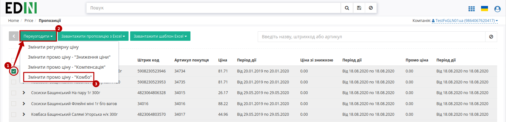

Від Пропозиції з "Регулярними цінами" Пропозиція "Промо ціни - "Комбо"" відрізняється полями в шапці документу і табличній частині:

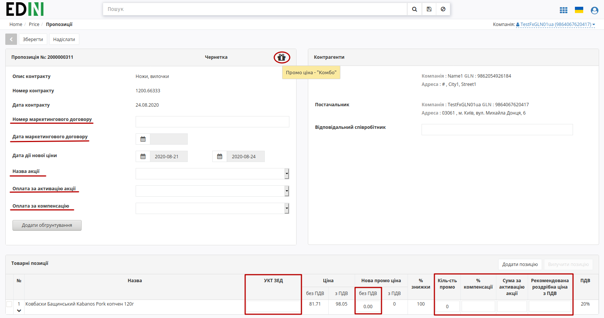

Для всіх "промо-пропозицій" можливо обрати `Акції`_, якщо вони були додані мережею і їх дати не конфліктують з датами створюваної Пропозиції на підставі договору з цією мережею.

.. note::
   "Дата початку дії нової ціни" повинна враховувати кількість днів на розгляд пропозиції, тобто, не може бути менше ніж дата створення документу Товарне узгодження + N днів на розгляд та прийняття пропозиції мережею, а також не може бути пізніше ніж дата закінчення терміну дії. Мінімальна кількість днів на розгляд  - 3 дні. "Дата закінчення терміну дії нової ціни" не може бути більше, ніж "Дата закінчення дії контракту". Поле "Кількість промо" повинно бути >0

**Обов'язково збережіть зміни.**

Пропозиції 
========================

Після вибору сервісу відобразиться вкладка **Пропозиції** та весь список Товарних узгодженнь, тобто пропозицій щодо зміни цін, та статус пропозицій, тип ціни - регулярна або промо, кількість змінених позицій і кількість відхилених позицій, інформація по підписам.

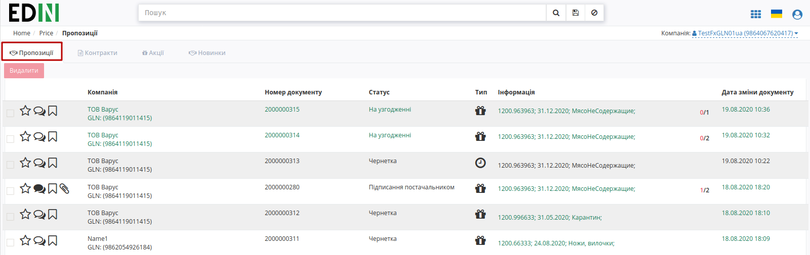

Перегляд і обробка вхідного документа від Мережі (ініціація постачальника) 
----------------------------------------------------------------------------------------------------------------

Поки узгодження опрацьовується мережею, він знаходиться у статусі **На узгодженні**. Після обробки мережею, за затвердженими позиціями ви отримаєте документ, підписаний з боку мережі у статусі **Підписання постачальником**. Перед відкриттям ви вже можете переглянути загальну кількість принятих та відхилених позицій. Відкрийте вхідний документ:

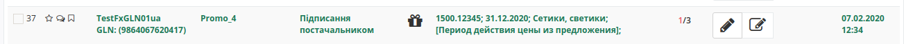

У відкритому узгодженні можна побачити основну інформацію по документу:

1. Показник кількості позицій з підвищенням ціни та кількість позицій з пониженням ціни; **лише при узгодженні регулярних цін**! Загальну кількість позицій, що відправленні на узгодження (чорним) та з них кількість відхилених (червоним). 
2. Візуалізацію підпису від Мережі у блоці **Контрагенти** (натиснувши на візуалізацію КЕП, відкриється вікно з данними про підписантів)

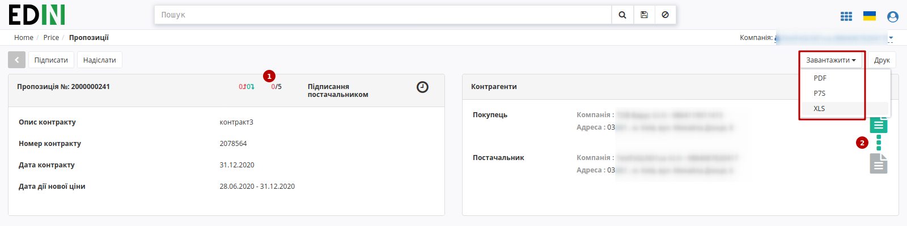

Також є можливість роздрукувати чи завантажити документ AGREEM (XLS), підписаний документ COMDOC_008 (P7S), друкований макет підписаного документа COMDOC_008 з візуалізацією підписів (PDF).

У табличній частині перелік усіх надісланих позицій з відповідним статусом від мережі, а нижче коментарі від Мережі (за наявності). Натисніть кнопку **"Підписати"** (1) для ініціалізації підписання документу:

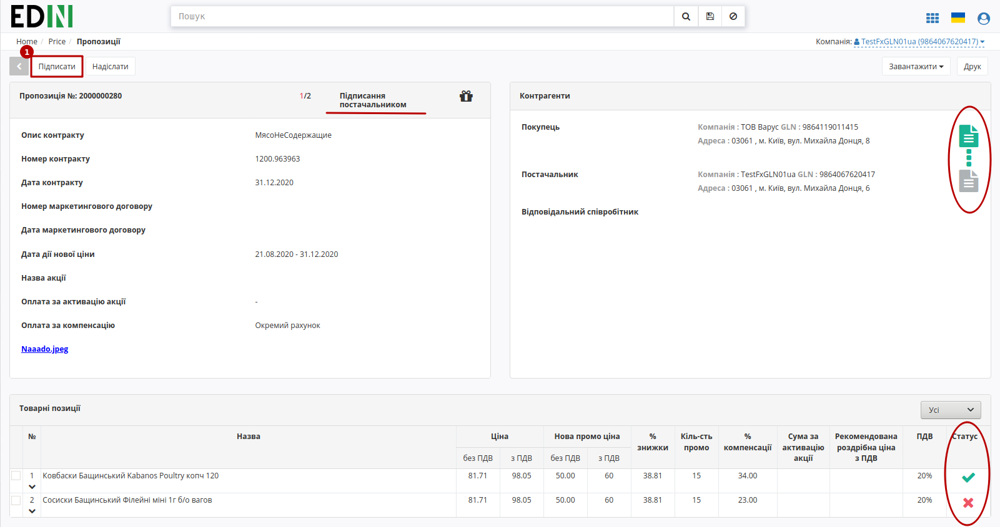

.. _sign:

.. include:: /_constant/atb_check/atb_check.rst
   :start-after: .. початок блоку для ATB_check
   :end-before: .. кінець блоку для ATB_check

.. tabs::

   .. tab:: Файловий ключ

      .. include:: /_constant/signing/signing.rst
         :start-after: .. початок блоку для Signing
         :end-before: .. кінець блоку для Signing

   .. tab:: Token

      .. include:: /_constant/token_signing/token_signing.rst
         :start-after: .. початок блоку для TokenSign
         :end-before: .. кінець блоку для TokenSign

   .. tab:: Гряда

      .. include:: /_constant/gryada_signing/gryada_signing.rst
         :start-after: .. початок блоку для GryadaSign
         :end-before: .. кінець блоку для GryadaSign

   .. tab:: Cloud

      .. include:: /_constant/cloud_signing/cloud_signing.rst
         :start-after: .. початок блоку для CloudSign
         :end-before: .. кінець блоку для CloudSign

Після підписання узгодження інформація щодо підписанта відображається в блоці "Контрагенти". Тепер обидві візуалізації КЕП в зеленому кольорі. 

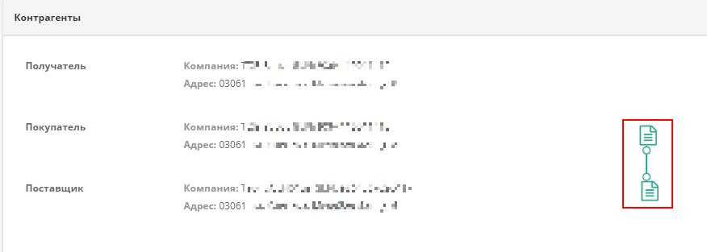

Після успішного підписання, натисніть кнопку **Надіслати**:

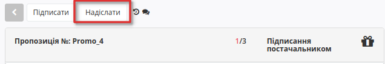

Після підписання й відправки статус докумена міняється на **Завершено**. У блоці Контрагенти відображаються два підписи.

Обгрунтування
----------------------------------------------------------------------------------------------------------------

Лише для Постачальника, існує можливість додати обгрунтування зміни ціни або інші документи, які можуть прискорити погодження. Для цього натисніть кнопку «**Додати обгрунтування**».
У вікні що відкрилось, виберіть та додайте необхідні файли.

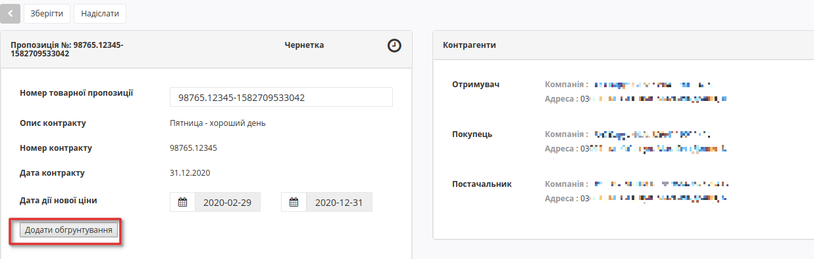

Додати обгрунтування можливо документу у статусі узгодження **Чернетка**, та лише файл формату PDF, JPEG, ZIP. Максимальний розмір файлу - 10 МБ.

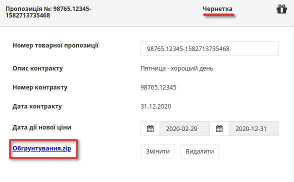

Після завантаження файлів з'являться кнопки **Змінити** - якщо ви хочете завантажити інший файл, та **Видалити** - для видалення вкладення для обґрунтування. Для скачування потрібно натиснути на назву документу.

Після збереження та до відправки, документу присвоєно статус **Чернетка**. 
Для відправки документа необхідно натиснути на кнопку «**Надіслати**».

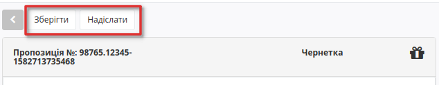

.. attention::
   За відправки Пропозиції-чернетки виконується перевірка наявності контракту та товарних позицій в мережі. За їх відстуності виводиться відповідне повідомлення про помилку: "Контракт був видалений торговельною мережею. Зв'яжіться, будь ласка, з представником торгової мережі." чи "Виділені товарні позиції не були знайдені в контракті. Зв'яжіться, будь ласка, з представником торгової мережі."

Псля відправки документа його статус зміниться на **На узгодженні**, та з'явиться можливість лишити комментар для мережі, наприклад, для певних уточнень.

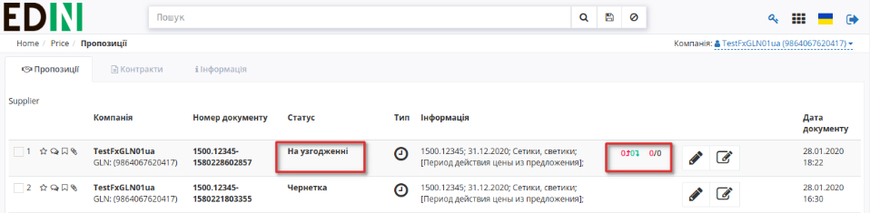

.. important::
   Постачальник може додати вкладення в якості "Обгрунтування" під час формування Пропозиції або після її відправки, якщо вона має статус "На узгодженні" і до Пропозиції раніше не було додано іншог вкладення. Після додавання "Обгрунтування" до відправленої Пропозиції в блоці коментарів автоматично додається новий коментар: "Додано вкладення для обгрунтування" (коментар також відображається на стороні мережі).

Зв'язок з мережею
----------------------------------------------------------------------------------------------------------------

Під табличною частиною з позиціями з'явився блок для звязку з покупцем.

Введіть текст повідомлення у поле з підсказкою *Введіть коментар* у блоці **Зв'язок з покупцем** під табличною частиною:

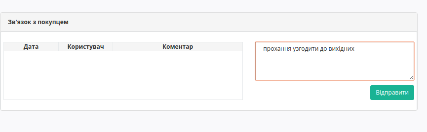

Документ що містить вкладення позначається скріпкою, а документ що містить коментар позначається символом заповненого коментаря:

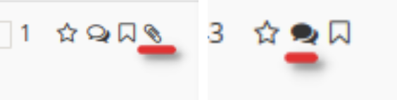

Акції 
========================

Розділ **"Акції"** доступний на стороні Мережі та Постачальника. Представник Мережі може редагувати (додавати/змінювати/видаляти позиції) основну таблицю розділу, а Постачальнику доступно лише переглядати інформацію по акціям.

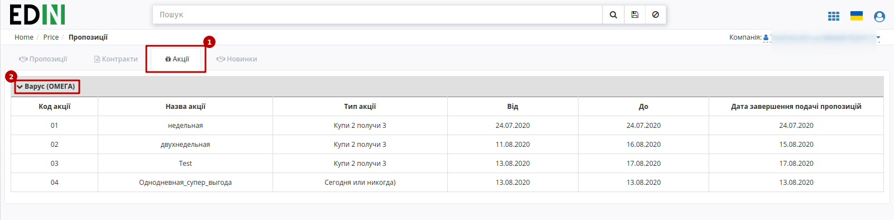

Відображається лише список мереж, з якими працює Постачальник, а також увімкнені налаштування на платформі (за потреби звертайтесь на support@edin.ua ). Якщо мережа не завантажила акції, то при натисканні на блок з назвою мережі виводиться повідомлення: 

.. attention::
   Немає доступного списку акцій. Зв'яжіться, будь ласка, з представником торгової мережі.

Новинки 
========================

Розділ **"Новинки"** доступний на стороні Мережі та Постачальника. Постачальника може "Додавати нові позиції" (1):

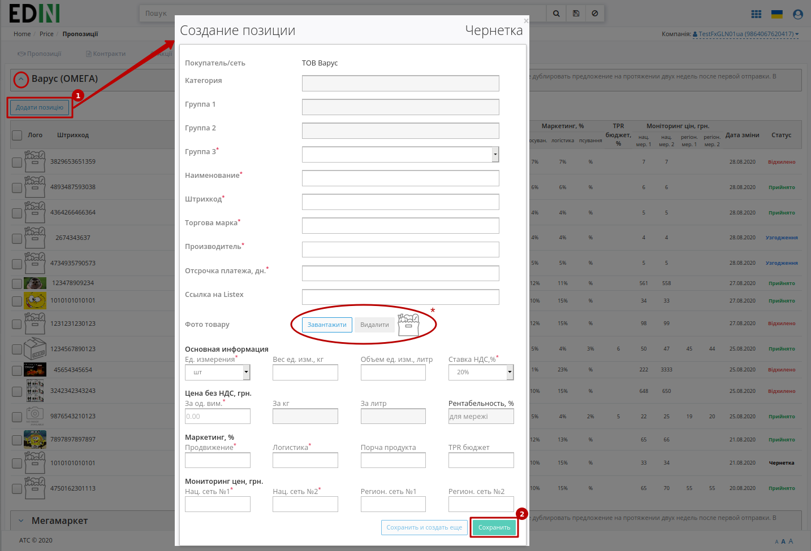

Для збереження (2) позиції потрібно заповнити всі обов'язкові поля позначні червоною зірочкою :red:`*` .

.. tip::
   * При створенні товарної позиції (Чернетка) замість стандартного лого можливо завантажити фото товару максимальним розміром зображення 5 МБ (JPEG/JPG, PNG).

Після чого позиції, що мають статус "Чернетка" можливо **"Видалити"** чи **"Надіслати"** (4), заздалегідь обравши (3) створені позиції.

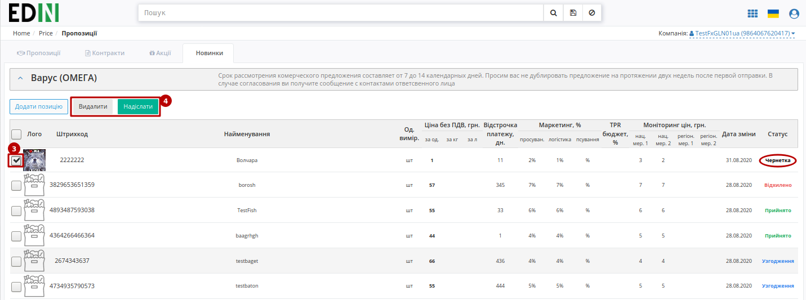

Далі ця позиція на стороні Мережі проходить узгодження, а статус позиції автоматично оновлюється в таблиці розділу.

.. hint::
   Користувачі можуть отримувати повідомлення на ел. пошту про зміну статуса відправленої новинки. Для налаштувань такої опції потрібно звертутись до співробітників компанії-провайдера.

   .. image:: pics_E_Spec_Іnstrukcіya_dlya_postachalnika/pics_Іnstrukcіya_dlya_postachalnika_32.png
      :align: center

----------------------------------

.. include:: kontakti.rst

