Узгодження цін на web-платформі Е-СПЕЦИФІКАЦІЯ. Інструкція для роздрібної мережі
#############################################################################

.. сюда закину немного картинок для текста

.. |drop_pass| image:: signing/drop_pass.png

.. |del_key| image:: signing/del_key2.png

.. role:: underline

---------

.. contents:: Зміст:
   :depth: 3

---------

Вступ
==========================================

Е-СПЕЦИФІКАЦІЯ - рішення для швидкого узгодження цін між постачальниками і торговими мережами.
Інструкція визначає порядок узгодження ціни і підписання документа на стороні Мережі на веб-платформі Е-СПЕЦИФІКАЦІЯ. 
Зверніть увагу! Описаний функціонал не передбачає введення нових товарних позицій!
 
Схема роботи
==========================================

Роздрібна мережа зі своєї облікової системи вивантажує на FTP товарний довідник - Електронна специфікація в форматі XML (PRODUCTLIST.XML) або COMDOC_008 (Товарна специфікація), актуальний на момент вивантаження. Після обробки даного файлу на платформі, у постачальника, у сервісі **Е-СПЕЦИФІКАЦІЯ** у вкладці **Контракти**, відобразиться перелік мереж та діючих контрактів з мережею. Усі контракти зручно згруповані по назві мережі. Фільтр допоможе знайти необхідну мережу, а за допомогою пошуку по номеру контракту або договору, чи навіть по штрихкоду або артикулу позиції можна вибрати конкретний контракт. 

Постачальник на підставі узгодженого товарного довідника формує пропозицію щодо зміни цін і направляє його в торговельну мережу на узгодження.

Торгова мережа проводить узгодження даної пропозиції. У разі успішного рішення підписує зі свого боку документ і направляє його постачальнику. Постачальник зі свого боку підписує комерційний документ і відправляє Торговій мережі. Після отримання підписаного з обох сторін документа, на FTP Торгової мережі викладається новий узгоджений Товарний довідник (специфікацію), на підставі якого оновлюються дані в обліковій системі.

.. note:: У разі будь-яких змін даних, погоджених не через систему EDI, **Товарний довідник** вивантажується повторно.

Перегляд актуального узгодженого товарного довідника
====================================================================================

.. note:: Всі дані (адреси та назви) наведені в Інструкції - фіктивні, використовуються тільки в якості прикладу! 

Для перегляду і подальшої роботи з узгодженим довідником необхідно виконати вхід в систему за допомогою наданих логіна і пароля. Далі серед доступних сервісів виберіть **Е-СПЕЦИФІКАЦІЯ**

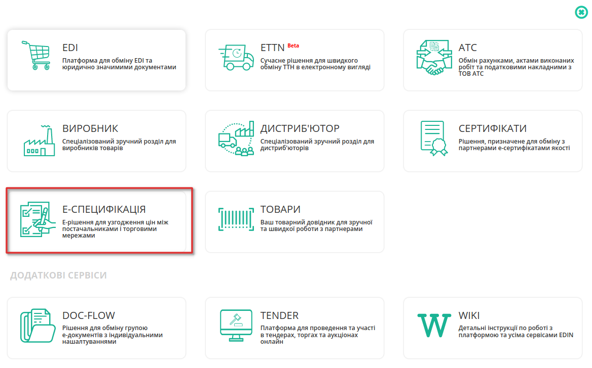

Після відкриття сервісу, перейдіть у вкладку **Контракти**, де відобразиться перелік постачальників та діючих контрактів з актуальними товарними довідниками. Фільтр допоможе вибрати необхідного Постачальника, а за допомогою пошуку по номеру контракту або договору, чи навіть по штрихкоду або артикулу позиції можна вибрати конкретний контракт. Усі контракти зручно згруповані за назвою компанії Постачальника:

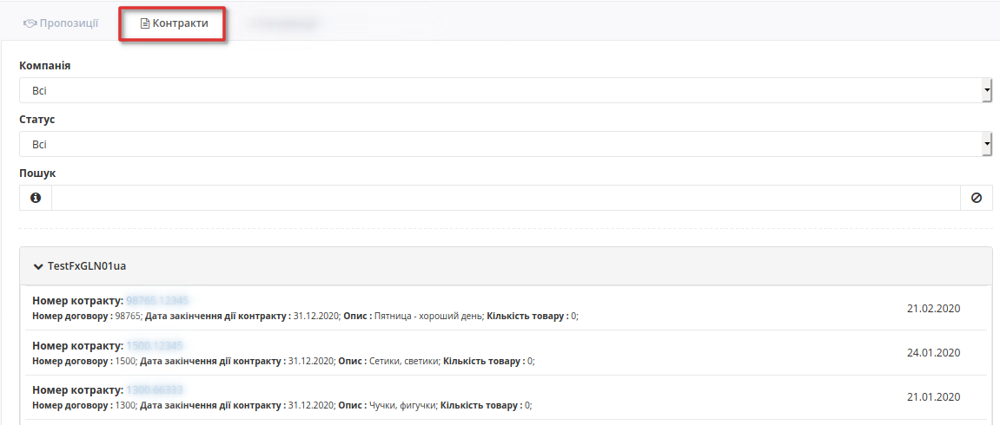

Для перегляду вмісту довідника необхідно перейти до відповідного документа клікнувши кнопкою миші на номер контракту. Буде відкрита детальна форма довідника з пропозиціями та можливими діями з ними.

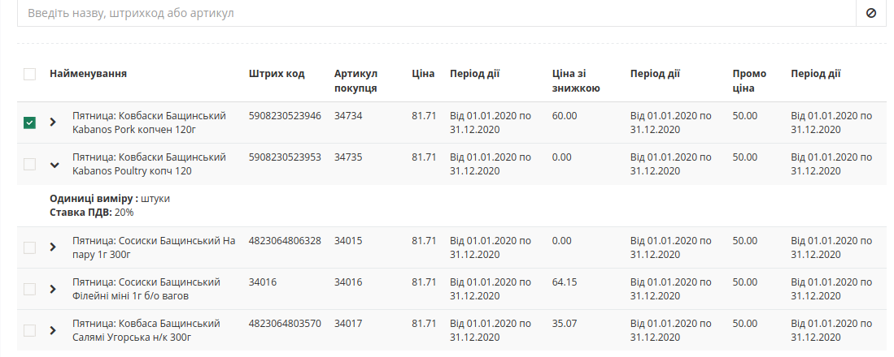

Обробка Товарного узгодження
==========================================

Для перегляду пропозицій на переузгодження цін, перейдіть у вкладку **Пропозиції** де відобразиться весь список Товарних узгодженнь, тобто пропозицій щодо зміни цін з назвою компанії та номером документа, статус пропозицій, тип ціни - регулярна або промо, інформація по пропозиції та показник кількості позицій з підвищенням/пониженням ціни (лише для регулярних цін), а також загальна кількість змінених позицій.

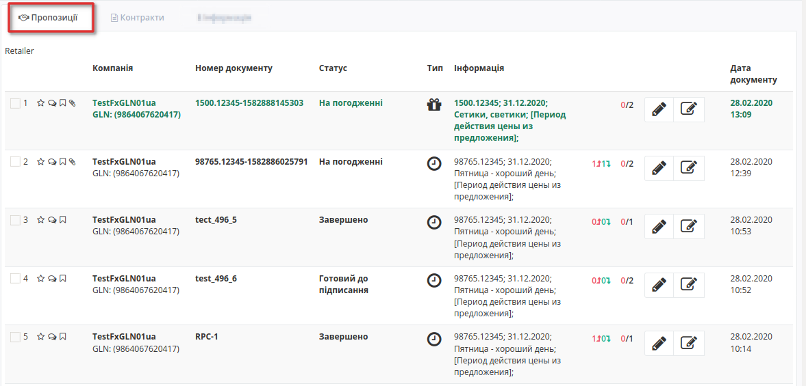

Відображення пропозицій на зміну регулярної ціни та промо ціни відрізняється. Регулярна ціна позначається чорним кольором та спец позначкою у стовбці тип (3):

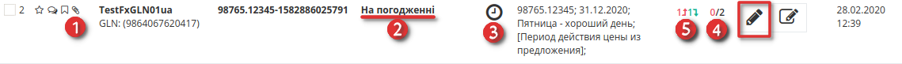

Промо ціни виділені зеленим кольором та спец позначкою у стовбці тип (3):

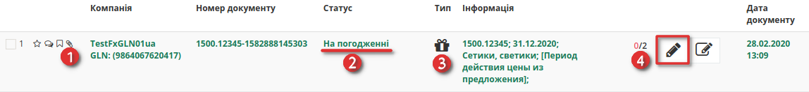

Значення символів:

1. Піктограмма скріпка - означає що до пропозиції додано обгрунтування;
2. Статус пропозиції - нові пропозиції від постачальника приходять у статусі **На погодженні**;
3. Тип - піктограмма інформує про тип ціни, "годинник" - означає регулярна ціна; "пакунок" - означає що пропозиція на промо ціну
4. Показник загальної кількості позицій що відправленні на узгодження -чорним, та з них кількість відхилених - червоним
5. Показник кількості позицій з підвищенням ціни та кількість позицій з пониженням ціни; лише при узгодженні регулярних цін!

Для відкриття пропозиції та її обробки натиснути Олівець - символ редагування.

**Ціни зі знижкою**
 Постачальник може сформувати пропозиції на зміну *регулярної ціни зі знижкою*, в залежності від індивідуальних налаштувань мережі. У такому випадку таблична частина з позиціями буде розширена додатковими стовбцями з можливістю вказати ціну зі знижкою. У таких пропозиціях мережа може знінювати поле "**Кількість**". 

.. note:: Кількість етапів узгодження залежить від налаштуваннь мережі, тобто кожне узгодження унікальне. Кількість етапів варіюється від двох до п'яти. Для налаштування етапів зверніться до свого менеджера АТС або у Службу підтримки.

1 етап. Обробка товарного узгодження категорійним менеджером
-------------------------------------------------------------------

Мережа отримує нове узгодження, відправлене Постачальником, у статусі **На погодженні**

Для відкриття вхідного документа натисніть на знак редагування. У новому вікні, ТС бачить форму пропозиції:

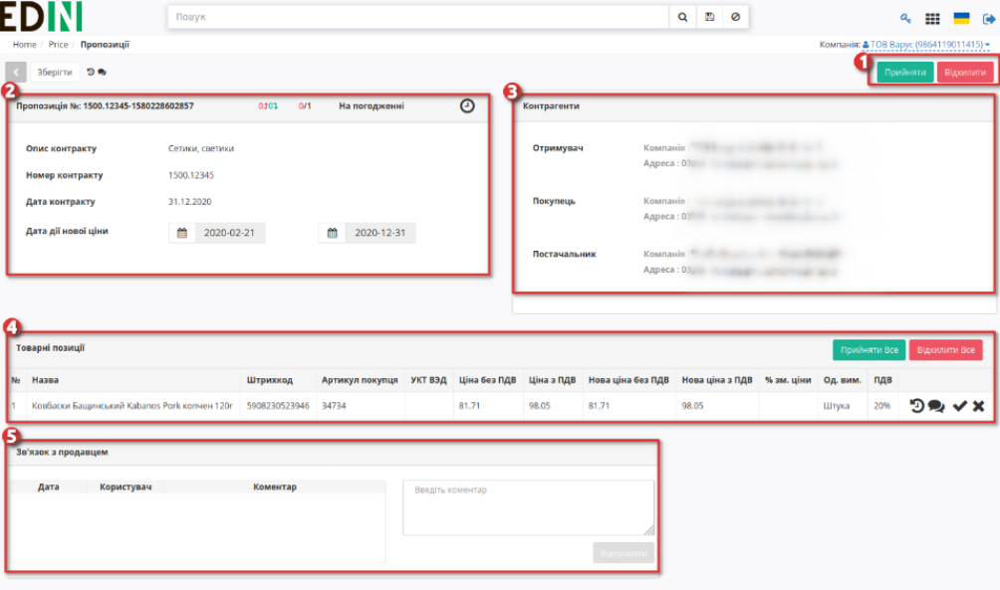

1. Кнопки Прийняти або Відхилити - для обробки усіх позицій відразу
2. Інформацію про Пропозицію на зміну ціни, її опис та номер контракту який оновлюється, дати дії нової ціни, а також статус пропозиції та данні по кількості позицій на зміну
3. Контрагенти - інфо по партнеру, що надіслав пропозицію, також тут відображаються іконки візуалізації підписів з боку мережі і постачальника (при наявності)
4. Таблична частина з товарними позиціями та інфо по них, можливістю прийняти / відхилити кожною окрему позицію та всі разом
5. Блок Зв'язок з продавцем - можливість переглянути коментарі продавця та залишити коментар

У документі на зміну регулярної / промо ціни Вам необхідно перевірити ціни в кожній з позицій і вказати статус - Прийнято / Не прийнято, по необхідності змінити період для нової ціни, та відправити,після чого змінится загальний статус документа на - **Узгодженно** (або на той статус який закріплено за данним погоджувачем).

.. note:: Якщо позиція не була прийнята / відхилена, то при переході на наступний етап - вона автоматично буде прийнята.

Якщо ви не маєте можливість змінити статус пропозицій, це означає що за налаштуваннями узгодження у вас немає прав на прийняття/відхилення пропозиції у данному статусі.

На будь-якому етапі можливо відхилити пропозицію, й вона відразу змінить статус на **Відхилено**.

2 етап. Обробка Товарного узгодження Керівником відділу 
-------------------------------------------------------------------

Документ Товарне узгодження, узгоджений Категорійним менеджером на першому етапі, надходить на наступний зі статусом **Узгодженно** (статус пропозиції що розглядається, може відрізнятися, бо залежить від індивідуальних налаштувань етапів мережі). Для відкриття вхідного документа натисніть на знак редагування.

У формі документа Вам необхідно перевірити ціни в кожній з позицій, вказати статус - Прийнято / Не прийнято.

Також нижче в формі документа у Вас є можливість звернутися до відповідного постачальника і залишити йому коментар. Для цього введіть текст повідомлення в порожнє поле і натисніть кнопку **Надіслати**.

Після зміни статусу позицій та після збереження змін, документ змінює статус на «**Готовий до підписання**» й відправляється на наступний етап - Підписання.

3 етап. Обробка і підписання Товарного узгодження Комерційним директором
------------------------------------------------------------------------------------

.. note:: Підписати документ можливо лише у статусі "*Готовий до підписання*"!

Документ Товарне узгодження, узгоджений Керівником відділу надходить зі статусом **Готовий до підписання**. Відкрийте вхідний документ Товарне узгодження, натиснувши на олівець.

У формі документа Вам необхідно перевірити ціни в кожній з позицій, вказати статус - Прийнято / Не прийнято, потім змінити загальний статус документа - Погоджено / Відхилено. Після зміни статусу натисніть кнопку **Підписати**.

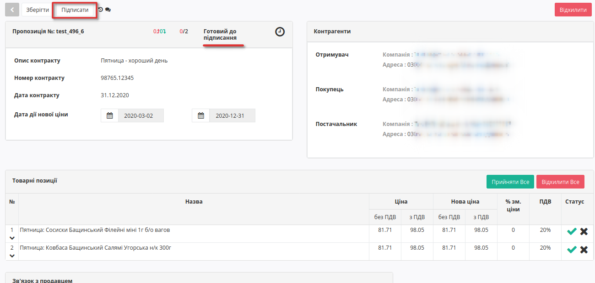

.. _sign:

.. include:: /_constant/atb_check/atb_check.rst
   :start-after: .. початок блоку для ATB_check
   :end-before: .. кінець блоку для ATB_check

.. tabs::

   .. tab:: Файловий ключ

      .. include:: /_constant/signing/signing.rst
         :start-after: .. початок блоку для Signing
         :end-before: .. кінець блоку для Signing

   .. tab:: Token

      .. include:: /_constant/token_signing/token_signing.rst
         :start-after: .. початок блоку для TokenSign
         :end-before: .. кінець блоку для TokenSign

   .. tab:: Гряда

      .. include:: /_constant/gryada_signing/gryada_signing.rst
         :start-after: .. початок блоку для GryadaSign
         :end-before: .. кінець блоку для GryadaSign

   .. tab:: Cloud

      .. include:: /_constant/cloud_signing/cloud_signing.rst
         :start-after: .. початок блоку для CloudSign
         :end-before: .. кінець блоку для CloudSign

Після підписання узгодження інформація щодо підписанта відображається в блоці "Контрагенти". 

Після успішного підписання, натисніть кнопку **Надіслати**. 
Після підписання й відправки статус докумена міняється на **Підписання постачальником** й відображається один підпис - від мережі:

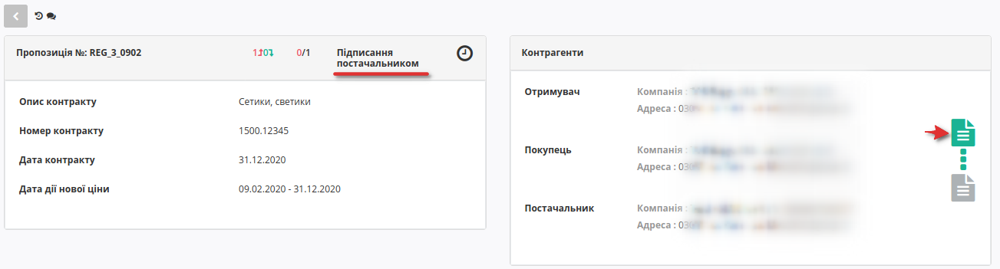

Вже після підписання постачальником та відправки, статус узгодження зміниться на **Завершено** та з'явиться ще один підпис у блоці Контрагенти. Тепер обидві візуалізації КЕП в зеленому кольорі:

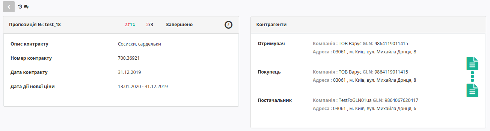

Додаткові можливості і функції
==============================================================================================

Інтерфейс
--------------------------------------------------------------

Для зручності визначення типу Товарного узгодження, документи різних типів виділені різними кольорами:
 
- чорні - пропозиції щодо зміни регулярної ціни
- зелені - пропозиції щодо зміни промо ціни

Є лічильник позицій з підвищенням і зниженням регулярної ціни. За необхідності документ можна виділити як важливий, ставити мітки, а також прочитати всю історію листування не заходячи в документ.

Нижче представлений список можливих проміжних статусів узгоджень:

* 1 - Чернетка (на стороні постачальника)
* 2 - Відправлено (на стороні постачальника)
* 3 - На узгодженні (на стороні постачальника)
* 4 - Відхилено (на стороні постачальника)
* 5 - Підписання постачальником (на стороні постачальника)
* 6 - 2 підписання постачальником (на стороні постачальника)
* 7 - Завершено (на стороні постачальника)
* 11 - Відхилено (на стороні мережі)
* 12 - На узгодженні (на стороні мережі)
* 13 - Підготовлено (на стороні мережі)
* 14 - Готовий до підписання (на стороні мережі)
* 15 - Погоджено (на стороні мережі)
* 16 - Підписано (на стороні мережі)
* 17 - Перевірено (на стороні мережі)
* 18 - Підтверджено (на стороні мережі)
* 19 - Підписання постачальником (на стороні мережі)
* 20 - Підписання мережею (на стороні мережі)

Примітка! При наявності в бізнес процесі додаткових департаментів (керівник відділу закупівлі, служба безпеки, економічна безпека, фінансовий аналітик, логістика) статуси та етапи можуть змінюватися. Зверніться до вашого менеджера АТС або до Служби підтримки за налаштуваннями.

Обгрунтування від постачальника
--------------------------------------------------------------

У блоці «**Інформація про контракт**» можливо скачати *обгрунтування* - вкладення постачальника, якщо він його додав. Ознайомитися з вкладенням можна зайшовши в товарне узгодження і натиснувши на  **посилання з назвою обгрунтування** - скачування почнеться автоматично. Максимальний розмір файлу  - 10МБ.

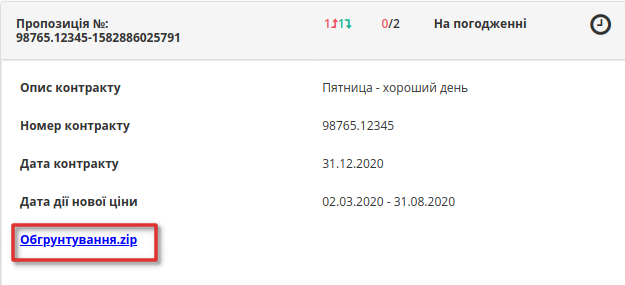

У вікні «**Зв'язок з продавцем**» у Вас є можливість читати коментарі постачальника і залишати свої. Для цього введіть текст повідомлення в порожнє поле і натисніть кнопку **Надіслати**:

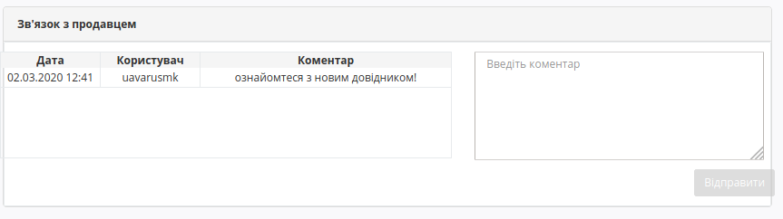

У разі якщо постачальник додав обгрунтування зміни ціни або приклав якісь інші файли, то вхідні документи з вкладеннями будуть позначені скріпкою, а документ  що містить коментар позначається символом заповненого коментаря(у вигляді заповненої хмаринки):

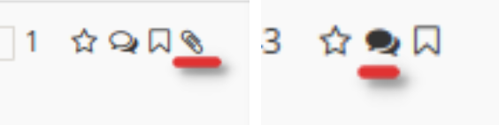

Акції 
========================

Розділ **"Акції"** доступний на стороні Мережі та Постачальника. Представник Мережі може редагувати (додавати/змінювати/видаляти позиції) основну таблицю розділу, а Постачальнику доступно лише переглядати інформацію по акціям.

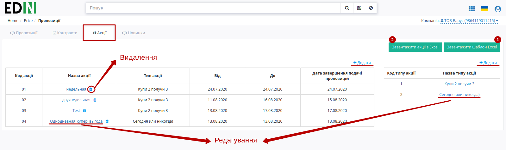

Список акцій можливо редагувати вручну чи шляхом вивантаження xls-файлу (кнопка **"Завантажити акції з Excel"** (2)) - для цього попередньо потрібно **"Завантажити шаблон Excel"** (1).

Новинки 
========================

Розділ **"Новинки"** доступний на стороні Мережі та Постачальника. Постачальники відправляють позиції на узгодження, а представник Мережі із загального списку може обрати (1) позиції в статусі "Узгодження" та **"Відхилити"** чи **"Прийняти"** обрані позиції:

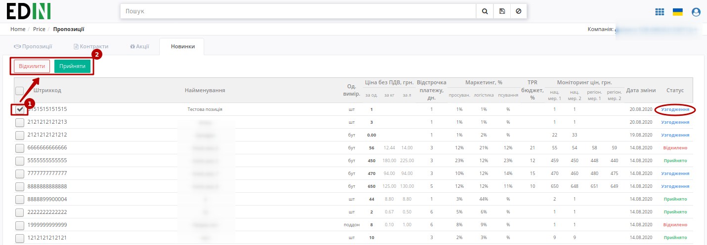

Статус позиції автоматично оновлюється в таблиці розділу.

.. hint::
   Користувачі мережі можуть отримувати повідомлення на ел. пошту про вхідні новинки. Для налаштувань такої опції потрібно звертутись до співробітників компанії-провайдера.

   .. image:: pics_E_Spec_Іnstrukcіya_dlya_merezhі/pics_E_Spec_Іnstrukcіya_dlya_merezhі_12.png
      :align: center

-------------------------

.. include:: kontakti.rst
