Робота з сервісом EDIN-Tender 2.0
#############################################################

.. role:: red

.. role:: green

.. role:: orange

.. role:: underline

.. сюда закину немного картинок для текста

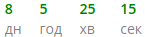

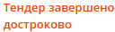

.. |продаж| image:: pics_Work_with_Tender/Work_with_Tender_57.png

.. |approved| image:: pics_Work_with_Tender/Work_with_Tender_147.png

.. contents:: Зміст:
   :depth: 6

---------

**Гостьовий доступ**
================================================

Платформа **EDIN Tender** (https://tender-v2.edin.ua) дозволяє незареєстрованим користувачам ознайомитись з інтерфейсом, оцінити потенціал торгової площадки (кількість активних відкритих тендерів, їх організаторів). Однак можливості перегляду в такому режимі є обмеженими і для повноцінного ознайомлення з функціоналом платформи, інформацією по тендерах потрібно пройти авторизацію (вхід):

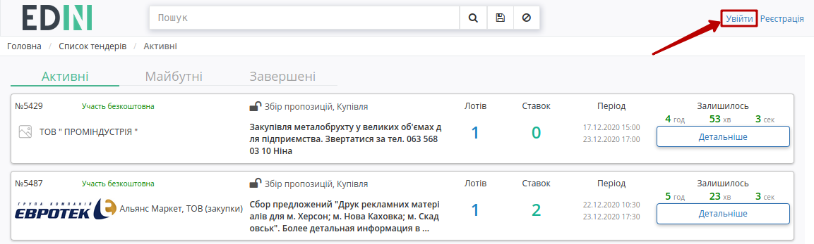

.. image:: /general_2_0/pics_rabota_s_platformoj_EDIN_2.0/rabota_s_platformoj_072.png 
   :align: center

Новим користувачам, що бажають працювати на платформі потрібно пройти "Реєстрацію" (детальніше в окремій `інструкції <https://wiki.edin.ua/uk/latest/general_2_0/User_registration.html>`__).

.. _wrong-time:

**1 Налаштування дати та часу**
================================================

Якщо у ОС користувача невірно налаштований дата та час (на 1 хвилину або більше), то для уникнення часових розбіжностей при роботі з тендерами система повідомляє про необхідність коригування часу в користувацькій операційній системі (ОС):

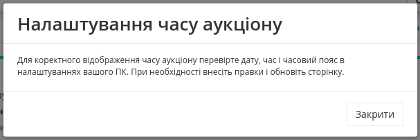

.. hint::
   * `Налаштування дати та часу для ОС Windows <https://support.microsoft.com/uk-ua/windows/%D1%83%D1%81%D1%82%D0%B0%D0%BD%D0%BE%D0%B2%D0%BB%D0%B5%D0%BD%D0%BD%D1%8F-%D1%87%D0%B0%D1%81%D1%83-%D0%B9-%D1%87%D0%B0%D1%81%D0%BE%D0%B2%D0%BE%D0%B3%D0%BE-%D0%BF%D0%BE%D1%8F%D1%81%D1%83-dfaa7122-479f-5b98-2a7b-fa0b6e01b261>`__
   * `Налаштування дати та часу для ОС Macintosh <https://support.apple.com/uk-ua/guide/mac-help/mchlp2996/mac>`__
   * `Налаштування дати та часу для ОС Linux <https://losst.ru/ustanovka-vremeni-linux>`__

**2 Загальний вигляд платформи**
================================================

Після успішної авторизації відкриється основне вікно сервісу **EDIN Tender**. 

.. image:: pics_Work_with_Tender/Work_with_Tender_92.png
   :align: center

Основне вікно сервісу **EDIN Tender**:

#. Рядок пошуку документів за різними критеріями (детальніше в `розділі "Пошук" <https://wiki.edin.ua/uk/latest/Tender_2_0/Work_with_Tender.html#search>`__ );
#. Місцерозташування користувача на платформі;
#. Статус та вибір компаній, від імені якої будуть здійснюватись дії;
#. Новини, Повідомлення, меню сервісів, `налаштуваня користувача <https://wiki.edin.ua/uk/latest/general_2_0/rabota_s_platformoj_EDIN_2.0.html#pers-settings>`__;
#. Папки "Усіх" чи лише "Своїх" тендерів (в яких користувач приймає участь), чернеток, а також обраних тендерів (відмічених заповненою зірочкою |звезда|);
#. Кнопка створення тендера (детальніше про `створення тендерів <https://wiki.edin.ua/uk/latest/Tender_2_0/Work_with_Tender.html#tender-create>`__);
#. "Підписки" - сторінка для перегляду та здійснення контролю підписок на організаторів тендерів та на категорії тендерів (детальніше в наступному підрозділі);
#. Журнал тендерів, що має швидкий фільтр відображення тендерів ("Активні" / "Майбутні" / "Завершені");
#. "Довідник учасників" - функціонал для автоматизованої відправки запрошень на участь в аукціоні (детальніше про `"Довідник учасників" <https://wiki.edin.ua/uk/latest/Tender_2_0/Work_with_Tender.html#participants-group>`__). 

.. _subscribe:

**2.1 Підписки**
----------------------------------

Вікно підписок користувача розділено на **"Підписки організаторів тендерів"** та **"Підписки на категорії"** (окремо для аукціонів з Продажу та Закупівлі). Для кожної групи підписок передбачені можливості додавання чи видалення власних підписок:

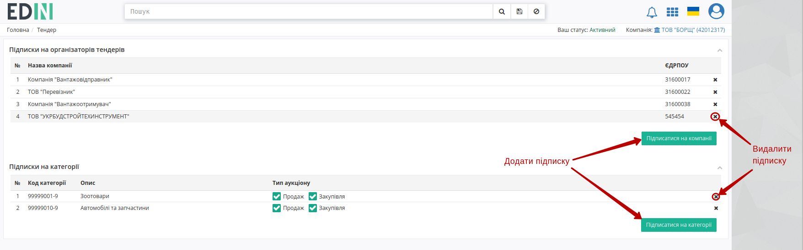

Підписки дозволяють користувачам отримувати сповіщення про нові тендери від організаторів чи в категорії, на які вони підписані. Зручний пошук дозволяє:

* за назвою чи кодом ЕГРПОУ/ІПН відфільтрувати список організаторів:

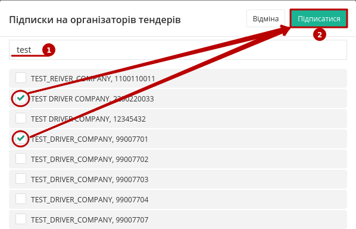

* за назвою чи кодом з класифікатора відфільтрувати категорії та обрати тип аукціону:

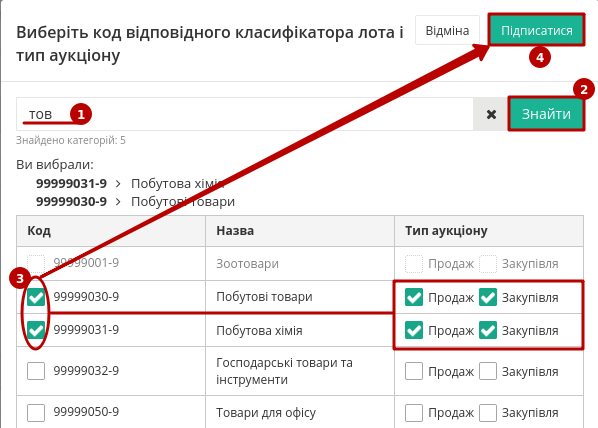

Змінити тип аукціону можливо вже в списку підписок на категорії:

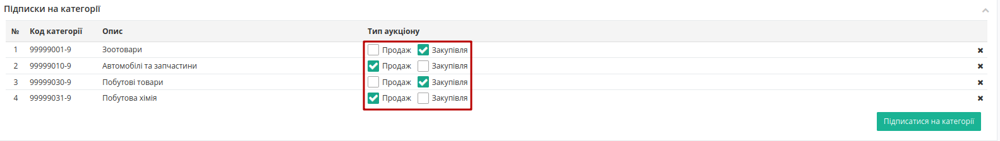

Також підписку на категорію чи організатора можливо здійснити безпосередньо при перегляді інформації по тендеру:

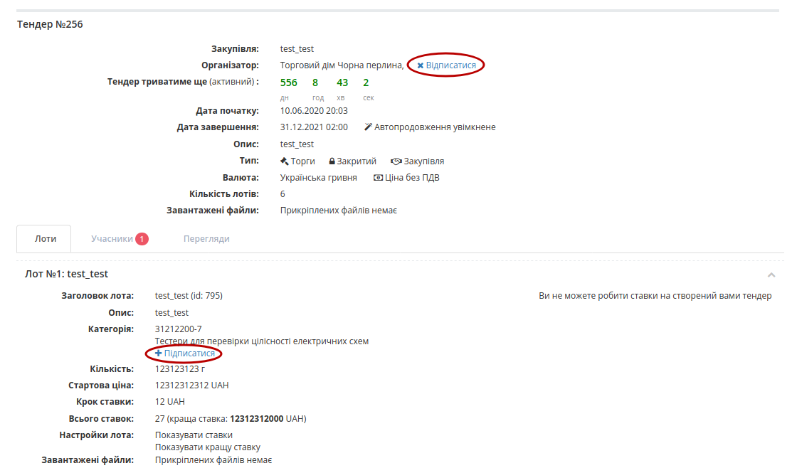

.. attention::
   При здійсненні підписки на категорію лота підписка виконується для всіх типів аукціонів (Продаж + Закупівля).

**2.1.1 Підписки на користувача (на звіт про завершення аукціону)**
~~~~~~~~~~~~~~~~~~~~~~~~~~~~~~~~~~~~~~~~~~~~~~~~~~~~~~~~~~~~~~~~~~~~~~~~

Лише у *Адміністраторів акаунта* сервісу EDIN-Tender 2.0 є можливість вибрати і підписатись на користувачів свого акаунта, звіти про завершення аукціонів яких будуть відправлятись цьому *Адміністратору акаунта* на пошту (email).

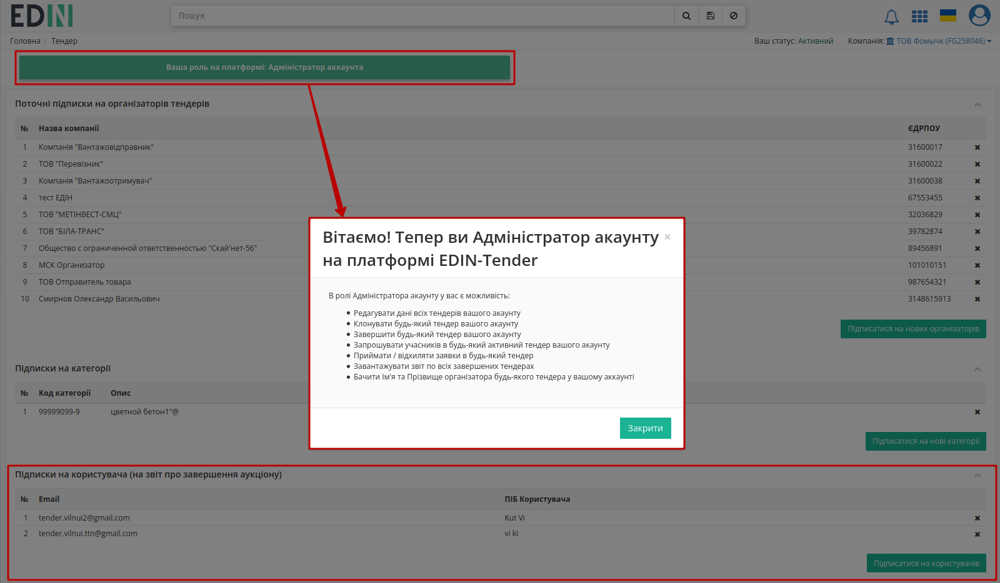

Підписка здійснюється за допомогою кнопки **"Підписатися на користувачів"**. Після чого в модальному вікні за допомогою пошуку зручно знайти користувачів вашого акаунта, на яких Ви бажаєте **"Підписатися"**:

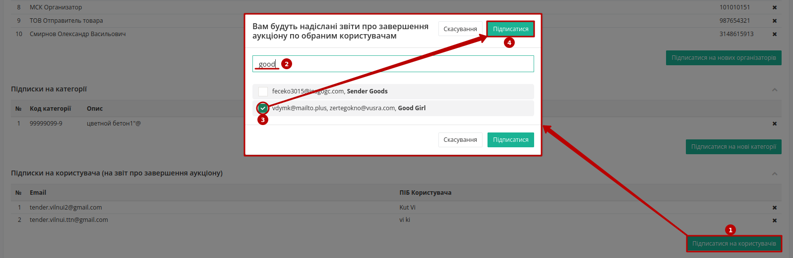

*Адміністратори акаунтів*, що підписались на користувачів, отримують на пошту (email) листа з Excel звітом про завершення аукціону, як і ті ж користувачі, що виступали Організаторами аукціону:

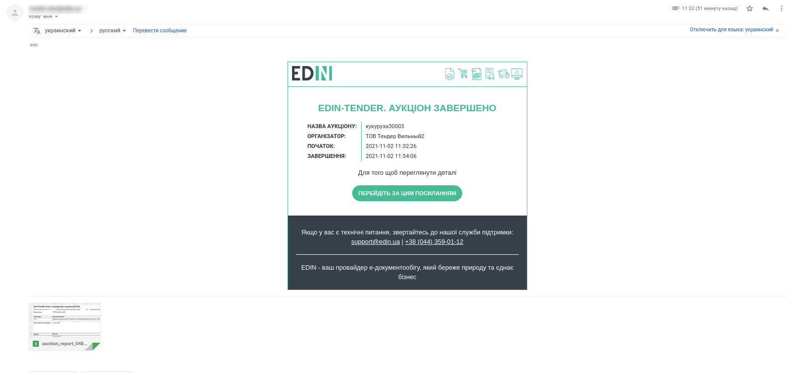

За потреби також можливо видалити підписку на користувачів (відписатись):

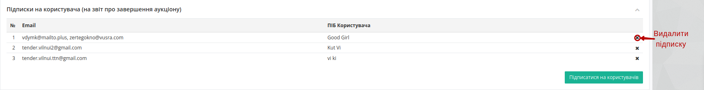

.. _participants-group:

**2.2 Довідник учасників**
----------------------------------

"Довідник учасників" - це функціонал, що дозволяє створювати групи контрагентів для подальшої автоматизованої відправки запрошень на участь в аукціоні за признаком категорії товару. 

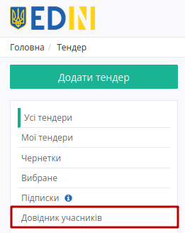

Функціонал довідника відкривається в новому вікні:

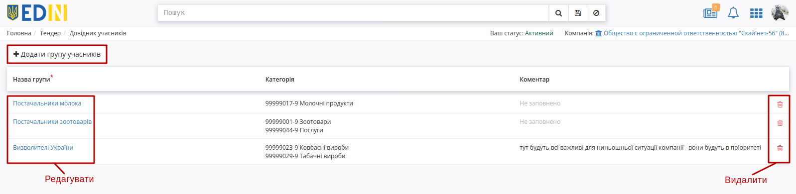

.. note::
   Видалення групи учасників не видаляє компанії-учасників з уже створених аукціонів!

Для початку роботи потрібно **"+Додати групу учасників"**, вказавши назву майбутньої групи (для зручності можливо додати опціональний коментар) та натиснувши **"Створити групу"**:

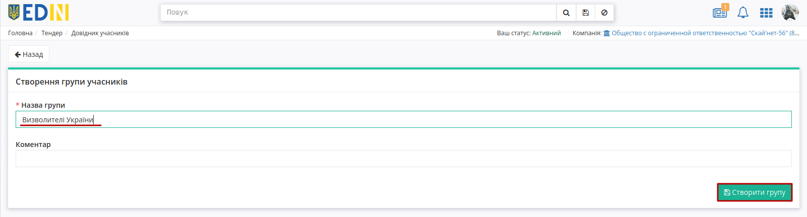

Після створення групи автоматично відкривається **форма редагування цієї групи**. В цю групу додаються Учасники, а також назначаються Категорії товарів (за цими категоріями групи автоматично підтягуються в "Заявку на участь" тендера, що матиме спільну категорію товарів): 

.. image:: pics_Work_with_Tender/Work_with_Tender_122.png
   :align: center

Для того, щоб **"+Додати категорію"** потрібно вибрати категорію з єдиного державного довідника товарних категорій. Для цього можливо скористатись ієрархічним переходом до потрібної категорії чи пошуком: ввести назву категорії (1), натиснути **"Знайти"** (2), вибрати необхідну категорію (3) та натиснути на кнопку **"Зберегти та вийти"** (4):

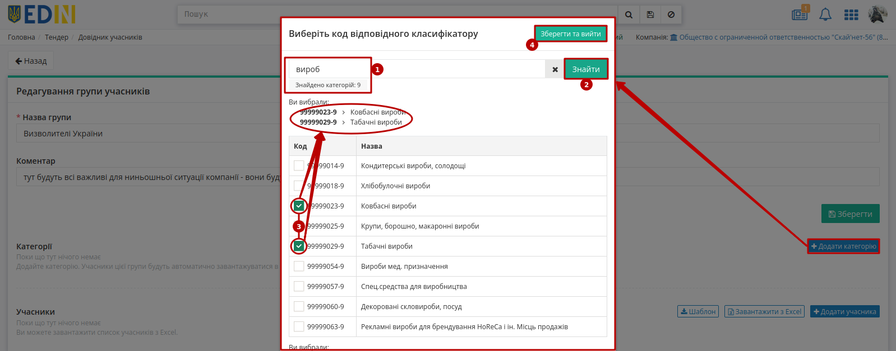

.. attention::
   :red:`Для того, щоб скинути пошук в категорії необхідно натиснути` |хрестик| :red:`біля кнопки "Знайти".`

**"+Додати учасника"** можливо "вручну" за допомогою відповідної кнопки:

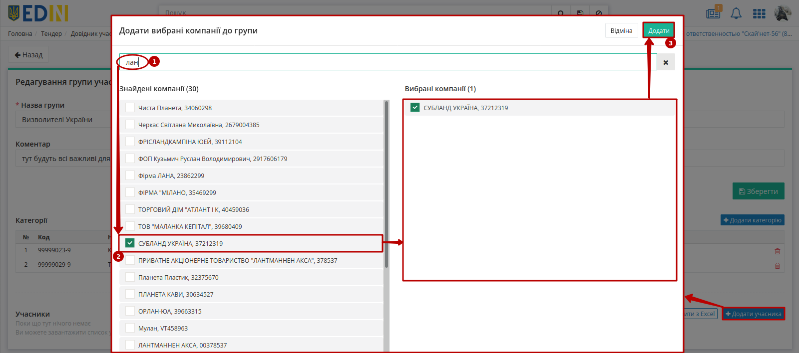

Для зручності в рядку пошуку можливо ввести назву чи код ЄДРПОУ/ІПН компанії, що вже зареєстрована на платформі "EDI Network" (не менше трьох символів) (1), відмітити компанію зі списку знайдених (2) - компанія автоматично потрапляє в список обраних. Після того, як бажаний список сформовано потрібно натиснути на кнопку **"Додати"** (3).

.. attention::
   :red:`Для того, щоб скинути пошук необхідно натиснути на` |хрестик| :red:`в рядку пошуку.`

Також присутня можливість **масово завантажити учасників**, завантаживши їх за допомогою XLSX/XLS файлу. Для цього потрібно спочатку скачати **"Шаблон"** (1), у відповідності до якого й **"Завантажити з Excel"** (2) Ваш список учасників до сервісу:

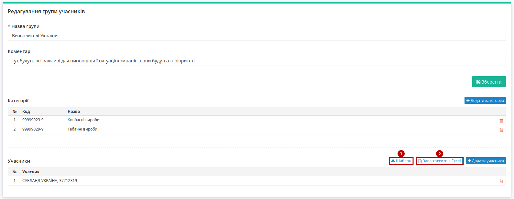

.. attention::
   При завантаженні XLSX / XLS файлу і пошуку компаній пріоритет надається коду ЄДРПОУ/ІПН компанії (поле є обов'язковим до заповнення і відмічене червоною зірочкою :red:`*`). Також не допускається дублювання компанії на рівні однієї групи учасників. В іншому випадку дані користувачів можуть не завантажитись чи завантажитись часково (компанії, що не завантажились виділяються окремим блоком жовтого кольору разом з помилкою завантаження):

   .. image:: pics_Work_with_Tender/Work_with_Tender_126.png
      :align: center

У вікні **"Редагування групи учасників"** всі додані категорії чи учасників можливо видалити за допомогою кнопки |trash|:

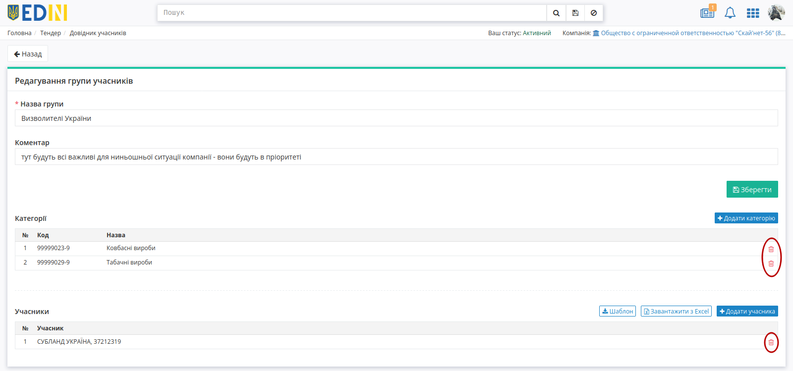

.. _search:

**2.3 Пошук**
----------------------------------

Для пошуку передбачені стандартні "ключі запиту", переглянути які можливо, натиснувши на рядок Пошуку і в списку вибрати **"Доступні для пошуку ключі"**:

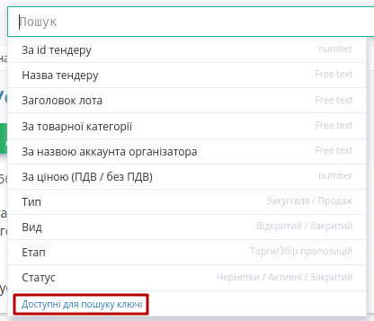

Після чого відобразиться спливаюче вікно з можливостями пошуку:

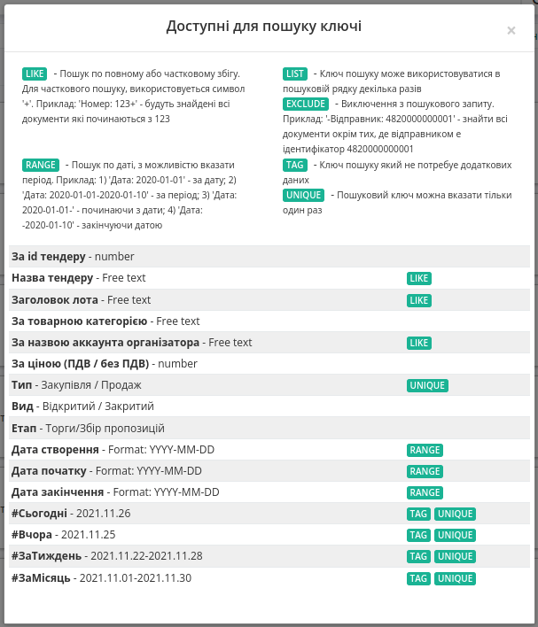

.. hint::
   При пошуку тендерів за датами (**Дата створення**, **Дата початку**, **Дата закінчення**) варто враховувати формат, а також можливості фільтрування:

   * "2021-01-01" - знайти всі аукціони **за вказану дату**;
   * "2021-01-01-2021-01-10" - знайти всі аукціони **за вказаний період**;
   * "2021-01-01-" - знайти всі аукціони, **починаючи з вказаної дати** і закінчуючи поточною;
   * "-2021-01-01" - знайти всі аукціони **до вказаної дати**.

Деякі ключі потребують введення числових значень (наприклад, "За id тендеру", "За ціною"), а деякі здійснюють пошук по тексту (min 3 символи):

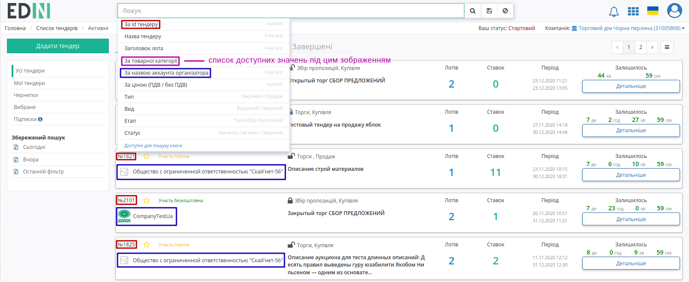

Так для пошуку "За товарною категорією" потрібно вводити доступні значення категорій:

+--------------------------------------+------------------------------------------------------+-------------------------------------------------------------+
| Зоотовари                            | Дитячі іграшки                                       | Торгове обладнання                                          |
+--------------------------------------+------------------------------------------------------+-------------------------------------------------------------+
| Маркетингові послуги                 | Партнерство, франчайзинг                             | Комерційна нерухомість, оренда                              |
+--------------------------------------+------------------------------------------------------+-------------------------------------------------------------+
| Ремонтно-будівельні послуги          | Проектні роботи                                      | Меблі                                                       |
+--------------------------------------+------------------------------------------------------+-------------------------------------------------------------+
| Автомобілі та запчастини             | Фрукти, ягоди                                        | Консервовані продукти                                       |
+--------------------------------------+------------------------------------------------------+-------------------------------------------------------------+
| Риба та морепродукти                 | Кондитерські вироби, солодощі                        | Напої                                                       |
+--------------------------------------+------------------------------------------------------+-------------------------------------------------------------+
| Дитяче харчування                    | Молочні продукти                                     | Хлібобулочні вироби                                         |
+--------------------------------------+------------------------------------------------------+-------------------------------------------------------------+
| Снеки, насіння, горіхи, сухофрукти   | Заморожені продукти                                  | Овочі, гриби, зелень                                        |
+--------------------------------------+------------------------------------------------------+-------------------------------------------------------------+
| М'ясо, птиця, яйце                   | Ковбасні вироби                                      | Цукор                                                       |
+--------------------------------------+------------------------------------------------------+-------------------------------------------------------------+
| Крупи, борошно, макаронні вироби     | Бакалія                                              | Масложирова продукція                                       |
+--------------------------------------+------------------------------------------------------+-------------------------------------------------------------+
| Харчові добавки та спеції            | Табачні вироби                                       | Побутові товари                                             |
+--------------------------------------+------------------------------------------------------+-------------------------------------------------------------+
| Побутова хімія                       | Господарські товари та інструменти                   | Засоби особистої гігієни                                    |
+--------------------------------------+------------------------------------------------------+-------------------------------------------------------------+
| Обладнання, техніка                  | Світлотехнічне та електромонтажне обладнання послуги | Холодильне обладнання та матеріали                          |
+--------------------------------------+------------------------------------------------------+-------------------------------------------------------------+
| Хлібопекарське обладнання            | Охорона, пожежна безпека, відеоспостереження         | Теплове та вентиляційне обладнання, ТО                      |
+--------------------------------------+------------------------------------------------------+-------------------------------------------------------------+
| Оргтехніка і комплектуючі, телефонія | Тара, матеріали, упаковка                            | Кухонний інвентар                                           |
+--------------------------------------+------------------------------------------------------+-------------------------------------------------------------+
| Будівельні матеріали, сантехніка     | Послуги                                              | Клінінгові послуги                                          |
+--------------------------------------+------------------------------------------------------+-------------------------------------------------------------+
| Рекламні послуги                     | Вантажоперевезення                                   | Кур'єрські послуги                                          |
+--------------------------------------+------------------------------------------------------+-------------------------------------------------------------+
| Митно-брокерські послуги             | Товари для офісу                                     | Сезонна продукція                                           |
+--------------------------------------+------------------------------------------------------+-------------------------------------------------------------+
| Текстиль                             | Медикаменти                                          | Вироби мед. призначення                                     |
+--------------------------------------+------------------------------------------------------+-------------------------------------------------------------+
| Сільгосппродукція                    | Сад, город, рослини, квіти                           | Спец.средства для виробництва                               |
+--------------------------------------+------------------------------------------------------+-------------------------------------------------------------+
| ПММ, паливо                          | Рекламна поліграфія, ПОС-матеріали                   | Декоровані скловироби, посуд                                |
+--------------------------------------+------------------------------------------------------+-------------------------------------------------------------+
| Рекламний текстиль                   | Рекламні сувеніри, ділові аксесуари                  | Рекламні вироби для брендування HoReCa і ін. Місць продажів |
+--------------------------------------+------------------------------------------------------+-------------------------------------------------------------+
| Технічне обслуговування обладнання   | Чорна металургія                                     | Утилізація і переробка                                      |
+--------------------------------------+------------------------------------------------------+-------------------------------------------------------------+
| Інформаційно-консультаційні послуги  | Програмне забезпечення, розробка ПО                  | Послуги перевезення, таксі                                  |
+--------------------------------------+------------------------------------------------------+-------------------------------------------------------------+
| медіа послуги та відеозйомка         | складське обладнання та техніка                      | логістичні послуги                                          |
+--------------------------------------+------------------------------------------------------+-------------------------------------------------------------+
| складські послуги                    |                                                      |                                                             |
+--------------------------------------+------------------------------------------------------+-------------------------------------------------------------+

.. note::
   У фільтрах "За назвою аккаунта організатора" / "За товарною категорією" під час пошуку та фільтрації відображається назва(акаунта організатора/категорії) + id, однак при перемиканні між **Активні/Майбутні/Завершені/Мої тендери/Всі тендери/Чернетки/Обрані** для спрощення відображається лише id:

   .. image:: pics_Work_with_Tender/Work_with_Tender_132.png
      :align: center

Для більш точного пошуку можливо додавати кілька ключів через пробіл. Після того, як обрано введено параметри потрібно обов'язково натиснути кнопку пошуку (|лупа|):

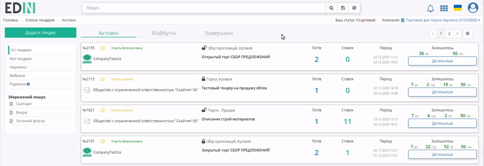

**2.4 Журнал тендерів**
----------------------------------

В папці **"Усі тендери"** відображаються усі аукціони ("Активні"/"Майбутні"/"Завершені"), а при переході в **"Мої тендери"** відображаються аукціони, які даний користувач створив чи приймає/приймав участь (робив ставку, робив запит на запрошення в тендер чи був запрошений Організатором). В **"Чернетках"** відображаються неопубліковані тендери, що були створені даним користувачем. Для `"Супер адміністратора" <https://wiki.edin.ua/uk/latest/Personal_Cabinet/PCInstruction.html#user-roles>`__ в **"Мої тендери"** / **"Чернетки"** відображаються така ж інформація, але по відношенню до всіх користувачів акаунта.

В журналі доступний пошук по заголовкам і описами, як тендерів так і лотів. По кожному тендеру додатково відображається коротка інформація при наведенні курсора миші на значок info:

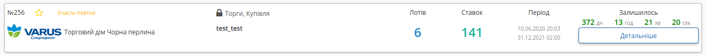

Також коротко відображається інформація по типу тендера ("Відкритий" |відкритий| / "Закритий" |закритий|), етапу ("Торги" / "Збір пропозицій"), кількості лотів, кількості зроблених ставок, дати початку і закінчення тендера. В лівій частині по кожному тендеру символом зірочки (|звезда| / |звезда2|) можливо зробити користувацьку відмітку "вибраний"(для відображення в папці **Вибране**) / "звичайний" тендер. В якості кольорових статусів **Активних** і **Майбутніх** тендерів використовується обернений відлік:

* |зелений| - тривалість тендера, що вже розпочався (**Активний**)
* |фіолетовий| - тривалість тендера, який був опублікований, але ще не розпочався (**Майбутній**)

Завершені тендери також розділяються статусами, в залежності від результату торгів:

|сірий|, |помаранчевий|, |червоний|

**2.5 Платні та безкоштовні тендери**
------------------------------------------------

Аукціони для постачальників можуть бути платними та безкоштовними:

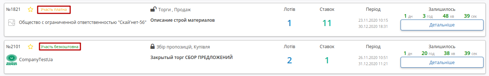

Аукціони на безкоштовній основі — аукціони типу **"Збір пропозицій"** від всіх організаторів, а також аукціони типу **"Торги"** від наступних організаторів (:red:`Організатори можуть змінюватись!`):

* ГК ЕВРОТЕК (за категоріями логістика, маркетинг)
* НОВОМИРГОРОДСЬКИЙ ЦУКОР, ТОВ

.. note::
   Для того аби взяти участь в платних аукціонах потібно щоб у Організатора був активним тарифний пакет "Безкоштовна участь" або щоб у Учасника був статус **Активний**:

   .. image:: pics_Work_with_Tender/Work_with_Tender_99.png
      :align: center

Статус користувача на платформі EDIN-TENDER може бути двох видів:

* **Активний** — користувач аккаунта може брати участь в відкритих/закритих безкоштовних і платних аукціонах типу **"Торги"** і **"Збір пропозицій"** від будь-яких організаторів. Звертаємо увагу, що організатори самостійно приймають рішення про допуск нових учасників в аукціони «закритого» типу.
* **Стартовий** — користувач аккаунта може брати участь в безкоштовних відкритих/закритих аукціонах типу **"Збір пропозицій"** від будь-яких організаторів, подати заявку до участі в закритому платному аукціоні (детальніше в `Участь у "закритому" тендері <https://wiki.edin.ua/uk/latest/Tender_2_0/Work_with_Tender.html#closed-tender>`__), а також в аукціонах типу **"Торги"** від наступних організаторів (:red:`Організатори можуть змінюватись!`):

   * ГК ЕВРОТЕК (за категоріями логістика, маркетинг)
   * НОВОМИРГОРОДСЬКИЙ ЦУКОР, ТОВ

На сторінці аукціону типу **"Торги"** від всіх інших організаторів, користувачі аккаунта зі статусом Стартовий побачать наступне повідомлення:

*ШАНОВНИЙ ПАРТНЕР, ВАШ АККАУНТ ЗНАХОДИТЬСЯ В СТАТУСІ СТАРТОВИЙ, ЩО НЕ ДАЄ МОЖЛИВОСТІ ВЗЯТИ УЧАСТЬ У ЦЬОМУ АУКЦІОНІ. ДЛЯ ТОГО ЩОБ АКТИВУВАТИ ВАШ АККАУНТ ЗВЕРНІТЬСЯ ДО ТЕХНІЧНОЇ ПІДТРИМКИ.*

Для того, щоб перевести аккаунт в статуc Активний необхідно сплатити користування платформою EDIN-TENDER одним із способів:

* надіславши реквізити Вашої компанії на електронну адресу tender@edi-n.com із зазначенням тарифного пакету, який цікавить, з темою листа, наприклад: рахунок на разову участь в Аукціоні No або рахунок за лютий або рахунок за 2 квартал 2020 року;
* самостійно замовивши рахунок на оплату в `"Особистому кабінеті" <https://wiki.edin.ua/uk/latest/Personal_Cabinet/PCInstruction.html#id5>`__

.. attention::
   :red:`Для оперативного доступу до торгів можна вислати платіжне доручення або гарантійний лист, оформлений на фірмовому бланку компанії з підписом директора або бухгалтера та печаткою компанії.`

**3 Робота з тендерами**
================================================

.. important::
    Сервіс **EDIN Tender** дозволяє користувачу вести роботу з тендерами в якості "Учасника" та "Організатора". Ці ролі суттєво відрізнються, логіка формування та налаштування тендера від імені "Організатора" описана в розділі `Створення тендерів <https://wiki.edin.ua/uk/latest/Tender_2_0/Work_with_Tender.html#tender-create>`__ , а робота з тендером в якості "Учасника" - в розділі `Участь в тендері <https://wiki.edin.ua/uk/latest/Tender_2_0/Work_with_Tender.html#tender-in>`__ . 

.. _tender-create:

**3.1 Створення тендера**
------------------------------------------------

Для створення тендера Вам необхідно натиснути на кнопку **"Додати тендер"**:

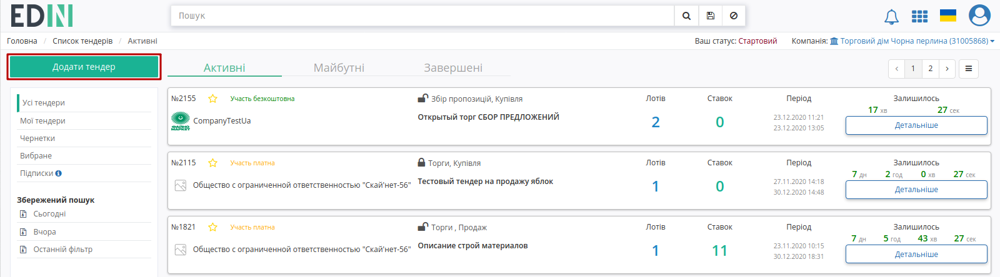

Після цього відкриється форма створення тендера:

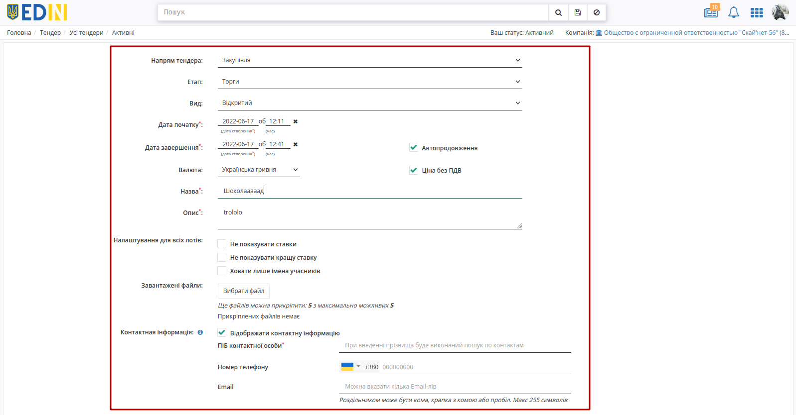

Разом з його лотами:

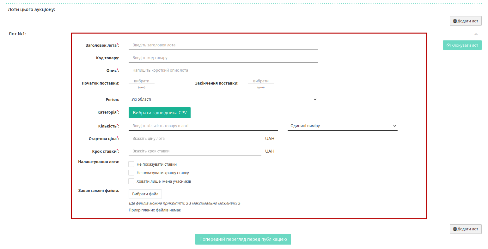

Форма створення тендера складається з "загальних налаштувань тендера" та "налаштувань лотів тендера". 

.. _tender-settings:

**3.1.1 Налаштування тендера**
~~~~~~~~~~~~~~~~~~~~~~~~~~~~~~~~~~~~

В налаштуваннях тендера Вам доступні наступні параметри (поля позначені червоною зірочкою :red:`* - обов'язкові до заповнення`):

* **Напрям тендера:** "Закупівля" чи "Продаж" (|закупівля| / |продаж|); 
* **Етап:** "Збір пропозицій" |рупор| / "Торги" |судья| / "Оголошення";

.. hint::
   Під час "Збору пропозицій" користувачі на рівні одного **акаунта** по кожному лоту можуть зробити ставку лише один раз. Для "Збору пропозицій" та "Оголошення" організатору чи `"Супер адміністратору" <https://wiki.edin.ua/uk/latest/Personal_Cabinet/PCInstruction.html#user-roles>`__ ) доступна можливість "Подовжити тендер" (кнопка) будь-яку кількість разів. Для "Оголошення" поля "Стартова ціна" та "Крок ставки" не обов'язкові до заповнення (користувачам обов'язково заповнювати "Коментар до ставки").

   .. image:: pics_Work_with_Tender/Work_with_Tender_97.png
      :align: center

* **Вид:** "Відкритий" чи "Закритий"(|відкритий| / |закритий| ); 
    * "Відкритий" тендер дозволяє всім користувачам сервісу переглядати информацію про тендер та його лоти; зробити ставку в "відкритому" тендері може будь-який користувач системи.
    * "Закритий" тендер НЕ відображається користувачам сервісу до початку тендера, а після його початку не запрошені користувачі можуть лише переглядати інформацію тендера. Приймати участь в тендері можливо по запрошенню Організатора або через "Подачу заявки" (детальніше в `Участь у "закритому" тендері <https://wiki.edin.ua/uk/latest/Tender_2_0/Work_with_Tender.html#closed-tender>`__). В закритому тендері додатково можливо заборонити показувати кількість ставок та лотів не запрошеним Учасникам:

    .. image:: pics_Work_with_Tender/Work_with_Tender_134.png
       :align: center
    
    Для таких Учасників дані по лотах та ставках не відображатимуться: 

    .. image:: pics_Work_with_Tender/Work_with_Tender_116.png
       :align: center

* **Дату та час початку/завершення** аукціону. Час і дата початку аукціону повинні бути налаштовані не менш ніж **+1 година** від часу заповнення поля. Час і дата завершення повинні бути налаштовані не менш ніж **+30 хвилин** від часу і дати початку аукціону;
* **Автопродовження** |magic| - відмітка-налаштування автоматичного продовження аукціону, коли один із Учасників робить ставку на останніх хвилинах перед завершенням аукціону. Тендер автоматично продовжується на вказану кількість хвилин (від 1 до 10), що дає час іншим Учасникам "перебити" ставку:

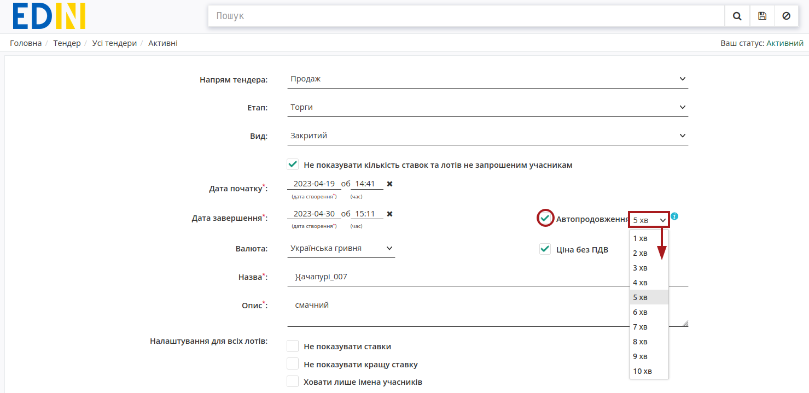

* **Валюта:** вибір валюти зі списку;
* **Ціна без ПДВ** - відмітка, про те що ціни лотів будуть вказані без ПДВ;
* **Назва:** короткий опис, інформація про тендер. Наприклад: Збір пропозицій, вівсяні пластівці;
* **Опис:** повний опис тендера - інформація, що дасть учасникам максимально повне уявлення про майбутній тендер. :green:`Організатор може змінити опис опублікованого аукціону та його лотів до старту аукціону`; 
* **Налаштування для всіх лотів:** 
    * **Не показувати ставки** - активована функція приховує список всіх ставок для учасників;
    * **Не показувати кращу ставку** - активована функція приховує тільки кращу ставку;
    * **Ховати лише імена учасників** - за активованої функції імена участників будуть відображатись в вигляді номера, котрий буде змінюватись з кожною ставкою. При цьому кращаставка та список будуть доступні для перегляду

.. important:: 
    Кожне налаштування виконує тільки одну дію! Всі налаштування можливо комбінувати між собою. Якщо Ви не визначили налаштування видимості, то інформація буде доступна всім користувачам EDIN-Tender. При створенні декількох лотів в одному аукціоні, є можливість використовувати налаштування, як для кожного лота індивідуально, так і для всіх відразу.

* **Завантажені файли:** доступна можливість прикріплення файлів до опису тендера (не більше 5 файлів в одному тендері з обмеженням розміру файлу до 5 МБ).

* **Контактна інформація:** при активованій відмітці можливо вказати контактні дані для оперативної комунікації з Організатором (в закритому аукціоні інформація відображається лише запрошеним учасникам). При цьому Email-адреси можливо додавати скопіювавши (Ctrl+C) список (значення через кому, пробіл чи крапку з комою) потрібних Email-адрес та вставши (Ctrl+V) їх з буфера обміну! 

.. important:: 
   При **редагуванні чернетки** для повторного завантаження файлів до аукціону чи лота перед збереженням чернетки потрібно натиснути **"Завантажити всі файли на сервер"**:

   .. image:: pics_Work_with_Tender/Work_with_Tender_75.png
      :align: center

**3.1.2 Налаштування лотів тендера**
~~~~~~~~~~~~~~~~~~~~~~~~~~~~~~~~~~~~

Після налаштувань загальних параметрів тендера необхідно виконати налаштування лотів.

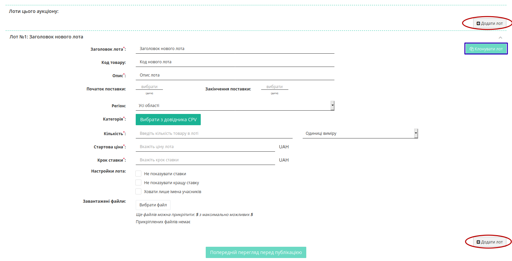

* Кнопка **"Додати лот"** створює додатковий лот (в одному аукціоні може бути до 25 лотів);
* **Заголовок лота:** поле для опису назви товару;
* **Код товару:** необов'язкове поле, що використовується для введення артикулу або коду товару згідно з Вашою обліковою системою;
* **Опис:** поле для більш детального опису товару. :green:`Організатор може змінити опис опублікованого аукціону та його лотів до старту аукціону`;
* **Початок / Закінчення поставки:** не є обов'язковими для заповнення, однак не повинні бути встановлені на дату раніше, ніж дата завершення аукціону;
* **Регіон:** перелік регіонів України (за замовчуванням встановлено значення "Всі області");
* **Категорія:** до якої категорії відноситься лот (не є обов'язковими для заповнення). :green:`Організатор може змінити категорію лота опублікованого аукціону до його старту.` При натисканні на кнопку **"Вибрати з довідника CPV"**, відкривається єдиний державний довідник товарних категорій, з'являється можливість вибрати категорію, до якої відноситься Ваш лот:

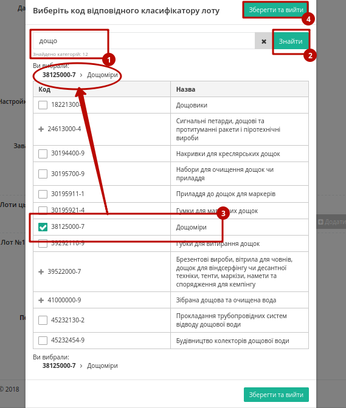

Можливо скористатись ієрархічним переходом до потрібної категорії чи пошуком: ввести назву категорії (1), натиснути **"Знайти"** (2), вибрати необхідну категорію (3) та натиснути на кнопку **"Зберегти та вийти"** (4);

.. attention::
   :red:`Для того, щоб скинути пошук в категорії необхідно натиснути` |хрестик| :red:`біля кнопки "Знайти"`

* **Кількість та одиниці виміру:** кількість товару, який вказаний в лоті та одиницю його виміру зі списку;
* **Стартова ціна:** початкова вартість за одиницю товару, яку Ви встановлюєте, як організатор. :green:`Організатор може змінити стартову ціну лотів опублікованого аукціону до його старту;`
* **Крок ставки:** мінімальна сума для зниження/підвищення ціни. Крок ставки вказується тільки при наявності стартової ціни.
* **Налаштування лота:** в разі якщо Ви не налаштували відповідні налаштування в загальних налаштуваннях тендера, у Вас є можливість **приховувати всі ставки, приховувати кращу ставку і приховувати імена учасників** для конкретного лота.  
* **Завантажені файли:** доступна можливість прикріплення файлів до опису лота (не більше 5 файлів в одному лоті з обмеженням розміру файлу до 5 МБ). :green:`Організатор може додавати/видаляти файли опублікованого аукціону до його старту;`
* Кнопка **"Клонувати лот"** створює ще один лот з ідентичними параметрами (зручно використовувати при додаванні подібних лотів).

Після установки всіх необхідних налаштувань, натисніть на кнопку **"Попередній перегляд перед публікацією"**, для збереження Вашого тендера в **"Чернетки"**.

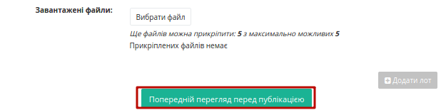

.. note::
    В разі, якщо при налаштуваннях тендера/лота були допущені явні помилки або незаповнені обов'язкові поля, то платформа повідомить про це:   

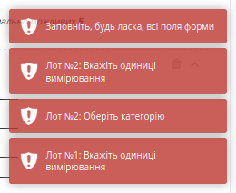

У каталозі **"Черновик"**, у вас є можливість **Редагувати** всі дані і налаштування Вашого тендера, після чого Ви можете **Опублікувати** тендер. При редагуванні всі учасники отримують e-mail та повідомлення про зміни на web.

.. note::
    **Завершити** достроково можливо лише активний (опублікований) тендер.

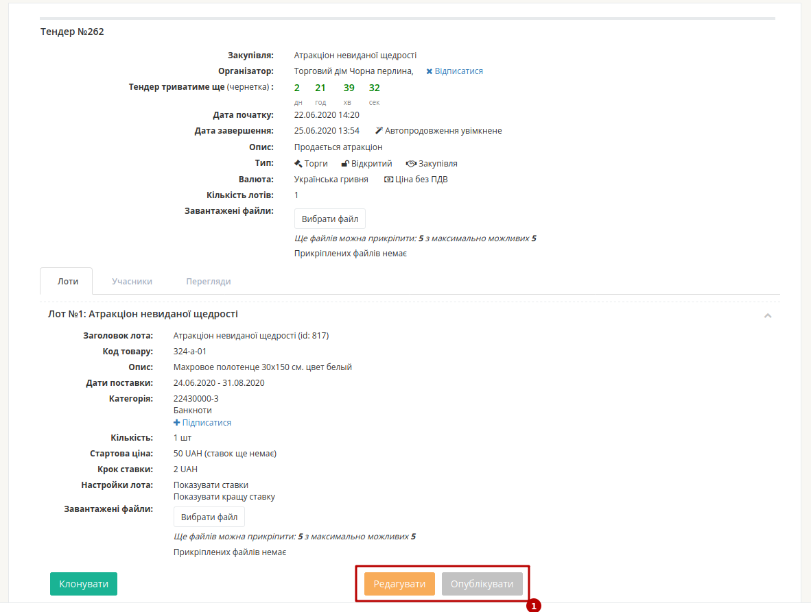

.. attention::
   Після публікації тендера (до його початку) до редагування доступні поля:
   
   * опис тендера
   * опис лота
   * категорія товару для лота
   * стартова ціна
   * вкладення тендера
   * вкладення лота
   * крок ставки
   * відмітка Автопродовження
   * відмітка Ціна без ПДВ
   * відмітка Не показувати ставки
   * відмітка Не показувати кращу ставку
   * відмітка Ховати лише імена учасників
   * кількість (лот)
   
   Після редагування всі учасники отримують e-mail та повідомлення про зміни в тендері.

В каталозі **"Чернетки"** або **"Завершені"** у Вас є можливість при натисканні на кнопку **"Клонувати"**, копіювати інформацію та налаштування обраного тендера для його подальшого редагування і подальшої публікації.

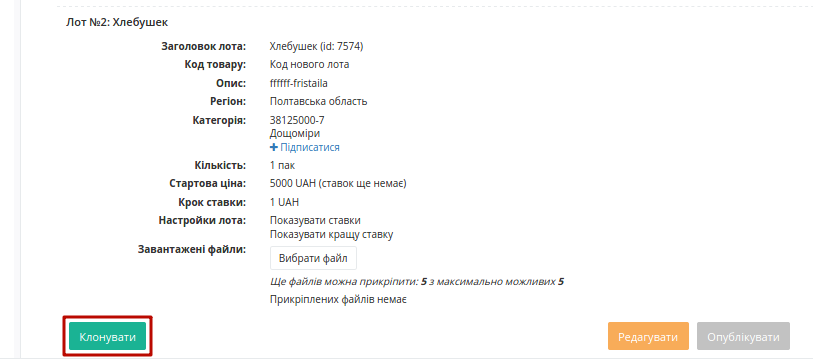

.. hint::
   Організатори при редагуванні та створенні нового тендера можуть також **"Клонувати"** лоти.

Після натискання на кнопку **"Опублікувати"**, Ваш тендер автоматично стає **"Активним"** а також з'являється в журналі тендерів в списку **"Усі тендери"**.

.. _share:

**3.1.3 Заявки на участь**
~~~~~~~~~~~~~~~~~~~~~~~~~~~~~~~~~~~~

.. attention::
   :red:`Якщо в налаштуваннях тендера було обрано "Закритий" Вид, то для участі бажаних учасників в тендері їх потрібно запросити (від імені Організатора аукціону). Запросити можливо, як зареєстровані так і незареєстровані на платформі компанії:`

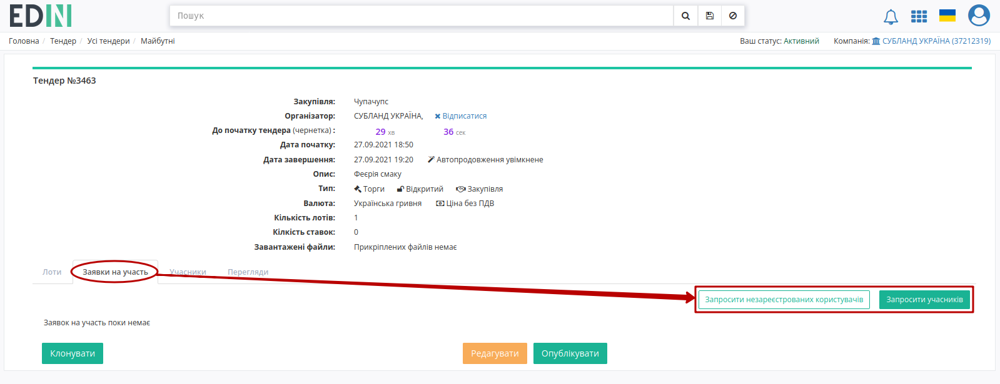

.. hint::
   Якщо при формуванні аукціона була обрана категорія/категорії ідентична до категорії, що встановлена до групи учасників (`"Довідник учасників" <https://wiki.edin.ua/uk/latest/Tender_2_0/Work_with_Tender.html#participants-group>`__), то всі учасники такої групи автоматично підтягуються у вкладку **"Заявки на участь"**! Система повідомляє про виконання автоматичних дій спливаючим повідомленням, а також у вкладці з посиланням на розділ функціоналу:

   .. image:: pics_Work_with_Tender/Work_with_Tender_130.png
      :align: center

   ⠀⠀⠀⠀⠀⠀⠀⠀⠀

   .. image:: pics_Work_with_Tender/Work_with_Tender_131.png
      :align: center

**3.1.3.1 Запросити учасників**   
****************************************************

У вікні для запрошення потрібно скористатись пошуковим рядком (пошук за назвою або кодом ЄДРПОУ/ІПН компанії - min 3 символи) та **"Обрати"** компанії чи власні групи компаній (`"Довідник учасників" <https://wiki.edin.ua/uk/latest/Tender_2_0/Work_with_Tender.html#participants-group>`__) за яким теж є власний пошуковий рядок. Обрані компанії автоматично потрапляють в список вибраних, після чого їх можливо **"Запросити"**:

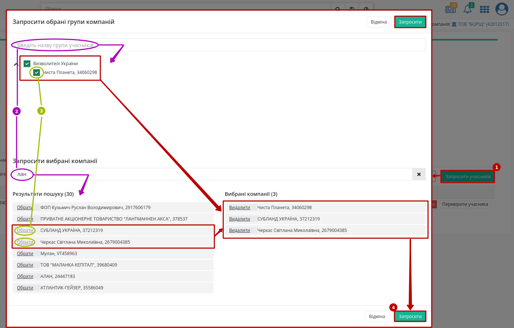

Помилково обраних учасників можливо **"Видалити"** зі списку вибраних. Запрошений "Учасник" може переглянути інформацію по тендеру і його лотам, а у "Організатора" в цьому тендері відобразиться список запрошених учасників:

.. image:: pics_Work_with_Tender/Work_with_Tender_003.png
   :align: center

**3.1.3.2 Запросити незареєстрованих учасників**
****************************************************

У вікні для запрошення потрібно вказати email-адреси потенційних учасників аукціону (в якості роздільника між адресами можливо використовувати кому, пробіл чи крапку з комою) та **"Відправити запрошення"**:

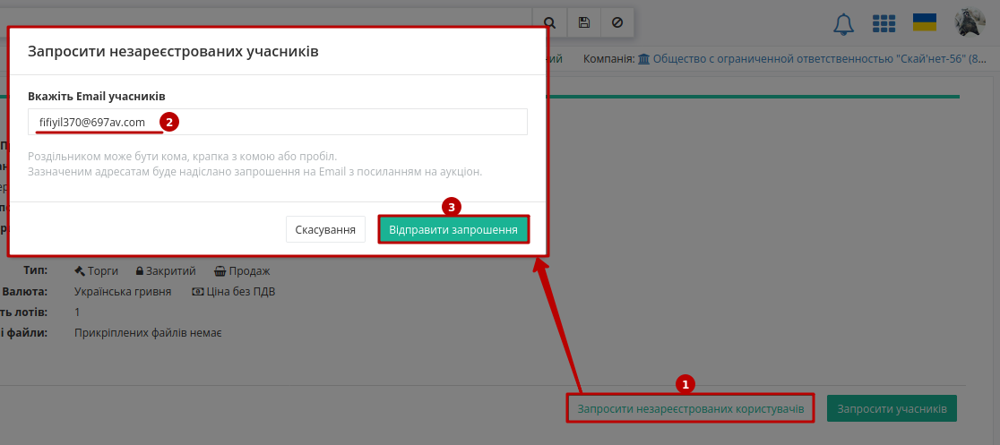

На вказані email-адреси від імені компанії-Організатора приходить запрошення до участі в аукціоні, що має посилання на аукціон та реєстрацію на платформі (посилання на реєстрацію діє 10 днів):

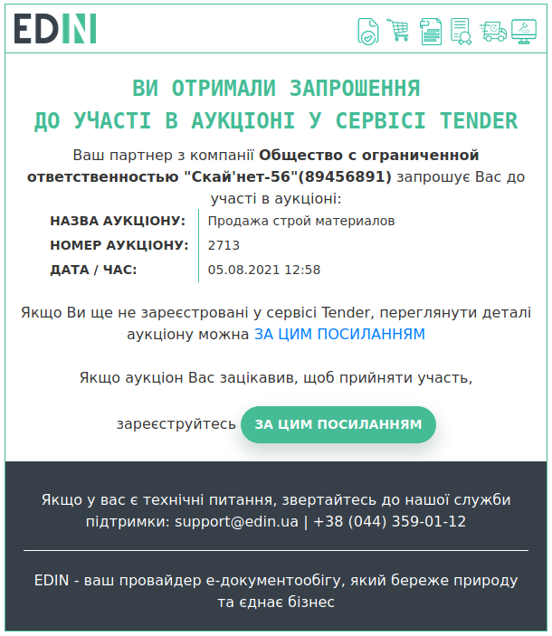

.. _confirm-reject:

**3.1.3.3 Схвалити/Відхилити заявку Учасника**   
****************************************************

Організатор за надісланими заявками на участь в закритому тендері мають прийняти рішення: **"Схвалити"** чи **"Відхилити"** заявку:

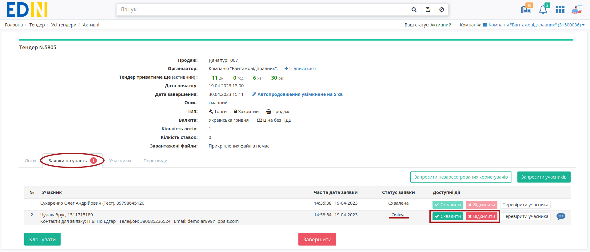

Прийняти рішення може допомогти додаткова інформація про контрагента (кнопка **"Перевірити учасника"**):

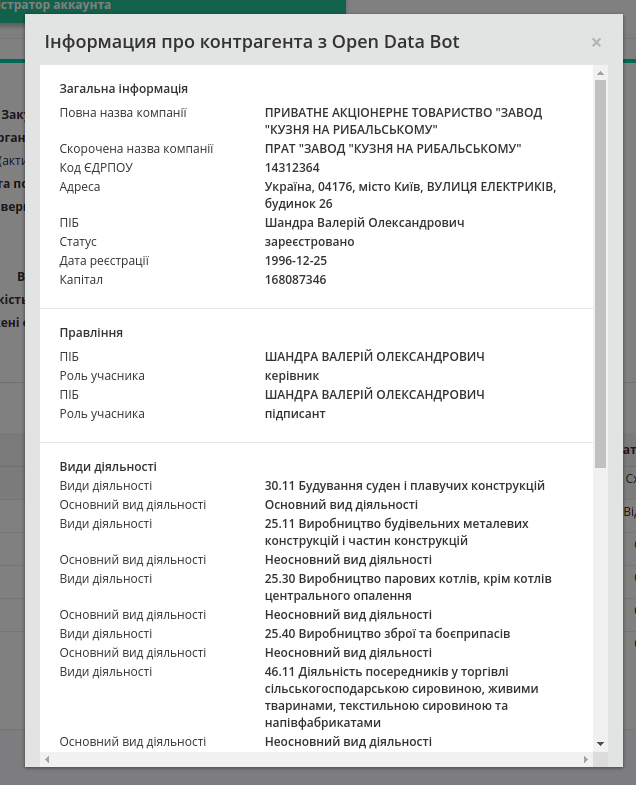

Якщо Учасник при формуванні заявки на участь в закритому аукціоні відправив коментар, то з ним можливо ознайомитись натиснувши на |comment|:

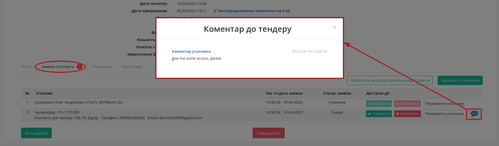

При **"Схваленні"** заявки опціонально можливо додати коментар для Учасника:

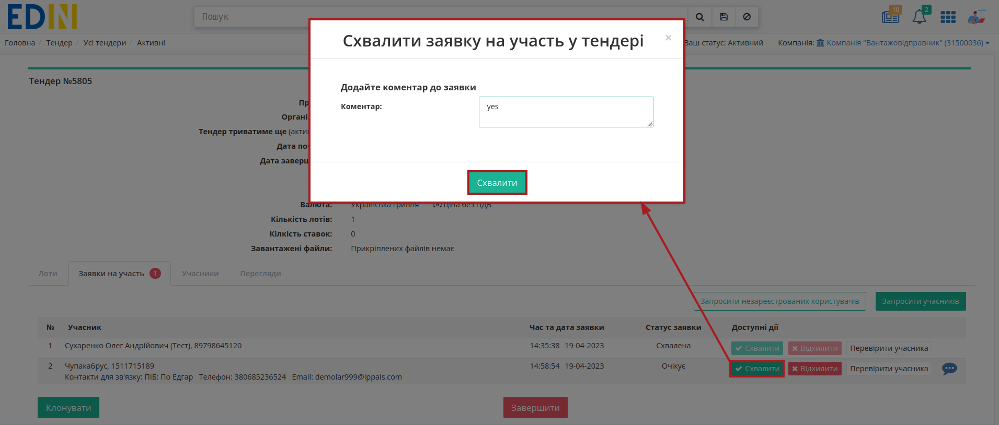

А от при **"Відхиленні"** коментар (причина відхилення) вже є обов'язковим:

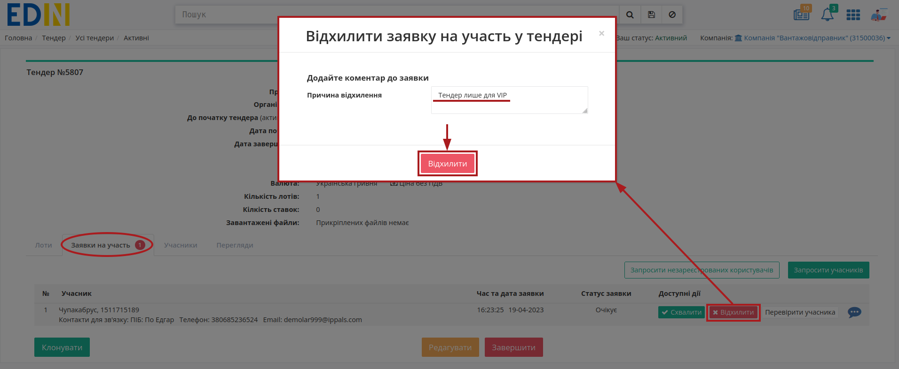

.. attention::
   :red:`Організатор чи Адміністратор його акаунта може запрошувати Учасників, безліч разів змінювати своє рішення за заявками Учасників кнопками "Схвалити/Відхилити", однак після того, як Учасник зробив ставку "Відхилити" його участь неможливо:`

   .. image:: pics_Work_with_Tender/Work_with_Tender_115.png
      :align: center

.. _participants:

**3.1.4 Учасники**
~~~~~~~~~~~~~~~~~~~~~~~~~~~~~~~~~~~~

Вкладка "Учасники" доступна лише для Організатора, що створив аукціон та `"Супер адміністратор" <https://wiki.edin.ua/uk/latest/Personal_Cabinet/PCInstruction.html#user-roles>`__ його акаунта). У вкладці відображаються всі участники, котрі зробили ставку хоча б в одному лоті. По учаснику виводиться ПІБ, email, номер телефону:

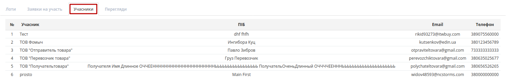

**3.1.5 Перегляди**
~~~~~~~~~~~~~~~~~~~~

Вкладка історії переглядів доступна лише компанії-**Організатору** і відображає дату і назви компаній, які переглянули більш детальну інформацію про даний тендер:

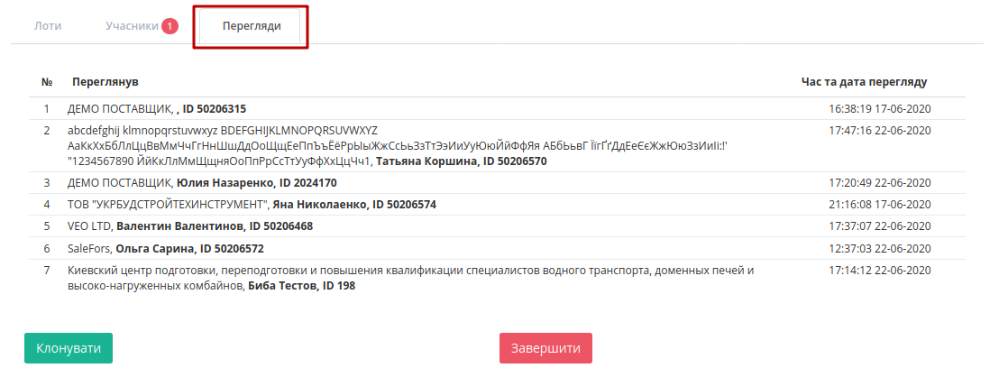

**3.1.6 Інше**
~~~~~~~~~~~~~~~~~~~~

Організатори по своїм завершиним тендерам можуть завантажити звіт (також відправляється на e-mail) в PDF/HTML/XLS форматі через кнопку **"Завантажити як"** :

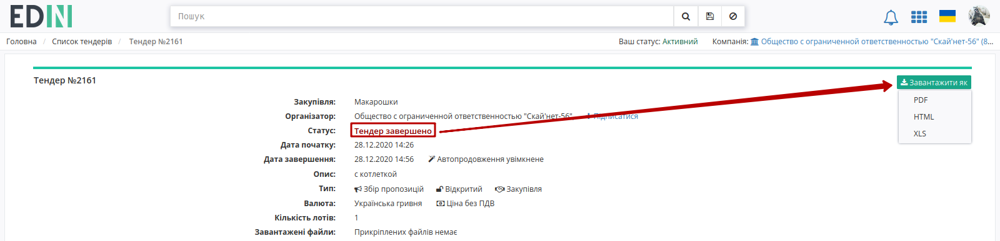

.. _tender-in:

**3.2 Участь в тендері**
-------------------------------------

Тендер (в залежності від налаштувань Організатора) може бути "відкритим" або "закритим".

**3.3 Участь у "відкритому" тендері**
---------------------------------------

Для того аби прийняти участь у "відкритому" тендері Вам потрібно перейти в **"Усі тендери"** і обрати з журналу **"Активних"** тендерів:

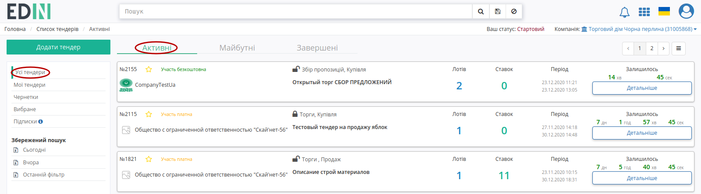

* Вибрати і натиснути на тендер в журналі, що Вас цікавить;
* У відкритому тендері зробити ставку по лоту (на кожен лот окрема ставка). При формуванні ставки можливо додати вкладення (до 5 файлів) за допомогою кнопки **"Вибрати файл"**.

.. hint::
    Зробити ставку можна тільки на лот активного аукціону, який розпочався 

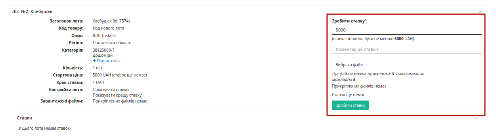

.. _closed-tender:

**3.4 Участь у "закритому" тендері**
---------------------------------------

В даних тендерах беруть участь тільки ті учасники, участь яких була раніше підтверджена Організатором. Для цього необхідно подати заявку на участь або бути запрошеним організатором (в останньому випадку Учасник отримує повідомлення на e-mail про те, що він запрошений до участі в закритому тендері).

Для того, щоб подати заявку, необхідно перейти в тендер, і натиснути на кнопку **"Подати заявку"**:

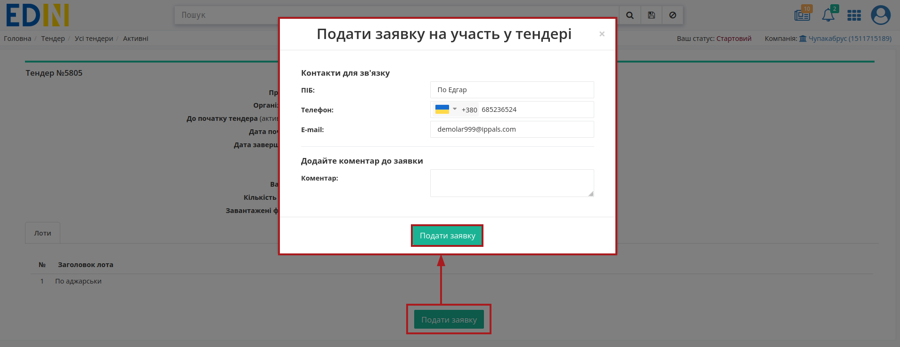

Після чого відкриється модальне вікно з Вашими контактними даними (їх можливо змінити) та полем для коментаря Організатору аукціону. Після того, як Ви подасте заявку на екрані з'явиться повідомлення про те, що Ваша заявка була успішно відправлена Організатору, а у вкладці **"Зявки на участь"** Ви можете переглянути дані своєї заявки:

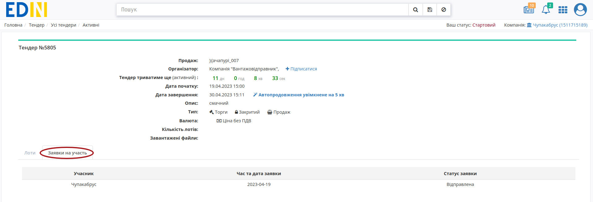

В розділі **"Мої тендери"** за усіма відправленими заявками відображається іконка-статус зі спливаючою підказкою:

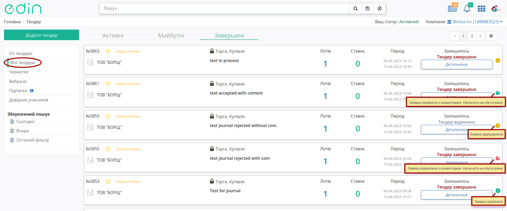

* |waiting| - заявка відправлена і очікує відповіді Організатора
* |approved| - заявка прийнята Організатором
* |approved+| - заявка прийнята Організатором (з коментарем)
* |rejected| - заявка відхилена Організатором (містить коментар)

Для ознайомлення з коментарем Організатора за заявкою потрібно натиснути мишкою на відповідну іконку:

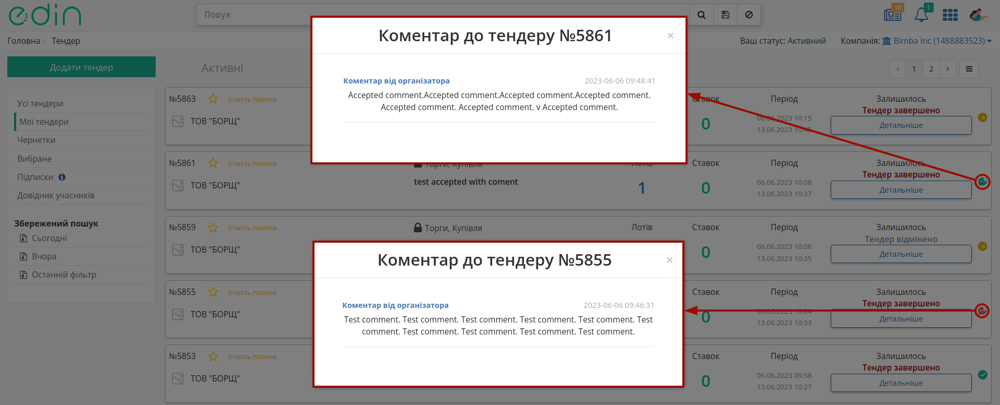

У Організатора в тендері, на який була подана заявка у вкладці **"Заявки на участь"** відображається кількість запитів, що очікують відповіді:

Коли Організатор прийме рішення за Вашою заявою, ви отримаєте повідомлення на e-mail, по цьому тендеру відобразиться інформація по лотам, з'явиться можливість зробити ставку. Якщо Організатор дасть відповідь з коментарем, то з ним також можливо буде ознайомитись у вкладці **"Заявки на участь"** за допомогою кнопки |comment|:

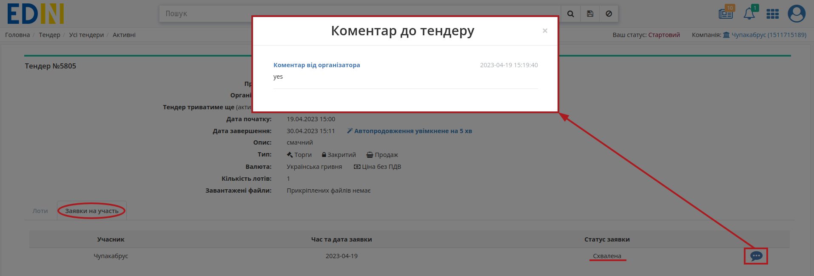

.. note::
   Якщо Організатор відхилить заявку повторно відправити її не буде можливо

.. _lots:

**3.5 Ставки**
---------------------------------------

Ставка може перебувати в статусі:

* **Краща ставка** - найкраща ставка по лоту;
* **Ставку перебито** - ставка, що була перебита іншою ставкою;
* **Ставка видалена організатором** - ставка, що була видалена організатором аукціону (детальніше в наступному підрозділі).

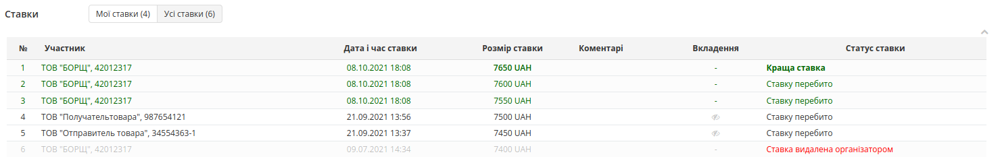

До Вашої зробленої ставки можливо додати вкладення (до 5 файлів) за допомогою кнопки **"Вибрати файл"**:

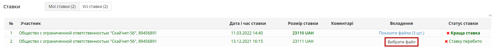

Кнопка **"Показати файли"** дозволяє переглянути і вивантажити додані до ставки файли:

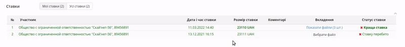

.. _bid-deletion:

**3.5.1 Видалення ставки**
~~~~~~~~~~~~~~~~~~~~~~~~~~~~~~~~~~~~~~~~~~~~~~~~~~~~~~~~~~~~

Видалення ставок виконується лише зі сторони Організатора тендера, однак у Учасників є можливість створити запит на видалення ставки.

**3.5.1.1 Створення запиту на видалення ставки Учасником**
********************************************************************************************************

Для формування запиту видалення ставки Учаснику потрібно натиснути на іконку хрестика біля своєї ставки та вказати причину її видалення:

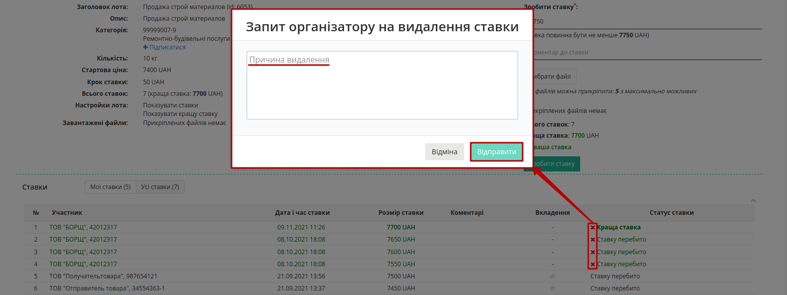

Після відправки заявки на видалення обрана ставка отримує додаткову відмітку в статусі про те, що :orange:`"Учасник подав заявку на видалення"`, а причина видалення відображається при наведенні курсора на комірку статусу:

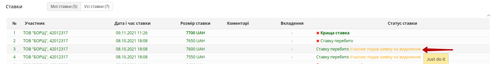

**3.5.1.2 Видалення ставки Організатором**
********************************************************************************************************

Якщо ініціатором видалення ставки виступає Учасник (відправляє запит на видалення ставки), то Організатору приходить повідомлення на платформі, а також на email:

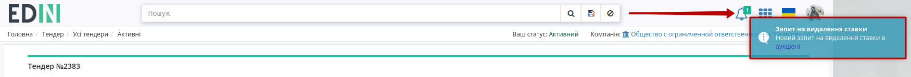

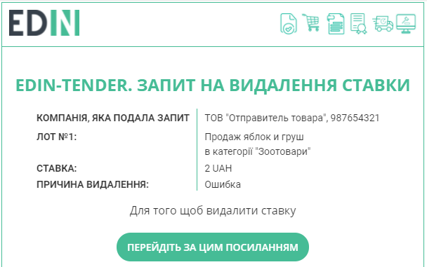

Такі ставки мають додаткову відмітку в статусі про те, що :orange:`"Учасник подав заявку на видалення"`, а причина видалення відображається при наведенні курсора на комірку статусу:

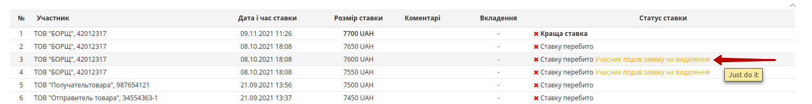

Зі сторони "Організатора" (користувач, що створив тендер чи `"Супер адміністратор" <https://wiki.edin.ua/uk/latest/Personal_Cabinet/PCInstruction.html#user-roles>`__) може видалити помилкову ставку конкретного учасника:

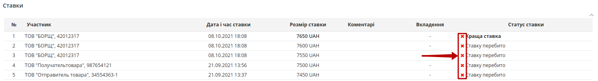

При цьому обов'язково вказується причина видалення:

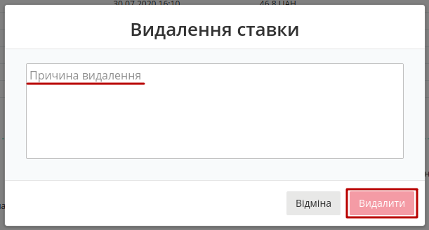

При видаленні ставки учасники отримують повідомлення у вигляді коментаря, а статус ставки змінюється на :red:`"Ставка видалена організатором"`:

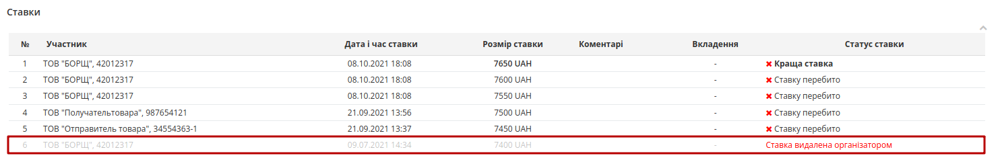

--------------------------------

.. include:: /_constant/kontakti.rst
