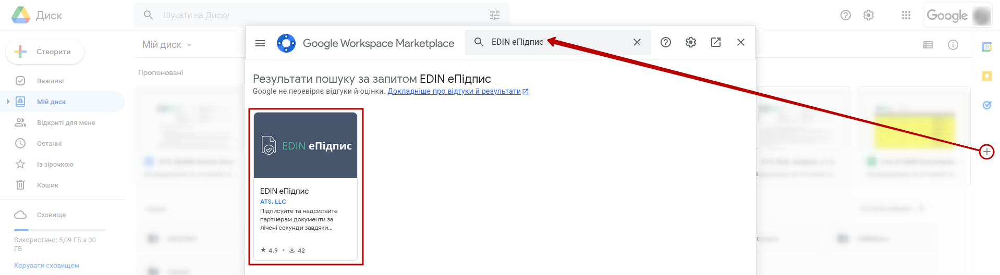
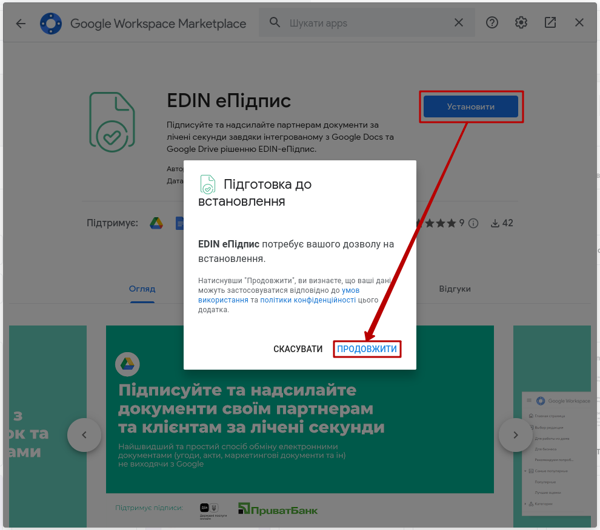
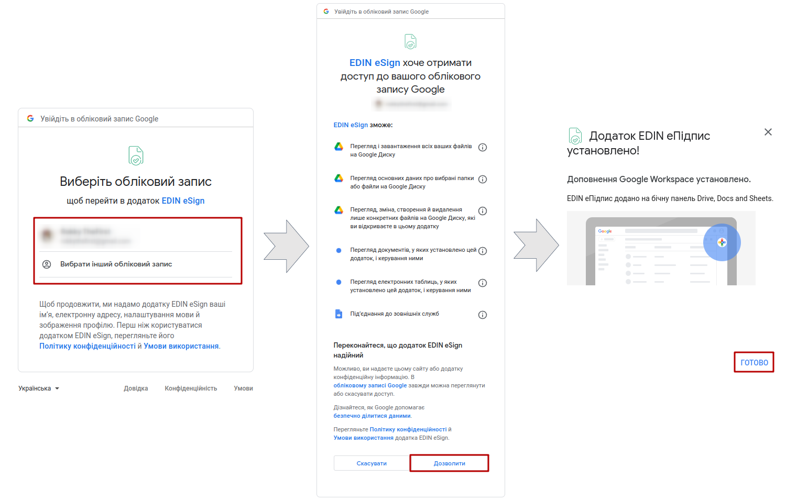
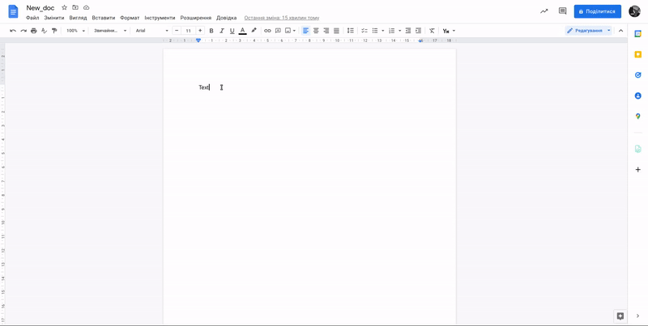
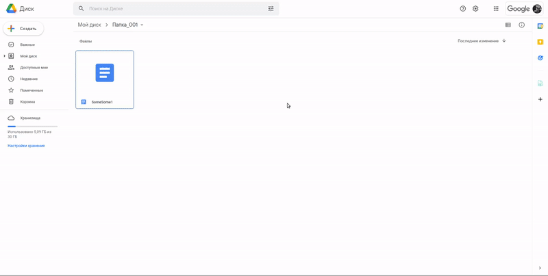
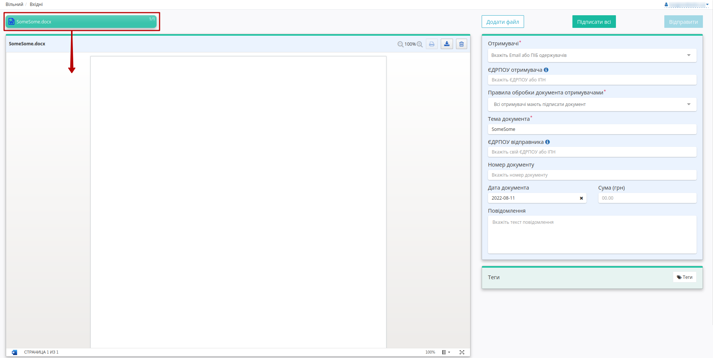

#################################################################################
Віджет
#################################################################################

.. картинки:

.. contents:: Зміст:
   :depth: 4

---------

Вступ
==========================

Для обміну документами зі своїми контрагентам прямо з Вашого Google Диску був розроблений віджет **"EDIN еПідпис"**. Віджет дозволяє просто та безкоштовно підписувати / відправляти / отримувати / завантажувати документи. Розширте свої можливості роботи з партнерами! 

.. _widget-install:

1 Підключення віджета **"EDIN еПідпис"**
==============================================

.. note::
   Робота з віджетом передбачає наявність та авторизацію в Google акаунті!

Для підключення віджета **"EDIN еПідпис"** Ви можете пройти за `посиланням <https://workspace.google.com/u/0/marketplace/app/edin_%D0%B5%D0%BF%D1%96%D0%B4%D0%BF%D0%B8%D1%81/587777684212>`__ чи самостійно знайти віджет за назвою в Google Workspace Marketplace:

Далі потрібно **"Установити"** віджет (перед початком встановлення віджета Вам потрібно ознайомитись з правилами та політикою конфіденційності та **"Продовжити"** установку):

Залишається обрати обліковий запис, **"Дозволити"** віджету працювати і **"Готово"** : тепер Ви можете обмінюватись документами з Вашими контрагентами!

2 Вибір файлу (формування документа через **"EDIN еПідпис"**)
=====================================================================

Після підключення віджета **"EDIN еПідпис"** він буде доступний в боковій панелі Google Диску, а також при перегляді Google Документів чи Google Таблиць:

.. hint::
   При роботі з віджетом у вікні Google Диску потрібно спочатку обрати файл:

   .. image:: pics_Widget_Vilnyi/Widget_Vilnyi_008.png
      :align: center

Поля "Тема" та "Дата" в віджеті автоматично заповнюється з назви обраного файлу та поточною датою. Для зручності віджет дозволяє перед підписанням/відправкою файлу конвертувати його в PDF формат (активований перемикач "Підписати документ в форматі PDF"). Файл одразу можливо **"Підписати"**:

Ви автоматично перейдете до віджета з підготовленим файлом в DOCX/XLSX/PDF форматі в залежності від того, який було обрано файл (Google Документ чи Google Таблиця) та активності відмітки "Підписати документ в форматі PDF":

Віджет має ідентичний функціонал, правила і поведінку, що й сервіс EDIN "Вільний" (`детальніше в інструкції за посиланням <https://wiki.edin.ua/uk/latest/Vilnyi/Work_with_Vilnyi.html#create-and-send>`__) й давно знайомий його користувачам. Отримувачі можуть ідентифікувати Вас за поштою (Google акаунтом, в якому встановлено віджет) і відправляти.

.. note::
   Якщо Ви обрали файл, що вже відправлявся чи передавався до відправки через віджет **"EDIN еПідпис"**, то у віджеті відображається список відправлених документів (іконка |sent|) та остання чернетка ():

   .. image:: pics_Widget_Vilnyi/Widget_Vilnyi_012.png
      :align: center

   У віджеті можливо переглянути дані відправлених документів (1), переглянути всі відправлені через віджет документи за допомогою кнопки **"Мої документи"** (2), перейти до редагування чернетки (3) чи ще раз **"Створити"** (4) документ, додавши до нього обраний файл:

   .. image:: pics_Widget_Vilnyi/Widget_Vilnyi_013.png
      :align: center

-------------------------------------

.. include:: /_constant/kontakti.rst

